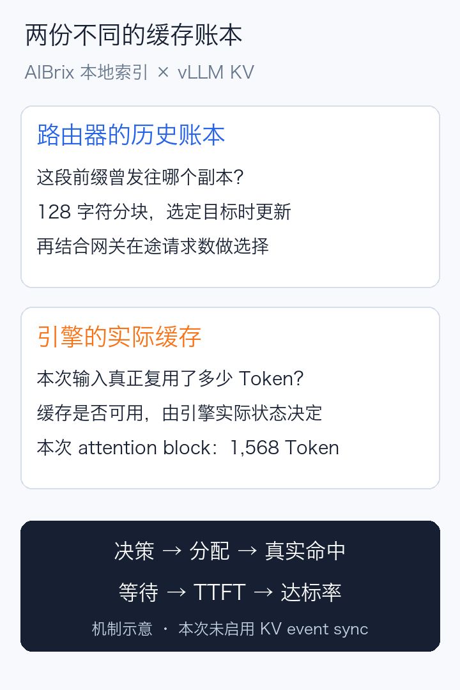
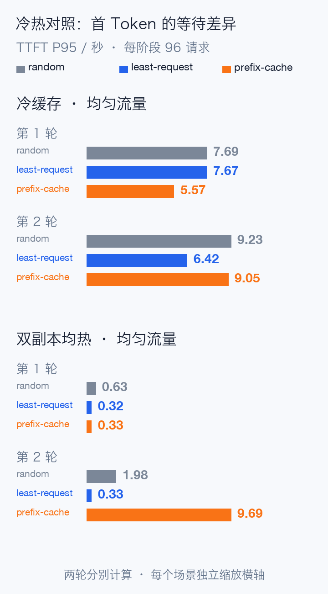
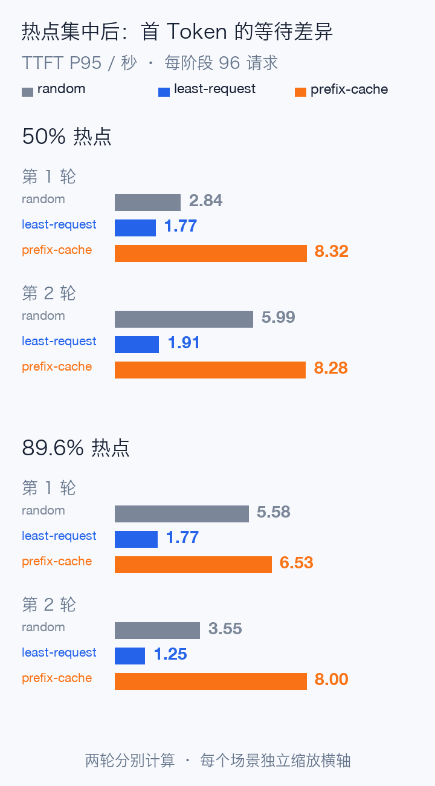
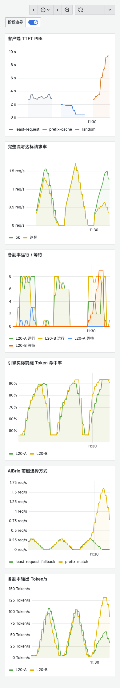

# 用 AIBrix 做路由实测：缓存命中了，请求为什么还在等？

Qwen3.8-27B 是一个 270 亿参数的稠密视觉语言模型，采用 Gated DeltaNet 与 Gated Attention 组合的混合架构，官方提供 FP8 权重。这次我们使用 Qwen3.8-27B-FP8，在 Kubernetes 上部署两个 vLLM 副本，每个副本一张 L20，配置为纯文本、32K 上下文、关闭 MTP。

模型只是负载载体。真正要验证的是：**AIBrix 把请求送到不同副本之后，到底改变了什么？**

AIBrix 为 Kubernetes 推理服务提供模型感知路由、扩缩容等能力。接上 Prometheus、画出 Token/s，还不足以证明路由有效。我们需要把它的选择与引擎缓存、等待队列、用户延迟联系起来。

这轮使用 AIBrix v0.7.0，对照 random、least-request、prefix-cache 三种策略，分别控制冷缓存、双副本均热、50% 热点和近 90% 热点；两轮反转执行顺序，共 24 个正式阶段。

实际发出 2,304 条正式请求，2,304 条完整返回，失败 0，客户端丢弃 0。下面的达标数还要进一步满足延迟目标，不能与 HTTP 200 混为一谈。

## 先想象两位客服和八本手册

两位客服共同处理八本产品手册的问题。

random 随机找人，同一本书可能两个人都要重新翻；least-request 优先找在途任务少的人；prefix-cache 则尽量找已经读过这本书的人，复用之前的计算。

但如果一半问题来自同一本手册，那位“熟悉业务的客服”可能越来越忙。**省下的翻书时间，不一定抵得过排队时间。**

本次没有启用 KV event sync。AIBrix 使用 128 字符分块的本地前缀索引，在选定目标副本时记录请求历史；它知道的是“这段前缀曾发给谁”，并非引擎实时确认的缓存清单。

因此，网关里的 prefix_match 与 vLLM 的真实 Token 命中率，必须分别观察。缓存是否仍在、能复用多少输入，最终要看引擎指标。

## 冷缓存时，路由能少做重复计算

每个正式阶段先等待引擎空闲并清理 KV，再给八组前缀换一套位于最前面的 salt，隔离上一阶段的路由记录。所有策略使用相同的请求类别顺序和到达率。

每组 96 次计划到达，1.6 RPS，输入约 5K token，固定输出 128 token。达标要求完整流成功，并同时满足 TTFT ≤ 2 秒、TPOT ≤ 150 毫秒、总耗时 ≤ 30 秒。

第一轮冷缓存下，random、least-request 的真实 Token 命中率都约 77.7%，prefix-cache 为 85.4%；对应 TTFT P95 分别是 7.69、7.67、5.57 秒。前缀局部性确实减少了一部分重复 Prefill。

但输出吞吐并没有一起提高：按完整阶段、包含尾部请求排空计算，prefix-cache 约 171.8 Token/s，另外两种约 184.6–184.7 Token/s。不能据此写成“全方位加速”。

**第二轮没有照搬第一轮的优势。** prefix-cache 的 TTFT P95 为 9.05 秒，least-request 为 6.42 秒，random 为 9.23 秒。前缀命中率仍约 85.4%，但排队改变了尾延迟。两轮都保留，不能只选第一次好看的结果。

当八组前缀在两个引擎里都提前预热，第一轮三种策略均为 96/96 达标，least-request 和 prefix-cache 的 TTFT P95 都在 0.32–0.33 秒左右。

但第二轮 prefix-cache 的 TTFT P95 升到了 **9.69 秒，只有 43/96 达标**，两个引擎实际命中率仍约 93.1%。为什么？

核对引导记录后发现，第一轮路由索引是四组归 A、四组归 B；第二轮变成了六组归 A、两组归 B，最终分配为 70/26。引擎两边都有 KV，路由器的历史账本却不知道所有位置都能命中。

就像两位客服都读过手册，前台登记簿却把六本书只登记在同一个人名下，照样会排长队。这里的直接预热只控制了引擎 KV，没有固定路由索引布局，因此不能把两轮冷、热差值全部归功于预热。

## 50% 热点：93% 命中率背后的长队

热点实验先让八组测量前缀形成每个副本各四组的初始布局，再把 48/96 次请求集中到其中一组。这样，测量开始前的文档数量均衡，但请求热度不均衡。

第一轮结果如下，全部请求都完整返回。

| 策略 | TTFT P95 | 达标请求 |
| --- | ---: | ---: |
| random | 2.84 秒 | 78/96 |
| least-request | 1.77 秒 | 96/96 |
| prefix-cache | 8.32 秒 | 38/96 |

prefix-cache 的真实 Token 命中率最高，达到 **93.3%**，网关也记录了 **96 次 prefix_match**。但逐请求的 target-pod 显示，两个副本实际收到了 27 和 69 个请求；较忙副本的五秒快照等待峰值为 8，另一个为 0。

缓存复用没有失效，问题出在请求集中后的等待。它的 TPOT P95 约 59.8 毫秒，低于 least-request 的约 71.6 毫秒；生成阶段更顺畅，用户却更晚看到第一个字。

反转策略顺序后，第二轮 50% 热点下，prefix-cache 的 TTFT P95 为 8.28 秒、37/96 达标；least-request 为 1.91 秒、94/96 达标。

## AIBrix 为什么没有立刻把请求分走？

这需要回到具体版本与参数，而不能只凭算法名称猜测。

本次 v0.7.0 的本地索引分支，使用网关在途请求数判断负载。实际配置要在最大、最小在途数之差**超过 16**时，才把前缀匹配候选限制到最空闲副本；另一个筛选条件是“在途数不超过平均值加两倍标准差”。

只有两个副本时，后一个条件的上限足以容纳较忙的副本。因此，这套参数对缓存局部性较宽容，并不是一看到引擎排队就立刻迁移请求。

这也解释了为什么不能把引擎的 max-num-seqs=8，误当作网关在途请求最多只有 8 个：排队中的请求同样可能尚未完成。

第一轮近 90% 热点时，网关记录到 1 次负载保护事件和 1 次 least-request 回退，最终分配变为 38/58，TTFT P95 为 6.53 秒、68/96 达标。比 50% 热点时更均衡，说明算法的保护分支确实改变了后续分配；但它仍没有达到同场景 least-request 的 96/96 达标水平。

读这张图时，可以从上到下对照：客户端 TTFT、完整流与达标请求率、每副本等待、真实 KV 命中、AIBrix 前缀选择和输出吞吐。最后一段是 prefix-cache：命中率提高，较忙副本的等待和 TTFT 也同步上升，达标请求率与完整成功率拉开距离。

看板使用一分钟滑动窗口与直方图估计；表格则由逐请求记录计算整轮 P95，两者不能直接当成同一个数。

## 生产中怎么用这组结论

首先确认业务是否真的有稳定共享前缀。相同 system prompt、RAG 文档、多轮上下文都可能产生复用，但把随机 nonce 或时间戳放在最前面，会破坏后续长文本的前缀局部性。

本次合成 Prompt 是“文档标识 + 重复正文 + 变化的问题编号”。例如正文使用下面这句英文重复 300 次，末尾追加不同问题编号：

> The service tracks request latency, token throughput, cache utilization, and healthy replicas.

这是性能负载，不是模型回答质量评测。完整的 salt、预热和请求字段在公开文档中列出。

其次，用业务延迟目标选择路由。长输入、短输出与高复用适合关注重复 Prefill；热点强、输出长或单副本等待明显时，必须同时比较队列和达标请求，不能按缓存命中率排序。

再者，把路由与扩容分开验证。先固定两个副本比较策略，再叠加扩缩容；新副本是否有 KV、路由器是否知道其状态、多久能形成可用容量，都需要额外证据。

最后，按自己的副本数量和容量调整负载门槛。本次没有修改共享网关进行阈值扫描，16 / 2 不是推荐给所有集群的最优配置；KV event sync、多网关状态同步和长期稳定性，也没有被这组短窗口实验覆盖。

这次更有价值的结果，是用同一条证据链同时看见了路由的收益与代价：**少做重复计算是一个目标，让请求按时完成才是服务目标。**

文末“阅读原文”包含完整两轮数据、逐请求记录、可复算脚本、Grafana JSON、测试方法与修复说明。测试结束后释放专用 GPU 副本。

参考资料：

Qwen3.8-27B-FP8 模型说明：https://huggingface.co/Qwen/Qwen3.8-27B-FP8

AIBrix 概览：https://aibrix.readthedocs.io/latest/getting_started/overview.html

AIBrix v0.7.0 前缀路由源码：https://github.com/vllm-project/aibrix/blob/v0.7.0/pkg/plugins/gateway/algorithms/prefix_cache.go
