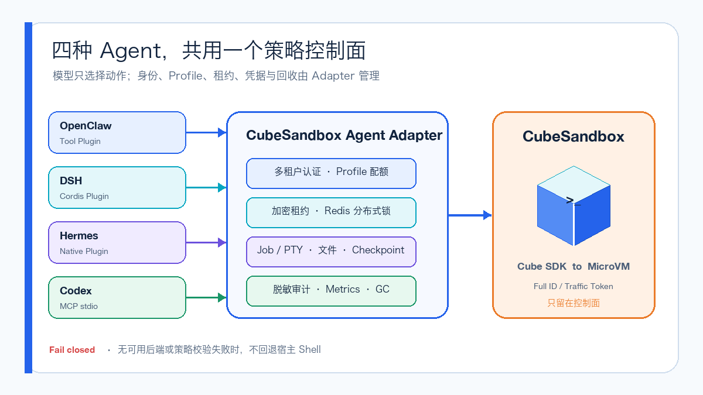
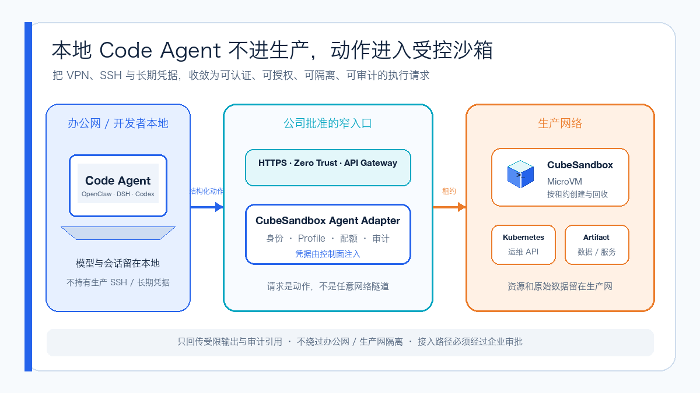
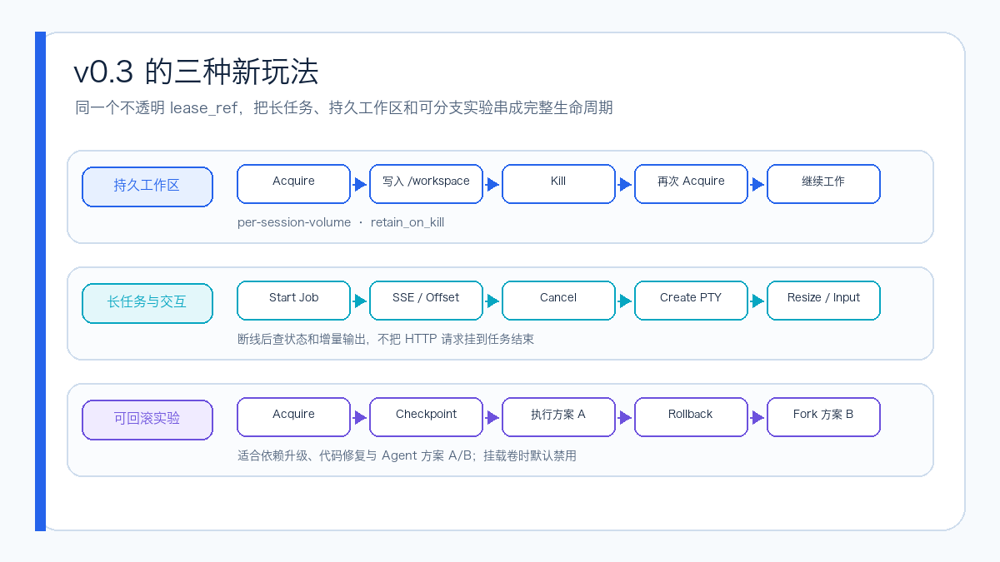

# CubeSandbox Agent Adapter v0.3：四种 Agent 开始共用长任务、回滚和分支

上一次，我把 OpenClaw、DeepSeek Harness（DSH）和 Hermes Agent 接到了同一个 CubeSandbox 执行控制面。

当时最想解决的问题很直接：三种 Agent 可以有自己的对话、编排和插件，但不可信代码不应该各自在宿主机执行，也不应该让每一种 Runtime 都保存一套 CubeSandbox 管理凭据。

`v0.2.0` 把这条路跑通了。Agent 只拿不透明租约，Adapter 负责固定策略、MicroVM 生命周期和脱敏审计。

但它也留下了几个真正用起来才会遇到的问题：Adapter 重启后租约怎么办？一条任务跑几十分钟，HTTP 连接断了怎么办？下一轮会话能不能继续使用工作区？Agent 做依赖升级或代码修复时，能不能保存现场、失败回滚，再从同一个节点分叉另一套方案？

2026 年 9 月 2 日，项目主分支完成了面向 `v0.3.0` 的代码更新；9 月 4 日，`v0.3.0` 标签和 GHCR 多架构镜像正式发布。这次还增加了第四种客户端：Codex 可以通过本地 MCP stdio Facade 进入同一个控制面。

先把结论放在前面：**v0.2 解决的是多 Agent 接入，v0.3 开始解决状态、长任务和多租户治理。**

镜像地址是 `ghcr.io/aik8s/cubesandbox-agent-adapter:v0.3.0`，同时支持 `linux/amd64` 和 `linux/arm64`。本文测试的核心功能提交是 `a692074`，`v0.3.0` 标签指向提交 `e7ca13c`。目前 GitHub Release 列表还没有单独的 v0.3.0 说明页，但标签和镜像已经可以直接使用。

## 四种 Agent，只保留一条执行路径

现在的调用关系是这样的：



OpenClaw 使用 Tool Plugin，DSH 使用 Cordis Plugin，Hermes 使用 Native Tool Plugin；Codex 和其他 MCP Host 则通过本地 `stdio` MCP Facade 接入。

它们的界面和 Agent Loop 不需要变成同一种东西。统一的是中间这层边界：

- Adapter 持有 CubeAPI、CubeProxy、完整 Sandbox ID 和 Traffic Token；
- Runtime 与模型只看到不透明的 `lease_ref` 和短 Sandbox 引用；
- 模型可以选择执行、读写、长任务、Checkpoint 等动作，但不能选择底层模板、CIDR、公开流量和生命周期策略；
- 无可用后端或策略校验失败时直接拒绝，不回退宿主 Shell。

OpenClaw、DSH 和 Hermes 当前共享 13 个 Agent 工具，覆盖命令、状态、文件、异步 Job、Checkpoint、Rollback、Fork 和释放。Adapter 的 OpenAPI 则扩展到 34 条路径，还包含二进制制品和 PTY 接口。

## 办公网里的 Agent，怎么安全使用生产资源

这个 Adapter 还有一个更贴近企业现实的场景。

很多人已经习惯在自己的笔记本或办公网开发机上使用 Code Agent。编辑器、代码仓库、个人配置和会话历史都在本地，使用体验最好；但真正需要处理的制品库、Kubernetes API、内部服务、日志和数据，往往只存在于隔离的生产网络。

最直接的做法，是把生产 VPN、SSH Key、跳板机账号或长期 Token 交给本地 Agent。问题也很明显：模型生成的一条命令，可能同时获得过宽的网络和主机权限。

另一个方向是把完整 Agent Runtime 部署进生产网，但这会把模型配置、会话历史、插件和更多第三方依赖一起带进高信任区域。把生产日志或数据复制到办公网分析，同样会制造新的敏感数据副本。

更合理的方式，是让本地 Agent 不进生产，只让经过授权的动作进入一个受控沙箱。



Agent 仍运行在用户熟悉的本地环境，通过公司批准的 HTTPS、Zero Trust 或 API Gateway 入口提交结构化动作。Adapter 在生产网内完成身份校验、Profile 授权、配额和租约管理，再让 CubeSandbox MicroVM 靠近生产资源执行。

这样可以把原本宽泛的远程权限，收敛成几个可以验证的控制点：

- 谁发起请求，可以映射到 Tenant、Runtime 和 Role；
- 能做什么，由 Profile 的网络、路径、生命周期和配额决定；
- 在哪里执行，由按租约创建的 MicroVM 隔离；
- 凭据由 Adapter、工作负载身份或平台侧短期注入机制持有，不写进 Prompt；
- 返回什么，可以限制为必要输出、状态和审计引用；
- 任务结束后，有明确的 Release、TTL 与 GC。

这里说的“可信执行”，不是说模型生成的代码天然正确，而是**执行边界和证据链可以被验证**。即使模型给出错误命令，Blast Radius 也应被 Profile、MicroVM、网络策略、最小权限凭据和生命周期控制住。

这个模式可以用于经过授权的生产排障、内部制品构建与扫描、敏感文档检查、只读数据分析，以及一次性运维验证。每类任务仍应使用独立 Profile 和最小权限身份，而不是准备一个万能的 `production-admin` Profile。

还有一点很重要：Adapter 不是绕过办公网与生产网隔离的隧道。如果两侧没有获批链路，仍然需要企业网关、受控 VPN、零信任访问或拉取式任务队列。它解决的是获批链路之后，怎样把“任意远程访问”变成一个可认证、可授权、可隔离、可审计、可回收的执行接口。

## v0.3 到底变了什么

如果只看接口数量，很容易把这次升级理解成“多了几个工具”。真正重要的是状态模型发生了变化。


`v0.2.0` 的租约保存在进程内存里，适合证明方案可行。`v0.3.0` 增加了加密 Redis 状态和可续期分布式锁。Adapter 重启后可以恢复自己对租约和 Job 的记录，多副本也不会同时修改同一个租约。

这里有一个挺好的防误用设计：如果 Helm 配置了多个 Adapter 副本，却没有启用 Redis，Chart 会直接失败。它不会把“Pod 数量变成 2”伪装成高可用。

认证也从一个共享 Bearer Token 扩展到：

- 每租户 Bearer Principal，可以限定允许的 Runtime 和 Profile；
- OIDC JWT，通过 JWKS、Issuer 和 Audience 校验；
- TLS 和 mTLS；
- 与 Bearer Token 分离的 Session HMAC Key。

这意味着日常轮换访问 Token 时，不会顺手改变 Session 的伪匿名关联键。

## 三种我最想用的新玩法



### 1. Kill 了 MicroVM，工作区还可以回来

`persistent-code` 会给一个 Session 分配独立 Volume，把 `/workspace` 保留下来。

第一轮任务可以拉代码、安装依赖、生成中间结果；MicroVM Kill 后 Volume 不删除。同一个 Session 下一次 Acquire 时，可以重新挂载并继续工作。

它比较适合代码 Review、多轮修复和需要反复进入环境的任务。持久化的只是工作区，不代表模型获得了任意宿主路径：读写仍限制在 `/workspace` 和 `/tmp`，命令时间、输出、文件大小和并发数也继续受 Profile 控制。

### 2. 长任务断线后，可以继续查进度

过去同步执行一条长命令，HTTP 请求往往要一直等到任务结束。网络闪断之后，客户端很难判断任务到底还在跑、已经完成，还是需要重来。

v0.3 的 Durable Job 把流程拆成启动、查询、增量读取和取消。客户端拿到 `job_ref` 后，可以按 Offset 继续读 stdout/stderr，也可以订阅 SSE；改变计划时还能把 Cancel 传进去。

PTY 补上了另一类任务：交互式安装器、REPL，以及依赖终端尺寸的程序。Adapter API 提供 Create、Input、Resize、Status、Kill 和事件流，但我不会默认把这些能力全部暴露给每个模型，而是继续由 Runtime 和 Profile 决定工具面。

### 3. 保存现场，回滚，再 Fork 一条新路线

Agent 做代码修改时经常不是直线前进：升级依赖后测试失败，可能需要回滚；两个修复方案都值得尝试，又不想从头准备环境。

`checkpoint-code` 可以在关键步骤保存状态。方案 A 失败时 Rollback；需要 A/B 时，从同一个 Checkpoint Fork 出方案 B。对试错式 Agent 来说，这比“失败后重新建一台空机器”自然得多。

不过这里有一个当前限制：CubeSandbox v0.7 还不能对带 Volume 或 Host Mount 的沙箱正常做 Snapshot。所以项目把“持久工作区”和“Checkpoint”拆成两个 Profile，默认不允许同时打开。这个限制不能用一段 YAML 假装不存在。

## 我把四个真实客户端都跑了一遍

这次不是只对 HTTP API 发请求。我分别从 OpenClaw、DSH、Hermes 和 Codex 的实际应用入口完成执行、状态检查与 Kill。

OpenClaw 只使用 Cube 工具执行命令，并返回 `cubesandbox-microvm`：


DSH 通过 Cordis Plugin 完成 `cube_exec → cube_status → cube_release`：


Hermes 通过 Native Tool Plugin 执行并回收。截图中的隔离安装只显示四个核心工具，因此它证明的是实际执行路径，不代表截图已经遍历新版全部 13 个工具：


Codex 使用本地 MCP stdio Facade，再访问经过认证的 Adapter API：


四条路径最后都执行了 `cube_release(action=kill)`，验收环境中的 Adapter Deployment 保持 `1/1 Ready`、容器重启数为 0，活动租约回到 0。

这些截图是功能证据，不是性能压测。它们想证明的是调用没有悄悄回退到宿主 Shell，并且 Agent 结果、MicroVM Live List 和 Adapter 脱敏审计能够用同一个短引用关联起来。

## 代码测试也重新跑了一遍

我在 Python 3.12 环境重新执行了 v0.3.0 对应代码的测试：

- Ruff、Node 与 Bash 语法检查通过；
- Adapter Python 首轮 22 个用例通过，1 个 Redis 用例因为没有 URL 跳过；
- 随后启动临时 Redis 8，单独复测 Redis State，用例通过；
- Hermes Plugin 2 个用例通过；
- OpenClaw、DSH Plugin 和 Installer 测试通过；
- Helm Lint、Template 渲染通过；
- Mypy 检查 12 个源码文件，无类型错误。

所以当前更准确的状态是：核心代码、插件、Chart 和四客户端功能链路已经通过；多副本故障切换、OIDC/mTLS、长时间 PTY、压力与混沌测试仍应在目标环境继续做。

## 现在能不能直接升级

现在已经可以直接拉取 v0.3.0 镜像，但生产环境仍不建议只依赖可变 Tag。

直接验证可以使用：

```bash
docker pull ghcr.io/aik8s/cubesandbox-agent-adapter:v0.3.0

git clone --branch v0.3.0 --depth 1 \
  https://github.com/aik8s/cubesandbox-agent-adapter.git
cd cubesandbox-agent-adapter

./scripts/install.sh adapter \
  --context <kube-context> \
  --image ghcr.io/aik8s/cubesandbox-agent-adapter:v0.3.0 \
  --cube-api-url http://cube-api.cube-system.svc:3000 \
  --cube-proxy-host cube-proxy.cube-system.svc \
  --cube-proxy-port 80 \
  --template agent-code
```

这次发布的 OCI Index Digest 是：

```text
sha256:60c4b0bd433f4cc5a35b37d6fe851cf36684de646d15ad79f0ca51c4eb75b534
```

生产清单应固定 Digest，避免 Registry Tag 被覆盖后，同一个版本名指向不同制品。

从 `v0.2.0` 迁移时，我会特别检查这些风险：

- 内存租约切到 Redis 后，能否在 Adapter 重启后正确恢复；
- HMAC Key 是否与访问 Token 分开保管，避免误轮换；
- 默认 NetworkPolicy 是否放通 Runtime、CubeAPI、CubeProxy、Redis、OIDC JWKS 和审计出口；
- DSH 的本地插件副本是否重装，不能只重启 Runtime；
- OpenClaw 和 Hermes 的宿主 Shell/文件工具是否在对应 Toolset 或 Profile 中被明确限制；
- 持久 Volume 与 Checkpoint 是否仍保持互斥；
- Job、PTY、租约与 Volume 是否有配额、TTL、Cancel、GC 和告警。

另外，v0.3 还没有通用 Human Approval Callback 和全局 Rate Limiter。租户配额也不能替代 Kubernetes 与 CubeSandbox 的容量控制。

## 最后

最初做这个 Adapter，只是因为我同时使用几种 Agent，又不想维护几套不同的沙箱凭据、策略和审计。

`v0.2.0` 证明了多种 Agent 可以共用一条 MicroVM 执行路径。`v0.3.0` 更像一次角色变化：它不再只回答“命令往哪里发”，而开始管理“这个 Session 的工作区在哪里、任务是否还活着、能不能恢复、谁有权使用哪个 Profile、失败后从哪里回滚或分叉”。

我更愿意把现在的它叫作一个**生产导向的参考执行控制面**。v0.3.0 标签和多架构镜像已经发布，但生产上线仍要靠镜像 Digest、身份、网络、审计与恢复演练把最后一公里补完。

参考资料：

```text
项目主页：
https://github.com/aik8s/cubesandbox-agent-adapter

v0.3.0 标签：
https://github.com/aik8s/cubesandbox-agent-adapter/releases/tag/v0.3.0

v0.3.0 GHCR 镜像：
https://github.com/aik8s/cubesandbox-agent-adapter/pkgs/container/cubesandbox-agent-adapter

OpenAPI：
https://github.com/aik8s/cubesandbox-agent-adapter/blob/main/docs/openapi.yaml

CubeSandbox v0.7.0：
https://github.com/TencentCloud/CubeSandbox/releases/tag/v0.7.0
```
