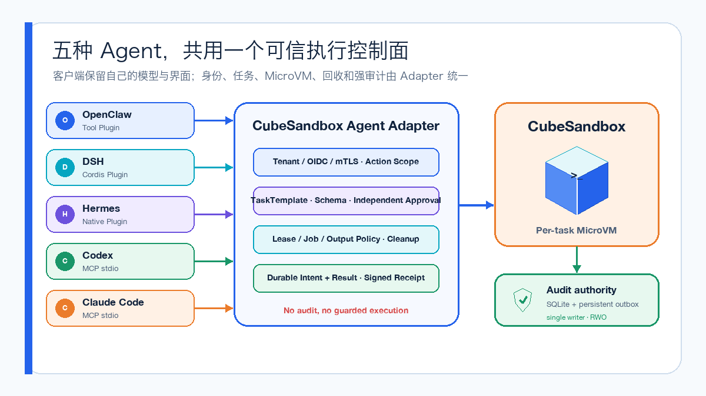
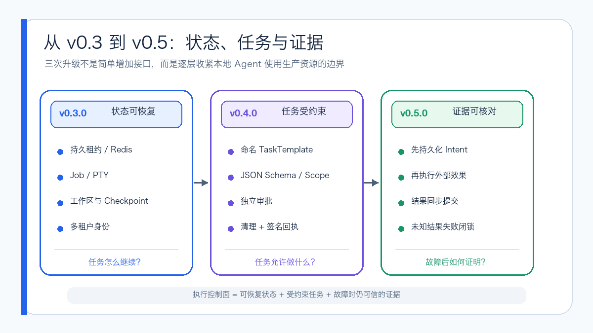
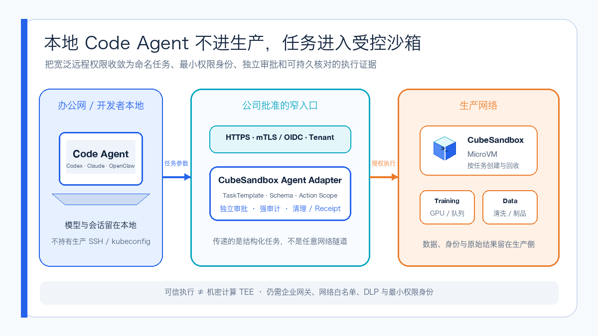
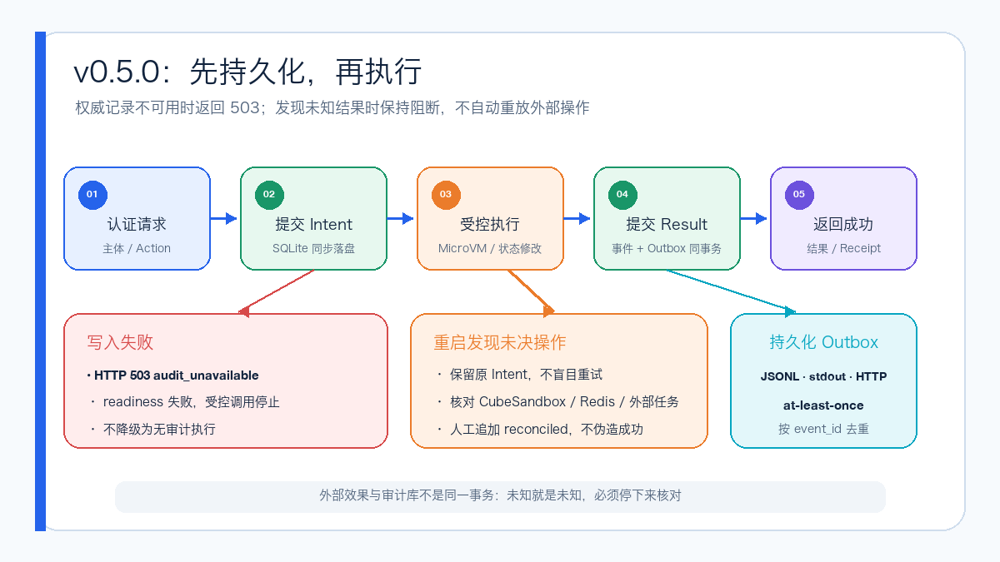
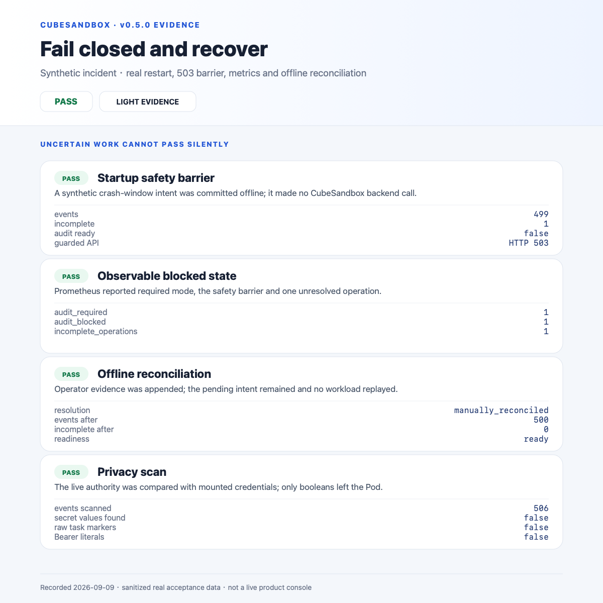

# CubeSandbox Agent Adapter v0.5：不记账，就不执行

CubeSandbox Agent Adapter `v0.5.0` 把强审计变成受控执行的前置条件，并完成 OpenClaw、DSH、Hermes、Codex 与 Claude Code 五客户端真实 MicroVM 验收。

上一次写 CubeSandbox Agent Adapter，还是 `v0.3.0`。

当时它刚从“三种 Agent 共用一个沙箱入口”，走到可以管理持久工作区、异步 Job、PTY、Checkpoint、Rollback、Fork 和多租户身份。它开始像一个执行控制面，而不只是几段插件代码。

之后的 `v0.4.0` 又补上了一条更适合企业内网的路径：本地 Code Agent 不直接拿生产 SSH、数据库密码或集群管理员 kubeconfig，而是提交一个由服务端定义的命名任务。任务先做参数校验，需要时由独立身份审批，进入固定 Profile 的 MicroVM，结束后只返回白名单结果与签名回执。

但还有一个问题没有真正解决：**如果审计只是异步写一份 JSONL，那么进程正好在执行和落日志之间崩溃，谁能证明这条操作到底有没有发生？**

2026 年 9 月 9 日发布的 `v0.5.0`，主要回答的就是这个问题。

这次升级最关键的一点是：**持久化审计从“执行之后记一笔”，变成了“执行之前必须先记账”。权威审计不可用时，受控操作直接失败闭锁。**

正式镜像为 `ghcr.io/aik8s/cubesandbox-agent-adapter:v0.5.0`，支持 `linux/amd64` 和 `linux/arm64`。标签指向提交 `80325ae`，OCI Index Digest 为：

```text
sha256:b70e7e537bf0f6615ce6d25e16da60e6aa6b56ee0959204c7c3308901fb3ed14
```

## 五种 Agent，仍然只走一个执行控制面

v0.5.0 没有要求大家换掉熟悉的 Agent。OpenClaw、DeepSeek Harness（DSH）和 Hermes Agent 继续通过各自插件接入；Codex、Claude Code 与其他 MCP Host 通过本地 `stdio` MCP Facade 接入。



Agent 可以保留自己的界面、模型和 Agent Loop，中间的安全边界保持一致：

- Adapter 持有 CubeAPI、CubeProxy、完整 Sandbox ID 和 Traffic Token；
- 客户端只拿不透明引用，不直接接触底层沙箱凭据；
- Runtime、Profile、网络、路径、配额、超时和生命周期由平台侧固定；
- 后端不可用、身份无权或审计不可用时拒绝请求，不回退到宿主 Shell；
- MicroVM 结束后有明确的 Release、TTL、GC 与可核对的执行记录。

项目现在已经在真实客户端里跑通 OpenClaw、DSH、Hermes、Codex 和 Claude Code。Agent 插件提供 19 个通用执行与可信任务工具；需要更严格边界时，可以只给客户端开放 `cube_task_plan`、`cube_task_submit`、`cube_task_status`、`cube_task_result` 和 `cube_task_receipt`。

## 从 v0.3 到 v0.5，控制面补上了哪两块



把三个版本连起来看：

- `v0.3.0` 管状态：持久租约、Redis 恢复、异步 Job、PTY、工作区、Checkpoint 和多租户认证；
- `v0.4.0` 管任务：命名 TaskTemplate、JSON Schema、Action Scope、独立审批、输出白名单、MicroVM 清理与签名 Execution Receipt；
- `v0.5.0` 管证据：先持久化意图，再执行外部效果，最后持久化结果；审计库异常时进入故障闭锁。

这三层分别回答“任务怎么继续”“任务能做什么”和“事后能否证明发生了什么”。

## 本地 Code Agent，怎样碰生产资源才更可控

这套架构最贴近企业实际的地方，是它可以处理办公网与生产网分离的场景。

很多团队的办公网与生产网彼此隔离。开发者已经习惯在本地使用 Codex、Claude Code、OpenClaw 或 DSH，但训练数据、GPU、内部制品库、Kubernetes API 和生产数据库都留在另一侧。

直接把 VPN、SSH Key、长期 Token 或管理员 kubeconfig 交给本地 Agent，权限太宽；把完整 Agent Runtime、模型配置、会话历史和第三方插件全部部署进生产网，信任边界又太大。

Adapter 提供的是第三条路：**Agent 留在本地，数据与凭据留在生产，只让经过认证、授权和审批的结构化任务穿过边界。**



例如发起训练或数据清洗时，本地 Agent 只提交符合 JSON Schema 的参数。真正的脚本、数据路径、训练 API、结果位置和工作负载身份由生产侧模板固定。

对于单机预处理、小模型训练或特征检查，任务可以直接在 CubeSandbox MicroVM 中运行；对于 Kubernetes、Volcano、Slurm 上的大规模训练，MicroVM 更适合充当一个窄权限的提交与验证边界，由内部训练平台继续负责调度。

这里的“可信执行”聚焦策略、隔离、审计和资源回收。需要宿主机不可见、内存加密或硬件远程证明时，还要叠加 SGX、TDX、SEV 一类机密计算能力。

## 为什么只有 JSONL 还不够

传统异步日志有一个很难回避的窗口：

1. 服务收到请求；
2. 外部命令或 MicroVM 操作已经发生；
3. 进程在日志写入前崩溃。

重启以后，如果系统直接重试，可能把外部操作执行两次；如果直接当成失败，又可能掩盖已经发生的效果。

v0.5.0 的 `required` 模式把顺序改成：



第一步先同步提交脱敏的执行意图。只有权威 SQLite 日志确认持久化后，Adapter 才进入权限检查、状态修改或后端调用。外部效果结束后，再同步提交结果；结果没有可靠落盘，就不会向客户端返回成功或签发 Receipt。

如果审计盘无法写入，接口返回 `503 audit_unavailable`，readiness 同时变为失败。如果重启发现一条只有 intent、没有 result 的未决操作，Adapter 不会盲目重放，而是保持阻断，等待管理员核对 CubeSandbox、Redis 和外部任务状态。

管理员确认现场后，可以用离线工具追加 `manually_reconciled` 事件。这个动作只表示“已经人工核对”，不会伪造任务成功，也不会删除原始意图。

## 权威记录和外送日志如何分工

v0.5.0 默认把 `${CUBE_ADAPTER_AUDIT_LOG}.sqlite3` 作为权威记录。JSONL、stdout 和 HTTP Collector 是可重试的外送副本：

- 每条事件有稳定 `event_id`，下游按它去重；
- 外送采用 at-least-once，Collector 暂时离线不会让已经可靠记账的操作失败；
- 待发送记录也持久化，进程重启后继续投递；
- 审计页面最多展示最近 200 条，权威数据仍以 SQLite 记录为准。

审计正文继续做脱敏。请求体和身份保存为 keyed digest，原始命令、输出、Token 和生产地址不应进入公开审计记录。需要完整业务证据时，应由受保护的工单、日志平台和数据治理系统补齐。

## 我把真实 Kubernetes 故障路径跑了一遍

验收环境把 v0.5.0 候选镜像部署为单个非 root Pod，使用 `Recreate` 策略和保留型 1 GiB RWO 本地块存储 PVC，再连接真实 CubeSandbox MicroVM。

四个原有客户端的可信任务套件通过 **23/23**，其中 19 项实际创建或操作了 MicroVM：


删除并重建 Adapter Pod 前后，权威库里的已提交事件保持 **498 → 498**；第二个写入进程尝试打开同一份在线日志时，被独占文件锁拒绝：


故障闭锁测试离线注入了一条不会调用真实后端的合成未决意图。重启后 `audit_ready=false`、未决数为 1、受控 API 返回 HTTP 503；人工核对后恢复 Ready。随后扫描 506 条权威事件，没有发现挂载密钥值、Bearer 字样或已知原始任务标记：



标签发布后，Claude Code 又对正式 v0.5.0 amd64 镜像完成了两条补测：

- 与 Codex 对齐的 `acquire → exec → status → release` 直连路径；
- 五工具可信任务路径，最终为 `succeeded`、清理 `verified`、Receipt 算法 HS256。

两条路径权限拒绝均为 0，结束后活动租约回到 0。下图记录了 Claude Code 自身 Light 模式 TUI 中的完整调用结果：


代码侧也完成了 Python 3.10、3.12、3.14 矩阵测试，48 项 Adapter 测试包含 Redis 集成；插件、Helm 安全约束、容器构建、SBOM 和 Trivy 扫描全部通过。

## 新部署怎么开始

Adapter 不要求必须运行在 Kubernetes 上。只要它能访问已经部署好的 CubeSandbox 后端，开发机或单机服务器可以直接使用 Docker Compose：

```bash
git clone --branch v0.5.0 --depth 1 \
  https://github.com/aik8s/cubesandbox-agent-adapter.git
cd cubesandbox-agent-adapter

# 按文档生成 .env，并填写 CubeAPI、CubeProxy 与 READY 模板
docker compose pull adapter
docker compose up -d --no-build adapter

curl --fail http://127.0.0.1:18080/healthz
curl --fail http://127.0.0.1:18080/readyz
```

如果 Adapter 部署在 Kubernetes 上，v0.5.0 默认要求：

- `replicaCount: 1`；
- `audit.mode: required`；
- 可靠本地盘或块存储上的 RWO PVC；
- `Recreate` 更新策略；
- PVC 带保留策略，卸载 Release 时不自动删除审计证据。

安装器可以自动生成独立随机 Bearer Token 和 HMAC Key，并且不把 Secret 打印到终端：

```bash
./scripts/install.sh adapter \
  --context <kube-context> \
  --cube-api-url http://cube-api.cube-system.svc:3000 \
  --cube-proxy-host cube-proxy.cube-system.svc \
  --cube-proxy-port 80 \
  --audit-storage-class <可靠本地盘或块存储类> \
  --template agent-code
```

健康检查要看到 `version=0.5.0`、`audit_mode=required` 和 `audit_ready=true`。Pod Ready 之后还要跑一次真实沙箱 E2E，确认 MicroVM 的创建、执行和清理链路都能工作。

## 升级前必须知道的边界

部署前需要把下面几件事确认清楚：

1. SQLite 权威库只支持单写入者，不能让多个 Adapter 共享同一数据库；
2. 审计盘要使用遵守同步写入与文件锁语义的本地盘或块存储，不支持 NFS；
3. 要保留整个卷，包括 `.sqlite3`、锁文件和恢复文件，不能只备份 JSONL；
4. `v0.4.0` 的 JSONL 是历史导出，不会被追溯认定为 v0.5 强审计证据；
5. `best_effort` 是显式降级模式，可能丢记录，不能宣传成强审计；
6. 审计和运行状态分开保存；要在重启后恢复租约、任务和审批，还需要可靠 Redis 与加密 Key；
7. 单盘机制不提供跨节点复制、WORM、防篡改、自动备份或合规认证；
8. MicroVM 隔离不能阻止恶意任务通过 stdout 或允许读取的文件泄露数据，仍需输出白名单、DLP、最小权限身份和网络策略。

## 这次升级意味着什么

`v0.3.0` 让多个 Agent 共用一套可恢复执行控制面，`v0.4.0` 把自由命令收敛成可审批的命名任务，`v0.5.0` 则继续追问：当系统出故障时，证据是否仍然可信？

v0.5.0 没有把外部 MicroVM 和本地数据库包装成一个并不存在的完美事务。遇到“操作可能已经发生，但结果还没落盘”的窗口，Adapter 会停下来等待核对，既不自动重试，也不把未知写成成功。

这个版本可以概括成一句话：**不记账，就不执行；结果不确定，就不继续。**

真正放进生产前，还要把企业身份、网络白名单、数据治理、备份和告警接好。在这些基础设施之上，Adapter 已经把本地 Code Agent 使用生产侧 GPU、数据、内部 API 和 Kubernetes 资源时需要的身份、任务、隔离、回收和强审计串成了一条完整路径。

参考资料：

```text
项目官网：
https://aik8s.github.io/cubesandbox-agent-adapter/

GitHub 项目：
https://github.com/aik8s/cubesandbox-agent-adapter

v0.5.0 Release：
https://github.com/aik8s/cubesandbox-agent-adapter/releases/tag/v0.5.0

Docker Compose 部署：
https://github.com/aik8s/cubesandbox-agent-adapter/blob/main/docs/deploy-docker.zh-CN.md

强审计与恢复：
https://github.com/aik8s/cubesandbox-agent-adapter/blob/main/docs/audit-durability.zh-CN.md

可信执行：
https://github.com/aik8s/cubesandbox-agent-adapter/blob/main/docs/trusted-execution.zh-CN.md
```


阅读原文：https://aik8s.run/ai-k8s/rag-agent/cubesandbox-agent-adapter-v05/
