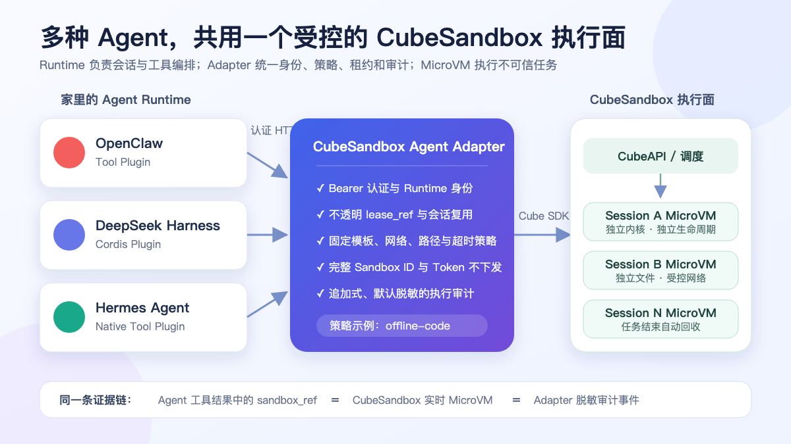
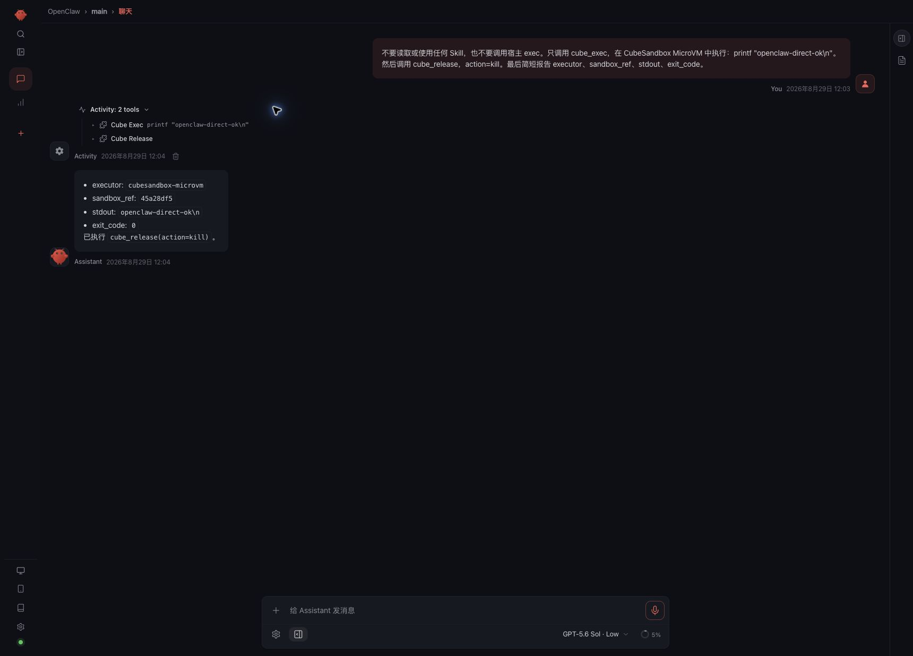
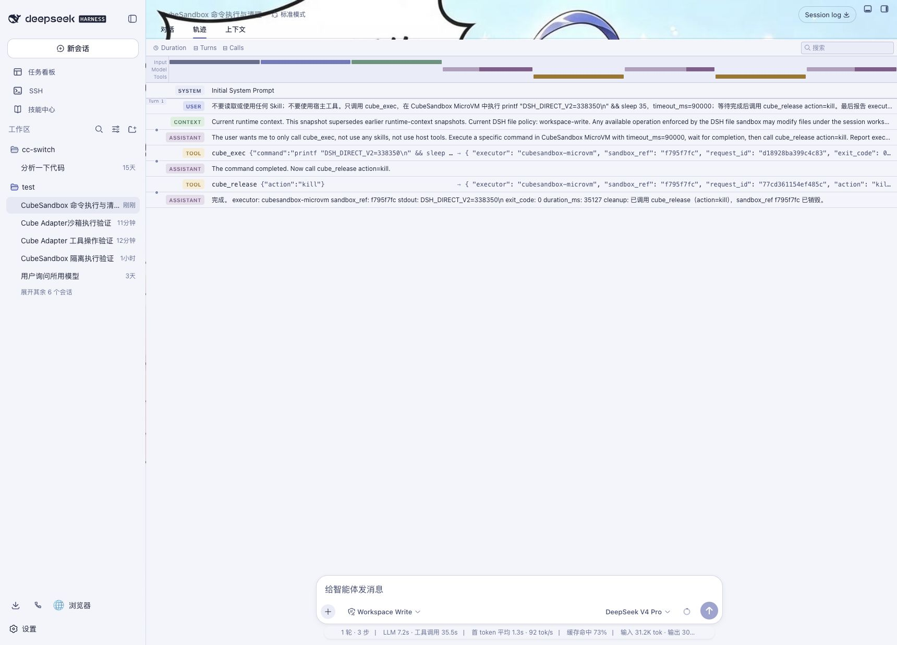
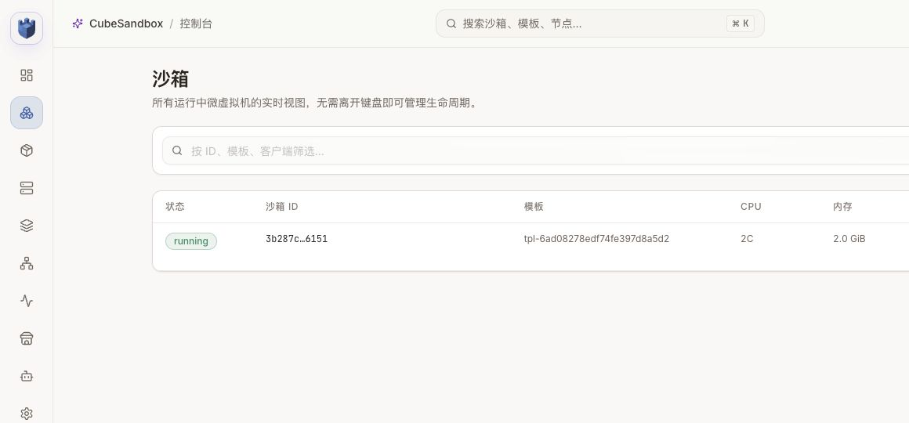
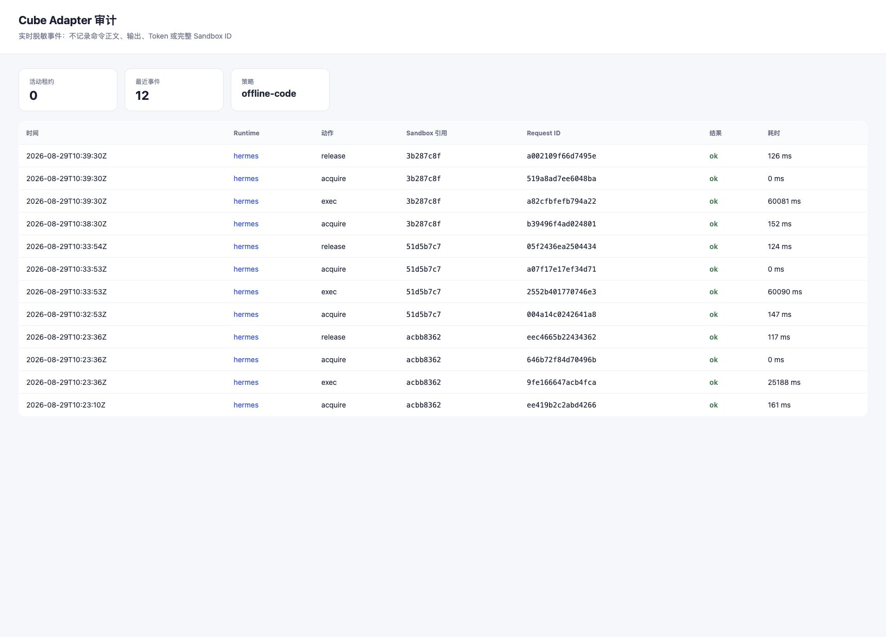
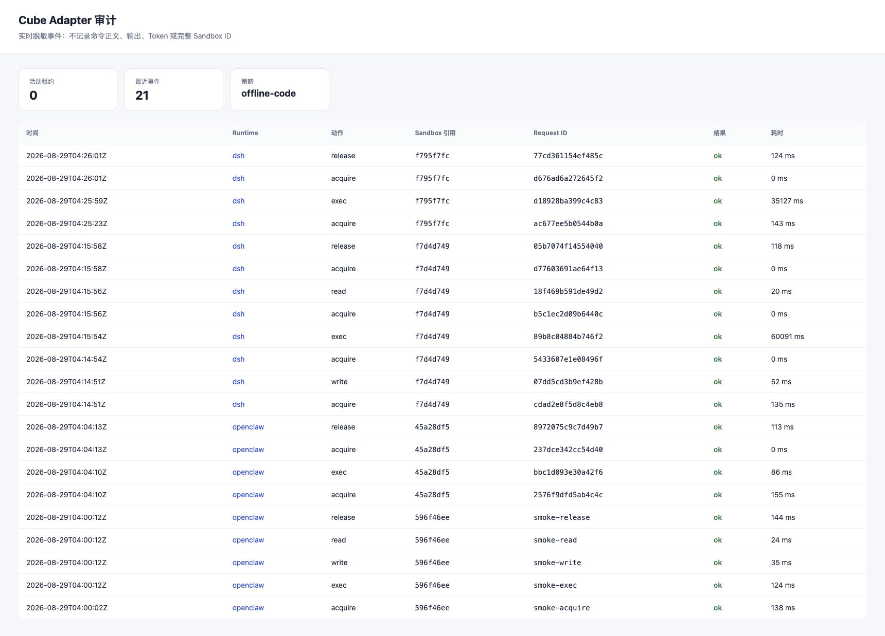

# 家里跑着三种 Agent 后，我给它们做了一个统一的 CubeSandbox 执行控制面

我家里的工作环境里，现在并不只有一种 Agent。

OpenClaw 更像一个长期在线的个人助手和自动化入口；DeepSeek Harness（DSH）适合从 Web 里进入项目、调用工具和持续完成开发任务；Hermes Agent 又有自己的插件、会话和工具体系。我经常同时使用它们，而不是从中选出一个“唯一正确答案”。

Agent 越多，一个问题就越明显：**对话和编排可以各有特色，但 Shell、文件、代码和浏览器任务，不能每套 Agent 都重新做一遍隔离、凭据和审计。**

过去一段时间，我主要用 Docker 和 KubeVirt 运行这些任务。

Docker 很适合把 Agent、浏览器和依赖做成可复现环境。我之前做过 OpenClaw + Chrome、DSH + Chrome 一体化镜像，启动简单、分发方便，也适合家里的长驻服务。

需要更强隔离时，我会使用 KubeVirt。独立 Guest Kernel、持久磁盘和完整虚拟机语义，很适合长期开发桌面或需要稳定状态的工作环境。

它们都没有错，但随着 Agent 数量和任务数量增加，我逐渐遇到了一组更具体的问题。

## 为什么我还想再加一层沙箱执行面

第一个问题是，**Agent Runtime 和不可信任务经常处在同一个信任域里。**

一个长期运行的 Agent 可能同时保存模型配置、浏览器 Profile、仓库凭据、SSH Key、会话历史和 Workspace。如果模型生成的脚本也直接在这个环境中运行，一次依赖安装、递归删除、恶意仓库脚本或 Prompt Injection，影响的就不只是当前任务。

Docker 能提供很实用的进程和文件隔离，但它仍与宿主共享内核。为了让 Agent 真正工作，大家又经常给容器挂载代码目录、浏览器状态、SSH 配置，甚至 Docker Socket。挂载越多，最初的隔离边界越容易被工作便利性一点点打开。

KubeVirt 的隔离更强，但它更像“给用户一台虚拟机”。如果把它用于大量短任务，还要处理 VM、镜像、Cloud-init、PVC、网络、启动等待、回收和残留资源。它可以做，只是缺少一套直接面向 Agent 的轻量执行 API 和会话租约语义。

第二个问题是，**每种 Agent 都有自己的工具接口。**

OpenClaw 有 Tool Plugin 和自己的 Sandbox Backend；DSH 有 Cordis Plugin、Shell、文件和 Terminal 语义；Hermes Agent 又有原生插件和工具压缩机制。如果让每个 Runtime 直接连接底层沙箱，CubeSandbox 地址、Sandbox ID、Traffic Token、模板和网络参数就会散落在多套插件里。

第三个问题是，**“任务确实在沙箱里执行”很难形成统一证据。**

Agent 最终回复里写着“已在沙箱执行”，并不能证明它没有偷偷回退到宿主 Shell。Docker 日志、虚拟机列表、Agent 轨迹和用户会话彼此分离，后续想回答“谁在什么时候执行了什么类型的动作、进入了哪个执行环境、有没有被回收”，需要再拼一套审计链路。

对我来说，问题逐渐从“怎么再启动一个隔离环境”，变成了“怎么让这些 Agent 共用同一套执行规则”。我想要的是一层简单的入口：Agent 保留各自的会话与工具体验，Shell、文件和代码任务则统一进入可回收、可审计的沙箱。

## 为什么我开始关注 CubeSandbox

CubeSandbox 是腾讯云开源的 Agent 沙箱平台。它使用 KVM MicroVM 提供独立 Guest Kernel，同时提供面向 Agent 的 Shell、文件、代码、网络、模板、快照和生命周期 API，并兼容 E2B SDK。

这几个特性正好落在 Docker 和传统虚拟机之间：

- 隔离边界是 MicroVM，而不是长期 Agent 进程中的一个子进程；
- 创建和回收由专门 API 完成，适合映射到 Agent Session；
- 模板、Pause/Resume、Snapshot、Rollback 和 Clone 可以复用环境状态；
- CubeEgress 可以控制出站并做凭据注入，让真实 Token 不必进入任务环境；
- Kubernetes 部署后，控制面和计算节点可以分别管理。

我先在自己的 Kubernetes 测试环境里部署了 CubeSandbox `v0.7.0`，完成模板构建、MicroVM 创建、命令与文件操作、断网、Traffic Token、Pause/Resume、Snapshot、Rollback、Clone 和清理测试。

接着我分别让 OpenClaw 和 DSH 通过 Skill 调用 CubeSandbox。这条路线能够工作，不过模型仍要先读取说明，再调用宿主工具启动包装脚本；不同 Runtime 的参数、凭据、策略和审计也还是分散的。

这时我想到，可以在所有 Agent 和 CubeSandbox 之间增加一层很薄、但边界非常明确的 Adapter。

## cubesandbox-agent-adapter 是怎么工作的

我把这个项目叫作：

```text
cubesandbox-agent-adapter
```

项目名：`aik8s/cubesandbox-agent-adapter`。文末可以通过“阅读原文”进入项目主页。

它不是另一个沙箱平台，也不是简单给 Cube SDK 换一个 HTTP 外壳。OpenClaw、DSH 和 Hermes 保留自己的模型、会话和工具编排，Adapter 负责身份、策略、租约、底层连接和审计，具体的代码任务再进入 CubeSandbox MicroVM 执行。



完整调用链是：

```text
OpenClaw Tool Plugin ─┐
DSH Cordis Plugin ────┼─ 认证 HTTP → Adapter → Cube SDK → MicroVM
Hermes Tool Plugin ───┘                    │
                                          └→ 脱敏审计
```

实现时，我主要处理了下面几个问题。

### 1. 只有 Adapter 知道 CubeSandbox 的真实连接信息

CubeAPI、CubeProxy、完整 Sandbox ID 和 Traffic Token 只保存在 Adapter。Agent Runtime 和模型拿到的是不透明 `lease_ref`，不能绕过 Adapter 自由拼接底层管理请求。

这意味着以后增加第四种、第五种 Agent 时，不需要把 CubeSandbox 管理凭据复制到每套 Runtime。

### 2. 模型只能选动作，不能选安全边界

当前公开版本只提供固定的 `offline-code` Profile。模型可以请求执行命令、读写允许目录或释放租约，但不能自行决定：

- 使用哪个底层模板；
- 是否打开公网；
- 暴露哪个入口；
- 修改生命周期策略；
- 访问 `/workspace` 和 `/tmp` 之外的路径；
- 无限延长命令、输出和文件大小。

平台策略优先于模型参数。无可用 Backend 或策略校验失败时直接拒绝，而不是回退到宿主环境。

### 3. 一个 Agent Session 对应一个不透明租约

Adapter 使用 `(runtime, HMAC(session_key))` 做幂等租约映射。原始 Session Key 不写入审计，Bearer Token 与 HMAC Key 也相互独立。

同一会话中的多次 `exec/read/write` 可以复用一个 MicroVM；会话结束、TTL 到期或显式调用 `cube_release(action=kill)` 时再回收。这样既保留任务上下文，又不会把长期 Agent Runtime 和短期执行环境绑死。

### 4. 审计默认脱敏

Adapter 记录 Runtime、会话摘要、策略、动作、Request ID、短 Sandbox 引用、耗时和结果，但默认不记录：

- Bearer Token 或 Traffic Token；
- 原始 Session Key；
- 完整 Sandbox ID；
- 命令正文和文件内容；
- stdout 和 stderr。

这些字段目前够我做基础排查，后续也可以继续送入日志平台、OpenTelemetry 或 SIEM。

## 把三种 Agent 各跑了一遍

我分别使用 OpenClaw `2026.7.1`、DSH `0.1.1-rc.2`、Hermes Agent `0.20.6`，通过 Adapter 连接运行在 Kubernetes 上的 CubeSandbox `v0.7.0`。

测试时，我让 Agent 不读取 Skill、不使用宿主 Shell，只调用 `cube_exec` 和 `cube_release`。除了看最终回答，我还把下面三处信息放在一起核对：

```text
Agent 工具结果中的 sandbox_ref
        = CubeSandbox WebUI 中的运行实例
        = Adapter 审计中的 Sandbox 引用
```

### OpenClaw

OpenClaw Tool Plugin 注册 `cube_exec`、`cube_read`、`cube_write` 和 `cube_release`。下面这次会话只调用了 Cube 工具，结果明确返回执行器 `cubesandbox-microvm`、短引用 `45a28df5` 和退出码 0，随后主动 Kill。



### DeepSeek Harness

DSH 使用 Cordis Plugin 接入。除了注册四个 Cube 工具，安装器还会生成 Profile Patch，禁用常见宿主 Bash、PowerShell 和文件工具，避免同一轮任务一半在宿主、一半在 MicroVM。

轨迹页记录了 `cube_exec`、`cube_release`、执行结果和短引用 `f795f7fc`：



### Hermes Agent

Hermes 使用独立的原生 Tool Plugin，没有修改 Hermes 核心代码。插件通过官方 Plugin Doctor 校验，Dashboard 中可以看到 `cube-adapter-tools` 来自用户插件目录并处于 `enabled` 状态。


Hermes 的工具目录可以按需压缩，因此模型可能先通过 `tool_describe` 和 `tool_call` 找到延迟加载的插件工具，最终仍会进入插件的 `cube_exec` 和 `cube_release` Handler。

为了方便观察执行过程，我让命令保持运行 60 秒。CubeSandbox WebUI 同时出现短引用前缀为 `3b287c` 的 MicroVM，状态为 `running`，规格为 2C/2GiB。



命令完成后，Adapter 使用同一个短引用 `3b287c8f` 串起 `acquire`、`exec` 和 `release`，结果全部为 `ok`，活动租约回到 0。



OpenClaw 和 DSH 同样可以在统一审计页里按照 Runtime、动作、Request ID 和短引用交叉检查：



截图里的创建耗时只是单次功能样本，不是并发性能基准。我保留这些截图，主要是为了确认调用没有回退到宿主 Shell，也方便以后从 Agent、Adapter 和 CubeSandbox 三边排查同一次任务。

## 它和现有方案是什么关系

这个实现不是想替代现有沙箱，也不是给每一种 Agent 重新造一套执行系统。它更像是我在现有组件之间补的一段连接层。

OpenClaw 自带的 Sandbox Backend 很适合只使用 OpenClaw 的环境；Agent-Sandbox 和相关 E2B Gateway 方案更关注沙箱生命周期与协议兼容；CubeSandbox 已经提供 CubeAPI、E2B 兼容接口、CubeEgress 和 OpenClaw Integration。这些能力解决的是不同层面的问题，也给了我不少启发。

我做的 Adapter 只聚焦自己的使用场景：让 OpenClaw、DSH 和 Hermes 保留原来的 Runtime，在它们与 CubeSandbox 之间统一处理身份、会话租约、固定策略和审计记录。

因此它并不是另一套 Cube SDK，也不试图成为通用 Agent 框架。后续如果 CubeSandbox 或各个 Runtime 提供了更合适的原生接口，这层 Adapter 也可以继续变薄，或者只保留策略与审计部分。

## 什么时候值得加这一层

如果只接一种 Agent，直接使用 SDK、Skill 或它自带的 Sandbox Backend，往往更快。

当一个环境里同时存在多种 Agent，而且希望它们遵守同一套执行策略时，这层 Adapter 才比较有用。

### 对个人环境

- OpenClaw、DSH 和 Hermes 不必各自保存一套 CubeSandbox 管理凭据；
- 不同 Agent 可以复用同一个模板、网络策略和会话回收方式；
- 我可以明确知道某次任务究竟进入了哪个执行面；
- Agent Runtime、浏览器状态和个人凭据不必跟着每个不可信脚本一起冒险。

### 对团队或企业环境

- 平台团队可以集中维护执行策略，再由不同 Agent Runtime 共用；
- Agent 插件只负责工具适配，不必直接持有底层管理权限；
- Request ID、租约和结果记录可以进入同一条审计链；
- 新接入的 Agent 可以复用 Adapter API，减少重复处理 MicroVM 生命周期的工作；
- CubeSandbox 的模板、快照和网络能力可以由一处统一配置。

我目前把它理解成一层共享的执行入口。它不一定适合所有人，但对我这种家里同时运行多种 Agent 的环境，能少维护几套重复配置，也能把执行边界看得更清楚。

## 如何安装

当前公开版本是 `v0.2.0`，Adapter 镜像已经发布到：

```text
ghcr.io/aik8s/cubesandbox-agent-adapter:v0.2.0
```

部署 Adapter：

```bash
git clone https://github.com/aik8s/cubesandbox-agent-adapter.git
cd cubesandbox-agent-adapter

./scripts/install.sh adapter \
  --context <kube-context> \
  --cube-api-url http://cube-api.cube-system.svc:3000 \
  --cube-proxy-host cube-proxy.cube-system.svc \
  --cube-proxy-port 80 \
  --template agent-code
```

随后按 Runtime 安装对应插件：

```bash
./scripts/install.sh openclaw \
  --adapter-url http://127.0.0.1:18080 \
  --token-from-secret cube-adapter-auth

./scripts/install.sh dsh \
  --adapter-url http://127.0.0.1:18080 \
  --token-from-secret cube-adapter-auth \
  --profile web

./scripts/install.sh hermes \
  --adapter-url http://127.0.0.1:18080 \
  --token-from-secret cube-adapter-auth
```

安装器会创建或读取 Secret、安装插件、合并必要配置并执行校验，但不会打印真实 Token。完整参数和安全边界以项目中文版 README 为准。

## 现在还不是生产终点

`v0.2.0` 目前更适合作为已经跑通的参考实现。虽然项目里有 Helm、审计页面和公开镜像，但距离生产多租户控制面还有不少工作。

真正面向企业开放前，还需要继续补齐：

- OIDC、工作负载身份或 mTLS，而不只是共享 Bearer Token；
- 可持久化、可恢复的租约状态和高可用；
- 更细的租户、用户、模板、并发和预算策略；
- OpenTelemetry、日志平台或 SIEM 导出；
- PTY、流式输出、取消传播和浏览器任务；
- 更完整的 NetworkPolicy、Egress、密钥轮换和灾难恢复测试。

我还想继续试一个 MCP Frontend，让支持 MCP 的 Agent 也能复用这层执行入口。不过原生插件仍会保留，因为它更容易处理各 Runtime 的会话身份、工具禁用和权限语义。

## 最后

这个项目来自一个很个人的需求：我家里同时跑着 OpenClaw、DSH 和 Hermes，而我不想让每一种 Agent 都重新管理一遍 Docker、虚拟机、底层凭据、安全策略和执行日志。

Docker 仍然适合封装长期 Runtime，KubeVirt 仍然适合完整、持久的虚拟工作站。CubeSandbox 更适合成为按任务和会话创建的 MicroVM 执行面，而 Adapter 把多个 Agent 与这个执行面之间的身份、策略、租约和审计收拢起来。

这次实践对我最大的帮助，是把 Agent Runtime 和任务执行环境分开了：

```text
Agent 可以有很多种，
不可信执行只走一条受控、可回收、可审计的路径。
```

项目源码、安装说明、实战截图和相关文档已经整理在项目主页。点击文末“阅读原文”即可进入。
