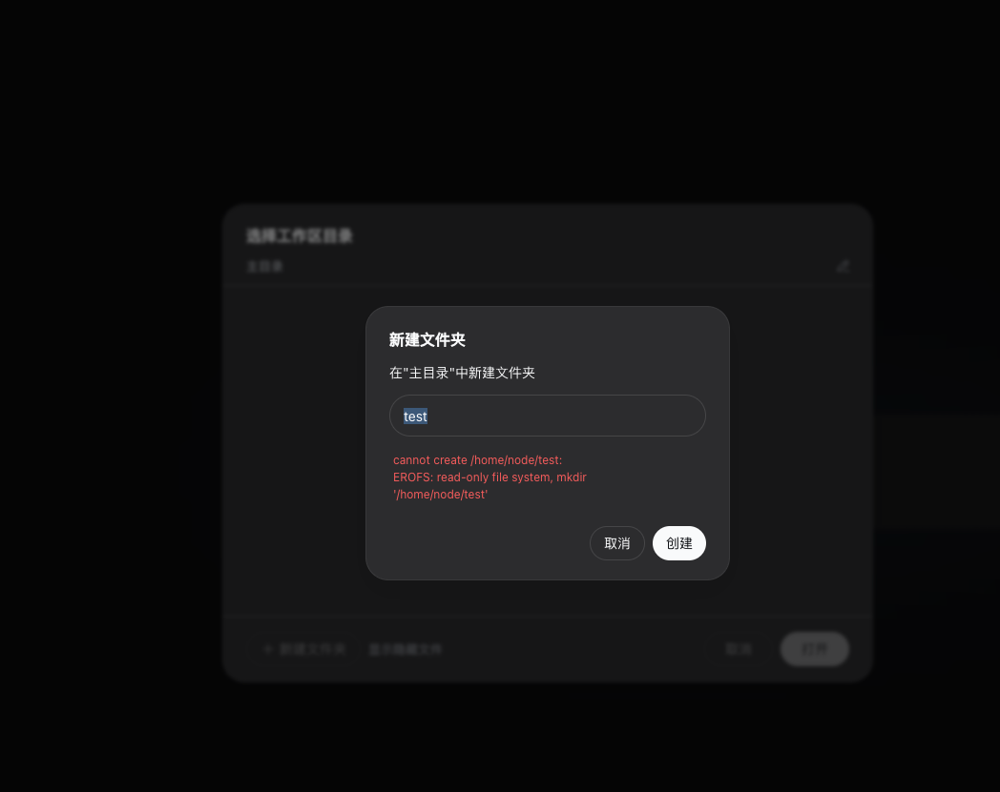

# DeepSeek Harness 刚开源，我给它补了一个 Dockerfile

DeepSeek Harness 开源后，我第一时间把它跑了起来。

官方给出的体验方式其实已经很简单：

```bash
npx @deepseek-ai/dsh web
```

如果只是临时看一眼，这条命令完全够用。

但我还是顺手把它整理成了一个可直接使用的社区容器项目：

```text
https://github.com/runzhliu/deepseek-harness-docker
```

这不是因为所有 Agent 都必须放进 Kubernetes，也不是想把一次体验复杂化。我的目标很朴素：**让大家不用先整理本机 Node.js、原生模块和运行目录，拉一个镜像就能快速看看 DeepSeek Harness 到底是什么。**

同时，这套 Dockerfile、Compose 和 Helm 示例，也可以给正在用容器部署 OpenClaw、Hermes Agent 等项目的团队提供一个实现参考。

## 先看怎么跑

镜像已经发布到 Docker Hub：

```text
runzhliu/deepseek-harness:0.1.0-rc.6
```

最简单的方式是直接使用仓库里的 Compose：

```bash
git clone https://github.com/runzhliu/deepseek-harness-docker.git
cd deepseek-harness-docker

docker compose pull
DSH_WORKSPACE=/absolute/path/to/project \
  docker compose up -d --no-build
```

然后打开：

```text
http://127.0.0.1:3080
```

下面是从 Docker Hub 重新拉取镜像、使用全新状态卷启动后的页面：


当前镜像同时支持 `linux/amd64` 和 `linux/arm64`。项目里还保留了 Dockerfile、Compose、Helm Chart、双架构构建和 Smoke Test，大家可以直接运行，也可以只拿其中需要的部分参考。

## DeepSeek Harness 到底是什么

DeepSeek Harness 不是新的模型权重，也不是 vLLM、SGLang 这一类推理引擎。

它更接近一个 Agent Runtime：把模型适配、会话、工具、权限、工作区、子 Agent、Web UI 和 Headless 入口组织在一起。

它的底层使用 Cordis，核心思路可以概括为“一切皆插件”：

```text
dsh CLI
  │
  ▼
Profile + Bundle + Patch
  │
  ▼
Cordis Plugin Tree
  ├─ Agent / Session / LLM
  ├─ Tools / Filesystem / Shell / PTY
  ├─ Permission / Sandbox
  ├─ Web Surface
  └─ Headless Surface
```

这也是它比较有意思的地方。Web 页面只是一个入口，后面真正运行的是 Agent Loop、Session Event Log、模型适配器和工具执行环境。

所以我做容器镜像时，并不只是确认首页能不能返回 200，还要处理 Node 原生模块、PTY、会话状态、工作目录、子进程和网络入口。

## 为什么还要做一个 Dockerfile

`npx` 很适合个人快速尝鲜，但很多团队已经习惯用容器管理 Agent 工具。

比如在体验 OpenClaw、Hermes Agent 或其他 Coding Agent 时，常见诉求并不是“我要立刻上生产”，而是：

- 不想为了试用一个项目改乱本机 Node.js 和系统依赖；
- 希望版本、依赖和启动参数可以复现；
- 想明确哪些目录保存会话，哪些目录是 Agent 工作区；
- 希望测试结束后可以完整清理；
- 后续如果要放到测试集群，能有一份 Compose 或 Kubernetes 样例继续改。

Dockerfile 在这里更像一个**可执行的安装文档**。它把“这个版本需要什么、怎样启动、状态放在哪里、哪些端口可以访问”写成了机器可以重复验证的配置。

当然，真正把它做出来以后，还是踩了几个坑。

## 坑一：`node-pty` 不是纯 JavaScript 依赖

Harness 的 Shell 和终端能力依赖 `node-pty`。

有些平台可以直接下载预编译产物，有些 CPU 架构会回退到 `node-gyp` 本地编译。如果 Dockerfile 里只有 Node.js，arm64 构建就可能因为缺少 Python、make 和编译器失败。

因此镜像使用多阶段构建：

```text
Builder
  ├─ Python
  ├─ build-essential
  ├─ node-gyp
  └─ 安装固定版本的 DSH

Runtime
  ├─ Node.js 24 slim
  ├─ Git / SSH / Python / ripgrep / tini
  ├─ 已构建的 DSH 与原生模块
  └─ 不保留 gcc / make
```

验证时也不能只执行一次 `require('node-pty')`。项目的 Smoke Test 会真实创建 PTY、启动 `/bin/sh`，确认两个架构都能返回 `PTY_OK`。

模块能加载，不代表终端真的能用。

## 坑二：容器内需要监听 `0.0.0.0`，但不能直接暴露出去

官方 Web Profile 默认监听 `127.0.0.1`，这是合理的安全默认值。

当前 Web Server 没有完整的 TLS、认证和 Origin 防护，背后的 Agent 又能读写文件、启动 Shell。直接暴露到局域网或公网，风险很大。

但在 Docker bridge 网络里，进程只监听容器自己的 `127.0.0.1`，宿主端口映射又无法访问它。

我最后没有修改上游代码，而是使用 Harness 自己的 Cordis Patch，把容器内 Web Server 改为监听 `0.0.0.0`；Compose 再把宿主端口严格绑定到回环地址：

```yaml
ports:
  - "127.0.0.1:3080:3080"
```

最终路径是：

```text
浏览器 → 宿主 127.0.0.1:3080
       → Docker 端口转发
       → 容器 0.0.0.0:3080
       → DeepSeek Harness
```

容器内监听 `0.0.0.0`，不等于允许宿主对外暴露。这一点也适用于很多带 Web UI 和代码执行能力的 Agent 项目。

## 坑三：页面返回 200 后，HMR 又报错了

第一版镜像已经能打开页面，但随后又遇到：

```text
--expose-internals is required for HMR service
```

Web Profile 会启动配置 Watcher，当前 HMR 服务需要 Node.js 的 `--expose-internals`。如果把它写进全局 `NODE_OPTIONS`，Agent 后续启动的 Node 子进程也会继承这个参数。

最终做法是只在容器入口中把参数传给 DSH 主进程，不污染工具进程的环境。这类问题也说明：Agent 页面能打开，只能证明 HTTP Server 已启动，不能证明配置监听、终端和工具链都能工作。

## 坑四：只读根文件系统暴露了 HOME 路径问题

为了避免容器随意修改镜像层，我启用了只读根文件系统。

页面能启动，但在 Web 目录选择器中新建文件夹时出现了：

```text
EROFS: read-only file system, mkdir '/home/node/test'
```



最省事的做法是关闭只读根文件系统，或者直接用 Root 用户运行。但这样只是把路径设计问题藏了起来。

实际需要区分两个目录：

```text
/workspace
  └─ 用户代码和 Agent 实际操作的文件

/home/node/.dsh
  ├─ profiles
  ├─ settings.yaml
  ├─ sessions
  └─ storages
```

所以镜像最终设置为：

```text
HOME=/workspace
DSH_HOME=/home/node/.dsh
```

`/workspace` 是可替换的工作目录，`DSH_HOME` 使用独立 Volume 保存 Harness 状态。修复之后，新建目录会落到 `/workspace`，根文件系统仍可以保持只读。

对于 OpenClaw、Hermes Agent 一类项目，这个划分同样值得参考：**代码工作区和 Agent 自身状态最好不要混成一个生命周期。**

## 坑五：Agent 容器还要处理子进程

Agent Runtime 和普通静态 Web 服务不太一样。

它会启动 Shell、PTY、语言服务以及其他工具进程。如果直接让 Node 充当 PID 1，停止容器时可能出现信号转发和孤儿进程回收不完整的问题。

因此镜像使用 `tini` 作为入口，同时以非 Root 用户运行，默认启用：

- 只读根文件系统；
- Drop 全部 Linux Capabilities；
- `no-new-privileges`；
- 独立的 `/tmp`；
- 明确的工作区和状态卷。

这些配置不是为了宣称“容器已经等于 Agent Sandbox”。它们只是一个更合理的体验和开发基线。

如果要运行不可信代码，仍应考虑 gVisor、Kata、独立虚机、出站网络限制和外部 Tool Gateway。普通 Docker 容器不能替代完整的多租户安全设计。

## Compose 是主入口，Helm 只是额外参考

这个项目最推荐的体验路径仍然是 Docker Compose。

Helm Chart 的存在，是为了给已经在 Kubernetes 上测试 OpenClaw、Hermes Agent 或其他 Agent Runtime 的团队一份参考，并不是建议大家为了体验 Harness 先搭一个集群。

Chart 当前使用单副本 StatefulSet，主要表达三个事实：

1. `DSH_HOME` 是需要保留的状态；
2. `/workspace` 可以使用另一个 PVC，也可以只是临时目录；
3. 当前 Web UI 不适合直接创建公开 Ingress 或 LoadBalancer。

这是一份起点，不是一套开箱即用的多租户 Agent 平台。

## 这个项目适合谁参考

如果你只是想看 DeepSeek Harness 的页面，官方 `npx` 最直接。

如果你希望下面这些事情开箱就有，这个项目会更省时间：

- 用 Docker 快速体验，不改乱本机环境；
- 固定 DSH 版本，方便复现问题；
- 在 amd64 和 arm64 上运行原生 PTY；
- 保存会话，同时自由替换工作目录；
- 参考一个相对克制的端口和权限配置；
- 为自己的 OpenClaw、Hermes Agent 或其他 Agent 项目整理 Dockerfile；
- 后续需要时，再从 Compose 过渡到测试集群。

需要再次说明：`deepseek-harness-docker` 是独立社区项目，不是 DeepSeek 官方镜像。

项目地址：

```text
https://github.com/runzhliu/deepseek-harness-docker
```

Docker Hub：

```text
https://hub.docker.com/r/runzhliu/deepseek-harness
```

我更希望大家把它当成一份可以运行、可以拆解、也可以继续改的参考实现，而不是又一套必须照搬的部署规范。

如果你已经在用容器跑 OpenClaw、Hermes Agent 或其他 Agent，也欢迎把遇到的问题和需要补充的运行方式提出来。完整的 Harness 架构分析和验证细节放在“阅读原文”中。
