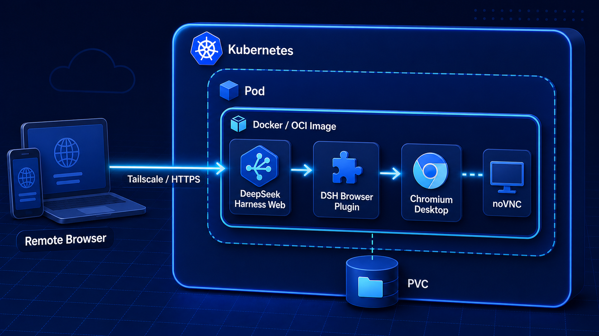

# DeepSeek Harness 开源后，我把它和 Chrome 一起装进了 Docker 与 Kubernetes

DeepSeek Harness 开源后，我看到一种评价：DeepSeek 怎么“居然开源了一个 Web 应用”？

我不太认同。

如果把 Web 应用理解成一个聊天页面，确实容易低估它。DeepSeek Harness 的 Web 只是 Surface，后面还有模型适配、Session、工具、权限、Workspace、子 Agent、插件与 Headless 入口。真正有价值的是这套 Agent Runtime，以及一个已经能够从浏览器进入的交互面。

Web Surface 既可以继续包装成 Native App，也可以放到家里的开发机、云端或 Kubernetes。相比把 Codex 这类以 CLI 为主要入口的工具搬上云，再补终端转发、状态恢复和移动端交互，DSH 已经提供了一个更自然的远程入口。

所以我做的不只是“把 DSH 跑进容器”：我把 DeepSeek Harness、Chromium 桌面和自己实现的 DSH Browser Plugin 放进同一个 Docker 镜像，又准备了 Compose、Helm 与 Kubernetes 部署。它延续了我之前制作 OpenClaw + Chrome all-in-one 镜像的思路。

项目地址：

```text
https://github.com/runzhliu/deepseek-harness-docker
```



图中的包裹关系是运行边界：Kubernetes 管理 Pod，Pod 运行 Docker 构建的 OCI 镜像；镜像内同时包含 DSH Web、Browser Plugin 和 Chromium 桌面。它不是在 Kubernetes 里启动 Docker daemon，也不是 Docker-in-Docker。

## 这次到底做了什么

当前基线使用官方 npm 发行物：

```text
@deepseek-ai/dsh@0.1.0-rc.6
```

对应的社区镜像是：

```text
runzhliu/deepseek-harness:0.1.0-rc.6
```

这套实现包含四部分：

- 多阶段 Dockerfile，固定 DSH、Node.js 和 pnpm 版本；
- Compose 运行方案，持久化 DSH 状态与 Chromium Profile；
- 单副本 StatefulSet Helm Chart；
- 独立的 `@runzhliu/dsh-browser-desktop` 插件。

在 Kubernetes 1.30.4 测试集群中，单副本 StatefulSet 最终 `1/1 Ready`，5 GiB PVC 正常绑定，容器以 UID/GID 1000 和只读根文件系统运行，NetworkPolicy 默认拒绝 Pod 入站，通过 `kubectl port-forward` 访问 DSH 返回 HTTP 200，修复后的 Pod 重启次数为 0。

最初不包含 Chromium 的精简基线首次拉取约 190 MB，用时 28.4 秒。加入 Chromium、中文字体和完整桌面栈后，本地 Docker 显示镜像约 2.46 GB。all-in-one 让环境更完整，但镜像分发与冷启动成本也明显增加，这个取舍不能回避。

这轮 Kubernetes 验收没有注入模型 API Key，因此结论是 Runtime、Web、状态与编排链路可用，不等于所有模型调用和 Agent 权限已经达到生产标准。

## DSH 是 Agent Runtime，不是推理引擎

DeepSeek Harness 不是模型权重，也不是 vLLM 或 SGLang。它是一套 Agent Runtime：模型可以来自外部 API 或内部 Model Gateway，DSH 负责组织会话、工具、权限、文件、Shell、浏览器和插件。

官方命令已经能快速体验：

```bash
npx @deepseek-ai/dsh web
```

个人临时试用，这条命令足够。Docker 和 Kubernetes 解决的是另一类问题：固定依赖和版本、保存状态、挂载项目、限制资源、检查进程、控制入口，以及在环境损坏后恢复。

## 把 DSH 和 Chromium 做进同一个镜像

之前做 OpenClaw 时，我尝试过把 Agent 与 Chrome 放进同一个镜像：用户进入一个 Web 入口，既能和 Agent 交互，也能看到 Agent 真正操作的浏览器。

这次 DSH 镜像内置的不只是一个 `chromium` 命令，而是一套可交互桌面：

```text
DeepSeek Harness Web :3080
        │
        ├── @runzhliu/dsh-browser-desktop
        │       └── Chromium DevTools :9222
        │
        └── noVNC :6080
                └── websockify → x11vnc :5900
                                  └── Xvfb :99 + Openbox + Chromium
```

Dockerfile 使用 Debian 原生的 Chromium、Xvfb、Openbox、x11vnc、websockify、noVNC 和 Noto CJK 字体，没有依赖仅覆盖单一架构的桌面基础镜像，因此 Apple Silicon 与 x86 Linux 都能构建原生镜像。

容器入口负责启动并监督整套进程：准备 Browser Plugin，启动虚拟显示器、窗口管理器、VNC、noVNC 和带 CDP 端口的 Chromium，最后启动 DSH Web；Chromium 意外退出时自动重启，容器终止时统一回收子进程。

实际效果如下。Harness 侧边栏会出现“浏览器”入口，点击后直接在 WebUI 中打开容器里的 Chromium：


面板支持移动、缩放、最大化和新窗口打开。Chromium Profile 位于 `/home/node/.dsh/chrome-profile`，只要 DSH 状态卷还在，容器重建后浏览器配置仍可恢复。

## 为什么还要做一个 DSH Plugin

只把 noVNC 地址写进 README，并不算真正接入 Harness。因此我把集成层拆成了独立插件：

```text
@runzhliu/dsh-browser-desktop@0.1.0
```

它同时包含 Host 与 Web Client 两侧能力：

- 通过 `sidebar.footer.action` 在侧边栏增加固定入口；
- 通过 `shell.overlay` 展示可移动、缩放的浏览器面板；
- 通过 Chromium DevTools Protocol 创建和激活标签页；
- 注册 `browser_open` Agent 工具；
- Agent 打开网址时，自动把同一个 Chromium 面板展示给用户。

插件可以独立打包并按 DSH Plugin 的方式安装：

```bash
npm pack ./plugins/dsh-browser-desktop --pack-destination /tmp
dsh plugin --profile web add \
  /tmp/runzhliu-dsh-browser-desktop-0.1.0.tgz
```

插件负责 DSH Host/WebUI 集成；Chromium、Xvfb、noVNC 和进程管理仍由运行环境提供。当前 Docker 镜像把这两层组合成可以直接体验的参考实现，插件本身则可以被其他 DSH 环境复用。

## Kubernetes 重点管理状态和生命周期

Agent Runtime 不能照搬无状态 Web 的模板。DSH 至少有两类需要分开的数据：

```text
DSH_HOME
  Profile、配置、凭据引用、Session、浏览器 Profile

Workspace
  项目代码、文件和 Agent 实际修改的内容
```

镜像中明确设置：

```text
DSH_HOME=/home/node/.dsh
HOME=/workspace
```

`DSH_HOME` 使用 PVC，`/workspace` 使用独立卷。这样镜像可以升级，Harness 状态和项目代码不必跟着容器一起消失。

当前 Web Surface 更接近单用户工作台，也没有公开的多副本状态协调契约，因此 Chart 使用单副本 StatefulSet，而不是把 `replicas` 改成 3 就宣称高可用。Pod 与状态卷的关系保持稳定，缩容或 Helm 卸载时 PVC 默认保留。

Chart 同时关闭 ServiceAccount Token 自动挂载，以非 root 用户运行，启用只读根文件系统，Drop 全部 Linux capabilities，并用 NetworkPolicy 拒绝普通 Pod 入站。

## 最大的部署坑：NetworkPolicy 与健康检查

第一次部署时，镜像和 PVC 都正常，日志也显示 DSH Web 已启动，但 Pod 一直不能 Ready，最终累计重启 6 次：

```text
Readiness probe failed: i/o timeout
Liveness probe failed: context deadline exceeded
```

根因是两个单独看都合理的配置发生了冲突：

1. readiness/liveness 使用 Pod IP 发起 HTTP Probe；
2. Cilium 对该 Pod 执行 deny-all 入站 NetworkPolicy。

Web 进程已经正常监听，但 kubelet 的探针在进入容器前被策略丢弃，Kubernetes 随后误杀了健康进程。

直接关闭 NetworkPolicy 会重新暴露这个能够读写文件和启动 Shell 的接口，所以最终把 Probe 改成容器内 loopback 检查：

```yaml
readinessProbe:
  exec:
    command:
      - node
      - -e
      - >-
        fetch('http://127.0.0.1:3080/').then((response) =>
        process.exit(response.ok ? 0 : 1)).catch(() => process.exit(1))
```

liveness 使用同样方式。这样既验证了真实 HTTP 状态，又不需要放开 Pod 入站。新 Pod 最终 `1/1 Ready`，重启次数回到 0。

这类问题只有把镜像、Probe、NetworkPolicy 和具体 CNI 真正组合起来才会出现，也是把项目部署到测试集群而不只停留在 Helm 模板上的价值。

## Tailscale、手机和“用嘴改代码”

我现在更感兴趣的用法，是让 DSH 和项目留在家里的机器或测试集群，通过 Tailscale 只在自己的 Tailnet 内访问。

人在外面时，可以形成一条完整闭环：

1. 用电脑或手机打开家里的 DSH Web；
2. 通过语音描述需要修改的功能；
3. DSH 在 `/workspace` 中读取、修改并运行项目；
4. 需要验证网页时，让 `browser_open` 打开容器 Chromium；
5. 在同一个 WebUI 中查看结果并继续修正。

这就是我说的“用嘴修改家里的项目”。Web Surface 让 Agent 不再绑定在某个终端窗口里，内置浏览器又补上了可视验证环节。

测试阶段可以同时转发 DSH 与 noVNC 端口：

```bash
kubectl -n deepseek-harness \
  port-forward pod/deepseek-harness-0 \
  3080:3080 6080:6080
```

但 3080 和 6080 都不应该直接暴露到公网。参考实现的 noVNC 没有独立认证，DSH 后面还有 Shell、文件和模型凭据。即使使用 Tailscale，也要继续配置 Tailnet 身份、ACL、最小端口暴露和受控入口。

Kubernetes 同样不等于 Agent Sandbox。非 root、只读根文件系统和 NetworkPolicy 是必要基线；运行不可信代码时，仍需评估 gVisor、Kata、微虚机、短期凭据与受控出站网络。

## 最后

这次最终留下了两项可以复用的成果：一套包含 DSH 与 Chromium 桌面的多架构镜像，以及一个能够独立安装的 DSH Browser Plugin。Kubernetes 部署则验证了状态卷、健康检查和网络边界真正组合起来时会遇到什么问题。

仓库地址：

```text
https://github.com/runzhliu/deepseek-harness-docker
```

临时体验用 `npx` 足够；如果希望获得可复现的 DSH、可见的 Chromium、持久化状态和可控的远程入口，这套实现可以作为一个继续修改的起点。
