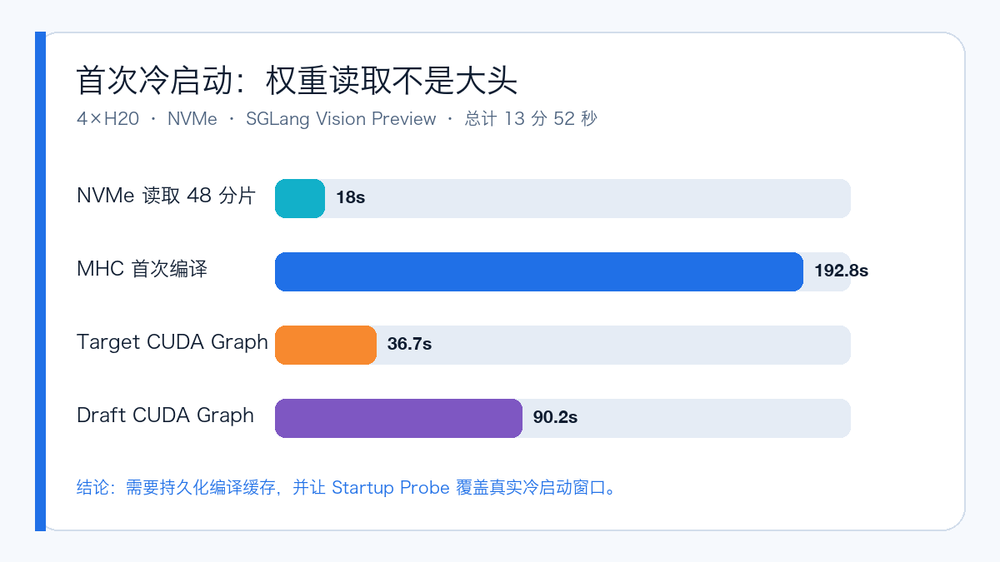
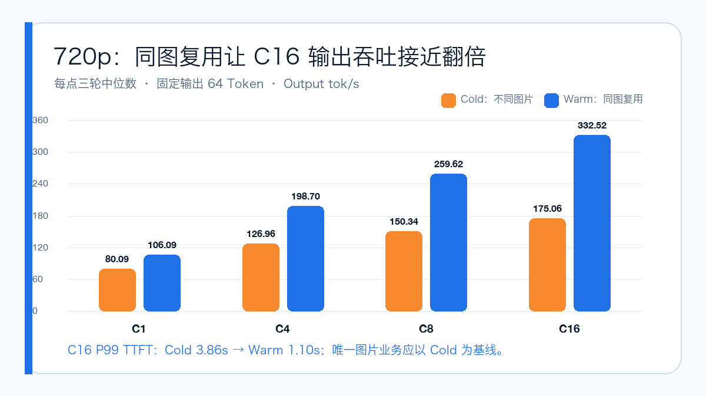

# DeepSeek-V4-Flash-Vision-Exp Day 0：4 张 H20 跑通多模态

2026 年 8 月 31 日晚，DeepSeek 在 Hugging Face 公开了 **DeepSeek-V4-Flash-Vision-Exp**。

它不是给文本版 DeepSeek-V4 换一个名字，而是在 DeepSeek-V4-Flash 上加入完整视觉编码链路的实验版本：仓库标记为 305B，Checkpoint 由 48 个 Safetensors 分片组成，实际约 156.31 GiB；视觉侧包含 32 层 ViT、Aligner、图像 Marker 和图像可见性 Attention，单图最多展开为 384 个 Image Token，原生 Context 仍为 1,048,576。

模型发布后，我用 **单节点 4×141GB H20** 和 SGLang 专用 Preview Runtime，完成了 NVMe 权重预热、服务启动、图片正确性、OpenWebUI 实操和 79 轮多模态压测。

最终结果是：**3,856 个请求全部成功，失败数为 0；完整测试结束后，Deployment 自动缩容到 0，4 张 GPU 已释放。**

> 一句话结论：这套 Preview 配方确实能在 4 张 H20 上提供真实多模态服务，但 13 分 52 秒的首次冷启动、首次新形状 JIT 和 FP8 KV Scale 回退，决定了它还不能被当成一个“拉起 Pod 就能上线”的普通模型。

## 先看这次回答了什么

- 原始 Hugging Face Checkpoint 可以从宿主机 NVMe 直接以 TP4 加载；
- 纯文本、单图、双图交错和 OpenWebUI 图片上传全部通过；
- 720p 冷图在并发 16 时达到 175.06 Output tok/s；
- 相同图片复用的 Warm 路径达到 332.52 Output tok/s；
- 2×720p 和 4×720p 多图请求都能稳定完成；
- SGLang 当前有 Vision-Exp 专用 Preview 实现；
- vLLM 公开 Recipe 仍是文本版 V4，因此本次不伪造框架 A/B。

## 模型与实验环境

本轮固定使用下面这套组合：

| 项目 | 实测配置 |
| --- | --- |
| 模型 | DeepSeek-V4-Flash-Vision-Exp |
| Revision | e46e16bf6035c6f317eb2ac7458eb0362926d402 |
| Checkpoint | 48 分片，156.31 GiB |
| GPU | 单节点 4×NVIDIA H20-3e，141GB/卡 |
| Runtime | SGLang 0.0.0.dev1+g914197146 |
| PyTorch / CUDA | 2.13.0+cu130 / 13.0 |
| 并行 | TP4，单节点 |
| 权重热路径 | 宿主机 NVMe |
| 推测解码 | DSpark，gamma=5 |
| KV Cache | FP8 E4M3 |

这是一轮单节点 TP4 测试，通信不跨节点，所以**本次没有使用 RDMA**。节点拥有 RDMA 设备，不代表每次推理实验都可以写成“已验证 RDMA”。

H20 也不在当前 Vision-Exp 官方签字硬件矩阵里。本文能证明的是：这组 H20、Driver、CUDA 与 Preview commit 的组合实测可用，不代表所有 H20 环境都能无条件复现。

## 先把 156 GiB 权重放到 NVMe

共享文件系统只承担模型分发，不承担 Serving 热路径。

选定节点后，我先把完整 Checkpoint 复制到宿主机 NVMe，并检查 48 个 Index 引用分片全部存在、源目录和目标目录的分片总字节数一致、目标目录底层设备确实是 NVMe，最后再写入完成 Marker。

本次权重复制耗时 **3 分 39 秒**。启动后，Runtime 从 NVMe 读取 48 个分片只用了约 18 秒。

这一步解决了“大权重从共享存储慢慢读”的问题，但没有解决首次 Kernel 编译、Autotune 和 CUDA Graph Capture。

## Ready 为什么仍然用了 13 分 52 秒



从进程启动到 API Ready，总耗时是 **13 分 52 秒**。

几个关键阶段分别是：

- NVMe 读取 48 个权重分片：约 18 秒；
- MHC 首次编译：192.8 秒；
- 主模型加载完成：启动后约 247 秒；
- DSpark 权重加载：16.4 秒；
- Target CUDA Graph Capture：36.7 秒；
- Draft CUDA Graph Capture：90.2 秒。

这里最容易得出一个错误结论：既然 NVMe 读权重只要 18 秒，Pod 就应该很快 Ready。

实际上，Preview Runtime 的首次 MHC、DeepGEMM/FlashInfer Autotune 和两套 CUDA Graph 才是大头。生产环境如果每个新 Pod 都从空编译缓存开始，即使权重已经在 NVMe，也很难做到分钟级恢复。

因此 Startup Probe 必须覆盖真实冷启动窗口，滚动发布前还要验证编译缓存持久化与预热策略。

## 图片链路不是“HTTP 200 就算通过”

功能 Gate 使用猫、狗两张真实图片，要求模型给出确定性结果：

| Case | 期望 | 实际 |
| --- | --- | --- |
| 纯文本 | TEXT_OK | TEXT_OK |
| 猫图片 | CAT | CAT |
| 狗图片 | DOG | DOG |
| 猫→狗双图交错 | CAT,DOG | CAT,DOG |

答案会随图片替换而变化，双图顺序也正确。这排除了“接口返回 200，但图片被忽略”的假通过。

随后把同一个 OpenAI-compatible API 接入 OpenWebUI。在强制 Light 模式下上传猫图后，模型正确识别出猫、粉色连帽皮衣和墨镜。


这张图同时证明了跨集群访问、模型发现、图片上传、Chat Completions 多模态格式和 UI 渲染链路都已经闭环。

## 79 轮压测是怎么跑的

主测试生成确定性的 360p、720p、1080p 和多图 JPEG，只评价 Serving 性能，不冒充标准视觉能力测评。

Cold Case 每个请求使用不同图片；Warm Case 复用同一图片。每个有效点固定输出 64 Token，使用相同 Seed、相同请求集合和参数，重复三轮后取逐轮指标中位数。

客户端统一使用：

```text
vllm bench serve --backend openai-chat
```

命令名里虽然有 vLLM，被测服务仍然是 SGLang。客户端只通过 OpenAI-compatible HTTP 接口发送请求。统一客户端的价值，是让后续支持 vLLM Vision-Exp 时可以复用同一请求集合；它不会把 SGLang 服务“变成 vLLM”。

完整矩阵耗时 46 分钟，生成 79 个结果 JSON：112 个 Warm-up 请求、3,744 个正式请求，合计 **3,856 成功、0 失败**。

## 720p：复用同图时吞吐接近翻倍



| 并发 | Cold Output tok/s | Warm Output tok/s | Cold P99 TTFT | Warm P99 TTFT |
| ---: | ---: | ---: | ---: | ---: |
| 1 | 80.09 | 106.09 | 386.84ms | 214.50ms |
| 4 | 126.96 | 198.70 | 1.07s | 399.69ms |
| 8 | 150.34 | 259.62 | 1.96s | 624.84ms |
| 16 | 175.06 | 332.52 | 3.86s | 1.10s |

在 C16，Warm 路径相对 Cold 的请求吞吐与输出吞吐都提高约 90%，P50 TTFT 降低 54.2%，P99 TTFT 降低 71.4%。

这不代表模型本身突然快了一倍，而是相同图片复用减少了视觉预处理和 Encoder 重复工作。真实业务如果图片大多唯一，应当以 Cold 数据做容量基线。

## 多图请求不能只看 Token/s

| Case | 并发 | Req/s | Output tok/s | P50 TTFT | P99 TTFT |
| --- | ---: | ---: | ---: | ---: | ---: |
| 1080p Cold | 8 | 2.54 | 162.38 | 912.25ms | 1.99s |
| 2×720p Cold | 8 | 1.71 | 109.42 | 1.43s | 3.68s |
| 4×720p Cold | 4 | 2.11 | 134.75 | 800.79ms | 1.19s |

4×720p、C4 每秒处理约 8.44 张图片，但每个请求本身包含四张图；它和 2×720p、C8 的调度压力并不相同，不能只比较 Req/s 就宣布谁更快。

多模态容量规划至少要同时记录图片数、分辨率、请求吞吐、TTFT 和输出吞吐。

## Ready 以后还有首次新形状 JIT

360p、C16 的第一次正式记录里，P99 TTFT 达到 7.91 秒；后两轮降到约 1.22～1.24 秒。

我没有删除这个“不好看”的首轮数据。主表按预定规则取三轮中位数 1.24 秒，原始 JSON 则全部保留。

这说明 `/v1/models` Ready 之后，新的 Batch Shape 仍可能触发首次编译。Canary 预热不能只发一条文本请求，还要覆盖生产计划使用的图片分辨率、图片数和并发。

## 为什么没有 vLLM 对比数据

截至 2026 年 9 月 1 日，vLLM 公开的 DeepSeek-V4 Recipe 是文本模型，Multimodal 分类里也没有 Vision-Exp。

文本 V4 能加载同家族语言权重，不等于它能加载 ViT/Aligner、处理 `image_url`、维护图片可见性 Mask 并正确返回视觉答案。

因此这次不做两件事：

1. 不用文本版 vLLM 镜像跑图片请求，再把报错写成“vLLM 性能差”；
2. 不让图片被静默忽略后，只因为 HTTP 200 就伪造 SGLang/vLLM A/B。

等 vLLM 出现明确的模型注册、专用 Recipe 和图片端到端测试后，可以复用同一客户端、同一 JSONL、同一 H20 节点和同一 NVMe Checkpoint 做公平复测。

## 如果准备上线，我会先做这七件事

1. 固定 Preview commit 和镜像 Digest，不使用会漂移的 latest；
2. 共享文件存储只做模型源，NVMe 做 Serving 热路径；
3. 至少预留 15 分钟冷启动预算，并持久化编译与 Autotune Cache；
4. 按图片数和分辨率做 Admission Control；
5. Cold/Warm 分开建容量基线；
6. Canary 预热覆盖真实图片形状与并发；
7. Benchmark 完成后自动缩容，避免测试 Pod 长时间占用 GPU。

## 本次还没有证明什么

- 没有验证模型声明的 1M Context 与图片共同输入；
- 没有运行 MMMU、MathVista、RealWorldQA、OCRBench 等标准视觉质量数据集；
- 没有验证跨节点 TP/EP、RDMA 或 P/D 分离；
- 没有得到 vLLM Vision-Exp 数据；
- Preview Runtime、FP8 KV Scale 回退和 H20 非官方签字硬件仍是上线风险。

但 Day 0 最关键的工程问题已经回答：**DeepSeek-V4-Flash-Vision-Exp 可以在 4×141GB H20 上通过 SGLang Preview 以 TP4 提供真实多模态服务；NVMe 权重热路径、OpenWebUI 图片链路和 3,856 请求性能矩阵均已闭环。**

## 参考资料

- DeepSeek-V4-Flash-Vision-Exp 模型仓库：https://huggingface.co/deepseek-ai/DeepSeek-V4-Flash-Vision-Exp
- SGLang DeepSeek-V4 Cookbook：https://docs.sglang.io/cookbook/autoregressive/DeepSeek/DeepSeek-V4
- vLLM DeepSeek Recipe 清单：https://recipes.vllm.ai/deepseek-ai
