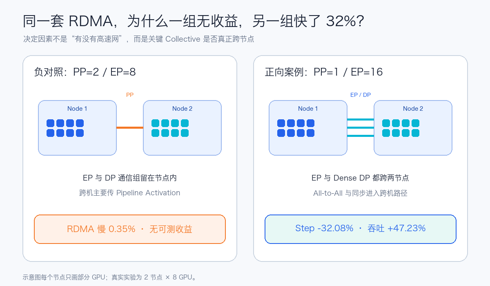
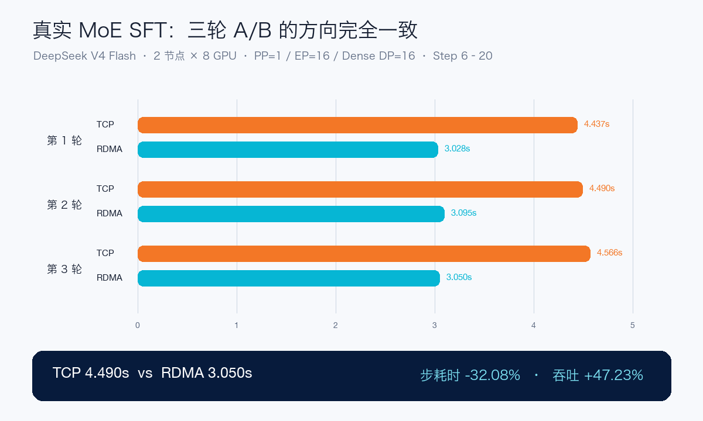
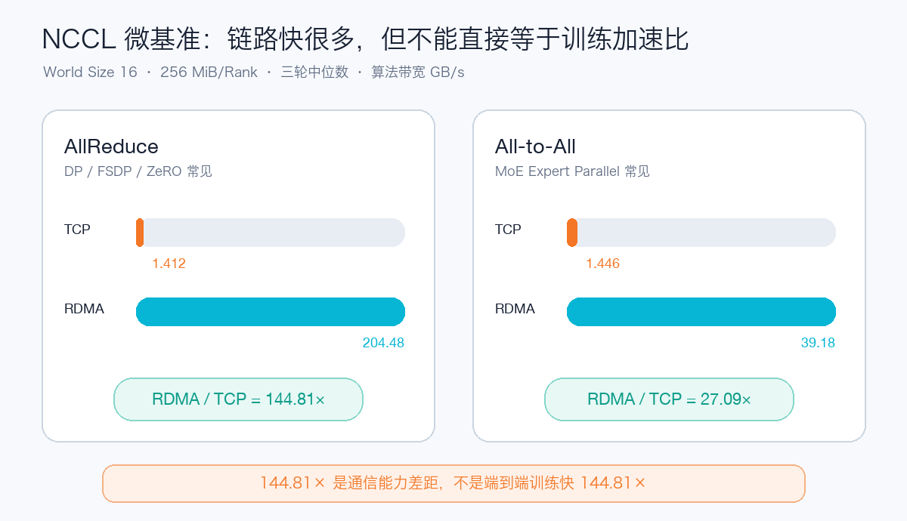
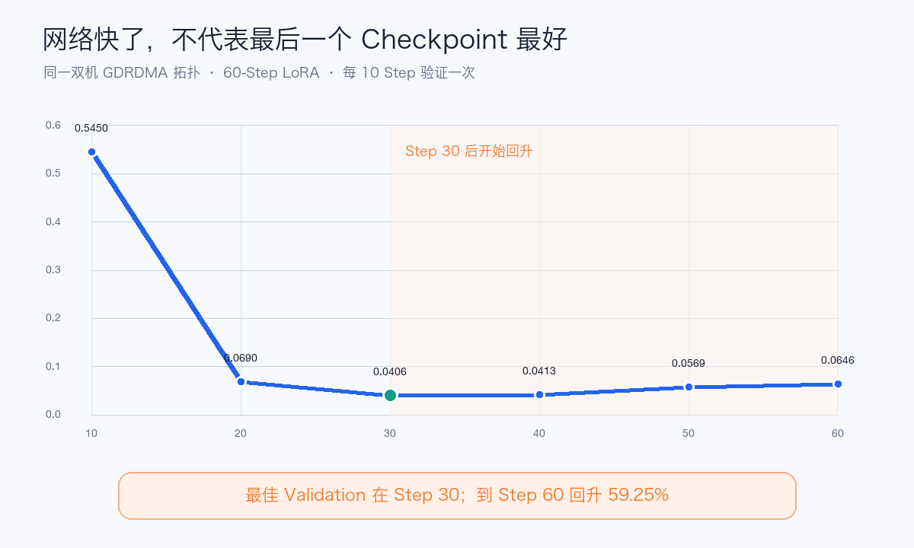

# 双机 16 卡训练，RDMA 真能快 47%？我用 DeepSeek V4 做了 6 轮 A/B

RDMA 在大模型训练里很容易被讲成一句话：带宽更高、延迟更低，所以多机训练一定更快。

但我前后跑了两组 DeepSeek V4 双机实验，结果完全不同。

第一组打开 RDMA 后，稳定 Step 反而慢了 `0.35%`，属于正常波动，没有可测收益；第二组只调整并行拓扑，RDMA 就把稳定 Step 从 `4.490` 秒降到了 `3.050` 秒，步耗时下降 `32.08%`，等价训练吞吐提升 `47.23%`。

它们使用的是同一类机器、同一套高速网络和同一个模型。为什么结论差这么大？

答案不是“RDMA 偶尔玄学”，而是：

> RDMA 是否有用，首先取决于训练里的关键通信有没有真正跨节点，并进入每个 Step 的关键路径。



## 先把最终结果放在前面

正向实验使用 `2 节点 × 8 GPU`，运行 DeepSeek V4 Flash 0731 的 MoE LoRA 训练，并固定：

- 模型、数据与数据 Hash；
- GPU、节点和 Rank 映射；
- Micro Batch、Global Batch 与最大序列长度；
- 镜像、训练框架和 NCCL 版本；
- 训练 Step、暖机规则和计时方式。

TCP 与 RDMA 各跑三轮，每轮 20 Step，排除前 5 个编译和通信暖机 Step，只比较 Step 6～20。

| 轮次 | TCP | RDMA | 步耗时下降 | 等价吞吐提升 |
| --- | ---: | ---: | ---: | ---: |
| 第 1 轮 | 4.437 s | 3.028 s | 31.74% | 46.50% |
| 第 2 轮 | 4.490 s | 3.095 s | 31.07% | 45.07% |
| 第 3 轮 | 4.566 s | 3.050 s | 33.20% | 49.71% |
| **三轮中位数** | **4.490 s** | **3.050 s** | **32.08%** | **47.23%** |

固定 Global Batch 为 16 后，等价样本吞吐从 `3.563 samples/s` 提高到 `5.246 samples/s`。



这里的“吞吐提升 47.23%”来自稳定 Step Time 的倒数关系，不包括镜像拉取、模型加载、编译、Checkpoint 和实验上报收尾。

## 这不是一上来就跑出来的

这组测试之前，训练链路经历了四个阶段：

```text
单卡小模型 LoRA
    ↓ 验证数据、Loss、Checkpoint 和推理
单机 8 卡 DeepSeek V4 EP=8
    ↓ 验证 FP8 基座、MoE、Expert Parallel
双机 PP=2 / EP=8
    ↓ RDMA 负对照：没有可测收益
双机 PP=1 / EP=16 / Dense DP=16
    ↓ TCP 与 GDRDMA 各三轮正式 A/B
```

这个过程很重要。直接从一个双机 Job 得出“RDMA 有用”或“RDMA 没用”，很容易把模型加载、编译、Pipeline Bubble、节点差异甚至数据变化误认为网络收益。

## 为什么第一组 RDMA 没有收益

第一组双机拓扑是：

```text
TP=1 / PP=2 / EP=8 / Dense DP=8
```

每个 Pipeline Stage 恰好使用一台机器的 8 张 GPU，所以 EP 与 DP 通信组都留在节点内。跨节点的主要流量只是两个 Pipeline Stage 之间的 Activation 和反向 Gradient。

同口径稳定段结果是：

| Transport | 稳定 Step |
| --- | ---: |
| TCP | 4.109 s |
| RDMA | 4.124 s |
| 变化 | RDMA 慢 0.35% |

这不是 RDMA 失效，而是这组负载的主要跨机流量没有大到足以改变 Step 时间。

如果只看到 Pod 已经挂载 RDMA 设备、NCCL 也选择了 IB，就宣布训练会变快，这组负对照会直接推翻这个结论。

## 为什么换一个拓扑就快了

正向实验把拓扑改成：

```text
TP=1 / PP=1 / EP=16 / Dense DP=16
```

16 个 Expert Parallel Rank 横跨两台机器，MoE Router 每一步产生的 Token Dispatch/Combine 必须进行跨机 All-to-All；Dense DP 同步也进入跨节点路径。

换句话说，这次高速网络不再只是“可用”，而是真正承载了每个训练 Step 都绕不开的通信。

可以用一个简单的式子理解：

```text
RDMA 的端到端收益
≈ 跨节点通信占 Step 的比例
× RDMA 能缩短的通信时间
× 这部分通信无法被计算隐藏的比例
```

这也解释了哪些训练通常更值得测试 RDMA：

- MoE Expert Parallel 跨节点产生的大量 All-to-All；
- Dense 全参数 DDP 的大梯度 AllReduce；
- FSDP、ZeRO-3 的 Reduce-Scatter 与 AllGather；
- 跨节点 Tensor Parallel 的层内高频 Collective；
- 通信量足够大的 Pipeline Activation。

参数量很小的 LoRA、很短的序列或者完全留在单节点内的通信组，收益通常就不会那么明显。

## 先用 NCCL 微基准证明链路确实成立

真实训练之前，我先对 16 Rank 的 AllReduce 和 All-to-All 做消息大小扫描。每个点 5 次预热、20 次计时，TCP 与 RDMA 各重复三轮。

在 `256 MiB/Rank` 上，三轮中位数如下：

| Collective | TCP | RDMA | RDMA / TCP |
| --- | ---: | ---: | ---: |
| AllReduce | 1.412 GB/s | 204.482 GB/s | **144.81×** |
| All-to-All | 1.446 GB/s | 39.180 GB/s | **27.09×** |



这组数字说明 RDMA 链路能力明显强于 Socket，但不能写成“训练快了 144 倍”。

通信只是训练 Step 的一部分。Forward、Backward、Kernel、HBM 访问、路由和框架开销都不会因为网络带宽提高 144 倍而消失。真实训练最终兑现的是步耗时下降约 32%，而不是 144 倍。

微基准还出现过一轮明显较慢的 RDMA All-to-All。因此最终报告使用三轮中位数，并保留异常轮次；如果只选择最快一次，很容易把网络稳定性写得过于理想。

## “申请了 RDMA 资源”还不能算验收通过

TCP 组需要在 NCCL INFO 中明确看到：

```text
NET/Socket
```

RDMA 组则需要确认跨节点 Channel 使用：

```text
NET/IB/.../GDRDMA/Shared
GPU Direct RDMA Enabled
```

GPUDirect RDMA 的关键是让兼容网卡直接 DMA GPU Memory，减少 Host Memory Bounce、CPU 拷贝和内核网络栈参与：

```text
TCP：     GPU → Host Memory → Kernel/Socket → NIC
RDMA：    GPU → Host Memory → RDMA NIC → Network
GDRDMA：  GPU Memory ↔ RDMA NIC → Network
```

但 GDRDMA 也不是只改一个环境变量。GPU、NIC、驱动、Peer Memory、NUMA 和 PCIe 拓扑需要共同匹配。本次节点上 8 张 GPU 各有一张 `PIX` 距离的本地 NIC，NCCL 最终为跨机 Rank 选择了对应 HCA 路径。

因此一套完整验收至少有四层：

1. 容器里能看到 RDMA 设备；
2. GPU、NIC、NUMA 与 PCIe 拓扑没有明显绕远；
3. NCCL 日志明确出现跨节点 `NET/IB/.../GDRDMA`；
4. 相同训练负载完成 TCP/RDMA A/B。

前三层证明“路径成立”，第四层才回答“业务有没有变快”。

还要强调：本次正式对照是 `NET/Socket` 与 `NET/IB + GDRDMA`，没有增加“IB 但禁用 GDRDMA”的第三组，因此不能把全部 32.08% 都单独归因于 GPU Direct。要拆出 GDRDMA 自身贡献，还要保持 IB 不变，再单独控制 GDR 策略。

## SwanLab 负责训练实验，但不能替代网络监控

TCP 三轮、RDMA 三轮一共六个正式 Run 都上传到了自托管 SwanLab。


页面里同时保留了 Train Loss、Gradient Norm、Learning Rate、MoE Load Balancing Loss、显存和累计训练速度，便于确认不同 Transport 下训练轨迹仍然可比。

这里还踩到一个容易影响结论的口径：训练框架上报的 `train_speed(s/it)` 是从第 1 步到当前步的累计均值，前两步包含编译和通信暖机。如果直接比较第 20 步的累计值，初始化成本仍然被摊在结果里。

因此我先用累计均值反推出每一步瞬时耗时，再只统计 Step 6～20：

```text
instant_n
= n × cumulative_mean_n
  - (n - 1) × cumulative_mean_(n - 1)
```

SwanLab 适合管理 Run、参数和训练曲线；GPU 利用率、NIC 吞吐、RDMA Counter、ECN/PFC、重试和慢 Rank，仍然应该交给 Prometheus/Grafana。最好用统一 Run ID 和时间窗把两类数据对齐。

## 网络更快，也不代表最后一个 Checkpoint 最好

20-Step A/B 是性能实验，不是模型效果实验。为此我又在相同的双机 GDRDMA 拓扑上跑了一次 60-Step LoRA，并每 10 Step 做一次验证。

结果非常典型：Train Loss 一直下降到 `0.00030`，Validation Loss 却在 Step 30 达到最佳 `0.04059`，随后开始回升；到 Step 60 时比最佳点高了 `59.25%`。



也就是说，RDMA 可以让每一步更快，却不能替你选择数据、控制过拟合或判断最佳 Checkpoint。

这轮实验还暴露了一个实用问题：`eval_steps=10`，但 `save_steps=20`，导致最佳的 Step 30 没有保存。训练配置应该让保存间隔覆盖每个验证点，或者直接按最佳验证指标保存。

## 一套不容易自欺的 RDMA 训练测试方法

回头看这几轮实验，我认为最值得复用的不是“吞吐提升 47.23%”这个数字，而是下面这套测试顺序：

1. 先画清楚 TP、PP、EP、DP 的 Rank 和通信组；
2. 检查哪些 Collective 真正跨节点；
3. 用 GPU/NIC 拓扑、RDMA 设备和 NCCL INFO 验收 Transport；
4. AllReduce 与 All-to-All 分别跑微基准；
5. TCP/RDMA 固定节点、数据、模型、Batch、Rank 和软件版本；
6. 排除加载、编译、Eval 与 Checkpoint，只比较稳定 Step；
7. 至少重复三轮，发布中位数和异常值；
8. 增加一组关键通信不跨节点的负对照；
9. SwanLab 记录训练曲线，Grafana 记录 GPU 与网络；
10. 性能实验和收敛/效果实验分开下结论。

## 最后的结论

这次双机 16 卡实测可以支持三个结论：

- RDMA 把大消息 AllReduce 与 All-to-All 的通信能力提高了一个数量级以上；
- 当 `EP=16 / Dense DP=16` 强制关键 Collective 跨节点时，DeepSeek V4 Flash LoRA 的稳定步耗时下降约 32%，等价吞吐提升约 47%；
- 当 EP/DP 留在单节点、跨机通信不占主导时，打开 RDMA 没有可测收益。

它不支持“所有训练上 RDMA 都能快 47%”。本轮性能 Run 只有 20 个 Optimizer Step、最大长度 512，使用合成领域数据和 LoRA，而不是全参数继续预训练。模型、序列长度、路由分布、并行策略和网络拥塞都可能改变最终比例。

所以真正应该问的不是：

> 我们有 RDMA，训练能快多少？

而是：

> 这个训练拓扑里，到底哪些通信跨了节点，它们占每个稳定 Step 的多少时间？

完整实验口径、机器可读原始结果和公开复现脚本已整理在 `aik8s.run` 的《DeepSeek V4 双机 16 卡 TCP/RDMA 实测》中。

