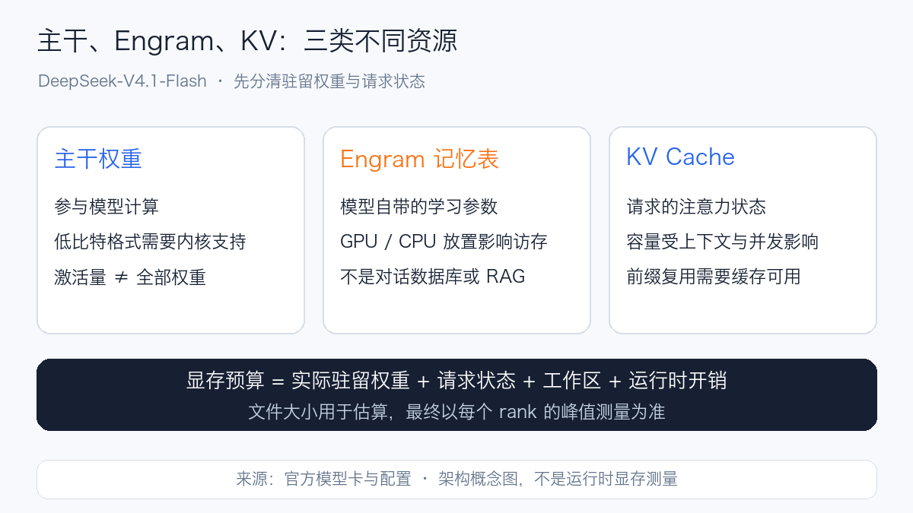
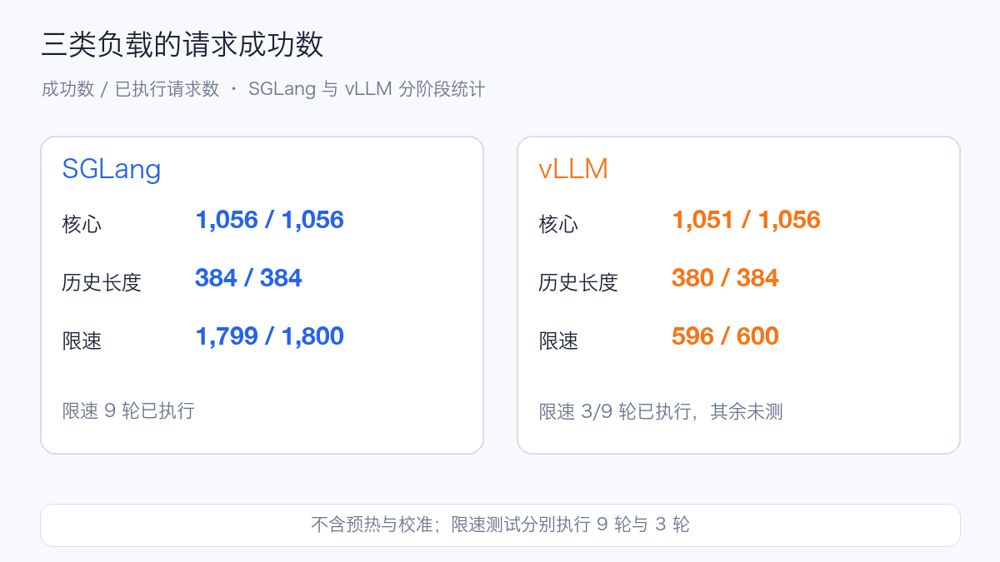
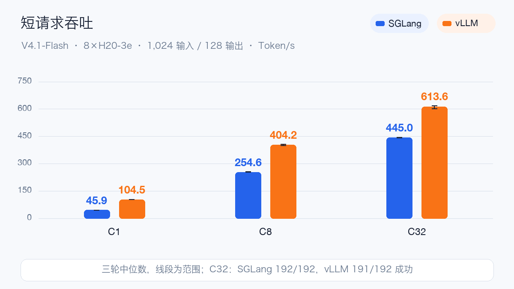
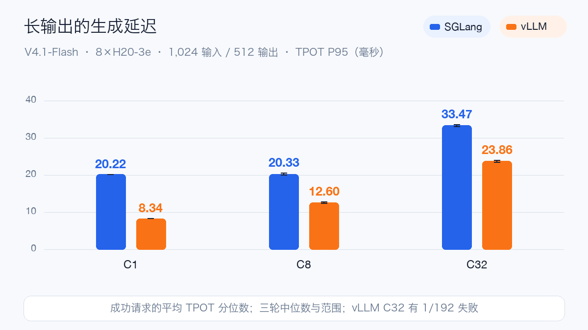
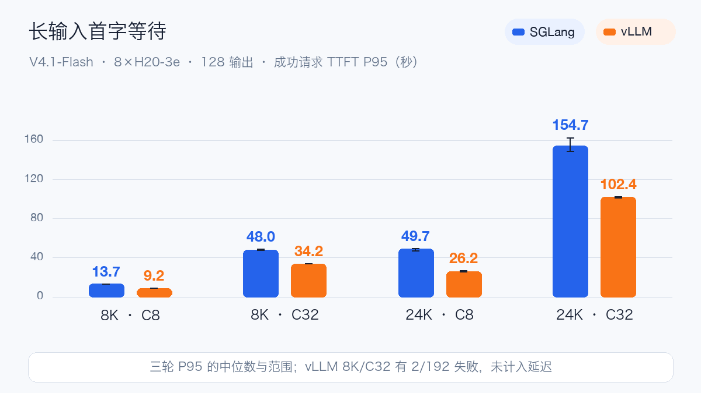
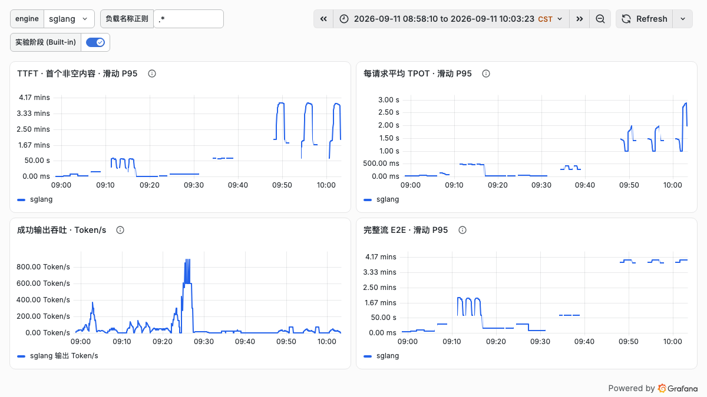
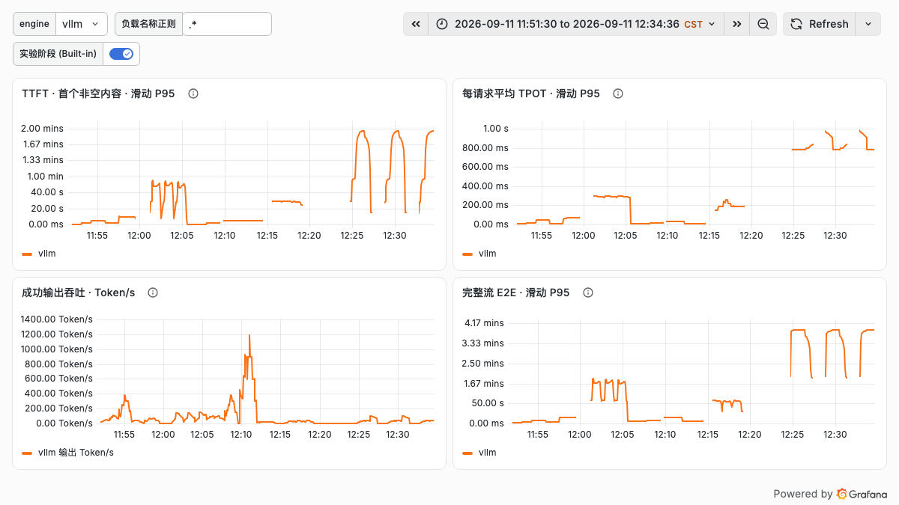
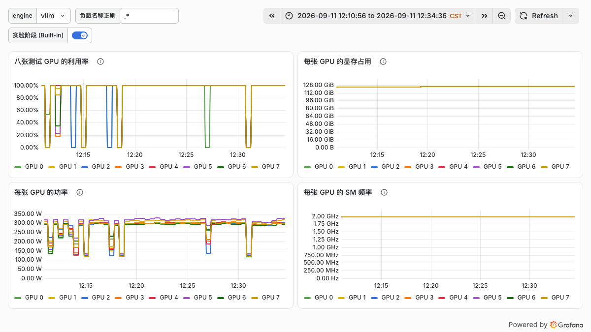

# DeepSeek-V4.1-Flash Day 0：八卡 H20，SGLang 与 vLLM 实测

DeepSeek-V4.1-Flash 是支持图片、文本输入和文本输出的开放权重模型。它采用混合专家架构，官方描述为 **552B 主干参数加 196B Engram 参数**，Prefill 与 Decode 阶段分别激活约 8B、16B 参数。激活参数量描述参与计算的部分，部署仍需容纳完整权重，不能按“每次只激活十几 B”估算显存。

Engram 条件记忆、编码与解码分工、原生视觉，是 V4.1-Flash 在部署上需要关注的三个变化。下面先介绍它们对显存和计算的影响，再看八卡 H20-3e 上的吞吐、首字延迟和生成速度。

## Engram 和 KV Cache 有什么区别

可以把主干权重理解为处理问题的计算规则，Engram 是训练形成的可学习记忆表，KV Cache 则是处理当前上下文时留下的中间状态。三者占用的空间和访问方式不同，需要分别估算。

Engram 属于模型参数，随训练形成。将它放在 CPU 上可以减少 GPU 权重占用，但会增加跨设备访存；Prefix Cache 则通过复用相同输入前缀的计算结果，减少重复 Prefill。部署时需要分别配置和测量。

V4.1-Flash 使用 CED 架构，包含 20 层因果编码器和 20 层解码器，输入和生成阶段的工作量不同。CSA2 稀疏注意力与局部窗口帮助处理长上下文，但服务的显存仍需覆盖全局 KV、局部状态和工作区。官方声明的 1M 上下文能力，不能直接换算成某张 GPU 可以承载的并发。

模型的专家权重采用 FP4，其他主要权重采用 FP8；运行时必须支持相应的权重格式和内核。新版本还包含原生视觉、编码与工具协议，以及 DSpark 推测解码。本文使用的两套运行时构建、依赖版本和配置列在下文。

## 八卡实测：吞吐、延迟与请求成功率

本次用一台八卡 H20-3e，串行测试 SGLang V4.1 预览构建和固定提交的 vLLM 支持分支。两套服务均加载成功，文本、多轮、工具和视觉样例通过。核心、历史长度与限速扫描共执行 **108 轮、5,280 个请求，14 个失败**；预热、校准和历史短文本模板另计。

vLLM 在多个场景中吞吐更高，核心矩阵的请求成功率为 99.53%；SGLang 为 100%。限速扫描中，SGLang 完成九轮，vLLM 完成三轮，其余六轮未执行。

核心矩阵：SGLang 36/36 轮全部通过，1,056/1,056 请求成功；vLLM 32/36 轮通过，1,051/1,056 请求成功。历史长度场景分别为 384/384 和 380/384；限速场景分别为 1,799/1,800 和 596/600。限速测试的执行范围不同，成功率按负载档位分别统计。

## 为什么先用八卡

锁定快照有 48 个 Safetensors 分片，总计约 **475.25 GiB**。其中 Engram 约 189.13 GiB，其他分片约 286.12 GiB。文件大小只用于容量估算，不能代替加载后的显存测量。

本机每卡 nvidia-smi 报告 143,771 MiB 显存。全部权重简单均摊，四卡约 118.81 GiB/卡、八卡约 59.41 GiB/卡；四卡在 85% 显存预算下已很紧，还没计算 KV、工作区与加载峰值。八卡配置为 KV 和运行时工作区留出了更多余量，本次采用 Engram 全部驻留 GPU 的方式。

实测固定 TP8、专家并行、32K 服务上下文和最多 32 个运行序列；关闭文本前缀缓存，不启用 DSpark 或 bounded replay。SGLang 用 `SGLANG_ENABLE_DSV41_ENGRAM_HOST_TABLE=0`，vLLM 用 `--engram-config '{"cpu_offload":false}'`，避免把 CPU/GPU Engram 的默认差异混进比较。

| 配置项 | SGLang | vLLM |
| --- | --- | --- |
| GPU / 并行 | 8×H20-3e / TP8+EP | 同一节点 / TP8+EP |
| 运行时 | V4.1 预览构建 | 79a7108d9 固定提交 |
| PyTorch / CUDA | 2.13.0 / 13.0 | 2.13.0 / 13.0 |
| Transformers | 5.12.1 | 5.17.0 |
| 实际 NCCL | 2.29.7 | 2.30.7 |
| 上下文 / 最大序列 | 32,768 / 32 | 32,768 / 32 |
| 显存预算比例 | 0.85 | 0.85 |
| Engram 放置 | GPU | GPU |

文本前缀缓存、DSpark 和 bounded replay 均关闭。实际内核、调度和依赖版本仍存在差异，这是一组固定部署配置的对照。

从发起服务启动到 Ready，SGLang 约 531 秒、vLLM 约 390 秒，包含启动检查和模型初始化。两套服务先后读取同一共享存储，未清空文件缓存，启动耗时仅作参考。完整镜像 Digest、启动参数和逐轮数据见文末“阅读原文”。

## 测试负载与统计口径

性能请求使用合成随机输入、固定输出、temperature=0 和 `ignore_eos=true`，走 `/v1/completions`。四种负载分别覆盖输入处理和生成阶段：

| 场景 | 输入 Token | 输出 Token |
| --- | --- | --- |
| 短请求 | 1,024 | 128 |
| 长输出 | 1,024 | 512 |
| 8K 输入 | 8,192 | 128 |
| 24K 输入 | 24,576 | 128 |

每种负载测 C1、C8、C32，C 表示客户端并发上限。每组先预热，再正式重复三轮；每轮分别发出 8、16、64 个请求。因此每个引擎核心矩阵为 **4 种长度×3 档并发×3 轮＝36 轮、1,056 个请求**。

下文吞吐和延迟均取三轮指标的中位数，图中细线表示三轮最小到最大值。吞吐以成功请求的输出 Token 除以整轮时长，延迟只统计成功请求；失败请求计入成功率分母。固定长度测试用于比较服务表现，不评估真实问答质量。

## 短请求：并发 1 到 32 的吞吐变化

输入 1,024 Token、输出 128 Token：

| 并发 | SGLang Token/s | vLLM Token/s |
| --- | --- | --- |
| C1 | 45.85 | 104.52 |
| C8 | 254.58 | 404.25 |
| C32 | 445.03 | 613.56 |

C1 时，两引擎的 TTFT P95 分别为 **248 ms、198 ms**；到 C32，分别增至 **5,686 ms、4,463 ms**。提高并发使总体吞吐上升，也让单个请求等待更久。

这组短请求中，SGLang 各档全部成功；vLLM C1、C8 全部成功，C32 为 191/192 成功。这组失败已计入吞吐与成功率统计。

## 长输出：512 Token 的生成速度

固定输入 1,024 Token，将输出增加到 512 Token，观察持续生成阶段：

| 并发 | 引擎 | Token/s | TPOT P95 ms |
| --- | --- | --- | --- |
| C1 | SGLang | 48.52 | 20.22 |
| C1 | vLLM | 115.17 | 8.34 |
| C8 | SGLang | 350.16 | 20.33 |
| C8 | vLLM | 613.74 | 12.60 |
| C32 | SGLang | 824.70 | 33.47 |
| C32 | vLLM | 1219.46 | 23.86 |

C1 时，TPOT P95 为 SGLang **20.22 ms**、vLLM **8.34 ms**；C32 时增加到 **33.47 ms**和 **23.86 ms**。两引擎的总吞吐继续上升，但单个请求生成后续 Token 的等待也变长。

三轮合计，C1、C8 各为 24、48 个请求，双方全部成功；C32 为 SGLang 192/192、vLLM 191/192 成功。这里的 TPOT 是每请求平均生成间隔的分位数，不是逐 Token 间隔 P95；一个流式 Chunk 可能包含多个 Token。

## 长输入：8K 和 24K 的首字等待

固定输出 128 Token，增加输入长度后，首字延迟的变化更明显：

| 输入 / 并发 | SGLang TTFT P95 秒 | vLLM TTFT P95 秒 |
| --- | --- | --- |
| 8K / C1 | 1.567 | 1.197 |
| 8K / C8 | 13.650 | 9.194 |
| 8K / C32 | 48.045 | 34.190 |
| 24K / C1 | 5.064 | 3.604 |
| 24K / C8 | 49.718 | 26.228 |
| 24K / C32 | 154.683 | 102.401 |

8K/C1 时，TTFT P95 约为 1.57 秒和 1.20 秒；到 8K/C32 已达到 48.05 秒和 34.19 秒。24K/C32 则超过百秒，分别为 **154.68 秒和 102.40 秒**。服务的最大运行序列数不是在线业务的推荐并发。

长输入也影响持续生成：24K/C32 的 TPOT P95 分别为 **1,330.07 ms、814.97 ms**；对应吞吐只有 **22.79、36.30 Token/s**。它与短输入、512 输出的高吞吐场景差别很大，因此不能用一个峰值 Token/s 覆盖所有业务。

SGLang 上述六组均全部成功；vLLM 的 8K/C32 为 190/192、24K/C1 为 23/24，其他组全部成功。TTFT 从请求发出计到第一个非空 text；延迟只统计成功请求，三轮 P95 中位数并非合并全部样本的 P95。这些延迟包含排队、Prefill 和生成阶段的影响，各部分耗时尚无独立 profile 数据。

## 限速负载：成功率与延迟

采用相同绝对请求率：0.300、0.480、0.660 请求/秒，输入 8K、输出 128 Token，每档三轮、每轮 200 个请求。客户端不再设并发上限，服务端仍最多运行 32 个序列。请求率是客户端设定的绝对负载，两引擎使用相同数值。

| 引擎 / 请求率 | 成功 / 请求 | TTFT P95 秒 | TPOT P95 ms |
| --- | --- | --- | --- |
| SGLang / 0.300 | 600/600 | 6.074 | 89.43 |
| vLLM / 0.300 | 596/600 | 3.249 | 38.64 |
| SGLang / 0.480 | 599/600 | 8.746 | 236.51 |
| SGLang / 0.660 | 600/600 | 26.138 | 371.23 |

成功数是每档三轮合计，延迟为各轮 P95 中位数。vLLM 在 0.300 档的三轮分别为 199/200、198/200、199/200 成功，触发连续失败保护，**0.480 和 0.660 两档未执行**。因此这里只能对最低负载做双引擎比较。

该档请求成功率为 SGLang 100%、vLLM 99.33%，但成功返回不等于等待时间达标。暂用“TTFT≤3 秒且每请求平均 TPOT≤50 ms”的实验阈值，两者达标比例分别为 **45.5%、88.5%**，达标请求吞吐分别约为 **0.136、0.265 请求/秒**。比例与达标吞吐均为各轮中位数，失败计为不达标。

按该阈值统计，部分成功返回的请求仍因等待过久而不达标。业务容量评估应使用自身的延迟目标；本次未单独核查客户端到达调度偏差，表中请求率不作为容量上限。

## Grafana 中的延迟与 GPU 资源

下面两张看板分别对应 SGLang 和 vLLM 的核心压测时段，依次运行短请求、8K 输入、长输出和 24K 输入。时间窗不同，横轴长度也不同；蓝色表示 SGLang，橙色表示 vLLM。

左上是 TTFT，右上是每请求平均 TPOT，左下是成功输出吞吐，右下是完整流 E2E。长输出阶段吞吐较高，切换到长输入后，首字和完整请求耗时明显增加。不同负载阶段应结合输入输出长度解读，不能只截取吞吐峰值作为服务容量。

看板的 P95 来自 **1 分钟滑动窗口的直方图估计**，分桶精度和样本数量都会影响曲线；正文表格则是逐请求结果计算出的整轮统计。客户端指标在请求结束后写入，因此曲线表示该时段完成请求的表现，空档也可能来自阶段切换或尚无请求完成。

八卡资源图对应 vLLM 的 24K 输入阶段。按 15 秒间隔查询的样本，各卡显存占用约 **123.65–124.67 GiB**，SM 频率为 **1.98 GHz**；高负载区间 GPU 利用率接近 100%，阶段切换时出现回落。这里的显存包含权重、KV 和运行时分配，不能当作模型权重大小，也不是逐毫秒捕获的峰值。

## 功能测试实际问了什么

聊天功能允许正常结束，并采用双方接口均接受的 `reasoning_effort: "low"`。测试 Prompt 与结果如下：

- 算术：`计算 17 加 25，只回答数字。`，最终答案 42。
- 多轮：先提供 `Remember code 482619.`，再问 `What was the code? Reply only with the code.`，返回 482619。
- 工具：`Use get_weather to look up weather in Beijing. Do not invent the weather.`，检查工具参数，并用模拟天气结果验证回灌；并未获取实时天气。
- 单图：`Name the main vegetable shown. Reply with one English noun only.`，使用官方 carrots/corn 图片。
- 双图：`Name the main vegetable in each image in order. Reply as two English nouns separated by a comma.`，交换顺序再检查。

视觉测试使用两张官方蔬菜样例，检查内容识别和图片顺序。SGLang 的结果来自补齐样例文件后的测试；这组样例不包含 OCR、文档理解或复杂场景识别。

## 部署建议：按业务等待预算决定并发

在线服务应先根据业务确定 TTFT 和 TPOT 目标，再设置并发、排队上限和超时。本次 24K 输入在 C32 下的 TTFT P95 超过百秒；长文本请求宜单独限制并发，并与短请求分开评估容量。

GPU 互联与 NUMA 也会影响部署。本机八卡两两 NV18，GPU 0–3 与 4–7 分属两个 NUMA 域。除了 GPU 通信，还需检查 tokenizer 线程、pinned memory 的分配位置，以及跨 NUMA 访问。八卡 Pod 横跨两个 NUMA 域，选择 CPU Manager 和 Topology Manager 策略时，应先确认节点能否满足相应的资源对齐要求。

生产容量需要结合请求成功率、首字等待和生成延迟共同评估。本次数据可作为部署与参数选择的参考，正式上线前还需用实际业务请求验证。

参考资料：

- DeepSeek-V4.1-Flash 模型卡：https://huggingface.co/deepseek-ai/DeepSeek-V4.1-Flash
- SGLang 官方配方：https://github.com/sgl-project/sglang/blob/main/docs/cookbook/autoregressive/DeepSeek/DeepSeek-V4_1.mdx
- vLLM V4.1 支持：https://github.com/vllm-project/vllm/pull/56201

阅读原文：https://aik8s.run/ai-k8s/practices/deepseek-v41-flash-h20-day0/
