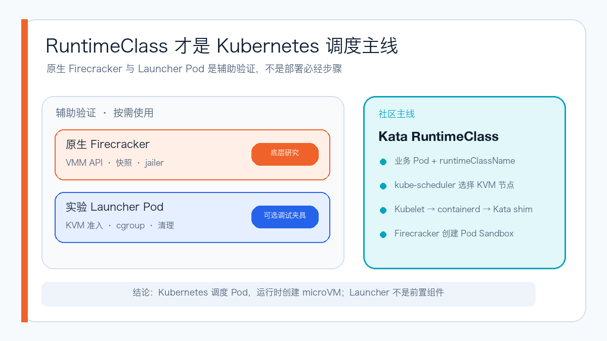
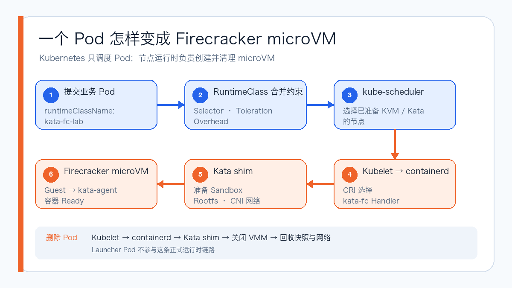
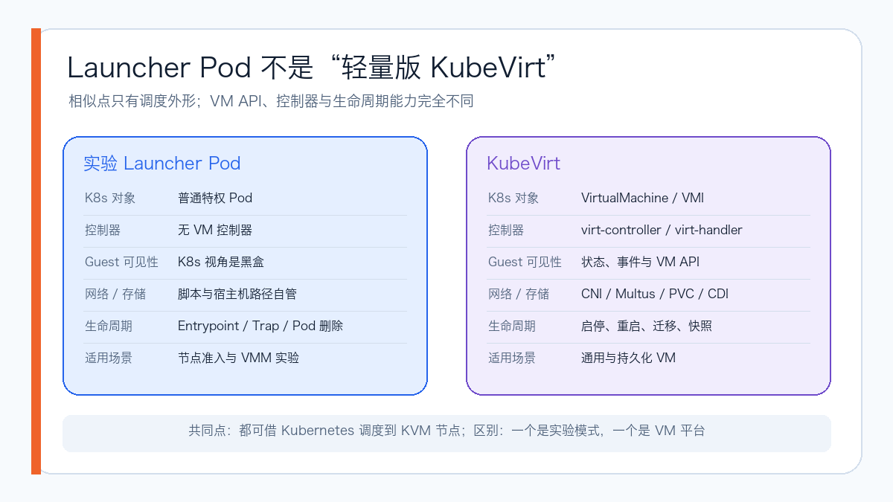
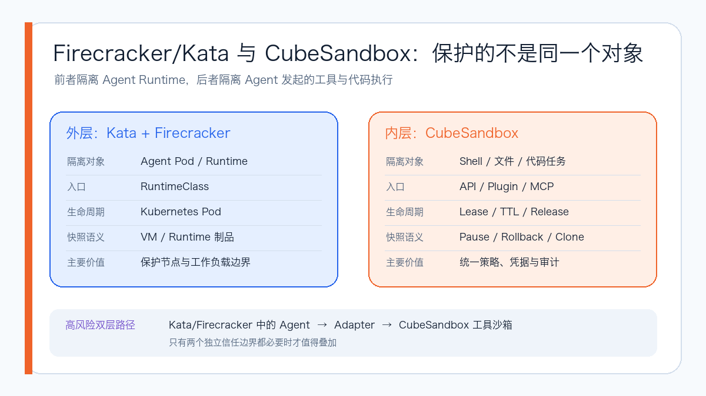

# Firecracker 实测：它怎样跑进 Kubernetes？

Firecracker 经常和“轻量虚拟机”“毫秒级启动”“安全沙箱”一起出现，但真正把它放进 Kubernetes 后，问题很快会从“VMM 能不能启动”变成另一组更具体的工程问题：谁负责镜像、网络、存储和清理？普通 Pod 怎样获得 microVM 隔离？快照恢复到底快到什么程度？容器指标还能不能代表真实开销？

为了把这些边界弄清楚，我在一台独立的 x86_64 Kubernetes Worker 上，以 Kata RuntimeClass 作为 Kubernetes 集成主线，完成 Pod 启动、并发创建、Agent 工作负载和资源核算；另外用原生 VMM 与可选的 Launcher Pod 拆解验证快照、jailer、KVM 准入、cgroup 和退出清理。

本轮使用 Firecracker 1.16.1、Kata Containers 4.1.0 runtime-rs、Kubernetes 1.30.4 和 containerd 1.7.14。所有结果均来自真实运行，截图已经脱敏；但单次启动和快照数据只作为冒烟观测，不包装成正式性能基准。

## Firecracker 现在主要用在哪里？

截至 2026 年 9 月，Firecracker 已经是一个经过大规模生产验证、但定位非常专门的 VMM。它没有取代 QEMU/KVM，也不是 Kubernetes 的默认运行时；它擅长的是在 Linux/KVM 主机上，以较低启动和资源开销为大量短生命周期、彼此不信任的工作负载提供独立 Guest Kernel。

最具代表性的生产使用是 AWS Lambda 与 AWS Fargate。Firecracker 最初正是为这类 Serverless 容器和函数场景开发：同一宿主机需要承载大量租户，又不能像普通容器一样共享宿主机内核。Fly.io 也公开说明其应用运行在 Firecracker microVM 中，并在此之上构建 Machines API、网络和生命周期控制面。

目前常见或正在增长的应用方向包括：

| 领域 | 为什么适合 Firecracker |
| --- | --- |
| Serverless / FaaS | 实例短命、创建频繁，需要兼顾密度、启动速度与租户隔离 |
| 多租户容器平台 | 希望继续使用 OCI 镜像，同时让不同租户不共享宿主机内核 |
| 不可信代码与 Agent 工具执行 | 用户代码或模型生成脚本风险高，需要一次任务一个可回收隔离环境 |
| 按需开发与边缘计算环境 | 实例可以快速启停，平台在上层补齐 API、网络、存储和调度 |
| Kubernetes 安全容器 | 通过 Kata RuntimeClass 为部分 Pod 增加 microVM 边界 |

它并不适合所有虚拟化场景。需要丰富设备模型、任意 Guest OS、成熟热迁移、复杂外设或传统虚拟机管理体验时，QEMU/KubeVirt 一类通用方案通常更合适。Firecracker 的流行来自“把一个窄场景做到极致”，而不是功能覆盖最广。

## 先说结论

- Firecracker 是 VMM，不是完整的 Kubernetes Runtime，也不是 Agent 沙箱控制面；
- 社区常见的 Pod 级集成，是让 Kubernetes 调度带 RuntimeClass 的 Pod，再由 containerd、Kata shim 创建 microVM；
- 原生 Firecracker 和特权 Launcher Pod 都是辅助验证手段，不是部署前置步骤；
- 普通 Pod 需要 Firecracker microVM 隔离时，Kata RuntimeClass 是本轮更接近实际使用的路径；
- 单次快照恢复到 Guest 网络 Ready 为 26.15ms，单次冷启动基线为 1.280s，约快 49 倍，但还需要重复样本才能称为基准；
- 1、5、10 Pod 三档并发全部成功，10 Pod 批次 P50 为 6 秒、P95 为 8 秒，删除后没有遗留 VMM；
- 只看 `kubectl top` 会漏掉 shim、VMM、块设备和宿主机侧成本；
- Firecracker/Kata 与 CubeSandbox 可以组合，但保护的是不同对象，双层 microVM 不应该成为默认架构。

## 社区主线：RuntimeClass 调度 Pod，运行时创建 microVM



在这条路径里，kube-scheduler 不直接调度 Firecracker 进程，也不需要用户先创建一个 Launcher Pod。它调度的是声明了 `runtimeClassName` 的业务 Pod；Pod 到达支持 KVM 和对应 RuntimeClass 的节点后，Kubelet 把请求交给 containerd，再由 Kata shim 创建 Firecracker microVM 和其中的 Pod Sandbox。



RuntimeClass 还可以声明 `scheduling.nodeSelector`、`tolerations` 和固定 `overhead`：前两者确保 Pod 进入已经准备好 KVM、Kata 和镜像制品的节点，后者让调度器把 microVM 的额外 CPU、内存纳入资源核算。业务侧仍然提交普通 Pod，只是选择不同的 Runtime Handler。

本轮 Kata + Firecracker RuntimeClass 测试正是这条主线。Pod 只指定 `runtimeClassName`，后续由 containerd、Kata shim、devmapper snapshotter、CNI 和 Firecracker 一起完成 sandbox。这也是后续并发 Pod、Agent 运行和清理测试采用的路径。

## 为什么测试里还出现了 Launcher Pod？

Launcher Pod 是本轮自建的可选测试夹具：让一个特权 Pod 挂载 `/dev/kvm` 和实验目录，再由 Entrypoint 启动 Firecracker。它的目的不是给业务提供运行时，而是快速回答“这台 Worker 能否运行 Firecracker”“VMM 是否进入 Pod cgroup”“删除 Pod 后是否会清理”这些节点级问题。

实测中，VMM PID 确实进入该 Pod 的 CPU、内存、设备和 PIDs cgroup，删除 Pod 后进程也随之退出。但这并没有把普通 Pod 变成 microVM Pod。Launcher 拿到了 `/dev/kvm` 和可写宿主机路径，本质上是节点管理代码，不能直接开放给不可信用户。

原生 Firecracker 同样属于辅助验证。它直接通过 API Socket 配置 vCPU、内存、内核、rootfs 和网络设备，适合研究 VMM、快照和 jailer；调度、镜像、网络、存储、租户策略和垃圾回收仍需自行负责。因此，原生测试和 Launcher 测试都可以跳过，不影响 RuntimeClass 路径成立。

## 实验 Launcher 和 KubeVirt 看起来相似，为什么不是一回事？

它们确实有一个表面相似点：Kubernetes 最终都会调度一个承载虚拟化进程的 Pod 到 KVM 节点。KubeVirt 中也有一个名为 `virt-launcher` 的组件，因此尤其容易让人把两者混在一起。

但本轮实验 Launcher 只是自己编写的特权 Pod 和 Entrypoint。Kubernetes 只知道这个容器是否运行，并不知道里面的 microVM 期望状态、Guest 状态、磁盘、迁移或快照；VM 配置、API Socket、TAP、rootfs 和退出清理都由脚本负责。

KubeVirt 则向 Kubernetes 增加 `VirtualMachine`、`VirtualMachineInstance` 等资源，并由 `virt-controller`、`virt-handler` 等组件持续收敛状态。`virt-launcher` Pod 是承载单个 VMI 的执行单元之一，不等于整个 KubeVirt。



| 对比项 | 实验 Launcher Pod | KubeVirt |
| --- | --- | --- |
| 用户面对的对象 | 普通特权 Pod | VirtualMachine / VMI |
| 期望状态与控制器 | 无 VM 控制器，依赖脚本 | 控制器和节点守护进程持续收敛 |
| Guest 可见性 | Kubernetes 视角基本是黑盒 | 提供状态、事件和 VM API |
| 网络与存储 | TAP、rootfs、宿主机路径自行管理 | 对接 CNI/Multus、PVC/CDI/CSI 等能力 |
| 生命周期 | Entrypoint 启动，Trap 或删 Pod 清理 | 声明式启停、重启、迁移、快照等 |
| 更适合的场景 | 节点准入、VMM 实验和故障定位 | 通用或持久化 VM、遗留负载和虚拟化平台 |

所以 Launcher 不是“轻量版 KubeVirt”。它更接近一个让 kube-scheduler 帮忙放置 VMM 的实验模式；若要把它演进成平台，还要补上 CRD、控制器、状态同步、故障隔离、存储、网络、升级和垃圾回收，其中相当一部分正是 KubeVirt 已经解决的问题。

反过来，如果目标只是隔离节点上验证 Firecracker API、快照和安全机制，安装整套 KubeVirt 又会超出实验需要。此时 Launcher 的价值就是路径短、证据直接、用完即删。

## RuntimeClass 跑通了，但集成成本不能省略

Kata RuntimeClass 的一次冒烟运行从创建到 Ready 约 4 秒。进入 Pod 后看到的 Guest 内核是 Linux 6.18.35，与宿主机 Linux 5.10.134 不同；`kubectl exec` 和日志都能返回 Guest 内输出，Pod 删除后 Firecracker 进程和活跃 devmapper 快照也会消失。

真正耗时间的不是写一段 RuntimeClass YAML，而是处理运行时、存储和版本组合。

第一次失败来自 `default_maxvcpus = 0`。它被展开成宿主机全部 56 个逻辑 CPU，超出 Firecracker 接受范围；把实验配置限制为 2 vCPU 后才继续启动。

第二次失败来自 Kata 4.1.0 发布版的 Firecracker 超时配置：存在 `dial_timeout_ms`，却缺少兼容的 `reconnect_timeout_ms`。使用上游 Issue #13484 给出的临时参数组合后，sandbox 才成功 Ready。

本轮 devmapper 还使用了独立的 Loopback Thin Pool。它适合隔离实验，不是生产存储方案。真正上线需要裸设备或经过容量、持久化激活、监控和恢复验证的 Thin Pool，不能把一次实验配置直接复制到生产节点。

## 快照恢复：单次观察约快 49 倍

快照测试采用完整流程：暂停 Guest、创建完整快照、启动新的 Firecracker 进程、加载快照，再检查 ICMP 和 TCP/22。


本轮观测结果如下：

| 阶段 | 观测值 |
| --- | ---: |
| 完整快照 API | 188.82ms |
| 快照加载 API | 16.86ms |
| 恢复后 Guest ICMP Ready | 26.15ms |
| 单次冷启动 ICMP Ready | 1.280s |

恢复到首次 ping 成功约为单次冷启动基线的 49 倍。这个数字说明快照路径确实值得继续做，但还不能写成稳定的 P50/P95：本轮没有进行多次不可变磁盘克隆，也没有在相同宿主机状态下随机重复。

另外，快照不是“只有一个内存文件”。本次完整快照包含 256MiB 内存、约 23KiB VM 状态和匹配的 rootfs。生产控制面必须把这些制品的版本、原子性和回收一起管理。

## 10 个 Pod 并发：全部成功，P95 为 8 秒

RuntimeClass 路径分别创建了 1、5、10 个并发 Pod。Ready 时间包含 Kubernetes 调度、Kata 初始化、Firecracker Guest 启动和容器就绪。


| 批次 | Ready 时间 | 结果 |
| --- | --- | --- |
| 1 Pod | 4 秒 | 1/1 通过 |
| 5 Pod | 4、5、6、7、8 秒 | 5/5 通过，P50 6 秒 |
| 10 Pod | 4、5、5、6、6、6、7、8、8、8 秒 | 10/10 通过，P50 6 秒、P95 8 秒 |

峰值时包含保留 Workbench 在内共有 11 个 Firecracker 进程，聚合 RSS 约 1.45GiB。删除测试批次后，没有遗留额外 VMM 或活跃 devmapper 快照。

这仍然只是每档一个批次。若要用于容量规划，下一步应该扩展到 50/100 Pod，并随机重复至少 30 次，同时记录调度、镜像解包、Guest Ready、容器 Ready 和删除清理的独立阶段。

## 和之前三种 Agent 共用 CubeSandbox，有什么不同？

之前在《家里跑着三种 Agent 后，我给它们做了一个统一的 CubeSandbox 执行控制面》中，我让 OpenClaw、DSH 和 Hermes 保留各自的 Agent Runtime，把 Shell、文件和代码任务统一交给 CubeSandbox Adapter，再由 CubeSandbox 创建短生命周期 microVM。

这次 Firecracker 实验解决的不是同一个问题。



| 对比项 | Kata + Firecracker | CubeSandbox + Adapter |
| --- | --- | --- |
| 主要隔离对象 | Agent Pod 与 Runtime 本身 | Agent 发起的 Shell、文件和代码任务 |
| 调用入口 | Kubernetes RuntimeClass | API、Plugin、MCP 或 SDK |
| 生命周期 | 跟随 Pod 创建、升级和删除 | 跟随 Session、Lease、TTL 和显式 Release |
| 快照语义 | VM/运行时级制品，磁盘需配套管理 | 面向沙箱的 Pause、Snapshot、Rollback、Clone |
| 策略与审计 | 依赖 Kubernetes、Runtime 和平台补齐 | Adapter 集中处理身份、固定策略、租约和脱敏审计 |
| 主要成本 | 每个长期 Agent Pod 都有 shim/VMM 开销 | 活跃任务创建独立沙箱，控制面组件更多 |

最重要的区别是信任边界：

- 外层 Kata + Firecracker 保护 Agent Runtime 与宿主机、其他工作负载之间的边界；
- 内层 CubeSandbox 保护长期 Agent Runtime 中的凭据、浏览器状态和会话，不让模型生成的脚本直接在 Runtime 里执行。

两者可以叠加成：

```text
Kata/Firecracker microVM 中的 Agent
        → CubeSandbox Adapter
        → 独立 CubeSandbox 工具沙箱
```

这种双层路径适合同时满足两个条件的场景：Agent Runtime 本身需要独立 Guest Kernel；它执行的工具或第三方代码又不能与 Runtime 的长期状态处于同一信任域。

如果只有一种 Agent、任务风险低，或者 Agent Runtime 已经处于可信专用节点，双层 microVM 往往会增加内存、网络、存储和故障排查成本，不应为了“隔离层数更多”而默认叠加。

也不能直接拿两篇文章中的启动数字做性能排名。原生 Firecracker 的 Guest Ready、Kata Pod Ready 和 CubeSandbox 的 API Create-to-Running，测量起点、结束条件、镜像状态和控制面工作量都不同。真正公平的对比需要统一硬件、Guest、rootfs、网络策略、并发和 Ready 标准。

## 四种 Agent 实跑，验证了两层可以组合

在 Firecracker 实验里，OpenClaw、DSH、Hermes 和 Codex 都作为 Kata/Firecracker Pod 启动，再通过 CubeSandbox Adapter 测试工具执行链路。


OpenClaw 完成 3 次工具调用、0 失败；DSH 返回执行和释放标记；Hermes 的插件诊断、模型调用和生命周期审计通过。Codex 的 Adapter 客户端和官方 MCP stdio 握手通过，发现 17 个工具，但模型 Turn 没有被人为包装成成功：当时的模型网关只提供 Chat Completions，而 Codex 自定义 Provider 要求 Responses 协议。

这组结果证明的是“架构可以组合”，不是“双层一定更好”。测试中也发现 Kata TAP 无法使用常规 Service VIP，只能直连 Pod 地址；临时网络中继在验收后已经删除。生产环境必须修复 CNI/Service 路由和出站路径，不能把临时转发当成长期设计。

## 资源核算：只看容器会少算一层

在一个采样时刻，四个 Agent Payload 容器合计使用 1,094MiB；宿主机侧包含保留 Workbench 在内的五个 Firecracker 进程，聚合 RSS 约 2.68GiB。


这两个数字不是可以直接相减的同一口径，但足以说明：容器级指标只看到了 Guest 内 Payload，不能代表宿主机为 shim、VMM、Guest 和块设备实际付出的全部成本。

生产监控至少应该把四层信号对齐：业务容器、Kata shim 与 Firecracker cgroup、devmapper Thin Pool，以及宿主机 KVM/网络/内存压力。对 Agent 场景，还要增加 Adapter 租约、沙箱创建/释放和错误审计。

## Jailer：安全检查要看启动后的进程

Launcher Pod 是特权模式，因此安全基线另外使用版本匹配的 jailer 1.16.1 启动了一台 2 vCPU、256MiB microVM。


实测确认了这些控制：UID/GID 65534、每实例独立 chroot、新的 PID 与挂载命名空间、仅显式创建的 KVM/TUN 设备、有效 Capability 为 0、`NoNewPrivs=1`、CPU shares 64，以及 `nofile=128`。

还有一个容易误判的细节：`InstanceStart` 之前，API 进程显示 seccomp 模式 0；VM 启动后，四个 VMM 线程才全部进入 seccomp 过滤模式 2。因此不能只在启动前看一次进程状态，就声称最终安全控制已经生效。

这仍然只是配置基线，不是渗透测试。Guest 逃逸、恶意块设备、设备模拟、内核攻击面、宿主机服务访问和清理竞态，都需要专门的对抗性验证。

## 最后怎么选

- 想研究或自建最底层 VMM 控制面：直接使用原生 Firecracker；
- 只想验证 Kubernetes Worker 的 KVM、cgroup 和进程生命周期：可选用受控 Launcher Pod，用完即删；
- 用户面对的是完整或持久化虚拟机，需要 VM API、迁移、磁盘和声明式生命周期：选择 KubeVirt；
- 普通 Kubernetes Pod 需要独立 Guest Kernel：从 Kata + Firecracker RuntimeClass 起步；
- 要给多种 Agent 提供统一 Shell、文件、代码、租约、快照和审计 API：使用 CubeSandbox/Adapter 这一层；
- Agent Runtime 和不可信工具执行都需要独立信任边界：再考虑外层 Kata/Firecracker 加内层 CubeSandbox。

Firecracker 很小，但把它做成可运营的平台并不小。VMM 启动只是开始，真正决定能否生产落地的，是镜像、网络、存储、Runtime 兼容性、指标口径、安全控制和失败后的可靠清理。

## 参考资料

Firecracker 设计：
https://github.com/firecracker-microvm/firecracker/blob/main/docs/design.md

Firecracker 项目与应用定位：
https://github.com/firecracker-microvm/firecracker/blob/main/README.md

Firecracker jailer：
https://github.com/firecracker-microvm/firecracker/blob/main/docs/jailer.md

Kata Containers 虚拟化架构：
https://github.com/kata-containers/kata-containers/blob/main/docs/design/virtualization.md

KubeVirt 架构：
https://kubevirt.io/user-guide/architecture/

Fly.io 架构：
https://fly.io/docs/reference/architecture/

Kubernetes RuntimeClass：
https://kubernetes.io/docs/concepts/containers/runtime-class/

Kata runtime-rs Firecracker Issue #13484：
https://github.com/kata-containers/kata-containers/issues/13484

CubeSandbox Agent Adapter：
https://github.com/aik8s/cubesandbox-agent-adapter
