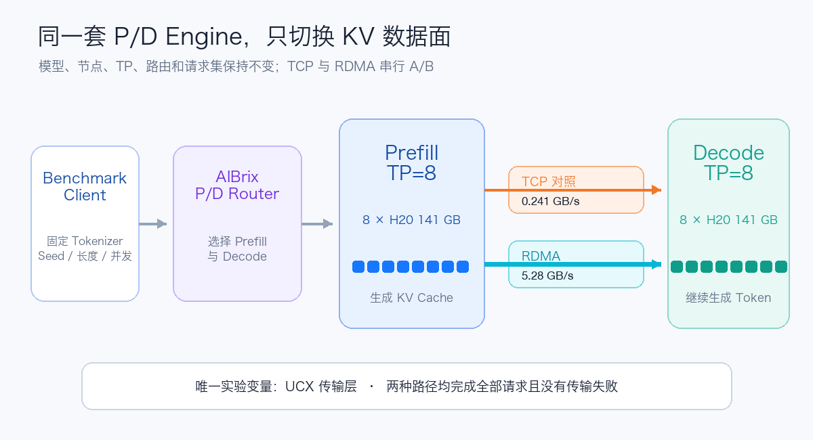
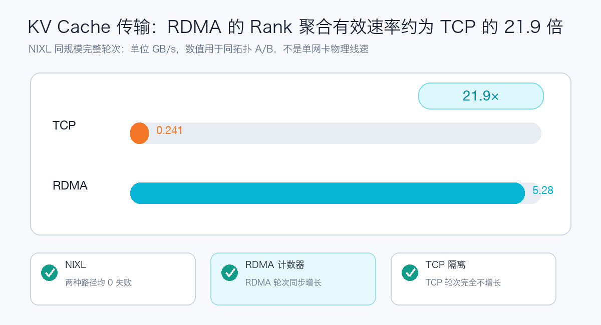
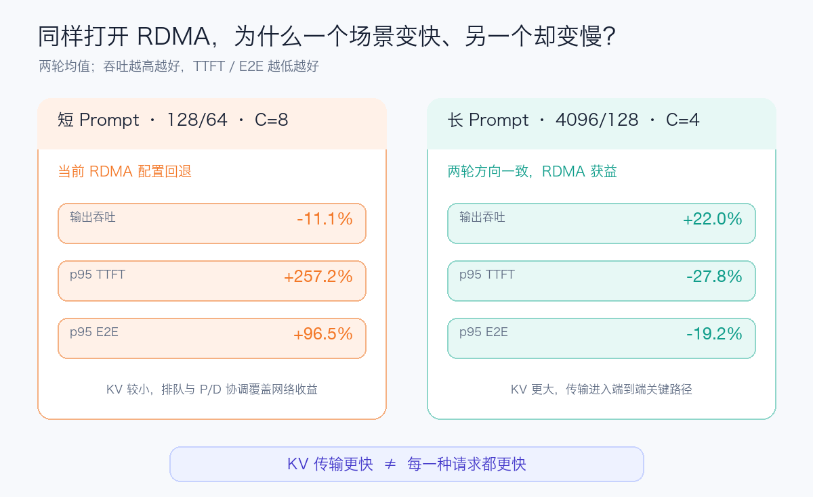

# KV 传输快了 22 倍，短请求却更慢：GLM-5.2 P/D 的 RDMA 实测

如果只看 KV Cache 传输，这次 RDMA 赢得非常彻底。

在同一套 GLM-5.2 FP8、同样两台八卡 H20、相同 Prefill/Decode Engine 和相同请求集上，NIXL 的 Rank 聚合有效传输速率从 TCP 的约 `0.241 GB/s` 提高到 RDMA 的约 `5.28 GB/s`，相差约 **21.9 倍**。

但如果只看短请求、高并发的端到端结果，结论正好相反：

- 输出吞吐下降约 11%；
- p95 TTFT 增加约 257%；
- p95 E2E 接近翻倍。

换成长 Prompt 后，RDMA 又重新体现出价值：输出吞吐提高约 22%，p95 TTFT 降低约 28%，p95 E2E 降低约 19%。

所以这次测试最值得记录的，并不是“RDMA 到底快不快”，而是下面这个看似矛盾的问题：

> 为什么底层数据传输快了 22 倍，应用请求却不一定更快？

## 先说我们测了什么

GLM-5.2 FP8 是一个规模很大的 MoE 模型。单个完整实例使用一台 `8 × H20 141 GB` 节点，以 TP=8 运行。

这次 P/D 实验使用两份完整模型：

- Prefill Engine：8 张 H20，TP=8；
- Decode Engine：8 张 H20，TP=8；
- 两侧通过 NIXL 传递 KV Cache；
- AIBrix 负责选择 Prefill 和 Decode；
- 两种数据面分别为 NIXL over TCP 与 NIXL over RDMA。



对照实验最重要的原则是只改变一个变量。

因此 TCP 与 RDMA 两轮测试保持模型 Revision、节点、GPU、TP、KV 精度、路由、Tokenizer、Seed、输入输出长度和并发不变，只切换 UCX 的传输层：

```text
TCP：tcp + cuda_copy + cuda_ipc
RDMA：rc + cuda_copy + cuda_ipc
```

四组请求形状分别是：

- 128-token 输入、64-token 输出，并发 1；
- 128-token 输入、64-token 输出，并发 4；
- 128-token 输入、64-token 输出，并发 8；
- 4096-token 输入、128-token 输出，并发 4。

每组先按相同并发完成 Warm-up，再用两个不同 Seed 各执行一轮。TCP 与 RDMA 合计完成 512 个正式请求，失败数为 0。

## 看到 RDMA 设备，不代表请求真的走了 RDMA

P/D 性能测试有一个很常见的陷阱：Pod 里能看到 RDMA 设备，NIXL 也能初始化，不代表 KV Tensor 已经从 RDMA 数据面传过去。

甚至 Prefill 和 Decode 都收到 HTTP 请求、最终返回 200，也只能证明控制流大致成立。

为了确认物理数据路径，这次同时检查了两类证据：

1. NIXL 的成功传输次数、数据量与 `xfer_time`；
2. 八路 RDMA 端口在应用请求前后的硬件计数器。

结果如下：



RDMA 完整轮次中，NIXL 记录约 33.25 GB 数据、累计传输时间约 6.30 秒，八路网卡发送计数也按相同方向增长。

TCP 完整轮次传输了接近的数据量，累计时间约 136.28 秒。更关键的是，TCP 测试前后 RDMA 端口计数完全没有变化。

这证明 TCP 控制组没有悄悄借用 RDMA，也证明 RDMA 组不是“设备存在但实际没有流量”。

这里还要避免另一个误读：`5.28 GB/s` 是把八个 TP Rank 的 NIXL 指标聚合后，用于同拓扑 A/B 的有效速率，不是单张网卡的线速。它适合说明应用传输层发生了数量级变化，不适合拿去和网卡规格表直接对比。

## 端到端结果：长 Prompt 获益，短 Prompt C8 回退

下面是两个 Seed、两轮测试中相同指标的算术平均。

| 场景 | RDMA 吞吐变化 | p95 TTFT 变化 | p95 E2E 变化 |
| --- | ---: | ---: | ---: |
| 128/64，C=1 | +3.1% | -15.3% | -6.5% |
| 128/64，C=4 | -0.1% | +10.5% | +6.5% |
| 128/64，C=8 | **-11.1%** | **+257.2%** | **+96.5%** |
| 4096/128，C=4 | **+22.0%** | **-27.8%** | **-19.2%** |

C=1 和 C=4 的两轮尾延迟存在明显波动，当前样本不足以宣称稳定提升。真正方向比较一致的是另外两组：短 Prompt 的 C=8 回退，以及 4K Prompt 的收益。



4K Prompt 的结果很好理解。

Prompt 越长，Prefill 产生的 KV Cache 越多，KV 传输越容易进入首 Token 的关键路径。RDMA 把这一段明显缩短后，p95 TTFT 下降约 28%，最终转化为约 22% 的输出吞吐提升。

短 Prompt C=8 就没有这么简单。

这类请求的 KV 数据量较小，端到端耗时更容易被下面这些部分支配：

```text
请求排队
  + Router 选择 P/D
  + Prefill 批处理
  + KV Transfer Plan 与同步
  + Decode 排队和继续生成
  + 流式响应收尾
```

RDMA 只优化其中的 KV 传输，并不会自动消除其他阶段。网络变快以后，瓶颈还可能转移到请求协调、Producer/Consumer 同步或 Decode 队列。

当前证据能够确认 C=8 回退连续出现，也能排除“RDMA Fabric 太慢”这种解释；但还不足以在没有阶段 Trace 的情况下，把根因写死成某一个 NIXL、UCX 或 Router 参数。

## 为什么 22 倍传输提升，最后只有 22% 吞吐收益

把一次 P/D 请求简化后，总时间大致可以写成：

```text
总时间 = 排队 + Prefill + KV 传输 + Decode + 路由与协议开销
```

假设 KV 传输原来只占总时间的一部分，即使把这一部分加速 22 倍，总请求时间也不可能同步缩短 22 倍。

这就是典型的 Amdahl 定律：局部优化的上限，取决于被优化部分原本占了多少比例。

对 4K Prompt，KV 传输占比足够高，RDMA 可以明显改善 TTFT；对 128-token Prompt，传输本身很小，系统更容易受固定开销和排队影响。

所以“RDMA 带宽很高”与“在线请求一定更快”是两个不同层次的结论。

## 这轮测试带来的三个经验

### 1. RDMA 必须有数据面证据

至少同时检查：

- P/D Router 是否选出正确角色；
- KV Transfer 是否成功，是否出现 Recompute；
- NIXL 数据量和耗时是否增长；
- 应用请求期间 RDMA 端口计数是否同步变化；
- TCP 控制组的 RDMA 计数是否保持不变。

缺少最后两项，很容易把“能够初始化 RDMA”误写成“请求已经通过 RDMA”。

### 2. P/D 与 RDMA 都不是全流量开关

当前数据已经给出一个很直接的路由思路：

```text
短 Prompt / 交互请求  → Combined Engine
长 Prompt / Prefill-heavy → P/D + RDMA
```

这比要求所有请求强制经过 P/D 更合理。短请求避开额外协调，长请求才使用独立 Prefill 资源和高速 KV 传输。

真正上线时，分界线不能拍脑袋决定，要根据 Prompt 长度、队列、Prefix Cache 命中率和 SLO goodput 动态验证。

### 3. 饱和吞吐不能替代固定到达率测试

本轮使用无限请求到达率，适合快速观察系统上限和尾延迟异常，但它不等同于线上容量。

下一轮应该补充：

- 固定 RPS 阶梯，而不是只使用饱和并发；
- 每个场景至少五轮重复；
- 分离排队、Prefill、KV 传输、TTFT 和 Decode 的阶段 Trace；
- 单 Rail、Multi-Rail 与网卡绑定 A/B；
- Prefill/Decode 独立的 Batch 与最大并发参数；
- Combined 与 P/D 混合路由下的 SLO goodput。

## 写在最后

这次 GLM-5.2 实验把一个问题从“RDMA 能不能用”推进到了“什么请求值得用 RDMA”。

底层结果非常漂亮：NIXL 的 Rank 聚合有效传输速率提高约 21.9 倍，而且硬件计数证明 KV 确实经过 RDMA。

端到端结果却更有价值：长 Prompt 吃到了约 22% 的输出吞吐收益，短 Prompt C=8 在当前配置下反而出现明显回退。

这不是对 RDMA 的否定，反而说明测试已经越过“链路是否连通”的阶段，开始触碰真正的系统问题：工作负载分型、P/D 容量比例、排队、同步和路由策略。

下一次再问“P/D 要不要上 RDMA”，我会先问三个数字：Prompt 有多长、KV 传输占总时间多少、满足 TTFT/TPOT SLO 的 Goodput 能提高多少。

完整的脱敏测试参数、单机 vLLM/SGLang 基线和后续更新，可以通过“阅读原文”查看。
