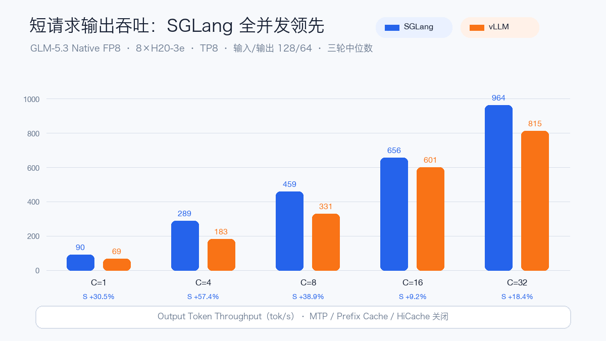
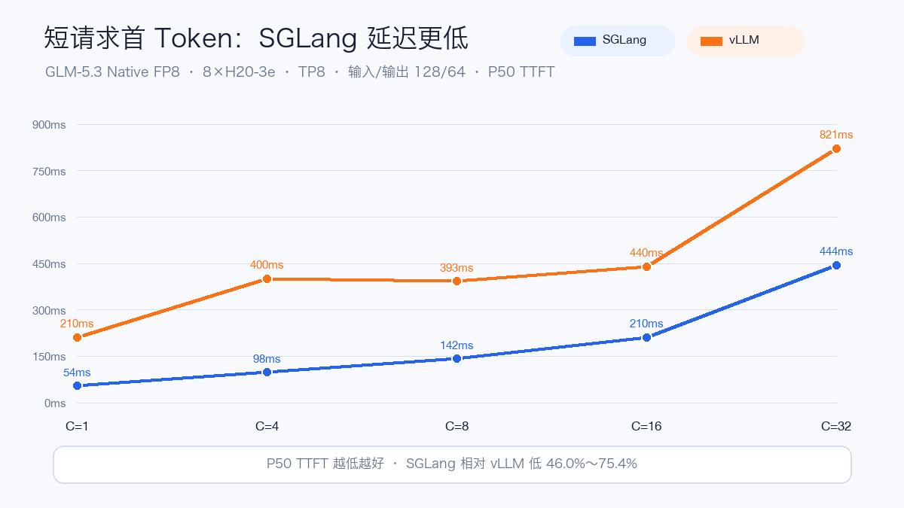
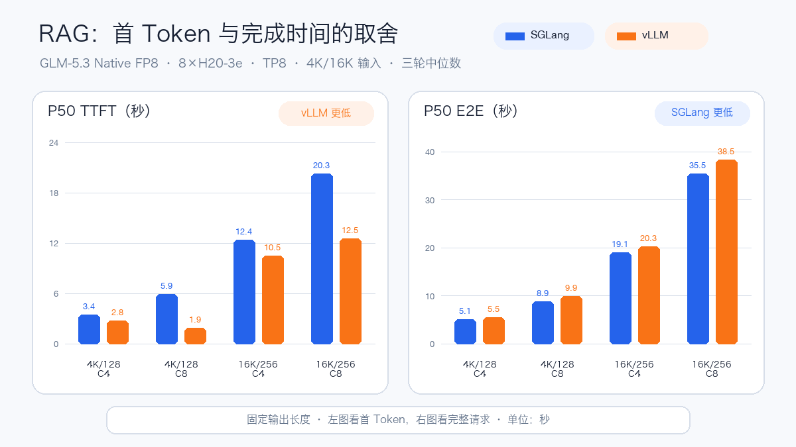

# GLM-5.3 实测：8×H20 上 SGLang 与 vLLM 谁更快？

2026 年 8 月 28 日，智谱开源 **GLM-5.3**：约 743B 总参数、每 Token 激活 39B，定位于高难度 Coding、长链路 Agent 和复杂工程任务。

它和 2026 年 8 月 26 日发布的 **GLM-5.3-Flash** 不是简单的大小版本关系。Flash 约 320B 总参数、激活 18B，原生支持多模态与 1M Context，4×H20 就能部署；GLM-5.3 的参数与激活规模都更大，本轮开源权重是文本模型，我们使用 8×H20、TP8 和 128K 服务窗口来验证它的推理表现。

这次我们在同一台 **8×141GB NVIDIA H20-3e** 节点上，先后用 SGLang 和 vLLM 部署 GLM-5.3 原生 FP8 权重，完整走了一遍：

**权重挂载 → 镜像同步 → 服务启动 → OpenAI API 功能验收 → OpenWebUI 接入 → 9 组压测 → 释放 GPU。**

最终，两套引擎各完成 9 个 Case、每个 Case 3 轮，共留下 **54 份完整结果、7,680 个完成请求，失败请求为 0**。

> 一句话结论：当前这组 Target-only 配置下，SGLang 的输出吞吐在 9 个 Case 中全部领先；短请求的首 Token 也明显更快。到了 4K/16K 长输入，vLLM 更早返回首 Token，但 SGLang 更早完成整次请求。

## 先看部署与功能结论

模型没有重新从公网下载，而是直接挂载共享文件系统中的完整权重。运行时镜像则通过一台可访问公网的中转机做 OCI Registry 间复制，再同步进目标环境。这样避免了数十 GB 镜像经过本地 VPN，降低断线和机器重启风险。

两套服务都完成了以下验收：

- OpenAI 兼容的 `/v1/models`、流式与非流式 Chat Completion；
- `reasoning_effort=low/high/max`，并能分离 `reasoning_content`；
- `glm47` Tool Call、多轮对话和停止条件；
- GLM-5.3 是文本模型，图片输入按预期拒绝；
- 两套服务均注册到 OpenWebUI，模型可见并能完成对话。

测试结束后，SGLang 和 vLLM 的工作负载都已缩容到 0，8 张 H20 已释放；OpenWebUI 的连接配置保留，后续扩容即可复用。

## 测试口径

- 模型：`zai-org/GLM-5.3`，Native FP8，约 743B 总参数 / 39B 激活参数；
- GPU：单节点 8×H20-3e 141GB，Tensor Parallel = 8；
- 服务窗口：131,072 Token；
- SGLang：固定 amd64 镜像 Digest，Hopper 默认 BF16 KV Cache；
- vLLM：0.28.0，固定 amd64 镜像 Digest，KV Cache 为 `auto`；
- MTP、Prefix Cache、HiCache、Context Parallelism 全部关闭；
- 两边使用同一个 `vllm bench serve` 客户端、相同请求集合与参数；
- 每个 Case 跑 3 轮，正文使用逐指标中位数，不摘最快一轮。

这是一组强调公平性的 **Target-only 基线**，不是两个引擎打开所有优化后的“终局排名”。

## 结果一：短请求，SGLang 吞吐全并发领先

在输入/输出 128/64 的短请求里，SGLang 从 C1 到 C32 的输出吞吐全部更高，相对 vLLM 提升 **9.2%～57.4%**。

最典型的是 C4：SGLang 为 **288.50 tok/s**，vLLM 为 **183.33 tok/s**，提升 57.4%。到 C32 时，两边分别达到 **964.25 tok/s** 和 **814.68 tok/s**。

## 结果二：短请求首 Token，SGLang 低 46.0%～75.4%

短请求不仅 Decode 更快，SGLang 的 P50 TTFT 也更低：

- C1：54.29ms 对 210.45ms；
- C4：98.30ms 对 400.31ms；
- C8：142.10ms 对 392.56ms；
- C16：210.48ms 对 439.92ms；
- C32：443.91ms 对 821.37ms。

对聊天、短 Agent 调用和高并发短输出，这组配置下 SGLang 的优势最清晰。

## 结果三：长 Prefill，首 Token 与完成时间出现分叉

输入放大到 4K 和 16K 后，结论不再是一边倒：

- 4K/128，C8：vLLM P50 TTFT 为 **1.90s**，SGLang 为 **5.91s**；
- 16K/256，C8：vLLM P50 TTFT 为 **12.54s**，SGLang 为 **20.28s**。

但固定输出长度下，SGLang 的 Decode 更快，四个长输入 Case 的输出吞吐仍高 **7.3%～11.4%**，P50 E2E 也低约 **6.2%～10.6%**。

换句话说：

- 用户非常在意“多久看到第一个字”的长 Prompt / RAG 交互，vLLM 当前配置更合适；
- 更在意整次请求完成时间和集群吞吐，SGLang 当前配置仍占优。

## 9 个 Case 的完整中位数

下表每格顺序均为 **SGLang / vLLM**。

| Case | 输出吞吐（tok/s） | P50 TTFT |
| --- | ---: | ---: |
| 128/64，C1 | 90.41 / 69.27 | 54.29 / 210.45ms |
| 128/64，C4 | 288.50 / 183.33 | 98.30 / 400.31ms |
| 128/64，C8 | 459.47 / 330.82 | 142.10 / 392.56ms |
| 128/64，C16 | 656.41 / 601.02 | 210.48 / 439.92ms |
| 128/64，C32 | 964.25 / 814.68 | 443.91 / 821.37ms |
| 4K/128，C4 | 100.07 / 93.31 | 3.45 / 2.75s |
| 4K/128，C8 | 115.40 / 103.63 | 5.91 / 1.90s |
| 16K/256，C4 | 53.57 / 49.76 | 12.43 / 10.46s |
| 16K/256，C8 | 57.67 / 53.24 | 20.28 / 12.54s |

## 数据里有两个值得交代的插曲

第一，SGLang 的 `128/64，C4` 第三轮与一个 OpenWebUI 请求短暂重叠。我们没有删除这轮，也没有挑最快成绩，仍按预先约定取三轮中位数；前两轮吞吐分别为 288.93 和 288.50 tok/s。

第二，SGLang 首次批处理时，缓存清理遇到仍在执行的 OpenWebUI 请求，任务中断后从剩余 Case 继续。最终聚合只纳入已经完整写出的 27 轮，不纳入未完成轮次。

这些细节不会改变方向性结论，但它们决定了一份压测报告是否可信。

## 怎么选？

如果现在就要在这台 8×H20 机器上选一个默认引擎：

- 聊天、短 Agent、高并发短输出：优先 SGLang；
- 长 Prompt / RAG，且首 Token 体验最重要：优先评估 vLLM；
- 批处理或更看重完成时间与总体吞吐：优先 SGLang；
- 生产定型前：必须继续做 MTP、FP8 KV、Prefix Cache 和长上下文的单变量 A/B。

官方资料当前明确：vLLM 0.28.0+ 可在单节点 8×141GB H20/H200 上运行 GLM-5.3 原生 FP8；完整 1M Context 则指向 8×B200。SGLang Cookbook 已覆盖 GLM-5.3 的 DSA、MTP、Reasoning、Tool Call、HiCache 等能力，但其硬件矩阵没有点名 H20，所以本文对 SGLang 的表述是 **Hopper/H20 实测可用**，不是“官方 H20 认证”。

最后再强调一次：本轮关闭了 MTP、Prefix Cache、HiCache 和 Context Parallelism。下一轮打开优化后，吞吐、TTFT 甚至推荐配置都可能变化。

## 延伸阅读：GLM-5.3-Flash 的 4×H20 实测

这次测试的 GLM-5.3 是约 743B 总参数、39B 激活参数的文本模型，采用 8×H20、TP8 和 128K 服务窗口。此前我们还测试过更轻量的 **GLM-5.3-Flash**：约 320B 总参数、18B 激活参数，只使用 4×H20、TP4，并原生支持多模态与 1M Context。

在 Flash 测试中，SGLang 和 vLLM 都完成了接近 1M Token 的冷 Prefill 与 Needle 检索；vLLM 在高并发和 1K Decode 上更快，SGLang 的 Reasoning、Tool Call、图片、Prefix Cache 和 OpenWebUI 功能闭环更完整。两套引擎也都暴露了首次新 Shape JIT 带来的尾延迟。

完整测试、逐轮数据与部署细节，请点击文末 **“阅读原文”** 进入公开版。Flash 实测地址：

《GLM-5.3-Flash Day 1 实测：我用 4×H20 跑通了 1M 上下文》

https://aik8s.run/ai-k8s/practices/glm53-flash-day1-h20/

完整脱敏聚合数据、复现清单、后续测试 Gate 和全部外部链接，也都收录在“阅读原文”页面中。

参考资料：

- GLM-5.3 模型与权重：https://huggingface.co/zai-org/GLM-5.3
- SGLang GLM-5.3 Cookbook：https://docs.sglang.io/cookbook/autoregressive/GLM/GLM-5.3
- vLLM GLM-5.3 Recipe：https://recipes.vllm.ai/zai-org/GLM-5.3
