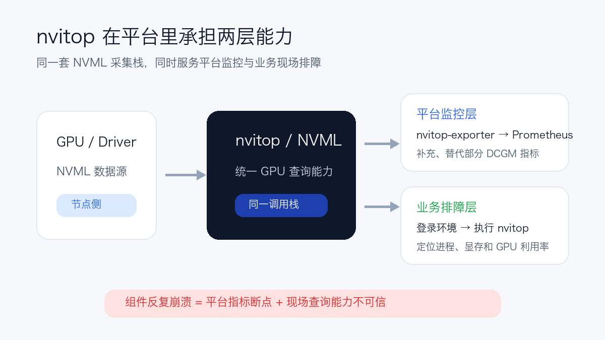
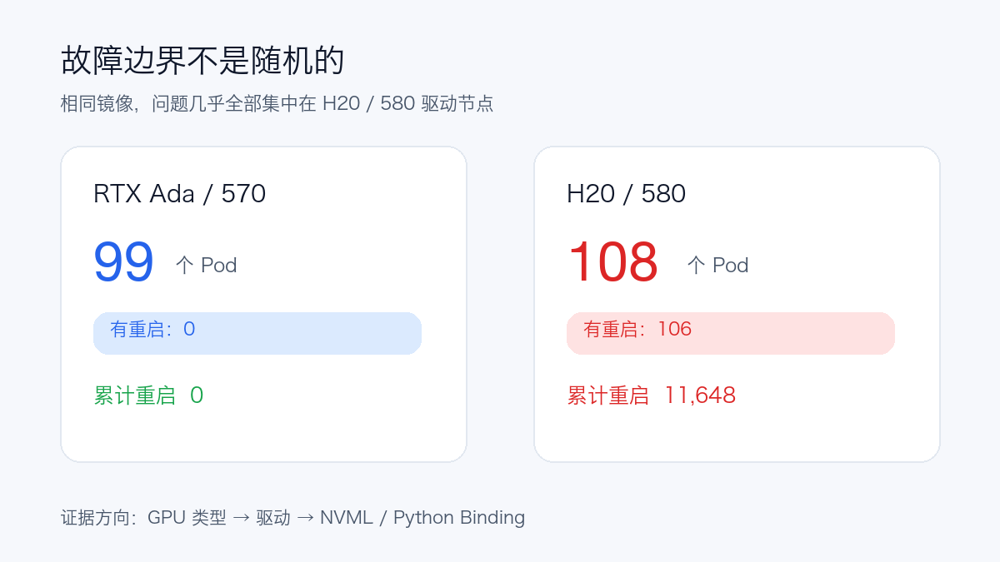
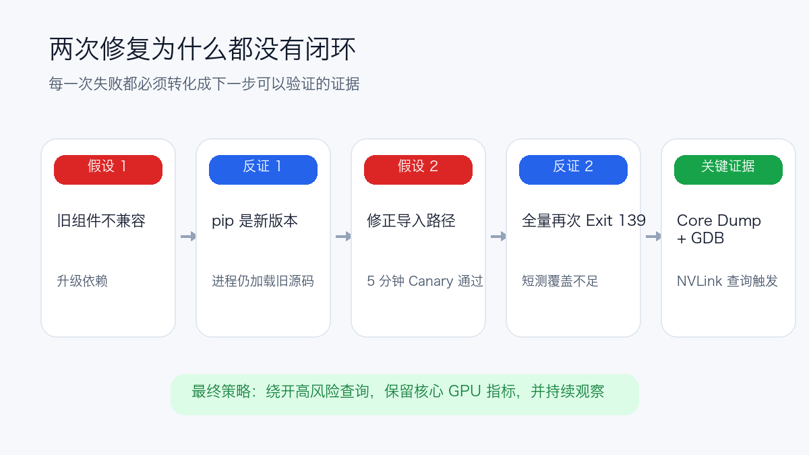

# GPU 监控 Pod 重启上万次，我们为什么连续两次修错了方向？

> 本文记录一次 GPU 监控组件的生产排障。文中数字来自特定环境，组件和版本仅用于解释证据链，不代表所有 H20 或 NVML 环境都会复现同样问题。涉及的集群、节点和镜像地址均已脱敏。

先说清楚这个监控 Pod 为什么重要。

我们并不是只把 nvitop 当成一个方便查看显卡的命令行工具，而是围绕它做了两层能力：

- **平台监控层**：通过 `nvitop-exporter` 把 nvitop 基于 NVML 采集的数据暴露为 Prometheus 指标。在我们的场景中，它覆盖了 GPU 利用率、显存、温度、功耗、PCIe 和 GPU 进程等指标，部分补充并替代了 `dcgm-exporter` 的指标功能；
- **业务排障层**：业务同学登录开发或计算环境后，可以直接执行 `nvitop`，实时查看每张卡上的进程、显存占用和利用率，比只看平台大盘更适合定位“哪一个进程正在占卡”。

这两层能力来自同一套 nvitop / NVML 调用栈。一旦 DaemonSet 反复崩溃，损失的不只是几条监控曲线：Prometheus 的 GPU 指标会出现断点，业务同学最常用的现场查询入口也可能变得不可信。

因此，我们没有把这次故障当成一个“监控 Pod 挂了就重启”的小问题，也不能简单地停掉 nvitop 了事。



某天我们重新检查 GPU 监控 DaemonSet，发现一个不太正常的数字：207 个实例里，106 个发生过重启，累计重启 **11,648 次**。

问题高度集中在 H20 节点。部分实例重启超过 100 次，单实例最高超过 1,200 次；同一镜像运行在另一类 GPU 节点上，却一次都没有重启。

容器最后退出码统一为 `139`，日志停在两类信息上：

```text
free(): invalid next size (normal)
double free or corruption (!prev)
```

退出码 139 通常意味着进程收到 `SIGSEGV`。这不是普通的 Python 异常，也不是 Kubernetes 探针失败；日志中的 `double free` 进一步指向了原生库或 Python Binding 之外的内存破坏。

看起来像是一个很典型的“旧组件不兼容新驱动”问题。我们也确实沿着这个方向修了，但连续两次都没有真正解决。



## 第一个有效证据：故障不是随机分布的

我们先按 GPU 类型和驱动分支聚合相同镜像的运行结果：

| 节点组 | Pod 数 | 有重启的 Pod | 累计重启 |
| --- | ---: | ---: | ---: |
| RTX Ada、570 驱动分支 | 99 | 0 | 0 |
| H20/H20-3e、580 驱动分支 | 108 | 106 | 11,648 |

这张表比一条 CrashLoopBackOff 告警有价值得多。

如果问题来自通用业务代码、Kubernetes 调度或镜像入口，两类节点应该都可能受到影响。现在故障几乎只出现在 H20 和 580 驱动组合上，范围被收敛到了 GPU 类型、驱动、NVML 及其 Python 调用栈。

现场组件版本是：

```text
nvitop             1.5.0
nvitop-exporter    1.5.0
nvidia-ml-py       12.575.51
NVIDIA Driver      580.126
```

上游后续版本增加了 CUDA 13、NVML 580 和新版 `nvidia-ml-py` 支持，也修复过后台 NVML 查询与 `nvmlShutdown()` 竞争引发的间歇性段错误。

于是第一个假设很自然：旧采集栈与新驱动不兼容。

## 第一次修复：包升级了，进程却没有升级

我们制作了第一版候选镜像，把三个 Python 依赖升级为相互匹配的版本。本地检查结果也很正常：

```text
pip show nvitop
Version: 1.7.1

pip show nvitop-exporter
Version: 1.7.1
```

但全量更新后，H20 节点很快再次出现 Exit 139。

继续检查才发现，基础镜像的工作目录是 `/nvitop`，目录里还保留着旧版 1.5.0 源码。Python 启动时会优先搜索当前目录，因此进程导入的是工作目录中的旧代码，而不是 `site-packages` 里刚安装的 1.7.1。

实际运行的是一个混合栈：

```text
nvitop API          1.5.0，来自当前工作目录
nvitop-exporter     1.7.1，来自 site-packages
nvidia-ml-py        13.580.126
```

我们第一次修错的地方，不是“升级版本”这个方向完全没有依据，而是把**安装结果**误当成了**运行时证据**。

以后检查 Python 容器，我们不再只看 `pip show`，而是同时确认：

```python
import os
import nvitop

print("cwd:", os.getcwd())
print("version:", nvitop.__version__)
print("module:", nvitop.__file__)
```

`pip show` 回答的是“环境里安装了什么”；`module.__file__` 回答的才是“当前进程到底加载了什么”。

## 第二次修复：单节点五分钟正常，不等于全量稳定

第二版镜像显式设置 `WORKDIR /`，确保进程从 `site-packages` 加载真实的 nvitop 1.7.1。

这次我们在单个 H20 节点做了 Canary：识别到8张GPU，连续请求60次 `/metrics`，运行超过5分钟，没有重启。

于是开始全量更新。

结果还是失败了。短时间内，35 个 Pod 再次以 139 退出，正式实例累计重启达到 111 次。运行时路径已经确认是1.7.1，旧源码遮蔽不是唯一原因。

第二次修错的是验证方法：

> 我们用一台节点、60次串行请求和5分钟观察，去证明一个只在特定硬件上间歇出现的原生内存错误已经消失。

这类故障概率可能与请求并发、NVML 调用交错、GPU 数量或运行时间有关。短时 Canary 通过，只能说明镜像能启动，不能说明故障已经被覆盖。



## 转折点：不要继续猜，直接看 Core Dump

两轮失败以后，继续更换依赖版本已经很难增加新证据。我们保留了一台隔离的 H20 节点，给容器开启 Core Dump，并把转储文件写到持久目录。

旧候选镜像启动约33秒后再次崩溃，留下约50MiB Core。带CPython符号的GDB调用栈把触发路径收敛到了：

```text
nvitop.api.device.query_nvlink_throughput_counters()
  → NVLink 汇总吞吐量属性
  → Exporter 设备指标采集
  → ctypes / NVML 调用后的内存释放
  → double free or corruption
```

这里必须保持克制。

Core Dump 证明了**触发器位于 NVLink 吞吐查询路径**，但它还不能独立证明内存破坏究竟发生在 nvitop、`nvidia-ml-py` 还是驱动侧 NVML。把“触发路径”直接写成“最终根因”，只是另一种过度推断。

不过，这份证据已经足以支持一次可控止损：暂时绕开 NVLink 吞吐查询，观察段错误是否消失。

## 第三次处理：牺牲一项指标，先恢复监控稳定性

第三版镜像保留真实的 nvitop 1.7.1，只在启动时给 `Device.nvlink_throughput()` 增加 Guard，让它返回空结果，不再进入已经被 Core 指向的 NVML Field-Value 查询路径。

这个改动有明确代价：

- NVLink 总吞吐、平均吞吐和逐链路吞吐指标缺失或显示为空；
- GPU 利用率、显存、温度、功耗、PCIe 和进程指标继续保留；
- 业务同学仍可登录环境执行 `nvitop`，查看 GPU 与进程的实时状态；
- Guard 可以通过环境变量关闭，便于驱动或上游修复后重新验证。

我们没有把它称为“根因修复”。更准确的说法是：

> 在根因归属尚未完全确定时，对已经有 Core 证据的高风险查询做功能降级，优先恢复监控系统的稳定性。

这一次，Canary 也换了验证方式：

| 验证项 | 结果 |
| --- | ---: |
| 主动请求 `/metrics` | 1,180次 |
| 其中并发请求 | 1,000次 |
| Canary 重启 | 0 |
| 新增 Core Dump | 0 |
| 全量 DaemonSet | 207/207 Ready |
| 全量更新后的短时 Exit 139 | 0 |

这仍然不能替代24小时甚至更长的持续观察，但它至少覆盖了此前遗漏的并发调用，也让全量结果回到了可观测的零基线。

## 这次事故真正教会我们的六件事

### 1. Running 和 Ready 都不是业务证据

原 DaemonSet 没有探测 `/metrics`。Pod 显示 Running/Ready，只能说明进程当时还活着，不能证明 Prometheus 能持续抓取指标。

监控组件同样需要 `startupProbe`、`readinessProbe` 和 `livenessProbe`，而且探测对象应该是实际指标端点。

### 2. 退出码139不要按普通应用异常处理

Exit 139、`double free` 和 `SIGSEGV` 指向的是原生调用栈。反复重启或只看 Python 日志，通常不会得到更多信息。应尽早保留故障节点、Core Dump、`/proc/<pid>/maps`、驱动日志和最小复现。

### 3. 包管理器显示的版本，不等于进程加载的版本

Python 当前目录、`PYTHONPATH`、Editable Install、镜像残留源码和启动脚本，都可能改变导入顺序。验证版本时至少同时记录：

```text
工作目录
module.__version__
module.__file__
/proc/<pid>/maps
```

### 4. Canary 必须匹配故障概率

间歇性并发错误不能用60次串行请求证明修复。Canary 的节点类型、驱动、GPU数量、请求并发、抓取频率和观察窗口，都应覆盖故障出现时的条件。

### 5. 可观测性组件要支持功能降级

为了保住一项 NVLink 吞吐指标，让整个 GPU Exporter 持续崩溃，是错误的优先级。单项采集失败应该被隔离，核心 GPU 指标和业务侧 `nvitop` 查询入口仍应继续服务。

### 6. Workaround 不等于 Root Cause

关闭触发路径后稳定，只能证明它与故障高度相关。最终责任在驱动、NVML Binding 还是调用方式，仍需要更小的原生复现和上游验证。

## 写在最后

这次事故看起来只是一个GPU监控进程崩溃，真正困难的却不是写修复代码，而是持续区分“看起来合理”和“证据已经足够”。

第一次，我们相信了 `pip show`，却没有看进程实际导入的文件；第二次，我们相信了五分钟 Canary，却没有覆盖间歇性并发故障；直到 Core Dump 把范围收敛到一条具体的 NVLink 查询路径，修复才开始建立在可反证的证据上。

生产排障很少一次就猜中。真正重要的不是避免所有错误假设，而是让每一次试验都能缩小故障域，并且知道当前结论还不能证明什么。

完整的脱敏排障记录、版本依据和验证边界，将放在“阅读原文”的公开技术文档中。
