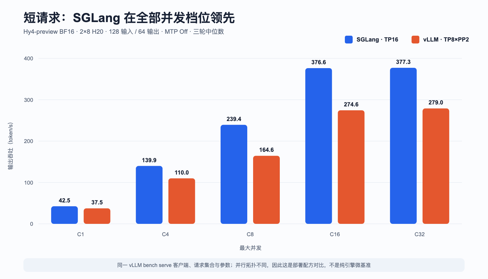
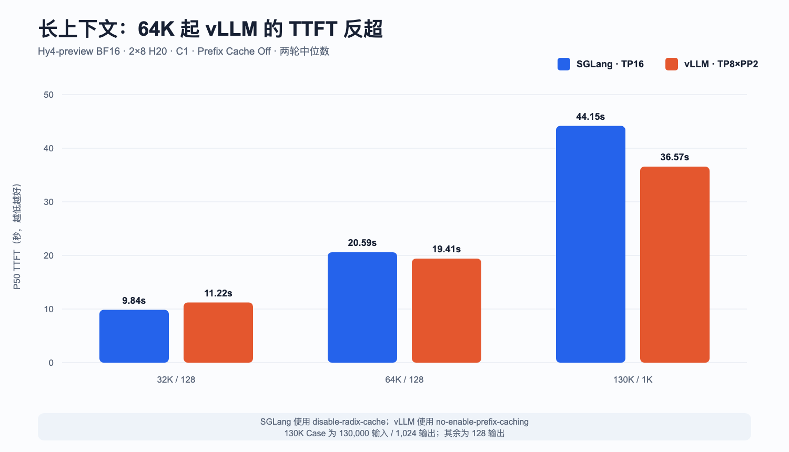
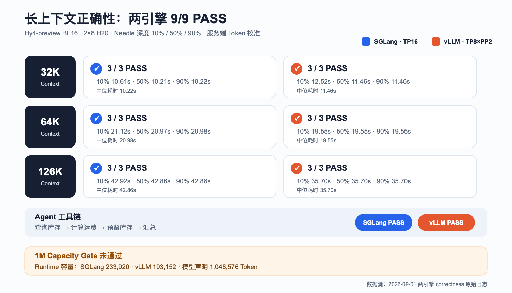

# Hy4-preview BF16 实测：16 张 H20，SGLang 还是 vLLM？

2026 年 8 月 28 日，腾讯正式发布并开源 **Hy4-preview**。

这是一个 770B 总参数、49B 激活参数的 MoE 模型：主干共 78 层，除首层 Dense 外有 77 层 MoE；每层包含 256 个路由专家与 1 个共享专家，采用 Top-8 路由，还带一层约 10B 总参数、0.7B 激活参数的原生 MTP。模型同时引入 Gated DSA、IndexCache 和 iHC，声明的原生上下文上限是 1M Token。

这次我没有硬跑官方 FP8 权重。原因很直接：首发的 `Hy4-preview-FP8` 使用 ModelOpt MXFP8，主运行路径要求 SM100+；H20 属于 Hopper/SM90，显存够不等于 GPU 代际限制不存在。

所以本轮选择完整 **BF16 Checkpoint**，在两台各 8 张 141GB H20 上，先后部署 SGLang TP16 与 vLLM TP8×PP2，完成启动、功能、RDMA、OpenWebUI、130K 性能压测，以及长上下文 Needle 与 Agent 正确性测试。

两种引擎各计入 **3,364 个正式成功请求**，合计 **6,728 个请求、0 失败**。

> 一句话结论：短请求、RAG 和高并发吞吐优先 SGLang；64K～130K 单请求长上下文则是 vLLM 更快。两边使用同样的 16 张 H20，但并行拓扑不同，因此这是生产部署配方对比，不是纯引擎微基准。

## 先说清楚测试口径

- 模型：Hy4-preview BF16，完整 131 个 Safetensors 分片；
- GPU：两节点，每节点 8×H20 141GB；
- 权重：预先缓存到宿主机本地 NVMe，避免共享存储读取影响；
- SGLang：TP16，跨节点 Tensor Parallel；
- vLLM：节点内 TP8、节点间 PP2；
- Context：131,072；
- 最大并发 / Batched Token：16 / 16,384；
- MTP：关闭；
- 客户端：两边统一使用 `vllm bench serve --backend openai`；
- 请求：相同 Case、输入输出长度、并发、Seed、温度和请求速率；
- 汇总：短请求和 RAG 跑 3 轮，4K Decode 与长上下文跑 2 轮，正文使用逐轮指标中位数。

SGLang 使用 TP16，vLLM 使用 TP8×PP2，是因为这是两套框架当前在这批 H20 上各自能够稳定落地的原生配方。硬件、权重和客户端相同，并不意味着并行拓扑也相同。

## 部署结果：两边都能跑，但不是 Blackwell 路径

SGLang 从容器启动到 API Ready 约 **218 秒**。权重加载约 52.34 秒，日志给出的单卡模型占用为 93.31GB；CUDA Graph 完成后剩余约 20.65GB。

vLLM 从容器启动到 API Ready 约 **171 秒**。从本地 NVMe 读取 131 个分片用时 20.46 秒，各 Rank 模型加载约 22.41～33.42 秒，单卡占用 90.48GiB。

H20 是 SM90。vLLM 日志明确关闭了只支持 SM100/SM103 的 HPC Gated MLA 与 iHC，转而使用 Hopper 兼容的 `FLASHMLA_SPARSE` 和 TritonExperts。SGLang 同样属于 H20 实验性兼容路线。

换句话说：**两套服务确实跑起来了，但不能写成“H20 获得了 Blackwell 专用 Kernel 的全部性能”。**

## RDMA：不是只挂了设备，NCCL 确实走了 GDRDMA

两台节点各有 8 路 200Gb/s RoCE 设备。两种 Runtime 的 NCCL 日志都同时出现：

- `Using network IB`；
- 8 路 RoCE Rail；
- 跨节点 `NET/IB/.../GDRDMA`；
- GDR Enabled。

重负载采样中，16 张 GPU 全部达到 100% 利用率，RDMA 发送计数也同步增长。

本轮两套服务的采样时刻和 TP/PP 通信模式并不相同，因此网络计数只用于证明链路真的活跃，不能直接拿来做框架带宽排名。

## 功能验收：OpenAI API 与 OpenWebUI 都通过

两种服务都完成了这些 Smoke：

- `/v1/models` 返回正确模型；
- High Thinking 同时返回推理与最终答案；
- `no_think` 只返回最终内容；
- 流式响应正常结束；
- Tool Call 返回结构化函数名与 JSON 参数；
- 图片输入被纯文本模型以 HTTP 400 正确拒绝。

有一个字段差异值得注意：SGLang 返回 `reasoning_content`，当前 vLLM 开发版返回 `reasoning`。如果调用方只写死其中一个字段，就可能把“有推理内容”误判成“没有”。

压测结束后，两套服务还先后接入同一个 OpenWebUI，以 Light 模式完成真实对话验收。

## 结果一：短请求，SGLang 全并发档位领先

输入/输出固定为 128/64 时，SGLang 在 C1、C4、C8、C16 和 C32 五个并发档位全部领先：

| 并发 | SGLang 输出 tok/s | vLLM 输出 tok/s | SGLang P50 TTFT | vLLM P50 TTFT |
| ---: | ---: | ---: | ---: | ---: |
| 1 | 42.53 | 37.47 | 98ms | 250ms |
| 4 | 139.90 | 110.02 | 162ms | 509ms |
| 8 | 239.39 | 164.56 | 238ms | 551ms |
| 16 | 376.56 | 274.59 | 384ms | 753ms |
| 32 | 377.30 | 278.97 | 3.09s | 4.11s |

SGLang 相对 vLLM 的输出吞吐优势从 C1 的 13.5% 扩大到 C8 的 45.5%，C32 仍高 **35.2%**。

对短对话、Agent 高频短调用和高并发在线服务，这组配方下 SGLang 更合适。

## 结果二：RAG 偏 SGLang，单流长 Decode 很接近

RAG 4K→128、C4 时，SGLang 输出吞吐为 **56.82 tok/s**，vLLM 为 42.24 tok/s，领先 34.5%；两边 P50 TTFT 分别为 4.24 秒和 6.76 秒。

RAG 16K→256、C4 时，SGLang 输出吞吐仍领先 19.9%，P50 E2E 为 28.35 秒，vLLM 为 36.12 秒。

但在单并发 Decode 场景，差距明显缩小：

- 128→1K，C1：39.76 对 38.31 tok/s，只差 3.8%；
- 128→4K，C1：32.37 对 31.52 tok/s，只差 2.7%；
- 128→1K，C8：241.37 对 186.43 tok/s，SGLang 的批处理优势重新扩大到 29.5%。

## 结果三：32K 是 SGLang，64K/130K 转向 vLLM

长上下文正式轮全部关闭 Prefix Cache。SGLang 使用 `disable-radix-cache`；vLLM 显式使用 `no-enable-prefix-caching`，并通过 Runtime 指标确认配置为 False。

| Case | SGLang 输出 tok/s | vLLM 输出 tok/s | SGLang P50 TTFT | vLLM P50 TTFT | SGLang P50 E2E | vLLM P50 E2E |
| --- | ---: | ---: | ---: | ---: | ---: | ---: |
| 32K→128 | 9.06 | 8.17 | 9.84s | 11.22s | 14.11s | 15.57s |
| 64K→128 | 5.15 | 5.40 | 20.59s | 19.41s | 24.86s | 23.73s |
| 130K→1K | 13.02 | 14.24 | 44.15s | 36.57s | 78.64s | 71.90s |

32K 时 SGLang 仍领先；64K 时 vLLM TTFT 低 5.7%、E2E 低 4.6%；到 130K，vLLM TTFT 低 **17.2%**、E2E 低 **8.6%**，输出吞吐高 9.4%。

短请求的答案，不能直接外推到超长 Prefill。

## 结果四：9 组 Needle 与多轮 Agent 全部通过

随机 Token 能回答“跑多快”，但不能回答“长上下文里还能不能找对内容”。因此两套服务又分别执行了 32K、64K、126K 三档上下文，并把唯一 Needle 放在 10%、50%、90% 三个深度。

请求长度使用服务端返回的 `usage.prompt_tokens` 校准，模型必须只返回唯一 Needle。最终 SGLang 和 vLLM 都是 **9/9 PASS**：

| Context / Needle 深度 | SGLang | vLLM |
| --- | ---: | ---: |
| 32K / 10%、50%、90% | 10.61s / 10.21s / 10.22s | 12.52s / 11.47s / 11.46s |
| 64K / 10%、50%、90% | 21.12s / 20.97s / 20.98s | 19.55s / 19.55s / 19.55s |
| 126K / 10%、50%、90% | 42.93s / 42.86s / 42.86s | 35.70s / 35.70s / 35.71s |

接着跑了一个四阶段 Agent 流程：查询库存、计算运费、预留库存，再根据三个工具结果生成最终摘要。两边都正确完成结构化 Tool Call，并得出剩余库存 4、运费 42、到货 2 天和正确预留单号。

为什么没有继续硬发 1M 请求？因为这次已经拿到了明确的容量证据：当前 16×H20 BF16 配方下，SGLang 的 `max_total_num_tokens` 是 **233,920**，vLLM 的 KV Cache 容量是 **193,152 Token**，分别只有 1M 的约 22.3% 和 18.4%。单纯把 Context 参数改成 1M 不会增加 KV/状态容量，只会让启动或请求失败。

因此这不是“忘了测 1M”，而是本轮 **1M 容量 Gate 明确未通过**。要验证 1M，需要更多 GPU、更深 PP/DCP 或更低精度 KV，再从 256K 逐级放大。

## 中间还抓到一个会让 64K“快一倍”的坑

vLLM 这个开发镜像默认开启 Prefix Cache，而测试镜像没有暴露缓存重置接口。第一次 64K 的 P50 TTFT 只有 **9.95 秒**，看起来几乎是 SGLang 的两倍性能。

但服务指标随后确认存在共享前缀缓存命中。这组结果被标记为 Diagnostic，不进入正式结论。

我们显式关闭 Prefix Cache、重启服务，再用新 Seed、零 Warmup 重跑全部 32K/64K/130K Case，修正后的 64K P50 TTFT 是 **19.41 秒**。

这件事比某一个框架快多少更重要：**相同客户端、相同 Prompt 和相同参数，不代表服务端状态自动一致。** 不核对 Prefix Cache 指标，长上下文结果很容易被写错。

短请求、RAG 和 Decode 表保留了首轮完整矩阵，其中 vLLM 仍使用默认 Prefix Cache On。随机请求和较大的正式请求量可以降低固定 Prompt 热缓存偏差，但不能证明命中率严格为零。由于这些 Case 最终仍由 SGLang 领先，这个偏差不会制造 SGLang 的优势，反而可能让优势显得更小。

## 最后怎么选？

如果业务以短对话、RAG、Tool Call 和并发 Agent 为主，优先评估 **SGLang TP16**：吞吐与 TTFT 优势更稳定。

如果业务核心是 64K～130K 单请求，并且能接受 TP8×PP2 的 Pipeline 特征，可以继续评估 **vLLM**：它启动更快，关闭 Prefix Cache 后的超长上下文结果也更好。

但不要把这轮结果扩展成所有硬件和所有流量的结论：

- 两个框架的并行拓扑不同；
- 只测试了一对 H20 节点和一个时间窗口；
- MTP 关闭；
- Needle 和确定性 Agent 已验证到 126K，但还没有覆盖生产 Prompt 与混合并发分布；
- 16×H20 BF16 的 Runtime 容量不足以承载 1M，尚未验证扩容或低精度 KV 后的 1M Context。

下一轮真正值得做的是 MTP On/Off、Prefix Cache 冷热命中、真实 RAG/Agent 混合流量，以及扩容或降低 KV 精度后的 256K～1M 逐级验收。

参考资料：

- 腾讯官方发布说明：https://www.tencent.com/zh-cn/tencent-releases-and-open-sources-tencent-hy4-preview/
- Hy4-preview 官方仓库：https://github.com/Tencent-Hunyuan/Hy4-preview
- Hy4-preview BF16 模型卡：https://huggingface.co/tencent/Hy4-preview
- SGLang Hy4-preview Cookbook：https://lmsysorg.mintlify.app/cookbook/autoregressive/Tencent/Hy4-Preview
- vLLM Hy4-preview Recipe：https://recipes.vllm.ai/tencent/Hy4-preview
