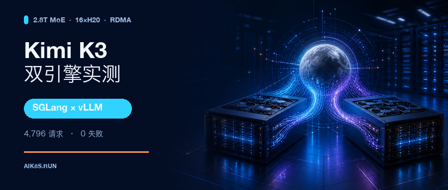
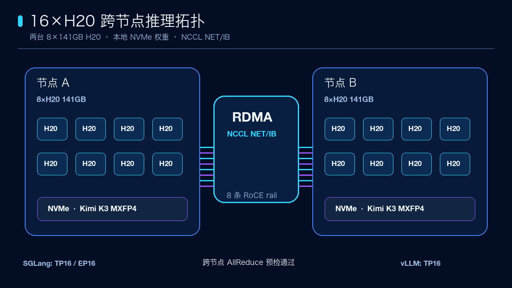
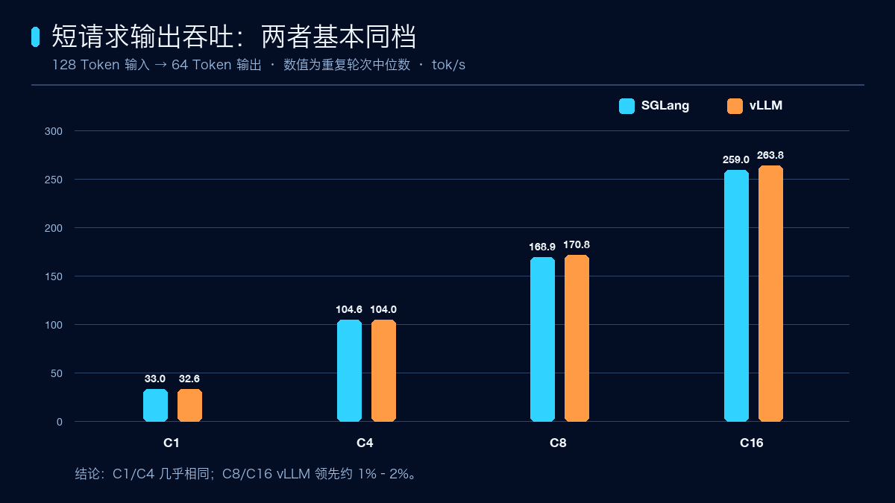
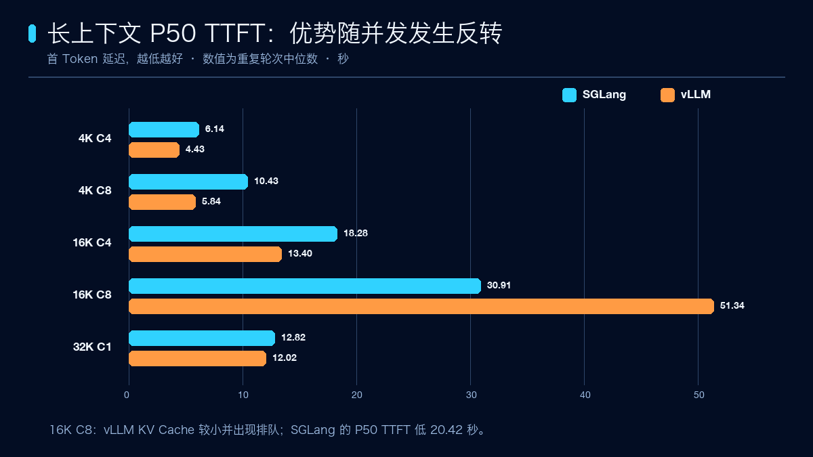
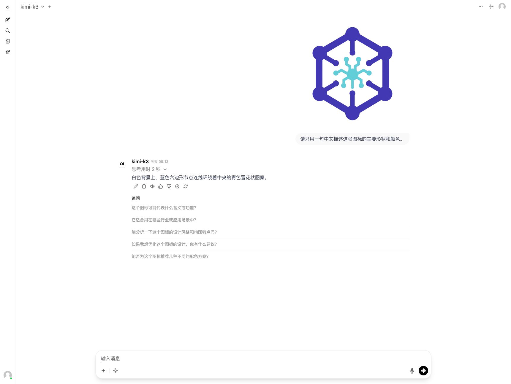

# Kimi K3 实测：16 张 H20，SGLang 还是 vLLM？

作者：runzhliu

2026 年 7 月 27 日，Moonshot AI 公开了 Kimi K3 的模型权重与技术报告。它不是在上一代模型上做一次小幅扩容，而是一套面向原生多模态、超长上下文和 Agent 场景重新设计的 2.8T MoE：总参数约 2.8T，每个 Token 激活约 104B 参数，包含 93 层 Transformer、69 层 KDA 与 24 层 Gated MLA、896 个专家并激活其中 16 个；权重采用原生 MXFP4，激活使用 MXFP8，声明支持 1M Context。

如此规模也让部署门槛变得很直观：这次测试使用两台 8×141GB H20，一共 16 张卡。模型先放到两台宿主机的本地 NVMe，再分别用 SGLang TP16/EP16 和 vLLM TP16 跨节点拉起服务。正式压测前，16 卡 NCCL AllReduce 已通过，两个运行时也都在日志中确认使用 `NET/IB`，没有回退到 Socket。

## 先说结论

两套引擎都成功跑通了 Kimi K3 的文本生成、多轮对话、结构化工具调用、流式输出和真实图片理解。使用同一个固定版本的 `vllm bench serve` 客户端、相同请求集合、随机种子、并发和输出长度后，每个引擎完成 2,398 个 benchmark 请求，两边合计 4,796 个，失败数为 0。

但结果并不是某一个框架全面获胜：

- 128→64 的短请求和 128→1K 的持续解码，两者基本同档；
- 4K C4/C8 和 32K 单请求，vLLM 的首 Token 延迟更低；
- 16K C8 高并发时，SGLang 的 KV Cache 更大，排队更少，输出吞吐和 TTFT 都更好；
- OpenWebUI 可以通过同一个模型入口切换两套后端，并正常展示 Kimi K3 的多模态能力；
- vLLM 当前 Rust frontend 对损坏图片返回 500，生产接入时应在网关层增加输入校验。

所以，Kimi K3 的框架选择不能只看一个“总吞吐”数字。普通交互和中等上下文 RAG 可以优先比较 vLLM；高并发长上下文则值得优先验证 SGLang。

## 公平压测是怎么做的

公平不等于“给两个 URL 发同样多的请求”就够了。这次把容易影响结果的变量尽量固定下来：

- 同两台 8×141GB H20、同一份本地 NVMe 权重、同一个 Kubernetes 调度环境；
- 同一版本的 Python `vllm bench serve` 客户端；
- 相同的输入/输出 Token 数、并发、请求数、重复轮次与随机请求集合；
- SGLang 和 vLLM 分时独占同一批 GPU，不让两个服务互相抢资源；
- 每组使用重复轮次的中位数，避免一次抖动决定结论；
- 先完成模型列表、数学题、多轮记忆、工具调用、流式输出、真实图片和损坏图片等功能 Gate，再进入性能压测。

两边的 Benchmark Job 都运行了约 100 分钟。SGLang 使用 TP16/EP16，每个 rank 的模型内存约 102.75GB，BF16 KV Cache 合计可容纳 567,296 Token；vLLM 使用 TP16，每个 rank 的模型占用约 129.75GiB，KV Cache 为 60,013 Token。

这里还有一个实际部署坑：vLLM 把 `--gpu-memory-utilization` 设为 0.90 时，权重可以加载，但已经没有足够空间创建 KV block。调整到官方 Hopper 配方使用的 0.97 后，服务才成功 Ready。

## 短请求：差距只有百分之几

128 Token 输入、64 Token 输出时，SGLang 与 vLLM 的输出吞吐如下：

| 并发 | SGLang | vLLM |
| --- | ---: | ---: |
| C1 | 32.99 tok/s | 32.61 tok/s |
| C4 | 104.59 tok/s | 104.03 tok/s |
| C8 | 168.88 tok/s | 170.84 tok/s |
| C16 | 259.01 tok/s | 263.78 tok/s |

C1、C4 几乎相同，C8、C16 是 vLLM 略高，但领先幅度只有约 1%–2%。对于短对话，这个差距通常不该成为选型的唯一依据。

持续解码也很接近：128→1K C1 是 37.32 对 36.69 tok/s，C8 是 203.37 对 208.23 tok/s，仍然是同一性能档位。

## 长上下文：并发改变了答案

4K 输入时，vLLM 的 P50 TTFT 优势比较明显：

- 4K C4：SGLang 6.15 秒，vLLM 4.43 秒；
- 4K C8：SGLang 10.43 秒，vLLM 5.84 秒。

16K C4 仍然是 vLLM 首 Token 更快：13.40 秒对 18.28 秒，输出吞吐则接近。但并发增加到 C8 后，结果反转：SGLang 输出吞吐 33.78 tok/s、P50 TTFT 30.91 秒；vLLM 输出吞吐 29.71 tok/s、P50 TTFT 51.33 秒。

这不是一个孤立的“框架快慢”结论，而是 KV Cache 容量与调度行为在长上下文高并发下开始主导结果。当前配置中，vLLM 只有约 60K Token KV Cache，16K C8 出现了更明显的请求排队；SGLang 的 KV Cache 余量大得多，因此在这个场景占优。

32K 单请求两者又回到接近状态：SGLang 输出吞吐 7.75 tok/s、P50 TTFT 12.82 秒；vLLM 为 8.22 tok/s 和 12.02 秒。

需要特别说明：模型声明支持 1M Context，但这次服务固定 `max_model_len=32768`，所以只验证到 32K。64K 和 128K 没有被包装成“成功”，测试脚本明确记录为 `SKIP_UNSUPPORTED`。

## OpenWebUI：两套后端都跑通原生多模态

SGLang 与 vLLM 都通过同一个稳定模型入口接入 OpenWebUI。下面两张图是在强制浅色模式下上传真实 PNG 后的实测结果，模型能够读取图片内容并给出描述；截图没有包含节点 IP、集群地址或宿主机路径。

兼容性上还有两个细节值得记下来：SGLang 把思考内容放在 `reasoning_content` 字段，vLLM Rust frontend 返回 `reasoning`；测试器需要同时识别。损坏图片方面，SGLang 返回 4xx，而 vLLM 当前返回 500，因此后者更需要网关层的文件类型、大小与解码校验。

## 启动时间不要直接横比

SGLang 从创建到 Ready 约 17 分 45 秒，其中权重加载约 349.2 秒。vLLM 在模型页缓存已经被前一轮测试预热的情况下，权重加载约 141.56 秒，随后初始化、profiling 与 CUDA Graph 约 72.98 秒。

这个数字可以帮助估算维护窗口，但不能写成严格的冷启动对比：两次启动的 OS page cache 条件并不完全相同。真正要做冷启动基准，还需要重启节点或明确清空页缓存，并把本地 NVMe 读取带宽一起记录下来。

## 最终建议

如果流量以短对话、工具调用和 4K 左右的 RAG 为主，vLLM 在本次 H20 配置下更有吸引力，特别是首 Token 延迟；如果目标是 16K 以上并发长上下文，SGLang 更大的 KV Cache 和本次 C8 表现值得优先考虑。

无论选哪一个，都建议保留三层 Gate：部署前做 16 卡 NCCL/RDMA 预检，服务 Ready 后先跑功能与多模态 smoke，再用自己的真实流量分布做压测。随机 Token 吞吐能比较推理引擎，却不能替代模型质量、长文检索正确性和真实 Agent 链路测试。

这次测试也有清晰边界：只覆盖两台 H20 的一个时间窗口；上下文只测到 32K，没有验证声明的 1M；视觉只完成接口与真实图片 smoke，没有跑 MMMU、DocVQA 等标准数据集；SGLang 与 vLLM 的前缀缓存接口不同，已经通过固定随机种子和分时测试降低影响，但不能等同于完全相同的内部调度路径。

测试完成后，SGLang 与 vLLM 的 head/worker Deployment 均已缩容到 0，GPU Pod 已删除，16 张 H20 已释放。

## 参考资料

Kimi K3 模型页：
https://huggingface.co/moonshotai/Kimi-K3

Kimi K3 技术报告：
https://arxiv.org/abs/2607.24653

SGLang Kimi K3 Cookbook：
https://docs.sglang.io/cookbook/autoregressive/Moonshotai/Kimi-K3

vLLM Kimi K3 Recipe：
https://recipes.vllm.ai/moonshotai/Kimi-K3
