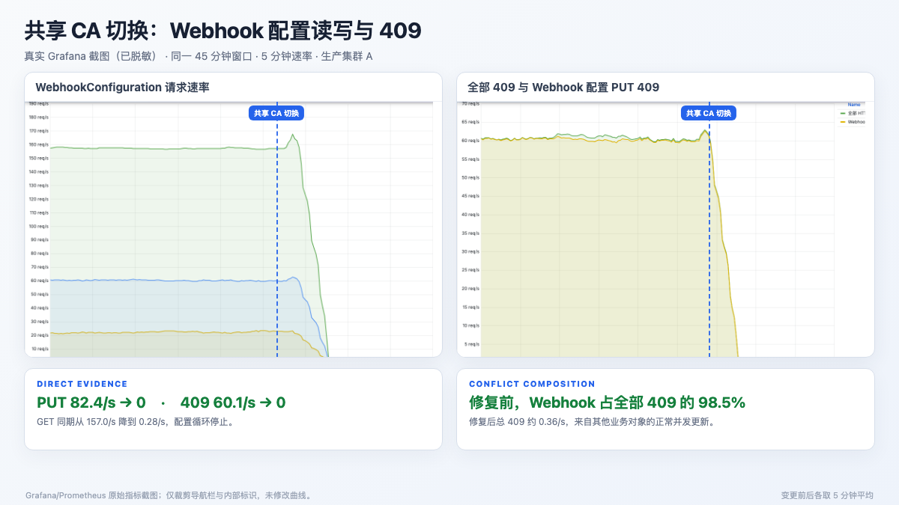
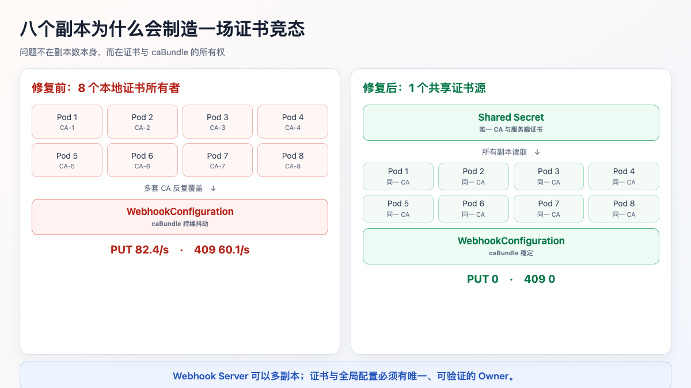
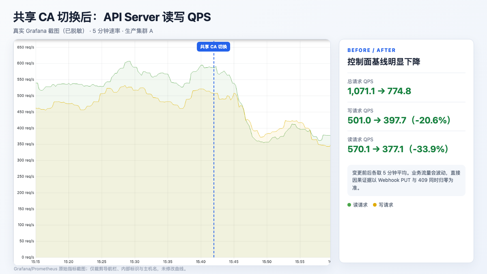
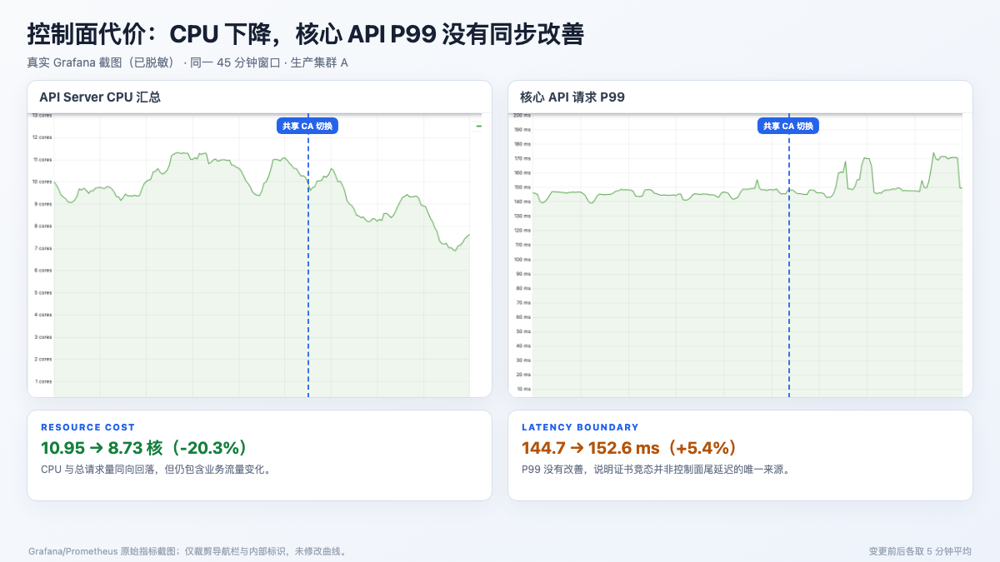
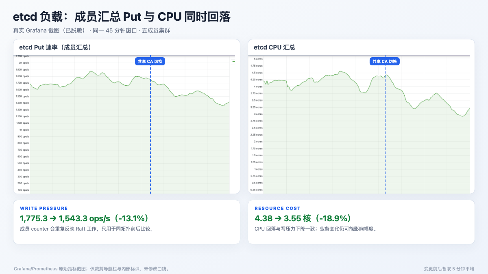
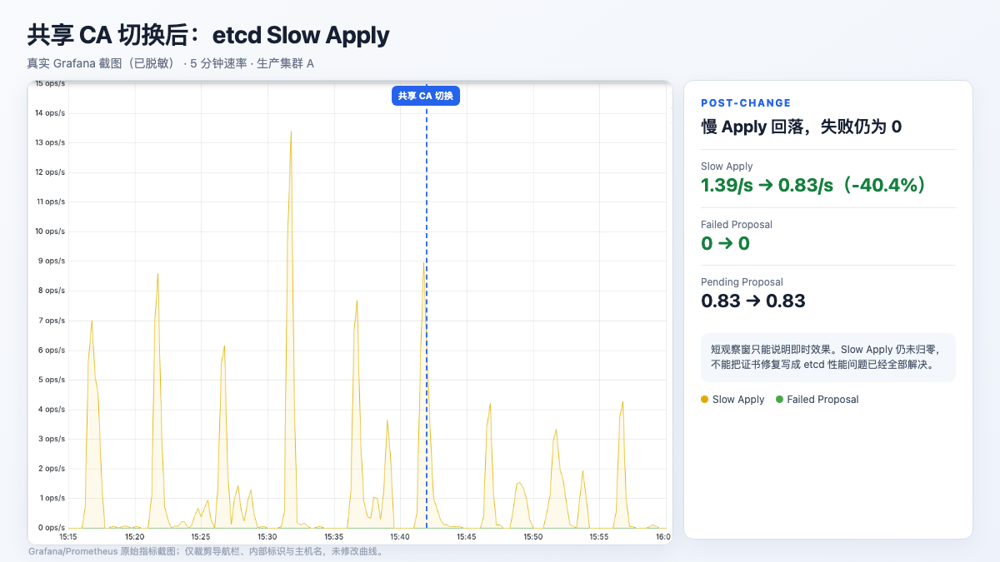
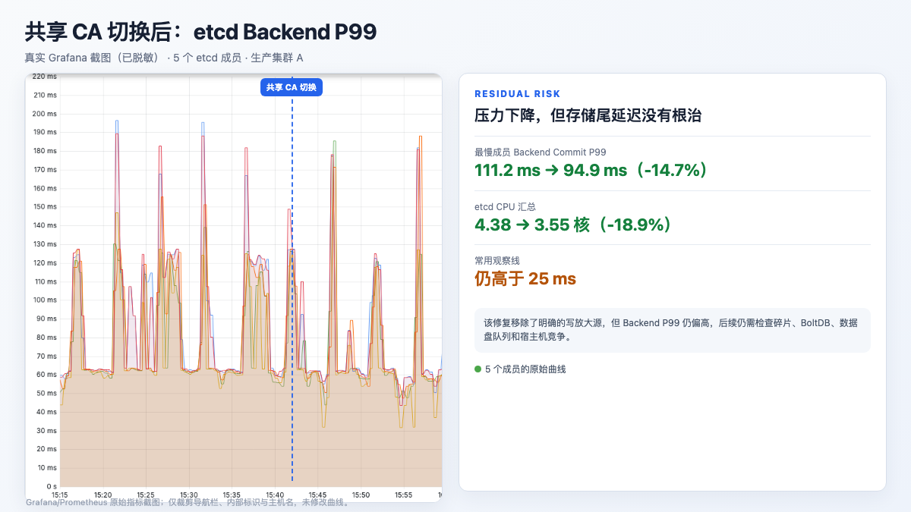

# 一场由 Koordinator Webhook 多副本证书竞态引发的意外

Koordinator 是面向混部、调度与资源管理的 Kubernetes 开源项目。它的 `koord-manager` 中包含 Admission Webhook，用来在对象进入集群时完成资源字段变更、校验和相关策略处理。

这类 Webhook 通常会部署多个副本。多个 Pod 可以分担请求，也能在单个副本故障时继续提供服务。但 Webhook 还有两份不能各管各的全局状态：**服务端证书的信任根，以及 WebhookConfiguration 中的 `caBundle`**。

先说明一个重要背景：**这个集群没有为该 Webhook 调用链提供可由 API Server 使用的 Kubernetes Service 入口。** 标准做法通常是在 `clientConfig.service` 中引用 Webhook Service；这个环境受历史架构和网络路径限制，只能借助内部负载均衡组件访问 Webhook，因此需要配置 `webhook_host`。这是一项特殊环境适配，不是标准 Kubernetes 部署方式。

我们处理过一次颇有迷惑性的生产问题：8 个 `koord-manager` 副本全部 Ready，Webhook 也能访问，API Server 却长期产生约 **60.1 次/秒的 HTTP 409**。最后发现，8 个副本各自在本地生成了一套自签 CA，并且都在更新同一组 WebhookConfiguration。

多副本本来是为了高可用，最后却变成了 8 个证书所有者争抢同一份配置。

这并不意味着 Koordinator Webhook 只要部署多副本就会发生竞态。真正的触发条件是：非标准的 Host 访问路径、本次镜像对证书 Writer 的默认选择，以及多个副本同时维护全局 `caBundle` 三者叠加。使用标准 Service 路径并共享证书的环境，不会自然复现这个问题。

## 意外从每秒 60 次 409 开始

问题发生在一个千节点级、运行数万个 Pod 的集群。API Server 总请求量大约每秒一千次，乍看之下，控制面压力似乎只是规模带来的自然结果。

把请求按 `resource + verb + code` 拆开后，异常才显露出来。两类 WebhookConfiguration 在稳定运行期仍然被高频读写：

| 请求 | 修复前 5 分钟平均 | 稳定运行时的合理形态 |
| --- | ---: | --- |
| GET | 157.0 次/秒 | 应接近 0，只保留低频同步 |
| PUT 尝试 | 82.4 次/秒 | 只应在证书或规则变化时出现 |
| PUT 409 | 60.1 次/秒 | 应为 0 |
| PUT 200 | 22.3 次/秒 | 稳定期也应接近 0 |



更有辨识度的数据是：修复前，WebhookConfiguration 的 PUT 409 约占 API Server 全部 409 的 **98.5%**。这不是普通控制器偶发抢写，而是一个持续运行的冲突源。

## 八个副本，为什么会有八套 CA

Webhook 除了监听 HTTPS 请求，还要完成两件事：

1. 准备服务端证书；
2. 把签发证书的 CA 写入 `MutatingWebhookConfiguration` 和 `ValidatingWebhookConfiguration` 的 `caBundle`。

本次配置 `webhook_host` 的目的，是让 API Server 经内部负载均衡访问 Webhook，解决特殊网络架构下的可达性问题。它不应被复制成通用部署参数。

本次运行镜像提供文件和 Secret 两种证书 Writer。当配置了外部 Webhook Host，却没有显式指定 Writer 时，这个版本选择了文件 Writer。每个 Pod 的文件系统相互隔离，8 个副本因此各自生成了不同的 CA。

与此同时，证书与 WebhookConfiguration 的同步逻辑没有只在 Leader 中运行。每个副本都认为自己应该把本地 CA 写入集群级配置对象。



这会形成一条自我放大的控制循环：

```text
某个 Pod 写入自己的 CA
        ↓
WebhookConfiguration.caBundle 发生变化
        ↓
其他副本收到 Informer 事件并再次同步
        ↓
多个副本基于旧 resourceVersion 同时更新
        ↓
出现 409、重试和下一轮配置变化
```

结果不只是 API Server 多了一些请求。`caBundle` 最终只能保存一个信任根，而负载均衡可能把请求转发到任意 Webhook Pod。当前 CA 若无法验证被选中后端的证书，Webhook 调用就会出现 TLS 错误。

当 `failurePolicy` 为 `Ignore` 时，调用失败的请求可能继续进入集群。表面看是业务没有被 Webhook 阻塞，实际却可能跳过预期的 mutation 或 validation。因此，验收 Webhook 不能只看一次请求是否返回 HTTP 200。

## 我们如何确认根因

这次定位没有从“证书可能有问题”开始猜，而是逐步把写入者、配置变化和证书内容对应起来。

第一步，按资源、动作和状态码拆分 API Server 请求，确认异常集中在 WebhookConfiguration 的 GET、PUT 和 409。

第二步，连续读取两个配置对象的 `generation` 与 `resourceVersion`。没有发布新规则，也没有人工更新，版本号却不断增长，说明控制器一直在改对象。

第三步，分别计算 8 个 Pod 内 CA 文件的 SHA256。结果是 **8 个 Pod、8 个不同的 CA 哈希**，配置对象中的 `caBundle` 也会随更新者变化。

第四步，检查没有持有 Leader Lease 的副本日志。非 Leader 副本同样在同步证书，并出现 `object has been modified` 一类冲突记录。至此，证据链闭合：多副本各持本地 CA，同时争写一个全局对象。

## 修复：让证书只有一个来源

处理方式并不复杂。我们先生成并验证一套共享证书，保存到 Kubernetes Secret，再显式把证书 Writer 切换为 Secret 模式：

```yaml
env:
  - name: WEBHOOK_CERT_WRITER
    value: secret
  - name: SECRET_NAME
    value: <webhook-tls-secret>
```

在本次镜像中，`SecretCertWriter` 通过 Kubernetes API 读取 Secret，再把证书写入容器原来的证书目录，因此不需要额外挂载 Secret Volume。不同版本的实现可能不同，上线前仍要核对镜像内的实际代码和启动参数。

共享证书还要满足几项基本检查：CA 能验证服务端证书，私钥与证书匹配，SAN 覆盖 Webhook 的访问地址，并包含 Server Authentication 用途。Secret 中的 CA、所有 Pod 的 CA，以及全部 `caBundle` 必须一致。

滚动更新时采用 `maxUnavailable: 0`，新副本 Ready 后再替换下一个。这样可以逐步收敛证书，同时避免更新过程中主动降低 Webhook 可用性。

## 修复后，直接写冲突归零

变更完成后，最直接的三项指标立即稳定下来：WebhookConfiguration GET 从 157.0/s 降到 0.28/s，PUT 尝试从 82.4/s 降到 0，PUT 409 从 60.1/s 降到 0。

配置对象的 `generation` 和 `resourceVersion` 不再持续变化。8 个副本的 CA 与服务端证书哈希全部一致，WebhookConfiguration 中的 CA 也与 Secret 一致。通过负载均衡入口连续进行 24 次 TLS 请求，均通过证书校验并返回 HTTP 200。

同一个观察窗口里，API Server 总 QPS 从 1,071.1/s 降到 774.8/s，写请求从 501.0/s 降到 397.7/s。



API Server CPU 汇总从 10.95 核降到 8.73 核，降幅为 20.3%。这些整体指标会受到同时段业务量影响，因此只能作为相关证据。能够直接归因的结果仍是：WebhookConfiguration 的 PUT、409 归零，GET 接近静默，配置不再抖动。



这里还有一个不该忽略的结果：核心 API 请求 P99 从 144.7 ms 变为 152.6 ms，没有改善。删除写放大降低了无效工作，但集群仍有其他延迟来源。

## etcd 压力回落，不等于尾延迟已经解决

修复后，五个成员汇总的 etcd Put 从 1,775.3/s 降到 1,543.3/s，etcd CPU 从 4.38 核降到 3.55 核。



成员汇总的 Put 会重复计算同一份 Raft 工作，因此只适合在成员拓扑相同的前提下比较趋势，不能把它当作独立业务写入量。两条曲线在变更后方向一致地回落，但没有在切换点形成完全同步的断崖，业务流量变化仍是影响因素。

Slow Apply 从 1.39/s 降到 0.83/s，最慢成员的 Backend Commit P99 从 111.2 ms 降到 94.9 ms。两者都有回落，却仍处于需要继续调查的水平。





WAL Fsync P99 仍接近 1 ms，说明 WAL 路径没有表现出同等程度的延迟。Backend Commit 的问题还需要从 BoltDB 数据文件、碎片、块设备队列、CPU 抢占、NUMA 和同机进程竞争等方向继续排查。

准确的结论是：**共享 CA 移除了一个已经证实的控制面写放大源；它没有包治 API Server 和 etcd 的所有延迟。**

## 使用 cert-manager，也要先确定谁负责写

cert-manager 可以签发共享证书，cainjector 也能把 CA 注入 WebhookConfiguration。这是一条成熟的证书管理路径，但“装了 cert-manager”并不会自动解决多写者问题。

如果 cainjector 和 Koordinator 内置控制器同时修改 `caBundle`，原来的 8 个竞争者会变成两类竞争者。生产配置必须回答清楚三个问题：

- 谁签发与轮换证书；
- 谁写入或挂载 Secret；
- 谁更新 WebhookConfiguration 的 `caBundle`。

每一项都应该有唯一 Owner。其他组件只读取结果，不再维护第二套状态。

## 生产环境需要守住的几条线

这次意外留下的经验可以归纳成一份短清单：

1. **Webhook Server 可以多副本，证书来源必须一致。** 发布前比较所有 Pod 的 CA 和服务端证书哈希。
2. **证书、Secret 与 `caBundle` 分别明确唯一 Owner。** 避免内置控制器、cainjector 和部署脚本同时写同一个对象。
3. **稳定期监控 WebhookConfiguration 的 PUT 与 409。** 这类全局配置不应该持续高频更新。
4. **同时检查对象版本和证书内容。** QPS 异常、`resourceVersion` 抖动与 CA 哈希不一致结合起来，才能快速锁定问题。
5. **验证 Admission 语义，而不只是 HTTP 状态。** 检查对象是否真的得到预期 mutation，错误输入是否被 validation 拒绝。
6. **滚动更新覆盖所有负载均衡后端。** 连续请求并检查 TLS 验证结果，避免只命中少数健康副本。
7. **为证书轮换留下观测和回滚窗口。** 长有效期只能减少轮换频率，不能代替到期告警与轮换演练。

多副本只能提高服务端的可用性。若每个副本都携带一套不同的全局状态，副本越多，冲突反而越密集。对 Admission Webhook 来说，证书不是 Pod 私有文件，而是 API Server 与所有后端共同遵守的一份信任契约。

本案例有特殊的网络与部署前提，根因不应直接外推到所有 Koordinator 集群；但从 API 请求拆分、对象版本抖动、Pod 证书哈希、Leader 边界到配置 Owner 的排查过程，对其他多副本 Webhook 和控制器同样适用。环境差异往往藏在一个看似合理的兼容参数里，理解它改变了哪条标准路径，比记住某个固定配置更重要。

参考资料：

Koordinator：https://github.com/koordinator-sh/koordinator

Koordinator Webhook Controller：https://github.com/koordinator-sh/koordinator/blob/main/pkg/webhook/util/controller/webhook_controller.go

Kubernetes Dynamic Admission Control：https://kubernetes.io/docs/reference/access-authn-authz/extensible-admission-controllers/

cert-manager CA Injector：https://cert-manager.io/docs/concepts/ca-injector/

完整公开文档：https://aik8s.run/ai-k8s/practices/koordinator-webhook-multireplica-cert-race/

点击「阅读原文」，可查看完整 PromQL、证书检查命令、验收表和脱敏后的 Grafana 证据。
