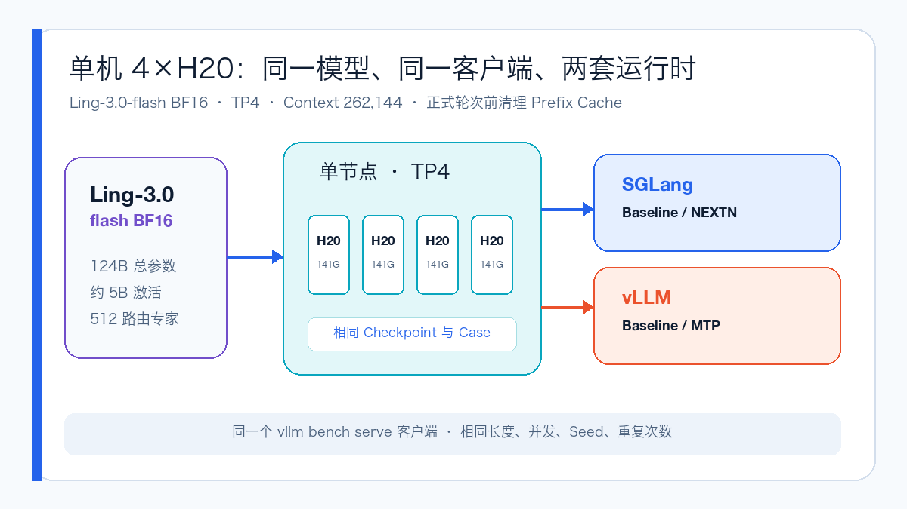
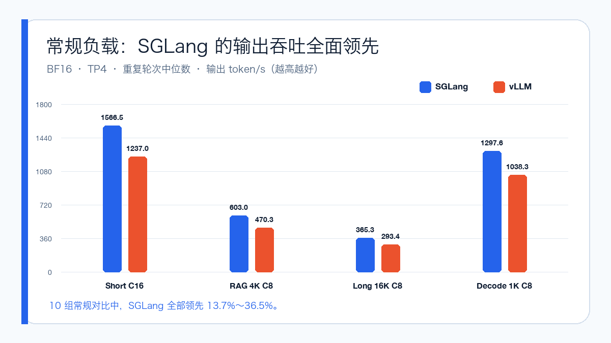
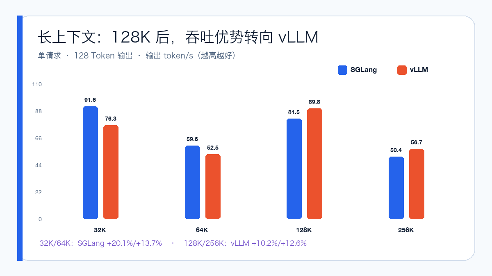
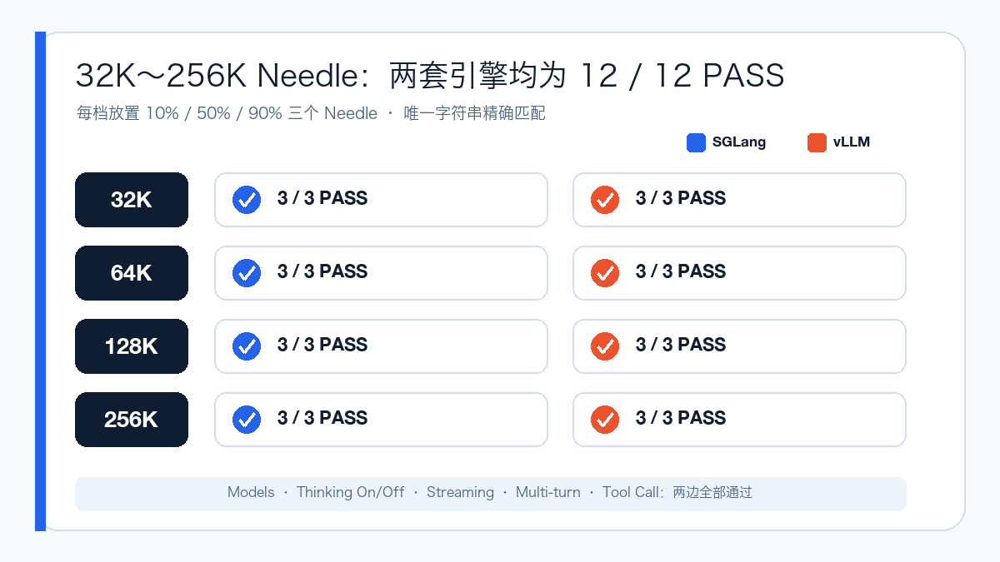
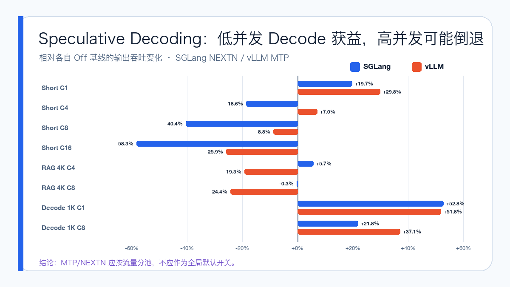

# Ling-3.0-flash 实测：4×H20，SGLang 还是 vLLM？

2026 年 7 月 24 日，inclusionAI 正式发布 Ling-3.0-flash。

这是一个强调“智能密度”的混合线性 MoE：总参数 124B，每个 Token 只激活约 5B 参数；主干由 35 层 KDA 和 7 层 Gated MLA 按 5:1 交替堆叠，包含 512 个路由专家、每次激活 8 个，并在 256K Context 上完成训练。

与上一代 1T 级 Ring-2.6-1T 相比，它没有继续堆总参数，而是把重点放在长上下文效率、推理成本和 Agent 工作负载上。部署层面也因此变得更有意思：完整 BF16 权重可以在单台 4×141GB H20 上运行，SGLang 与 vLLM 都给出了相应支持路径，模型本身还带有 MTP 层。

这次我把四组配置都跑了一遍：SGLang Baseline、SGLang NEXTN、vLLM Baseline 和 vLLM MTP。功能、32K～256K Needle 和固定长度性能矩阵合计完成 9,022 个正式请求，失败数为 0。

## 先说结论

- 常规在线负载优先看 SGLang。短请求、4K RAG、16K 输入和 1K Decode 的十组对比中，SGLang 输出吞吐全部领先，幅度为 13.7%～36.5%；
- 超长上下文不能照搬短请求结论。32K、64K 是 SGLang 更快，到 128K、256K 后则由 vLLM 反超；
- 两套运行时都通过 256K 正确性 Gate：32K、64K、128K、256K 各三个 Needle 深度，均为 12/12 PASS；
- NEXTN/MTP 不是“打开就更快”。低并发长输出收益明显，但高并发短请求可能大幅倒退。

所以这次没有一个简单的“赢家”。更合理的答案是：SGLang 适合常规在线吞吐，vLLM 在超长单请求上值得优先验证，而 Speculative Decoding 应按流量类型拆分。

## 公平压测是怎么做的

两个引擎分别使用相同规格的单台 4×141GB H20，加载同一份 Ling-3.0-flash BF16 权重，均使用 TP4，并把最大 Context 设为 262,144。

客户端统一使用 `vllm bench serve --backend openai`，固定相同的 Case、输入输出 Token 数、并发、随机种子、请求速率和重复次数。除 256K 能力探针只跑一轮外，其余正式性能 Case 均跑三轮，正文采用逐轮指标的中位数。

Prefix Cache 可以开启，但每轮正式测试前都必须成功清空。这个条件很重要：相同 Prompt 和相同客户端，并不代表服务端缓存状态自动一致。

四组正式配置最终分别得到：

| 配置 | 成功请求 | 失败请求 |
| --- | ---: | ---: |
| SGLang Baseline | 2,411 | 0 |
| SGLang NEXTN | 2,100 | 0 |
| vLLM Baseline | 2,411 | 0 |
| vLLM MTP | 2,100 | 0 |

需要说明，这仍然是两套可落地部署配方的对比，不是把所有 Kernel 与调度差异剥离后的纯微基准。结论只适用于本文给出的硬件、版本和参数。

## 部署阶段先踩了两个坑

SGLang 使用面向 Ling 的开发镜像后，可以直接识别模型并启动。

vLLM 的稳定镜像在预检时无法原生识别 `BailingMoeV3ForCausalLM`，正式测试改用包含 Ling 支持的固定 nightly。随后默认 Custom All-Reduce 又在这批 H20 上触发 CUDA `invalid argument`，显式增加 `--disable-custom-all-reduce` 后才稳定 Ready。

这两个问题说明，镜像标签里写着 vLLM 或 SGLang 并不代表模型一定受支持。正式部署至少要固定镜像 Digest，并在容器内核对模型架构、Parser 和 Speculative 参数是否真的注册。

## 常规负载：SGLang 十组全部领先

四组代表性结果如下：

| Case | SGLang | vLLM | SGLang 相对吞吐 |
| --- | ---: | ---: | ---: |
| Short 128→64，C16 | 1,566.51 tok/s | 1,237.04 tok/s | +26.6% |
| RAG 4K→128，C8 | 602.98 tok/s | 470.27 tok/s | +28.2% |
| Long 16K→256，C8 | 365.32 tok/s | 293.45 tok/s | +24.5% |
| Decode 128→1K，C8 | 1,297.60 tok/s | 1,038.30 tok/s | +25.0% |

把 C1～C16 的短请求、RAG、长输入和持续 Decode 全部放在一起看，SGLang 的持续吞吐与批处理效率更稳定。

但延迟敏感业务不能只看 token/s。vLLM 在 C1 Short 和 Decode 的首 Token 更快，所以如果业务主要是低并发交互，还应把 TTFT、TPOT 和 E2E 一起纳入选型。

## 128K 以后，答案反转

单请求、128 Token 输出时，两套引擎出现了清晰的交叉点：

| Context | SGLang | vLLM | 更快的一方 |
| --- | ---: | ---: | --- |
| 32K | 91.65 tok/s | 76.32 tok/s | SGLang +20.1% |
| 64K | 59.63 tok/s | 52.46 tok/s | SGLang +13.7% |
| 128K | 81.49 tok/s | 89.81 tok/s | vLLM +10.2% |
| 256K | 50.37 tok/s | 56.70 tok/s | vLLM +12.6% |

32K、64K 每轮包含多个不同 Needle 位置的请求，128K、256K 则是单请求 Case，所以四档不应该直接连成一条缩放曲线；但同一行内的引擎对比仍然有效。

256K 只有一轮，应视为能力探针和方向性证据，不能直接拿去做生产容量承诺。它至少证明了一件事：短请求领先，不代表超长 Prefill 也一定领先。

## 不是 HTTP 200 就算长上下文通过

随机 Token 压测只能回答“跑多快”，不能回答“长文里还能不能找对内容”。因此两边又分别执行了 32K、64K、128K 和 256K Needle 测试，每档把唯一字符串放在 10%、50%、90% 三个位置，并要求模型精确返回目标。

最终 SGLang 和 vLLM 都是 12/12 PASS。两边的 `/v1/models`、默认 Thinking、关闭 Thinking、流式输出、多轮对话和结构化 Tool Call 也全部通过。

Needle 的耗时只用于证明请求真实执行，不参与引擎性能排名，因为这些请求是串行运行，缓存历史和服务状态没有做到严格对齐。

## NEXTN / MTP：最大收益和最大回退同时出现

Ling-3.0-flash 自带 MTP 层。SGLang 使用 NEXTN，配置 3 个推测步骤和 4 个 Draft Token；vLLM 使用 MTP，每轮推测 3 个 Token。

在 Decode 128→1K、C1 时，SGLang NEXTN 提升 52.8%，vLLM MTP 提升 51.8%。这是本轮最明确的收益场景。

但 Short 128→64、C16 时，SGLang NEXTN 反而下降 58.3%，vLLM MTP 下降 25.9%；RAG 4K、C8 中，vLLM MTP 也下降了 24.4%。

原因并不神秘：长输出、低并发时，Draft/Verify 更容易摊薄验证成本；输出很短且并发很高时，额外调度本身就可能成为负担。

因此不建议给所有流量全局开启 MTP。更实际的做法是至少拆成两个池：长输出 Agent 或生成任务启用 NEXTN/MTP，短对话与高并发 RAG 保持关闭，再由网关按请求特征路由。

## 最后怎么选

- 短对话、RAG、高并发 Agent：先选 SGLang Baseline；
- 低并发且极度重视首 Token：优先补测 vLLM；
- 128K～256K 单请求：本轮 vLLM 更强，但 256K 需要增加重复轮次；
- 长输出生成：两边都可以开启 Speculative，本轮 SGLang NEXTN 的绝对吞吐更高；
- 混合流量：不要依赖一个全局 MTP 开关，按请求长度和并发分池。

这次测试也有明确边界：只覆盖一个 4×H20 时间窗口，没有测试 FP8、不同 TP、量化 KV Cache 或更大并发；固定长度随机 Token 不能代替真实 RAG 与生产 Agent 流量；也没有采集完整的 Speculative Acceptance Length、GPU 功耗和显存时序。

但作为部署选型的第一轮数据，它已经足够说明：框架性能结论必须带上 Context、并发和 MTP 状态。脱离这些条件，只写“谁更快”，很容易得到错误答案。

## 参考资料

Ling-3.0-flash 官方发布说明：
https://developer.ant-ling.com/zh-CN/blogs/ling-3.0-flash-release

Ling-3.0-flash 模型页：
https://huggingface.co/inclusionAI/Ling-3.0-flash

SGLang Cookbook：
https://docs.sglang.io/cookbook/autoregressive/InclusionAI/Ling-3.0-flash

vLLM Ling-3.0-flash Recipe PR：
https://github.com/vllm-project/recipes/pull/743/files
