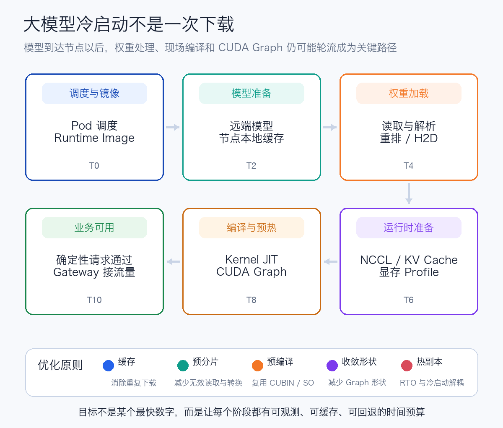
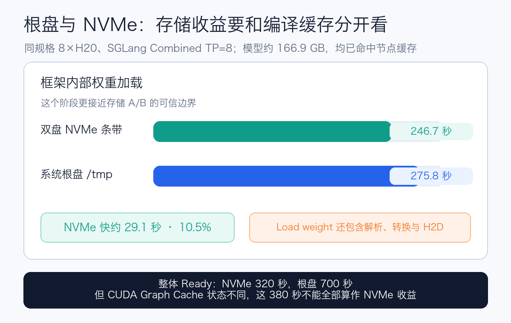
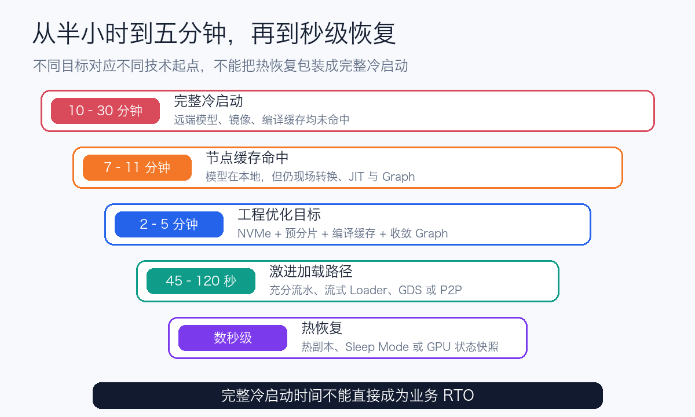

# 大模型冷启动优化实践：从 23 分钟基线到 5 分钟目标

> 本文是特定测试环境下的工程复盘。文中时间包含现场观测值和下一阶段目标，不代表所有软硬件环境都能得到相同结果，也不构成产品性能或采购承诺。涉及的品牌与开源项目名称仅用于说明测试配置。

今年上半年部署 DeepSeek-V4-Pro 时，我们碰到过一个很现实的问题：**模型滚动重启接近半小时。**

正常发布时，旧副本还可以继续接流量；一旦服务已经整体不可用，这半小时就是故障恢复时间。对于接入真实业务的大模型服务，这已经超出我们的恢复时间目标。

最初，我们以为问题只是模型太大、下载太慢。于是提前把模型放到 GPU 节点，下载时间的确消失了，但 Engine 仍然要等很久才能真正回答请求。

后来在约 156 GiB 的 DeepSeek V4 Flash、单节点 `8 × H20` 环境上逐段打点，我们才看清：冷启动不是一次下载，而是一条连续的关键路径。



## 端口起来了，不等于模型能用了

我们把一次启动拆成了这些阶段：Pod 调度、镜像准备、模型缓存检查、Checkpoint 读取与转换、CPU 到 GPU 搬运、NCCL 初始化、Kernel JIT、CUDA Graph、真实请求预热，最后才让 Gateway 接入流量。

这几个“Ready”必须分开：

- 进程开始监听端口；
- Kubernetes Readiness Probe 通过；
- 第一条确定性生成请求成功；
- 常用请求形状完成预热；
- Gateway 正式把流量送进来。

如果只测到端口监听，第一次真实请求仍可能现场编译 Kernel，用户看到的就是几十秒 TTFT。我们曾在同一套 DeepSeek V4 Flash 服务上观察到：首次并发压测的 p95 TTFT 约 33.4 秒；同形状预热后复跑，恢复到约 233 毫秒。模型、GPU 和参数都没有变化，区别只是运行时是否完成编译与预热。

所以，冷启动的终点应该是“业务可用”，而不是“容器活着”。

## 23 分钟究竟花在了哪里

一次完整冷启动留下了比较清晰的证据：约 156 GiB 模型、48 个 Safetensors 分片、单节点 8 张 H20。

| 阶段 | 观测时间 |
| --- | ---: |
| 模型准备 | 约 6 分钟 |
| 首次拉取约 14.29 GB Runtime Image | 约 127 秒 |
| NCCL 初始化 | 约 19 秒 |
| Target CUDA Graph，51 组 Batch Shape | 约 394 秒 |
| Draft CUDA Graph | 约 123 秒 |
| Engine 内部启动 | 约 854 秒 |
| Pod 创建到业务 Ready | 约 23 分钟 |

真正值得注意的是：**模型已经在节点上，也不代表冷启动已经解决。**

在模型缓存命中的情况下，SGLang Combined 首次启动仍然约 11 分钟；vLLM 重建仍约 7 分 40 秒。下载消失后，Checkpoint 转换、TileLang、DeepGEMM 编译和 CUDA Graph 会依次浮现为新的关键路径。

优化冷启动很像剥洋葱：每解决一层，下一层才会显现。

## 第一层：减少 GPU 等待下载的时间

第一项优化，是把模型准备移出 GPU Pod 的关键路径。

我们把存储职责拆成两层：共享存储保存可恢复、可治理的权威副本；节点本地缓存保存面向启动、可以重建的热副本。节点只有在 Runtime Image、模型、完整性标记和编译制品准备好后，才进入可承载推理任务的资源池。

这里有个很常见的误区：`hostPath` 只表示宿主机目录，并不说明它下面一定是 NVMe。

我们检查两台同规格 8×H20 节点后发现，原来的 HostPath 实际位于约 1 TiB 的系统根盘；节点另外还有两块约 5.8 TiB NVMe，组成约 12 TiB 的条带 XFS 数据卷。

把约 166.9 GB、56 个文件复制到 NVMe，耗时约 58～59 秒，包含文件系统 `sync`，表观吞吐约 2.7 GiB/s。随后用相同模型、镜像、启动参数和 GPU 规格，对 SGLang Combined TP=8 做并行 A/B：

| 观测项 | 双盘 NVMe | 系统根盘 |
| --- | ---: | ---: |
| 模型 Cache Check | 命中 | 命中 |
| `Load weight` | 约 246.7 秒 | 约 275.8 秒 |
| 确定性生成请求 | 正确 | 正确 |



NVMe 在权重阶段节省约 29.1 秒，提升约 10.5%。这是可信的存储收益。

现场总 Ready 时间相差更大，但两台节点的 JIT 与 CUDA Graph 缓存状态不同，不能把整段差异都归功于 NVMe。约 167 GB 文件虽然一分钟左右就能顺序复制完，Engine 的权重阶段仍需要约 247 秒，也证明这段时间还包含解析、重排、量化处理和 H2D 搬运。

## NVMe 有用，但不是免费答案

如果一台 TP=8 服务因为 NVMe 缩短 29 秒，一次重启大约节省：

```text
8 GPU × 29 秒 ≈ 232 GPU·秒 ≈ 3.9 GPU·分钟
```

如果每月只重启几次，为这 29 秒升级整批机器，未必划算；如果每天频繁扩缩容、滚动发布，或者这 29 秒直接影响高价值服务的 RTO，收益就会持续累积。

实际选型还要看介质、PCIe 带宽、NUMA 拓扑、8 个 Rank 的并发读取、盘容量、写入寿命和故障模型。双盘条带提升了吞吐，也意味着任意一块盘故障都可能让整份缓存失效。

因此，本地 NVMe 更适合作为热点模型的分层缓存，而不是要求所有 GPU 节点统一购买最大、最贵的盘。低频模型可以按需回源，关键模型再根据缓存命中率、启动频率和 RTO 下沉。

## 第二层：别让每个 Rank 重复做无用功

Safetensors 支持安全加载和 mmap，但原始分片不一定适合当前 TP、PP 或 EP 拓扑。常见浪费包括：每个 Rank 遍历所有分片，读入后再丢弃不属于自己的张量；启动时才进行量化、转置或布局转换。

我们的优化方向是：把确定性的转换放到离线构建，按目标并行拓扑预分片，让每个 Rank 直接读取自己的连续数据，再把磁盘读取、CPU 转换和 H2D 搬运做成流水。

这一层的关键不是换一个 Loader 参数，而是把“模型文件”变成适合生产拓扑的模型制品。

## 第三层：把现场编译变成可复用制品

在 H20 上启动 DeepSeek V4 时，SGLang 会为 `sm_90a` 生成 CUDA 源码，再经过 `nvcc`、`cicc`、`ptxas` 和 Ninja 生成 CUBIN 或动态库。

我们观测到一次 MHC Prewarm 为 16 个 Bucket 生成 CUBIN，花了约 248 秒；最终文件却不到 1 MiB。最昂贵的不是保存制品，而是每次 Pod 重建都重新生成它。

因此，DeepGEMM、TileLang、Triton、FlashInfer、通信扩展和 `torch.compile` 缓存都应该成为带版本指纹的 Runtime 资产。指纹至少要包含 GPU 架构、Driver、CUDA、镜像 Digest、框架版本、Python ABI、模型实现、量化方式以及 TP/PP/EP 配置。

比较稳妥的做法，是在同架构 GPU 上跑受控预热矩阵，收集 `.cubin`、`.so` 和编译缓存，生成 Manifest，再随派生镜像或独立缓存卷分发。缓存不匹配时宁可回退重编，也不要跨环境盲目复用。

## 第四层：CUDA Graph 不要贪多

编译缓存命中后，CUDA Graph 往往会成为新的最长阶段。本轮 Target 和 Draft 两轮 Capture 合计约 517 秒。

Graph 与进程地址、通信器和请求 Shape 相关，不能像 CUBIN 一样简单复制。更现实的优化是：根据真实流量选择高频并发和长度，只 Capture 必要 Shape；低频大 Shape 先走 Eager，后台再补齐；同时区分“最低可服务”和“全部 Shape 已预热”两级 Ready。

关闭 Graph 的确能让启动更快，却可能牺牲稳态吞吐。冷启动和稳态性能必须放在同一张表里评估。

## 五分钟之后，才轮到更激进的路径

把模型缓存、预分片、编译制品和 Graph 集合收敛后，我们认为 150 GiB 级模型在 H20 上把节点缓存重启稳定到 **2～5 分钟**，是当前更合理的工程目标。

注意，这是下一阶段目标，不是把单项 A/B 拼成已经实现的成绩。



继续往下，可以考虑 GPU Peer、Sleep Mode 或 GPU Snapshot，但它们优化的是不同场景：

- GPU Peer 适合已有兼容副本时的滚动发布和突发扩容；
- Sleep 用大量 Host Memory 换快速唤醒，无法覆盖 Pod 或节点消失；
- GPU Snapshot 可以探索更快恢复，但对驱动、权限、多卡和 Runtime 兼容性要求更高。

这些能力也不是免费的。GPU Peer 需要常驻源副本、RDMA 网络和更复杂的传输控制面；热副本持续占用 GPU；Sleep 消耗主机内存；Snapshot 增加特权组件与版本兼容成本。

真正的目标不是直接购买更高规格的硬件，而是在满足 SLO 的前提下控制总体成本。

## 我们最后沉淀了三类资产

回头看，从接近半小时走向五分钟，管理的已经不是一个启动参数，而是三类可以复用的资产：

1. 模型资产：不可变 Digest、节点缓存、面向并行拓扑的 Checkpoint；
2. Runtime 资产：CUBIN、动态库、Triton、DeepGEMM、TileLang、FlashInfer 与编译缓存；
3. 运行状态资产：预热副本、GPU Peer、休眠进程或经过验证的快照。

每轮优化只改变一个变量，同时记录启动时间、正确性、吞吐、TTFT、TPOT、显存和功耗。否则很容易把缓存命中、硬件差异或测试噪声误认为优化收益。

我们一开始只想解决“模型下载太慢”，最后发现真正需要建设的是一套完整的模型启动供应链。

普通路径先把五分钟作为可验证目标，关键服务再评估用热副本保障更快切换。对我们而言，可复现、可观测并且成本可控，比单次测试中的最短数字更有意义。
