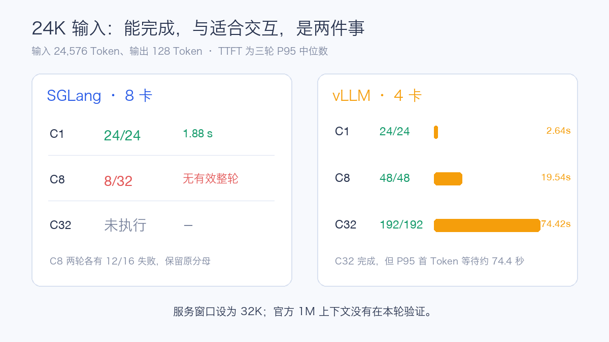

# MiMo-V2.6-Flash-RL Day 0：4 卡与 8 卡，两种部署画像

MiMo-V2.6-Flash-RL 是 XiaomiMiMo 发布的效率型开放权重模型。它采用稀疏混合专家架构，总参数 **309B**，每个 Token 激活约 **15B** 参数，原生接受文本、图片、视频和音频输入，官方上下文长度达到 **1M Token**，采用 MIT 许可证。

这不是一个只看“309B 能不能装下”的模型。它有 256 个专家、Top-8 路由，48 层中包含 39 层滑动窗口注意力和 9 层全局注意力，还带有 5 层 MTP Drafter。GPU 数量、并行方式、长输入并发和多模态链路都会改变实际部署效果。

这次在 H20-3e 上完成两套 Day 0 部署：**SGLang 单机 8 卡**，以及 **vLLM 单机 4 卡**。两边都完成基础文本、流式、多轮、工具和图片验证，并进入固定长度压测和长上下文测试。

两套服务使用的卡数和并行策略不同。本文关注的是两种可以落地的部署画像：8 卡配置能给出怎样的总吞吐，4 卡配置能否提供更小的实例占用和更高的资源密度。

## 两套服务怎样配置

| 项目 | SGLang | vLLM |
| --- | --- | --- |
| GPU | 1 节点 × 8×H20-3e | 1 节点 × 4×H20-3e |
| 并行 | TP8、DP2、DP Attention、DP LM Head | TP4 |
| 服务上下文 | 32,768 Token | 32,768 Token |
| 关键预算 | Max Running Requests 64 | GPU Memory Utilization 0.90 |
| Prefix Cache | 关闭 | 关闭 |
| 工具协议 | MiMo parser | MiMo parser |

SGLang 使用 Chunked Prefill 16,384 和 FlashInfer MXFP4 MoE 路径；vLLM 使用固定支持分支的 MiMo 路径。两套容器都申请 64 CPU、512 GiB 内存，模型从共享只读存储加载。

本轮主动关闭 Prefix Cache。性能请求使用固定长度随机 Token，避免重复输入因缓存命中改变结果。生产环境若有大量相同系统提示词，应另建缓存开启的独立画像。

## 测试方法与成功条件

核心矩阵包含四类请求：

| 场景 | 输入 / 输出 Token | 并发 |
| --- | ---: | --- |
| 短请求 | 1,024 / 128 | C1、C8、C32 |
| 长 Prefill | 8,192 / 128 | C1、C8、C32 |
| 长 Decode | 1,024 / 512 | C1、C8、C32 |
| 长上下文 | 24,576 / 128 | C1、C8、C32 |

C1 每轮 8 个请求，C8 每轮 16 个请求，C32 每轮 64 个请求。每档先预热，再正式重复三轮。请求固定 `temperature=0`、`ignore_eos=true`。

一个请求必须同时满足 HTTP 成功、非空输出、完整结束标记、有效 usage 和目标输出长度才算成功。失败请求保留在原分母；性能表采用全部有效轮次的中位数。

这里的三个关键指标是：

- **输出吞吐**：每秒完成的输出 Token；
- **TTFT**：从发出请求到第一个非空 Token；
- **TPOT**：第一个 Token 以后，每个输出 Token 的平均生成时间。

## 文本、工具和图片先通过

两套引擎都通过了模型 ID、算术、多轮记忆、流式完整性、工具调用、单图和双图顺序验证。实际 Prompt 包括：

- 算术：`计算 17 加 25，只回答数字。`
- 多轮：`Remember code 482619.`，下一轮询问并要求只返回验证码。
- 工具：`Use get_weather to look up weather in Beijing. Do not invent the weather.`
- 单图：`Name the main vegetable shown. Reply with one English noun only.`
- 双图：要求按图片顺序返回两个蔬菜名，交换图片以后检查回答是否同步变化。
- 视频：要求按出现顺序列出三种背景颜色。
- 音频：要求只返回录音中的数字验证码。

视频请求中，vLLM 的中间推理正确识别蓝、绿、红顺序，但在 256 Token 上限内没有生成最终字段，因此按失败处理。音频接口返回不支持的文件错误。这轮已经验证文本、工具和图片；视频和音频还需要继续收敛接口格式与输出预算。

## 核心吞吐：总量和每卡密度一起看

| 输入/输出 | 并发 | SGLang 8 卡 Token/s | vLLM 4 卡 Token/s | TTFT P95 秒：S / V |
| --- | ---: | ---: | ---: | ---: |
| 1K/128 | C1 | 76.93 | 156.83 | 0.120 / 0.170 |
| 1K/128 | C8 | 490.27 | 469.43 | 0.588 / 0.872 |
| 1K/128 | C32 | 970.41 | 657.72 | 2.141 / 3.227 |
| 8K/128 | C1 | 57.59 | 85.49 | 0.651 / 0.842 |
| 8K/128 | C8 | 169.39 | 132.02 | 4.477 / 6.405 |
| 8K/128 | C32 | 223.99 | 144.38 | 15.037 / 23.752 |
| 1K/512 | C1 | 78.35 | 183.30 | 0.118 / 0.169 |
| 1K/512 | C8 | 609.87 | 653.82 | 0.539 / 0.874 |
| 1K/512 | C32 | 1,528.83 | 1,042.44 | 1.915 / 3.221 |

短请求 C32 时，SGLang 的总吞吐达到 **970.41 Token/s**，vLLM 为 **657.72 Token/s**。按已分配卡数简单折算，分别约为 **121.30** 和 **164.43 Token/s/GPU**。

长输出 C32 时，SGLang 总吞吐为 **1,528.83 Token/s**，vLLM 为 **1,042.44 Token/s**；按卡数折算约为 **191.10** 和 **260.61 Token/s/GPU**。

每卡值适合观察这两套配置的资源密度。它同时包含 TP/DP、调度和 Kernel 的影响，不能当成单卡独立性能，也不能据此推导线性扩容结果。

vLLM 的 8K/C32 第一轮完成 63/64，后两轮均为 64/64，三轮合计 **191/192**。其余上表各档正式请求全部完成。

## 24K 输入把边界暴露出来

| 引擎 | 并发 | 完成/请求 | 输出 Token/s | TTFT P95 | E2E P95 |
| --- | ---: | ---: | ---: | ---: | ---: |
| SGLang 8 卡 | C1 | 24/24 | 36.92 | 1.883 s | 3.484 s |
| SGLang 8 卡 | C8 | 8/32 | — | — | — |
| SGLang 8 卡 | C32 | 未执行 | — | — | — |
| vLLM 4 卡 | C1 | 24/24 | 38.83 | 2.638 s | 3.309 s |
| vLLM 4 卡 | C8 | 48/48 | 47.46 | 19.543 s | 28.876 s |
| vLLM 4 卡 | C32 | 192/192 | 49.32 | 74.423 s | 148.263 s |

SGLang 的 24K/C8 连续两轮各有 12/16 请求失败，随后停止当前阶段，C32 没有执行。vLLM 的 24K/C32 全部完成，但 P95 首 Token 等待约 **74.4 秒**，完整流约 **148.3 秒**。

这组数据说明长上下文容量要用延迟目标来约束。请求最终完成，并不代表它适合聊天、Agent 或在线检索。生产上应按输入长度分层排队，为长 Prefill 设置更低并发、最大排队时间和取消机制。

## 限速扫描找到了延迟拐点

SGLang 以 8K/128、C32 的 1.7499 req/s 校准结果为参考，执行 0.5、0.8、1.1 三档固定到达率扫描。三档合计 **2,397/2,397** 个请求完成。

| 档位 | 达成请求率 | P95 TTFT | P95 TPOT | P95 E2E |
| ---: | ---: | ---: | ---: | ---: |
| 0.5× | 0.866 req/s | 1.939 s | 54.49 ms | 7.821 s |
| 0.8× | 1.379 req/s | 3.554 s | 194.77 ms | 27.141 s |
| 1.1× | 1.644 req/s | 26.851 s | 287.67 ms | 53.107 s |

从 0.8× 提高到 1.1×，完成速率只增加约 19%，P95 TTFT 却从 3.55 秒扩大到 26.85 秒。继续增加流量时，更多时间会消耗在排队和资源争用上。这一段曲线比单个最高吞吐数字更适合设置准入阈值。

vLLM 的执行包没有携带这次共享限速参考，因此该阶段按规则跳过，没有拼接不一致的基准。

## 资源曲线怎样看

SGLang 八卡显存稳定在约 109–110 GB，核心阶段各卡利用率均达到 100%，高负载功耗约 300–400 W，温度峰值约 60℃。

vLLM 四卡服务的 GPU 利用率峰值为 100%，显存占用峰值约 131 GB，单卡功耗峰值约 402 W、温度峰值 57℃。两张图采用正式测试的绝对时间窗，阶段切换时可以看到利用率回落。

这些是 30 秒级采样的运行证据，适合确认 GPU 是否持续工作、显存是否稳定和不同阶段的变化。要进一步定位 Attention、MoE 通信或媒体编码瓶颈，仍需要 Kernel Profile。

## OpenWebUI 也完成了注册

MiMo 服务按 OpenAI 兼容连接注册到既有 OpenWebUI。截图中的内部网关地址已经在浏览器侧脱敏，线上配置没有改动。

界面注册与接口验收是两件事。模型 ID、非空最终答案、流式结束、工具调用和多模态内容仍由自动测试分别检查，不能只看模型出现在下拉列表里。

## 给企业部署的建议

1. **按实例目标选 4 卡或 8 卡。** 4 卡画像减少单实例 GPU 占用，适合增加副本和缩小故障域；8 卡画像在高并发短请求和长输出场景提供更高总吞吐。把卡价、副本数、排队和可用性一起算进容量模型。
2. **检查真实 GPU 连接关系。** 4 卡应落在同一高速互联域；8 卡 TP8/DP2 还要验证专家通信、GPU Direct 和 NCCL。Kubernetes 分到了足够数量的 GPU，并不等于连接拓扑已经最优。
3. **关注跨 NUMA 访问。** Tokenize、图片和音频预处理、Pinned Memory、Host-to-Device 拷贝都会访问 CPU 与主机内存。GPU 互联正常时，跨 NUMA 仍可能拖慢 Prefill 和多模态链路。
4. **为长上下文建立独立队列。** 24K 请求进入高并发后，TTFT 比吞吐更早恶化。按输入长度分层限流，设置排队上限和取消机制。
5. **缓存开启后重新测。** 本轮关闭 Prefix Cache。生产流量若有重复系统提示词，应单独报告命中率、显存占用、命中和未命中性能。
6. **多模态按媒体类型验收。** 图片通过以后，还要分别检查视频采样、音频格式、模板和输出预算。HTTP 成功也要继续校验最终内容。
7. **从 32K 开始逐级放长。** 官方 1M 是模型能力，服务能开放多长窗口取决于显存、KV Cache、并发和延迟目标。建议按 32K、64K、128K 阶梯验证。
8. **用 SLO 决定准入。** 同时观察成功率、TTFT、TPOT、E2E、排队长度、KV Cache、GPU 利用率和功耗。当吞吐进入平台而 TTFT 快速扩大时，应限流或扩容。

## 这轮得到什么结论

MiMo-V2.6-Flash-RL 已经在 H20-3e 上跑通两种有代表性的部署画像。

4 卡 vLLM 完成了完整核心矩阵，短请求 C32 达到 **657.72 Token/s**；8 卡 SGLang 在短请求和长输出 C32 分别达到 **970.41** 和 **1,528.83 Token/s**，并完成三档固定到达率扫描。

更值得关注的是边界：24K 输入在并发上升以后，TTFT 会迅速扩大；SGLang C8 出现稳定失败，vLLM C32 虽然完成，等待时间已不适合多数在线交互。文本、工具和图片链路已经通过，视频与音频还需要继续完善。

点击「阅读原文」，可以查看完整 TPOT、E2E、请求分母、启动配置和部署建议。

参考资料：

MiMo-V2.6-Flash-RL 模型卡：https://huggingface.co/XiaomiMiMo/MiMo-V2.6-Flash-RL

XiaomiMiMo MiMo-V2-Flash：https://github.com/XiaomiMiMo/MiMo-V2-Flash

SGLang 文档：https://docs.sglang.ai/

vLLM 文档：https://docs.vllm.ai/

