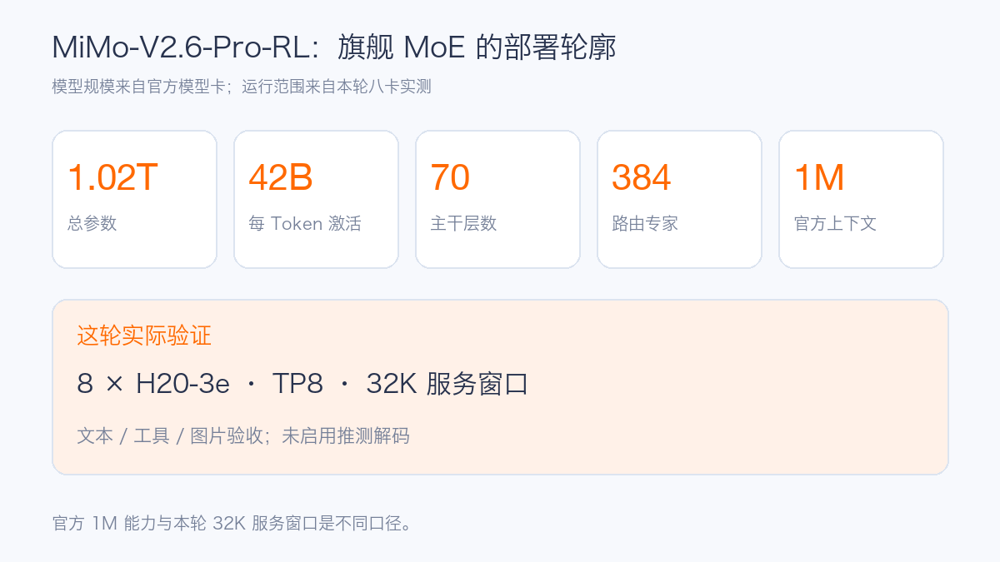
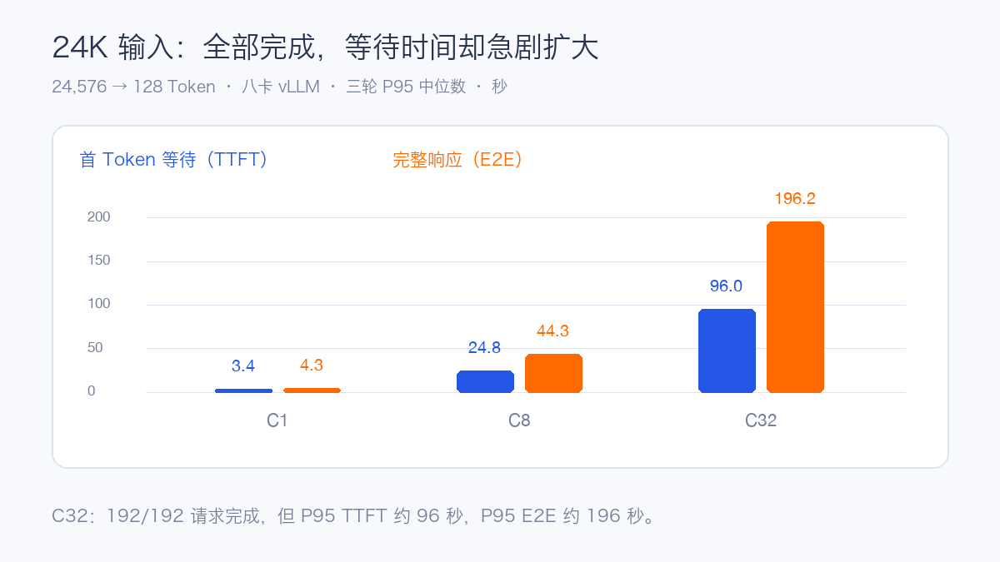
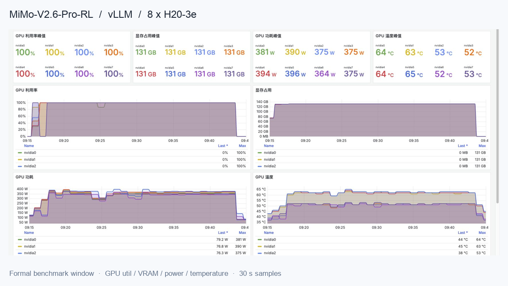

# MiMo-V2.6-Pro-RL 首测：八张 H20-3e 的 vLLM 实测

MiMo-V2.6-Pro-RL 是小米 MiMo-V2.6 系列的旗舰开放权重模型。官方模型卡给出约 **1.02T 总参数、42B 激活参数**，采用稀疏混合专家（MoE）架构，支持文本、图片、视频和音频输入，声明 1M Token 上下文，许可证为 MIT。MoE 每次只激活部分专家，但部署时仍要装载整套权重；显存、GPU 互联和专家计算都要纳入预算。

这次选择单节点 **8×H20-3e**，从共享存储加载权重，先检查模型回答、完整流、工具和图片，再用固定长度请求观察吞吐及延迟。服务上下文设置为 **32,768 Token**；官方的 1M 是模型能力，不等于本次服务已开放或测过 1M。

## 测试怎样做

vLLM 采用 TP8、关闭 Prefix Cache。每种请求分别以 C1、C8、C32 并发运行：先预热，再正式重复三轮。输入由固定英文技术文本重复构造，并按 Tokenizer 截取到目标长度；输出固定长度，温度为 0。它衡量的是这类合成负载下的推理容量，不能直接代表真实问题的回答质量。

| 场景 | 输入 / 输出 Token | 主要观察点 |
| --- | ---: | --- |
| 短请求 | 1,024 / 128 | 交互吞吐、首 Token 等待 |
| 长输入 | 8,192 / 128 | Prefill 和排队 |
| 长输出 | 1,024 / 512 | Decode 能力 |
| 长上下文 | 24,576 / 128 | 32K 服务窗口内的容量 |

有效请求必须返回非空内容、完整结束标记、usage 和目标输出长度。失败保留在原分母，表中数字取三轮正式结果的中位数。TTFT 是首个非空 Token 的等待时间；TPOT 是首 Token 后每个输出 Token 的平均时间。

## 八卡 vLLM：36 轮、1056 个请求

vLLM 完成 **36/36 轮正式压测，1056/1056 个请求成功**。算术、多轮记忆、流式结束、工具调用及结果回灌均通过；图片验证包含两张不同图片和交换顺序后的回答变化。

模型接入现有 OpenWebUI 后，从界面发起算术提问，返回了正确答案 45。这张实际对话截图也核对了前端到推理服务的调用链路。

性能部分先看短请求和长输出两组负载。并发增加时，吞吐与首 Token 等待会一起变化。

| 输入 / 输出 | 并发 | 输出 Token/s | P95 TTFT | P95 TPOT |
| --- | ---: | ---: | ---: | ---: |
| 1K / 128 | C1 | 111.08 | 0.200 s | 7.50 ms |
| 1K / 128 | C8 | 410.80 | 1.127 s | 17.93 ms |
| 1K / 128 | C32 | 584.54 | 4.201 s | 46.50 ms |
| 8K / 128 | C1 | 62.59 | 1.085 s | 7.56 ms |
| 8K / 128 | C8 | 100.39 | 8.469 s | 71.21 ms |
| 8K / 128 | C32 | 110.41 | 31.493 s | 264.59 ms |
| 1K / 512 | C1 | 126.80 | 0.199 s | 7.51 ms |
| 1K / 512 | C8 | 616.05 | 1.124 s | 12.59 ms |
| 1K / 512 | C32 | 1,056.94 | 4.194 s | 28.40 ms |

短请求从 C1 到 C32，输出吞吐增长约 **5.3 倍**，但 P95 TTFT 也从 **0.20 秒**增长到 **4.20 秒**。长输出 C32 超过 1000 Token/s；它的总吞吐高于短输出，与首 Token 成本被更长的生成过程分摊有关，不能只用总吞吐判断交互体验。

## 24K 输入的延迟边界

| 并发 | 完成 / 请求 | 输出 Token/s | P95 TTFT | P95 E2E |
| ---: | ---: | ---: | ---: | ---: |
| C1 | 24/24 | 29.46 | 3.351 s | 4.346 s |
| C8 | 48/48 | 36.35 | 24.772 s | 44.268 s |
| C32 | 192/192 | 37.94 | 95.952 s | 196.213 s |

24K 输入增加并发时，吞吐从 29.46 增至 37.94 Token/s，首 Token 等待却从约 3.4 秒增至约 96 秒。请求全部完成，并不意味着 C32 适合在线聊天或 Agent 交互。长文档请求需要独立的并发和排队预算。

## 资源曲线

正式测试时八张卡的利用率峰值均为 100%，显存占用峰值约 131 GB/卡；功耗峰值约 364–396 W，温度峰值约 52–65℃。图中是 30 秒采样的资源变化，适合核对负载阶段与显存是否稳定，不能直接当成精确能耗或 Kernel Profile。

## 部署时要关注什么

八卡 TP8 对 GPU 互联和通信更敏感。容器分到八张卡以后，还应确认拓扑、NCCL 路径和跨 GPU 通信；CPU Tokenize、视觉预处理及主机内存拷贝则要关注 NUMA 本地性。

容量规划应把请求长度分层。1K 对话、8K 检索增强和 24K 长文档的等待曲线差别很大，分别设置准入、排队和取消条件，再观察 TTFT、TPOT、E2E、GPU 利用率与显存。Prefix Cache、推测解码、更长服务上下文都需要单独压测，不能沿用这组关闭缓存的结果。

本轮图片链路已验证，视频与音频没有完整验收；其中本地模型副本尚缺完整音频 Tokenizer 与 DFlash 文件。模型卡支持的模态与本次可用的服务能力，应分开记录。

点击「阅读原文」可查看完整配置、每档 P95 E2E、测试方法和后续验证边界。

参考资料：[MiMo-V2.6-Pro-RL 官方模型卡](https://huggingface.co/XiaomiMiMo/MiMo-V2.6-Pro-RL)。
