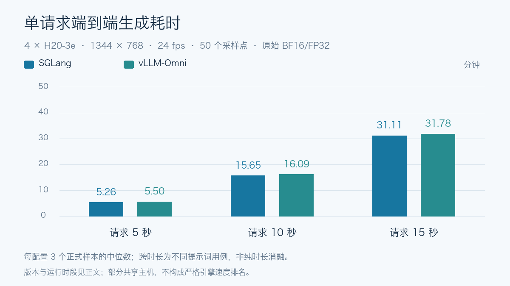
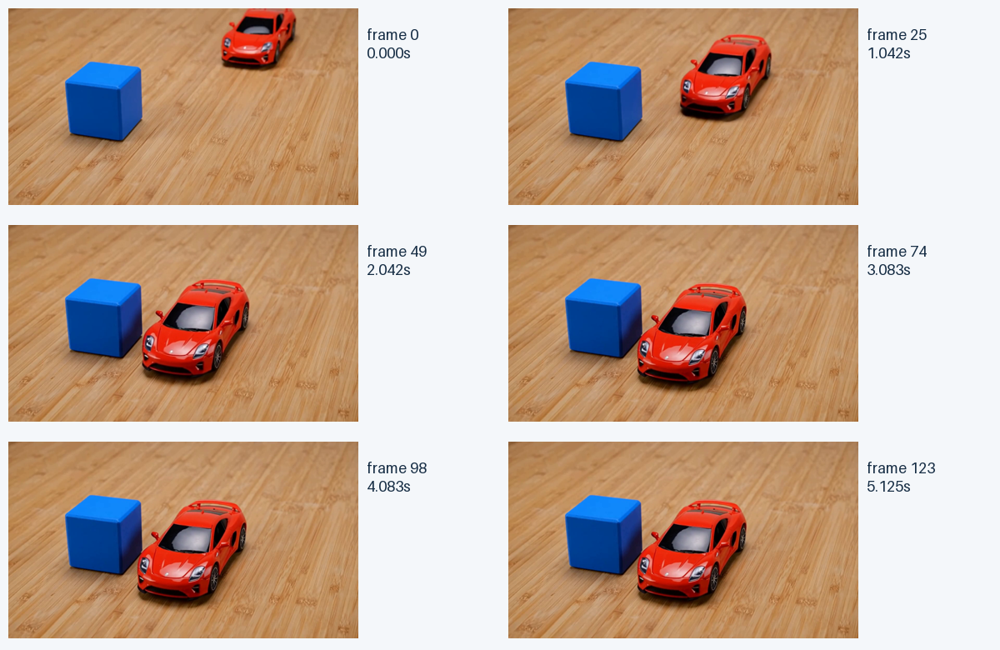
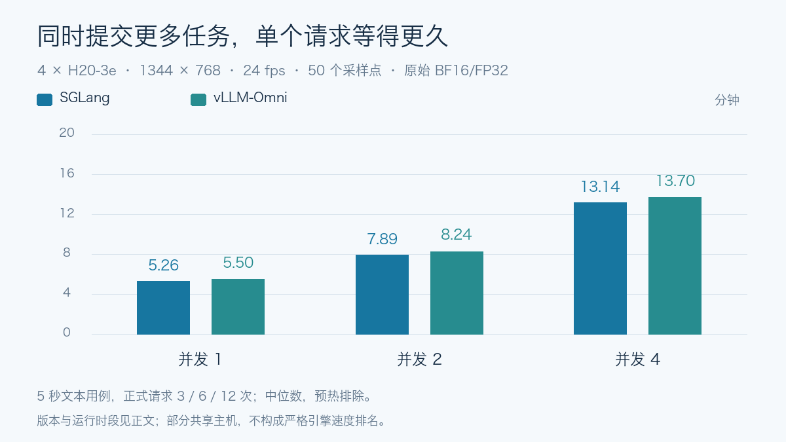
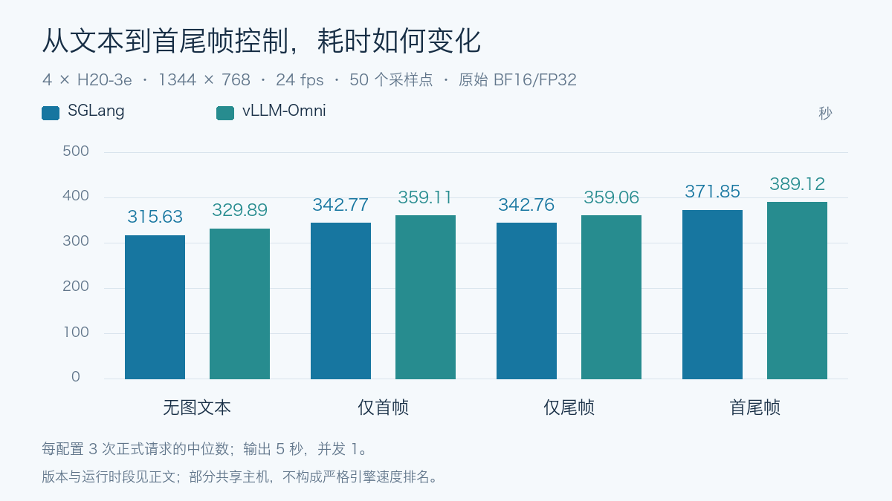
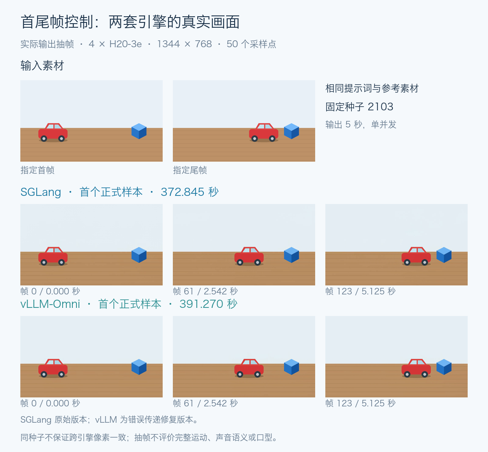
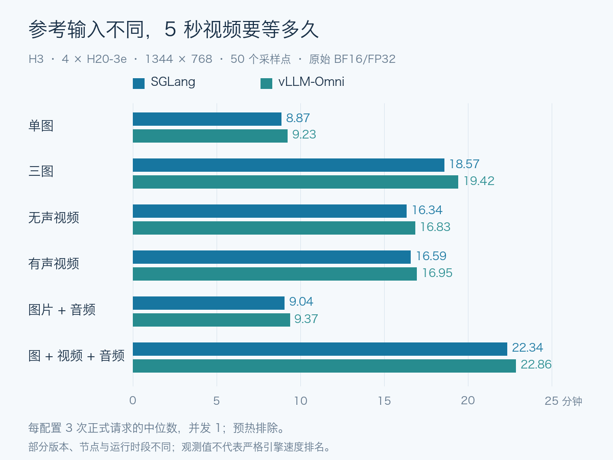
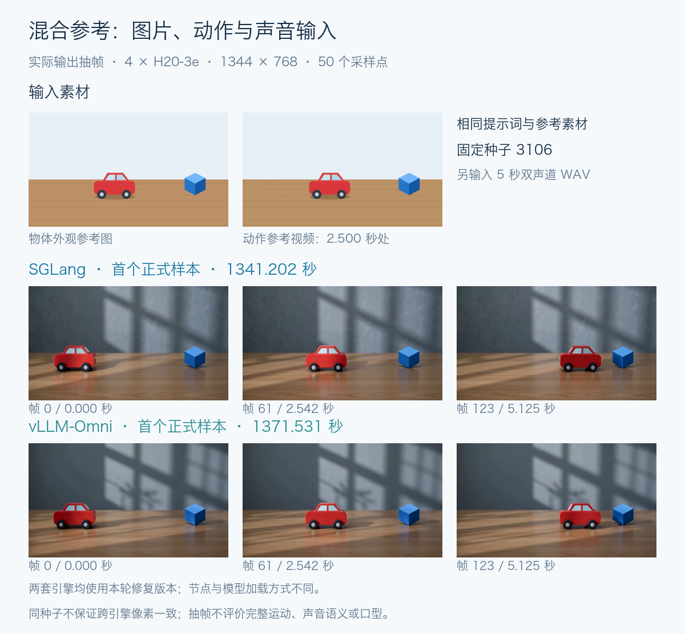

# 四张 H20-3e 跑 MiniMax H3：5 秒视频要多久？

MiniMax H3 是 MiniMax 面向多模态内容创作的音视频生成系统。它的生成主干 **H3-Omni-Transformer 是 33B 参数的稠密、单流 Transformer**，条件编码器 **H3-Encoder 基于 Qwen3-VL-32B**；输入可以是文字、图片、视频和音频，输出则同时包含画面与原生立体声。这里的 33B 是生成主干口径，编码器、视频 VAE 和音频 VAE 是另外的组件，不能把它当作整个系统的参数量或显存需求。

## H3 的特点：把画面和声音一起生成

H3 先把不同输入编码为模型能处理的潜在表示，再组织成统一的多模态序列，交给同一个生成主干联合预测视频和音频，最后分别解码成画面和立体声。因此，一段“小车驶过桌面”的描述，除了物体和运动，还能带上车轮声、环境声及其发生过程。声音内容和音画时序也就成为需要独立验收的部分。

33B 主干中约 13B 参数位于 AdaLN 调制分支，官方说明相关调制结果可以预计算，推理部署可不常驻这部分权重。这是模型结构上的优化空间，不代表整套 H3 只需加载其余约 20B 参数；具体运行时仍需处理条件编码器和音视频解码组件。

官方输出规格是 **4–15 秒、24 fps、32 kHz 双声道音频**，支持横屏、竖屏等多种画幅；H3-Base 以短边 768 像素为默认生成规格。它提供两套任务权重，分别回答不同的创作问题：

- **FL2VA：画面从哪里开始、在哪里结束。** 可以不传图片，直接用文字生成；也可以传一张首帧或尾帧，或同时传两张端点图片，让模型生成中间过程。
- **Ref2VA：参考哪些外观、动作和声音。** 可以组合图片、视频和音频作为条件，在新场景里引用已有素材。参考图提供线索，不等于把输入图作为固定首帧，也不自动保证人物身份或音色保真。

这两种任务需要加载各自的 checkpoint。前者适合文字生成和首尾画面控制，后者适合多素材条件生成；它们在输入编码、序列长度和实际等待时间上可能表现不同，所以本文把它们分开测试。

## 开源 H3-Base 与完整 H3 系统是什么关系

完整流程是 **H3-Context-IR → H3-Base → H3-Regenerate-2K**。Context-IR 先理解并整理多模态输入及素材关系，Base 生成 768p 音视频，Regenerate-2K 再结合生成结果和原始上下文重新生成 2K 输出。开源本地部署的核心是 H3-Base，两端的托管流程不能仅靠加载 Base 权重自动获得。

测试直接向本地 Base 提交固定提示词，没有调用托管上下文处理或 2K 再生成。下面衡量的是这条本地链路的功能、生成耗时和并发行为，不代表官方在线产品的完整效果与速度。模型结构和能力规格依据官方模型卡：https://huggingface.co/MiniMaxAI/MiniMax-H3

这套结构也决定了测试应覆盖条件编码、扩散生成、视频解码和音频解码，而不仅是成功返回一个文件。本文用四张 H20-3e，检查两套推理引擎能否跑通这些阶段，再看它们在不同输入和并发下的实际表现。

四张 H20-3e，生成一段约 5 秒的有声视频，文本基线要等 5 分多钟；换成图片、视频和音频混合参考，单次等待会超过 22 分钟。这是 MiniMax H3 完整权重、50 个采样点的一次实测。

这次用 SGLang Diffusion 和 vLLM-Omni 跑了同一套输入：文字、首尾帧、图片参考、视频参考，以及混合素材。测试覆盖每套引擎的 15 类配置，均有通过记录。最终汇总每个引擎选取 55 个有效正式样本，共 110 个；预热、旧版重复测试、被替换样本和失败诊断不计入这个数。

文章里的“通过”有明确含义：请求成功，视频完整解码，尺寸、帧数、音轨符合约定。人物像不像、台词对不对、口型是否同步，需要另外评估。

## 测的是哪一部分 H3

本轮测试开源 H3-Base 的 768p 本地生成链路，直接输入固定提示词，保留原始 BF16/FP32 混合精度。没有使用 Turbo、FastH3、量化权重或额外缓存加速。

两套引擎每次各用四张 NVIDIA H20-3e，单卡报告显存 143771 MiB。测试固定 1344 × 768、24 fps、50 个采样点。请求写 5 秒时，实际输出为 124 帧，视频时长约 5.17 秒；生成工作量要按实际帧数核对。

客户端从提交请求计时到完整视频下载结束，文件解码检查另计。每小时完成量则包含媒体检查时间。预热视频单独保存，不计入正式统计。

两套运行时也有配置差异：SGLang 使用 Ulysses 4、encoder parallel auto，并关闭 torch.compile；vLLM-Omni 使用 USP 4 / Ring 1、文本编码器 TP 4、VAE tile 并行 4，默认延迟启用 regional torch.compile。本文对比的是这些具体运行配置。

| 测试项 | 每引擎配置数 | 每引擎正式样本 |
| --- | ---: | ---: |
| 英文 5/10/15 秒、中文 5 秒 | 4 | 10 |
| 5 秒并发 2/4 | 2 | 18 |
| 首帧、尾帧、首尾帧 | 3 | 9 |
| 六类参考输入 | 6 | 18 |
| 合计 | 15 | 55 |

中文仅 1 次正式请求，其余单并发配置各 3 次；并发 2/4 各 3 批，分别为 6/12 个正式请求。小样本报告中位数与范围，不据此推断 P99。

## 测试实际使用了哪些 prompt

下面四条是实际提交的原始提示词，已与两套引擎的正式请求记录核对。它们均请求 5 秒、1344 × 768、50 个采样点；种子与参考素材另列，英文原文保留，不用翻译后的文字替代实际输入。

### 英文文本生成（`t2va-5s`）

无参考素材；种子 `1101`。对应 5 秒英文基线，并发 1/2/4 复用同一提示词。

> A small red toy car rolls across a wooden table and stops beside a blue cube. The wheels rattle softly, then the room becomes quiet.

### 中文文本生成（`t2va-zh-5s`）

无参考素材；种子 `1104`。对应中文场景测试，不是逐字对白或口型测试。

> 固定镜头，一辆红色玩具小汽车缓慢驶过木桌，停在蓝色方块旁。车轮发出轻微的咔嗒声，停下后房间恢复安静。保持小汽车外形一致，不切换镜头。

### 首尾帧控制（`fl2va-both`）

种子 `2103`；传入小车插画的首帧与尾帧，角色均为 `keyframe`，帧位置分别为 `0` 和 `-1`。对应首尾帧对照图。

> A red toy car rolls slowly to the right across the wooden table and stops beside the blue cube. Keep the camera fixed and the simple illustrated style. Soft wheel rattling, then silence.

### 图片、视频与音频混合参考（`ref2va-mixed`）

种子 `3106`；三份输入分别为红车参考图、5 秒无声动作视频、5 秒双声道 WAV，角色均为 `reference`。对应混合参考对照图。

> Use &lt;Picture 1&gt; as the subject, &lt;Video 1&gt; as the motion reference, and &lt;Audio 1&gt; as the sound reference. The red toy car rolls to the right across the wooden table with soft rhythmic tones.

混合参考里的 `<Picture 1>`、`<Video 1>`、`<Audio 1>` 分别指向请求中对应类型的第一份素材，不是本地文件路径；复现时需要同时提交图片、视频与音频，不能只复制这段文字。首尾帧同样需要配套图片。固定种子便于比较，但不保证跨引擎生成相同像素。

这些 prompt 同时包含主体、动作和声音要求；中文样例还明确了固定镜头。它们是测试输入，不是“所有要求都已满足”的声明，实际表现结合后面的抽帧与验收结果查看。

## 5 秒视频，要等 5 分多钟

先看文本生成。单位为秒，数值为有效正式请求的端到端中位数；英文各 3 次，中文 1 次。

| 文本任务 | SGLang（秒） | vLLM-Omni（秒） |
| --- | ---: | ---: |
| 英文 5 秒 | 315.631 | 329.892 |
| 英文 10 秒 | 938.854 | 965.606 |
| 英文 15 秒 | 1866.757 | 1907.032 |
| 中文 5 秒 | 315.632 | 329.992 |



这三个时长使用不同的场景提示词，不能当作只改变视频长度的严格实验。两套引擎的运行窗口也不同，部分时段同机共享 CPU、内存和存储，不据此给出无干扰的速度排名。

表中的 vLLM 单并发数据来自修复前版本：生成文件通过，随后发现异常请求返回码不正确。修复后的接口与相关生成复测在后文单独说明，没有把旧数字写成新版本重测值。

从本轮数值看，英文 5 秒的两引擎中位数相差 **14.26 秒**；10 秒与 15 秒用例分别相差 **26.75 秒、40.27 秒**。这些是观测差值，不是排除运行条件影响后的加速收益。

对每套引擎自身，10 秒用例耗时约为 5 秒用例的 **2.97 倍 / 2.93 倍**，15 秒用例约为 **5.91 倍 / 5.78 倍**，顺序均为 SGLang / vLLM。因为提示词不同，只能用于这组任务的预算参考。

5 秒样本实际视频长约 5.17 秒，RTF（生成等待时间 ÷ 实际视频长度）约为 **61.09 / 63.85**。按这个 5 秒用例折算，每 1 秒成片对应约 61–64 秒生成等待；更长或不同参考条件的任务需要重新估计。

英文 5 秒用例描述的是一辆红色玩具车驶向蓝色方块，然后停下。SGLang 的三个正式请求分别为 315.634、315.631、315.628 秒，均完整解码，带 H.264 视频和 AAC 双声道音轨。



抽帧可见小车逐渐靠近方块后停下。相同种子的预热与三个正式样本文件哈希一致，说明这个固定输入的重复生成一致；它不能替代多提示词、多种子质量评测。

中文场景提示词也生成成功，但抽帧中蓝色方块发生位移，“固定镜头”的要求没有完全满足。这类差异需要写进结果，不能被一个 PASS 标签盖过去。

## 并发四个请求，没有得到四倍吞吐

同样是 5 秒文本用例，先看请求中位数。每个引擎并发 1/2/4 分别有 3/6/12 个正式请求：

| 并发 | SGLang（秒） | vLLM-Omni（秒） |
| --- | ---: | ---: |
| 1 | 315.631 | 329.892 |
| 2 | 473.624 | 494.276 |
| 4 | 788.422 | 822.192 |



再看包含客户端媒体验收的完成量：

| 并发 | SGLang（视频/小时） | vLLM（视频/小时） |
| --- | ---: | ---: |
| 1 | 11.394 | 10.905 |
| 2 | 11.397 | 10.972 |
| 4 | 11.413 | 11.000 |

并发从 1 增加到 4，中位等待分别变为原来的 **2.50 倍、2.49 倍**，完成量只增加约 **0.16%、0.87%**。两者均没有获得对应倍数的吞吐提升。


图表中 SGLang 为原始版本；vLLM 并发 1 为原始版本，2/4 为修复复测值。各自都有三个正式批次，预热排除。共享主机负载和版本条件不完全一致，上述百分比只是这组实测值的变化。

中位数还会隐藏同一批请求先后完成的差异。并发 4 时，SGLang 正式请求范围为 **315.84–1261.57 秒**，vLLM 为 **332.31–1309.16 秒**；本组最慢请求分别等待约 **21 分 2 秒、21 分 49 秒**。这不是 P99，而是 12 个正式样本中的最大值。

对服务容量规划而言，这意味着同时接收四个任务，不等于能同时以单请求速度完成四段视频。还需要考虑队列长度、任务预计耗时和结果查询方式。

## 加入首帧和尾帧，要多等多少

四组都使用 FL2VA 分区，输出 5 秒、并发 1，每个配置各 3 次正式请求。无图文本基线与三种端点条件的中位数如下：

| 输入条件 | SGLang（秒） | vLLM-Omni（秒） |
| --- | ---: | ---: |
| 无图文本 | 315.631 | 329.892 |
| 仅首帧 | 342.766 | 359.106 |
| 仅尾帧 | 342.764 | 359.061 |
| 首帧 + 尾帧 | 371.847 | 389.115 |



SGLang 首帧用例比无图文本基线多 **27.14 秒（8.6%）**，首尾双帧多 **56.22 秒（17.8%）**。

vLLM-Omni 首帧用例比无图文本基线多 **29.21 秒（8.9%）**，首尾双帧多 **59.22 秒（18.0%）**。

SGLang 这些配置为原始版本；vLLM 无图基线为原始版本，三种端点条件采用修复后复测值。条件与提示词也有差别，因此百分比是具体用例差异，不是首帧编码模块的独立开销。

SGLang 三组各抽查首个正式样本：受约束端点与输入物体位置一致，四个端点的 RGB 像素平均绝对误差为 3.16–3.55（0–255 标度）。这是特定玩具图片的文件级对照，不是人物保真率，也不能外推到任意人像。



这张图使用两套引擎各自的首个正式样本，输入图片、提示词、种子均相同。两边都保留了红车、蓝方块和插画外观；中间同一时刻的小车位置有差别，首尾画面接近指定端点。图中标注的是这一次请求的耗时，不是前表的三次中位数。

## 参考素材越复杂，等待也可能越长

参考输入使用仓库脚本生成的图片、视频和 WAV，内容固定，不包含外部人物或私人素材。两套引擎的六类参考配置各完成 3 次正式生成，下面都是生成约 5 秒视频的中位数：

| 参考输入 | SGLang（秒） | vLLM-Omni（秒） |
| --- | ---: | ---: |
| 单张图片 | 532.166 | 553.630 |
| 三张图片 | 1114.354 | 1164.995 |
| 无声视频 | 980.119 | 1009.945 |
| 有声视频 | 995.101 | 1016.897 |
| 图片 + 音频 | 542.437 | 562.071 |
| 图 + 视频 + 音频 | 1340.278 | 1371.531 |



SGLang 含音频的后三类使用修复版本。vLLM 六类均使用修复版本，其中单图与后五类的测试节点、模型加载方式不同；这些差值不能全部归因于引擎。

用每个引擎自身的单图参考作基准，可以看见工作量的差别：

- SGLang：三图约为单图的 **2.09 倍**，混合参考约为 **2.52 倍**；图片加音频比单图多 **10.27 秒**。
- vLLM-Omni：三图约为单图的 **2.10 倍**，混合参考约为 **2.48 倍**；图片加音频比单图多 **8.44 秒**。

这些比例包括输入内容、素材关系、版本与运行时段的差别，vLLM 还包含前述节点迁移。它们适合估算具体工作负载，不是同机、同版本只改变参考数量的消融实验。

按包含媒体检查的批次完成量，SGLang 单图约 **6.76 个/小时**，三图 **3.23 个/小时**，混合参考 **2.68 个/小时**；vLLM 对应约 **6.50、3.09、2.62 个/小时**。和文本 5 秒基线的约 11 个/小时相比，不能给所有视频任务使用同一个队列容量估计。

这组结果更适合回答“我的任务大概要等多久”。它还不能回答“上传真人照片后，有多大概率保持同一张脸”，因为本轮没有建立真人身份保真评测集。



混合参考使用同一张红车图片、同一段动作视频和同一段音频，种子固定为 3106。抽帧可见两边都生成了向右移动的小车，并把原来的平面背景重组为带窗影的桌面场景；车体比例、构图和中间位置仍有差异。Ref2VA 提供参考线索，并不要求逐像素复制素材。

上面是各取一个正式样本的画面观察，不构成统计质量排名；三张抽帧不能证明完整运动流畅、参考声音复现或音画同步。这些与前面的文件解码通过分别评价。

## 跑完生成，还要查错误和恢复

测试中遇到了两个仅看服务启动状态发现不了的问题。

**第一个是 SGLang 的参考音频编码。** 无声参考视频可以完成，有声视频却在编码阶段报 `Forward context is not set`。固定版本缺少注意力层要求的前向上下文。补丁在音频编码时设置并恢复上下文后，有声视频、图片加音频、混合参考三组各完成 3 次正式生成。

**第二个是 vLLM-Omni 的错误状态码。** 用户提交超出范围的时长，模型校验原本产生带 400 状态码的错误，但跨进程传递时只留下错误文字，最终变成了 500。修复让客户端错误信息跨进程保留，内部错误仍按服务端错误处理。

修复后，超长时长、空提示词、损坏图片、分区不匹配或缺少参考条件四类请求均返回 400；随后有效生成恢复通过。并发 2/4 和首帧、尾帧、首尾帧五类配置又完成 27 个正式样本。

本文区分原始版本和修复版本，两项补丁与对应源码哈希见复现材料，修复后的结果不作为未修改上游的表现。


SGLang 的测试页面实际生成过视频，浏览器播放到结尾，并点击下载；下载文件与服务端原件哈希一致。页面显示的约 415 秒包含排队，不进入前面的性能主表。该截图来自专用测试页面。

## 想用自己的真实照片生成 AI 视频，怎么开始

先确定你希望照片起什么作用。

**让照片里的画面动起来：用首帧。** 把本人或明确获授权的照片作为视频开头，再写一个小动作。可以从清晰的单人半身照、5 秒固定镜头开始：

> 照片中的人物保持原有服装和发型，面向镜头，自然眨眼一次，随后轻微微笑。保持背景和光照稳定，连续单镜头。人物不说话，只有轻微室内环境声。

先查看整段视频里的脸型、眼睛、牙齿和发际线，再逐步增加转头、手部动作和对白。提交一次照片只是为这次推理提供条件，不会因此训练出永久记住该人物的专属模型。

**保留人物外观、换一个场景：尝试 Ref2VA。** 图片作为参考，文字另写书房、街道等新场景。参考图提供外观线索，可能重新取景；它和约束开头画面的首帧不是一回事。增加同一人物的其他角度可以单独比较效果，多图不自动等于更准确。

**脸、声音、口型要分开检查。** 人脸照片不包含本人的真实声音。即使模型能接收参考音频，也不能据此保证逐字台词、声线复刻和口型同步。公开作品注明 AI 生成，并确认照片及声音素材的授权范围。

本文使用玩具和场景素材测试链路，上面是待独立验收的人像使用流程。公开技术稿还提供了首帧请求模板、Ref2VA 参数修改方法和常见问题排查。

如果想做短剧，可以先拆成多个短镜头：统一角色参考，每个镜头安排少量动作，逐段生成、复核，再加入配音、字幕和剪辑。原生音轨、后期旁白、额外口型同步分别记录。整片工期还包括重试和剪辑，不能只把单镜头耗时乘以镜头数。

## 四卡部署建议：先看连接，再看利用率

H3 的四卡配置需要多卡协同处理编码、扩散和解码。申请到四张 GPU 之后，还应确认它们如何互联，以及 CPU、内存与 GPU 的距离。GPU 利用率高，并不说明通信和数据搬运没有瓶颈。

**先核对真正分配给容器的四张卡。** 本轮初始节点的已分配四卡两两显示 `NV18`，表示存在由 18 条 NVLink 构成的连接；这是拓扑信息，不是实测通信带宽。部署时用 GPU UUID 对照容器与宿主机分配结果，检查 NVLink/P2P 路径，不能仅凭“同一台机器”或编号相邻推断连接相同。NVIDIA 文档：https://docs.nvidia.com/deploy/nvidia-smi/index.html

**再看 NUMA 亲和性。** CPU 线程、主机内存页和 GPU 分布在不同 NUMA 域时，部分内存访问或 CPU–GPU 数据搬运可能跨插槽，带来额外延迟和带宽竞争。需要对照 GPU 的 CPU/NUMA affinity、容器允许使用的 CPU 和内存节点，检查编码、数据准备与通信线程的放置。

可以先在实际推理容器中检查：

```bash
# GPU 连接，以及 CPU/NUMA affinity
nvidia-smi topo -m

# 对照实际 GPU UUID 与型号
nvidia-smi --query-gpu=uuid,name --format=csv

# 容器实际允许使用的 CPU 与内存节点
cat /proc/self/status
# 重点查看 Cpus_allowed_list、Mems_allowed_list
```

不要把整个四卡进程直接绑到 NUMA 0。若四卡本身跨 NUMA，单边绑核、绑内存可能让另一侧 GPU 更远。应结合每个 rank 的 GPU、CPU 线程和内存分配做亲和性安排；GPU 之间走 NVLink，也不意味着主机侧 NUMA 的影响自动消失。

在 Kubernetes 中，`nvidia.com/gpu: 4` 只表达资源数量，不能单独保证四卡与 CPU、内存的亲和性。需要设备插件提供拓扑信息，并结合 Topology Manager、CPU Manager 和相应内存策略配置。`single-numa-node` 要求资源能在单一 NUMA 节点内对齐；硬件无法满足时可能拒绝接纳，不能为了四卡 Pod 不加判断地开启。官方说明：https://kubernetes.io/docs/tasks/administer-cluster/topology-manager/

上线前建议分两步验收：

1. **检查通信路径。** 在相同四卡、相同容器限制下运行 NCCL 测试，覆盖推理拓扑实际使用的通信类型和代表性数据量；查看 NVLink/P2P 是否可用、是否存在意外回退，并记录带宽与耗时。只跑一次小数据量 all-reduce 不足以说明所有生成阶段的通信表现。
2. **复测真实生成。** 固定模型、提示词、精度、种子、并发与 GPU 分配，再比较调整前后的端到端耗时和吞吐。NUMA 亲和性、CPU 线程数等一次只调整一项，避免将编译预热或同机负载变化误认为优化收益。

NCCL 的容器共享内存、P2P 和系统设置排查可参考：https://docs.nvidia.com/deeplearning/nccl/user-guide/docs/troubleshooting.html

本轮没有完成“同 NUMA 对跨 NUMA”的控制变量实验，因此不报告跨 NUMA 会慢多少或绑核能快多少。上面是四卡服务部署时的检查方法，性能收益要由目标节点上的同条件复测确认。

完整技术文档、逐样本数据与完整测试用例将收录在“阅读原文”页面：

https://aik8s.run/ai-k8s/practices/minimax-h3-h20-benchmark/

参考资料与复现入口：

- MiniMax H3 官方模型：https://huggingface.co/MiniMaxAI/MiniMax-H3
- SGLang H3 Cookbook：https://docs.sglang.io/cookbook/diffusion/MiniMax/MiniMax-H3
- vLLM H3 Recipe：https://recipes.vllm.ai/MiniMaxAI/MiniMax-H3
- SGLang 同类问题记录：https://github.com/sgl-project/sglang/issues/35447
- 测试脚本与技术文档仓库：https://github.com/runzhliu/aik8s
