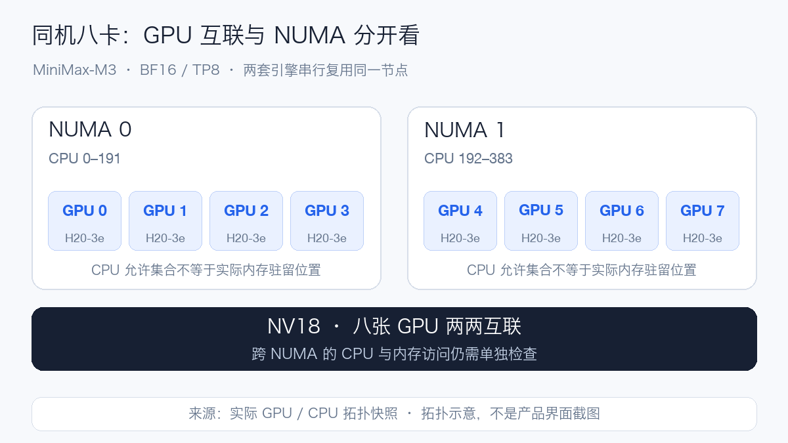
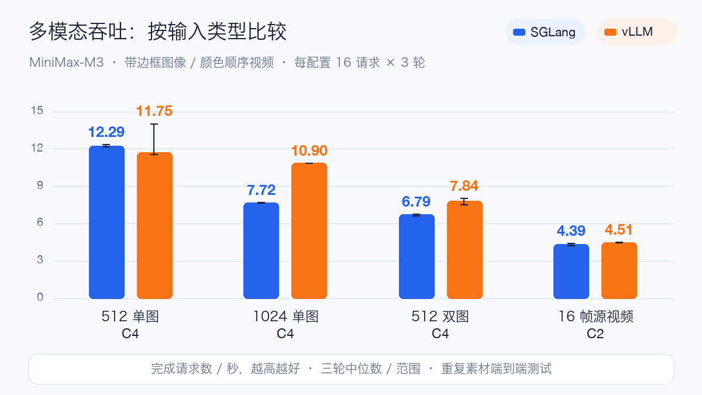

# 八张 H20-3e 跑 MiniMax-M3：双引擎实测与部署取舍

MiniMax-M3 是 MiniMax 的原生多模态 MoE 模型，面向代码、工具调用和长流程 Agent。官方模型卡给出约 **428B 总参数、23B 激活参数**，支持文本、图像、视频输入与文本输出，声明 1M Token 上下文；开放权重采用 MiniMax Community License。模型规格依据[官方模型卡](https://huggingface.co/MiniMaxAI/MiniMax-M3)。

MoE 在每个 Token 的计算中激活部分专家，但完整部署仍要容纳全部权重。本次固定版本有 59 个 Safetensors 文件，共 854.18 GB，完整 SHA256 校验通过。部署预算还须覆盖视觉编码器、KV 与稀疏索引缓存、工作区和 CUDA Graph。

M3 在训练中联合处理文字、图片与视频。部署到对话服务后，可以读取截图和图表、理解视频内容，再输出文字或工具调用。本次分别验证图片数值读取、视频颜色顺序、函数调用与代码执行，避免只凭普通聊天成功就推断多模态与 Agent 链路可用。

M3 使用 MiniMax Sparse Attention（MSA）改善长上下文效率。稀疏注意力减少参与注意力计算的范围，但服务仍须管理长请求的缓存、索引和调度。模型声明的 1M 能力、引擎允许的参数与实际通过测试的长度分别记录；本文以 32K 服务窗口进行同机对照。

三种推理模式则决定一次真实对话的生成过程：`enabled` 始终启用推理，`adaptive` 由模型决定何时增加推理，`disabled` 关闭推理。这些模式会改变生成 Token 数和等待时间，因此固定输出长度压测与真实对话验收分别统计。规格及模式定义见[官方说明](https://huggingface.co/MiniMaxAI/MiniMax-M3)。

## 如何做同机对照

两套引擎串行复用同一台 8×H20-3e，单卡报告 143771 MiB。固定模型 Revision 为 `f0e1c1e04d40177e4673a22097036854f536e9c0`，BF16 TP8，32K 上下文，最大运行请求 32，内存比例 0.85，Prefix Cache 关闭，未启用 MTP/投机解码。两套模型容器均申请 64 CPU、768Gi 主机内存，上限为 128 CPU、1536Gi；同一 CPU 压测客户端申请 4 CPU、8Gi，上限为 8 CPU、16Gi。

SGLang 为 `0.0.0.dev1+g56e290315`，关闭 prefill 分段 CUDA Graph，保留普通解码图；vLLM 为 `0.1.dev17492+g454b47db8`，实际使用该版本的 breakable CUDA Graph 路径。两者均为 Torch 2.11.0+cu130、NCCL 2.28.9；Transformers 分别为 5.8.1 和 5.11.0。这是具体配置的对照，未声称默认配置完全相同。

主矩阵通过同一 CPU 客户端向 `/v1/completions` 提交固定输入/输出长度，使用一致 Tokenizer、Case、随机种子。每引擎 11 个 Case×3 轮，共 **66 轮、7908 个正式请求**；逐轮检查完成数、错误数、输入 Token 和强制输出 Token 数。预热、功能检查、早期 8K Smoke 与失败尝试均不计入主矩阵。

## 短请求、长输入，分别看什么

短请求看并发提高后输出吞吐的变化；长输入更关注首 Token 等待。以下图表均来自完整主矩阵，使用三轮中位数和范围。

单并发 128/64 请求中，SGLang 输出吞吐为 114.7 tok/s，vLLM 为 116.6 tok/s；并发 32 时分别为 1112.0 和 1089.4 tok/s。

长输出 128/1024、单并发时，每轮平均 TPOT 的三轮中位数分别为 6.86 ms 与 7.00 ms。完整逐项延迟、三轮范围和请求数列在公开文档中。

短请求从 C1 提高到 C32，SGLang 的吞吐提高到单并发的 9.69 倍，vLLM 的吞吐提高到单并发的 9.35 倍。这是相同短请求形状的并发扩展结果，不能替代长上下文容量测量。

16K 输入、256 输出从 C4 提高到 C8 时，SGLang 吞吐变化 +9.6%，P95 首 Token 等待变为 1.99 倍；vLLM 吞吐变化 +12.2%，P95 首 Token 等待变为 1.94 倍。因此，交互式 RAG 应先确定首 Token 等待目标，再选择并发，吞吐增加并不自动意味着用户体验改善。

整次请求的 tok/s 还受输出长度影响。单并发时，可近似理解为「输出长度 ÷（首 Token 等待 + 后续 Token 数 × TPOT）」。长输出会分摊首 Token 等待，因此比较解码速度时要同时查看 TPOT，不能只比较整次请求的平均 tok/s。

## 图片、视频与工具调用是否可用

主矩阵阶段的 30 秒遥测采样中，SGLang / vLLM 单卡最大显存分别为 121.05 / 117.78 GiB。采样区间包含 Case 预热与客户端启动，离散采样值不等于连续峰值或精确能耗。

| 阶段 | SGLang | vLLM |
| --- | --- | --- |
| 12 项基础功能 | 12/12 PASS | 12/12 PASS |
| 原始纯色图像与视频 | 6/6 正式轮通过；6 配置预热失败 | 6/6 正式轮通过；6 配置预热失败 |
| 带边框图像与视频并发 | 24/24 PASS | 24/24 PASS |
| 原始工具、代码、检索及错误恢复 | 14/28 PASS | 16/28 PASS |
| 显式字段提取 Prompt 检索复测 | 10/10 PASS | 10/10 PASS |

两套引擎的原始测试中，纯红/纯蓝图片均出现颜色误判，各有六个静态图像配置在预热阶段停止；图表 OCR 与视频颜色顺序可以通过。vLLM 排查期间检查 PNG 像素和图像预处理张量，没有发现输入变成黑图的证据。加入边框与标记、改问主体颜色后另开测试，两套引擎各完成 24 轮、384 请求且回答通过；不把它称为修复了模型，也不据此认定根因位于模型或引擎。

两套引擎均未找出原始长文本检索的九个密钥；vLLM 诊断中，该 Prompt 的失败在短文本中也能复现。复测保留正文、密钥和插入位置，只把指令改为 `<document>…</document>` 中的显式字段提取，两套各通过九个含答案样例与一个无答案对照。两组结果分别列出，说明任务对提示词敏感；不能把原始失败直接归结为不支持 32K，也不能用复测覆盖失败记录。

损坏图片和损坏视频的错误处理存在差异：vLLM 返回预期的 HTTP 400；SGLang 返回 HTTP 500，两项判为失败。日志显示 PIL 图片识别错误和 TorchCodec 无效输入错误被包装为 RuntimeError，最终进入服务端内部错误响应。随后正常请求恢复检查通过，未观察到进程退出；这不等于错误码正确。该固定版本的问题尚未修复，接入时应校验媒体输入并区分客户端数据错误与服务端故障，不能把所有 500 简单改写为 400。

下表采用带边框图像，指标为每秒完成请求数的三轮中位数；每轮 16 请求。逐项端到端延迟与输出 Token 数在公开文档中列出。

| 输入 / 并发 | SGLang req/s | vLLM req/s |
| --- | ---: | ---: |
| 512 单图 / C1 | 6.44 | 8.52 |
| 512 单图 / C4 | 12.29 | 11.75 |
| 1024 单图 / C1 | 5.75 | 7.97 |
| 1024 单图 / C4 | 7.72 | 10.90 |
| 512 双图 / C1 | 4.14 | 5.16 |
| 512 双图 / C4 | 6.79 | 7.84 |
| 16 帧源视频 / C1 | 3.11 | 3.27 |
| 16 帧源视频 / C2 | 4.39 | 4.51 |

多模态是重复素材下的端到端测试，输出长度和预处理路径分别记录；16 帧源视频不意味着两套引擎实际采样和视觉 Token 完全相同。

vLLM 另保留了一段已提前结束的低负载观察：实际请求观察跨度 30.07 分钟，共 903 请求、0 失败；单请求 E2E 中位数 120.8 ms。负载约 0.5 req/s，80% 文本、20% 重复图片，最多四个客户端 Worker。这是该时段的观察记录，不是一小时稳定性通过证明，不与 SGLang 做横向对比，也不代表峰值容量。 该时段另有 60 次 GPU 采样，八张卡的首尾显存读数分别保持一致；这只描述观察窗口，不推断长期无泄漏。

## 同一问题的推理模式对照

同一道问题、每模式重复三个实际请求，正确答案为 240。时间是该模式全部请求 E2E 的中位数，错误答案也计入时间，包含首用影响。这不是三个独立题目的准确率测试，也不属于固定长度主压测；不能用它推断一般准确率或生产尾延迟。逐项 completion_tokens 采用 API 返回口径，见功能数据。实际提示词：`一个仓库有240件货物，先发走15%，又入库36件，现在有多少件？只输出最终整数，不要解释。`

| 推理模式 | SGLang 正确次数 | vLLM 正确次数 | SGLang E2E 秒 | vLLM E2E 秒 |
| --- | ---: | ---: | ---: | ---: |
| disabled | 0/3 | 0/3 | 0.132 | 0.117 |
| adaptive | 3/3 | 3/3 | 0.373 | 0.361 |
| enabled | 3/3 | 3/3 | 0.587 | 0.578 |

## 测试实际用了哪些 Prompt

实际提交的部分 Prompt 如下；验收使用温度 0，以减少重复测试的随机性，真实对话使用 `chat_template_kwargs.thinking_mode` 指定模式。官方模型卡推荐通用采样 temperature=1.0、top_p=0.95，本次验收没有采用该采样设置，结果不外推为官方推荐采样下的准确率。

- 数学：`一个仓库有 240 件货物，先发走 15%，又入库 36 件，现在有多少件？只给结论并简要说明。`
- 图表：`读出图中 Q1、Q2、Q3 的数值，指出哪个季度比上季度下降。`
- 视频：`按出现顺序列出视频中背景的三种颜色。`
- 并行工具：`请在本轮同时调用 get_weather 查询广州和北京的天气，不要猜测结果。`
- 代码：`编写Python函数unique_sorted(values)，输入整数列表，返回升序去重后的新列表，不修改原列表。只给一个函数的代码，不要导入模块，不要解释。`

图表标准答案为 Q1=120、Q2=90、Q3=150，Q2 下降；视频颜色顺序为红、绿、蓝。工具使用本地模拟返回值，不执行真实业务操作。代码先经过 AST 限制，再在无凭据、限制 CPU/内存的独立解释器中验收。

图表与视频测试素材、原始回答及失败样例可在「阅读原文」对应的公开文档中查看。

## 部署中遇到的问题

镜像构建成功后仍要检查依赖与真实入口。本次修复了 NIXL/Pillow、PyGObject/PyAV 等问题，并用实际 GPU、视频解码与模型请求逐级验收。曾经出现“pip check 通过、模块入口却缺失”的失败尝试，说明只看一个绿色检查不够。

SGLang 首次启动还遇到加载和图初始化预算不匹配：约 24 分 42 秒读取权重后，解码图成功，但还要初始化 42 档 prefill 分段图。调整启动预算并关闭这部分图后完成验收；保留解码图，对应配置写入性能结果。缓存状态不同的重启耗时不用于推导冷启动加速比。

## 最后的部署建议

1. **按完整八卡互联域分配 TP8。** 本机 GPU 两两显示 NV18，不能仅检查“分到了八张卡”。驱动、链路、拓扑和 NCCL 正确性要在实际容器里验证。
2. **把 GPU 互联与 NUMA 本地性分开检查。** 本机 GPU 0–3 与 4–7 对应不同 NUMA 域。实际快照中，SGLang 四个 Worker 允许 CPU `0-191`，另四个允许 `192-383`；vLLM 八个 TP Worker 均允许 `0-383`，两边允许内存节点均为 `0-1`。本次没有手动统一两套引擎的 CPU 绑定，这也是配置差异。允许集合不等于实际内存驻留位置，但说明 GPU 的 NV18 互联不能替代 CPU 与主机内存本地性检查。CPU 预处理、主机内存和 Host-to-Device 拷贝应单独检查，再做单变量绑定实验，不直接宣称绑核一定加速。
3. **先确定上下文，再测并发。** 这里是 BF16 TP8、32K、最大运行请求 32。SGLang 初始化报告可管理 410,862 Token，vLLM 报告 KV 容量 328,576 Token；两者缓存实现不同，不能只靠容量数字预测速度。vLLM 对每条完整 32K 请求的理论并发估算约 10，这不等于保证十条任意多模态请求都通过。最大运行请求设为 32，也不代表 32 条请求都能同时占满 32K。权重加载成功不代表任意长输入都能同时处理；更长窗口、不同 KV 精度和多机部署需要独立验收。
4. **启动探针覆盖加载与图初始化。** 本次把启动预算设为 60 分钟，并保留运行总期限。SGLang 关闭 prefill 分段图而保留解码图；vLLM 按该固定版本的 breakable graph 路径运行。不要把不同图配置的结果解释为所有版本的引擎差异。
5. **按业务 SLO 选择配置。** 固定长度吞吐、真实 Agent 推理和多模态预处理的瓶颈不同。结合首 Token 延迟、后续 Token 延迟、错误率和显存余量判断，不能只挑最高 tok/s。

本轮结论限定在单机 BF16 TP8、32K 服务窗口。1M 上下文、跨节点、固定到达率 SLO 扫描与优化实验需要另行测量。点击「阅读原文」，可查看完整数据、启动参数与修复记录。
