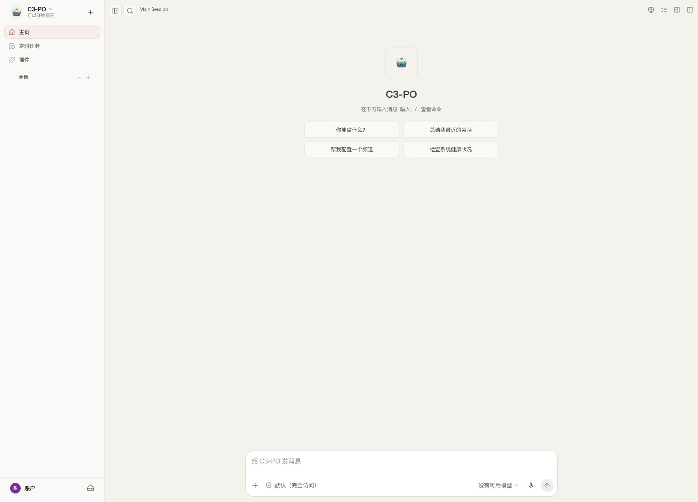
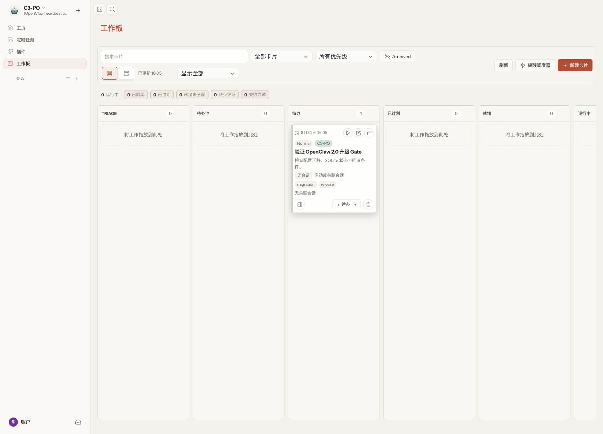

# OpenClaw 2.0 实测：它已经不只是一个聊天 Gateway

2026 年 8 月 31 日，OpenClaw 发布了 **2026.8.1**。官方把这一代产品称为 **OpenClaw 2.0**，但 npm 包版本仍然使用日期版本号，并不存在一个 `2.0.0`。

过去我们更容易把 OpenClaw 理解成一个长期在线的个人 Agent：接入聊天渠道、维护会话、调用模型和工具，再由 Gateway 把这些能力串起来。

到了 2.0，这个描述已经不太完整了。

它开始同时管理人、设备、云端 Worker、自动化任务、Workboard、审批、Secret 和共享会话，更像一个 **Agent 协调平面**。

为了看看它到底只是“功能列表变长”，还是架构真的发生了变化，我在隔离目录里同时安装了：

- OpenClaw 2026.7.1，作为 1.x 基线；
- OpenClaw 2026.8.1，也就是官方所说的 2.0。

两边分别启动 Gateway，打开 Control UI，再跑 CLI、Doctor、Workboard、无头 Agent 和迁移演练。

> 一句话结论：OpenClaw 2.0 值得新部署直接采用，也值得 1.x 用户升级；但它应该被当成一次状态与运行时架构迁移，而不是一次普通的 npm 更新。

## 先看几个实测数字

这组数字来自同一台机器上的隔离安装和空载 Gateway，只用于比较两代产品的基础开销，不代表生产负载。


- 安装目录：2026.7.1 为 **391.9 MiB**，2026.8.1 为 **896.5 MiB**，增加约 **128.8%**；
- 文件数量：32,030 增加到 35,902，增加约 **12.1%**；
- CLI 热启动中位数：46.9ms 对 44.4ms，基本持平；
- 空载 Gateway RSS 中位数：38.3 MiB 对 53.9 MiB，增加约 **40.7%**；
- 默认加载插件：9 个增加到 14 个，启用 Workboard 后是 15 个。

最值得注意的不是 CLI 变慢——它并没有明显变慢——而是包体和常驻能力显著增加。

2.0 把更多控制面、状态管理、多端接入和协作能力直接带进了发行包。对于个人机器，这部分增长通常可以接受；对于大规模常驻实例或资源限制严格的环境，升级前应该重新测量基线。

## Control UI：从会话入口变成操作中心

先看 2026.7.1。


1.x 的界面重心非常明确：Agent、会话、Channel、Plugin 和 Gateway。它更像一个围绕聊天与会话组织的管理入口。

再看 2026.8.1。



2.0 首页开始直接暴露 Automations、Plugins、权限状态和更多操作入口。应用页还列出了 iPhone、Android、Apple Watch、Wear OS、macOS、Windows 和 Linux。

这不是简单多了几个菜单。它意味着 OpenClaw 不再默认“所有请求都来自一个聊天窗口”，而是开始考虑：

- 人和 Agent 如何共同进入一段会话；
- 手机、桌面端和可穿戴设备如何接入；
- 云端 Worker 如何接管任务；
- 自动化如何绑定到会话；
- 敏感操作如何询问、批准和恢复。

## Workboard：代码在包里，但默认没有打开

Workboard 是我最想实际点一下的功能之一。

它不是发布说明里的一张概念图。我在临时状态目录里启用插件后，创建了一张“验证 OpenClaw 2.0 升级 Gate”的卡片，并填写配置迁移、SQLite 和回滚条件。



卡片创建后立即进入“待办”列，可以设置优先级、Agent、会话、标签和状态。

这让 OpenClaw 多了一种新的工作方式：任务不必只存在于聊天记录中，也可以成为一个能被人和 Agent 共同查看、分派和推进的结构化对象。

但这里也有一个上线时很容易忽略的细节：**Workboard 插件默认关闭。**

所以“发行包里包含 Workboard”不等于“升级后立即可用”。生产环境还要验证 capability consent、SQLite、调度器、会话关联和备份恢复。

## 无头 Agent：终于可以稳定进入脚本和流水线

2026.8.1 新增了：

```text
openclaw agent exec
```

它支持指定工作目录、模型、Fallback、状态目录、配置和 JSON 输出。相比让自动化脚本去模拟一次聊天，这个入口更适合 CI、Cron、外部编排器和运维流程。

为了只验证 OpenClaw 自己的运行链路，我在本机启动了一个最小 OpenAI 兼容模拟服务，然后让 `agent exec` 返回固定字符串。

结果如下：

```text
exit code: 0
elapsed: 3.81s
assistant turns: 1
final: OPENCLAW_HEADLESS_OK
```

这个测试不评价模型质量，只证明了 **命令入口 → Provider → Agent → 结构化 JSON 输出** 的链路可以跑通。

2026.7.1 没有对应的 `agent exec` 子命令。对于想把 OpenClaw 接进已有自动化平台的人，这是一项比 UI 菜单更重要的变化。

## 架构上到底变了什么

我把两代产品的主要关系重新画成了下面这张图。


在 1.x 中，最自然的主链路是：

```text
用户 / Channel
      ↓
Gateway
      ↓
Agent Session
      ↓
Model / Tool / Plugin
```

在 2.0 中，入口和状态都变得更多：

```text
人 / App / 设备 / Worker / Automation
                 ↓
        Permission / Admission
                 ↓
Conversation / Workboard / Question / Progress
                 ↓
      Session / SQLite / Recovery
                 ↓
        Model / Tool / Plugin
```

因此我更愿意把 2.0 理解成一次“协调平面化”：

- **入口平面**：聊天、移动端、桌面端、设备和云 Worker；
- **协作平面**：共享会话、Workboard、结构化问题和进度卡；
- **执行平面**：Agent、Provider、Tool、Plugin 和无头执行；
- **状态平面**：SQLite、会话搜索、恢复、备份和审计；
- **治理平面**：Secret、审批、权限、来源与能力授权。

这套结构比“多了一个看板”影响更深，因为它改变了升级时必须一起考虑的状态和边界。

## Doctor 变强了，但不能只看退出码

我在同一环境里分别执行 Doctor lint。

2026.7.1：

- 24 个检查；
- 36 个 Finding，其中 35 个来自缺少依赖的 Skill；
- 耗时约 5.66 秒；
- 退出码为 1。

2026.8.1：

- 30 个检查；
- 2 个 Finding；
- 耗时约 2.72 秒；
- lint 退出码为 1。

2.0 的检查覆盖面更大，同时会把大量不适用项归入 skipped，输出更聚焦。

但我还发现一个自动化陷阱：执行裸命令 `openclaw doctor --json` 时，JSON 里明明是 `ok: false`、仍有 2 个 Finding，进程退出码却是 0。

所以如果把 Doctor 接到升级流水线，不能只写：

```text
命令返回 0 → 允许升级
```

还必须解析 JSON 中的 `ok`、`findings` 和检查结果。

## 真正值得警惕的是 doctor --fix

我创建了一份能够被 2026.7.1 验证通过的合成配置，再使用 2026.8.1 执行：

```text
openclaw doctor --fix --non-interactive --yes
```

它做的事情远不止“把旧字段名换成新字段名”：

- `agents.list` 改成 `agents.entries`；
- `openai-codex/*` 和 `codex/*` 模型路由改成 `openai/*`；
- 为模型写入 Runtime intent；
- 默认并发写成 8；
- 增加 Subagent 并发、归档和 Compaction 配置；
- 把共享状态继续迁入 SQLite；
- 根据当前环境批量禁用 35 个缺少依赖的 Skill；
- 创建配置备份并写入迁移元数据。

整个过程大约花了 12.74 秒，迁移后的配置可以通过 2026.8.1 校验。

但结论也很明确：**doctor --fix 是环境相关的广泛改写，不是一次无副作用的 Schema Bump。**

## 七类迁移风险，必须写进变更单


### 1. 配置 diff 会比预期更大

字段迁移之外，Doctor 还可能补并发、Compaction、Skill 开关和 Wizard 元数据。GitOps 环境会出现大面积 diff，默认并发变化也可能改变成本和请求峰值。

### 2. 模型路由不是简单改名

`codex/*`、`openai-codex/*` 会迁移到 `openai/*`，同时增加模型级 Runtime intent。必须重新验证默认模型、Agent 覆盖、Fallback、认证和计费路径。

### 3. SQLite 让“只回滚二进制”失效

2.0 继续把共享状态、会话、Cron、审计和设备身份迁入 SQLite。升级后才产生的新会话，不会因为换回旧版本就自动出现在旧存储中。

只回滚 npm 包或镜像，不能算完整回滚。

### 4. 绝对 workspace 路径会越出 state-dir

这是本次迁移演练真实踩到的一项。

即使把 `OPENCLAW_STATE_DIR` 指向临时目录，只要旧配置中的 workspace 是绝对路径，`doctor --fix` 仍可能访问并迁移那个真实 workspace 中的 `TOOLS.md` 或 `AGENTS.md`。

所以复制生产配置做演练时，必须先重写所有 workspace、session、plugin 和 credential 绝对路径。不能把“临时 state-dir”等同于完整隔离。

### 5. Provider、Plugin SDK 和能力授权同时变化

多个官方 Provider 被移动到独立包；插件开始强调来源、能力和 provenance；旧 Plugin SDK 导入路径进入退役窗口。

OpenProse 和 `/prose` 也已经移除，需要改成 Agent Skill。

### 6. 默认并发与常驻资源增长

空载 RSS 在这次测试中增加约 40.7%，默认并发会按 CPU 规模落在 8～16。大机器上的默认值未必等于业务需要的值，升级后应重新设置容量边界。

### 7. Doctor 会按当前机器禁用 Skill

在一台缺少外部依赖的演练机上执行 `doctor --fix`，可能把生产实际需要的 Skill 写成 disabled。

迁移结果不能直接从演练机覆盖生产配置，必须审核 Skill diff。

## 我建议这样升级

如果已经在生产使用 1.x，不要直接在原目录执行修复。

### 第一步：冻结和备份

同时备份：

```text
OpenClaw 二进制或镜像
+ openclaw.json
+ SQLite 与 legacy state
+ Session / Cron
+ Workspace / Plugin
+ 凭据存储位置
```

### 第二步：复制到隔离环境

复制状态后，先重写所有绝对路径，再运行：

```text
openclaw doctor --lint --json
openclaw doctor --fix --non-interactive --yes
openclaw config validate --json
```

审核配置 diff、Skill 状态、SQLite 迁移和自动备份。

### 第三步：做 Canary Gate

至少确认：

- 默认模型和显式覆盖模型都能响应；
- 旧会话、Cron 和自动化没有缺失或重复；
- Plugin 与 Provider 已完成 capability consent；
- SQLite 校验和备份恢复通过；
- 关键 Skill 没有被意外禁用；
- Gateway、设备和 Worker 连接正常；
- 并发、成本和 Session Reset 行为符合预期。

### 第四步：准备完整回滚包

回滚时必须一起恢复旧二进制、旧配置、升级前 SQLite、Legacy State 和 Workspace/Plugin 状态。

如果出现会话缺失、Cron 重复、模型路由变化、插件未授权或 SQLite 校验失败，应停止扩大流量，而不是只换回旧包继续复用已经迁移的状态。

## 到底要不要升级

如果是新部署，或者确实需要多端应用、Workboard、云 Worker、共享会话和无头 Agent，我会直接从 2.0 开始。

如果已有大量 Session、Cron、Channel、自定义 Skill 和 Plugin，应该先完成一次全状态 Canary。

如果当前无法复制生产状态、没有 SQLite 级备份恢复能力，或者自定义插件还没有完成 SDK 迁移，那就等后续补丁版本。

OpenClaw 2.0 的方向很清晰：它正在从“一个能接渠道、调用工具的聊天 Agent”，变成“人、设备、Worker 和自动化共同操作的 Agent 协调平面”。

这次升级最重要的动作也因此不是：

```text
npm install
```

而是建立一条：

```text
可复制 → 可 diff → 可验证 → 可完整回滚
```

的迁移链路。

完整测试方法、逐项数据、架构细节和全部 Light 模式实操图，请点击文末“阅读原文”。

公开版全文：

https://aik8s.run/ai-k8s/rag-agent/openclaw-2-real-world-review/

参考资料：

- OpenClaw 2026.8.1 Release：https://github.com/openclaw/openclaw/releases/tag/v2026.8.1
- OpenClaw Releases：https://docs.openclaw.ai/releases/2026.8.1
- Doctor CLI：https://docs.openclaw.ai/cli/doctor
- Agent Exec：https://docs.openclaw.ai/cli/agent#agent-exec
- Model Providers：https://docs.openclaw.ai/concepts/model-providers
- Plugin SDK Migration：https://docs.openclaw.ai/plugins/sdk-migration
- Gateway Security：https://docs.openclaw.ai/gateway/security/
- Backup CLI：https://docs.openclaw.ai/cli/backup
