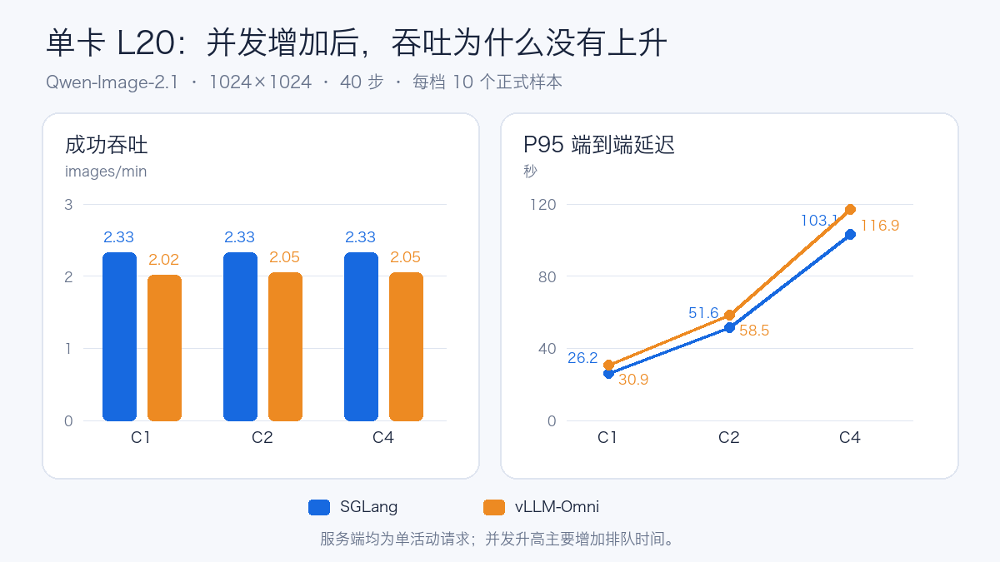
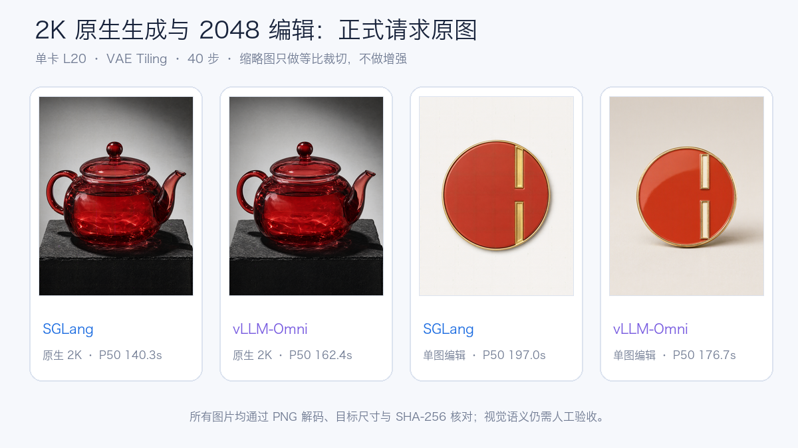
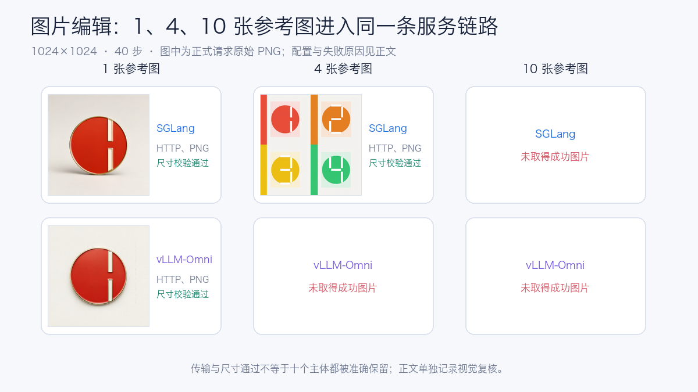
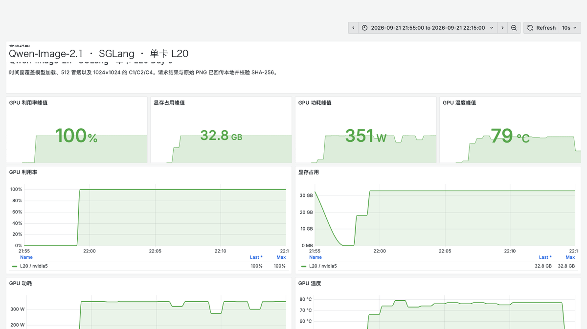
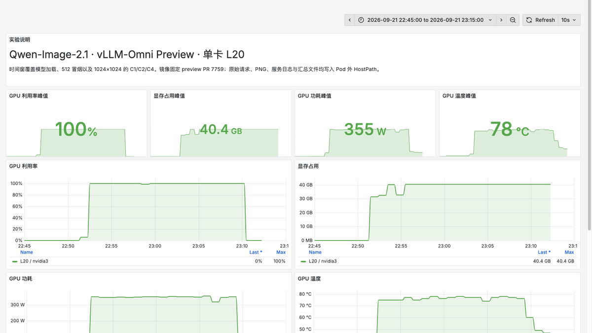

# 单卡 L20 跑 Qwen-Image-2.1：SGLang 与 vLLM-Omni 实测

Qwen-Image-2.1 是 Qwen 家族的统一图像生成与编辑模型。官方模型卡给出的视觉生成组件规模为 **7B 参数、32 层 Single-Stream DiT**，支持文本生成图片、图片编辑和原生 RGBA 透明图；最多可以使用 10 张参考图，并通过圈选、涂抹或蒙版完成局部编辑。

7B 并不等于十几 GB 显存就能稳定提供服务。文本编码器、DiT、VAE、Attention 工作区、CUDA Graph 和输出分辨率都会占用显存。这次把完整 BF16 模型部署在单张 **NVIDIA L20 48 GB** 上，分别测试 SGLang Diffusion 和 vLLM-Omni。

测试先解决三个问题：生成结果是否可用，单张图片要等多久，客户端并发提高后能否增加吞吐。1024 基线结束后，又继续测试七种官方 2K 原生画幅、图片编辑、1/4/10 张参考图和 2048 编辑，并比较 Runtime 默认配置与 VAE Tiling。

Qwen-Image-2.1 当前采用 Qwen Research License。本文是研究测试和工程验证；商业部署仍需单独确认授权。

## 先看实际生成结果

正式测试使用 5 类 Prompt：写实街景、中文排版、英文排版、产品摄影和透明素材。每个请求都保留原始 JSON、HTTP 响应、PNG 和 SHA-256。


两套引擎都生成了可解码的 1024×1024 PNG。指定的中文“让想象发生”和英文 `CREATE WITHOUT LIMITS` 在这组样例中完整可读；透明素材输出为 RGBA，Alpha 极值为 0～255，背景中确实包含透明像素。

同一个 Seed 跨引擎不保证逐像素一致。下面把同一组 Prompt 和 Seed 放在一起，主要比较构图、文字、产品质感和透明边缘。


## 测试配置与数据口径

每个服务进程使用一张同型号 GPU，读取同一份只读模型文件。1024 基线每档预热 2 次，再正式生成 10 张；扩展矩阵每档预热 1 次，再执行 3 个正式请求。失败请求保留在原分母，不用补跑结果覆盖。

| 项目 | 配置 |
| --- | --- |
| 模型 | Qwen-Image-2.1，BF16 |
| GPU | 单张 NVIDIA L20，48 GB |
| 引擎 | SGLang Diffusion；vLLM-Omni Preview |
| 分辨率 | 1024 基线；七种官方 2K 画幅；2048 编辑 |
| 推理步数 | 40 |
| 客户端并发 | C1 / C2 / C4 |
| 每档样本 | 基线 2+10；扩展矩阵 1+3 |
| 输出 | Base64 PNG，RGB/RGBA 解码校验 |

扩展矩阵使用的 Prompt 也随结果公开。例如原生画幅统一使用产品摄影描述：

`A premium editorial photograph of a translucent crimson glass teapot on a black stone pedestal, dramatic studio lighting, fine caustics, crisp details, clean composition adapted to the requested aspect ratio`

4 张参考图编辑要求模型按顺序排成 2×2 商品目录，并保留每张卡片的数字和颜色；10 张测试则明确要求两行展示、不能遗漏或重复。参考图在最终部署包中逐文件校验 SHA-256，避免压测程序读取到另一份本地文件。

SGLang 使用单请求动态批处理上限，vLLM-Omni 使用 `--max-num-seqs 1`。C2 和 C4 因此描述多个客户端请求在单活动请求服务前排队的情况，不是服务端把多张图片合并计算。

SGLang 使用速度模式和 FlashAttention 后端：

```bash
sglang serve \
  --model-path /models/Qwen-Image-2.1 \
  --model-id Qwen-Image-2.1 \
  --num-gpus 1 \
  --performance-mode speed \
  --attention-backend fa \
  --port 30000 \
  --enable-metrics
```

vLLM-Omni 使用 Preview PR 7759，运行时为 vLLM `0.29.0b1` 与 vLLM-Omni `0.16.0.dev0+pr7759`：

```bash
vllm serve /models/Qwen-Image-2.1 \
  --omni \
  --port 30000 \
  --max-num-seqs 1
```

## 单张大约 26 秒，并发主要增加排队

| 引擎 | 并发 | 成功 | 吞吐 | P50 E2E | P95 E2E |
| --- | ---: | ---: | ---: | ---: | ---: |
| SGLang | 1 | 10/10 | 2.326 img/min | 25.70 s | 26.20 s |
| SGLang | 2 | 10/10 | 2.331 img/min | 51.48 s | 51.59 s |
| SGLang | 4 | 10/10 | 2.329 img/min | 102.99 s | 103.13 s |
| vLLM-Omni | 1 | 10/10 | 2.016 img/min | 29.25 s | 30.86 s |
| vLLM-Omni | 2 | 10/10 | 2.054 img/min | 58.34 s | 58.55 s |
| vLLM-Omni | 4 | 10/10 | 2.055 img/min | 116.79 s | 116.92 s |



当前配置下，SGLang C1 吞吐比 vLLM-Omni Preview 高 **15.4%**；C2 和 C4 分别高 13.5% 和 13.4%。这个差距只适用于当前版本、1024×1024、40 步和单活动请求配置。

更明显的是并发曲线。SGLang 从 C1 到 C4 一直约为 2.33 img/min，vLLM-Omni 约为 2.02～2.05 img/min；P95 延迟却大致随并发倍增。GPU 在串行完成图片，更多客户端请求只是在队列中等待。

vLLM-Omni 可以继续测试 `--max-num-seqs N` 请求级批处理，以及实验阶段的 `--step-execution`。这两种方式都可能提高吞吐，但需要重新测量显存、失败率、P95 和图片质量。

## 七种原生 2K 画幅都跑完了吗

同一张 L20 上，Runtime 默认配置与 VAE Tiling 的结果差异很明显：

| 输出尺寸 | SGLang 默认 | SGLang Tiling | vLLM 默认 | vLLM Tiling |
| --- | ---: | ---: | ---: | ---: |
| 2048×2048 | 140.0 s | 140.3 s | FAIL 0/3 | 162.4 s |
| 2400×1792 | FAIL 0/3 | 146.0 s | FAIL 0/3 | 169.1 s |
| 1792×2400 | FAIL 0/3 | 145.9 s | FAIL 0/3 | 169.1 s |
| 2528×1696 | 143.8 s | 144.1 s | FAIL 0/3 | 167.0 s |
| 1696×2528 | 143.7 s | 144.1 s | FAIL 0/3 | 166.9 s |
| 2752×1536 | 140.5 s | 140.7 s | FAIL 0/3 | 163.3 s |
| 1536×2752 | 140.4 s | 140.7 s | FAIL 0/3 | 163.3 s |

SGLang 默认配置完成了 5/7 个画幅；vLLM-Omni Preview 默认配置七档都在解码阶段显存不足。开启 Tiling 后，两套引擎都达到 **7/7、每档 3/3 成功**。

七档平均 P50 分别为 SGLang **143.1 秒**、vLLM-Omni **165.9 秒**。SGLang 已经能够通过的五档，打开 Tiling 只增加约 0.2～0.4 秒。对单卡 L20 来说，Tiling 更像应该默认验收的稳定性参数。



## 图片编辑：1 张、4 张、10 张参考图

官方模型卡给出的能力上限是 10 张参考图，但模型能力、服务接口和单卡显存并不是一回事。因此测试按 1、4、10 张逐级增加：1 张验证基本编辑链路，4 张验证多图排列与语义保留，10 张验证官方上限能否穿过当前 Runtime 的接口和显存边界。这个实验要回答的是“部署后真正能接收多少张”，而不只是模型文件本身支持多少张。

| 引擎与配置 | 1 图 1024 | 4 图 1024 | 10 图 1024 | 1 图 2048 |
| --- | ---: | ---: | ---: | ---: |
| SGLang 默认 | 30.33 s | 44.49 s | OOM | 2/3 · 196.42 s |
| SGLang Tiling | 未重复 | 未重复 | OOM | 3/3 · 196.97 s |
| vLLM 默认 | OOM | OOM | 最多 4 图 | OOM |
| vLLM Tiling | 34.39 s | OOM | 最多 4 图 | 3/3 · 176.67 s |



SGLang 的 10 图请求进入了去噪阶段，随后尝试额外分配 322 MiB 时 OOM。vLLM-Omni 的 10 图请求则在接口层直接返回 HTTP 400，当前 Preview 实现最多接收 4 张输入图。官方模型能力上限是 10 张，服务引擎、接口实现和单卡显存仍会形成更窄的工程边界。

4 图样例保留了四种颜色与 1～4 的排列；单图样例里的数字被处理成偏图形化的竖条。HTTP 成功、PNG 可解码和尺寸正确，只能证明链路通过，不能替代视觉语义验收。

## 运行时资源记录






## 消费级显卡能不能跑

消费级显卡部署也要区分“能加载”“能生成一张”和“能连续运行”。48 GB 显存可以直接运行完整 BF16 Pipeline；32 GB 消费卡更可能需要 VAE Tiling、组件卸载或量化；24 GB 及以下通常还要更激进的 CPU Offload。这是根据 L20 实测峰值做出的容量判断，不是消费卡性能实测。

Hugging Face 上已经出现多种社区量化，但 Qwen 官方仓库当前仍是 BF16。几条路线的差别很大：

| 路线 | 已公开信息 | 更适合谁 |
| --- | --- | --- |
| ComfyUI INT8 / W4A8 | Comfy-Org 提供量化 Transformer 和文本编码器 | 16～32 GB NVIDIA 卡优先验证 |
| GGUF Q3～Q8 | Transformer 文件约 3.19～7.59 GB，仍需额外编码器和 VAE | 接受组件 Offload 的个人工作站 |
| W4A4 NVFP4 | 社区作者报告常驻约 21.53 GB，RTX 5090 生成 1024×1024、40 步约 7.65 秒 | RTX 50 系 Blackwell |
| MLX 4-bit | 10.7 GB 的 Text-to-Image Pack | Apple Silicon 早期试验 |

这里最容易踩的坑，是把量化权重文件大小当成整条 Pipeline 的显存。Qwen3-VL 文本编码器、VAE、Attention 工作区和解码峰值仍然存在；一些版本还依赖尚未发布的分支或专用 Kernel。消费级显卡部署要连同 Runtime、组件精度和编辑能力一起选。


RTX 5090 有 32 GB GDDR7，仍低于本文部分 BF16 配置的 L20 峰值。W4A4 的社区数据说明它有机会把运行集压进显存，却不能把社区量化的速度和质量当成官方结论。除了显存，还要准备足够的系统内存和高速 NVMe。个人创作更适合从 Diffusers 或 ComfyUI 入手；需要局域网 API、批量队列和统一监控时，再增加服务层。

## 部署建议

1. **先验证图片，再调吞吐。** 固定 Prompt 检查文字、透明 PNG、尺寸和失败响应，然后再放大服务端 Batch。
2. **控制队列深度。** 根据服务端真实并行能力设置在途请求上限，避免排队时间掩盖单图延迟。
3. **逐级验证分辨率。** 从 1024 提升到 1536、2048 时，重新记录显存峰值、单图延迟和 OOM 边界。
4. **保存原始证据。** PNG、请求参数、原始响应和 SHA-256 分开保留，排查质量或协议问题时才能回到同一请求。
5. **固定版本。** 固定模型 Revision、镜像 Digest、Runtime 和生成参数；升级 SGLang、vLLM-Omni、Diffusers、Torch 或驱动后重跑基线。

完整启动参数、脱敏 CSV、汇总 JSON 和大图可通过文末「阅读原文」查看。

## 参考资料

Qwen-Image-2.1 模型卡：https://huggingface.co/Qwen/Qwen-Image-2.1

SGLang Diffusion：https://github.com/sgl-project/sglang/blob/main/docs/docs/sglang-diffusion/index.mdx

vLLM-Omni Execution Modes：https://docs.vllm.ai/projects/vllm-omni/en/latest/user_guide/diffusion/execution_modes/

ComfyUI 量化仓库：https://huggingface.co/Comfy-Org/Qwen-Image-2.1

GGUF 社区仓库：https://huggingface.co/Abiray/Qwen-Image-2.1-GGUF

W4A4 NVFP4 社区仓库：https://huggingface.co/ModelsLab/Qwen-Image-2.1-W4A4-nvfp4
