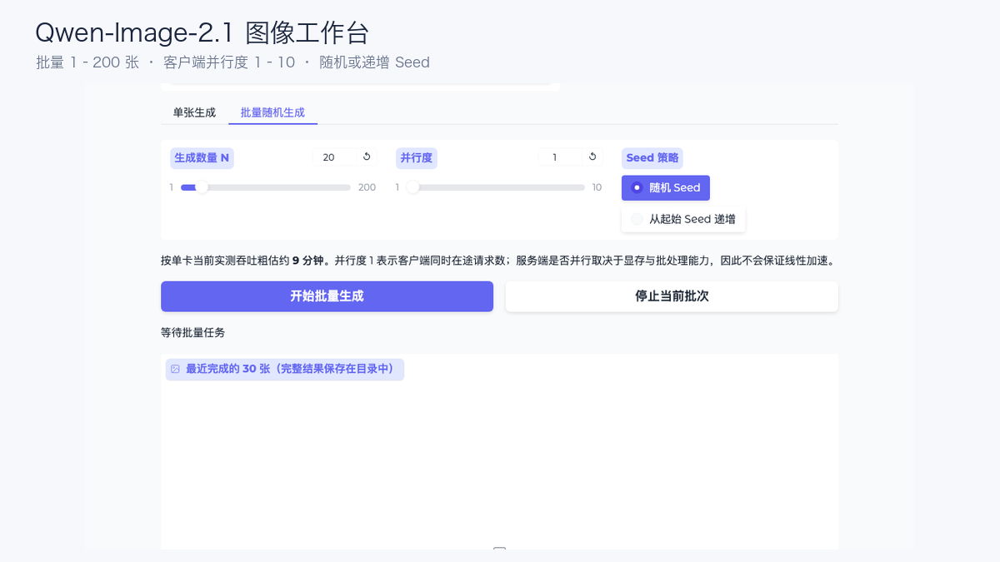

# 单卡 L20 跑 Qwen-Image-2.1：SGLang 与 vLLM-Omni 实测

Qwen-Image-2.1 是 Qwen 家族的统一图像生成与编辑模型。官方模型卡给出的视觉生成组件规模为 **7B 参数、32 层 Single-Stream DiT**，支持文本生成图片、图片编辑和原生 RGBA 透明图；最多可以使用 10 张参考图，并通过圈选、涂抹或蒙版完成局部编辑。

7B 并不等于十几 GB 显存就能稳定提供服务。文本编码器、DiT、VAE、Attention 工作区、CUDA Graph 和输出分辨率都会占用显存。这次把完整 BF16 模型部署在单张 **NVIDIA L20 48 GB** 上，分别测试 SGLang Diffusion 和 vLLM-Omni。

测试先解决三个问题：生成结果是否可用，单张图片要等多久，客户端并发提高后能否增加吞吐。

## 先看实际生成结果

正式测试使用 5 类 Prompt：写实街景、中文排版、英文排版、产品摄影和透明素材。每个请求都保留原始 JSON、HTTP 响应、PNG 和 SHA-256。


两套引擎都生成了可解码的 1024×1024 PNG。指定的中文“让想象发生”和英文 `CREATE WITHOUT LIMITS` 在这组样例中完整可读；透明素材输出为 RGBA，Alpha 极值为 0～255，背景中确实包含透明像素。

同一个 Seed 跨引擎不保证逐像素一致。下面把同一组 Prompt 和 Seed 放在一起，主要比较构图、文字、产品质感和透明边缘。


## 测试配置与数据口径

两个引擎串行使用同型号 GPU，读取同一份只读模型文件。每个性能档先预热 2 次，再正式生成 10 张；失败请求保留在原分母，不用补跑结果覆盖。

| 项目 | 配置 |
| --- | --- |
| 模型 | Qwen-Image-2.1，BF16 |
| GPU | 单张 NVIDIA L20，48 GB |
| 引擎 | SGLang Diffusion；vLLM-Omni Preview |
| 分辨率 | 1024×1024 |
| 推理步数 | 40 |
| 客户端并发 | C1 / C2 / C4 |
| 每档样本 | 2 次预热 + 10 个正式请求 |
| 输出 | Base64 PNG，RGB/RGBA 解码校验 |

SGLang 使用单请求动态批处理上限，vLLM-Omni 使用 `--max-num-seqs 1`。C2 和 C4 因此描述多个客户端请求在单活动请求服务前排队的情况，不是服务端把多张图片合并计算。

SGLang 使用速度模式和 FlashAttention 后端：

```bash
sglang serve \
  --model-path /models/Qwen-Image-2.1 \
  --model-id Qwen-Image-2.1 \
  --num-gpus 1 \
  --performance-mode speed \
  --attention-backend fa \
  --port 30000 \
  --enable-metrics
```

vLLM-Omni 使用 Preview PR 7759，运行时为 vLLM `0.29.0b1` 与 vLLM-Omni `0.16.0.dev0+pr7759`：

```bash
vllm serve /models/Qwen-Image-2.1 \
  --omni \
  --port 30000 \
  --max-num-seqs 1
```

## 单张大约 26 秒，并发主要增加排队

| 引擎 | 并发 | 成功 | 吞吐 | P50 E2E | P95 E2E |
| --- | ---: | ---: | ---: | ---: | ---: |
| SGLang | 1 | 10/10 | 2.326 img/min | 25.70 s | 26.20 s |
| SGLang | 2 | 10/10 | 2.331 img/min | 51.48 s | 51.59 s |
| SGLang | 4 | 10/10 | 2.329 img/min | 102.99 s | 103.13 s |
| vLLM-Omni | 1 | 10/10 | 2.016 img/min | 29.25 s | 30.86 s |
| vLLM-Omni | 2 | 10/10 | 2.054 img/min | 58.34 s | 58.55 s |
| vLLM-Omni | 4 | 10/10 | 2.055 img/min | 116.79 s | 116.92 s |


当前配置下，SGLang C1 吞吐比 vLLM-Omni Preview 高 **15.4%**；C2 和 C4 分别高 13.5% 和 13.4%。这个差距只适用于当前版本、1024×1024、40 步和单活动请求配置。

更明显的是并发曲线。SGLang 从 C1 到 C4 一直约为 2.33 img/min，vLLM-Omni 约为 2.02～2.05 img/min；P95 延迟却大致随并发倍增。GPU 在串行完成图片，更多客户端请求只是在队列中等待。

vLLM-Omni 可以继续测试 `--max-num-seqs N` 请求级批处理，以及实验阶段的 `--step-execution`。这两种方式都可能提高吞吐，但需要重新测量显存、失败率、P95 和图片质量。

## Grafana 里，单张 L20 已经吃满

SGLang 场次 GPU 利用率峰值为 100%，显存峰值 32.8 GB，功耗峰值 351 W，温度峰值 79℃。


vLLM-Omni 同样达到 100% GPU 利用率，显存峰值为 40.4 GB、功耗峰值 355 W、温度峰值 78℃。当前 Preview Runtime 比 SGLang 多占约 **7.6 GB** 显存。


| 资源峰值 | SGLang | vLLM-Omni |
| --- | ---: | ---: |
| GPU 利用率 | 100% | 100% |
| 显存 | 32.8 GB | 40.4 GB |
| 功耗 | 351 W | 355 W |
| 温度 | 79℃ | 78℃ |

Grafana 的完整窗口包含加载、预热、正式请求和结束阶段。这里用峰值做容量保护，不把离散采样当成逐请求能耗。

## 批量生成 100、200 张怎么做

测试之外还做了一套 Gradio 图像工作台。它支持单张生成，也可以一次提交 1～200 张；客户端并行度可设为 1～10，Seed 可以随机，也可以从指定值递增。



每张图片都会保存请求、每次尝试的原始响应、结果 JSON、PNG 和 SHA-256。结果写到 Pod 外的持久位置，再同步回使用者机器，工作台或模型 Pod 重建不会删除已经生成的图片。

页面中的并行度表示同时在途请求数。按 SGLang 当前约 2.33 img/min 的吞吐估算，生成 100 张 1024×1024、40 步图片约需 43 分钟，200 张约需 86 分钟。服务端仍限制单活动请求时，把并行度调到 10 不会获得十倍加速。

## L20、A30 应该怎么选

L20 48 GB 是这次完整 BF16 单卡部署的可用起点。SGLang 峰值 32.8 GB，还有约 15 GB 卡面余量；vLLM-Omni Preview 峰值 40.4 GB，余量缩小到约 7.6 GB。生产环境还要给更大分辨率、批处理、CUDA Graph 和显存碎片留空间。

A30 通常只有 24 GB 显存，本次没有执行 A30 测试。根据两套 L20 的实际峰值，完整 BF16 运行时无法直接放进 24 GB；如果必须使用 A30，需要尝试组件 CPU Offload、量化或多卡切分，并重新测量延迟。

## 部署建议

1. **先验证图片，再调吞吐。** 固定 Prompt 检查文字、透明 PNG、尺寸和失败响应，然后再放大服务端 Batch。
2. **把工作台和 GPU 引擎拆开。** CPU 服务负责表单、队列和结果索引，GPU Pod 专注图像 API。
3. **限制批量任务规模。** 单用户提交 200 张时应设置全局队列和公平调度，避免长批次占住整个服务。
4. **逐级验证分辨率。** 从 1024 提升到 1536、2048 时，重新记录显存峰值、单图延迟和 OOM 边界。
5. **保存原始证据。** PNG、请求参数、原始响应和 SHA-256 分开保留，排查质量或协议问题时才能回到同一请求。
6. **固定版本。** 固定模型 Revision、镜像 Digest、Runtime 和生成参数；升级 SGLang、vLLM-Omni、Diffusers、Torch 或驱动后重跑基线。

完整启动参数、脱敏 CSV、汇总 JSON 和大图可通过文末「阅读原文」查看。

## 参考资料

Qwen-Image-2.1 模型卡：https://huggingface.co/Qwen/Qwen-Image-2.1

SGLang Diffusion：https://github.com/sgl-project/sglang/blob/main/docs/docs/sglang-diffusion/index.mdx

vLLM-Omni Execution Modes：https://docs.vllm.ai/projects/vllm-omni/en/latest/user_guide/diffusion/execution_modes/
