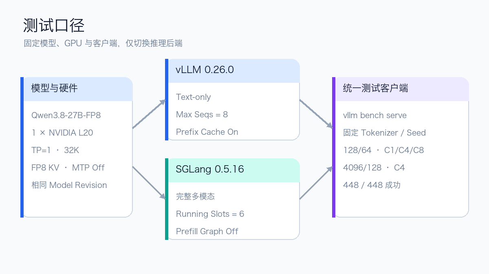
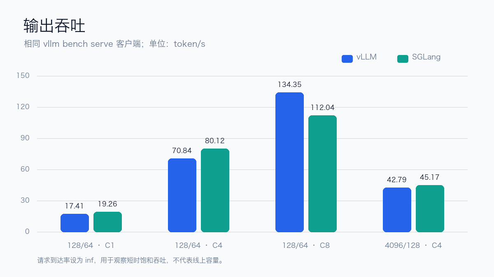
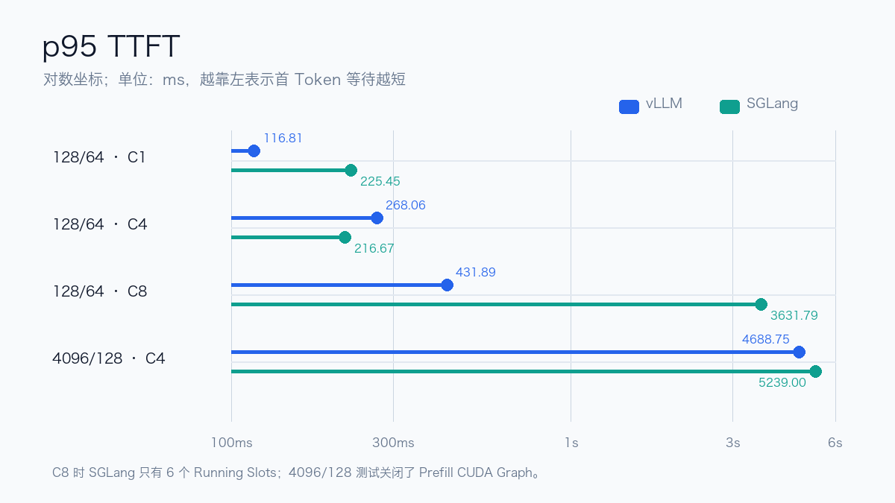

# Qwen3.8-27B：一组 vLLM 与 SGLang 测试数据

> 看到 Qwen3.8-27B 的官方 Coding 评测已经把它放到与 Opus 4.6 正面对比的位置，我确实很震惊。于是我用 vLLM 和 SGLang 做了一轮基础测试，把配置和数据整理下来供参考。

我第一次真正开始大量使用 Coding Agent，是在 Opus 4.5 发布之后。它处理复杂需求、跨文件修改和长时间自主执行的效果，让我第一次明显感觉到开发方式正在发生变化。

所以看到 Qwen3.8-27B 的官方模型卡时，我最意外的并不是某一个单项分数，而是一个 27B 开放权重模型已经进入了可以和 Opus 4.6 放在同一张 Coding Benchmark 表格里比较的区间。表中的结果有领先也有落后，当然不能简化成“已经全面超过 Opus 4.6”；但能形成这种对照，本身已经超出了我的预期。

这也是我做这轮测试的起点。不过本文不复现 Coding Benchmark，也不通过几组短时数据判断 vLLM 与 SGLang 哪个框架更好。这里主要固定一套环境和测试口径，把当前版本的配置、吞吐、延迟与运行时差异保存下来，作为后续调参与选型时的一份数据参考。

## 测试环境与口径

模型使用官方 Qwen3.8-27B-FP8，权重文件约 28.75 GiB。两套服务部署在同一个 Kubernetes 集群，使用相同的模型 Revision。

基础配置如下：

```text
GPU                1 × NVIDIA L20
Tensor Parallel    TP=1
上下文             32K
KV Cache           FP8
MTP                关闭
```

推理框架分别为：

- vLLM 0.26.0，CUDA 12.9，Text-only，Max Seqs 为 8；
- SGLang 0.5.16，CUDA 12.9，加载完整多模态模型，最大 Running Request 为 6。

压测统一使用 vLLM 0.26.0 的 `vllm bench serve` 客户端，并固定 Tokenizer、随机种子、输入输出长度和请求数量。



需要提前说明：这不是严格的引擎微基准。vLLM 使用 Text-only；SGLang 加载完整多模态模型，并且关闭了 Prefill CUDA Graph。后面的数字代表这两套实际运行配置，不能直接概括框架在其他模型和参数下的表现。

## 功能检查

性能测试之前，两套服务都先完成了相同的接口检查：

- 关闭 Thinking 时只返回最终答案；
- 开启 Thinking 时 Reasoning 与 Content 分字段返回；
- 生成可解析的结构化 Tool Call；
- 回填工具结果后继续完成回答；
- 通过 AIBrix Gateway 发起实际请求。

vLLM 另外接入了 OpenWebUI，完成了一次真实对话。这里的功能检查主要是排除“接口返回 200，但 Chat Template、Thinking 或 Tool Call 行为不正确”的情况，不参与后面的性能评分。


## 启动阶段的观测

启动过程中记录到的主要数据如下。

| Engine | 阶段 | 实测 | 备注 |
| --- | --- | ---: | --- |
| vLLM | Engine Init | 156.47 s | 包含加载、Compile、Profile/Warmup |
| vLLM | Compile/JIT | 62.16 s | Engine Init 的子阶段 |
| SGLang | Decode CUDA Graph | 30.89 s | Batch Size 1/2/4/6 |
| SGLang | API Ready | 约 122 s | 包含内置 Warmup |

SGLang 第一次启动时，权重、Gated DeltaNet 状态和 FP8 KV 已经分配完成，但默认 Prefill CUDA Graph 在捕获过程中 OOM。最终配置只关闭 Prefill CUDA Graph，保留 Decode CUDA Graph、32K 和 FP8 KV。

因此，SGLang 的长输入 TTFT 需要结合这项配置理解；它不是两个框架默认参数下的直接比较。

## 短输入与并发数据

128-token 输入、64-token 输出分别测试客户端并发 1、4 和 8，每组发送 64 个请求。

| Engine | 并发 | 成功/总数 | 输出 tok/s | p95 TTFT | p95 TPOT | p95 E2EL |
| --- | ---: | ---: | ---: | ---: | ---: | ---: |
| vLLM | 1 | 64/64 | 17.41 | 116.81 ms | 56.58 ms | 3,680.15 ms |
| SGLang | 1 | 64/64 | 19.26 | 225.45 ms | 50.57 ms | 3,366.33 ms |
| vLLM | 4 | 64/64 | 70.84 | 268.06 ms | 53.18 ms | 3,617.59 ms |
| SGLang | 4 | 64/64 | 80.12 | 216.67 ms | 47.35 ms | 3,198.97 ms |
| vLLM | 8 | 64/64 | 134.35 | 431.89 ms | 55.62 ms | 3,830.99 ms |
| SGLang | 8 | 64/64 | 112.04 | 3,631.79 ms | 48.44 ms | 6,681.54 ms |



并发 1 和 4 时，当前 SGLang 配置的输出吞吐分别比 vLLM 高约 10.7% 和 13.1%，p95 TPOT 也更低。

客户端并发提高到 8 后，SGLang 服务端仍只有 6 个 Running Slots，超出的请求需要排队。此时 p95 TTFT 上升到约 3.63 秒，输出吞吐为 112.04 token/s。vLLM 在同组请求中的输出吞吐为 134.35 token/s，p95 TTFT 约 432 毫秒。

这组 C8 数据首先反映的是当前服务并发上限，而不是一个可以脱离配置讨论的框架结论。

## 4K 输入数据

4096-token 输入、128-token 输出使用客户端并发 4，每套服务发送 32 个请求。

| Engine | 成功/总数 | 输出 tok/s | p95 TTFT | p95 TPOT | p95 E2EL |
| --- | ---: | ---: | ---: | ---: | ---: |
| vLLM | 32/32 | 42.79 | 4,688.75 ms | 76.57 ms | 12,109.06 ms |
| SGLang | 32/32 | 45.17 | 5,239.00 ms | 58.36 ms | 11,357.74 ms |

SGLang 在这组请求中的输出吞吐高约 5.6%，p95 TPOT 更低；vLLM 的 TTFT 更低。由于 SGLang 已关闭 Prefill CUDA Graph，不能把 TTFT 差异全部归因于框架本身。



四组测试中，每个后端完成 224 个请求，两套合计 448 个请求，全部成功。

## 显存与并发边界

压测期间记录到的显存快照为：

- vLLM：41,315 MiB；
- SGLang：43,521 MiB。

这两个数字同样不能只看差值。vLLM 使用 Text-only，而 SGLang 加载了完整多模态模型；两套服务的 CUDA Graph 和运行时参数也不同。

SGLang 根据剩余显存将最大 Running Request 从 8 自动下调到 6，这个变化直接体现在 C8 的 TTFT 上。后续如果希望比较同一并发上限，需要继续调整显存利用率、Graph 配置或模型加载方式，并重新执行完整测试。

## 如何使用这组数据

这组测试更适合做以下参考：

- 估算 Qwen3.8-27B-FP8 在相近 L20 环境中的吞吐和延迟量级；
- 观察服务端并发上限对 TTFT 的影响；
- 为 KV 精度、MTP、Vision 和长上下文 A/B 保留基线；
- 对照后续框架版本升级前后的变化。

它不适合用来做下面这些结论：

- 判断 vLLM 或 SGLang 在所有场景下谁更快；
- 把短时饱和压测直接换算成线上容量；
- 根据吞吐数据推断模型的 Coding 或 Agent 能力；
- 把 L20 数据直接外推到 4090 或其他 GPU。

下一轮计划继续补充 FP8 KV 与 Auto KV、MTP 1/2/3 Draft Token、Vision、长上下文，以及固定到达率下的长稳测试。

完整参数、原始 JSON 和后续更新，可以通过“阅读原文”查看技术记录。
