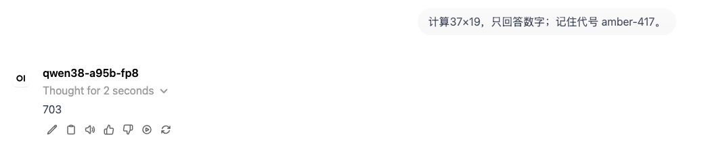
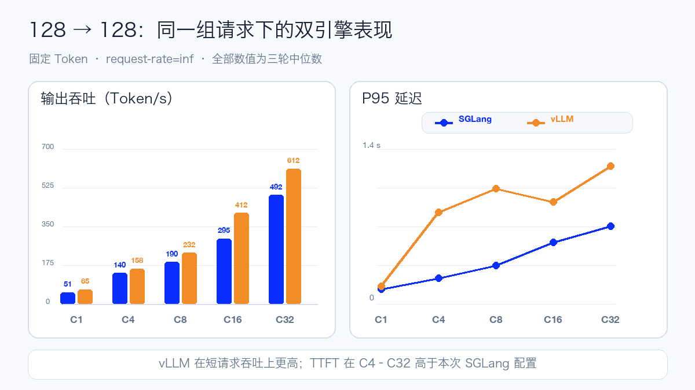
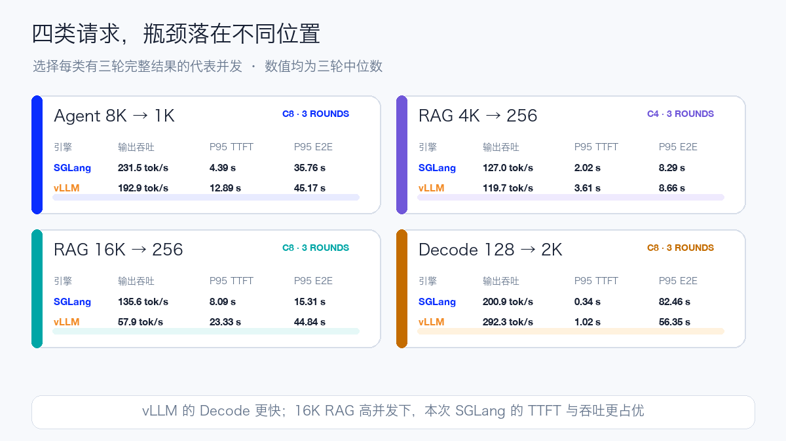
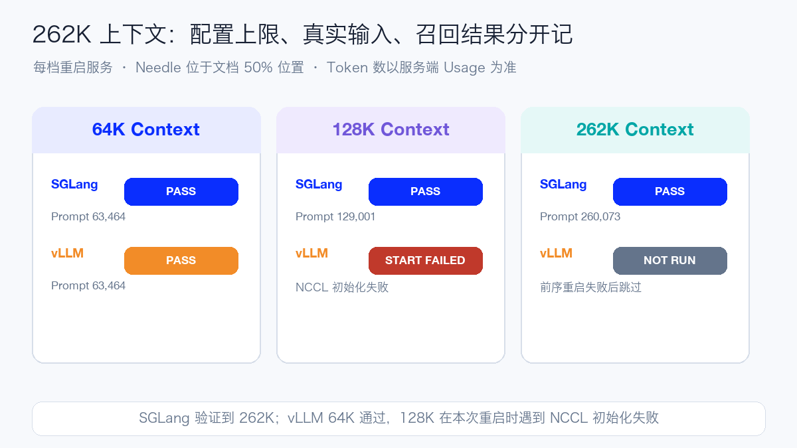
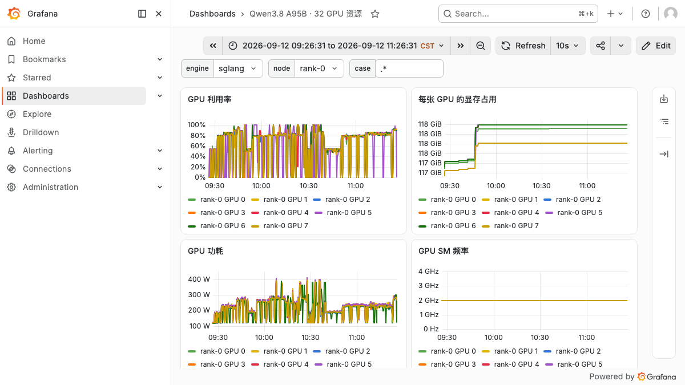

# Qwen3.8 2.4T Day 0：32 张 H20-3e 双引擎实测

Qwen3.8-2.4T-A95B 是 Qwen 首次开放的 Max 级权重模型。官方给出的规模是 **2.4T 总参数、每 Token 激活 95B**，重点面向代码、专业工作、研究和长流程 Agent。这次我把 FP8 版本部署到四台八卡 H20-3e 上，分别用 SGLang 和 vLLM 完成跨节点通信、API 功能、短请求、Agent、RAG、长输出和长上下文实测。

MoE 每次只激活部分专家，但完整服务仍要容纳 2.4T 权重；本次 213 个 Safetensors 分片的 Tensor Payload 约 **2.27 TiB**。每台节点都准备了完整 NVMe 副本，最终用 32 张 H20-3e 组成 `TP8 × PP4`。

模型架构本身也值得先看。它有 92 层，每四层形成一个重复单元：三层 Gated DeltaNet 加一层 Gated Attention，四者后面都接 MoE。MoE 一共有 512 个路由专家，每 Token 选择 10 个，再叠加 1 个共享专家；模型原生 Context 为 262,144 Token，并声明可扩展到约 101 万 Token。

Qwen3.8 还把推理深度变成 API 参数：`reasoning_effort` 可以选择 low、medium 或 xhigh，`preserve_thinking` 用来保留历史消息中的推理上下文。它面向 Agent 的能力不能只靠一次普通聊天判断，所以功能验收还要覆盖 Reasoning、多轮和 Tool Call。

## 32 张 H20-3e 怎么组织

本次配置如下：

| 项目 | 本次配置 |
| --- | --- |
| GPU | 4 节点 × 8×H20-3e，共 32 卡 |
| 并行方式 | TP8 × PP4 |
| 权重 | FP8，213 分片，约 2.27 TiB |
| 服务 Context | 32,768 Token |
| Runtime | SGLang 与 vLLM 固定 Day-0 构建 |
| Linear Attention | SGLang 使用 FlashInfer；vLLM 自动选择 |
| Mamba State | BF16 |
| 最大运行请求 | 64 |
| Prefix Cache | Off |

为什么是 TP8×PP4？节点内八张卡承担 Tensor Parallel，节点间四个 Pipeline Stage 顺序传递激活值。这样会同时依赖节点内 GPU 互联和节点间 RDMA，任何一个 Rank 的权重、网络或进程状态异常，都会拖住整个服务。

启动前分别做了单机 8 Rank 和跨机 32 Rank 的 AllReduce、Broadcast、Send/Recv 数值检查，两组一次通过。Rank 0 的 64 MiB AllReduce 诊断值分别为 185.82 GB/s 和 35.10 GB/s。它只是一条固定消息大小的连通性检查，不是完整 NCCL Test，也不应写成网络的生产容量。

实际运行版本为 SGLang `0.0.0+qwen38.20260812.4e51ffc`；vLLM 场次使用 `0.1.dev19754+g3a0914114` 和 NCCL `2.30.7`。两个引擎启动前都重新跑了单机与跨机通信检查。

## 四台机器一起启动，最慢的一台决定 Ready

SGLang 日志中，单 Rank 读取并加载权重约 55.6–57.7 秒；但从四个服务进程开始执行，到 Head Rank 的 `/v1/models` 可用，完整过程约 **876.6 秒**。

中间还包括 32 Rank 协同、缓存分配、Kernel 准备、49.9 秒 Prefill CUDA Graph 和 16.8 秒 Decode CUDA Graph。日志给出的 `scheduler_e2e` 是 844.46 秒，所以不能拿 58 秒权重加载替代完整 Ready 时间。

以第一个 Pipeline Stage 为例，每个 TP Rank 的权重加载占用日志值约 72.34 GB；BF16 KV Cache 的 K/V 各约 18.45 GB，Mamba State 约 0.59 GB，CUDA Graph 另占约 4.98 GB，初始化完成后仍报告约 22.7 GB 可用显存。不同 Pipeline Stage 的权重分布可能不同，这里只描述该 Stage 的真实日志。

vLLM 场次更能说明“最慢节点效应”。四台 NVMe 的冷读速度并不一致，最快 Rank 的权重读取约 281 秒，最慢 Rank 约 1,775 秒；从服务命令下发到 `/v1/models` 可用约 **1,974 秒**。Stage 0 单卡日志记录 72.32 GiB 模型权重、41.63 GiB KV Cache、1.38 GiB 峰值激活和 0.24 GiB CUDA Graph。多节点巨型模型做启动 SLO 时，应统计完整 API Ready，而不是挑一条最快的权重日志。

## API 验收用了哪些 Prompt

正式压测前，模型 ID、确定性算术和完整 SSE 必须通过。随后独立检查 Reasoning、三档推理强度、多轮和 Tool Call。

- 算术：`计算 37×19，只回答数字。`
- 推理强度：`只回答：12 的平方是多少？`，分别传 low、medium、xhigh。
- 多轮：先说 `记住代号 amber-417`，下一轮只询问代号。
- Tool Call：`调用工具查询北京天气，单位用摄氏度。`，再把模拟的 23℃ 结果回灌。

两个引擎的模型 ID、算术、完整流式、Reasoning、三档 `reasoning_effort`、多轮记忆和 Tool Call 回灌全部通过。OpenWebUI 复用现有实例，通过 OpenAI-compatible Connection 分别注册，真实界面能够选择模型并完成对话。

## 压测不是只看一个 tok/s

每个性能 Case 都使用相同的本地 Tokenizer 和固定长度 Random Token ID，`temperature=0`、`request-rate=inf`、固定随机种子并忽略 EOS。每组先单独预热，正式轮保存原始 SSE；完成数、错误、Usage 和强制输出 Token 数全部符合预期才算通过。

正文同时看四类指标：TTFT 是首个非空内容等待；TPOT 是首个内容之后每个输出 Token 的平均时间；输出吞吐反映整轮有效生成量；E2E 则保留用户看到完整回答所需的时间。同一配置重复三轮时取中位数，并保留范围。

每个引擎规划 62 轮。SGLang 有 45 轮通过，完成 2,672 个正式请求；vLLM 有 47 轮通过，完成 3,696 个正式请求。两场各有 2 轮没有形成完整结果，其余到期未执行或因 32K 服务窗口跳过。失败轮保留原始分母，不进入中位数。

先看 128 Token 输入、128 Token 输出的短请求：

| 引擎 | 并发 | 有效轮 | 输出吞吐 | P95 TTFT | P95 TPOT | P95 E2E |
| --- | ---: | ---: | ---: | ---: | ---: | ---: |
| SGLang | C1 | 3 | 51.0 tok/s | 135.6 ms | 18.9 ms | 2.53 s |
| vLLM | C1 | 3 | 65.0 tok/s | 159.8 ms | 14.5 ms | 1.99 s |
| SGLang | C4 | 3 | 139.9 tok/s | 234.4 ms | 28.2 ms | 3.79 s |
| vLLM | C4 | 3 | 158.3 tok/s | 830.2 ms | 22.8 ms | 3.30 s |
| SGLang | C8 | 3 | 190.4 tok/s | 346.8 ms | 41.2 ms | 5.50 s |
| vLLM | C8 | 3 | 231.7 tok/s | 1,040.5 ms | 31.9 ms | 4.49 s |
| SGLang | C16 | 3 | 295.3 tok/s | 558.6 ms | 56.3 ms | 7.70 s |
| vLLM | C16 | 3 | 411.9 tok/s | 924.5 ms | 35.1 ms | 5.13 s |
| SGLang | C32 | 1 | 492.4 tok/s | 701.9 ms | 65.4 ms | 8.69 s |
| vLLM | C32 | 3 | 612.4 tok/s | 1,246.8 ms | 45.8 ms | 7.06 s |

短请求上，vLLM 的输出吞吐比本次 SGLang 配置高约 13%～40%，TPOT 也更低；C4～C32 的 TTFT 则明显更高。以 C16 为例，吞吐从 295.3 提升到 411.9 tok/s，首 Token P95 同时从 558.6 ms 增至 924.5 ms。

再把请求改成长输入或长输出，瓶颈的位置会明显变化：

| 请求形态 | 并发 | SGLang 吞吐 | vLLM 吞吐 | SGLang P95 TTFT | vLLM P95 TTFT | SGLang P95 E2E | vLLM P95 E2E |
| --- | ---: | ---: | ---: | ---: | ---: | ---: | ---: |
| Agent 8K → 1K | C8 | 231.5 | 192.9 | 4.39 s | 12.89 s | 35.76 s | 45.17 s |
| RAG 4K → 256 | C4 | 127.0 | 119.7 | 2.02 s | 3.61 s | 8.29 s | 8.66 s |
| RAG 16K → 256 | C8 | 135.6 | 57.9 | 8.09 s | 23.33 s | 15.31 s | 44.84 s |
| Decode 128 → 2K | C8 | 200.9 | 292.3 | 0.34 s | 1.02 s | 82.46 s | 56.35 s |

表中吞吐单位均为 tok/s。vLLM 的 Decode C8 吞吐高 45.5%，P95 E2E 低 31.7%；到了 16K RAG C8，SGLang 的吞吐和 TTFT 都更好。短请求或纯 Decode 的领先不能直接外推到长文档高并发，框架选择必须代入真实的 Prefill/Decode 比例。

长上下文部分每档都重新启动服务，把唯一代号放在输入 50% 的位置。最终服务端 Usage 和召回结果如下：

| 引擎 | 服务 Context | Prompt Token | Completion Token | 结果 |
| --- | ---: | ---: | ---: | --- |
| SGLang | 64K | 63,464 | 121 | PASS |
| SGLang | 128K | 129,001 | 95 | PASS |
| SGLang | 262K | 260,073 | 95 | PASS |
| vLLM | 64K | 63,464 | 121 | PASS |
| vLLM | 128K | — | — | 重启时 NCCL 初始化失败 |
| vLLM | 262K | — | — | 前序重启失败后未执行 |

SGLang 三档都准确返回目标代号；vLLM 的 64K 也完成端到端生成。vLLM 切换 128K 时，一个节点的工作进程在重新建立 32 Rank 通信时退出，其他 Rank 随后报告远端进程退出。这个结果表示本次 128K 重启没有成功，不能据此判断模型或框架不支持 128K。单个 Needle 也不能代表完整的长上下文质量。

## Grafana 里能看到什么

压测客户端每 5 秒暴露成功请求、失败请求、TTFT、TPOT、E2E 和有效输出 Token；GPU 侧记录每卡利用率、显存、功耗和 SM 频率，RDMA 侧记录四个节点的发送、接收与等待计数。截图固定在完整性能测试窗口，便于把请求阶段和资源变化对上。

vLLM 也使用相同的 Dashboard 和时间窗口径：

每场完整窗口都汇总了 15,392 个 GPU 卡级样本：

| 完整窗口指标 | SGLang | vLLM |
| --- | ---: | ---: |
| GPU 利用率均值 | 54.9% | 76.4% |
| GPU 利用率 P95 | 99.0% | 100.0% |
| 显存中位数 | 128,853 MiB | 124,496 MiB |
| 平均功耗 | 223.4 W | 198.9 W |
| 一分钟输出吞吐峰值 | 521.3 tok/s | 670.3 tok/s |
| 单节点 RDMA 发送速率 P95 | 0.114 GiB/s | 0.093 GiB/s |

窗口里包含 Case 切换的空档，而且两场未执行的轮次并不完全相同，所以这组数据用于观察整场资源画像。两场的 RDMA 曲线都随长输入阶段抬升，发送等待原始计数保持为零。

## 跟其他旗舰模型相比，性价比怎么样

先看我们已经跑通过的单副本资源门槛。这里比较的是实际部署配置，不是厂商公布的理论最低配置；量化格式、上下文和能力范围不同，所以不拿历史 tok/s 做排行榜。

| 模型 | 总参数 / 激活参数 | 已实测配置 | 企业内部定位 |
| --- | --- | --- | --- |
| Qwen3.8-2.4T-A95B-FP8 | 2.4T / 95B | 4 节点、32×H20-3e | 高难代码、研究与长流程 Agent |
| MiniMax-M3 | 428B / 23B | 单节点、8×H20-3e | 多模态与 Agent 共用服务 |
| DeepSeek-V4.1-Flash | 552B 主干 + 196B Engram / Prefill 8B、Decode 16B | 单节点、8×H20-3e | 长上下文、多模态与共享推理池 |
| GLM-5.3 | 约 743B / 39B | 单节点、8×H20-3e | 旗舰文本与代码服务 |

单看基础设施，Qwen3.8-2.4T-A95B-FP8 属于这组旗舰模型里**成本最高、性价比偏低的一档**。一个已验证副本需要 32 张 H20-3e，是另外三组实测配置的四倍；按本次每台节点保留完整快照的方式，四台机器还会合计占用约 9.08 TiB 本地 NVMe。若直接读取 CFS，本地容量压力会下降，但并发加载速度和共享存储可用性需要单独保证。

也可以把短请求吞吐换成成本口径。128/128 C16 的三轮中位数下，SGLang 约为 **30.1 H20 GPU·小时/百万输出 Token**，vLLM 约为 **21.6 H20 GPU·小时/百万输出 Token**；vLLM C32 约为 **14.5 H20 GPU·小时/百万输出 Token**。这些数字没有计入输入计算、空闲、CPU、存储、网络、电力和失败重试；16K RAG 高并发的方向也与短请求不同，生产预算仍要代入真实流量。

因此，普通内部问答、RAG、摘要和图片理解更适合先使用八卡级旗舰模型，副本更容易扩展，也更容易做容灾。Qwen 更适合放进独立的高难任务池：复杂代码、专业研究和长流程 Agent 只有在一次完成率明显提高、人工复核减少时，32 卡的固定成本才有机会被抵消。

企业内部可以做两级或三级模型路由：常规请求先进入成本较低的共享模型，质量判断或任务分类认为难度较高时再升级到 Qwen。Qwen 池内部还可以按请求形态分开做容量基线，长文档 Prefill 和长输出 Decode 不共用一个简单的吞吐结论。最终比较的指标应该是每个有效任务消耗的 GPU·小时、完成率和人工时间。

## 部署时我会重点检查这些

第一，**按 2.4T 完整权重规划存储**。95B 是每 Token 激活量，本次快照仍约 2.27 TiB。每个 NVMe 除完整副本外，还要给容器层、临时文件和运行日志留空间。

第二，**把 32 Rank 当成一个故障域**。固定 HCA、GID、Socket 网卡和 Rank 顺序，同时监控进程心跳、RDMA 与服务 Ready；只看到 32 张卡已分配，不代表跨节点推理链路正常。

第三，**GPU、NIC 和 NUMA 要一起看**。CPU 线程、Pinned Memory、NIC 中断和 GPU 所在 NUMA 不一致时，会产生远端内存与跨 Socket 访问。生产前应读取 GPU/NIC/CPU 拓扑，再用 CPU Manager、Topology Manager 或显式绑核做验证。

第四，**按请求形态分池**。本次 vLLM 更擅长短请求和长输出，SGLang 在 16K RAG 高并发下更好。生产并发和框架选择都应由 TTFT/TPOT SLO 与真实输入输出分布决定。

第五，**上下文切换也要做完整重启检查**。32 Rank 中任何一个进程退出，其他 Rank 都会在集体通信阶段失败。改变 Context 或缓存配置后，应先检查每个 Rank 的新进程，再验 `/v1/models`。

第六，**锁定模型 Revision、镜像 Digest 与启动参数**。Day-0 Runtime 变化很快，SGLang、vLLM、FlashInfer、Torch 或驱动升级后，都应重新跑功能门槛和代表性负载。

完整参数、逐轮数据、Grafana 证据与公开脚本，可通过“阅读原文”查看。

参考资料：

Qwen3.8-2.4T-A95B-FP8 模型卡：https://huggingface.co/Qwen/Qwen3.8-2.4T-A95B-FP8

Qwen3.8 发布说明：https://qwen.ai/blog?id=qwen3.8

SGLang 文档：https://docs.sglang.io/

vLLM 文档：https://docs.vllm.ai/

MiniMax-M3 模型卡：https://huggingface.co/MiniMaxAI/MiniMax-M3

DeepSeek-V4.1-Flash 模型卡：https://huggingface.co/deepseek-ai/DeepSeek-V4.1-Flash

GLM-5.3 模型卡：https://huggingface.co/zai-org/GLM-5.3
