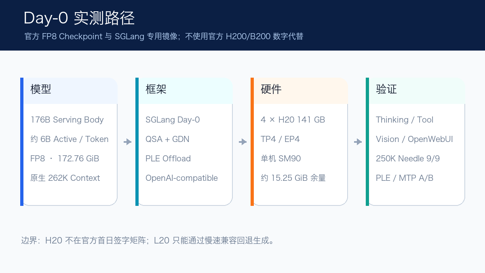
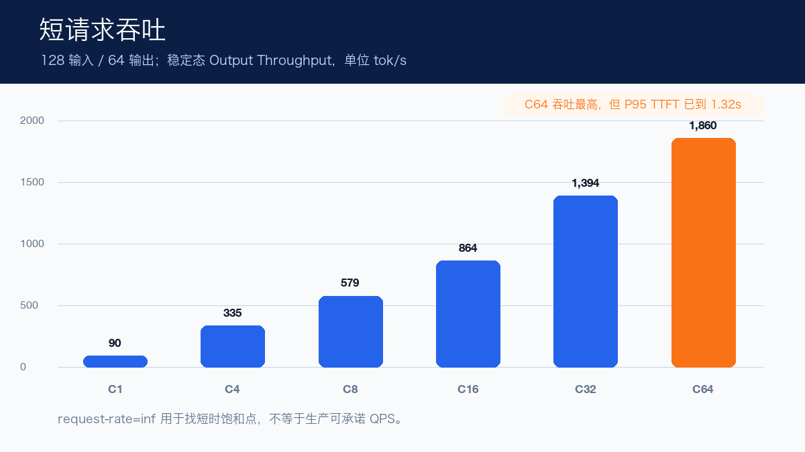
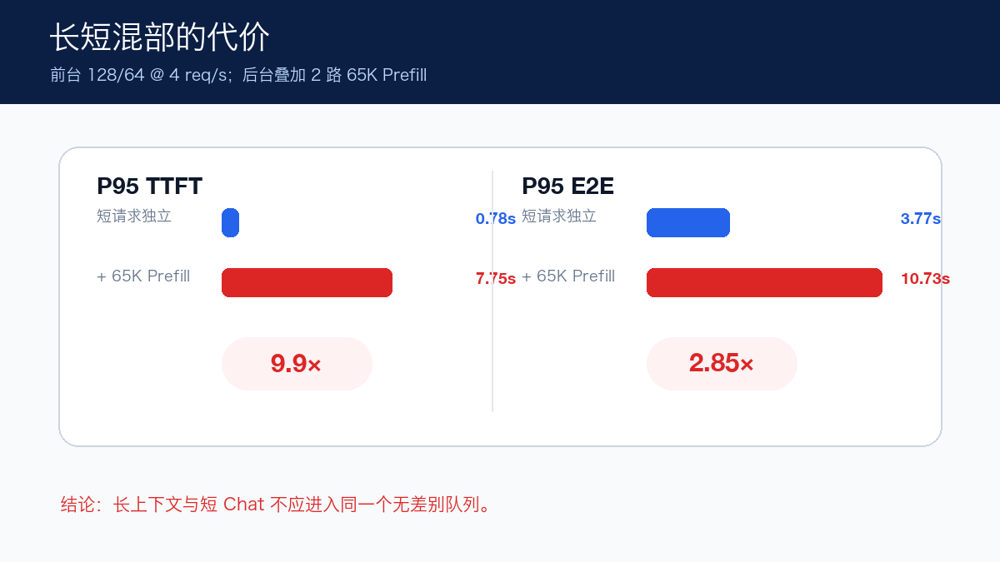
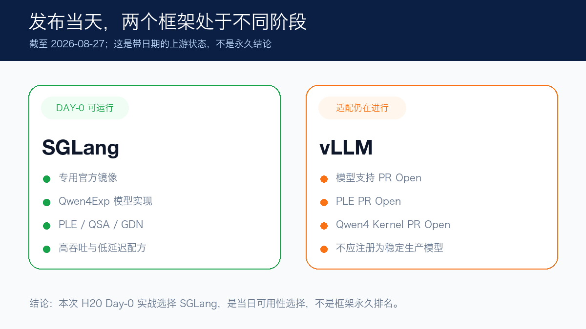

# Qwen3.8-Flash-Next Day 0：我用 4×H20 跑通了原生 262K

> Qwen3.8-Flash-Next 发布后的第二天，我用 4 张 141 GB H20 完成了官方 FP8 路径的启动、API、262K 长上下文、PLE 和 MTP 实测。结果不只是“模型能跑”：长短混部让短请求 P95 TTFT 放大了 9.9 倍，MTP 也不是所有并发都更快。

2026 年 8 月 26 日，Qwen 发布 Qwen3.8-Flash-Next，并把它定位为 Qwen4 架构的实验性预览。SGLang 同日给出了专用镜像和部署配方，这也是我决定做一次 Day-0 实战的原因。

这次没有使用官方 H200、B200 上的性能数字，也没有测试 BF16。我使用官方 FP8 Checkpoint，在 4 张 141 GB H20 上以 TP4/EP4 部署，随后把短请求、长输出、原生 Context、共享前缀、长短混部、PLE 和 MTP 全部跑了一轮。

先给结论：

- 官方 FP8 在 4×H20 上可直接启动，原生 Context 为 262,144 Token；
- 短请求输出吞吐从 C1 的 90.32 扩展到 C64 的 1,860.09 tok/s；
- 250K 单针检索在三个位置共 9/9 通过，但首 Token 等待约 19 秒；
- 叠加两路 65K Prefill 后，短请求 P95 TTFT 从 0.78 秒增至 7.75 秒；
- PLE 主要把缓存容量提高约 15.8%，不是可证明的吞吐加速；
- MTP 对低并发、长生成有效，但 64 Token、C8 反而退化；
- 截至 8 月 27 日，SGLang 已有可运行的 Day-0 路径，vLLM 相关适配仍在 Open PR 中。



## 这个模型到底有多大

Qwen3.8-Flash-Next 的名字很容易让人误以为是一个小型 Flash 模型。实际上，它的 MoE 语言模型主体约 125B，每个 Token 激活约 6B；再加上约 51B 的 Bigram/Trigram Embedding，Serving Body 约 176B。Checkpoint 里还内置了约 4B 的 MTP 模块。

所以“每 Token 激活 6B”描述的是计算稀疏度，不是显存只需要容纳 6B 权重。

我使用的官方 FP8 权重有 131 个分片，合计约 172.76 GiB。架构内部交替使用 Gated DeltaNet 和 Qwen Sparse Attention（QSA），PLE 可以把 51B N-gram Embedding 放到 CPU Pinned Memory，MTP 则用于一次预测多个 Token。

这些名字听起来都很先进，但是否有用，最终还是要看真实启动与负载数据。

## 4×H20 的启动结果

这次配置固定为：

```text
GPU                  4 × H20 141 GB
Checkpoint           官方 FP8
Parallel             TP4 / EP4
Context              262,144
Runtime              SGLang Day-0 专用镜像
GDN Backend           FlashInfer
PLE                   On
API                   OpenAI-compatible
```

模型权重加载耗时 88.11 秒，Decode CUDA Graph 捕获耗时 105.15 秒，Engine Ready 为 234.88 秒。稳定后每卡占用约 127–128 GiB，还剩约 15.25 GiB。

这里有一个重要边界：SGLang 首日给出的 NVIDIA 验证矩阵主要是 H200、B200、B300 和 GB300，H20 不在签字矩阵里。因此本文只能说“我在 H20 上实测成功”，不能替官方扩大硬件支持范围。

接口层不只检查了 `/health`。Chat Completion、Thinking、结构化 Tool Call、图片 Data URL 和 OpenWebUI 对话都已通过。

## 短请求吞吐能扩到哪里

先用 128 输入、64 输出 Token 做稳定态测试：

| 并发 | Output tok/s | P95 TTFT | P95 TPOT | P95 E2E |
| ---: | ---: | ---: | ---: | ---: |
| 1 | 90.32 | 200 ms | 8.14 ms | 711 ms |
| 4 | 334.95 | 385 ms | 8.86 ms | 942 ms |
| 8 | 578.77 | 371 ms | 10.69 ms | 1.02 s |
| 16 | 864.16 | 410 ms | 12.71 ms | 1.18 s |
| 32 | 1,393.73 | 452 ms | 16.61 ms | 1.48 s |
| 64 | 1,860.09 | 1.32 s | 28.77 ms | 2.90 s |



吞吐从 C1 到 C64 一直增长，但 C64 的尾延迟已经明显变差。1,860 tok/s 是短时饱和点，不是所有业务都能直接采用的生产容量。交互式 Chat 更可能在 C16–C32 之间根据 TTFT SLO 找平衡。

我还用 Poisson Arrival 做了 2、4、8、16、24 和 32 req/s 的第一轮测试。8 req/s 以后，实际送达速率已经跟不上 Offered Rate；由于每档只有 64 个请求，尾部 Drain 和动态批处理使 P95 没有单调上升。因此这组短跑只用来发现拐点，正式容量测试仍应把每档延长到 10–30 分钟。

## 原生 262K 能跑，但首 Token 有成本

单并发、输出 128 Token 时，4K、32K、64K、128K 和 261K 的 P95 TTFT 分别约为：

```text
0.25s / 1.86s / 3.72s / 7.95s / 19.16s
```

接近 262K 的请求完整成功，P95 TPOT 仍约 10.27 ms。也就是说，长上下文的主要成本落在 Prefill；模型“能装下”不代表用户愿意等 19 秒才看到首 Token。

随机 Token 只能证明容量。为了验证简单的信息召回，我又在 32,768、131,072 和 250,000 Token 中，把随机 Key 分别放在 10%、50% 和 90% 位置。9 个用例全部找回正确 Key。


这个结果仍然只是单针冒烟，不等于复杂长文档推理、跨段归纳或多针检索已经通过。长上下文评测最容易犯的错误，就是把“没有 OOM”写成“长文本能力很好”。

## 真正危险的是长短混部

生产上通常不会只有一种请求。于是我让后台运行两路 65,536 输入、128 输出的长请求，同时以前台 4 req/s 发送 64 个 128/64 短请求。

短请求独立运行时，P95 TTFT 为 782 ms；叠加 65K Prefill 后变成 7.75 秒，放大约 9.9 倍。P95 E2E 也从 3.77 秒升到 10.73 秒。



这比峰值吞吐更值得关注：长上下文请求和短 Chat 不应该进入同一个无差别队列。可选手段包括按 Prompt 长度分池、优先级调度、独立长上下文实例，以及 Prefill/Decode 分离。

## PLE：省下的显存去哪了

PLE Offload 把 N-gram Embedding 放到 CPU Pinned Memory。我只切换 PLE，其余保持 FP8、TP4/EP4 和 4×H20：

| 指标 | PLE On | PLE Off | 变化 |
| --- | ---: | ---: | ---: |
| 每 Rank 权重 | 32.20 GiB | 43.86 GiB | -11.66 GiB |
| Token Pool | 3,680,256 | 3,178,560 | +15.8% |
| Running Requests | 587 | 507 | +15.8% |

稳定态 C8 短请求和 32K C1 Prefill 的差异都接近短跑波动，不能证明 PLE 更快或更慢。它最明确的价值，是把每 Rank 约 11.66 GiB 的权重空间重新变成 Mamba/KV Cache，容量提高约 15.8%。

## MTP：为什么有时快 58%，有时反而变慢

SGLang 的低延迟配方使用 NEXTN、3 个推测步骤和 4 个 Draft Token。第一次在 H20 启动时，GDN Target Verify 要求 FP32 Initial State，而模型配置选中了 BF16 Mamba SSM State，CUDA Graph 捕获直接失败。

显式改成 FP32 SSM State 后，MTP 成功启动。Draft Head 每 Rank 额外加载约 1.18 GiB，实际平均接受长度约 1.92–2.52。

| 输入 / 输出 | 并发 | 普通路径 tok/s | MTP tok/s | 变化 |
| ---: | ---: | ---: | ---: | ---: |
| 128 / 64 | 1 | 90.32 | 137.60 | +52.3% |
| 128 / 64 | 8 | 535.12 | 278.27 | -48.0% |
| 128 / 1,024 | 1 | 114.11 | 180.32 | +58.0% |
| 128 / 1,024 | 8 | 702.56 | 823.35 | +17.2% |


MTP 对低并发、长生成很有效，但短输出、高并发不一定能摊薄推测和验证成本。它是需要按业务形态选择的低延迟配方，不是“打开就全面加速”的开关。

## 为什么这次用 SGLang，而不是 vLLM

截至 2026 年 8 月 27 日，两个框架的状态并不一样：

- SGLang 已经提供专用 Day-0 镜像、Qwen4Exp 模型实现、PLE、QSA/GDN Backend，以及高吞吐和低延迟启动配方；
- vLLM 的模型支持 PR #53896、PLE PR #53899 和 Qwen4 融合 Kernel PR #53909 仍为 Open，部分还存在合并阻塞；稳定版和主分支不能直接部署这套 FP8 权重。



所以这次选择 SGLang，是发布当天的可用性选择。它不代表 vLLM 永远不支持，也不是两个框架的永久排名；后续一旦 PR 合入并发布新版本，结论就应该重新验证。

## L20 可以跑吗

官方 Day-0 镜像在 L20（SM89）上不能直接运行：FlashInfer GDN 要求 SM90+，切换 Triton 后，QSA 的 FA4/CuTe 路径仍会失败。

我做过一个 PyTorch SDPA 兼容回退，8×L20 可以加载并生成，但必须替换 QSA Decode Kernel、关闭 CUDA Graph，C1 128/64 只有 7.47 tok/s。它只能证明权重和模型逻辑可执行，不能写成“L20 正式支持”，更不能拿来和 H20 的官方 Kernel 性能比较。

## 最后

这次 Day-0 实战让我觉得最有价值的，不是 C64 的 1,860 tok/s，而是几条更接近生产的结论：

1. 支持 262K 与适合 262K 在线交互，是两件事；
2. 长 Prefill 会严重干扰短请求，混部前必须测尾延迟；
3. PLE 主要解决容量，MTP 主要优化特定 Decode 负载；
4. 新模型发布时，“框架有模型名字”不等于完整 FP8、Kernel 和 API 路径都可用；
5. Day-0 数字必须写清模型 Revision、镜像、GPU、参数和冷暖态，才有复测价值。

完整参数、公开脚本、结构化 JSON、上游 PR 和后续更新，可以通过“阅读原文”查看技术记录。
