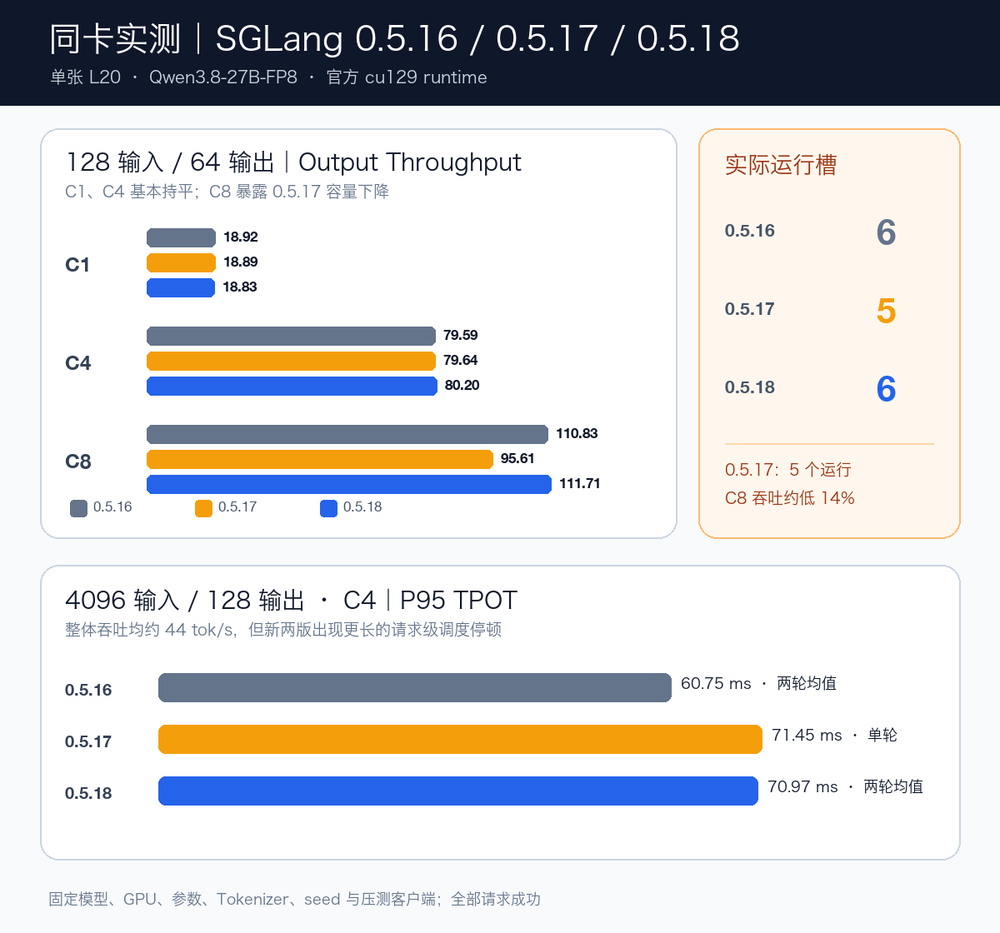
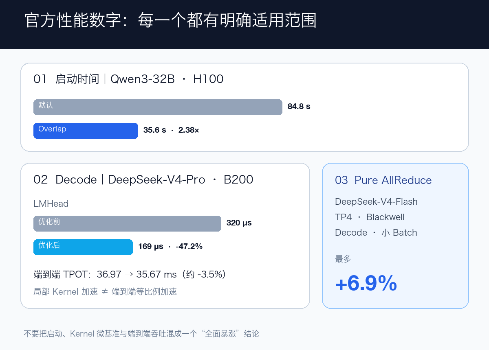

# SGLang v0.5.18 真的更快吗？我用一张 L20 连测 0.5.16、0.5.17 和 0.5.18

> 这次不只看 Release Notes。我把三个官方镜像放到同一张 L20 上，用同一个 Qwen3.8-27B-FP8、同一组参数和同一个压测客户端跑了一遍。

8 月 22 日，SGLang v0.5.18 发布。

710 个 PR、212 位贡献者；新模型、启动、Decode、MoE、P/D、HiCache、Diffusion 和异构硬件都在更新。

今天看到一篇公众号文章，宣称 SGLang v0.5.18“推理速度暴涨”“全模型适配”“多硬件全域优化”。这些表述很吸引眼球，性能提升看起来也相当夸张，所以我决定用真实环境测试验证一下。

这些说法不能说毫无依据，但我更关心另一个问题：

> 如果我的服务就在一张 L20 上运行 Qwen，单纯从 0.5.16 或 0.5.17 升到 0.5.18，到底会不会更快？

所以我没有停在官方文档解读，而是把 v0.5.16、v0.5.17、v0.5.18 三个官方 `cu129-runtime` 镜像都跑了。

先说结论：

- C1、C4 短请求吞吐几乎持平，三版差异约 1% 以内；
- v0.5.17 的实际运行槽从 6 降到 5，C8 吞吐比另外两版低约 14%；
- v0.5.17 和 v0.5.18 在 4K 输入用例中出现可复现的请求级尾延迟抬升；
- v0.5.18 值得因功能和修复升级，但这张 L20 上没有“全场景推理暴涨”。



## 我是怎么测的

为了尽量只改变 SGLang 版本，我固定了这些条件：

- 单张 NVIDIA L20，46 GB 显存；
- Qwen3.8-27B-FP8，TP=1；
- 32K 上下文，FP8 KV Cache；
- 完整保留多模态、Reasoning Parser 和 Tool Parser；
- 关闭 Prefill CUDA Graph，保留 Decode CUDA Graph；
- 三版都用 `lmsysorg/sglang` 官方镜像；
- 压测客户端独立固定为 v0.5.16 官方环境，不随服务端版本变化；
- `random-ids` 数据，固定 Tokenizer、seed=42、temperature=0；
- 短请求 64 个样本，长请求 32 个样本，全部请求成功。

版本顺序是 0.5.16 → 0.5.18 → 0.5.17。镜像拉取时间单独记录，不混进 SGLang 启动时间。

这里也有一个限制：后测版本可能命中宿主页缓存，所以 Weight Load 只能作为现场观测，不能拿来证明某个版本加载一定更快。在线压测的模型、GPU、参数和客户端则保持不变。

## 短请求：三版单请求性能几乎没变

先看 128 输入 / 64 输出。

| 版本 | 并发 | 输出 tok/s | P95 TTFT | P95 TPOT |
| --- | ---: | ---: | ---: | ---: |
| 0.5.16 | 1 | 18.92 | 187.46 ms | 50.63 ms |
| 0.5.17 | 1 | 18.89 | 188.37 ms | 50.58 ms |
| 0.5.18 | 1 | 18.83 | 204.26 ms | 50.68 ms |
| 0.5.16 | 4 | 79.59 | 267.27 ms | 47.34 ms |
| 0.5.17 | 4 | 79.64 | 272.91 ms | 47.28 ms |
| 0.5.18 | 4 | 80.20 | 277.97 ms | 46.92 ms |

C1 和 C4 的 Output Throughput、TPOT 都高度接近。

如果只看这两组，最诚实的结论就是：

> 对这张 L20 和这个 Qwen 模型，升级到 v0.5.18 没有带来肉眼可见的短请求吞吐跃升。

这其实符合官方 Release 的适用范围。官方最醒目的优化分别落在 H100 启动、B200 LMHead、Blackwell MNNVL 等特定路径上，本来就不该自动外推到 L20。

## 真正有差异的是“能同时跑几个请求”

C8 时，结果突然拉开：

| 版本 | 实际运行槽 | 输出 tok/s | P95 TTFT | P95 TPOT |
| --- | ---: | ---: | ---: | ---: |
| 0.5.16 | 6 | 110.83 | 3,705.50 ms | 48.42 ms |
| 0.5.17 | 5 | 95.61 | 3,601.77 ms | 47.98 ms |
| 0.5.18 | 6 | 111.71 | 3,678.68 ms | 48.01 ms |

v0.5.17 比 v0.5.16 低 13.7%，比 v0.5.18 低 14.4%。

但它的 TPOT 并没有明显变差，真正变化的是 Engine 容量。

这个 Qwen3.8 模型需要为每个活跃请求分配 Mamba/SSM State Cache。日志显示每个请求需要 5 个 State Slot：

```text
v0.5.16: floor(33 / 5) = 6
v0.5.17: floor(29 / 5) = 5
v0.5.18: floor(32 / 5) = 6
```

启动参数虽然声明了最大运行请求数 8，但那只是上限。SGLang 会按实际显存预算自动下调，避免 OOM。

所以 C8 对 v0.5.17 来说，大致是“5 个运行、3 个等待”；另外两版则是“6 个运行、2 个等待”。排队会让 TTFT 进入秒级，也让吞吐更早触顶。

这里特别容易误判：

> 不是 v0.5.17 每个 Token 算得慢了 14%，而是它同一时刻少服务了一个请求。

“运行槽”也不是 Pod 数、HTTP 连接数或 Kubernetes 副本数，而是单个 Engine/DP Rank 在 GPU 上保持活跃的请求容量。

## 4K 输入：吞吐没退，但尾延迟变了

接着看 4096 输入 / 128 输出、并发 4。

| 版本 | 轮次 | 输出 tok/s | P95 TTFT | P95 TPOT | Max ITL |
| --- | ---: | ---: | ---: | ---: | ---: |
| 0.5.16 | 1 | 44.04 | 5,902.98 ms | 60.91 ms | 1,944.61 ms |
| 0.5.16 | 2 | 43.91 | 5,921.20 ms | 60.60 ms | 1,877.49 ms |
| 0.5.17 | 1 | 44.12 | 5,819.91 ms | 71.45 ms | 3,121.59 ms |
| 0.5.18 | 1 | 44.33 | 5,790.50 ms | 70.88 ms | 3,109.77 ms |
| 0.5.18 | 2 | 44.42 | 5,784.71 ms | 71.06 ms | 3,072.33 ms |

三版整轮吞吐都约 44 tok/s，v0.5.17/v0.5.18 的 P95 TTFT 甚至略低。

但 P95 TPOT 从 v0.5.16 的约 61 ms，上升到新两版的约 71 ms，差约 16%～18%。

为了确认不是随机抖动，我分别复跑了 v0.5.16 和 v0.5.18，结果仍然落在各自区间。

更细看会发现，新两版的 P95 ITL 仍只有约 48 ms，主要问题是少量更长的停顿：Max ITL 从约 1.9 秒增加到约 3.1 秒，拉高了部分请求的平均 TPOT。

这更像 4K Prefill 与 Decode 混跑时的调度尾延迟变化，而不是 GPU 整体变慢。

目前我只能把它写成可复现观察，不能只凭这组数据定位到某个 PR。换模型、Chunk Size、并发和到达率以后，结果都可能变化。

## 启动也没有看到 2.38×

排除 Image Pull 后，三版启动观测如下：

| 版本 | Weight Load | Decode Graph | 容器到内部 Ready |
| --- | ---: | ---: | ---: |
| 0.5.16 | 24.90 s | 32.55 s | 125.57 s |
| 0.5.17 | 14.65 s | 32.82 s | 约 131.00 s |
| 0.5.18 | 16.79 s | 30.88 s | 122.44 s |

Weight Load 受页缓存顺序影响，不能横向归因。更稳妥的容器到 Ready 口径只差约 9 秒。

官方的 2.38× 来自 Qwen3-32B 在 H100 上显式启用 Checkpoint Staging 与 CUDA Graph Capture Overlap：84.8 秒降到 35.6 秒。

但官方 PR 把“已启用协调预取的串行路径 38.94 秒 → Overlap 35.60 秒”作为新增机制的主要比较，增益是 8.6%；84.8 秒 → 35.6 秒的 2.38× 还包含了已有的预取收益，而且需要显式打开 Opt-in 参数。

另一个“最多 +6.9%”来自 Blackwell、DeepSeek-V4-Flash、TP4 的 Decode 小 Batch。完整 Sweep 从 BS1 的 +6.9% 逐步缩小，到 BS64 是 -1.4%。它们都是真实的上游 A/B 数据，但描述的是特定启动或 Kernel 路径，不是“任意 GPU、任意模型默认升级都快 2.38×”，更不是全场景 Output Token Throughput 暴涨。



## 那 v0.5.18 还值得升级吗

值得跟进，但理由要说准确。

v0.5.18 的价值包括新的模型与 Cookbook、P/D 和缓存路径增强、PyTorch/Triton/FlashInfer 更新，以及 H100、B200、Blackwell、AMD、NPU、CPU/XPU 等多条后端能力继续扩展。

对我这次的 L20 + Qwen3.8-27B-FP8：

- v0.5.18 恢复了 v0.5.17 丢失的一个运行槽，高并发吞吐回到 v0.5.16 水平；
- 短请求没有明显提速，也没有明显回退；
- 4K 混合 Prefill/Decode 的请求级尾延迟需要在真实业务到达率下继续验证。

所以我的升级建议是：

1. 不要只跑一个 C1 请求就宣布升级成功；
2. 同时记录 TTFT、TPOT、吞吐、实际运行槽与 KV/State Cache 容量；
3. 至少覆盖短对话、4K 长提示和目标业务并发；
4. 把首次镜像拉取、权重加载、Kernel/Graph 编译和 API Ready 分开计时；
5. 新功能价值与纯性能收益分开验收。

最后的结论并不戏剧化，却更有用：

> SGLang v0.5.18 是一次有分量的能力升级；但在单张 L20 上，它没有让 Qwen 短请求“全面暴涨”。升级真正需要关注的，是自己的模型是否命中特定优化，以及运行槽和长输入尾延迟有没有变化。

完整测试口径、逐项结果与可公开汇总数据已整理到公开技术文档，可通过“阅读原文”查看。

## 资料来源

- [SGLang v0.5.18 官方 Release](https://github.com/sgl-project/sglang/releases/tag/v0.5.18)
- [SGLang v0.5.17 官方 Release](https://github.com/sgl-project/sglang/releases/tag/v0.5.17)
- [SGLang 官方 Cookbook](https://docs.sglang.io/cookbook)
- [启动阶段重叠优化 PR #32017](https://github.com/sgl-project/sglang/pull/32017)
- [TP LMHead All-to-All PR #32313](https://github.com/sgl-project/sglang/pull/32313)
- [FlashInfer MNNVL Pure AllReduce PR #30700](https://github.com/sgl-project/sglang/pull/30700)
