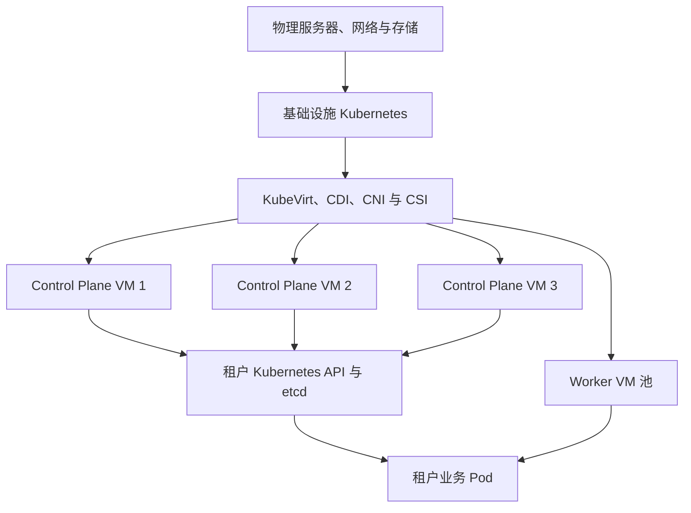
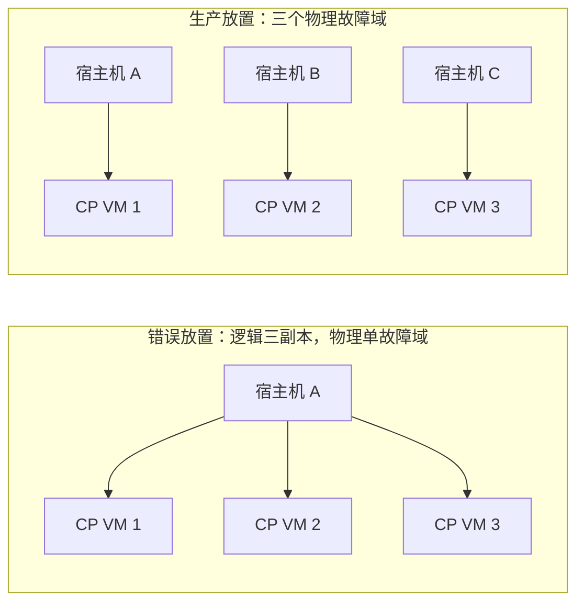
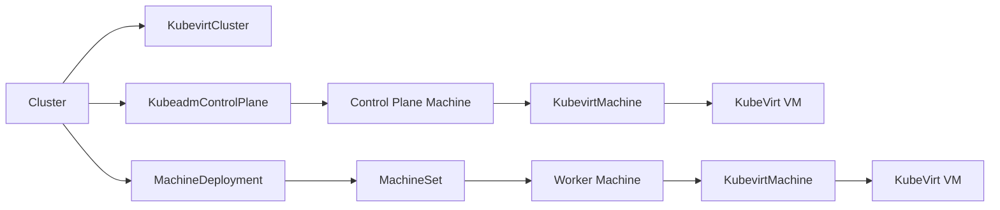

# 在 KubeVirt 上运行 Kubernetes：架构边界、生产设计与 AI 场景取舍

先建设一套 Kubernetes，在其中安装 KubeVirt，再把虚拟机作为另一批 Kubernetes 集群的控制面和 Worker，这套架构是成立的。它可以把底层 Kubernetes 变成一套 Kubernetes 原生的 IaaS：物理资源、虚拟机和租户集群都通过声明式 API 管理，同时让每个租户拥有独立的 Kubernetes API、版本、节点操作系统和集群管理员权限。

这并不是在容器里再嵌套一套容器编排。Guest Kubernetes 的节点是由 KVM/QEMU 运行的完整虚拟机；底层 Kubernetes 负责调度承载虚拟机的 `virt-launcher` Pod，Guest Kubernetes 再调度业务 Pod。硬件虚拟化仍然只有一层，但控制面、调度器、网络和存储出现了上下两层。

KubeVirt 的职责是把虚拟机接入 Kubernetes API，调度、网络和存储继续委托给底层 Kubernetes。批量创建和升级 Guest 集群时，可以使用 Cluster API Provider KubeVirt（CAPK）管理虚拟机节点生命周期。[KubeVirt Architecture](https://kubevirt.io/user-guide/architecture/)、[Cluster API Provider KubeVirt](https://github.com/kubernetes-sigs/cluster-api-provider-kubevirt)

本文讨论生产架构及验收方法，不包含虚拟化性能实测。CPU、网络和存储开销应在目标硬件、CNI、CSI 与真实业务负载上测量，不能从通用比例直接推导。

## 1. 先明确这套架构解决什么问题



这里有两个不同的管理边界：

| 层次 | 管理对象 | 主要控制器 | 典型故障 |
| --- | --- | --- | --- |
| 基础设施层 | 物理节点、VMI、PVC、VM 网络 | kube-scheduler、KubeVirt Controller、CSI/CNI 控制器 | 宿主机故障、VMI Pending、PVC 拓扑不满足、迁移失败 |
| 租户集群层 | Node、Pod、Service、租户 PVC | Guest kube-scheduler、Controller Manager、租户 CNI/CSI | Node NotReady、Pod Pending、Service 不通、租户卷挂载失败 |

它适合交付真正独立的 Kubernetes 集群：

- 不同团队需要独立 Kubernetes 版本、CNI、CSI、内核或容器运行时；
- 租户需要 `cluster-admin`，同时不能获得基础设施集群权限；
- 需要快速创建、销毁开发集群、测试集群或 CI 集群；
- 正在把 VMware、OpenStack 一类 VM 工作负载迁移到 Kubernetes 管理面；
- 希望用 Cluster API 统一管理物理机、云主机和 KubeVirt VM 集群的生命周期。

如果只需要业务资源和权限隔离，共享集群的 Namespace、RBAC、ResourceQuota 和 NetworkPolicy 更省资源。需要独立 API、但可以共享宿主机内核时，可以评估 virtual cluster。低延迟 GPU、RDMA、DPDK 和高 IOPS 数据库通常更适合物理机集群。

| 方案 | Kubernetes API | 内核与 OS | CNI/CSI 自主权 | 单位资源成本 | 典型用途 |
| --- | --- | --- | --- | --- | --- |
| Namespace 隔离 | 共享 | 共享 | 共享 | 最低 | 同一平台内的普通团队隔离 |
| Virtual Cluster | 独立或逻辑独立 | 通常共享 | 受宿主集群约束 | 较低 | 开发测试、API 隔离 |
| KubeVirt Guest 集群 | 完整独立 | VM 独立 | 可独立选择 | 中等 | 集群即租户、版本和内核隔离 |
| 物理机 Kubernetes | 完整独立 | 物理节点独立 | 完整独立 | 较高 | GPU、RDMA、低延迟和强故障隔离 |

## 2. 双层调度改变了故障域

Guest 集群中的三个控制面节点可能在 `kubectl get nodes` 中完全独立，但底层 kube-scheduler 仍可能把对应的三个 VMI 放到同一台物理机。此时一台宿主机故障就会同时失去三个 etcd 成员。



Guest Pod 的反亲和规则看不到 VM 背后的物理节点。控制面 VM 的分散必须在基础设施层完成，并以租户集群 ID 和节点角色作为标签。下面是教学用的 VMI 亲和规则骨架：

```yaml
apiVersion: kubevirt.io/v1
kind: VirtualMachine
metadata:
  name: tenant-a-control-plane-1
spec:
  runStrategy: Always
  template:
    metadata:
      labels:
        platform.example.com/guest-cluster: tenant-a
        platform.example.com/guest-role: control-plane
    spec:
      affinity:
        podAntiAffinity:
          requiredDuringSchedulingIgnoredDuringExecution:
            - labelSelector:
                matchLabels:
                  platform.example.com/guest-cluster: tenant-a
                  platform.example.com/guest-role: control-plane
              topologyKey: kubernetes.io/hostname
      domain:
        resources:
          requests:
            cpu: "4"
            memory: 16Gi
```

生产平台还应执行以下约束：

1. 三个控制面 VM 分散到三个物理节点，有条件时继续跨机架或可用区分散；
2. Worker VM 使用拓扑分散，限制一个租户在单台宿主机上的节点数量；
3. 保留 N+1 宿主容量，使一台物理机维护或故障后仍能安置关键 VM；
4. 准入策略拒绝缺少租户集群标签、控制面反亲和及资源保证的模板；
5. 监控系统把 Guest Node、VMI、`virt-launcher` Pod 和物理节点关联起来。

KubeVirt 支持 NodeSelector、Affinity、Taint/Toleration 等节点放置方式；最终规则仍需结合底层 StorageClass 拓扑和可用区标签设计。[Node Assignment](https://kubevirt.io/user-guide/compute/node_assignment/)

## 3. 管理集群故障不一定立即停止业务，但会停止管理能力

底层 API Server 暂时不可用时，已经运行的 VMI 和 Guest 集群可能继续提供服务，因为 QEMU、Guest OS 和 Guest 控制面仍在宿主机上运行。但创建 VM、迁移、故障重建、控制器协调和扩缩容都会受影响。底层节点或存储同时发生故障时，缺少管理面的恢复能力会扩大影响。

因此需要分别定义两个 SLO：

| SLO | 要回答的问题 |
| --- | --- |
| Guest 服务可用性 | 底层管理面异常时，现有 Guest API 和业务还能服务多久 |
| 平台管理可用性 | 能否创建、替换、迁移、扩缩 VM，故障后多久恢复协调 |

这套架构的可靠性上限取决于整条链路：物理机、底层 Kubernetes、KubeVirt、CNI、CSI、Guest 控制面和 Guest 工作负载。Guest 三副本不会自动补偿底层单点存储或单点网络。

## 4. 在线迁移是维护工具，Guest 高可用仍靠副本和仲裁

KubeVirt 可以在线迁移 VMI，但不是所有网络、存储和设备组合都可迁移。PVC 后端的常规计算迁移通常要求共享 RWX 访问，使用 bridge Pod 网络绑定的 VMI 不能在线迁移；迁移网络、端口和源/目标节点主网络接口名也要满足条件。[KubeVirt Live Migration](https://kubevirt.io/user-guide/compute/live_migration/)

生产策略应遵循以下顺序：

- Guest 控制面先依靠三个 etcd 成员保持仲裁；
- 宿主机维护时一次迁移或重启一个控制面 VM；
- 迁移前检查 VMI 的 `LiveMigratable` 条件；
- 单独限制并发迁移数量和带宽，避免迁移流量冲击业务与存储；
- 验证迁移时 Guest Node Ready、API 延迟和 etcd leader 变化；
- 无法迁移的 VM采用受控关机、重新调度和 Guest 副本接管。

KubeVirt 的 MigrationPolicy 可以控制带宽、超时、pre-copy、post-copy 和并行迁移等行为，但文档中的 API 成熟度和字段可能随版本变化，应以部署版本为准。[Migration Policies](https://kubevirt.io/user-guide/cluster_admin/migration_policies/)

## 5. 网络路径需要同时设计两套 CNI

一条 Guest Pod 请求可能经过：

```text
Guest Pod
  → Guest CNI
  → VM virtio 网卡
  → tap / NAT / bridge
  → virt-launcher Pod 网络命名空间
  → 基础设施 CNI
  → 物理网络
```

网络设计最容易出现四类问题。

### 5.1 双重封装和 MTU

底层 VXLAN 再叠加 Guest VXLAN 时，报文会被两次封装。Guest CNI 的 MTU 应根据物理 MTU 扣除底层封装、VM 网络绑定和 Guest 封装开销：

```text
Guest Pod MTU ≤ 物理网络 MTU - 底层封装 - VM 网络开销 - Guest CNI 封装
```

应通过大包、Path MTU Discovery、跨宿主机 Service 和长连接实测，而不是只验证 `ping` 小包。

### 5.2 Guest API 的稳定入口

控制面 VM 地址会受到网络绑定、VMI 重建和 IPAM 策略影响。CAPK 或自研平台需要为 Guest API 提供稳定的 LoadBalancer 地址，并明确健康检查、证书 SAN 和控制面节点替换过程。

Cluster API 官方快速入门在 KubeVirt 场景中也强调：Workload Cluster 的 API Server 运行在 VM 内，需要通过 LoadBalancer Service 或等价外部负载均衡暴露。[Cluster API Quick Start](https://github.com/kubernetes-sigs/cluster-api/blob/main/docs/book/src/user/quick-start.md)

### 5.3 网络策略存在两个执行边界

底层 NetworkPolicy控制 VMI Pod 所在网络命名空间，Guest NetworkPolicy控制业务 Pod。平台需要分别管理两层规则，并明确东西向、南北向、DNS、镜像仓库和控制面端口。不能把底层 VMI 已隔离理解为 Guest 业务之间已经实现微分段。

### 5.4 迁移网络与租户流量

规模较大时应为在线迁移配置独立的物理网络和 Multus NetworkAttachmentDefinition，防止内存复制抢占 API、存储和租户业务流量。KubeVirt 支持 Pod 网络和 Multus 辅助网络，具体绑定方式会影响地址、性能和可迁移性。[Interfaces and Networks](https://kubevirt.io/user-guide/network/interfaces_and_networks/)

## 6. 存储不要把所有状态都塞进 VM 磁盘

Guest 集群很容易形成嵌套存储路径：

```text
业务 Pod PVC
  → Guest CSI 或节点文件系统
  → VM 虚拟磁盘
  → 底层 PVC
  → 底层分布式存储
```

这条路径可以工作，但数据库 I/O、容量扩展、快照一致性和故障定位会变复杂。建议先决定状态由谁拥有：

| 数据类型 | 推荐方式 |
| --- | --- |
| Guest OS 根盘 | CDI/DataVolume 或受管模板生成的底层 PVC |
| etcd 数据 | 独立快速磁盘，并执行 etcd 原生快照 |
| 普通临时数据 | VM 临时盘或 Guest ephemeral storage |
| 关键数据库 | 优先让 Guest CSI 访问独立存储服务，或使用明确性能边界的独立虚拟磁盘 |
| 备份 | Guest 应用备份、etcd 备份和 VM/PVC 备份分层执行 |

VM 快照不能替代 etcd 快照。运行中 VM 快照即使实现文件系统一致性，也未必得到应用一致的 etcd 状态；Guest 控制面恢复必须单独演练。KubeVirt 快照能力及其 CSI 前提可参考 [Snapshot Restore API](https://kubevirt.io/user-guide/storage/snapshot_restore_api/)，etcd 备份与恢复参考 [Operating etcd clusters for Kubernetes](https://kubernetes.io/docs/tasks/administer-cluster/configure-upgrade-etcd/)。

共享 RWX 存储有利于在线迁移，但可能增加时延与共享故障域；本地或拓扑绑定的 RWO 存储性能更直接，却会限制调度和维护。选择时要同时比较 Guest 工作负载性能、宿主机维护方式和恢复时间。

## 7. 双层资源核算会放大超卖风险

基础设施调度器看到的是 VM 的 CPU 和内存申请，Guest 调度器看到的是节点向 Guest 报告的 Allocatable。两层如果同时假设“业务不会用满”，同一份物理资源就可能被重复超卖。

控制面和 etcd VM 建议采用：

- CPU 与内存 requests/limits 对齐，维持 Guaranteed QoS；
- 不做内存超卖，为 QEMU、virt-launcher、内核和系统守护进程预留容量；
- 对延迟敏感的控制面启用 dedicated CPU，并在大规格 VM 上验证 NUMA 对齐；
- 把 VM 规格、Guest kubelet reserved 和 Guest Allocatable 纳入同一份容量模型；
- 监控宿主机 CPU steal、内存回收、Guest PSI 和 etcd 磁盘延迟。

KubeVirt 可以依赖 Kubernetes CPU Manager 把 Guest vCPU 固定到宿主机 pCPU；Dedicated CPU 要求 Guaranteed 资源、整数 CPU 等前提。[Dedicated CPU Resources](https://kubevirt.io/user-guide/compute/dedicated_cpu_resources/)

普通 Worker VM可以在真实利用率数据支持后适度 CPU 超卖，内存超卖应更谨慎。宿主机必须保留故障接管和迁移容量，不能把所有物理资源都卖给正常状态下的 VM。

## 8. 用 CAPK 管集群生命周期，而不是长期手工维护 VM

Cluster API 用 Kubernetes 风格 API 管理集群和 Machine 生命周期，CAPK 把 Machine 落成 KubeVirt VM。典型对象关系如下：



不同版本的 API Group 与字段可能变化，部署时应以 CAPK 对应 release 模板为准。平台应围绕 ClusterClass 或等价模板固化：

- Guest Kubernetes 版本和升级路径；
- OS 镜像、cloud-init/Ignition 配置及镜像摘要；
- 控制面与 Worker 的 VM 规格；
- CNI、CSI、kube-proxy 或替代实现；
- API LoadBalancer、DNS 和证书 SAN；
- 故障域标签、反亲和与 StorageClass；
- Cluster Autoscaler 或平台扩缩策略；
- 监控、日志、审计和备份代理。

节点升级优先采用不可变替换：创建新 VM、加入 Guest 集群、迁移工作负载，再删除旧 VM。长期在虚拟机内原地修改软件，会让声明模板与真实节点逐渐偏离。

升级顺序也要固定：基础设施 Kubernetes、KubeVirt、底层 CNI/CSI、Guest OS、Guest Kubernetes、Guest CNI/CSI。每层升级都应先通过一套 Canary Guest 集群验证，再逐批推进。

## 9. 安全边界比 Namespace 强，但平台管理员仍然是高权限角色

VM 提供独立内核和设备边界，能够降低租户之间因共享内核带来的风险。但基础设施集群管理员、KubeVirt 管理员和存储管理员通常仍能操作 VM Console、磁盘、快照或启动配置。

生产环境至少需要：

- 基础设施集群凭据与 Guest kubeconfig 完全分离；
- 限制 Console/VNC、磁盘挂载、快照、导出和 cloud-init 修改权限；
- 避免在 cloud-init 中长期保存静态密码和 Token；
- Guest 集群通过短期身份获取镜像仓库、制品和云 API 权限；
- 底层与 Guest 分别执行 NetworkPolicy、镜像准入和审计；
- 平台支持路径明确记录谁可以进入 Guest OS、读取磁盘或重置凭据；
- 同时维护底层节点、KubeVirt、Guest OS 和 Guest Kubernetes 的漏洞修复节奏。

租户获得 Guest `cluster-admin`，并不等于获得 KubeVirt Namespace 或基础设施集群权限。平台 API 应只暴露经过约束的 ClusterClass、VM 规格和生命周期动作。

## 10. 可观测性要能从业务 Pod 一路定位到物理机

只监控 Guest Kubernetes 会把底层故障表现成普通的 Node NotReady；只监控底层 KubeVirt 又无法判断 Guest API、etcd 和业务是否受影响。建议建立统一关联键：

```text
tenant_id
  ↔ guest_cluster_id
  ↔ Cluster API Machine
  ↔ KubevirtMachine / VirtualMachine / VMI
  ↔ virt-launcher Pod
  ↔ physical_node
```

| 层次 | 最低观测内容 |
| --- | --- |
| 物理层 | Node Ready、CPU/内存/磁盘/网卡、KVM、硬件故障、容量水位 |
| 基础设施 Kubernetes | API、etcd、scheduler、CNI、CSI、Pod Pending 与驱逐 |
| KubeVirt | VM/VMI Phase、启动时延、迁移状态、Guest Agent、vCPU、内存、磁盘和网络 |
| Guest Kubernetes | API、etcd、Node Ready、Pod 调度、CNI、CSI 和证书 |
| 业务层 | SLI、请求延迟、错误率、任务进度与数据正确性 |

告警事件应自动补充上下层上下文。例如 Guest Node NotReady 告警同时带出对应 VMI Phase、物理节点状态、PVC、最近迁移和底层 CNI 事件。监控平台本身不要只运行在它负责监控的某个 Guest 集群中。

KubeVirt 暴露组件和 VMI 指标，具体指标名应以目标版本的 `/metrics` 与监控文档为准。[KubeVirt Component Monitoring](https://kubevirt.io/user-guide/user_workloads/component_monitoring/)

## 11. AI 和 GPU 集群要单独做取舍

对于开发测试、普通 CPU 服务、独立控制面和兼容性验证，KubeVirt Guest 集群的隔离收益通常高于其开销。GPU 和高速网络场景则多了一层设备与拓扑映射：

```text
底层设备发现与分配
  → KubeVirt Host Device / GPU passthrough / vGPU
  → Guest OS 驱动
  → Guest Device Plugin
  → Guest Pod 申请 GPU
```

这会把 GPU 型号、IOMMU Group、PCIe/NUMA、驱动、vGPU Profile、RDMA 网卡和调度约束同时放进两层控制面。设备直通也经常限制在线迁移。

| AI 负载 | 建议 |
| --- | --- |
| Notebook、普通开发机、CPU 推理 | 可以优先评估 KubeVirt |
| 独立 Kubernetes 版本兼容测试 | 很适合 KubeVirt Guest 集群 |
| 小规模、无 RDMA 的单卡实验 | 在验证直通和恢复后使用 |
| 多卡训练、TP/EP 分布式推理 | 优先物理机 Kubernetes |
| H20、A800 等跨机 RDMA 负载 | 优先保持 GPU、NIC 和 NUMA 的直接拓扑 |
| GPU 租户需要完整集群管理员权限 | 独立物理 GPU 集群，或先用 PoC 证明虚拟化损耗与恢复能力 |

一种较稳妥的企业架构是：KubeVirt 负责批量交付 CPU 型租户集群、管理工具和兼容性环境；GPU/RDMA 生产集群继续运行在物理机，通过统一门户、身份、GitOps 和多集群管理接入。这样不会让所有业务都承担 GPU 直通与双层调度的复杂度。

## 12. 一套可落地的生产参考架构

基础设施层建议：

- 独立高可用 Kubernetes 控制面；
- 至少三个物理故障域，虚拟化 Worker 保留 N+1 容量；
- KubeVirt、CDI、底层 CNI/CSI 使用经过验证的版本组合；
- 控制面 VM 使用低时延存储，迁移流量使用独立网络；
- LoadBalancer、DNS、NTP、镜像仓库和备份不依赖单个 Guest；
- CAPK、GitOps 和策略引擎负责模板与准入；
- 独立于 Guest 的监控、日志和审计平台。

单个生产 Guest 集群建议从以下基线开始：

- 三个控制面 VM，分别落在三个物理节点；
- 三个或更多 Worker VM，根据业务设置拓扑分散；
- 控制面 VM使用 Guaranteed CPU/内存及独立磁盘；
- Guest API 使用稳定 LoadBalancer 地址；
- 独立执行 etcd 快照和 Guest 工作负载备份；
- 节点镜像、Kubernetes 版本和 CNI/CSI 全部进入声明式模板；
- 扩容、缩容、升级和删除均通过 Cluster API 流程完成。

## 13. 上生产前必须通过的故障实验

| 实验 | 操作 | 验收重点 |
| --- | --- | --- |
| 物理节点掉电 | 关闭承载一个 Guest 控制面的宿主机 | Guest etcd 保持多数派，API 和业务影响符合 SLO |
| 宿主机维护 | drain 一个承载多租户 VM 的节点 | 迁移/重启受到并发限制，没有同时破坏同一 Guest 多数派 |
| 底层 API 故障 | 暂停基础设施 API 或控制器 | 现有业务行为、管理能力降级和恢复时间符合定义 |
| 存储抖动 | 注入延迟、限速或路径故障 | etcd fsync、Guest Node、数据库和迁移影响可观测 |
| 网络 MTU | 跨节点发送接近上限的大包与长连接 | 无静默丢包、重传风暴和 Service 异常 |
| 在线迁移 | 在 API 与 etcd 负载下迁移控制面 VM | VMI 条件、API P99、leader 变化和中断时间有记录 |
| Guest 升级 | 替换控制面和 Worker VM | 版本偏差、PDB、工作负载迁移和回滚路径通过 |
| 备份恢复 | 恢复 Guest etcd、VM 磁盘和业务数据 | 能在另一组宿主资源上重建，而不只恢复 PVC 对象 |
| 噪声邻居 | 对同宿主 VM施加 CPU、内存和 I/O 压力 | 关键 Guest 延迟仍满足 SLO，容量保护能够触发 |
| 安全边界 | 租户尝试访问底层 API、Console 与其他磁盘 | 权限被拒绝并产生审计记录 |

如果测试只覆盖“VM 能开机、kubeadm 能成功”，只能证明功能链路打通。能否安全承载生产集群，要看物理故障域、仲裁、维护、备份和双层资源竞争是否真正通过验证。

## 14. 最后的选型判断

可以用四个问题决定是否引入这套架构：

1. 租户是否确实需要独立内核、OS、Kubernetes 版本或 `cluster-admin`？
2. 团队是否愿意同时运维底层 Kubernetes、KubeVirt 和 Guest Kubernetes？
3. 网络、存储与监控能否贯通物理节点、VMI 和 Guest 三层身份？
4. 目标负载能否接受 VM 网络、I/O 与设备映射带来的成本？

前三个问题回答清楚，且目标以独立 CPU 集群、开发测试或私有云交付为主，KubeVirt + CAPK 是合理的 Kubernetes 原生方案。目标以 GPU/RDMA 性能、极低 I/O 时延或最小故障耦合为主时，物理机集群通常更直接。

决定成败的并不是 VM 里能不能安装 Kubernetes，而是 Guest 的高可用能否映射到真实物理故障域，以及平台能否把两层网络、存储、资源和生命周期作为一个系统持续运营。

## 参考资料

- [KubeVirt Architecture](https://kubevirt.io/user-guide/architecture/)
- [KubeVirt Virtual Machines](https://kubevirt.io/user-guide/user_workloads/virtual_machines/)
- [Cluster API Provider KubeVirt](https://github.com/kubernetes-sigs/cluster-api-provider-kubevirt)
- [Cluster API Quick Start](https://github.com/kubernetes-sigs/cluster-api/blob/main/docs/book/src/user/quick-start.md)
- [KubeVirt Live Migration](https://kubevirt.io/user-guide/compute/live_migration/)
- [KubeVirt Interfaces and Networks](https://kubevirt.io/user-guide/network/interfaces_and_networks/)
- [KubeVirt Dedicated CPU Resources](https://kubevirt.io/user-guide/compute/dedicated_cpu_resources/)
- [KubeVirt Snapshot Restore API](https://kubevirt.io/user-guide/storage/snapshot_restore_api/)
- [Operating etcd clusters for Kubernetes](https://kubernetes.io/docs/tasks/administer-cluster/configure-upgrade-etcd/)
