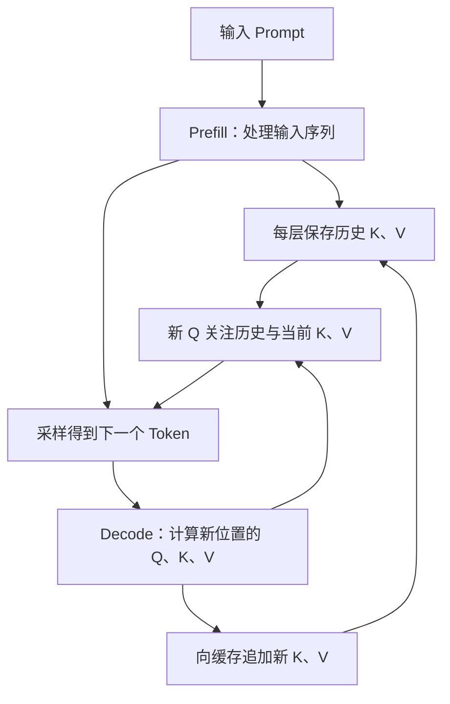
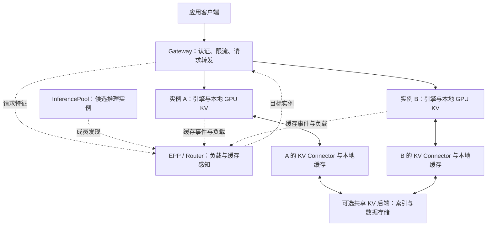

# KV Cache 综述：从 Attention 原理到 Kubernetes 推理架构

大模型每生成一个新 Token，都需要利用前面的上下文。KV Cache 保存了这些上下文已经算出的注意力中间状态，让模型可以继续生成，而不必从头计算整个序列。它是自回归推理的基础，也直接影响长上下文容量、并发数量和首 Token 延迟。

当服务扩展到多个 GPU、多个 Pod 和多个节点，问题进一步变成：缓存放在哪里，请求应该去哪里，搬运缓存是否比重新计算划算，以及实例退出后哪些状态能够恢复。此时，KV Cache 就从引擎内部的显存管理问题，延伸到了 Kubernetes 推理平台的架构设计。

本文先解释原理与容量，再讨论应用方式，最后给出 Kubernetes 上的部署取舍。容量数字和路由时间示例均为明确假设下的计算；已有实测单独注明来源。本文以**因果、自回归 Transformer 推理**为主，混合注意力、MLA 和其他架构需要按实际状态结构调整。

## 1. KV Cache 到底缓存了什么

### 1.1 从 Q、K、V 理解注意力

在一个注意力层里，每个 Token 的隐藏表示会经过投影，得到三组向量：

| 向量 | 名称 | 在注意力中的作用 |
| --- | --- | --- |
| Q | Query，查询 | 当前 Token 用它寻找需要关注的上下文 |
| K | Key，键 | 历史 Token 用它参与相关性计算 |
| V | Value，值 | 相关性变成权重后，对这些内容向量加权求和 |

省略批次和多头维度，注意力的核心计算可以写成：

```text
Attention(Q, K, V) = softmax(Q × Kᵀ / √d + causal_mask) × V
```

这里的 Key、Value 是张量，不能把 KV Cache 理解为保存问答结果的普通键值数据库。公式中的因果遮罩确保一个位置只能关注它自己和之前的位置。相关定义见 [Transformer 原论文](https://arxiv.org/abs/1706.03762)。

### 1.2 为什么历史 K、V 能重复使用

假设上下文是“请介绍 Kubernetes”，模型已经处理完这些 Token。下一步处理新 Token 时，模型参数和此前的输入没有变化；在通常的因果注意力和一致的位置编码配置下，旧位置的 K、V 也不会因为追加 Token 而改变。

因此，每一层可以保存旧 K、V，只为新位置计算 Q、K、V，再让新 Q 去关注已经保存的 K、V。旧 Q 用于计算旧位置的输出，后续位置不需要再次用它，因此通常不缓存 Q。这个过程发生在各个注意力层，而不只是模型入口。参见 [Hugging Face 的缓存原理说明](https://huggingface.co/docs/transformers/en/cache_explanation)。



Prefill 处理输入序列，并产生预测首个输出 Token 所需的结果；Decode 随后反复处理新位置。Prefill 经常更偏计算密集，Decode 在小批次下经常更受内存带宽限制，但实际瓶颈还取决于模型、批次、上下文长度和并行通信。

**有了 KV Cache，长上下文仍然有成本。** 对普通全注意力来说，每个新位置仍要读取并关注历史 K、V。缓存省去了历史位置的重复计算，没有消除这部分随上下文增长的访问量。[FlashAttention](https://arxiv.org/abs/2205.14135) 主要优化注意力计算的内存访问，PagedAttention 主要改善 KV 的分配与管理，两者也不能直接等同于跨请求缓存。

### 1.3 四种“缓存”要分开看

| 缓存类型 | 保存内容 | 典型命中效果 |
| --- | --- | --- |
| 模型文件缓存 | 权重、Tokenizer 等制品 | 加快模型下载或启动加载 |
| KV Cache | 某个上下文在模型各层的中间状态 | 减少重复 Prefill，支撑后续 Decode |
| 回答缓存 | 完整响应或已有答案 | 可能直接返回结果，不再调用模型 |
| Embedding 缓存 | 文本或其他输入的向量表示 | 减少重复向量化计算 |

把模型权重预热到 NVMe，可以改善服务冷启动；这不意味着用户请求的 KV 已经预热。把对话记录保存到数据库，可以恢复应用会话；这也不意味着推理实例保留了对应的 KV。

## 2. KV Cache 为什么这么占显存

### 2.1 常见 MHA/GQA 模型的容量公式

对于各层形状一致、完整保存历史 K/V 的注意力模型，未考虑共享和分页开销时：

```text
KV 字节数 ≈ 2 × L × Hkv × D × S × ΣTi

L    = 注意力层数
Hkv  = 每层 KV Head 数量，不是 Query Head 数量
D    = 每个 Head 的维度（这里假设 K、V 相同）
S    = 每个元素的字节数，例如 BF16 为 2
Ti   = 第 i 条序列已经缓存的 Token 数
2    = K 和 V 两份状态
```

如果 B 条序列的长度都是 T，`ΣTi = B × T`。T 包括已经进入缓存的输入和生成内容，容量预算还要给尚未生成的输出留空间。

以下是假想 GQA 模型的算例，**不是某个模型的实测配置**：32 层、8 个 KV Head、Head Dimension 为 128、KV 使用 BF16。

```text
每 Token KV = 2 × 32 × 8 × 128 × 2
            = 131,072 bytes
            = 128 KiB
```

| 已缓存长度 | 单条序列 KV | 32 条独立序列 KV |
| --- | ---: | ---: |
| 8,192 Tokens | 1 GiB | 32 GiB |
| 32,768 Tokens | 4 GiB | 128 GiB |
| 131,072 Tokens | 16 GiB | 512 GiB |

这些数值不含权重、激活、通信 Buffer、CUDA Graph、分页尾部和分配器开销。也没有扣除共享前缀节省的物理块。服务能加载权重，只能说明“模型放得下”，不能据此推断长上下文并发也放得下。

### 2.2 架构会改变计算方式

| 架构或配置 | 对 KV 容量的影响 |
| --- | --- |
| MHA | Query Head 通常各有对应的 K/V Head |
| GQA | 多个 Query Head 共用一组 K/V；应使用 `num_key_value_heads` |
| MQA | 所有 Query Head 共用一组 K/V；并行部署时仍可能存在复制 |
| MLA | 通常缓存压缩后的潜在表示及位置相关状态，不能直接套完整 K/V 公式 |
| 滑动窗口注意力 | 对应层只保留窗口内的历史，需按层累计 |
| 全注意力与线性/循环层混合 | 同时存在不同种类的状态，需要按缓存组计算 |

GQA 的共享方式见 [GQA 论文](https://arxiv.org/abs/2305.13245)，MLA 的压缩思路见 [DeepSeek-V2 论文](https://arxiv.org/abs/2405.04434)。模型架构、引擎实现和实际启动日志中的缓存布局应相互核对。

Tensor Parallel 也不意味着单卡 KV 一定等于总量除以 TP。只有相关维度能被正确分片时，这个估算才成立；KV Head 少于并行度时可能复制，MLA 和混合模型还可能采用其他布局。显存最终应按 **rank** 核算。

### 2.3 KV 量化与权重量化是两件事

权重使用 FP8、INT4，不代表 KV 也使用相同精度。KV 从 BF16 改成 FP8，元素存储量理论上减半，但实际还包括缩放因子、对齐和元数据，并且需要注意力 Kernel 与模型共同支持。

KV 量化还会引入精度和校准问题，不能只根据显存下降就判断可用。具体 dtype、scale 和支持条件见 [vLLM Quantized KV Cache](https://docs.vllm.ai/en/latest/features/quantization/quantized_kvcache/)。

## 3. 从单次生成到跨请求前缀复用

### 3.1 PagedAttention：让显存按块使用

如果每条请求都预分配最大上下文的连续显存，大量空间会暂时空闲，长度各异的请求也容易形成碎片。PagedAttention 把逻辑序列映射到物理 KV Block，按需分配，并通过块表管理访问。

共享前缀可以让多条序列引用同一组物理块；发生分支写入时，由引擎处理引用计数、可写状态和必要的复制。它改善分配、共享和回收效率，**不会把张量本身自动压缩成更小精度**。原理见 [PagedAttention 论文](https://arxiv.org/abs/2309.06180)。

### 3.2 Prefix Cache：复用已经处理过的开头

单次请求的 KV 复用支撑逐 Token 生成。Prefix Cache 则在请求结束后，保留可复用的前缀状态，让后续请求跳过部分 Prefill。vLLM 的 Automatic Prefix Caching 和 SGLang 的 RadixAttention 都面向这类复用，分别采用块哈希和前缀树等管理方式。参见 [vLLM APC](https://docs.vllm.ai/en/latest/features/automatic_prefix_caching/) 与 [SGLang 论文](https://arxiv.org/abs/2312.07104)。

```text
请求 A：[固定系统指令][固定工具定义][同一份文档][问题 A]
请求 B：[固定系统指令][固定工具定义][同一份文档][问题 B]
        └──────────── 可复用的连续前缀 ────────────┘
```

通常复用的是**相同计算条件下，完全一致的 Token 前缀**，而不是语义相似的文字。如果同一段文档出现在不同的前置上下文之后，其 K/V 通常也会不同。任意片段复用、Cache Blending 等方案需要额外算法和支持，不能当作普通 APC 的默认能力。

块缓存一般以完整块为复用单位，尾部不足一块或输出预测所需的位置可能仍需计算。因此重复整个 Prompt，也不一定显示所有输入 Token 都被跳过。vLLM 的哈希还关联父前缀及 LoRA、多模态内容等额外信息，见 [APC 设计文档](https://docs.vllm.ai/en/latest/design/prefix_caching/)。

### 3.3 前缀命中主要改善哪段延迟

```text
TTFT ≈ 网关与预处理 + 排队
     + 缓存查询/必要的回载 + 未命中部分的 Prefill
     + 首 Token 生成与传输
```

前缀命中直接减少的是重复 Prefill。它不会自动减少模型还需要输出的 Token 数，也不会让后续每个 Decode 步骤都按命中比例加速。高负载下，Prefill 负载下降可能间接改善排队和整体吞吐；长输出任务的收益则可能较小。

## 4. 应用怎样更有效地使用 KV Cache

### 4.1 常见场景与 Prompt 组织

| 应用 | 容易复用的内容 | 实际限制 |
| --- | --- | --- |
| 多轮聊天 | 已有对话历史 | 截断、摘要重写和换模板会改变前缀 |
| Coding Agent | 系统指令、工具 Schema、重复的仓库上下文 | 工具列表顺序、文件内容变化会降低命中 |
| 同文档多问答 | 放在问题之前的同一份长文档 | 文档版本、顺序和权限域必须一致 |
| RAG | 稳定模板，以及相同顺序的检索内容 | 仅“来自同一知识库”并不足以共享前缀 |
| 批量任务 | 共同任务说明、Few-shot 示例 | 独立短输入的可节省计算量可能很少 |

在不改变指令含义和权限边界的前提下，把稳定、较长、经常重复的内容放在前面，把本次问题和变化信息放在后面。比如：

```text
system:
  你是 Kubernetes 文档助手。仅依据给定资料回答；不足时说明未知。

user:
  <reference version="v1">
  ……同一份经过授权、内容和顺序固定的长文档……
  </reference>
  <question>
  ……本次需要回答的问题……
  </question>
```

不要为了标记请求，把随机 UUID 或当前时间放到所有内容之前；这些信息可以放在请求元数据或日志关联字段里。如果业务确实需要时间参与推理，应保留正确语义，并接受相应的缓存变化。

多轮 API 通常仍需要提交服务要求的完整消息历史。Prefix Cache 是推理优化，不是应用会话数据库，也不能保证被淘汰或重启后仍能凭会话 ID 找回全部上下文。

### 4.2 在引擎中使用

对于已经能正常加载的兼容模型，vLLM 可以显式开启 APC：

```bash
vllm serve /models/example-model \
  --served-model-name example-model \
  --enable-prefix-caching
```

这里的模型路径是占位示例；并行度、最大上下文和其他加载参数沿用该模型已验证的配置。不同版本的默认开关可能变化，发布配置应记录明确参数。这个开关启用引擎内的前缀复用，不会创建跨 Pod 的缓存服务。参数见 [vLLM serve](https://docs.vllm.ai/en/latest/cli/serve/)。

SGLang 的 Radix Cache 负责本地前缀管理；扩展到主机内存和存储时，可使用 HiCache。其 GPU 层和主机内存层属于实例本地状态，跨实例共享需要接入相应存储后端。扩大一台实例的主机缓存，不会自动合并其他节点的内存。见 [SGLang HiCache 设计](https://docs.sglang.io/docs/advanced_features/hicache_design)。

## 5. 缓存放到 CPU、NVMe 或远端，什么时候划算

### 5.1 分层缓存的目的

GPU HBM 容量有限。可以把暂时不用、但预计还会复用的 KV 放到更大的主机内存、本地磁盘或共享缓存层，使用时再由 Connector 回载。这能延长可复用前缀的保留时间，但需要付出复制、查找和传输成本。

| 层级 | 价值 | 主要代价 |
| --- | --- | --- |
| GPU HBM | 直接服务注意力计算 | 容量有限，与活跃请求竞争 |
| 主机 DRAM | 扩大本机缓存容量 | GPU 与 CPU 间传输、Pinned Memory 和 NUMA 开销 |
| 本地 NVMe | 扩大容量、保留较冷前缀 | I/O 延迟、磁盘带宽、写放大和节点亲和 |
| 远端内存或存储 | 允许其他实例访问缓存 | 网络、索引、并发一致性和故障处理 |

在常见回载方案中，KV 需要回到 GPU 可用的布局后再参与计算；并不是给模型挂一块硬盘，就能让所有 Decode 步骤无代价地读取硬盘历史。

### 5.2 用时间判断，而不只看命中率

可用下面的简化关系评估一次回载，实际实现可能通过流水化重叠部分时间：

```text
回载开销 ≈ 查询 + 数据量 / 有效带宽 + 格式处理 + 同步
缓存净收益 ≈ 避免的 Prefill 时间 - 回载开销 - 新增排队
```

沿用前面的假想模型：32K Token 的 KV 为 4 GiB。若**实测有效路径带宽**达到 25 GiB/s，单次纯数据搬运的理想时间约为 `4 / 25 = 0.16 秒`；若只有 5 GiB/s，则为 0.8 秒。它们都还没计入排队、查找、多跳和格式处理，不能用网卡标称速率直接替换。

若相同前缀重新 Prefill 只需 0.1 秒，这两条回载路径未必值得；若需要数秒，缓存才可能带来明显收益。这是算例，不是硬件性能结论。还应考虑写入成本和未来复用次数：只使用一次的长 Prompt，会产生很大的缓存，却未必带来再次命中的价值。

## 6. 跨请求共享、P/D 分离与 KV 传输的区别

| 机制 | 目的 | 是否天然提供后续请求复用 |
| --- | --- | --- |
| 本地 Prefix Cache | 同一个引擎复用前缀 | 是，但受本地容量和生命周期限制 |
| 缓存感知路由 | 把请求送到已有前缀的实例 | 依赖目标实例本身支持复用 |
| KV Offload | 扩展缓存容量 | 取决于保留与检索机制 |
| P/D KV Transfer | 把本次 Prefill 结果交给 Decode Worker | 不必然；可能只是本次请求的交接 |
| 分布式共享 KV | 让不同实例发现并取回可复用状态 | 需要完整索引、数据面和兼容协议 |

Prefill/Decode 分离的价值，是让输入处理与持续生成能够分别配置和扩缩容，减少两类工作相互干扰；代价是请求路径和 KV 传输更复杂。短请求、低并发或网络不足时，新增成本可能超过收益，不能把 P/D 作为使用 KV Cache 的前置条件。参见站内 [分布式与 P/D 分离推理](distributed-serving.md)。

共享缓存还必须建立**计算身份与存储格式的兼容边界**：模型权重版本、Tokenizer、Chat Template、位置编码、Adapter、多模态输入、KV dtype、布局和分片规则等都需要纳入考量。相同模型名称不足以证明兼容；不同 TP 配置是否可共享，取决于后端是否支持分片转换。

vLLM 与 SGLang 即使加载同一份权重，也不能默认互读 KV。缓存组件需要明确支持对应的导出和回载格式。外部 Connector 的版本同样重要，见 [LMCache 与 vLLM 兼容说明](https://docs.lmcache.ai/getting_started/compatibility.html)。

## 7. Kubernetes 在这套架构里负责什么

### 7.1 三个调度层各司其职

| 层次 | 决定什么 | 使用什么信息 |
| --- | --- | --- |
| Kubernetes 调度与节点资源管理 | Pod 放在哪台节点、分配哪些资源 | GPU/CPU/内存、亲和性、存储与设备拓扑 |
| 推理请求 Router / EPP | 本次请求进入哪个引擎实例 | 模型、队列、前缀命中、缓存位置、SLO |
| 引擎内部 Scheduler | 哪些序列进入下一轮计算 | Token 预算、KV Block、Prefill/Decode 与抢占 |

原生 Kubernetes 调度器不会读取 Prompt，再判断哪个 Pod 有对应 KV。普通 Service 也不做前缀分析；`sessionAffinity: ClientIP` 只是按来源地址亲和，在 NAT、多用户共享入口等场景下，不能替代模型请求调度。

### 7.2 一个可组合的请求与缓存架构



实线表示请求或缓存数据路径，虚线表示选择、发现和状态信息。EPP 返回目标，由 Gateway 转发请求；KV 张量通过引擎和缓存数据面搬运，不应经过 Kubernetes API Server 或放进 ConfigMap/etcd。

Gateway API Inference Extension 提供 `InferencePool` 和端点选择的扩展约定。**创建 InferencePool 本身并不会启用前缀感知策略**，还需要兼容 Gateway、生产级 EPP、相应插件和引擎状态信号。项目当前把自带轻量 EPP 定位为一致性验证参考，并列出 llm-d Router 等生产实现，见 [官方项目说明](https://gateway-api-inference-extension.sigs.k8s.io/)。

### 7.3 不要只追求“命中最多的 Pod”

假设请求去 A 能节省 0.8 秒 Prefill，但 A 已排队 3 秒；B 没有缓存，却只需排队 0.1 秒。只按命中长度选择 A，会让首 Token 更晚。

合理的选择应同时估计：排队时间、未命中计算量、缓存所在层级、传输成本和 Decode 负载。缓存信息过期或索引暂时不可用时，应该能退回负载感知路由，并允许引擎重算。

llm-d 同时提供近似前缀路由和基于缓存事件的精确索引路线。前者根据请求历史估计亲和，后者跟踪缓存块的存放位置；它们的部署成本和信息准确性不同。参见 [llm-d Prefix-Cache Aware Routing](https://llm-d.ai/docs/dev/architecture/advanced/kv-management/prefix-cache-aware-routing)。

## 8. 在 Kubernetes 上部署时的关键细节

### 8.1 GPU、CPU、内存一起预算

Pod 的 GPU 数量和主机内存是不同资源。申请 `nvidia.com/gpu: 4` 不等于预留了足够的 CPU DRAM，也不等于获得任意指定数量的 GPU HBM。模型权重和 KV 的显存预算仍由引擎配置与实际分配决定。

以下只是 Deployment 的 **Pod Template 配置片段**，数值用于说明资源与探针的位置，不是某个模型的推荐规格，也不是完整可直接部署清单：

```yaml
spec:
  template:
    spec:
      containers:
        - name: inference
          resources:
            requests:
              cpu: "32"
              memory: 256Gi
              nvidia.com/gpu: "4"
            limits:
              cpu: "32"
              memory: 256Gi
              nvidia.com/gpu: "4"
          startupProbe:
            httpGet:
              path: /health
              port: 8000
            periodSeconds: 10
            failureThreshold: 180
          readinessProbe:
            httpGet:
              path: /health
              port: 8000
            periodSeconds: 5
```

示例启动探针预算约 30 分钟，应根据真实加载时间调整；健康路径也必须与引擎匹配。Readiness 应在模型能够服务请求时才成功。若还要求公共前缀预热完成，应额外定义就绪条件，普通健康接口不会自动验证缓存热度。探针行为见 [Kubernetes 探针配置](https://kubernetes.io/docs/tasks/configure-pod-container/configure-liveness-readiness-startup-probes/)。

若使用主机缓存，要把其容量、模型加载峰值、Pinned Memory、运行时和 Sidecar 一并计入内存预算。临时目录或共享内存也会消耗实际资源，不能只观察 GPU 显存是否够用。

### 8.2 四卡 Pod 特别需要关注拓扑

四张空闲 GPU 不一定构成通信良好的四卡组。它们可能跨 CPU NUMA 域、跨 PCIe Root Complex，或者与 RDMA 网卡距离不同。KV Offload 与 P/D 会进一步放大 GPU—CPU—NIC 路径的影响。

部署前应结合 `nvidia-smi topo -m`、NUMA 信息和实际带宽确认设备关系。Kubernetes 的 CPU Manager `static` 在满足条件时可以为 Guaranteed Pod 的整核 CPU 请求提供独占 CPU；Topology Manager 再协调设备和 CPU 等资源的拓扑提示。**仅在 YAML 中设置 requests=limits，并不会自动开启这些节点策略。**

`single-numa-node` 也不是所有 GPU 任务的通用答案：设备组合无法落在单一 NUMA 域时会导致准入失败；GPU Device Plugin/DRA、CPU 和内存策略是否提供并采用相应信息同样关键。NUMA 对齐也不等于已经优化 NVLink 组内带宽。见 [CPU Manager](https://kubernetes.io/docs/tasks/administer-cluster/cpu-management-policies/) 和 [Topology Manager](https://kubernetes.io/docs/tasks/administer-cluster/topology-manager/)，以及站内 [四卡任务的拓扑与碎片 GPU](../practices/gpu-topology-fragmentation-scheduling.md)。

### 8.3 存储卷解决生命周期，Connector 解决 KV 读写

| Kubernetes 存储方式 | 可以承载什么 | 需要明确的边界 |
| --- | --- | --- |
| `emptyDir` | Pod 生命周期内的临时文件或本地缓存 | 容器重启可保留，Pod 删除后清除；实际介质取决于节点配置 |
| `emptyDir.medium: Memory` | tmpfs 共享目录 | 消耗内存，不是 NVMe，也不自动成为引擎的主机 KV 池 |
| `hostPath` | 指定节点目录中的本地文件 | 换节点不可用，需要管理路径、容量和权限 |
| Local PV / PVC | 带节点亲和约束的本地存储 | 数据留在原节点，节点故障不会自动产生远端副本 |
| 共享文件系统 PVC | 后端支持时承载共享缓存文件 | 多节点能挂载，不等于缓存索引、并发写入和格式兼容已解决 |
| 专用缓存服务 | 远端内存或存储池 | 需要服务发现、配额、淘汰、网络和故障策略 |

卷生命周期见 [Kubernetes Volumes](https://kubernetes.io/docs/concepts/storage/volumes/)。引擎仍需通过 HiCache、KV Connector 等显式配置，将状态写入对应后端；仅把 PVC 挂到 `/cache` 不会触发 KV Offload。

文件留在 Pod 外，也不代表引擎重启后一定可以命中：还需要可恢复的索引、有效的版本指纹、完整的数据和启动恢复流程。服务身份固定的 StatefulSet 同样不能自动让显存中的 KV 持久化。

### 8.4 扩缩容必须考虑缓存冷暖

新副本的启动包含模型读取、分布式初始化、Kernel/CUDA Graph 准备，以及可能的缓存预热。它 Ready 后仍可能是“冷缓存实例”。Router 可以逐步分配流量；公共前缀是否主动预热，则取决于实际复用收益和权限边界。

缩容时先停止分配新请求，等待已有流式请求结束或达到明确的退出时限，再释放实例。共享缓存允许时可保留可复用前缀，但不意味着活跃 Decode 可以自动无缝迁移。Pod 崩溃后，通常需要从应用保存的上下文重算；涉及工具调用的 Agent，还必须在应用层处理重试与幂等。

HPA/KEDA 等扩缩容机制应接入能反映瓶颈的指标，例如等待 Token 数、排队时间、活跃流和 TTFT，而不只看 CPU 或 GPU 利用率。缓存命中提高后，相同请求数对应的计算量也会改变，扩容规则需要考虑这一点。

## 9. 当前社区值得关注的 KV Cache 项目

社区的 KV Cache 生态已经覆盖引擎本地复用、独立缓存管理、分布式存储、高速传输和 Kubernetes 请求调度。选型时先确定自己缺少哪一层，再寻找对应组件。

### 9.1 项目地图与社区关注度

下面按职责列出主要项目。GitHub Star 为 **2026-09-08 查询官方仓库 API 的近似快照**，用于辅助了解关注度，不代表生产装机量、性能或稳定性排名。SGLang、vLLM、Dynamo 等数值属于整个项目，不能当作其中 KV 功能的独立热度。

| 项目与官方仓库 | 主要层次 | 关注度快照 | 优先关注的问题 |
| --- | --- | ---: | --- |
| [vLLM](https://github.com/vllm-project/vllm) | 推理引擎、本地 KV 管理 | 91.2k | Paged KV、APC、引擎与外部 Connector 的接口 |
| [SGLang / HiCache](https://github.com/sgl-project/sglang) | 推理引擎、分层缓存 | 35.6k | Radix 前缀复用及 GPU—主机—存储层管理 |
| [LMCache](https://github.com/LMCache/LMCache) | 独立 KV 缓存管理层 | 11.7k | KV 保存、检索、回载及多种存储后端 |
| [NVIDIA Dynamo / KVBM](https://github.com/ai-dynamo/dynamo) | 推理框架、分层块管理 | 8.0k | 路由、P/D 与受支持的缓存后端组合 |
| [Mooncake](https://github.com/kvcache-ai/Mooncake) | 分布式缓存与传输 | 6.5k | 跨节点内存/存储池和高效 KV 搬运 |
| [AIBrix](https://github.com/vllm-project/aibrix) | Kubernetes 推理基础设施 | 5.1k | 路由、扩缩容、运行时及分布式 KV 集成 |
| [llm-d](https://github.com/llm-d/llm-d) | Kubernetes 分布式推理 | 4.5k | EPP、缓存事件索引、路由与分离式推理 |
| [NIXL](https://github.com/ai-dynamo/nixl) | 推理数据传输库 | 1.2k | CPU/GPU/存储之间的数据传输抽象 |
| [FlexKV](https://github.com/taco-project/FlexKV) | 多级 KV 管理与分布式存储 | 339 | CPU/SSD 分层、GDS 和引擎适配 |
| [InfiniStore](https://github.com/bytedance/InfiniStore) | 分布式 KV 存储后端 | 436 | RDMA 缓存池、跨节点复用和 P/D 交接 |

前八项可以作为了解主流推理生态的主要入口。FlexKV 和 InfiniStore 的社区体量较小，但具有明确的 KV 存储与集成价值，适合作为补充候选。查询时上述仓库均未归档；InfiniStore 的仓库最近推送时间停留在 2025 年 11 月，采用前尤其需要复核当前依赖兼容性。维护状态应结合发布记录、问题响应和上游集成一起判断。

### 9.2 LMCache：给推理引擎增加独立缓存管理层

LMCache 聚焦 KV 的保存、检索、回载和复用，通过 Connector 接入引擎，再连接本地或远端后端。对于已经运行 vLLM、希望延长长前缀保留时间，或让多个实例访问外部 KV 的团队，它是值得优先了解的独立缓存项目。

其 MP（多进程）模式把缓存管理放到独立进程中，使推理进程和缓存进程可以具有不同生命周期。部署在 Kubernetes 时，需要同时考虑两者的内存预算、通信与存储；如果仍放在同一个 Pod，删除 Pod 依然可能让它们一起退出。独立进程本身不等于跨节点持久化。入口见 [LMCache 项目说明](https://github.com/LMCache/LMCache) 和 [Quickstart](https://docs.lmcache.ai/getting_started/quickstart.html)。

LMCache 生态还包含 CacheBlend 方向：对非完整前缀匹配的检索片段，结合局部重计算处理上下文变化。它与普通 APC 的精确前缀复用不同，需要按模型、位置处理和质量要求单独验证，不能把“支持 RAG”理解为任意片段都可以直接拼接 KV。参见 [LMCache Blending](https://docs.lmcache.ai/kv_cache_optimizations/blending.html)。

### 9.3 Mooncake：区分 Transfer Engine 与 Store

Mooncake 起源于 Moonshot/Kimi 的 KV Cache 中心化推理架构。理解它时，要分清两项能力：

| 子组件 | 主要职责 | 单独启用后的边界 |
| --- | --- | --- |
| Transfer Engine | 在设备或节点间高效搬运数据，支持 RDMA 等路径 | 完成一次传输，不代表数据会长期保留或可被下一请求发现 |
| Mooncake Store | 对缓存对象进行存放、查找和管理，组织分布式资源 | 还需要引擎侧的键映射、布局适配与回载逻辑 |

因此，“P/D 使用 Mooncake 传输”与“接入 Mooncake 共享缓存池”是两种配置目标。它可以服务 SGLang 的缓存后端，也可以与 LMCache 组合；两者不是必须二选一。官方已有 [Mooncake 与 LMCache 集成说明](https://github.com/kvcache-ai/Mooncake/blob/main/docs/source/deployment/integrations/lmcache/index.md)，Store 设计见 [Mooncake Store](https://github.com/kvcache-ai/Mooncake/blob/main/docs/source/design/store/mooncake-store.md)。

在 Kubernetes 上，采用共享池时应显式规划缓存服务、元数据和推理 Pod 的关系，以及节点内存、网卡、网络可达性和故障域。部署成本取决于所选 Store 模式和传输路径，不只是安装一个 Python 包。

### 9.4 SGLang HiCache：沿引擎原生前缀管理扩展层级

如果已采用 SGLang，HiCache 是理解分层 KV 的自然入口。它在 Radix 前缀管理基础上，把 GPU、本地主机内存和存储后端组织起来，并提供预取、回写等策略。跨实例共享取决于存储层的配置；本地 DRAM 层不会自动合并成全集群内存池。参见 [HiCache 设计与后端说明](https://docs.sglang.io/docs/advanced_features/hicache_design)。

HiCache 属于 SGLang 的引擎能力，不是一个让所有推理引擎通用访问的独立缓存服务。Kubernetes 侧主要负责提供所需内存、卷和后端服务，再由引擎参数接通数据路径。

### 9.5 Dynamo、KVBM 与 NIXL：框架、块管理和传输各有职责

这三个名字经常一起出现，但对应的层次不同：

| 名称 | 角色 | 选型时重点核对 |
| --- | --- | --- |
| Dynamo | 分布式推理框架，组合路由、执行与数据路径 | 引擎、部署模式、P/D 与平台运维方式 |
| KVBM | Dynamo 生态中的 KV Block 管理组件 | 受支持引擎、缓存层级、回载路径和模型格式 |
| NIXL | 面向推理的通信与数据传输库 | Backend、内存注册、网络和存储插件 |

NIXL 为 CPU/GPU 内存及文件、块、对象存储等提供可扩展的传输抽象。它可以被上层缓存或推理系统使用，**单独部署 NIXL 不会自动获得前缀索引、租户配额和缓存感知路由**。参见 [NIXL 官方说明](https://github.com/ai-dynamo/nixl)。

Dynamo 的 KV Offloading 文档还列出 LMCache、FlexKV、HiCache 等接入路线。应根据引擎支持矩阵选择一条相应的缓存管理路径，再配置其后端；不应把这些名字都当成 L1/L2/L3 依次堆叠。尤其不能从“Dynamo 支持某引擎”推导出“KVBM 也支持该引擎”。参见 [Dynamo KV Offloading](https://docs.nvidia.com/dynamo/latest/kubernetes/kv-cache-offloading/overview) 与 [官方后端选择说明](https://github.com/ai-dynamo/dynamo/blob/main/docs/fern/pages/cli/kv-cache-offloading/overview.mdx)。

### 9.6 llm-d 与 AIBrix：把缓存能力接入 Kubernetes 服务链路

llm-d 更适合从“多副本请求应该去哪里”这个问题切入。其 KV 相关组件覆盖前缀感知路由、事件索引、Offload 集成，以及特定配置下的 P2P 复用。EPP 和索引掌握位置与负载信息，实际张量保存、搬运和恢复由模型服务与 Connector 完成。它不要求所有缓存数据都先集中到一个中央存储。参见 [llm-d KV Cache Management](https://llm-d.ai/docs/dev/architecture/advanced/kv-management)。

AIBrix 则把 KV Cache 放在更广的推理基础设施中，与 Gateway、LLM 专用扩缩容、运行时 Sidecar 和分布式服务能力结合。已有 AIBrix 控制面的团队，可以优先评估其缓存集成与现有路由、指标的协作。公开能力列表见 [AIBrix](https://github.com/vllm-project/aibrix)，集群接入示例见站内 [AIBrix 实战](../practices/aibrix-existing-cluster.md)。

两者的关注点都超出了独立 KV 存储。平台选型应考虑已有 Gateway、控制器和观测体系；同一请求路径上的路由策略、缓存目录和扩缩容决策需要明确由谁负责。

### 9.7 FlexKV 与 InfiniStore：值得补充评估的专用项目

**FlexKV** 由腾讯云 TACO 团队与社区共同开发，面向多级 KV 管理与分布式推理。公开实现包含 CPU/SSD 层、GDS、Mooncake Transfer Engine 集成，并提供 vLLM、TensorRT-LLM 和 Dynamo 等适配说明。它适合关注分层容量、SSD 数据路径和既有 TACO/Dynamo 体系的团队。GDS、共享存储和特定引擎布局均有环境条件，应按实际适配文档配置。参见 [FlexKV](https://github.com/taco-project/FlexKV)。

**InfiniStore** 是字节跳动开源的 KV 存储项目，面向推理节点间传输、扩展缓存池和跨节点复用。其 README 给出的 vLLM 路线经由 LMCache 集成，因此更适合按“缓存后端候选”来评估。部署时需要检查 RDMA 环境和当前 LMCache 接口；README 中标为推进中的引擎集成，不能当作已完成支持。参见 [InfiniStore](https://github.com/bytedance/InfiniStore)。

### 9.8 项目怎样组合

以下是依据官方接口关系整理的选型入口，不是所有模型都已验证的兼容清单：

| 已有环境或需求 | 可以优先了解的组合 | 需要承担的额外工作 |
| --- | --- | --- |
| 单个 vLLM 实例，希望复用系统前缀 | vLLM APC | 控制上下文与容量，观察命中收益 |
| vLLM 需要外部缓存 | vLLM + LMCache，或所支持的原生 Offload 路径 | Connector 版本、主机内存/存储和回载正确性 |
| SGLang 需要扩大缓存层级 | SGLang HiCache；共享时按需接 Mooncake 等后端 | 回写/预取策略、后端部署和共享域 |
| 已有 LMCache，需要分布式缓存池 | LMCache + Mooncake Store；按支持范围评估其他后端 | 元数据、网络、容量、淘汰与可用性 |
| Kubernetes 多副本缓存命中不稳定 | llm-d 或已有 AIBrix 路由体系 + 引擎缓存信号 | Gateway/EPP 集成、索引时效与队列平衡 |
| 希望统一规划路由、P/D 与缓存 | Dynamo + 与引擎匹配的缓存路径 | 支持矩阵、网络、控制面和可观测性 |
| 自研 KV 数据面，需要高效传输 | NIXL 或 Mooncake Transfer Engine | 上层索引、生命周期、隔离和调度仍需实现 |

理解这些项目时，最有用的四个问题是：**谁判断前缀相同，谁知道缓存位置，谁搬运张量，谁决定请求去向。** 能回答这四个问题，才容易识别组件之间的真实依赖，也能避免重复部署功能重叠的系统。

## 10. 如何判断优化是否真正有效

### 10.1 同时看延迟、容量与实际节省的计算

| 观察项 | 要回答的问题 |
| --- | --- |
| TTFT 的 P50/P95/P99 | 首 Token 是否更快，尾延迟有没有恶化 |
| TPOT/ITL、端到端延迟 | 回载或大 Prefill 是否干扰持续生成 |
| 成功率和满足 SLO 的吞吐 | 节省计算有没有转化为用户可用的容量 |
| 输入 Token、命中 Token、实际 Prefill Token | 到底跳过了多少计算 |
| GPU 命中与外部层命中 | 收益来自本地热缓存，还是确实发生了回载 |
| KV 使用量、可回收块、淘汰与抢占 | 缓存是否挤占了活跃请求空间 |
| 回载/写入字节、延迟和带宽 | 搬运是否成为新的瓶颈 |
| 副本队列与请求分布 | 缓存亲和是否制造热点 |

请求命中率和 Token 命中率的含义不同。一百个请求各命中一个很短的系统前缀，可以有很高的请求命中率，却没节省多少 Prefill。指标名称及分母因引擎而异，应按所用版本解释，不能把不同层的命中数直接相加当成有效吞吐。

比较结果还需保持模型、输入/输出长度、并发和精度等条件一致，并区分冷请求、本地热命中与外部回载。反复请求同一个 Prompt 得到的热缓存成绩，不能代表低重复率的真实流量。

### 10.2 已有实测提醒：命中不等于回载正确

站内的 [DeepSeek V4 分布式 KV Cache 实测记录](../practices/distributed-kv-cache-deepseek-v4.md) 包含一个具体反例：单节点 8 卡 H20，使用 `LMCacheMPConnector + Host DRAM`，固定输入为 5,142 Tokens，预期输出 `CACHE_OK`。

冷请求和 GPU 本地热命中输出正确；只清除 GPU 本地前缀、保留外部缓存后，指标显示 **5,120 Tokens 外部命中**，回载后的输出却损坏。通用 `fp8` 和显式 `fp8_ds_mla` 两种配置均未通过该次校验。环境还发现 CUDA 与 LMCache wheel 不匹配的问题，但这些观察不足以确定唯一根因。

这个结论仅适用于记录中的版本组合和模型路径，不能外推为所有 LMCache 回载都会失败。它说明：Store、Hit 和 Transfer 计数能证明走了数据路径，**还需要输出或数值正确性验证，才能证明这些 KV 可以用于推理**。长上下文、量化和混合状态模型尤其需要关注这一点。

### 10.3 缓存也有租户和数据生命周期

KV 是输入内容的模型中间表示，不能因为它不是明文，就当成不敏感的数据。缓存共享域应与模型版本、租户或明确的信任组一致，并设置容量配额、淘汰/过期及访问控制。

vLLM 支持请求级 `cache_salt` 来隔离前缀复用。平台可由可信网关按已认证租户设置和覆盖该值，避免任意客户端自行选择其他租户的共享域。它只解决相应的前缀键隔离，不能替代后端权限或传输保护。参见 [vLLM 安全文档](https://docs.vllm.ai/en/latest/usage/security/)。

## 11. 部署时如何选择复杂度

下面是基于前文机制的工程建议，最终取舍应由实际工作负载的延迟、复用率和资源成本决定。

| 主要现象 | 优先考虑 | 引入更复杂方案的依据 |
| --- | --- | --- |
| 单实例、重复系统指令或文档 | 引擎本地 Prefix Cache，规范 Prompt 前缀 | 本地缓存不足，且仍有明显可复用数据 |
| 多副本，同一前缀被重复计算 | 兼顾队列的缓存感知路由 | 缓存亲和能节省 Prefill，且不造成热点 |
| 对话间隔较长，GPU 热缓存留不住 | 主机 DRAM Offload，再评估 NVMe | 回载成本低于重算，主机资源有余量 |
| 经常跨实例恢复长上下文 | 共享 KV 后端、版本化索引和配额 | 足够高的复用收益覆盖网络与运维成本 |
| 长输入明显干扰持续生成 | P/D 分离与匹配的数据传输路径 | 分离后的 SLO 收益超过交接开销 |
| 短 Prompt、低重复、大量长输出 | 先优化 Decode、批处理与容量 | 外部 KV 不应成为默认投入方向 |

对 Kubernetes 平台，通常可以先把单个推理实例的容量和本地复用做好，再解决多副本请求去向，最后按收益扩展缓存层级。涉及四卡或多卡 Pod 时，把 GPU 互联、CPU NUMA、网卡亲和和主机内存预算作为同一项部署设计；配置好缓存路径的同时，也要确保它实际经过的硬件路径具有足够带宽。

进一步阅读：[LLM 推理性能优化](optimization.md)、[AI Gateway 与智能路由](gateway-routing.md)、[分布式与 P/D 分离推理](distributed-serving.md)、[AI 数据、存储与缓存](../data-storage.md)。
