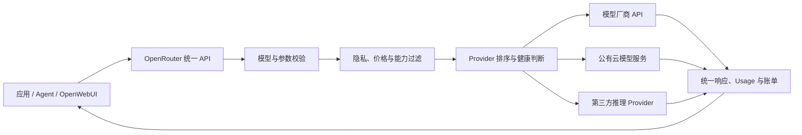
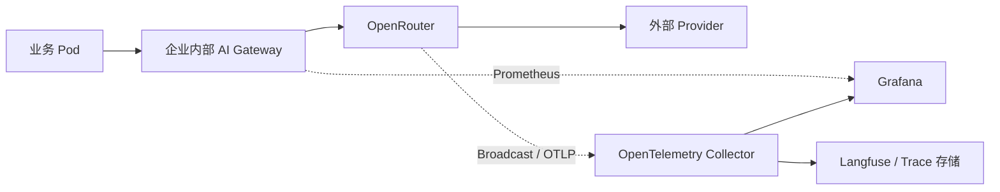

# OpenRouter 技术综述：统一模型 API、Provider 路由与企业接入

OpenRouter 提供一个统一的托管 API，让应用通过同一套凭据和请求格式访问不同厂商的模型。它同时维护模型目录、对接多个推理 Provider、执行路由与故障切换，并把用量汇总到一套账单和观测界面中。

它最适合解决两个问题：第一，应用需要快速试用和切换多家模型；第二，同一个模型存在多个推理 Provider，希望根据可用性、价格或性能选择上游。它并不管理企业 Kubernetes 集群里的 GPU Pod，也不能代替集群内的 AIBrix、KServe 或推理引擎。

可以把它理解为一个模型服务市场。同一个模型像同一款商品，可能由不同 Provider 负责交付；OpenRouter 根据库存、价格、速度和规则选择交付方。跨模型 Fallback 则相当于缺货时换成另一款商品，虽然请求还能完成，能力和结果可能已经发生变化。

[OpenRouter 官方模型目录](https://openrouter.ai/docs/guides/overview/models)目前覆盖数百个模型，模型元数据包括上下文长度、输入输出模态、价格、支持参数和 Provider 信息。客户端主要使用 OpenAI-compatible Chat Completions，也可以使用 Responses、Anthropic Messages、Embedding、图像、音频和视频等接口。

如果需要先了解整个产品类别，可以配合阅读[大模型 API 中转器与 LLM Gateway 综述](llm-api-relay-gateway-overview.md)；集群内推理实例调度则见[AI Gateway、推理路由与流量治理](gateway-routing.md)。

## 1. 先理解 Model 和 Provider

OpenRouter 把“模型”和“提供这个模型算力的端点”分成两层：

- **Model** 表示模型身份，例如 `openai/gpt-5.2`。模型决定基础能力、上下文窗口和参数语义。
- **Provider** 表示实际承载推理的供应商或云端点。同一模型可能同时由模型厂商、云平台和第三方推理平台提供。
- **OpenRouter** 根据请求约束，从可用 Provider 中选出一个端点，完成协议适配、鉴权、转发、计量和响应标准化。



模型路由和 Provider 路由也要分开理解：

| 路由层次 | 输入 | 结果 | 语义变化 |
| --- | --- | --- | --- |
| Provider 路由 | 一个模型、多个可用端点 | 选择承载该模型的 Provider | 通常较小，但量化、区域和服务等级仍可能不同 |
| Model Fallback | 按顺序给出多个模型 | 前一个失败后改用后一个 | 可能明显改变质量、工具调用、上下文和费用 |
| Auto Router | 给出目标或候选范围 | 路由器自动选择模型与 Provider | 模型本身可能变化，必须用业务评测约束 |

OpenRouter 默认会在同模型的优质 Provider 之间做负载均衡，以提高可用性。应用也可以固定 Provider、关闭 Fallback，或按价格、吞吐与延迟排序。[Provider Routing 文档](https://openrouter.ai/docs/guides/routing/provider-selection)说明，延迟和吞吐偏好使用近五分钟窗口的百分位统计；这些数据适合动态筛选，不能替代自己的端到端 SLO。

## 2. 最小接入只需要改 Base URL

现有 OpenAI Python SDK 可以直接复用：

```python
import os
from openai import OpenAI

client = OpenAI(
    base_url="https://openrouter.ai/api/v1",
    api_key=os.environ["OPENROUTER_API_KEY"],
    default_headers={
        "HTTP-Referer": "https://example.com",
        "X-OpenRouter-Title": "Internal AI Assistant",
        "X-OpenRouter-Metadata": "enabled",
    },
)

response = client.chat.completions.create(
    model="openai/gpt-5.2",
    messages=[
        {"role": "user", "content": "解释 Kubernetes Pod 的生命周期。"}
    ],
    temperature=0,
    max_completion_tokens=512,
)

print(response.model)
print(response.choices[0].message.content)
print(response.usage)
```

`Authorization: Bearer ...` 才是 API 鉴权。`HTTP-Referer` 和 `X-OpenRouter-Title` 用于应用归属与统计，可以按需设置。`X-OpenRouter-Metadata: enabled` 会要求响应返回路由元数据，便于确认实际使用的 Provider 和路由过程。

生产代码还应保存响应的模型、Usage、路由元数据和 `X-Generation-Id`。配置了 Model Fallback 后，最终模型可能与首选模型不同；只记录客户端请求的模型名会让质量回归和费用对账失真。

## 3. Provider 路由怎么控制

下面的请求要求 Provider 完整支持请求参数，优先考虑吞吐，同时排除会收集数据的端点并启用 ZDR：

```json
{
  "model": "openai/gpt-5.2",
  "messages": [
    {"role": "user", "content": "Review this deployment manifest."}
  ],
  "tools": [],
  "provider": {
    "sort": "throughput",
    "allow_fallbacks": true,
    "require_parameters": true,
    "data_collection": "deny",
    "zdr": true
  }
}
```

常用控制项如下：

| 字段 | 作用 | 生产注意点 |
| --- | --- | --- |
| `order` | 按指定顺序尝试 Provider | 配合 `allow_fallbacks=false` 才能严格限制到列表 |
| `only` / `ignore` | Provider 白名单或排除列表 | 白名单过窄会降低故障恢复能力 |
| `sort` | 按 `price`、`throughput` 或 `latency` 排序 | 动态指标会变化，应记录实际路由结果 |
| `allow_fallbacks` | 是否允许后备 Provider | 默认开启；合规场景需要确认后备端点也满足政策 |
| `require_parameters` | 只选支持全部请求参数的端点 | Tool Call、JSON Schema 和多模态请求建议开启 |
| `max_price` | 限制可接受的最高价格 | 防止 Fallback 意外进入高价端点 |
| `data_collection` | 是否允许可能收集数据的 Provider | 敏感请求应在账户策略和单请求两层限制 |
| `zdr` | 仅使用 Zero Data Retention 端点 | Provider 数量会减少，应测试无匹配端点时的错误处理 |
| `preferred_min_throughput` | 偏好达到吞吐门槛的端点 | 是偏好条件，仍要结合官方当前路由规则确认降级行为 |
| `preferred_max_latency` | 偏好低于延迟门槛的端点 | 不能保证应用侧网络和完整 E2E 延迟 |

### 同模型 Fallback 与跨模型 Fallback

同模型、不同 Provider 的 Fallback 主要解决限流、宕机和容量波动。跨模型 Fallback 使用 `models` 数组指定候选顺序，例如：

```json
{
  "models": [
    "openai/gpt-5.2",
    "anthropic/claude-sonnet-4.5"
  ],
  "messages": [
    {"role": "user", "content": "生成一份变更风险清单。"}
  ]
}
```

[Model Fallback 文档](https://openrouter.ai/docs/guides/routing/model-fallbacks)列出的触发条件包括限流、服务不可用、上下文长度错误和内容审核拒绝。请求按最终实际使用的模型计费，响应 `model` 字段会给出最终模型。

跨模型切换属于业务降级。两个模型即使都支持 Tool Call，工具名、参数稳定性、推理字段和安全边界也可能不同。上线前应使用同一套业务 Eval 验证每个候选模型，并为不能降级的请求关闭跨模型 Fallback。

## 4. Prompt Cache 与会话亲和

长 System Prompt、RAG 文档和多轮 Agent 会重复发送大量前缀。OpenRouter 可以转发不同 Provider 的 Prompt Cache 参数，并使用 Provider Sticky Routing 提高 Cache 命中率。

[Prompt Caching 文档](https://openrouter.ai/docs/guides/best-practices/prompt-caching)说明，显式提供 `session_id` 后，同一会话会尽量继续路由到相同的模型与 Provider。Sticky 端点不可用时仍可切换到后备端点。

```json
{
  "model": "anthropic/claude-sonnet-4.5",
  "session_id": "ticket-20260914-001",
  "cache_control": {"type": "ephemeral"},
  "messages": [
    {"role": "system", "content": "这里是需要重复使用的长背景资料……"},
    {"role": "user", "content": "先总结风险。"}
  ]
}
```

Prompt Cache 由最终 Provider 实现，各家的最小可缓存长度、写入价格、读取折扣和 TTL 不同。应用应同时观察 `cached_tokens`、实际成本和 Provider 变化。手工设置 `provider.order` 时，显式顺序会覆盖自动 Sticky 策略。

## 5. 费用和 BYOK

OpenRouter 支持两种主要用法：

1. **购买 OpenRouter Credits**：由 OpenRouter 统一结算各 Provider 的推理费用。
2. **BYOK**：把自己的 OpenAI、Anthropic、Bedrock、Vertex 等 Provider 凭据配置到 Workspace，由 OpenRouter 继续负责统一接口与路由。

根据 [2026-09-14 的官方价格页](https://openrouter.ai/pricing)，Pay-as-you-go 平台费为充值额的 5.5%；模型推理价格按 Provider 标价结算。BYOK 的免费额度按“标价推理金额”计算，Pay-as-you-go 和 Business 当前为每月 25,000 美元，Enterprise 当前为每月 200,000 美元，超出后收取 5%。这些条款变化较快，预算和采购材料应引用当日价格页，避免把旧 FAQ 中按请求数计算的说明写进长期配置。

BYOK 不等于请求绕过 OpenRouter。请求仍经过 OpenRouter 数据面，只是最终 Provider 使用企业自己的凭据和额度。若要求流量只能走自有账户，还要在 BYOK 设置中关闭 Shared Capacity Fallback，并用 `provider.only` 等策略限制端点。

成本治理至少记录：

- 输入、输出、Reasoning、Cache 读写和多模态单位；
- 最终模型、Provider、服务等级与单次费用；
- Fallback 前后的失败尝试和费用归属；
- API Key、Workspace、用户、环境和业务标签；
- 每日预算、异常增速、余额阈值和自动充值状态。

免费模型适合功能试用。免费额度的速率与日请求数有限，也可能因共享容量波动，不应作为生产容量基线。

## 6. 数据到底经过哪里

OpenRouter 路径至少涉及应用、OpenRouter 和最终 Provider 三方。选择托管聚合平台时，隐私评审应检查每一跳，不能只看模型厂商的政策。

[OpenRouter 数据收集说明](https://openrouter.ai/docs/guides/privacy/data-collection)称，Prompt 和 Response 内容默认不在 OpenRouter 留存，主动开启 Input & Output Logging 或允许平台使用内容时例外；Token、延迟、模型和费用等请求元数据会被保存用于统计。[Provider Logging 文档](https://openrouter.ai/docs/guides/privacy/provider-logging)也强调，不同 Provider 有各自的数据保留和训练政策。

生产环境建议同时落实四层控制：

1. 在组织或 Workspace 层关闭不符合要求的数据收集选项；
2. 用 Guardrail 限制模型、Provider、预算和 ZDR；
3. 敏感请求在 `provider` 中再次声明 `data_collection: deny` 与 `zdr: true`；
4. 发请求前在企业内部完成密钥、个人信息和受监管字段的识别与脱敏。

ZDR 的含义是 Provider 不持久保存请求内容。它不等于数据不离开企业网络，也不等于无需数据跨境、供应商合同和访问控制评审。需要区域驻留的企业客户可以评估 OpenRouter 的 US/EU in-region 入口，但仍要确认所选模型、Provider 和合同范围。

## 7. 可观测性应该看什么

OpenRouter Activity 和 Logs 可以按模型、Provider 与 API Key 查看请求。Broadcast 还能把 Trace 异步发送到 OpenTelemetry Collector、Grafana Cloud、Datadog、Langfuse、S3 等目标。[Broadcast 文档](https://openrouter.ai/docs/guides/features/broadcast/overview)支持 Privacy Mode，只发送 Token、费用、时间和路由元数据，不发送 Prompt 与模型输出。

企业看板建议至少包含：

| 维度 | 指标 |
| --- | --- |
| 可用性 | 成功率、429/5xx、无可用 Provider、Fallback 次数 |
| 性能 | TTFT、E2E、输出 tok/s、流式中断率 |
| 成本 | 每请求费用、每任务费用、输入/输出/Cache/Reasoning 成本 |
| 路由 | 请求模型、最终模型、Provider、区域、服务等级 |
| 配额 | RPM、TPM、并发、Key 预算、Workspace 预算、余额 |
| 质量 | 业务 Eval 得分、Tool Call 成功率、结构化输出合格率 |



内部网关的指标和 OpenRouter Trace 需要用统一的 `trace_id` 或 `session_id` 关联。否则只能看到“网关慢”和“Provider 慢”两张独立图，无法判断耗时发生在哪一跳。

## 8. 与直接 API、自建 Gateway 怎么选

| 方案 | 接入速度 | 多模型与多 Provider | 数据链路控制 | 集群内 GPU 调度 | 运维责任 |
| --- | --- | --- | --- | --- | --- |
| 直接调用模型厂商 | 快 | 每家单独接入 | 较直接 | 无 | 应用维护多套 SDK、Key 与账单 |
| OpenRouter | 很快 | 强，统一目录、结算与路由 | 依赖托管平台和最终 Provider | 无 | 平台托管，应用负责策略和回归 |
| 自建 LiteLLM/Higress 等 Gateway | 中等 | 取决于适配器和配置 | 企业掌握入口、Key 与日志 | 通常只到服务级路由 | 企业负责 HA、升级、数据库和观测 |
| AIBrix/Inference Gateway | 中等 | 主要面向自建模型 | 企业可控 | 强，可感知实例、负载和缓存 | 企业负责 Kubernetes 与 GPU 服务 |

个人开发、模型评测和需要快速覆盖多家 API 的产品，OpenRouter 的接入效率很高。公司代码、客户数据或稳定生产业务应重点评估合同、区域、Provider 白名单、ZDR、SLA 和退出方案。

企业也可以采用两层入口：内部 AI Gateway 负责员工身份、租户、脱敏、预算和审计，再把部分模型转到 OpenRouter，把自建模型转到 AIBrix 或 vLLM/SGLang。这样应用只连接公司入口，外部平台的 Key、路由策略和替换过程不会散落到每个业务仓库。

## 9. Kubernetes 中的推荐接法

OpenRouter 本身是托管服务，Kubernetes 侧主要部署调用方或企业内部 Gateway：

```text
Ingress / Service Mesh
        │
        ▼
Internal AI Gateway
  ├─ SSO / JWT / ServiceAccount 身份
  ├─ 模型别名、预算、限流和审计
  ├─ Prompt 脱敏与出站策略
  └─ Trace / Prometheus
        │
        ├────────► OpenRouter ──► 外部 Provider
        │
        └────────► AIBrix ──────► vLLM / SGLang
```

落地时注意：

- OpenRouter Key 放入 Secret 或外部密钥系统，只由服务端 Pod 读取；浏览器和公开前端不能持有长期 Key。
- 使用稳定的内部模型别名，由 Gateway 映射到具体 OpenRouter Model/Provider 策略。
- 用 NetworkPolicy、Egress Gateway 或防火墙限制出站域名，并记录 DNS、TLS 和代理失败。
- 为 OpenRouter 请求分别设置连接超时、首 Token 超时和总超时；客户端重试与网关重试只能有一个权威层。
- Pod 终止时传播客户端取消，避免用户已断开后外部模型继续生成和计费。
- HPA 不应只看请求数。长上下文 Agent 的连接时间和费用远高于短 Chat，应结合活跃流、Token 和延迟扩缩容内部 Gateway。
- 预留直接 Provider 或自建模型的应急路径，并定期演练 OpenRouter 不可用、余额不足和 Provider 全部不匹配。

## 10. 上线前验证清单

### 协议

- 普通 Chat、完整 SSE、取消和超时；
- Tool Call、并行工具、JSON Schema 和 Reasoning 字段；
- 图片、音频或文件等实际使用的模态；
- 最大 Context、最大输出和不同 Provider 的参数支持；
- `response.model`、路由元数据、Usage 与 Generation ID。

### 路由

- 给首选 Provider 注入 429、5xx、超时和不可用；
- 验证 `only`、`ignore`、ZDR、数据政策与价格上限；
- 核对 Fallback 最终模型，以及业务是否接受输出变化；
- 检查 `require_parameters=true` 后 Tool Call 和结构化输出不会落到不兼容端点；
- 长会话验证 `session_id`、Provider Sticky 与 Prompt Cache 命中。

### 安全与费用

- Key 轮换、吊销、最小权限和泄漏告警；
- Workspace 与业务 Key 的日/月预算；
- Prompt 日志、Broadcast 和第三方观测平台的数据范围；
- OpenRouter 记录、内部网关 Usage 与账单抽样对账；
- 数据驻留、DPA、Provider 条款和离职/项目下线后的数据删除流程。

## 11. 适合与不适合的场景

OpenRouter 适合快速试用多模型、减少 SDK 适配、统一小团队账单，以及为同模型获得多 Provider 的容量和故障切换。对于模型评测平台和 Agent 原型，它可以显著缩短接入时间。

当业务要求所有数据留在私网、需要直接控制供应商合同与容量、必须调度自己的 GPU，或者已有成熟的企业 Gateway 和多云模型账户时，自建入口通常更合适。此时仍可以把 OpenRouter 作为受控的补充上游，而不是让每个应用直接持有平台 Key。

OpenRouter 的核心价值是把“接模型”变成一个统一接口，把“选哪个推理端点”变成可配置策略。真正进入生产后，仍然需要企业自己定义模型准入、质量评测、数据边界、成本预算和故障降级。

## 参考资料

- [OpenRouter Quickstart](https://openrouter.ai/docs/quickstart)
- [Models API 与模型目录](https://openrouter.ai/docs/guides/overview/models)
- [Provider Routing](https://openrouter.ai/docs/guides/routing/provider-selection)
- [Model Fallbacks](https://openrouter.ai/docs/guides/routing/model-fallbacks)
- [Prompt Caching](https://openrouter.ai/docs/guides/best-practices/prompt-caching)
- [BYOK](https://openrouter.ai/docs/guides/overview/auth/byok)
- [Pricing](https://openrouter.ai/pricing)
- [Data Collection](https://openrouter.ai/docs/guides/privacy/data-collection)
- [Provider Logging](https://openrouter.ai/docs/guides/privacy/provider-logging)
- [Zero Data Retention](https://openrouter.ai/docs/guides/features/zdr)
- [Broadcast Observability](https://openrouter.ai/docs/guides/features/broadcast/overview)
- [Chat Completions API](https://openrouter.ai/docs/api/api-reference/chat/send-chat-completion-request)
