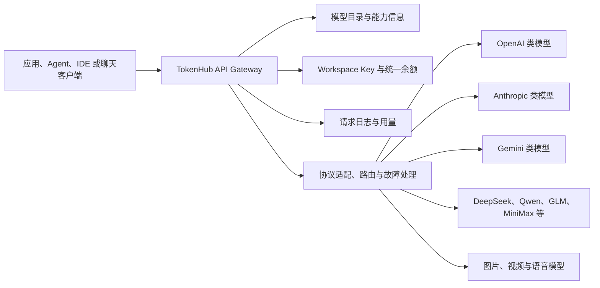
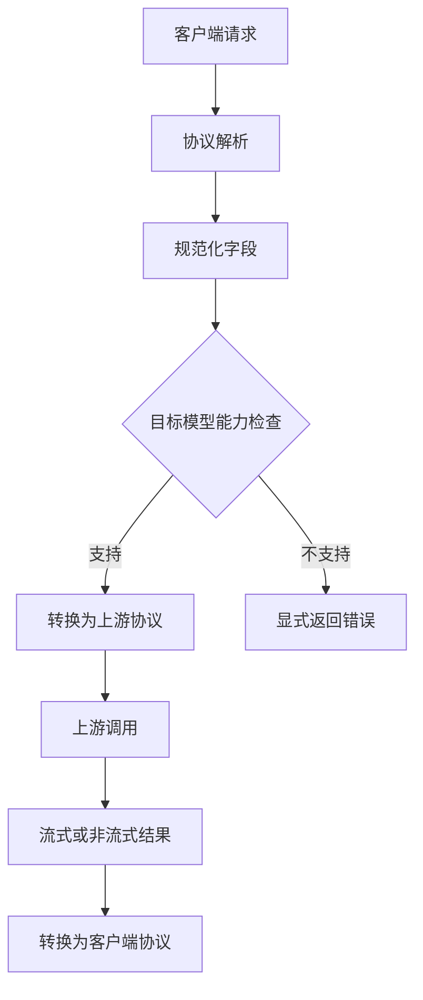
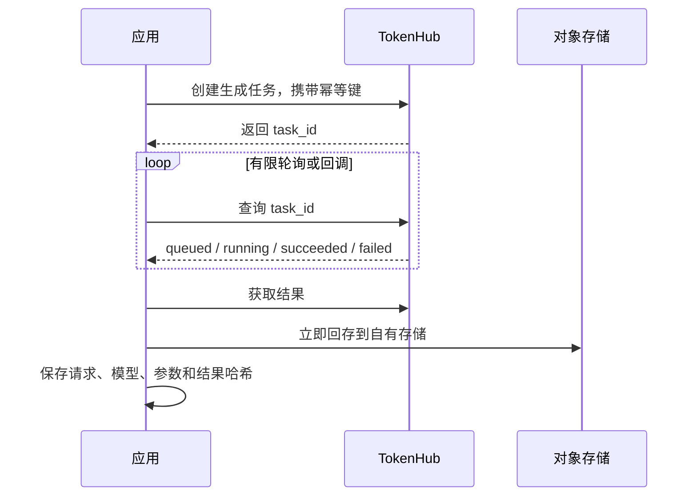
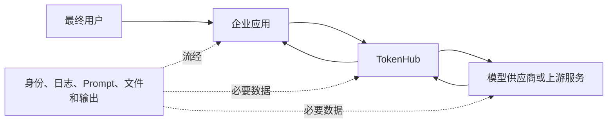
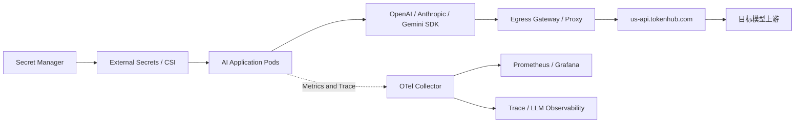
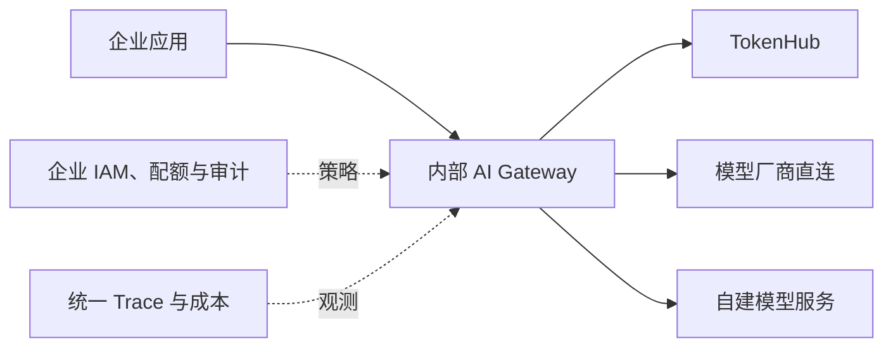

# TokenHub 技术综述：统一模型 API、聚合市场与企业接入

企业开始同时使用 OpenAI、Anthropic、Google、DeepSeek、通义、MiniMax 以及图片、视频和语音模型后，工程问题很快会从“怎样调用一个 API”变成“怎样管理十几种协议、密钥、价格、能力和故障”。TokenHub.com 提供了一条聚合路线：应用只接一个网关和共享计费账户，通过统一模型目录选择不同上游。

它的产品形态与 OpenRouter 接近，属于托管的多模型 API Gateway 与 Marketplace，不是大模型本身，也不是需要部署到 Kubernetes 的推理引擎。它可以减少供应商适配代码，但不会自动消除模型差异、数据合规、上游故障和迁移验证。

本文所说的 **TokenHub** 特指 [`tokenhub.com`](https://tokenhub.com/zh) 的托管服务。市场上还有多个同名产品，下一节会先划清边界。

## 一页结论

1. **TokenHub.com 是托管的模型聚合与转发平台。** 它把模型目录、API Key、统一余额、请求日志、路由和多家上游模型放到一个入口中。
2. **它同时提供 OpenAI、Anthropic Messages 与 Gemini 兼容入口。** 现有 SDK、Agent 和桌面客户端如果允许配置 Base URL、API Key 与 Model ID，通常可以较低成本接入。
3. **“接口兼容”不等于“模型行为相同”。** Tool Call、Reasoning、Streaming、多模态、错误码、缓存和最大上下文仍受目标模型、上游与协议转换影响。
4. **模型目录适合发现和比较，不能代替上线验证。** 价格、上下文、端点和可用性会变化，生产系统应在发布时锁定 Model ID、协议、能力矩阵和回归结果。
5. **统一余额降低财务与接入摩擦，也引入平台依赖。** TokenHub、网络和上游任何一层异常都可能影响调用；关键业务仍需超时、熔断、幂等和备用路径。
6. **聚合网关位于数据路径中。** Prompt、上下文、文件和模型输出需要经 TokenHub 转发给选定上游，企业必须同时评估 TokenHub 与最终模型供应商的数据规则。
7. **Agent 接入要按真实 Wire Protocol 选择端点。** Claude Code 通常走 Anthropic Messages，Codex 常走 Responses，普通 OpenAI 兼容客户端多走 Chat Completions；文本聊天成功不能证明 Agent 全功能兼容。
8. **Kubernetes 不需要为 TokenHub 部署 GPU。** 应用 Pod 通过 HTTPS 调用托管端点，平台侧重点是 Secret、出口控制、租户配额、Trace、成本和故障降级。
9. **Standard NetworkPolicy 不能直接按域名限制出口。** 如果只允许访问 TokenHub 域名，需要 Egress Proxy、支持 FQDN Policy 的 CNI 或云防火墙，而不是把动态 IP 写死。
10. **选型关键在托管与自建的取舍。** 希望快速使用多家模型时，聚合站点很方便；需要自有上游合同、私网数据路径、精细治理和完整审计时，自建 Gateway 更可控。

## 1. 先分清几个同名 TokenHub

截至本文更新时，至少有三类产品使用 TokenHub 名称：

| 名称 | 形态 | 主要能力 | 部署位置 | 本文是否重点讨论 |
| --- | --- | --- | --- | --- |
| [TokenHub.com](https://tokenhub.com/zh) | 商业托管 API 聚合站点 | 多模型目录、兼容 API、共享计费、路由和工具接入 | 服务商云端 | 是 |
| [astaxie/TokenHub](https://github.com/astaxie/TokenHub) | Apache-2.0 开源私有网关 | Provider、项目 Key、路由、配额、成本、审计和私有部署 | 用户自己的主机或云 | 仅用于名称辨析 |
| [腾讯云大模型服务平台 TokenHub](https://cloud.tencent.com.cn/document/product/1823) | 云厂商托管模型平台 | 模型聚合、OpenAI/Anthropic 兼容 API、区域端点 | 腾讯云 | 仅用于名称辨析 |

三者不是同一个代码库、账户体系或服务。搜索资料、排障和写采购清单时应把域名、供应商与版本一起写明，避免“TokenHub 支持某功能”被错误迁移到另一个产品。

本文后续出现的 Base URL `https://us-api.tokenhub.com` 均属于 TokenHub.com。

## 2. TokenHub.com 解决什么问题

直接接入多家模型时，团队需要分别处理：

- 不同账户、API Key 与账单；
- Chat Completions、Responses、Messages 和厂商原生协议；
- 模型名称、上下文、价格、模态与区域差异；
- Tool Call、流式事件、Reasoning 和缓存字段；
- 供应商限流、错误码、超时和模型下线；
- 各客户端对自定义 Provider 的兼容方式；
- 用量归属、预算、充值和财务对账。

TokenHub.com 把其中一部分集中到统一入口：



官方将其描述为“一个 API Key、一个 endpoint、一套计费系统”，并列出模型聚合、成本控制、自动重试、Fallback 和多区域等能力。[关于 TokenHub](https://tokenhub.com/zh/about)

这张图是根据公开产品能力整理的逻辑架构，不代表 TokenHub 公布了内部服务实现、具体上游关系或每个模型的物理部署位置。

## 3. 三套兼容协议

TokenHub 当前公开的常用入口如下：

| 协议 | Base URL | 典型请求路径 | 适用客户端 |
| --- | --- | --- | --- |
| OpenAI Compatible | `https://us-api.tokenhub.com/v1` | `/chat/completions`、`/responses`、`/models` | OpenAI SDK、Codex、Cline、Open WebUI 等 |
| Anthropic Compatible | `https://us-api.tokenhub.com` | `/v1/messages` | Claude Code 与 Messages 客户端 |
| Gemini Compatible | `https://us-api.tokenhub.com` | `/v1beta/models` 及 Gemini 原生路径 | Gemini 原生工具 |

来源：[TokenHub Integrations](https://tokenhub.com/zh/docs/integrations)。

### 3.1 OpenAI Chat Completions

```python
import os
from openai import OpenAI

client = OpenAI(
    api_key=os.environ["TOKENHUB_API_KEY"],
    base_url="https://us-api.tokenhub.com/v1",
)

response = client.chat.completions.create(
    model="YOUR_TOKENHUB_MODEL_ID",
    messages=[
        {"role": "system", "content": "回答要简洁，并标出不确定信息。"},
        {"role": "user", "content": "解释为什么模型网关需要超时与熔断。"},
    ],
)

print(response.choices[0].message.content)
```

### 3.2 OpenAI Responses

Codex 和较新的 Agent 工具可能使用 Responses Wire API。此时仅让 Chat Completions 可用还不够：

```python
response = client.responses.create(
    model="YOUR_TOKENHUB_MODEL_ID",
    input="只读分析当前仓库结构，不要修改文件。",
)

print(response.output_text)
```

客户端配置中如果有 `wire_api`、`api_mode` 或 `endpoint`，必须与真实请求路径一致。TokenHub 的 Codex 指南明确使用 Responses 路径。[Codex 接入指南](https://tokenhub.com/zh/docs/integrations/codex)

### 3.3 Anthropic Messages

```bash
curl 'https://us-api.tokenhub.com/v1/messages' \
  -X POST \
  -H "Authorization: Bearer $TOKENHUB_API_KEY" \
  -H 'Content-Type: application/json' \
  -d '{
    "model": "YOUR_TOKENHUB_MODEL_ID",
    "max_tokens": 512,
    "messages": [
      {"role": "user", "content": "用三点说明多模型网关的风险。"}
    ]
  }'
```

Anthropic 客户端常要求填写 Host 而不是带完整路径的 Base URL。如果把 `/v1/messages` 重复拼接，可能得到 404 或协议错误。

## 4. 兼容 API 到底兼容到哪一层

兼容协议主要降低客户端接入成本，不保证所有上游能力都能无损映射。



需要逐模型验证的能力包括：

| 能力 | 常见差异 |
| --- | --- |
| System Prompt | 字段位置、优先级和最大长度不同 |
| Tool Call | Schema 子集、并行调用、Tool Choice 和返回格式不同 |
| Reasoning | 参数名称、可见性、预算与计费不同 |
| Structured Output | JSON Schema 支持范围与严格程度不同 |
| Streaming | 事件类型、Usage 出现位置、错误结束语义不同 |
| Context Cache | Cache Key、自动缓存、显式缓存和价格不同 |
| Vision | 图片 URL、Base64、像素限制和 Token 计数不同 |
| Image/Video | 同步或异步任务、轮询、文件保留方式不同 |
| Finish Reason | 截断、安全拒绝、工具调用和错误映射不同 |
| Error | 400/401/429/5xx 的含义、Retry-After 与错误体不同 |

如果某个 OpenAI 兼容请求被 TokenHub 接收，但目标模型没有对应能力，合理行为应是显式报错或按文档降级。应用不能看到 HTTP 200 就假设工具、Reasoning 和 Usage 都保持了原厂语义。

## 5. 模型目录与多模态

TokenHub 的模型广场提供模型、供应商、上下文、最大输出、发布时间和价格等信息，并按语言、图片和视频等类型展示。[TokenHub 模型广场](https://tokenhub.com/zh/models)

模型目录主要解决两个问题：

1. **发现：** 快速找到可能满足文本、视觉、图像、视频、语音或 Embedding 需求的模型；
2. **初筛：** 比较协议、上下文、价格与公开能力，形成候选清单。

它不能完成最终选型。上线前仍要验证：

- 目录中的 Model ID 在目标 Workspace 是否实际可用；
- 模型是否支持计划使用的协议端点；
- Tool Call、JSON Schema、Streaming 和多模态请求能否完整往返；
- 长上下文是模型声明上限，还是当前网关与上游均可接受的上限；
- 输入、输出、缓存、图片、视频和失败请求怎样计费；
- 内容安全策略和上游地区是否符合业务要求；
- 模型别名更新是否可能改变实际版本。

图片和视频通常不是“更多 Token 的 Chat 请求”。生成任务可能采用异步提交、任务 ID、状态轮询和结果下载。应用应把它设计成可恢复任务：



不要把第三方结果 URL 当成永久制品地址。即使当前页面能访问，保留期、鉴权和内容处置都可能变化。

## 6. Agent 与开发工具接入

TokenHub 官方集成目录覆盖 Claude Code、Codex、OpenClaw、OpenHands、Cline、Qwen Code、Open WebUI、LangChain 等工具。共同前提是客户端允许配置：

```text
Base URL + API Key + Model ID + 正确协议
```

### 6.1 为什么 Agent 比聊天更难兼容

普通聊天只需验证一问一答；Agent 还会使用：

- 多轮 Tool Call 与 Tool Result；
- Streaming 中的增量参数；
- Reasoning Effort 与特殊字段；
- 长时间运行、取消和重试；
- 图片、文件与大段代码；
- 自动摘要和上下文压缩；
- Edit、Apply、Fast、Chat 等多个模型槽位。

因此建议按能力递进验证：

| 阶段 | 测试 | 通过标准 |
| --- | --- | --- |
| 1 | `GET /v1/models` 或简单文本请求 | Key、网络、Model ID 正确 |
| 2 | Streaming 文本 | 增量顺序、结束事件和 Usage 正确 |
| 3 | 单个 Tool Call | 参数 Schema 与结果回填正确 |
| 4 | 并行或多轮工具 | 不丢 Tool ID，不重复动作 |
| 5 | 长上下文 | 计数、截断、超时和成本符合预期 |
| 6 | 取消与错误 | 客户端停止能传播，上游错误可识别 |
| 7 | 真实 Agent 任务 | 文件、命令、审批和最终结果完整 |

TokenHub 自己的集成指南也建议先执行只读任务，再逐步开放文件写入、终端命令和自动化能力。[应用接入目录](https://tokenhub.com/zh/apps)

### 6.2 客户端兼容仍受客户端限制

一个客户端显示“OpenAI Compatible”不代表所有功能都走自定义网关。例如 IDE 的 Tab Completion、专用 Composer 或后台服务可能仍使用厂商内置模型。TokenHub 的 Cursor 指南就明确将 Base URL Override 描述为有限兼容路径，而不是完整 Custom Provider。[Cursor 接入说明](https://tokenhub.com/zh/docs/integrations/cursor)

生产接入时应从 TokenHub 请求日志确认流量真正经过预期端点，不能只看客户端 UI 中选中了一个同名模型。

## 7. 路由、重试与 Fallback

TokenHub 官方产品页列出了自动重试和智能 Fallback。它们能提高可用性，但路由策略必须保持请求语义。

### 7.1 哪些请求适合自动重试

| 请求 | 是否适合透明重试 | 条件 |
| --- | --- | --- |
| 非流式文本生成，尚未返回结果 | 较适合 | 上游未产生可见副作用，有次数与总时限 |
| Streaming 尚未输出首块 | 可有限重试 | 客户端尚未收到内容 |
| Streaming 已输出部分内容 | 风险高 | 不能把新流无标记拼到旧流 |
| 图片/视频任务创建 | 需要幂等键 | 先查询原 task_id，避免重复扣费 |
| Agent Tool Call | 不能仅重试模型轮次 | 先确认工具是否已经执行 |
| Embedding | 较适合 | 输入和模型版本固定 |

### 7.2 Fallback 不只是换模型名

自动切换到另一个模型可能改变：

- 输出质量与风格；
- Tool Call Schema 遵循率；
- 上下文与最大输出；
- 安全政策和拒绝行为；
- Tokenizer、Token 数与价格；
- 数据处理地区和供应商；
- 缓存命中与延迟。

关键业务应建立明确的 Fallback Group，只在通过相同回归集的模型之间切换，并把最终 Provider/Model、切换原因和价格写入 Trace。对法律、医疗、财务或固定版本生成，宁可失败也不要静默换成未经验证的模型。

## 8. 统一计费的价值与边界

统一余额和请求日志能降低小团队分别签约、充值和对账的成本。对平台团队，还能把一个网关 Key 进一步拆为应用或环境 Key，形成统一成本入口。

成本账本至少应包含：

```text
workspace / project / environment
api_key_id（不记录原文）
request_id
requested_model
resolved_model_and_provider（若平台提供）
input / output / cache / reasoning usage
image / video / audio task units
status and retry_count
unit_price_snapshot
final_charge
```

TokenHub 服务协议说明，实际费用可能受 Tokenizer、四舍五入、汇率、缓存和失败请求处理影响，并以平台记录为结算依据。[TokenHub 服务协议](https://tokenhub.com/zh/user-agreement)

内部 Chargeback 不应只复制月末总额。建议每天导出或读取用量，保存不可变单价快照和请求 ID，再按团队、应用、Agent、模型和业务标签归集。价格变化时，历史账单必须保留当时的计价依据。

## 9. 数据安全与合规边界

请求经过聚合网关时，信任链由一方变成多方：



TokenHub 隐私政策说明，平台可能收集调用模型、Token、金额、错误、响应时间等日志，也可能处理 Prompt、上下文、文件、图片、音视频、代码和模型输出；为完成调用，必要数据会转发给选定的模型供应商或上游服务。[TokenHub 隐私政策](https://tokenhub.com/zh/privacy-policy)

企业上线前至少核对：

- 数据由哪个法律实体处理，经过哪些国家或地区；
- TokenHub 与最终 Provider 各自的保留、训练和人工访问规则；
- 是否能关闭正文日志或配置零保留；
- 删除请求如何覆盖调用日志、对象和上游副本；
- 是否有 DPA、SLA、安全认证、事件通知和审计材料；
- API Key 是否支持项目、环境、额度、IP 和权限范围；
- 图片、视频和文件存储多久；
- 第三方模型变更时是否通知；
- 哪些数据按照内部制度不得离开私网。

### 9.1 Key 管理

- 每个应用和环境使用独立 Key；
- Key 只存 Secret Manager，不写进镜像、Git、Notebook 或截图；
- 限制余额、预算、并发和可用模型；
- 定期轮换，员工离职和项目结束立即吊销；
- 日志只保留 Key ID、前后缀或哈希；
- 异常地域、模型和消费速度触发告警。

### 9.2 Prompt 与输出

在进入 TokenHub 前先做数据分类和必要脱敏。对高敏数据，不要假设“HTTPS 加密”就等于“可以交给第三方处理”。传输加密解决链路窃听，不能改变服务商对明文请求的处理权限。

## 10. Kubernetes 中怎样接入

TokenHub.com 是外部托管服务，Kubernetes 中只需让应用通过 HTTPS 出口访问它：



### 10.1 应用配置

```yaml
apiVersion: apps/v1
kind: Deployment
metadata:
  name: model-client
spec:
  replicas: 2
  selector:
    matchLabels:
      app: model-client
  template:
    metadata:
      labels:
        app: model-client
    spec:
      serviceAccountName: model-client
      automountServiceAccountToken: false
      containers:
        - name: app
          image: registry.example/model-client:1.0.0
          env:
            - name: OPENAI_BASE_URL
              value: https://us-api.tokenhub.com/v1
            - name: TOKENHUB_MODEL
              value: YOUR_APPROVED_MODEL_ID
            - name: TOKENHUB_API_KEY
              valueFrom:
                secretKeyRef:
                  name: tokenhub-api
                  key: api-key
          resources:
            requests:
              cpu: 200m
              memory: 256Mi
            limits:
              memory: 512Mi
```

示例只展示配置关系。真实 Secret 应由 External Secrets、Secrets Store CSI 或企业密钥系统注入，清单中不要出现明文。

### 10.2 出口控制

Kubernetes 原生 NetworkPolicy 主要按 IP/CIDR 控制，不能通用地按 FQDN 匹配 `us-api.tokenhub.com`。服务域名背后的 IP 可能变化，生产可选择：

- 统一 HTTPS Egress Proxy，并只允许 Pod 访问 Proxy；
- 使用支持 FQDN Policy 的 CNI；
- 使用 Service Mesh Egress Gateway；
- 在云防火墙或 NAT Gateway 维护受控出口；
- 对 TLS SNI、DNS 和目标证书做相应审计。

不要把一次 DNS 解析得到的 IP 永久写入 NetworkPolicy。

### 10.3 超时和连接

建议分开设置：

| 超时 | 含义 |
| --- | --- |
| Connect Timeout | DNS/TCP/TLS 建连上限 |
| Response Header / TTFT Timeout | 等待模型开始响应 |
| Stream Idle Timeout | 流式块之间最长空闲 |
| Total Request Deadline | 整个请求墙钟时间 |
| Generation Task Deadline | 图片/视频异步任务总时限 |

Ingress、应用 SDK、Egress Proxy 和 TokenHub 上游的超时应协调。外层 60 秒而模型首 Token 可能需要 90 秒，会导致客户端断开后上游继续计费。

### 10.4 扩缩容

调用托管 API 的应用通常不需要按 GPU 指标扩容，应关注：

- 应用请求队列与最老请求年龄；
- TokenHub 在途请求和并发；
- 429、超时、Fallback 和错误率；
- P95 TTFT、TPOT 与总延迟；
- 每分钟输入/输出 Token；
- 每个租户预算与消费速度；
- Agent 活跃任务与工具等待。

应用扩容不能突破 TokenHub 或上游配额。副本从 2 扩到 20，如果没有全局限流，只会更快触发 429。

## 11. 可观测性怎样补齐

平台请求日志适合核对账单和上游调用，企业仍应在自己的应用侧产生完整 Trace：

```text
client_request_id
tokenhub_request_id（若响应提供）
tenant / application / feature
requested_model
endpoint_protocol
input / output usage
ttft / total_latency
status / error_type / retry / fallback
tool_calls
cost_snapshot
business_result
```

Prometheus Label 不要放完整 Prompt、用户 ID 或 Request ID；高基数信息进入日志和 Trace，Metrics 只保留有限的模型、协议、状态和环境标签。

推荐看板分成四排：

1. **流量：** RPS、Input/Output Token Rate、并发；
2. **体验：** TTFT、TPOT、总延迟、Streaming 中断；
3. **可靠性：** 2xx、429、5xx、超时、重试和 Fallback；
4. **成本：** 每模型、每团队、每功能费用和预算消耗速度。

HTTP 200 只表示接口层成功。Agent 场景还要记录 Tool Call 是否正确、任务是否完成和用户是否接受结果。

## 12. TokenHub、OpenRouter、直连与自建网关

| 方案 | 优点 | 限制 | 适合团队 |
| --- | --- | --- | --- |
| TokenHub.com | 多种兼容协议、模型目录、统一余额、Agent 接入教程 | 托管数据路径，能力与平台目录绑定 | 希望快速接多模型和开发工具 |
| OpenRouter | 大模型聚合与 Provider 路由生态成熟 | 同样需要评估数据、路由和 Provider 差异 | 需要广泛模型与路由选择 |
| 直接接模型厂商 | 协议和新能力最原生，责任链短 | 多家接入、账单和密钥分散 | 核心模型较少，有直接合同 |
| 自建 LiteLLM/Portkey 类网关 | 自有密钥、策略、日志和网络边界 | 需要开发与长期运维 | 有平台团队和多供应商合同 |
| 自建 Higress/Envoy AI Gateway | 与 Kubernetes、流量治理和私网集成紧密 | 模型语义、计费和控制台需继续建设 | 已有云原生网关体系 |
| astaxie/TokenHub | 开源、私有化、面向企业 Token 治理 | 与 TokenHub.com 不是同一产品，需自行运维 | 希望研究同名开源私有网关 |

参考：[OpenRouter 统一模型 API 与企业接入](openrouter-overview.md)、[大模型 API 中转器与 LLM Gateway](llm-api-relay-gateway-overview.md)、[Higress AI Gateway 实战](higress-ai-gateway.md)。

对企业核心系统，选型时比“模型数量”更重要的条件包括：

- 数据处理与合同主体；
- Provider 可见性和可固定程度；
- SLA、限流、出口与区域；
- 原生协议覆盖和新功能上线速度；
- Key、项目、预算和审计粒度；
- 日志、Trace 与账单导出；
- 零保留、训练使用和删除机制；
- 故障时能否安全切直连或第二网关。

## 13. 上线前的最小验证矩阵

### 13.1 协议正确性

- [ ] 模型列表、认证和基础文本请求；
- [ ] Chat Completions、Responses 或 Messages 目标协议；
- [ ] Streaming 事件顺序、Usage 和 Finish Reason；
- [ ] Tool Call、Tool Result、并行工具和多轮工具；
- [ ] JSON Schema、Reasoning 和 System Prompt；
- [ ] 图片、视频、语音或 Embedding 的目标能力；
- [ ] 中文、英文、代码、Unicode 和长上下文。

### 13.2 故障语义

- [ ] 无效 Key、余额不足、模型不存在；
- [ ] 429 与 Retry-After；
- [ ] 上游 5xx、连接超时和流式中断；
- [ ] 客户端取消能否停止后续消耗；
- [ ] 重试是否重复生成任务或 Agent 动作；
- [ ] Fallback 是否记录最终模型并保持质量门槛。

### 13.3 计费

- [ ] 输入、输出、缓存和 Reasoning Token 对账；
- [ ] 图片、视频、音频的计费单位；
- [ ] 失败、取消和重试怎样扣费；
- [ ] 单价调整与历史快照；
- [ ] 项目、环境和团队归属；
- [ ] 预算耗尽时的行为和告警。

### 13.4 安全

- [ ] 独立 Key、最小额度和轮换；
- [ ] Prompt 与文件的数据分类和脱敏；
- [ ] TokenHub 与上游 Provider 条款均已评估；
- [ ] Kubernetes 出口、DNS 和 TLS 路径受控；
- [ ] 日志不保存 Secret 与敏感正文；
- [ ] 数据删除、保留和跨境路径明确。

## 14. 分阶段采用建议

### 阶段一：开发与模型评估

先选择低敏感、只读任务，验证两到三个候选模型。记录请求、输出、Token、延迟和成本，不让 Agent 执行外部写操作。

### 阶段二：非核心生产流量

为应用创建独立 Key，设置预算与并发；固定协议和 Model ID；接入 Trace、告警和每日对账。Fallback 只使用经过相同回归集的模型。

### 阶段三：关键业务评审

在扩大流量前完成数据协议、SLA、地区、日志保留和安全材料审查。为关键模型保留直连或第二网关方案，并定期演练切换。

### 阶段四：平台化治理

将 TokenHub 放在企业内部 AI Gateway 之后：内部网关负责租户身份、统一策略、脱敏、成本中心和审计，再以受控账号访问外部聚合服务。这样业务应用不会直接持有外部 Key，也能在未来更换供应商。



## 15. 结语

TokenHub.com 的主要价值是把多模型发现、协议入口和计费集中起来，让开发者可以用熟悉的 SDK 和 Agent 工具更快访问不同模型。它减少了每家供应商都写一套 Adapter 的工作，但模型能力、数据路径、错误语义和成本不会因为统一 API 而自动统一。

个人和小团队可以从共享入口直接获得效率；企业更适合把它当作受控的外部模型供应源，放在内部身份、网关、脱敏、Trace 和预算体系之后。真正决定能否进入生产的，不是一次文本请求返回成功，而是目标协议、工具、多模态、故障、计费和数据治理都经过验证。

## 参考资料

- [TokenHub.com](https://tokenhub.com/zh)
- [关于 TokenHub](https://tokenhub.com/zh/about)
- [TokenHub API 文档](https://tokenhub.com/docs)
- [TokenHub 应用接入](https://tokenhub.com/zh/apps)
- [TokenHub 集成指南](https://tokenhub.com/zh/docs/integrations)
- [TokenHub 模型广场](https://tokenhub.com/zh/models)
- [TokenHub Codex 接入指南](https://tokenhub.com/zh/docs/integrations/codex)
- [TokenHub Cursor 接入说明](https://tokenhub.com/zh/docs/integrations/cursor)
- [TokenHub 隐私政策](https://tokenhub.com/zh/privacy-policy)
- [TokenHub 服务协议](https://tokenhub.com/zh/user-agreement)
- [astaxie/TokenHub](https://github.com/astaxie/TokenHub)
- [腾讯云大模型服务平台 TokenHub](https://cloud.tencent.com.cn/document/product/1823)
