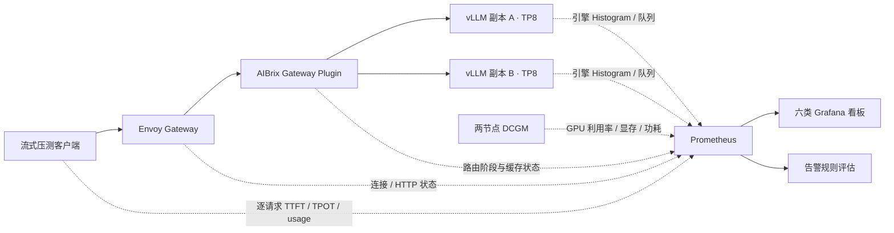
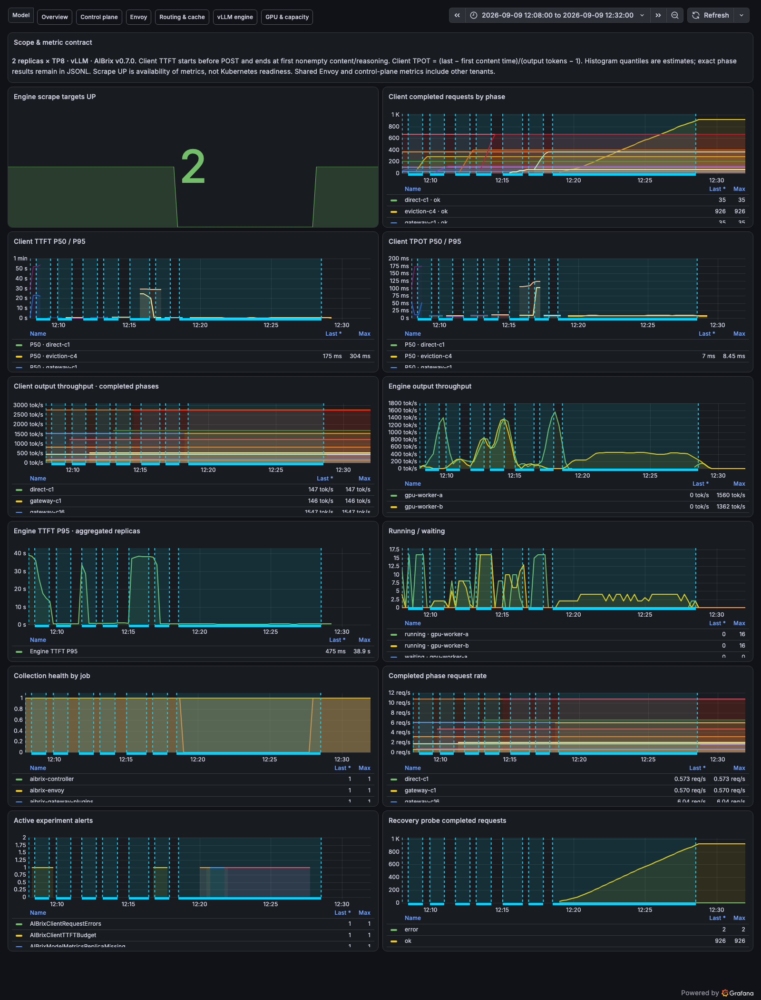
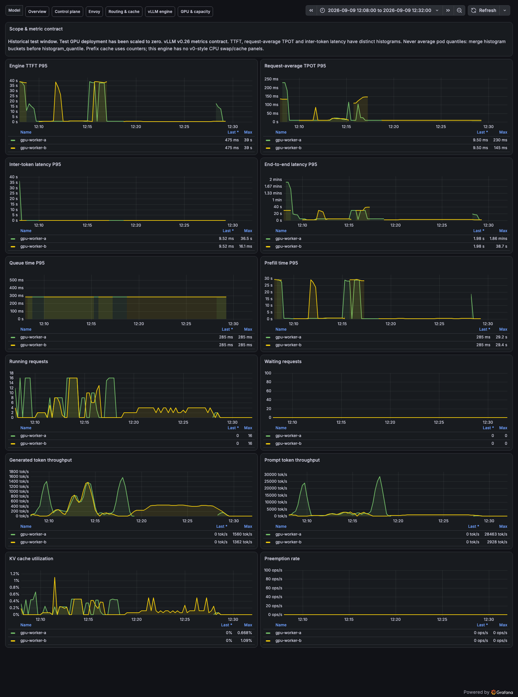
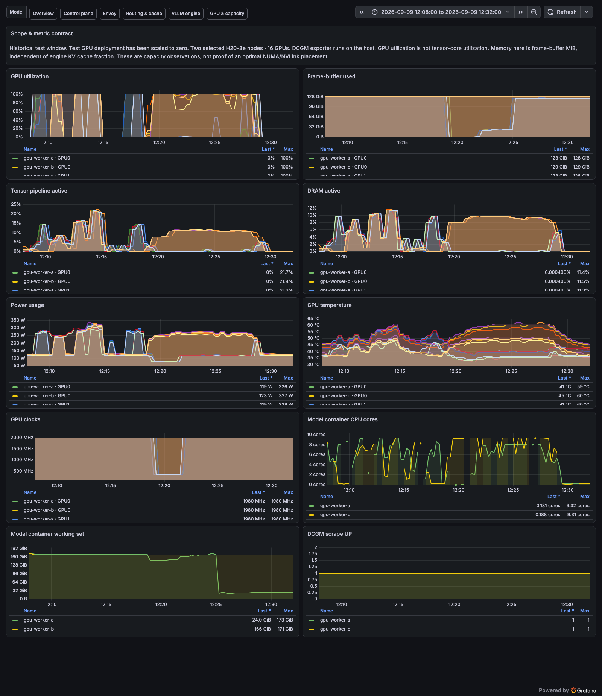
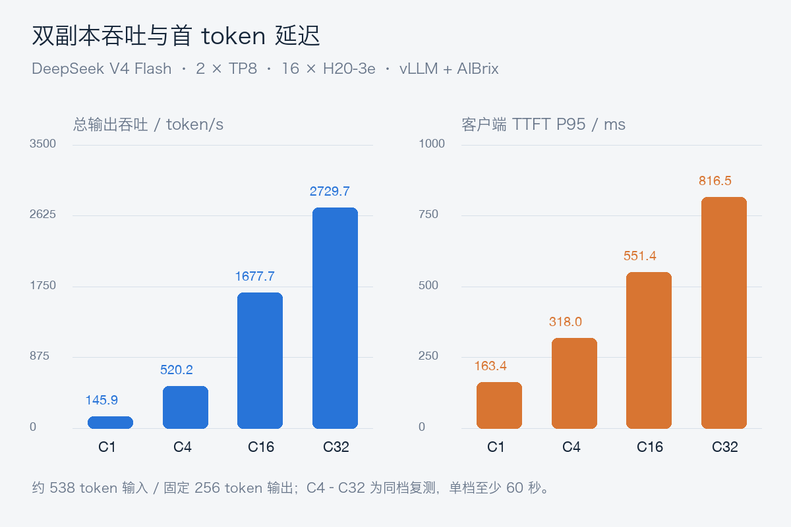
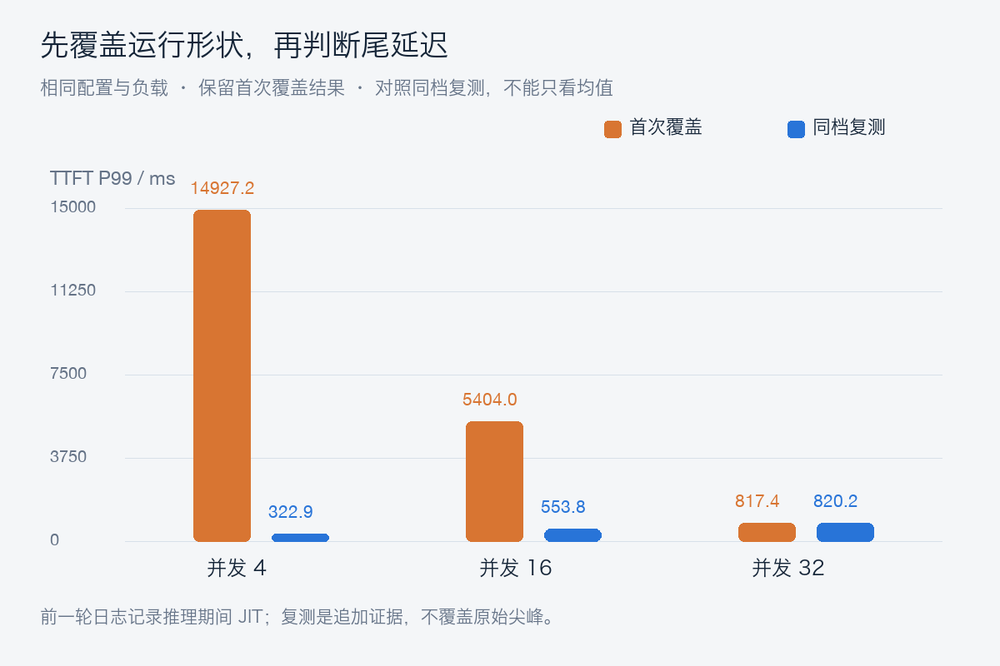

# AIBrix 面向生产的实战：用 DeepSeek V4 Flash 打通压测、看板与恢复验证

AIBrix 面向 Kubernetes 上的大模型推理服务，提供模型感知路由、运行时指标集成、缓存相关能力和扩缩容等组件。它与 vLLM 的职责不同：vLLM 负责执行模型，AIBrix 将多个模型副本组织成可以路由和管理的服务。本文围绕一条真实的请求链路，记录如何让性能数字、运行状态和恢复动作相互印证。[AIBrix 项目](https://github.com/vllm-project/aibrix/tree/v0.7.0)

承载业务流量的是 DeepSeek-V4-Flash-0731。V4 Flash 是 MoE 模型，具有稀疏注意力和 mHC 等实现特征；0731 是正式发布的 checkpoint，附带 DSpark 相关模块。是否存在草稿模块与部署是否启用推测解码是两回事。本次使用已经验证的 vLLM 运行时，采用普通 Prefill/Decode 共置、TP8、FP8 KV Cache，**没有启用 DSpark，也没有部署 P/D 分离或外部分布式 KV Cache**。模型服务的上下文上限设为 32K，不代表验证了模型的最大上下文能力。[vLLM 的 DeepSeek V4 Flash 配方](https://recipes.vllm.ai/deepseek-ai/DeepSeek-V4-Flash)

这是一套面向生产问题的真实 GPU 实战，仍然保留实验边界：共享控制面未改造成跨节点高可用，Prometheus 按需使用临时存储，测试入口只在集群内使用。后文分别列出实际验证结果与生产上线还需要完成的工作。

## 1. 先盘点已有能力，再补缺口

集群已有 AIBrix v0.7.0、Envoy Gateway v1.2.8、Envoy v1.33.2、Redis 和 DCGM exporter。没有发现可直接使用的独立 Prometheus/Grafana 工作负载，也没有 Prometheus Operator 的 CRD。因此采用独立 Prometheus 的 Kubernetes Service Discovery，避免为一次性能验证额外引入 Operator。

GPU 资源同时核对两层：Kubernetes 已分配的资源请求，以及节点上的实际 GPU 使用情况。只有两台节点同时满足 8 卡未分配、8 卡显存和利用率均空闲，才进入模型部署。本文使用 `gpu-worker-a`、`gpu-worker-b` 表示这两台机器；它们是脱敏后的逻辑名称。

| 层次 | 本次部署 | 隔离与观测范围 |
| --- | --- | --- |
| 模型 | 两个 Deployment 副本，每个 TP8 | 独立模型名、Service 和 Pod 标签 |
| GPU | 每台 8×H20-3e，共 16 卡 | 只采集选定两台机器的 DCGM 数据 |
| 路由 | 复用现有 AIBrix 与 Envoy | 模型统计按模型名过滤；共享网关指标明确标注全租户 |
| 压测端 | CPU 节点上的异步流式客户端 | 无 GPU 请求，只向测试模型发压 |
| Prometheus | 15 秒采集，24 小时或 8GB 保留上限 | `emptyDir`，不是持久化监控平台 |
| Grafana | 六类看板、固定数据源 UID | ClusterIP、登录认证、配置由 ConfigMap 供给 |
| 告警 | 八条 Prometheus 规则 | 验证评估状态；未接外部通知接收人 |

每个模型副本申请 8 张 GPU、64 CPU、256Gi 内存，限制为 160 CPU、1200Gi。`/dev/shm` 为 128Gi；模型目录只读挂载，可写编译缓存单独存放。这里的资源配置是本次实验选择，不能直接套用为所有模型的容量标准。

## 2. 把请求链路和证据链路一起搭好



AIBrix 根据模型标签发现副本，并为独立模型创建 HTTPRoute。我们检查了路由的 `Accepted=True` 与 `ResolvedRefs=True`，再通过网关发送真实请求验证返回值。Route 被接受、Pod Ready、模型能生成内容，分别证明不同层次，不互相替代。

还发送了一次超过服务上下文上限的请求：在 32K 上限下申请 40,000 个输出 token，入口实际返回预期的 HTTP 400。这个负向验证单独记录，不混入正常性能请求的成功率。

部署中设定跨节点的硬 Pod 反亲和、`maxSurge: 0`、`maxUnavailable: 1`、180 秒终止宽限期，以及 `minAvailable: 1` 的 PDB。两台机器刚好容纳两个八卡副本，因此没有足够 GPU 做第三副本的 surge 更新。更新期间必须接受容量下降，或者事先准备额外节点。

### 镜像同步的成功状态还不够

实际安装监控组件时，同步后台曾返回成功，但节点仍然报告 `ImagePullBackOff / not found`。核对后补齐源仓库到生产仓库、再到目标集群仓库的完整同步链路，两个监控 Pod 才成功启动。

这个问题的验收依据应当是目标镜像的 manifest/digest、CPU 架构和实际节点拉取结果。复制任务结束只是中间状态，不能作为镜像已可部署的唯一依据。本次保留了同步记录、拉取错误和 Pod Ready 状态，避免将安装问题误诊成模型或 Kubernetes 调度问题。

## 3. 六类看板各回答一个运行问题

本次参考 AIBrix v0.7.0 官方的控制面、Envoy、Gateway Plugin、vLLM 四类看板范围，按实际运行版本重新适配查询，再补充客户端总览与 GPU 容量看板。不是把上游 JSON 导入后直接宣布完成。[上游可观测性资产](https://github.com/vllm-project/aibrix/tree/v0.7.0/observability)

| 看板 | 主要观察内容 | 解释边界 |
| --- | --- | --- |
| Overview | 客户端 TTFT/TPOT、阶段吞吐、采集状态 | 客户端延迟包含入口和传输开销 |
| Control plane | Reconcile、错误、Workqueue、CPU/RSS | 共享控制器统计，不是某个模型的请求数 |
| Envoy | HTTP 状态、在途请求、连接、内存 | 共享入口含其他模型；整段流式请求时长不是 TTFT |
| Routing & cache | 成功阶段、失败阶段、副本分布、Prefix Cache、KV 水位 | 缓存索引器在线不等于缓存命中 |
| vLLM engine | TTFT、请求平均 TPOT、ITL、队列、Prefill、吞吐 | 使用当前引擎实际导出的指标名 |
| GPU & capacity | GPU/显存/功耗/温度、Tensor/DRAM 活跃度、CPU | GPU 利用率不等于 Tensor Core 活跃度 |

实际执行了六类看板的浏览器渲染检查，并验证全部 63 条查询没有表达式错误。以下截图选择同一段历史测试窗口，包含复测、缓存负载与单副本恢复过程；缩容后的当前值应与这段历史区分。



总览中客户端阶段吞吐是已完成档位的汇总值，因此会保留为水平线；引擎吞吐才反映采集窗口中的实时变化。读图时先找压测阶段，再对照 TTFT、队列及副本状态。



引擎看板中，副本 A 的指标间断对应本次驱逐和冷启动；副本 B 继续服务。恢复后的低负载窗口不能当作峰值吞吐。



GPU 看板使用节点逻辑别名，展示八卡分布。显存常驻与 GPU 计算活跃度是不同概念，空闲时显存占用高不意味着仍在处理请求。

### 不能忽略的版本差异

当前 vLLM 使用 `vllm:request_time_per_output_token_seconds` 表示请求平均 TPOT 的分布，KV 水位使用 `vllm:kv_cache_usage_perc`。旧看板里的 `time_per_output_token_seconds`、`gpu_cache_usage_perc`，以及旧版 CPU swap/cache 面板不能直接照搬。

Prefix Cache 命中率使用 token 计数器计算：

```promql
sum by (replica) (
  rate(vllm:prefix_cache_hits_total{job="aibrix-vllm"}[1m])
)
/
sum by (replica) (
  rate(vllm:prefix_cache_queries_total{job="aibrix-vllm"}[1m])
)
```

分母为零时，NaN 表示这个窗口没有可计算的查询量，不能解释成命中率为零。

运行请求数、等待请求数、活跃连接都是 Gauge，直接画水位；`rate()` 应用于 Counter。AIBrix 的 `gateway_request_model_success_total` 还包含请求头、请求体、响应等阶段，必须明确过滤 `status="gateway_request_success"`，不能把四个阶段相加当成四次成功请求。失败阶段计数也不保证等于去重后的失败请求数。插件阶段成功还不能替代客户端完整流成功，业务状态与流结束条件需要单独核对。

部分名称带 `bucket_total` 的 Gateway 指标本质上是分档 Counter，不是标准 Prometheus Histogram。未经核实累计桶和 `le` 标签语义，不能直接套 `histogram_quantile()`。

### TTFT、TPOT 和 ITL 分开看

| 指标 | 本次客户端定义 | 引擎侧对应观察 |
| --- | --- | --- |
| TTFT | 发起 POST 到第一个非空内容/推理片段 | `time_to_first_token_seconds` |
| 请求平均 TPOT | `(最后内容片段时间 − 首个内容片段时间) / (completion_tokens − 1)` | `request_time_per_output_token_seconds` |
| ITL | SSE 片段间隔只能称片段间隔 | `inter_token_latency_seconds` 是独立 Histogram |
| E2E | 发起请求到收到完整流结束 | `e2e_request_latency_seconds` |

输出 token 数取服务端最后一段 `usage.completion_tokens`，不把 SSE chunk 数当 token 数。TPOT 的结束时间不使用 `[DONE]` 或 usage 帧到达时间，避免把尾部协议开销混入逐 token 生成时间。

跨副本计算 P95 时，先汇总桶，再求分位数：

```promql
histogram_quantile(
  0.95,
  sum by (le) (
    rate(vllm:time_to_first_token_seconds_bucket{
      job="aibrix-vllm",
      model_name="dsv4-flash-aibrix-perf"
    }[1m])
  )
)
```

不能平均两个副本的 P95。看板 Histogram 给出桶内插值估计；下文压测表的分位数直接从逐请求原始记录计算，二者不会逐位相等。

桶比较粗时，差距可能很明显：真实样本集中在两个边界之间，插值得到的 P95 不一定接近逐请求精确 P95。验收尾延迟时应同时检查桶边界、样本数和客户端结果，不能仅凭两张看板数值不同就认定发生了网关延迟回归。

## 4. 用固定输出和分档负载建立性能基线

使用 `/v1/completions` 流式接口，`temperature=0`、`ignore_eos=true`、`max_tokens=256`，固定输出长度以便比较服务行为。这是合成性能负载，不是回答质量测评。

短输入在下面这段文本之前加入唯一 nonce，再重复正文 30 次；长输入重复 260 次。实际 token 数从 usage 中统计，不宣称不同随机 nonce 具有完全一致的 token 数。

```text
Request <unique nonce>
The service tracks request latency, token throughput, cache utilization,
and healthy replicas.
...（重复正文）
Continue with a technical explanation.
```

缓存负载将相同长前缀放在前面，仅在末尾变更 nonce。正式路由比较前，两副本都接收过相同长前缀的预热请求；后续还各自进行并发预热。因此它主要观察热前缀场景的请求分配，不能据此推导冷缓存下的独立收益。

每档是闭环并发：一个请求结束后，客户端才补发下一个；至少运行 60 秒，等待这一档所有请求结束，再进入下一档。实际到达率会随响应变慢而下降，因此这些数字不是固定 RPS 的容量极限，也未覆盖生产流量的突发分布。

| 场景 | 并发 | 成功/请求数 | 输出 tok/s | TTFT P95 / ms | TPOT P95 / ms |
| --- | ---: | ---: | ---: | ---: | ---: |
| 单副本直连 | 1 | 35/35 | 146.8 | 157.3 | 6.25 |
| 网关 C1 | 1 | 35/35 | 145.9 | 163.4 | 6.24 |
| 网关 C4 · 首轮 | 4 | 108/108 | 453.2 | 309.1 | 7.10 |
| 网关 C16 · 首轮 | 16 | 368/368 | 1547.0 | 3086.7 | 8.96 |
| 网关 C32 · 首轮 | 32 | 672/672 | 2755.2 | 811.3 | 10.90 |
| 约 4448 token 长输入 | 16 | 200/200 | 817.8 | 2738.2 | 17.32 |
| 热前缀 Random · 首轮 | 16 | 64/64 | 162.6 | 33747.2 | 156.15 |
| 热前缀 Prefix Cache · 首轮 | 16 | 288/288 | 1211.5 | 13728.5 | 9.51 |
| 网关 C4 · 复测 | 4 | 124/124 | 520.2 | 318.0 | 7.11 |
| 网关 C16 · 复测 | 16 | 400/400 | 1677.7 | 551.4 | 9.22 |
| 网关 C32 · 复测 | 32 | 672/672 | 2729.7 | 816.5 | 11.03 |
| 热前缀 Random · 复测 | 16 | 66/66 | 203.0 | 26761.0 | 116.99 |
| 热前缀 Prefix Cache · 复测 | 16 | 369/369 | 1529.2 | 345.3 | 9.47 |

13 个测量档位合计 3,401 个请求全部成功。两轮结果均保留；缓存场景的显著尖峰未被删除。分档均值与分位数只是这次合成负载的观察，不能直接承诺生产 SLO。





复测 C16 的 TTFT P95 为 551 毫秒，C32 为 817 毫秒；C32 总输出吞吐约 2,730 token/s。C4 的 P95 变化不大，但 P99 从约 14.93 秒降至 323 毫秒，说明只看均值或单一分位数容易遗漏少数极慢请求。

完整数据见 [阶段汇总 JSON](../../assets/practices/aibrix-dsv4-observability/benchmark-summary.json)、[脱敏逐请求记录](../../assets/practices/aibrix-dsv4-observability/requests.jsonl.gz)、[路由分布统计](../../assets/practices/aibrix-dsv4-observability/routing-counts.json)。

### 预热通过了，推理期间仍可能编译

第一批探索请求出现约 16 秒 TTFT，随后同形状请求稳定在百毫秒级。我们保留探索数据，给各并发档补上预热后重新测量。但每档两轮并发预热仍没有覆盖动态批处理形成的所有形状：日志明确记录推理期间触发 `mhc_pre_big_fuse_broadcast_with_norm_tilelang` 的 TileLang JIT，伴随尾延迟尖峰。

这说明 `/health` 成功与首个请求成功，不等于所有生产形状都已预热。实践上应按输入长度、并发、解码批量和路由分布设计预热矩阵，再用同档复测确认尾延迟。不能从报告中直接删除尖峰，或把所有 TTFT 增长归因于网关。

日志还显示，启用 Breakable CUDA Graph 时，vLLM 的 `torch.compile` pipeline 被关闭，但 TileLang JIT 仍然发生。关闭某一层编译并不意味着整个推理栈不存在首次编译开销。

### 缓存命中与负载均衡需要一起观察

按测试模型和正式测量时间窗口核对 Gateway 的 `request_start` 日志，第一轮 C32 的请求均匀落到两副本，各 336 次；同一长前缀的 Prefix Cache 路由则把第一轮 288 次请求全部分配到副本 A。这里使用的是模型名与窗口匹配，没有把客户端自建 request ID 当成跨网关必然保持不变的追踪标识。

前缀亲和确实改变了请求分配，但它也可能使一个热点前缀集中到单副本。本次随机缓存负载在复测时仍出现运行时 JIT，因此**没有获得足以量化两种路由独立收益的对照**。生产容量判断应同时看命中率、副本队列、TTFT 和负载偏斜；不能仅凭命中率高，就认定吞吐一定更高或尾延迟一定更低。

## 5. 用副本摘流与恢复验证运行机制

先维持并发 4 的短输入流式请求，再通过 Eviction API 摘掉一个测试副本。探测持续约 600.6 秒，共 **928 个请求，926 个完整成功、2 个读超时**，成功率约 99.78%；未自动重试。它与前面的 3,401 个性能请求分开统计。

| 验证点 | 实际结果 |
| --- | --- |
| 首个副本驱逐 | Eviction 返回 201，另一个副本继续提供服务 |
| 第二个副本保护 | 仅做 Eviction dry-run，返回 429，提示违反 PDB；没有执行第二次驱逐 |
| 新 Pod 创建 → Scheduled | 91 秒，包含旧副本退出及硬反亲和等待 |
| 新 Pod 创建 → Ready | **541 秒，约 9 分 1 秒** |
| 权重加载 | 日志记录约 47.4 秒；其余时间还包含初始化与编译预热 |
| 恢复后的生成验证 | 新副本真实生成 16 个输出 token，两个 Service 端点均恢复 |
| 告警 | 副本目标减少和采集失败曾进入 firing；恢复后 12 个目标全 UP、8 条规则均 inactive |

恢复期间，一个存活副本承担流量。两个超时请求均发生在驱逐附近，收到 HTTP 200 后等待约 92 秒仍未完成流。新 Pod 的编译缓存使用 emptyDir，重建需要重新预热，因而 47 秒权重加载不能被当成 47 秒扩容就绪。[恢复验证摘要](../../assets/practices/aibrix-dsv4-observability/recovery-summary.json)

测试结束后已将本次模型 Deployment 缩容到 0；Prometheus、Grafana 和 CPU 客户端保留，原始请求及监控区间数据已回传本地。

PDB 约束的是通过 Eviction API 发起的自愿中断，不会阻止直接删除 Pod，也无法抵挡节点宕机等非自愿故障。Deployment 的滚动更新策略、应用的终止处理、端点摘除与网关缓存刷新，各自承担不同职责。因此演练需要同时保留请求成功率、Pod/Endpoint 时间线和告警状态，不能只截一张两个 Pod Running 的图就认定完成恢复验证。

本次已经观察到的两个异常请求都收到了 HTTP 200，但没有完成完整流，最终发生 socket 读超时。因此单看 HTTP 状态统计会高估用户体验，流式服务还要验证结束标记、usage 和客户端超时。

这套基线**未验证无损摘流**。面向上线，下一步应单独验证端点撤下后的路由传播等待、应用在途请求排空、`preStop` 与终止宽限期的配合，以及取消请求的语义。等待时间应根据最长请求和实测路由传播时间设置；不能随手加一个固定 sleep 就宣布解决。本次未将这些尚未执行的改进计为通过项。

## 6. 告警先能解释，再考虑通知

八条规则覆盖副本指标目标减少、采集失败、客户端请求错误、TTFT 预算、排队、KV 水位、GPU 温度和控制器错误。TTFT 示例预算为 P95 大于 1 秒，并要求窗口中有足够样本；这只是演示阈值，需要根据产品交互和负载类型重新定标。

告警状态需要区分：`inactive` 没有达到条件，`pending` 正在等待持续时间，`firing` 达到触发条件。规则健康为 `ok` 只代表表达式评估成功。没有 Alertmanager 或企业告警平台的接收链路时，`firing` 不代表值班人员已经收到通知。

本次未向任何外部收件人发送告警。正式接通知时，还应验证路由、抑制、维护静默、值班归属和恢复通知，避免副本更新引发无意义的告警风暴。

## 7. 走向生产，还需要补哪些环节

| 方面 | 本次已经验证 | 生产还需要完成 |
| --- | --- | --- |
| 发布与回滚 | 独立模型、反亲和、探针、PDB、真实请求 | 镜像 digest、发布审批链、灰度比例、回滚版本保留 |
| 容量与延迟 | 分档并发、长输入、缓存负载、TTFT/TPOT | 固定到达率、真实 prompt 分布、SLO 下的容量余量 |
| 故障恢复 | 本文限定的单副本演练 | 节点失联、跨故障域、网关/控制面/Redis 故障 |
| 高可用 | 模型副本跨两节点 | 共享网关及控制面跨节点部署，状态存储恢复策略 |
| 自动扩缩容 | 采集排队、吞吐、KV 等候选指标 | 在明确 GPU 配额和冷启动时延后验证策略，避免抖动 |
| 安全入口 | 集群内专用模型路径、Grafana 登录 | 身份认证、租户配额、并发/Token 限额、超时、审计 |
| 可观测性 | 十二个采集目标、六类看板、八条规则 | 持久化或 remote_write、长期保留、备份与告警接收链路 |

### GPU 拓扑与 NUMA 不能省略

本次每副本使用整台机器的八卡 TP，避免了四卡容器随机拿到跨互联分组的卡，但不等于 CPU、内存和 GPU 已自动达到最佳亲和。现场执行 `nvidia-smi topo -m` 确认八卡之间均为 NV18；GPU 0–3 归属 NUMA 0，GPU 4–7 归属 NUMA 1。GPU 互联良好并不能消除主机侧跨 NUMA 的成本。本次 CPU requests 与 limits 不相等，属于 Burstable 配置，未验证独占绑核效果。生产应结合 CPU Manager、Topology Manager、设备插件能力评估绑核与内存策略，并用相同负载复测。

多节点 TP、EP 或 P/D 还会增加网络接口、RDMA、传输后端和跨节点带宽等变量。本次两副本各自在单节点内 TP8，不能拿这里的恢复和吞吐结果证明跨节点并行性能。相关拓扑与通信问题应独立验证，再放进同一套指标链路对比。

### 扩容速度受模型启动和预热约束

Autoscaler 发现排队之后才申请 GPU，不会立刻得到可承载业务的副本。端到端扩容时间至少包括排队调度、拉镜像、检查权重、加载权重、初始化通信与缓存、编译捕图、Ready 和代表性请求预热。生产需要根据这个时间决定常驻余量与最大突发量，而不是只追求空闲时把副本降到最低。

## 8. 复用材料

部署模板、看板 JSON、采集和告警规则、流式客户端见 [完整示例目录](https://github.com/runzhliu/aik8s/tree/main/examples/aibrix-dsv4-observability)。模板使用 `inference-lab` 命名空间，节点、镜像和模型 PVC 均由本地配置渲染；修改成自己的实际环境后，先 dry-run，再部署。

对已装 Prometheus Operator 的集群，可以把相同采集目标转换成 ServiceMonitor/PodMonitor，把规则转换成 PrometheusRule；要检查 label selector 和命名空间选择器是否真正匹配。没有 Operator 时，创建 ServiceMonitor 对象并不会自动产生采集行为。

配套阅读：[既有集群落地 AIBrix](aibrix-existing-cluster.md)、[DeepSeek V4 Flash H20 部署与压测](deepseek-v4-flash-h20-evaluation.md)、[AIBrix 多机与 P/D 实测](aibrix-gpu-multinode-pd-production.md)。
