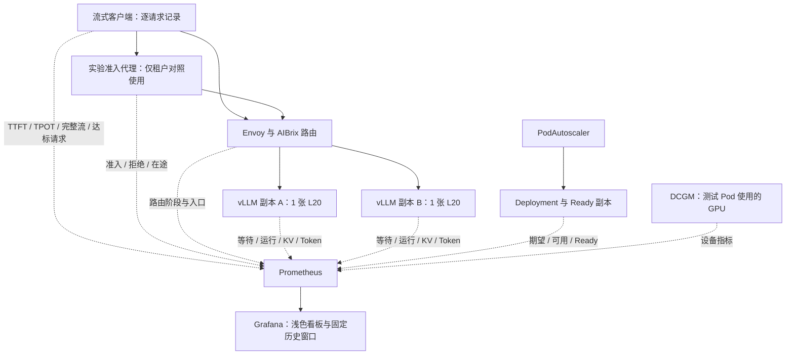
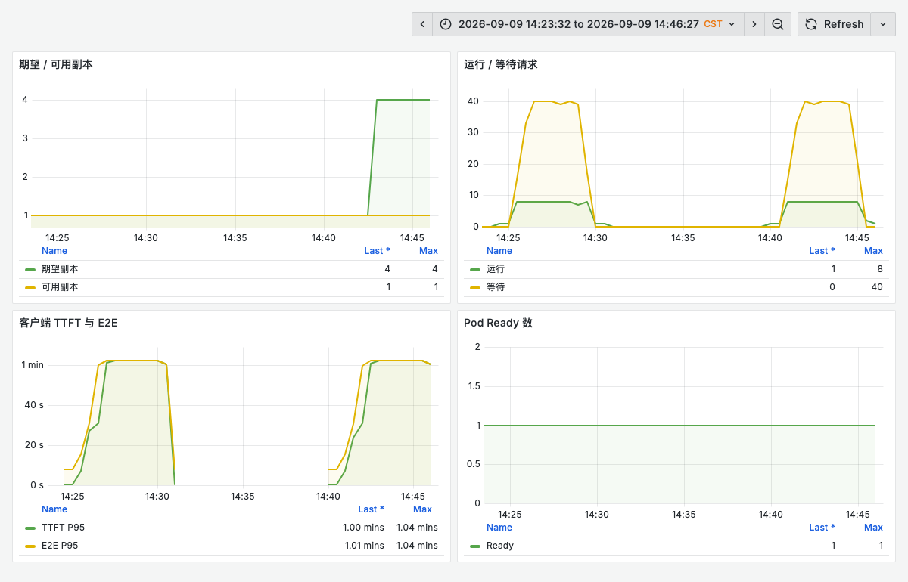
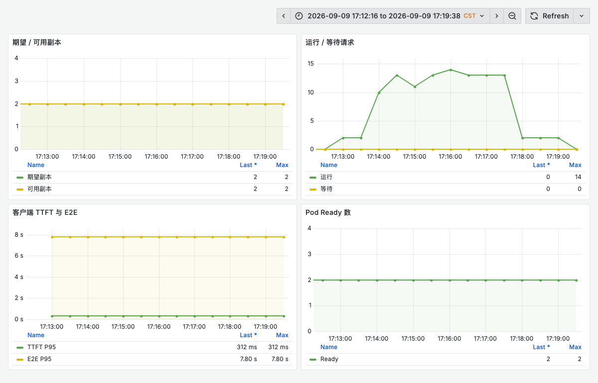
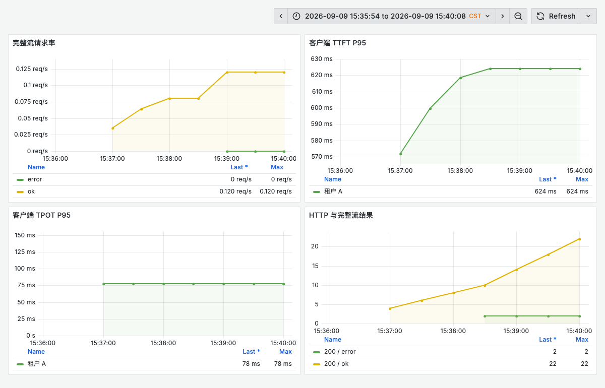
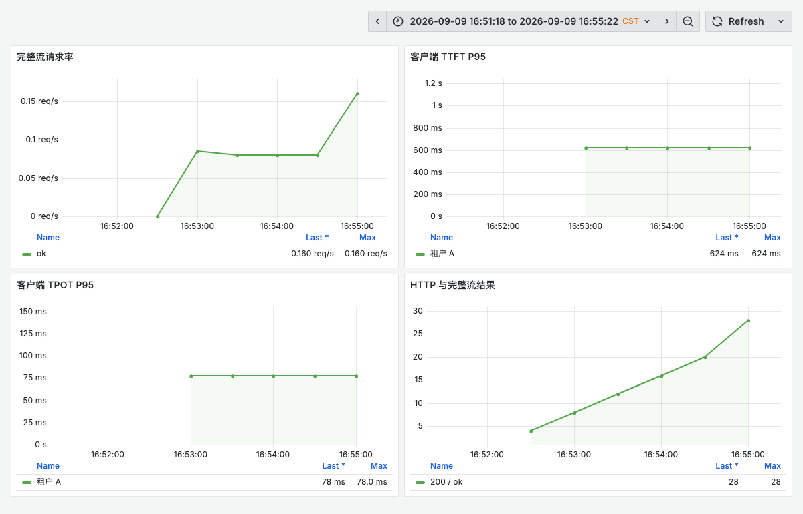
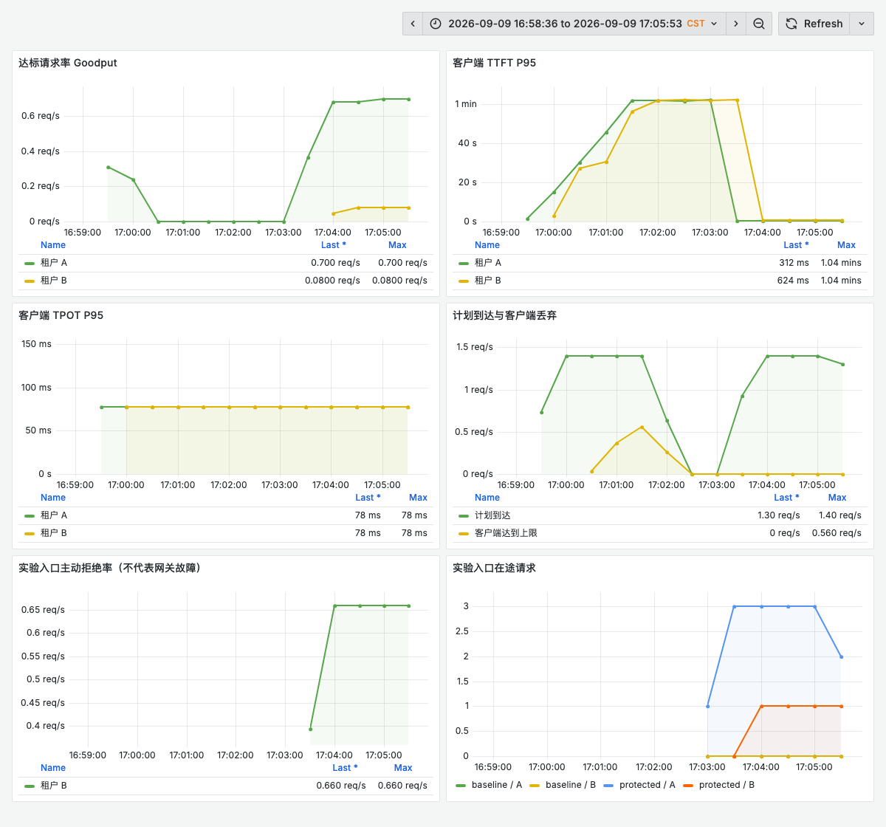
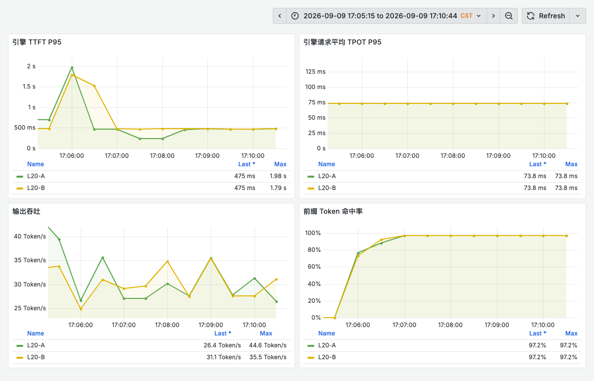

# AIBrix 生产实战：Qwen3.8-27B 在 L20 上的容量、退出与过载保护

Qwen3.8-27B 是一个 270 亿参数的稠密视觉语言模型，沿用 Qwen3.5 的混合注意力架构，在 64 层中组合 Gated DeltaNet 与 Gated Attention。官方提供细粒度 FP8 权重，模型原生上下文为 262,144 token，并支持图像、视频理解及思考控制。较小的单副本规模，使它适合用来观察推理平台在副本增减、长短请求竞争和缓存路由下的行为。[官方模型说明](https://huggingface.co/Qwen/Qwen3.8-27B-FP8)

本文使用 **Qwen3.8-27B-FP8、单张 L20 一个副本、vLLM 与 AIBrix v0.7.0**。服务配置为纯文本、32K 上下文、MTP 关闭，因此下文的性能结果不代表多模态、原生最大上下文或推测解码能力。

在此前的 [DeepSeek V4 Flash 可观测性实战](aibrix-dsv4-observability.md) 中，我们打通了请求、引擎、网关和 GPU 的指标。这次进一步追问：突发流量到来时，扩容是否来得及？Pod 正常退出会不会断流？保护短请求需要付出什么代价？缓存命中率上升是否足以证明路由算法更好？

本轮保存了 **13 个正式测试阶段、2,566 条实际发出的请求记录**，另有校准请求未混入正式统计。完成后已删除本实验的自动扩缩容对象，将 GPU Deployment 缩容为 0。本文是一份有边界的实测记录；KPA 实际扩缩容、受控冷缓存和部分高级能力尚未完成验证，不能将其视为完整的生产验收。

## 1. 环境与测量口径

| 项目 | 实际配置 |
| --- | --- |
| 模型运行时 | 容器内版本 `0.26.0b2.dev1+g3b102b576`；不以镜像标签代替版本 |
| 单副本 GPU | 1×L20，TP=1；节点与其他业务共享 |
| 服务容量 | 主要对照为 1 / 2 个副本；冷启动 APA 曾期望 4 个，未形成 4 个 Ready 副本 |
| 引擎限制 | `max-model-len=32768`、`max-num-seqs=8`、`max-num-batched-tokens=8192` |
| 缓存 | FP8 KV Cache，GPU memory utilization 0.90，Prefix Cache 与 Chunked Prefill 开启 |
| 单副本 CPU / 内存 | requests 4 CPU / 48Gi；limits 16 CPU / 128Gi；共享内存 16Gi |
| 模型存储 | 只读共享存储；可写编译缓存独立挂载 |
| 监控 | 复用 Prometheus/Grafana；模型、客户端、网关、控制器、Kubernetes 与 DCGM 指标 |
| 命名 | 图中的 L20-A / L20-B 为节点逻辑别名；公开查询使用示例 namespace |

### 先定义什么叫“成功”

客户端通过 AIBrix 入口调用 `/v1/completions`，使用流式响应、`temperature=0`、`ignore_eos=true`，并请求返回 token usage。只有 HTTP 200、出现内容、收到 `[DONE]` 且获得有效输出 usage，才计入完整流成功。正式阶段的成功响应均核对了输出 token 数与配置一致。

- **TTFT**：客户端发起 POST 到收到第一段内容的时间，包含入口与传输开销。
- **TPOT**：`(最后内容时间 - 首段内容时间) / (输出 token 数 - 1)`，是请求平均值；SSE 分块与网络缓冲会影响客户端观测。
- **E2E**：客户端发起请求到完整流结束的时间。
- **达标请求**：完整流成功，且 TTFT ≤ 2 秒、TPOT ≤ 150 毫秒、E2E ≤ 30 秒，三项同时满足。

本文表格的 P95 来自逐请求数据，使用线性插值，仅统计成功完整流。Grafana 中 `histogram_quantile()` 给出滑动窗口、直方图桶插值的估计值，不能要求它与整轮原始 P95 完全相同。拒绝与失败必须同时展示，不能用成功样本的低延迟掩盖它们。[vLLM 指标说明](https://docs.vllm.ai/en/stable/usage/metrics/)

### 实际使用的 Prompt

普通请求把唯一 nonce 放在前面，避免所有请求天然共享完整前缀：

```text
Request <每条请求不同的 nonce>
The service tracks request latency, token throughput, cache utilization, and healthy replicas.
...重复上述句子 N 次...
Continue with a technical explanation.
```

容量测试 N=30、固定输出 128 token；租户测试中 A 使用 N=30 / 输出 64，B 使用 N=90 / 输出 512。租户测试实际输入约为 A 513–522、B 1,472–1,482 token。缓存测试 N=300 / 输出 64，改为先放重复正文，再放唯一 nonce，形成可共享前缀。这是合成性能负载，没有对生成答案进行质量评分。

开放到达率测试在客户端达到 48 个在途请求时，会放弃该次计划到达，记录为 `dropped_arrivals`。这些请求没有到达服务端，必须计入负载兑现情况。固定并发测试则在前一个请求结束后补发，同样时长下不同阶段的请求数量可能不同。

## 2. 六类看板把服务行为串起来



| 看板 | 主要回答的问题 | 注意范围 |
| --- | --- | --- |
| 总览 | 请求是否完整、是否达标，延迟发生在哪个阶段？ | 客户端视角；HTTP 200 与完整流结果分开 |
| 扩缩容 | desired 增加后何时形成 Ready 容量？ | 同时观察等待请求和可用副本 |
| 引擎 | 排队、解码、缓存还是抢占造成退化？ | TTFT / TPOT / KV / Prefix Cache / Token 吞吐 |
| 路由与入口 | AIBrix 阶段是否失败，入口是否拥堵？ | 插件按模型过滤；共享 Envoy 包含其他业务 |
| GPU 与容量 | 测试 GPU 的计算、显存、功耗如何变化？ | 通过测试 Pod 标签筛选；节点并非独占 |
| 控制面 | 协调是否报错，工作队列是否积压？ | 共享控制器统计，不能直接归因于测试模型 |

历史导出覆盖 **46 条查询**，每条均取得过有限数值；这表示观测链路可用，不表示每个阶段每张图都有样本。查询间隔为 15 秒，速率窗口为 1 分钟。下面按案例选择固定时间段，避免缩容后的当前空闲状态覆盖测试证据。

常用查询示例，标签值需替换为自己的模型和采集任务：

```promql
# 先看排队，再看运行；Gauge 直接读取
sum(vllm:num_requests_waiting{job="qwen-lab-engine",model_name="qwen38-aibrix-lab"})
sum(vllm:num_requests_running{job="qwen-lab-engine",model_name="qwen38-aibrix-lab"})

# 客户端 TTFT P95；不要平均各 Pod 的 P95
histogram_quantile(0.95, sum by(le) (
  rate(qwen_lab_ttft_seconds_bucket{job="qwen-lab-client",phase="kpa-min2-wave"}[1m])
))

# 完整成功且达到三项 SLO 的请求率
sum(rate(qwen_lab_good_requests_total{job="qwen-lab-client"}[1m]))
```

AIBrix 的成功阶段计数可能分别记录请求头、请求体与响应处理。把所有 `status` 相加，会重复计算同一请求。生产成功率应以客户端或业务出口的完整请求为准；阶段指标用于定位故障发生的位置。

## 3. 容量：冷启动 APA 没有赶上这次突发

所有 wave 阶段使用同一开放到达率：60 秒 × 0.2 RPS，240 秒 × 1.6 RPS，90 秒 × 0.2 RPS，共 **414 次计划到达**。请求形状为 N=30、输出 128 token。

| 策略与起始条件 | 实际发送 / 完整成功 | 客户端丢弃 | 达标请求 | TTFT P95 |
| --- | ---: | ---: | ---: | ---: |
| 固定 1 副本 | 309 / 309 | 105 | 28 | 40.381 秒 |
| APA，从 1 个 Ready 副本开始 | 309 / 309 | 105 | 28 | 40.398 秒 |
| APA，先等 2 个副本 Ready | 414 / 414 | 0 | 414 | 0.298 秒 |
| 固定 2 副本 | 414 / 414 | 0 | 414 | 0.299 秒 |
| KPA，先等 2 个副本 Ready | 414 / 414 | 0 | 414 | 0.299 秒 |

<picture>
  <source media="(max-width: 600px)" srcset="/assets/practices/aibrix-qwen-l20/grafana-capacity-mobile.png">
  
</picture>

冷启动 APA 的目标是每副本 4 个运行请求，最小 1、最大 4 副本。观察到平滑后的负载指标上升较晚，期望副本曾达到 4；但只有 1 个 Ready，另外 2 个仍在启动，第 4 个缺少可分配 GPU。新副本没有在突发结束前形成可用承载能力。

图中左、右两段负载分别对应固定单副本和冷启动 APA。客户端直方图在长延迟区间的桶较粗，窗口 P95 可显示为约一分钟；精确的整轮 TTFT P95 以表格中的 40.381 / 40.398 秒为准。生产监控应围绕实际 SLO 及过载区间设置更细的桶。

因此，“Autoscaler 已经把 replicas 改成 4”不能等同于“已有 4 卡接住流量”。单副本阶段即使实际发出的请求全部成功，仍有 105 次计划到达在客户端被丢弃，只有 28 次请求满足 SLO。

后续将范围调整为 2–3，并等待两个副本 Ready，再施加同样波形，才获得低延迟结果。固定两个副本也取得几乎相同结果，支持的结论是 **这段负载需要提前准备的双副本容量**，不能据此认定 APA 比固定容量更优。

### KPA 这轮验证到哪里

<picture>
  <source media="(max-width: 600px)" srcset="/assets/practices/aibrix-qwen-l20/grafana-kpa-mobile.png">
  
</picture>

KPA 配置为最小 2、最大 3、目标运行请求数 4。该轮 414/414 请求全部达标，TPOT P95 为 59.8 毫秒，E2E P95 为 7.87 秒。但 36 个容量观察点的期望与 Ready 副本都为 2，**没有触发实际扩容**。它证明该配置下双副本可承载此波形，尚未验证 KPA 从扩容到缩容的完整行为，也不能用于比较 APA/KPA 的响应速度。

## 4. 退出：180 秒 Pod 宽限期仍然可能断流

两组均从两个 Ready 副本开始，以 C=4、N=30、输出 512 token 连续发压 180 秒；开始约 30 秒后，正常删除本实验的一个模型 Pod。客户端等待所有已发出的请求结束，失败也写入记录。

| 配置 | 实际请求 | 完整成功 | 失败 | 成功请求 TTFT P95 |
| --- | ---: | ---: | ---: | ---: |
| 原退出配置 | 24 | 22 | 2 | 0.536 秒 |
| 增加引擎排空与 preStop | 28 | 28 | 0 | 0.634 秒 |

原配置的两次失败已收到 HTTP 200，却没有完成流，最终分别在约 91.2、92.9 秒发生读取超时。只统计 HTTP 状态会把这两个请求误记为成功。

<picture>
  <source media="(max-width: 600px)" srcset="/assets/practices/aibrix-qwen-l20/grafana-drain-before-mobile.png">
  
</picture>

核对实际容器代码发现，当前运行版本的 `shutdown_timeout` 默认值为 0；参数说明将 0 对应为中止，正值才等待引擎中的请求完成。Pod 的 `terminationGracePeriodSeconds: 180` 只是 Kubernetes 允许进程退出的总时间，并不会自动修改引擎内部的退出策略。

修复分为三个层次：

1. vLLM 增加 `--shutdown-timeout 90`，让引擎等待已有请求。
2. 增加 10 秒 preStop，为路由与 Endpoint 更新留出传播时间；这段时间本身不提供分布式完成确认。
3. 保留 180 秒 Pod 宽限期，覆盖 preStop、引擎排空与进程清理。

以下为关键配置片段，`args` 应追加到完整启动参数，不能用这两项覆盖原参数列表：

```yaml
spec:
  template:
    spec:
      terminationGracePeriodSeconds: 180
      containers:
        - name: vllm
          # 在原 args 中追加 --shutdown-timeout 和 "90"
          lifecycle:
            preStop:
              exec:
                command: ["python3", "-c", "import time; time.sleep(10)"]
```

AIBrix v0.7.0 的 Ready Pod 过滤逻辑会排除正在终止的 Pod。这里只使用已核实的版本行为，没有把新版本文档中的 drain 注解当作本轮已验证配置。[v0.7.0 Pod 过滤实现](https://github.com/vllm-project/aibrix/blob/v0.7.0/pkg/utils/pod.go)

<picture>
  <source media="(max-width: 600px)" srcset="/assets/practices/aibrix-qwen-l20/grafana-drain-after-mobile.png">
  
</picture>

复测 28/28 完整成功，退出日志也记录了先完成请求、再关闭引擎。两轮是固定并发模式，请求总数不相同，且副本节点布局发生变化；因此不能把 24→28 解释成退出参数带来的吞吐提升。这是小样本的正常终止验证，也不覆盖强制删除、节点断电、OOMKill 或网络中断。

## 5. 过载保护：短请求变快，代价必须同时呈现

这一组让两个逻辑租户交替到达，总速率 1.4 RPS、150 秒，A/B 各有 105 次计划到达。A 是短输出交互，B 是长输入、长输出请求。两组都经过同一个实验准入代理，减少代理本身对对照的干扰。

保护组为 A 最多 4 个在途、B 最多 2 个在途，额度一直占用到流结束；超过上限返回 HTTP 429。**这是本实验自行实现的入口并发控制，并非 AIBrix 原生的租户隔离功能**。租户头仅用于构造实验流量，也不代表身份认证。

| 模式 / 租户 | 计划到达 | 实际发送 | 客户端丢弃 | 完整成功 | 主动 429 | 达标请求 | 成功请求 TTFT P95 |
| --- | ---: | ---: | ---: | ---: | ---: | ---: | ---: |
| 无保护 / A | 105 | 87 | 18 | 87 | 0 | 15 | 42.294 秒 |
| 无保护 / B | 105 | 85 | 20 | 85 | 0 | 0 | 43.861 秒 |
| 有保护 / A | 105 | 105 | 0 | 105 | 0 | 105 | 0.303 秒 |
| 有保护 / B | 105 | 105 | 0 | 10 | 95 | 10 | 0.592 秒 |

<picture>
  <source media="(max-width: 600px)" srcset="/assets/practices/aibrix-qwen-l20/grafana-admission-mobile.png">
  
</picture>

短请求 A 的达标数从 15 提高到 105，但 B 有 **95/105 被主动拒绝**。这个结果说明并发准入可以保护交互延迟；它没有创造更多 GPU 容量，也没有让所有租户都得到更高成功率。

公开图表必须同时保留计划到达、客户端丢弃、429、完整流失败和达标数。尤其不能只写“延迟降到 0.3 秒”，省略长请求的拒绝代价。生产场景还需决定 B 是进入有界异步队列、获得独立资源池，还是接受明确的拒绝策略。

实验代理的额度是单进程计数。生产入口多副本部署时，需要可信身份、跨副本配额一致性、请求取消后的额度回收，以及带抖动的重试预算；直接增加代理副本会放大有效额度，不能把这个实验实现原样当成分布式限流系统。

## 6. 缓存：看到了命中，也看到了预热干扰

缓存对照使用 C=4、N=300、固定输出 64，每段发压 60 秒。策略顺序为 least-request → prefix-cache → prefix-cache → least-request，每段均完成 68 个请求。

| 顺序 | 路由策略 | 完整成功 | TTFT P95 |
| --- | --- | ---: | ---: |
| 1 | least-request A | 68 / 68 | 1.198 秒 |
| 2 | prefix-cache A | 68 / 68 | 0.284 秒 |
| 3 | prefix-cache B | 68 / 68 | 0.291 秒 |
| 4 | least-request B | 68 / 68 | 0.287 秒 |

<picture>
  <source media="(max-width: 600px)" srcset="/assets/practices/aibrix-qwen-l20/grafana-cache-mobile.png">
  
</picture>

如果只取前两段，会得出 prefix-cache 快了数倍的结论。但第四段 least-request 同样达到约 0.29 秒，说明预热与历史状态存在明显干扰。

当前服务暴露的 API 中未发现可用于本轮统一重置的 `/reset_prefix_cache`；四段保留了引擎缓存与路由索引状态，且只使用单一热点前缀。因此这些结果应称为 **在线缓存路由交叉观察**，尚不足以证明某种策略在受控冷缓存、多前缀竞争或缓存迁移中更优。

前缀命中率按 token 计算，不是请求命中比例：

```promql
sum by(node_alias)(rate(vllm:prefix_cache_hits_total{job="qwen-lab-engine"}[1m]))
/
sum by(node_alias)(rate(vllm:prefix_cache_queries_total{job="qwen-lab-engine"}[1m]))
```

分母为零时没有可计算的查询量，不能把 NaN 当作 0% 命中。流量形状、缓存初态、路由顺序与实际落点都需要随结果保存。

## 7. 生产配置可以如何落地

**把启动时间纳入容量预算。** 以镜像拉取、模型读取、编译、Ready 到首个完整请求的实际时间估算扩容提前量。对突发明显的在线服务保留足够的预就绪副本；只有 GPU 能调度、Pod 能及时 Ready，期望副本才有意义。

**将 SLO 和请求成本结合。** 同时监控 TTFT、请求平均 TPOT、E2E、完整流与 goodput。长输入主要增加 Prefill 成本，长输出延长 Decode 占用；按请求条数平均限流可能无法控制资源竞争，需要结合 token 预算、在途上限与有界排队。

**为更新和退出留容量。** 本实验使用 `maxSurge: 1`、`maxUnavailable: 0`，但这依赖额外 GPU。没有备用卡时，应选择允许容量下降的更新方式，并提前减少流量。软拓扑分散不能保证跨节点容灾；是否使用硬约束、PDB 和跨故障域副本，要结合实际节点数与资源储备验证。

**对齐入口、引擎和 Kubernetes 的超时。** 流式请求的总时长与空闲超时不同，网关连接保持、客户端读取超时、引擎排空、preStop 和 Pod 宽限期都要一起检查。正常退出验证通过后，仍需单独验证取消、重试、强制失败及重复计费等业务后果。

**固定运行时并验证精度与内核。** 本次运行时存在 FP8 KV scale 默认值及 L20 部分内核配置回退提示。性能负载没有验证这些设置下的答案质量，不能据此宣称 FP8 无损或硬件已最优调优。升级引擎后，应重新核对参数、模型实现、指标名称和质量基线。

**把实验监控升级成有保留策略的平台能力。** 本轮保留历史导出即可满足复盘；生产需要按故障追溯周期设置存储与保留时间、访问控制、备份和告警通知。共享网关与控制器的指标必须标明统计范围，避免将其他模型造成的波动归因于当前模型。

## 8. 尚未完成的验证与证据下载

| 范围 | 当前状态 |
| --- | --- |
| 1 / 2 副本、冷启动 APA、双副本 KPA 波形 | 已取得实际负载与监控数据 |
| 正常 Pod 删除的完整流、引擎退出修复 | 已完成前后两组验证；不覆盖强制故障 |
| 短长租户过载保护 | 已完成自建代理对照；非原生分布式配额验证 |
| 单热点在线缓存交叉策略 | 已完成；缓存初态未统一 |
| 4 个 Ready 副本基线 | 未完成，实际空闲资源不足 |
| KPA 实际扩容与缩容、APA/KPA 算法对比 | 未完成，当前波形没有触发 KPA 扩容 |
| 多前缀、受控冷缓存与路由因果对照 | 未完成 |
| P/D、外部 KV Connector、LoRA、批处理入口 | 未完成对应兼容性及负载验证，不推断为不支持 |
| 独立网关 / 控制面高可用故障注入 | 未执行，共享组件未做破坏性操作 |

所有 GPU 测试副本已释放；监控与本地证据保留。以下文件使用逻辑名称并去除请求 ID、内部地址等字段，时间序列以第一轮正式阶段开始为相对时间原点：

- [各阶段汇总与完整方法参数](../../assets/practices/aibrix-qwen-l20/results.json)
- [2,566 条逐请求记录 JSONL](../../assets/practices/aibrix-qwen-l20/requests.jsonl)
- [46 条查询的历史指标导出](../../assets/practices/aibrix-qwen-l20/metrics.json)
- 完整六类运行看板：[总览](../../assets/practices/aibrix-qwen-l20/full-qwen-lab-overview.json)、[扩缩容](../../assets/practices/aibrix-qwen-l20/full-qwen-lab-scaling.json)、[引擎](../../assets/practices/aibrix-qwen-l20/full-qwen-lab-engine.json)、[路由与入口](../../assets/practices/aibrix-qwen-l20/full-qwen-lab-routing.json)、[GPU 与容量](../../assets/practices/aibrix-qwen-l20/full-qwen-lab-gpu.json)、[控制面](../../assets/practices/aibrix-qwen-l20/full-qwen-lab-control.json)。
- Grafana 案例看板：[容量](../../assets/practices/aibrix-qwen-l20/dashboard-capacity.json)、[退出修复前](../../assets/practices/aibrix-qwen-l20/dashboard-drain-before.json)、[退出修复后](../../assets/practices/aibrix-qwen-l20/dashboard-drain-after.json)、[准入](../../assets/practices/aibrix-qwen-l20/dashboard-admission.json)、[缓存](../../assets/practices/aibrix-qwen-l20/dashboard-cache.json)、[KPA](../../assets/practices/aibrix-qwen-l20/dashboard-kpa.json)。

看板 JSON 使用数据源 UID `prometheus`，namespace 示例为 `inference-lab`，保留本实验的指标、job 与模型标签约定。导入其他集群前需要映射这些标签，并部署相应客户端指标；单独导入 JSON 不会产生实验数据。固定窗口截图用于复盘，默认相对时间的看板用于重新执行时查看。
