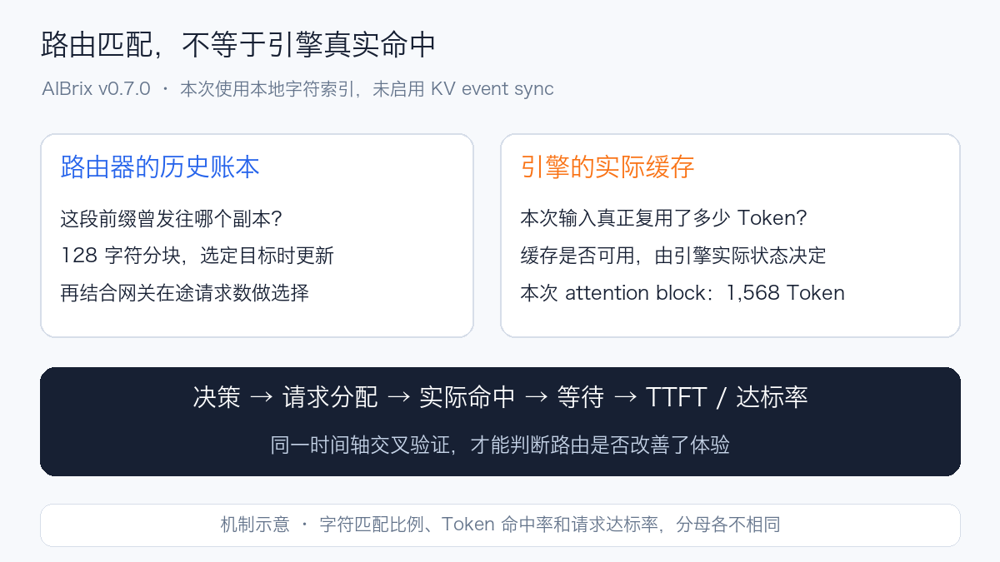
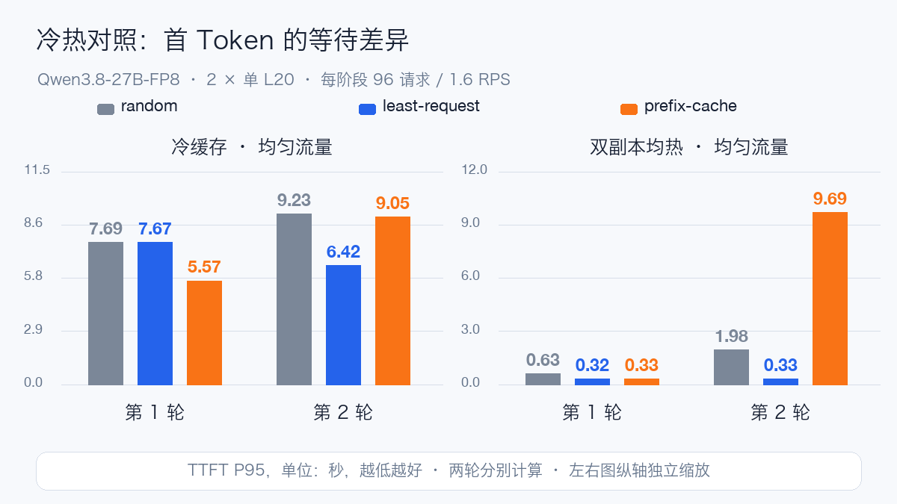
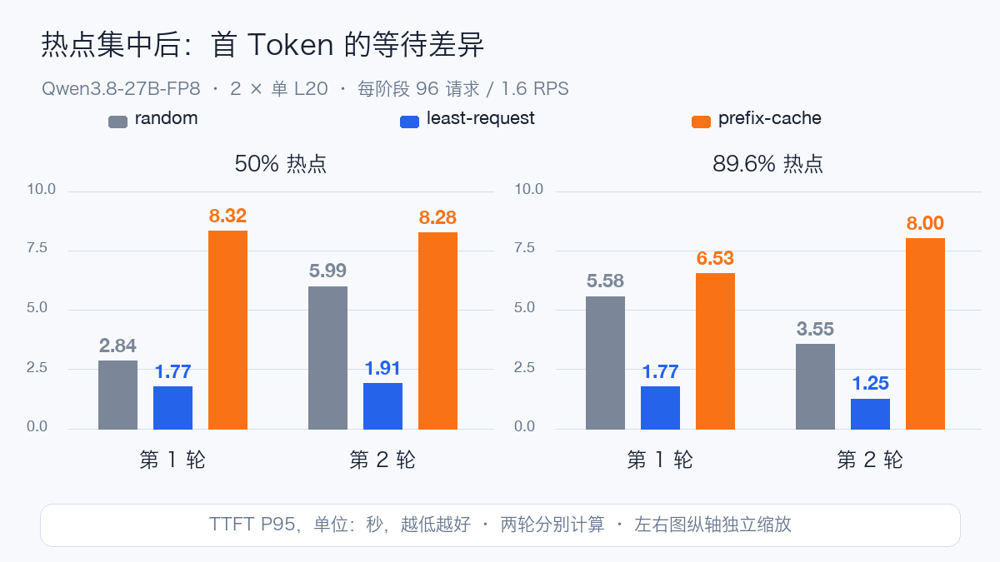
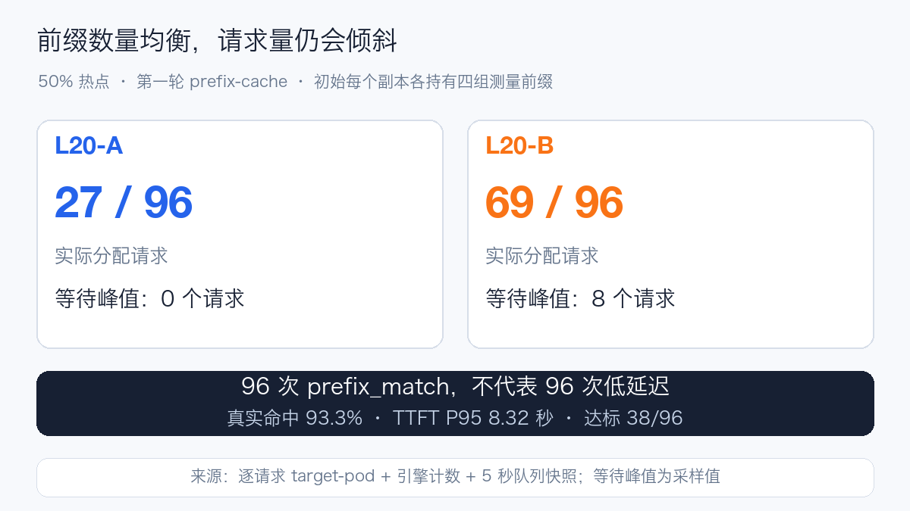
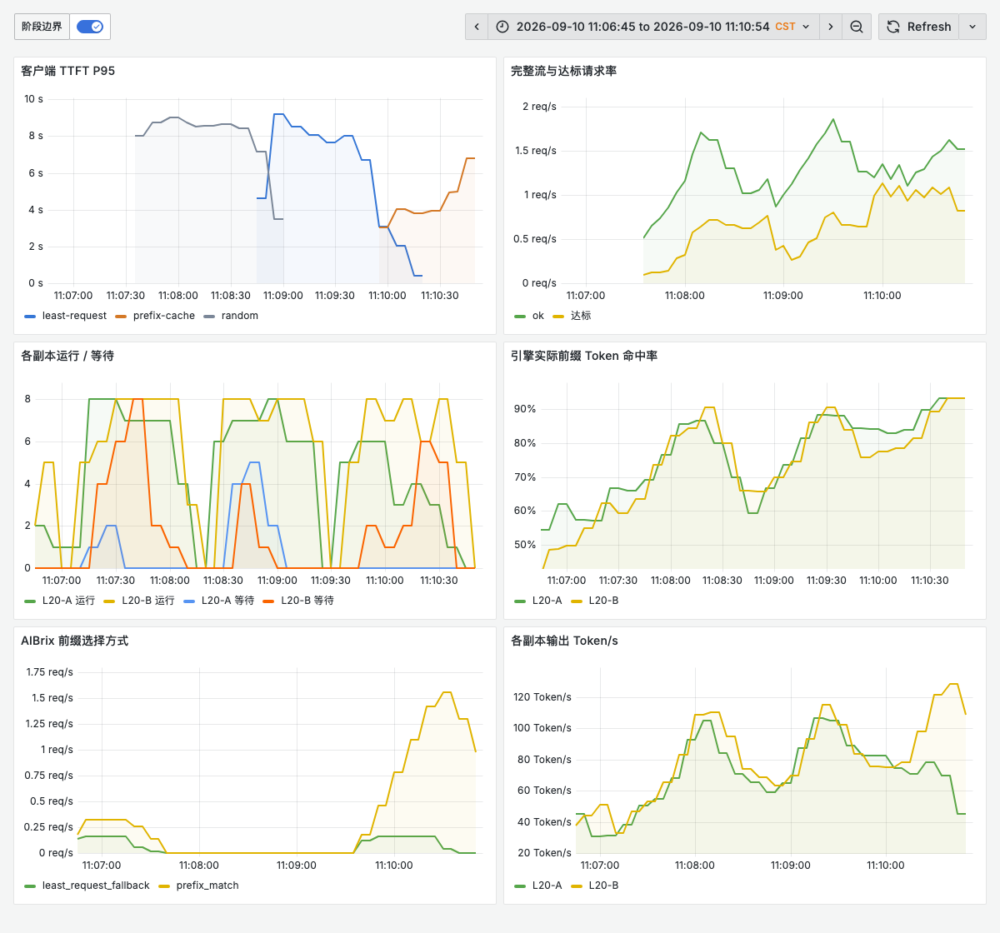
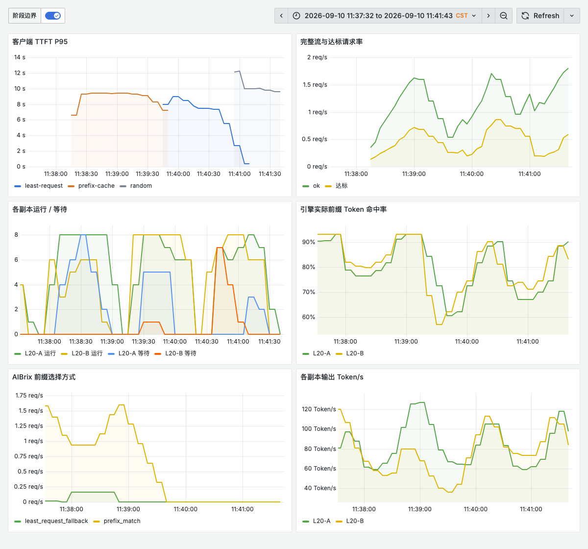
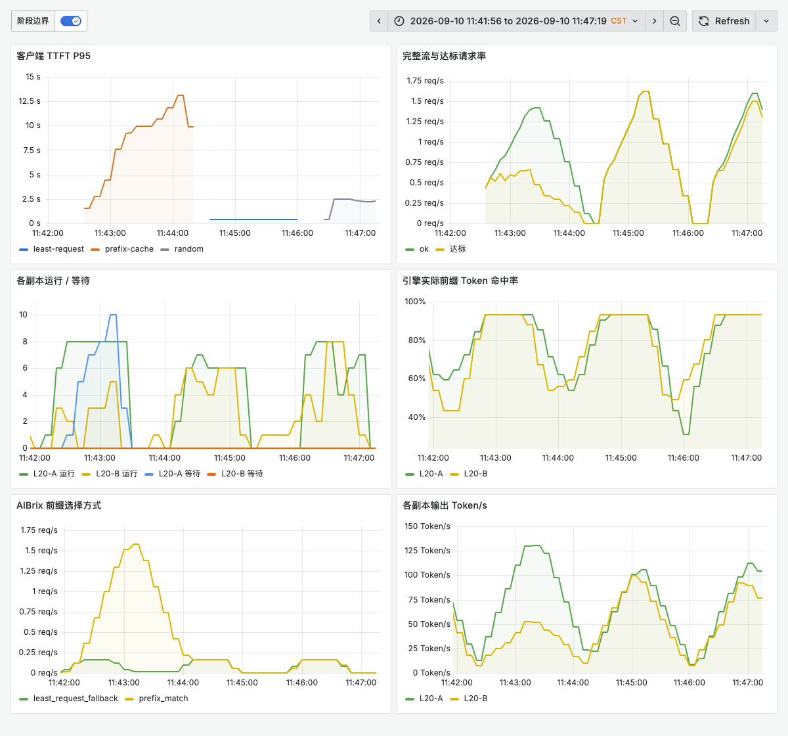
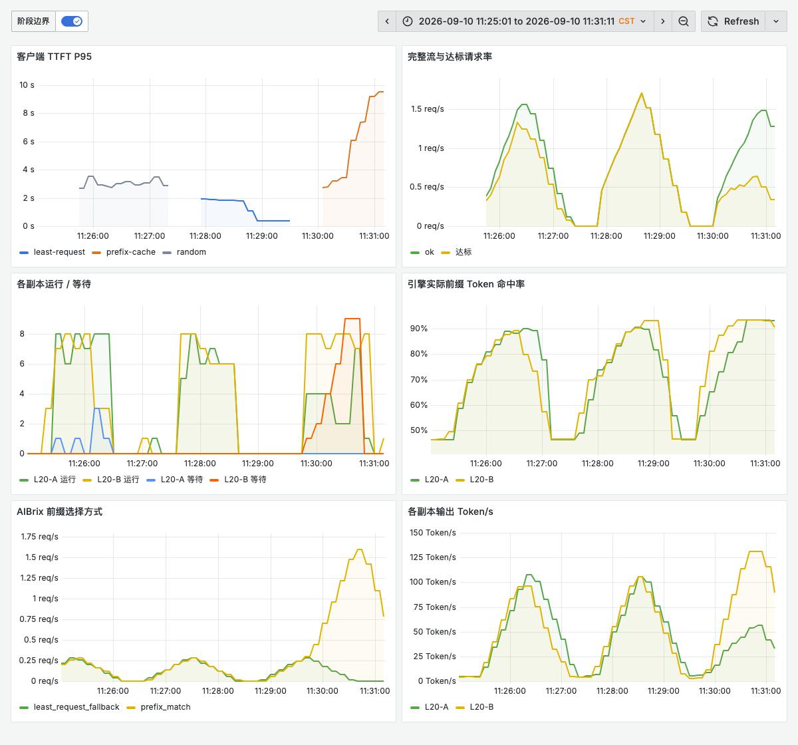
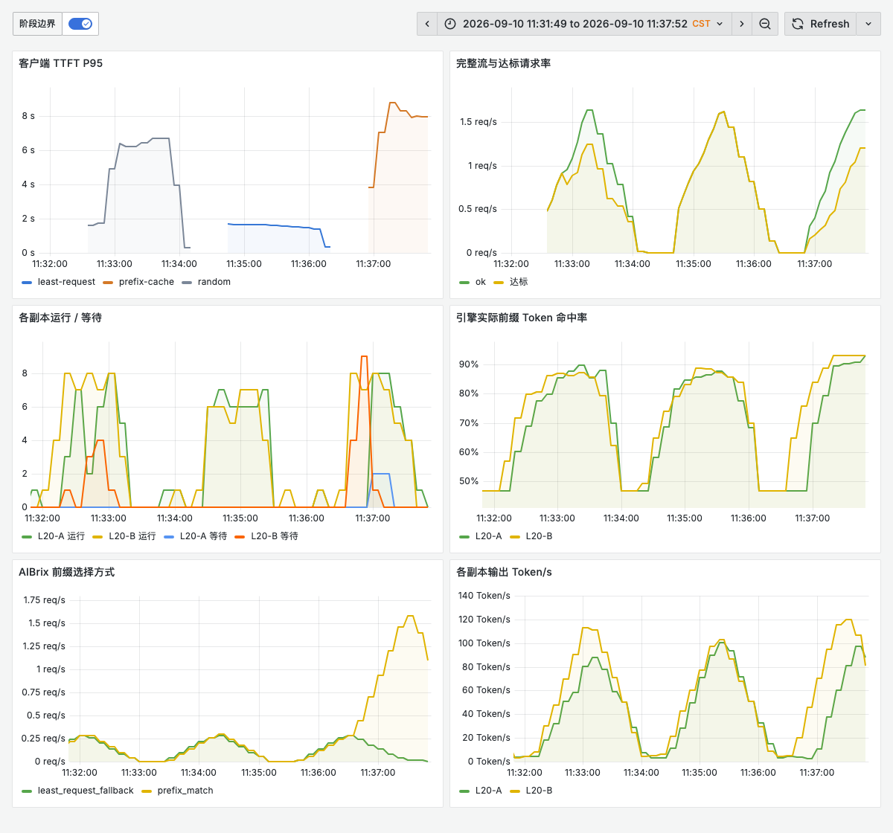

# AIBrix 路由到底在优化什么：从缓存命中到尾延迟

Qwen3.8-27B 是一个 270 亿参数的稠密视觉语言模型，采用 Gated DeltaNet 与 Gated Attention 组合的混合架构，官方提供 FP8 权重。本次使用 **Qwen3.8-27B-FP8，两个 vLLM 副本，每个副本一张 L20**，仅开放文本、32K 上下文，关闭 MTP。这里关注的是多副本请求分配，不比较模型回答质量或多模态能力。[官方模型说明](https://huggingface.co/Qwen/Qwen3.8-27B-FP8)

AIBrix 面向 Kubernetes 上的推理服务，提供模型感知路由、扩缩容等能力。单纯接入 Prometheus、展示 Token/s，只能证明可观测性链路跑通。要回答它是否改善了服务，必须把**路由做了什么、引擎实际省了多少计算、用户等了多久**串起来。[AIBrix 概览](https://aibrix.readthedocs.io/latest/getting_started/overview.html)

想象两位客服共同处理八本产品手册。随机分配让两个人都可能反复翻同一本书；按在途请求数分配，优先找手头任务少的人；前缀路由则尽量找已经读过那本书的人。但如果九成问题都来自同一本书，这位“熟悉业务的客服”也可能排起长队。

这次控制缓存初始状态，用三种策略回答三个问题：冷启动时是否少做了重复 Prefill？双方都读过手册时还剩多少收益？热点集中后，省下的计算是否抵得过排队？

完成 **24 个正式阶段、2,304 条实际请求，2,304 条完整成功，失败 0，客户端丢弃 0**。本次不以命中率给策略排名：冷缓存中的收益会波动；即使引擎两边均热，路由索引也可能倾斜；热点则进一步暴露缓存局部性与排队之间的取舍。

## 1. 先分清两份缓存账本

<picture>
  <source media="(max-width: 600px)" srcset="/assets/practices/aibrix-routing-cache/mechanism-mobile.png">
  
</picture>

本次 AIBrix 为 **v0.7.0**，使用 `character` tokenizer、128 字符分块、20 万索引块；**KV event sync 关闭**。这是按请求历史维护的本地前缀索引：路由器选定副本时就记录该前缀曾发往这里，并不等待引擎报告“这段 KV 现已可复用”。它能帮助定位可能命中的副本，但不能直接证明引擎缓存仍在。[v0.7.0 前缀路由实现](https://github.com/vllm-project/aibrix/blob/v0.7.0/pkg/plugins/gateway/algorithms/prefix_cache.go)

| 要回答的问题 | 证据 | 不能替代什么 |
| --- | --- | --- |
| AIBrix 为什么选这个副本？ | `routing_selection_total` 的增量，按 `selection` 分组 | 不能当作引擎真实命中数 |
| 路由器认为前缀有多相似？ | `routing_decisions_total` 的 `match_percent_bucket` | 字符匹配比例不是 Token 命中率 |
| 请求实际去了哪儿？ | 响应头 `target-pod`，逐条记录后替换为副本别名 | 整段日志内某副本出现次数不是逐请求归属 |
| 引擎真正复用了多少输入？ | `vllm:prefix_cache_hits_total / queries_total` 的阶段增量 | Token 比例不是请求命中率 |
| 省下的 Prefill 是否改善体验？ | 等待队列、TTFT、TPOT、完整流成功与达标请求 | 单看 GPU 利用率或平均吞吐不能回答 |

当前混合模型的引擎日志显示 attention block 按 **1,568 token** 对齐；这与路由器的 128 字符块是两个层面的单位。输入约 5K token，即使共享正文已经预热，尾部不完整块和变化的问题仍需处理，不能期待 Token 命中率必然达到 100%。

## 2. 三种策略实际怎么选

`random` 从可用副本中随机选择；`least-request` 比较网关维护的实时在途请求数；`prefix-cache` 先找匹配前缀，再受负载条件约束。它们都运行在同一 AIBrix 入口，使用请求头 `routing-strategy` 切换，模型服务配置保持一致。 因此，本次比较的是 AIBrix 内部策略选择，不是“使用 AIBrix”与“完全绕过 AIBrix”的总体开销。

模型已在 AIBrix 中注册后，可以这样选择路由并观察响应头；`request.json` 使用下文的请求字段，URL 与鉴权按自己的环境填写：

```bash
curl -iN "${AIBRIX_URL}/v1/completions" \
  -H 'Content-Type: application/json' \
  -H 'routing-strategy: prefix-cache' \
  --data-binary @request.json
```

将头部值改为 `random` 或 `least-request` 即切换另外两种策略。`-i` 显示的 `target-pod` 是本次记录实际落点的依据。只连续发送这三个示例请求并不能构成公平压测；还需按后面的步骤隔离初始缓存和到达序列。

本次前缀路由的实际配置是：

```yaml
AIBRIX_PREFIX_CACHE_TOKENIZER_TYPE: character
AIBRIX_PREFIX_CACHE_BLOCK_SIZE: "128"
AIBRIX_PREFIX_CACHE_POD_RUNNING_REQUEST_IMBALANCE_ABS_COUNT: "16"
AIBRIX_PREFIX_CACHE_STANDARD_DEVIATION_FACTOR: "2"
AIBRIX_PREFIX_CACHE_KV_EVENT_SYNC_ENABLED: "false"
```

上述是实验环境中读到的配置，不是建议所有集群照抄的默认值。v0.7.0 的本地索引分支先检查最大、最小在途数之差；**超过 16** 时，将匹配候选限制到最空闲副本。随后按前缀匹配度排序，同匹配度优先较小的在途数；负载筛选使用 `在途数 ≤ 平均值 + 2 × 标准差`，无法选中时回退到 least-request。[实际选择逻辑](https://github.com/vllm-project/aibrix/blob/v0.7.0/pkg/plugins/gateway/algorithms/prefix_cache.go)

这里有一个容易忽略的两副本特性：对于两个负载数，`平均值 + 2 × 标准差` 的上限足以容纳较大的那个数。因此，在这套参数下，这一筛选条件不会主动排除较忙的副本；绝对差阈值和匹配度相同时的在途排序更值得关注。这是根据源码条件推导的边界，不等于所有副本规模、参数和版本都如此。

还要区分**网关在途数**与 `vllm:num_requests_running`。引擎设置 `max-num-seqs=8`，并不意味着网关最多只有 8 个在途请求：在引擎等待的请求也可能仍未完成。不能据此断言“差值 16 永远不会触发”。

## 3. 如何建立可比较的初始状态

| 条件 | 本次做法 |
| --- | --- |
| 硬件 | 两个固定节点，各一个单 L20 副本；节点与其他业务共享 |
| vLLM | 容器内版本 `0.26.0b2.dev1+g3b102b576`，不以镜像标签代替实际版本 |
| 引擎容量 | `max-model-len=32768`、`max-num-seqs=8`、`max-num-batched-tokens=8192` |
| 缓存 | FP8 KV，GPU memory utilization 0.90，Prefix Cache / Chunked Prefill 开启 |
| 每个阶段 | 96 次计划到达，1.6 RPS，固定输出 128 token，客户端在途上限 48 |
| 重复 | 两轮；第一轮 random → least-request → prefix-cache，第二轮反向 |
| 请求顺序 | 同轮各策略使用相同的前缀类别序列；种子分别为 102、103 |
| 观测 | 每条流的时间与实际目标副本；引擎前后计数；5 秒引擎快照；Prometheus / Grafana |

先用并发 1 / 4 / 8 预热引擎计算形状，再等待两个引擎空闲，逐个调用缓存重置接口并检查 `success=true`。每个阶段给每组前缀换一个位于**首块之前**的 salt；v0.7.0 使用链式前缀哈希，所以这会隔离之前阶段的路由记录，而不必重启共享网关。[前缀哈希实现](https://github.com/vllm-project/aibrix/blob/v0.7.0/pkg/utils/prefixcacheindexer/hash.go)

四种场景的初始状态如下。

| 场景 | 引擎 KV 初始状态 | 路由索引初始状态 | 正式请求构成 |
| --- | --- | --- | --- |
| cold-uniform | 两边都清空，不预热正式前缀 | 新前缀，无历史 | 八组各 12 次 |
| warm-uniform | 八组前缀在两边都预热 | 用共同的 prefix-cache 引导步骤建立记录 | 八组各 12 次 |
| hot50 | 每组测量前缀初始只在一边，A/B 各四组 | 记录其初始归属 | 热点组 48 次，其余合计 48 次 |
| hot90 | 同上 | 同上 | 热点组 86 次，即 89.6%；其余合计 10 次 |

热点初始化先通过 prefix-cache 发送 16 个候选前缀，每个两次，并核对两次都落在同一副本；再从每边选出四组用于正式测量。所有策略使用同样的初始化规则，选择依据仅为初始归属，不根据测试延迟筛选。未选中的候选仍占用初始缓存，不能把它写成“缓存里只有八份文档”。各阶段保存候选归属和逻辑组映射；热点初始始终设在 L20-B 节点上的副本，未在两个节点之间交叉轮换；容器重建时未固定具体 GPU 设备编号。

warm-uniform 刻意让**引擎两边都有 KV**，路由索引仍来自共同的历史请求。这使我们能区分“引擎本来就热”和“路由器知道哪些位置可能热”，不将二者混为一谈。

### Prompt 与完整流口径

实际 Prompt 的结构为：

```text
<256 个十六进制字符：每个阶段、每个文档不同的 salt>
Document <文档编号>
The service tracks request latency, token throughput, cache utilization, and healthy replicas.
...上面一句重复 300 次...
Question <六位请求编号>: Explain the operational tradeoffs in detail.
```

salt 在同一组内保持一致，结尾问题编号随请求变化。不同 salt 的 token 数略有差异，逐请求 usage 会记录实际输入长度；这里控制的是负载结构，不声称每次输入 token 数完全一样。

调用 `/v1/completions`，设置 `temperature=0`、`ignore_eos=true`、`stream=true`、`stream_options.include_usage=true`。正式请求只有 HTTP 200、收到内容、收到 `[DONE]`，且 usage 显示恰好输出 128 token，才算成功。没有自动重试。

- TTFT：POST 开始到第一段内容，包含客户端到入口的开销。
- TPOT：`(最后内容时间 − 第一段内容时间) / 127`，为每条请求的平均生成间隔；不是逐 token 延迟分布。
- 达标：完整流成功，且 TTFT ≤ 2 秒、TPOT ≤ 150 毫秒、E2E ≤ 30 秒同时满足。
- 达标率：达标请求数 / 96 次计划到达；客户端没发出去的到达也不能从分母抹掉。

各阶段 P95 从原始成功请求计算，采用线性插值。两轮分开展示，不能把两个 P95 平均后称作合并 P95。Grafana 的一分钟滑动直方图估计用于观察变化过程，与整轮精确分位数口径不同。

## 4. 冷、热缓存对照

| 场景 / 轮次 | 策略 | TTFT P95 秒 | TPOT P95 毫秒 | Token 命中率 | 达标 / 96 | A / B 请求 |
| --- | --- | ---: | ---: | ---: | ---: | ---: |
| 冷 / 1 | random | 7.689 | 90.8 | 77.7% | 40 | 45 / 51 |
| 冷 / 1 | least-request | 7.673 | 106.1 | 77.7% | 43 | 48 / 48 |
| 冷 / 1 | prefix-cache | 5.575 | 81.4 | 85.4% | 59 | 36 / 60 |
| 冷 / 2 | random | 9.229 | 73.3 | 78.0% | 28 | 47 / 49 |
| 冷 / 2 | least-request | 6.422 | 84.5 | 77.7% | 48 | 47 / 49 |
| 冷 / 2 | prefix-cache | 9.049 | 66.1 | 85.4% | 40 | 60 / 36 |
| 两边均热 / 1 | random | 0.625 | 59.8 | 93.1% | 96 | 46 / 50 |
| 两边均热 / 1 | least-request | 0.325 | 58.5 | 93.2% | 96 | 46 / 50 |
| 两边均热 / 1 | prefix-cache | 0.325 | 59.3 | 93.1% | 96 | 48 / 48 |
| 两边均热 / 2 | random | 1.975 | 60.0 | 93.2% | 91 | 54 / 42 |
| 两边均热 / 2 | least-request | 0.327 | 58.5 | 93.2% | 96 | 50 / 46 |
| 两边均热 / 2 | prefix-cache | 9.692 | 60.4 | 93.1% | 43 | 70 / 26 |

<picture>
  <source media="(max-width: 600px)" srcset="/assets/practices/aibrix-routing-cache/cold-warm-mobile.png">
  
</picture>

第一轮冷缓存中，prefix-cache 的命中率约 85.4%，高于另外两种策略的 77.7%，TTFT P95 也较低。但第二轮 prefix-cache 的 TTFT P95 为 **9.049 秒**，least-request 为 **6.422 秒**，random 为 **9.229 秒**。命中率相近，不代表尾延迟相近。

冷缓存阶段没有预先强制八组前缀四四分布。第一轮 prefix-cache 将请求分成 36 / 60，第二轮是 60 / 36；第二轮 A 的五秒等待快照峰值为 9，B 为 0。首批前缀落点、到达顺序与共享环境均可能影响结果，两轮数据不足以单独判定哪一个因素贡献最大。

### 引擎两边都热，路由索引仍可能倾斜

第一轮 warm-uniform 的三种策略均为 96/96 达标，prefix-cache 的初始索引是四组归 A、四组归 B。但第二轮 prefix-cache 的引擎 KV 依旧两边都热，路由初始索引却是六组归 A、两组归 B，最终分配为 **70 / 26**；实际 Token 命中率约 93.1%，TTFT P95 达到 **9.692 秒**，只有 **43/96** 达标。该阶段记录到一次保护事件和一次回退，A 的五秒等待快照峰值为 9。

这相当于两位客服实际上都读过全部手册，但前台登记簿对六本书只记下了 A，于是仍把请求集中到 A。**直接预热引擎，不会自动让本地历史索引知道所有可命中的位置。** 本次未启用 KV event sync，不能将这一现象外推为开启事件同步后的表现。

warm-uniform 控制了引擎 KV 可用性，但路由引导步骤没有强制索引四四分布，因此冷、热两组的差值不是“只改变 KV 初态”的纯单变量收益估计。它同时展示了策略对索引布局的敏感性。热点实验则额外固定了四四初始归属；读表时必须保留这个区别。

本实验是固定 1.6 RPS 的到达负载，不是无限加压寻找吞吐上限。第一轮冷缓存的输出吞吐按完整测量区间（含尾部排空）为 random 184.6、least-request 184.7、prefix-cache 171.8 Token/s。不能将较低 TTFT 解读为所有吞吐指标也提高；完整数值保存在结果 JSON 中。

缓存指标还有一个口径边界：第二轮冷缓存 random 的客户端输入 usage 合计为 **484,608 token**，引擎 `prefix_cache_queries_total` 增量却是 **494,703 token**。容器内代码在查询已计算块时记录查询 Token，并非对客户端唯一输入去重统计。因此本文将它称为“Token 缓存查询命中率”，不把它乘以请求数，反推出命中了多少条请求。客户端、网关与引擎完成数仍均为 96，没有观察到客户端重试。


## 5. 热点：缓存局部性与排队的取舍

| 场景 / 轮次 | 策略 | TTFT P95 秒 | TPOT P95 毫秒 | Token 命中率 | 达标 / 96 | A / B 请求 |
| --- | --- | ---: | ---: | ---: | ---: | ---: |
| 50% 热点 / 1 | random | 2.844 | 82.4 | 85.3% | 78 | 52 / 44 |
| 50% 热点 / 1 | least-request | 1.767 | 71.6 | 85.4% | 96 | 48 / 48 |
| 50% 热点 / 1 | prefix-cache | 8.317 | 59.8 | 93.3% | 38 | 27 / 69 |
| 50% 热点 / 2 | random | 5.990 | 81.7 | 85.4% | 63 | 39 / 57 |
| 50% 热点 / 2 | least-request | 1.907 | 81.9 | 85.4% | 94 | 47 / 49 |
| 50% 热点 / 2 | prefix-cache | 8.279 | 59.9 | 93.1% | 37 | 27 / 69 |
| 89.6% 热点 / 1 | random | 5.578 | 71.5 | 87.3% | 76 | 42 / 54 |
| 89.6% 热点 / 1 | least-request | 1.771 | 70.3 | 87.4% | 96 | 47 / 49 |
| 89.6% 热点 / 1 | prefix-cache | 6.535 | 59.9 | 92.2% | 68 | 38 / 58 |
| 89.6% 热点 / 2 | random | 3.547 | 70.8 | 88.3% | 78 | 53 / 43 |
| 89.6% 热点 / 2 | least-request | 1.255 | 82.2 | 88.2% | 96 | 48 / 48 |
| 89.6% 热点 / 2 | prefix-cache | 8.001 | 59.8 | 92.4% | 61 | 38 / 58 |

<picture>
  <source media="(max-width: 600px)" srcset="/assets/practices/aibrix-routing-cache/hotspots-mobile.png">
  
</picture>

### 50% 热点的证据链

第一轮 prefix-cache 有 96 次 `prefix_match`，实际 Token 命中率 93.3%，但只完成了 38/96 次达标请求。逐请求响应头显示 A 收到 27 次、B 收到 69 次：B 持有热点组的 48 次，加上其余三组的 21 次，正好形成 69 次集中。引擎完成计数分别为 27 / 69，与客户端和网关日志一致。

<picture>
  <source media="(max-width: 600px)" srcset="/assets/practices/aibrix-routing-cache/allocation-hot50-mobile.png">
  
</picture>

五秒快照中 B 的等待峰值为 8，A 为 0。与此同时，prefix-cache 的 TPOT P95 为 59.8 毫秒，低于 least-request 的 71.6 毫秒；主要退化体现在首段内容之前的等待。它不是“缓存完全没起作用”，而是缓存局部性与队列集中同时发生。

### 更强热点不一定按比例更差

第一轮 89.6% 热点的 prefix-cache 记录到 1 次负载不均衡事件、1 次 `least_request_fallback`，另外 95 次为 `prefix_match`；最终请求分配为 38 / 58。热点组本身有 34 次去了 A、52 次去了 B，第一条进入 A 的热点请求在测量开始约 18.13 秒后发起。

结合源码，这与负载差越过门槛后向另一副本发送热点请求、随后两边都有历史前缀记录的路径一致。但计数快照只提供整阶段增量，没有将那一次保护事件的独立 ID 与某条请求直接关联，因此不能把 18.13 秒当作已精确测得的保护触发时间。

这一阶段 TTFT P95 为 6.53 秒，68/96 达标，比第一轮 50% 热点的 prefix-cache 更好，但仍不及同场景 least-request 的 1.77 秒与 96/96 达标。路由存在条件分支，热点比例与尾延迟不必呈简单单调关系。

第二轮 50% 热点的 prefix-cache / least-request TTFT P95 分别为 **8.279 / 1.907 秒**，达标请求分别为 **37 / 94**。两轮分别保留，避免用合并统计掩盖差异。


## 6. Grafana 如何串起原因与结果

<picture>
  <source media="(max-width: 600px)" srcset="/assets/practices/aibrix-routing-cache/grafana-cold-uniform-mobile.png">
  
</picture>

<picture>
  <source media="(max-width: 600px)" srcset="/assets/practices/aibrix-routing-cache/grafana-r2-cold-uniform-mobile.png">
  
</picture>

<picture>
  <source media="(max-width: 600px)" srcset="/assets/practices/aibrix-routing-cache/grafana-r2-warm-uniform-mobile.png">
  
</picture>

<picture>
  <source media="(max-width: 600px)" srcset="/assets/practices/aibrix-routing-cache/grafana-hot50-mobile.png">
  
</picture>

<picture>
  <source media="(max-width: 600px)" srcset="/assets/practices/aibrix-routing-cache/grafana-hot90-mobile.png">
  
</picture>

以上为真实 Grafana 浅色页面，桌面与手机分别截图。第一轮依次为 random、least-request、prefix-cache；第二轮反向执行，图中的策略图例与时间段对应。初始化流量位于测量间隙。五秒客户端快照与 Prometheus 抓取时刻不同，观察到的瞬时队列峰值可能不同。


建议依次读同一时间轴上的六项：路由选择方式 → 每副本分配 → 实际 KV 命中 → 等待队列 → TTFT → 达标请求。前缀路由的匹配选择计数升高，只解释了第一步；如果等待队列同步升高，必须继续看客户端是否受益。

```promql
# 本例网关按模型过滤：每秒前缀匹配与回退次数
sum by (selection) (
  rate(aibrix_prefix_cache_routing_selection_total{model="qwen38-aibrix-lab"}[1m])
)

# 真实缓存 Token 命中率，按副本别名区分
sum by (node_alias) (rate(vllm:prefix_cache_hits_total{model_name="qwen38-aibrix-lab"}[1m]))
/
sum by (node_alias) (rate(vllm:prefix_cache_queries_total{model_name="qwen38-aibrix-lab"}[1m]))

# 排队是 Gauge；不对它做 rate
sum by (node_alias) (vllm:num_requests_waiting{model_name="qwen38-aibrix-lab"})

# 客户端分布先合并桶，再计算分位数
histogram_quantile(0.95, sum by (le, phase) (
  rate(routing_study_ttft_seconds_bucket{job="qwen-routing-study"}[1m])
))
```

生产中应进一步加上集群、namespace、模型和采集任务过滤，避免把不同服务混入同一条曲线。`node_alias` 是本实验的采集标签，需要在自己的 relabel 配置中建立。`routing_study_*` 来自本次流式客户端，并非 AIBrix 自带指标。

计数型指标的整轮表格使用测量前后直接抓取的差值，排除了初始化请求。截图中的一分钟 `rate()` 窗口可能包含阶段前的预热尾部，不能拿图上一点乘时长来反推精确请求数。分配数量来自 `target-pod`，并与各副本 `request_success_total` 增量逐阶段核对。

## 7. 生产配置应由什么决定

**先判断有没有可复用的稳定前缀。** 重复 system prompt、相同 RAG 文档或多轮会话可能受益，但把用户 nonce、时间戳放在最前面，会破坏后续长文本的前缀复用。输入长度、共享前缀长度和输出长度都应进入压测记录。

**按延迟目标选择策略，而不是按命中率排名。** 较长输入、较短输出通常更值得关注重复 Prefill；输出长、热点强、单副本队列明显时，则需衡量局部性带来的集中。先跑固定副本基线，再调路由参数，最后叠加扩缩容，避免把增加硬件的效果归功于算法。

**负载门槛要匹配副本规模与容量。** 当前 16 / 2 只是这套环境的实测参数。应观察网关在途差值、引擎排队和 SLO，再决定是否收紧；收紧可能增加跨副本冷 Prefill，不能预设只会变好。本轮没有修改共享网关进行阈值扫描，因此不提供“最佳阈值”。

**明确缓存状态从哪里来。** 新副本没有旧副本的 KV，历史索引也不等于实时 KV。是否启用 KV event sync、远程 tokenizer、网关多副本状态同步，应按固定版本核对引擎与控制面兼容性，再单独验证淘汰、重启和扩容后的行为。本次没有验证这些高级能力，不能借用其设计文档来描述当前系统已经具备的效果。

**保留服务端与客户端两侧的 SLO。** 入口 HTTP 200、网关阶段成功、完整流完成是不同事件。升级或退出时，应同时检查断流、缺失 `[DONE]`、错误 usage、拒绝与超时；对照方法见 [L20 容量、退出与过载保护实战](aibrix-qwen-l20-production.md)。

本轮为清理初始 KV，临时在专用实验副本开启开发接口，完成后关闭。缓存重置端点会改变服务状态，不应作为生产对外 API。[vLLM 开发模式说明](https://docs.vllm.ai/en/v0.26.0/configuration/env_vars/)

## 8. 修复记录与适用边界

第一次热态初始化使用 1-token 输出，未满足预热脚本的内容 / 完整流检查，阶段尚未进入正式测量。初始实现还把空字符串形式的异常当成了无错误，导致上层尝试读取不存在的结果文件。已改成保留 `repr(exception)`、按错误字段是否存在判断失败，并保存 `[DONE]`、内容与 usage 的诊断字段；预热改为 16 token。失败初始化单独留档，未计入正式结果。

失败后专用 GPU 服务自动缩容，恢复后重新预热计算形状，再继续未完成的阶段。第一轮三个冷缓存阶段发生在重启前，后续阶段发生在重启后；参数和固定节点不变，第二轮反向执行用于观察波动，不能宣称消除了全部运行环境影响。

第二轮近 90% 热点的 least-request 初始化中，16 个候选落成了 3 / 13，未达到两边各选四组的门槛，正式测量没有开始。该次初始化单独归档，保护流程释放了 GPU；重新确认资源后恢复相同节点的两个副本，并重新预热计算形状，补完最后两组。初始化新增最多三次重试，后续尝试先清 KV 并更换前缀 salt，仍使用 16 个候选；只按初始归属判断是否合格，不按正式测量结果筛选。最后两组与前一组之间发生过服务重启，这也是第二轮的额外环境边界。

本实验使用合成英文重复文档、两个副本、共享节点和两轮短测量窗口。它支持分析这套配置中的路由机制与服务取舍，不构成长期稳定性、真实 RAG 内容质量、跨模型泛化或完整生产验收。只有两个副本时，负载筛选的数学边界也不能直接外推到十几个副本。

引擎阶段计数与逐请求归属全部核对通过。第一轮三个冷缓存阶段未保存网关前后计数快照，因此对应字段为 null；这些阶段仍有逐请求网关日志和 Prometheus 历史数据，不能把缺失字段当作零次事件。

可下载的复核材料：

- [完整两轮结果 JSON](../../assets/practices/aibrix-routing-cache/results.json)：逐阶段延迟、缓存、分配、队列快照、原始候选映射与路由计数。
- [逐请求记录 JSONL.gz](../../assets/practices/aibrix-routing-cache/requests.jsonl.gz)：公开副本别名、时间、usage、完整流结果与达标判定。
- [离线复算脚本](../../assets/practices/aibrix-routing-cache/recompute.py)：`python3 recompute.py requests.jsonl.gz`，只读取数据，不访问集群。
- [请求重建脚本](../../assets/practices/aibrix-routing-cache/make_request.py)：`python3 make_request.py --phase r1-hot50-prefix-cache --family 0 --index 17 > request.json`，根据同目录 `results.json` 还原 Prompt；只输出 JSON，不发送请求。需要自行选择正确的模型名、路由头与入口。
- [Prometheus 历史导出](../../assets/practices/aibrix-routing-cache/metrics-history.json.gz)：查询表达式、五秒查询步长与原始有限样本；查询步长不等于采集间隔。
- [完整路由看板 JSON](../../assets/practices/aibrix-routing-cache/dashboard-routing.json)，以及 [冷缓存](../../assets/practices/aibrix-routing-cache/dashboard-cold-uniform.json)、[50% 热点](../../assets/practices/aibrix-routing-cache/dashboard-hot50.json)、[89.6% 热点](../../assets/practices/aibrix-routing-cache/dashboard-hot90.json) 的六面板证据视图。
- [数据口径与 SHA-256 清单](../../assets/practices/aibrix-routing-cache/manifest.json)。

正式统计排除了计算形状预热、24 条 pilot、前缀初始化与失败初始化。结束后专用 GPU Deployment 已缩容为 0，临时开发接口配置已撤销。
