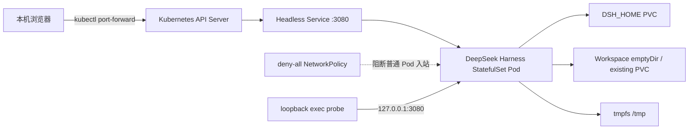

# 从 Docker 到 Kubernetes：DeepSeek Harness、内置 Chromium 与 DSH Plugin 实战

DeepSeek Harness 开源后，有人把它概括成“DeepSeek 开源了一个 Web 应用”。这种说法忽略了 Web Surface 后面的 Agent Runtime：模型适配、Session、工具、权限、Workspace、子 Agent、插件与 Headless 入口共享同一套运行核心。Web 并不只是聊天页面，它既能包装成 Native App，也能直接部署到远程开发机或云端；相比把一个 CLI Agent 重新包装成远程终端和移动端入口，它天然更适合跨设备访问。

本项目先把官方 npm 运行时封装成可复现的 Docker 镜像，再部署到 Kubernetes 1.30.4 测试集群；随后沿用此前 OpenClaw 与 Chrome all-in-one 镜像的思路，把 Chromium、Xvfb、Openbox、noVNC 和 DeepSeek Harness 放进同一 OCI 镜像，并把 Harness 与浏览器的接入层实现成独立的 `@runzhliu/dsh-browser-desktop` 插件。

这不是“页面打开就算部署成功”的演示。真正值得记录的是：Agent Runtime 同时拥有会话状态、工作区、Shell/PTY 子进程、模型凭据和代码执行能力，传统 Web 应用的 Deployment 模板并不能直接覆盖这些边界。实测还发现，deny-all NetworkPolicy 会在当前 Cilium 环境中阻断 kubelet HTTP 探针，使已经启动的进程被 liveness probe 误杀。最终通过容器内 loopback exec probe 保留了网络隔离，也恢复了正确的健康检查。

配套实现位于 [runzhliu/deepseek-harness-docker](https://github.com/runzhliu/deepseek-harness-docker)。如果想先了解镜像构建、`node-pty`、EROFS、`HOME`/`DSH_HOME` 和 Cordis Patch，请先阅读 [DeepSeek Harness Docker、Compose 与 Helm 部署实战](../rag-agent/deepseek-harness-runtime-containerization.md)；如果想理解 Cordis、Profile、Agent Loop 和事件溯源会话，则从 [DeepSeek Harness GitHub 仓库深度解析](../rag-agent/deepseek-harness-repository-analysis.md) 开始。


这张图展示的是当前 all-in-one 边界：远程电脑或手机经 Tailscale、`port-forward` 或受保护的 HTTPS 入口访问；Kubernetes 管理 Pod；Pod 内的单一 OCI 镜像同时包含 DeepSeek Harness Web、Browser Plugin 和 Chromium 桌面；PVC 保存 Harness 状态、浏览器 Profile 与工作区。它不是 Docker-in-Docker，Docker 负责构建镜像，测试集群实际由 CRI 容器运行时启动该镜像。

## 1. 先给实验结论

| 项目 | 实测结果 |
| --- | --- |
| Kubernetes | 1.30.4 测试集群，linux/amd64 |
| CNI | Cilium 1.16.1，执行 NetworkPolicy |
| Harness | `@deepseek-ai/dsh@0.1.0-rc.6` |
| 镜像 | `runzhliu/deepseek-harness:0.1.0-rc.6` |
| 内置浏览器 | Debian Chromium、Xvfb、Openbox、x11vnc、websockify/noVNC |
| DSH Plugin | `@runzhliu/dsh-browser-desktop@0.1.0` |
| 控制器 | 单副本 StatefulSet |
| 状态存储 | 5 GiB RWO 本地 LVM PVC，Bound |
| 工作区 | 本次为 `emptyDir`，Pod 重建会清空 |
| 运行用户 | UID/GID 1000，非 root |
| 根文件系统 | 只读；仅 `$DSH_HOME`、`/workspace` 和 `/tmp` 可写 |
| 网络入口 | Headless Service；无 Ingress、NodePort、LoadBalancer |
| 网络策略 | 默认拒绝全部 Pod 入站 |
| 验证 | Pod `1/1 Ready`、重启 0；port-forward 返回 HTTP 200 |

最初不带 Chromium 桌面的精简基线从 Docker Hub 拉取约 190 MB，用时 28.401 秒。修复探针后，新 Pod 启动日志输出 Web 地址，容器内 `dsh --version` 返回 `0.1.0-rc.6`；本机经 API Server 转发访问首页，下载 12,109 Bytes HTML，用时约 89 ms。加入完整桌面栈后的本地 Docker 镜像约 2.46 GB，换来了可复现的可视浏览器环境，也显著增加了镜像分发与冷启动成本。

本轮没有注入模型 API Key，也没有把“Web 可用”写成“Agent 模型调用已经验证”。真实上线前还要单独测试模型 Provider、Shell/PTY、文件工具、权限审批和沙箱行为。

## 2. 为什么 Agent Runtime 值得用 Kubernetes 编排

`npx @deepseek-ai/dsh web` 已足够让个人快速打开页面。把它放进 Kubernetes，不是为了把简单体验变复杂，而是为了把一组容易漂移的运行约束变成声明式对象：

| Agent Runtime 问题 | Kubernetes 对应能力 |
| --- | --- |
| 固定 Node、原生模块和 DSH 版本 | 不可变镜像、Tag/Digest |
| 进程退出、卡死和升级 | StatefulSet、Probe、滚动更新 |
| Profile、设置、凭据和会话 | `$DSH_HOME` PVC |
| Agent 实际修改的代码 | 独立 Workspace Volume |
| API Key 与 Provider 凭据 | Secret、运行时注入 |
| CPU、内存和进程失控 | requests/limits、PID 边界 |
| 无认证 Web 与代码执行接口 | Service、NetworkPolicy、可信入口 |
| 审计和复现 | Manifest、Event、日志和版本记录 |

其中最关键的是生命周期分层。镜像可以重建，Harness 状态不能跟着丢；工作区可以替换，也不应和凭据、Profile、Session 混在同一个匿名目录里。

## 3. 本次部署拓扑



这里故意没有创建公开入口。Harness Web 当前没有适合直接暴露的认证、TLS 和 Origin 安全边界，而其后端又能读写文件、启动 Shell。测试阶段通过 API Server 的 port-forward 使用，能够把访问面限定在操作者本机。

## 4. 把 Chromium 做进镜像，并通过 DSH Plugin 接入

当前镜像不是简单增加一个 `chromium` 软件包，而是组合了一套完整、可交互的桌面运行链路：

```text
DeepSeek Harness Web :3080
        │
        ├── @runzhliu/dsh-browser-desktop
        │       └── Chromium DevTools :9222
        │
        └── noVNC :6080
                └── websockify → x11vnc :5900
                                  └── Xvfb :99 + Openbox + Chromium
```

Dockerfile 使用 Debian 原生架构的软件包安装 Chromium 和桌面组件，并加入 Noto CJK 字体，因此 `linux/amd64` 与 `linux/arm64` 都能构建原生镜像。Compose 为 Chromium 配置 1 GiB `/dev/shm`；启动器只对浏览器进程增加 `--no-sandbox`，容器整体仍保留 `cap_drop: ALL` 与 `no-new-privileges`。

`deepseek-harness-entrypoint` 负责准备插件、启动 Xvfb/Openbox、x11vnc、websockify/noVNC、Chromium 与 DSH，并统一处理信号和子进程退出。Chromium 通过 9222 暴露仅容器 loopback 可达的 DevTools Endpoint；异常退出后由入口脚本自动重启。浏览器 Profile 放在 `/home/node/.dsh/chrome-profile`，与 Harness 状态一起持久化。


`@runzhliu/dsh-browser-desktop@0.1.0` 是独立 DSH Plugin，而不是写死在 Web 页面里的 iframe。它通过 `sidebar.footer.action` 增加入口，通过 `shell.overlay` 显示可移动、缩放和最大化的面板，并注册 `browser_open` Agent 工具。用户要求“用浏览器打开某个地址”时，Host 侧通过 CDP 创建标签页，Web Client 再自动展开同一容器里的可视桌面。

插件可以独立打包和安装：

```bash
npm pack ./plugins/dsh-browser-desktop --pack-destination /tmp
dsh plugin --profile web add \
  /tmp/runzhliu-dsh-browser-desktop-0.1.0.tgz
```

插件只负责 Harness Host/WebUI 集成，并不会单独安装 Chromium、Xvfb 或 noVNC；仓库中的 Docker 镜像是完整参考运行时。这一分层让其他 DSH 环境可以复用插件，也避免把 UI 集成和桌面进程管理混成一段不可拆分的启动脚本。

### 4.1 Tailscale 与移动端语音入口

Web Surface 的价值之一是可以跨设备进入。一个实际可行的个人场景是：项目与 DSH 留在家里的开发机或测试集群，只通过 Tailscale Tailnet 暴露受控入口；用户在外面用手机浏览器打开 DSH，以语音输入修改需求，让 Agent 操作挂载的 `/workspace`，再通过内置 Chromium 查看页面和验证结果。

这并不意味着可以直接公开 3080 和 6080。参考实现的 noVNC 没有独立认证，DSH 又能访问 Shell、文件和模型凭据，因此至少需要 Tailnet 身份与 ACL、最小端口暴露、受控 HTTPS 入口和凭据隔离。Tailscale 提供的是私有连通与身份基础，不会自动替代应用授权和 Agent Sandbox。

## 5. 为什么是 StatefulSet，而不是多副本 Deployment

Harness 的 Profile、模型设置、凭据引用、会话事件和领域存储位于 `$DSH_HOME`。Web Surface 当前也更接近单用户开发入口，而不是已经具备共享会话协调和多租户身份的无状态服务。

因此本次采用一个 StatefulSet 副本：

- Pod 名和状态卷绑定关系稳定；
- Pod 重建后重新挂载同一 `$DSH_HOME`；
- Helm 卸载或缩容时 PVC 默认保留；
- 不用横向扩容伪装成高可用。

单副本不等于高可用。本次 PVC 还是本地 LVM，节点故障后的恢复能力受本地卷拓扑约束。若要做跨节点恢复，需要换成支持相应拓扑与故障语义的存储，并验证 Harness 自身对并发访问和迁移的契约。

## 6. 最小 Helm 配置

测试集群只覆盖公开镜像和 RWO StorageClass，没有把任何凭据写进 values：

```yaml
image:
  repository: runzhliu/deepseek-harness
  tag: 0.1.0-rc.6
  pullPolicy: IfNotPresent

persistence:
  storageClass: <RWO_STORAGE_CLASS>
  size: 5Gi

networkPolicy:
  enabled: true
  ingress: []
```

安装命令：

```bash
helm --kube-context <TEST_CONTEXT> upgrade --install deepseek-harness \
  charts/deepseek-harness \
  --namespace deepseek-harness \
  --create-namespace \
  -f values-test.yaml \
  --wait \
  --timeout 5m
```

Chart 还设置了以下安全默认值：

- `automountServiceAccountToken: false`；
- UID/GID 1000 与 `runAsNonRoot: true`；
- RuntimeDefault seccomp；
- Drop 全部 Linux capabilities；
- `allowPrivilegeEscalation: false`；
- 只读根文件系统；
- `/tmp` 使用有大小限制的内存 `emptyDir`。

## 7. 第一个真实问题：NetworkPolicy 把探针也挡住了

第一次安装时，镜像、PVC 和 Web 进程都正常：

```text
dsh web: http://127.0.0.1:3080 (LAN: http://<POD_IP>:3080)
```

但 Pod 一直不能 Ready，Event 持续出现：

```text
Readiness probe failed: dial tcp <POD_IP>:3080: i/o timeout
Liveness probe failed: context deadline exceeded
Container failed liveness probe, will be restarted
```

旧 Pod 最终累计重启 6 次。问题不在 Node.js、镜像架构、PVC 权限或 Harness 启动，而在下面这组配置的相互作用：

1. NetworkPolicy 对 Harness Pod 设置 `ingress: []`；
2. Cilium 在该集群执行主机到 Pod 的入站策略；
3. kubelet 使用 Pod IP 发起 `httpGet` Probe；
4. Web 已经监听，但探针流量在进入容器前被策略丢弃。

尝试只用标准 NetworkPolicy `ipBlock` 放行节点网段，在这套 host-probe 路径中仍未命中。直接关闭 NetworkPolicy 虽然能让探针恢复，却会让无认证的代码执行接口重新暴露给集群内其他 Pod，不是合理修复。

## 8. 正确修复：容器内 loopback exec probe

健康检查真正需要验证的是本容器的 Web 进程，不需要经过 Pod 网络。因此把 readiness/liveness 改成容器内 Node.js `fetch`：

```yaml
livenessProbe:
  exec:
    command:
      - node
      - -e
      - >-
        fetch('http://127.0.0.1:3080/').then((response) =>
        process.exit(response.ok ? 0 : 1)).catch(() => process.exit(1))
  initialDelaySeconds: 20
  periodSeconds: 20
  timeoutSeconds: 3

readinessProbe:
  exec:
    command:
      - node
      - -e
      - >-
        fetch('http://127.0.0.1:3080/').then((response) =>
        process.exit(response.ok ? 0 : 1)).catch(() => process.exit(1))
  initialDelaySeconds: 5
  periodSeconds: 10
  timeoutSeconds: 3
```

这项修改有三个效果：

- 仍然检查真实 HTTP 状态，而不是只检查 Node 进程存在；
- 不需要为 kubelet 添加 3080 入站例外；
- deny-all NetworkPolicy 可以继续保留。

StatefulSet 当时处于 OrderedReady 更新流程，旧 Pod 从未 Ready，因此模板更新后没有立即替换。删除唯一的测试 Pod 后，控制器按新 revision 重建并重新挂载原 PVC；新 Pod 最终 `1/1 Ready`、重启次数为 0。

## 9. 验收不能只看首页

先检查控制器、Endpoint、PVC 和策略：

```bash
kubectl --context <TEST_CONTEXT> -n deepseek-harness \
  get pod,statefulset,service,endpoints,pvc,networkpolicy -o wide
```

本次结果：StatefulSet `1/1`、Pod `Running/Ready`、Endpoint 指向 3080、PVC 为 `Bound`，NetworkPolicy 仍只选择 Harness Pod 且没有 ingress 规则。

再验证版本和写入边界：

```bash
kubectl --context <TEST_CONTEXT> -n deepseek-harness \
  exec deepseek-harness-0 -- sh -lc '
    id
    dsh --version
    test -w /workspace && echo workspace-writable
    test -w /home/node/.dsh && echo dsh-home-writable
    test ! -w / && echo root-not-writable
  '
```

实测输出为 UID/GID 1000、DSH `0.1.0-rc.6`，两个挂载目录可写而根目录不可写。

最后从操作者本机访问：

```bash
kubectl --context <TEST_CONTEXT> -n deepseek-harness \
  port-forward service/deepseek-harness 3080:3080

curl --fail http://127.0.0.1:3080/
```

首页返回 HTTP 200。不要为了少执行一条 port-forward，就把 Service 改成 NodePort 或给它添加公开 Ingress。

## 10. Kubernetes 解决了什么，没有解决什么

这次实验已经证明 Kubernetes 可以管理 Harness 的镜像版本、单实例生命周期、状态卷、健康检查、网络入口和安全上下文。它还没有证明以下能力：

- 模型 Provider 的正确性与故障回退；
- Harness 工具审批和 Linux Sandbox 在目标内核中的完整行为；
- 多用户身份、授权、配额和审计；
- 多副本共享 Session 或 Workspace；
- 节点故障后的跨节点状态恢复；
- 运行不可信代码时的强隔离。

容器和 Kubernetes 限制的是进程能看到哪些宿主资源；Harness 自己的权限系统限制的是 Agent 可以调用哪些工具。若要执行不可信代码，还要评估 gVisor、Kata、微虚机、独立凭据代理和受控出站网络。不能因为 Pod 使用了非 root 和只读根文件系统，就把它描述成完整的多租户 Agent Sandbox。

## 11. 从 OpenClaw 到 DeepSeek Harness：重点不是“放进 Pod”

越来越多 Agent 项目开始携带 Shell、浏览器、文件系统、插件和长期会话。它们不再只是一个调用模型 API 的 Web 页面，而是拥有状态、权限和执行环境的 Runtime。

Docker 的价值是把依赖、版本和启动契约写成可执行的安装文档；Kubernetes 的价值则是继续管理这些 Runtime 的状态、资源、身份、网络和生命周期。真正值得复用的不是一份“能跑起来”的 YAML，而是下面这组清晰边界：

```text
镜像负责版本与运行依赖
StatefulSet 负责单实例生命周期
DSH_HOME PVC 负责 Harness 状态
Workspace Volume 负责用户代码
Secret 负责 Provider 凭据
NetworkPolicy 负责访问面
Probe 负责真实健康状态
更强 RuntimeClass 负责不可信执行隔离
```

个人本机临时体验仍然优先使用 `npx` 或 Docker Compose。只有需要团队复现、持久化、资源治理、版本升级和安全边界时，Kubernetes 才开始体现价值。编排不是目的，把 Agent Runtime 的隐含假设变成可观察、可升级、可恢复的契约，才是目的。

## 12. 参考资料

- [DeepSeek Harness](https://github.com/deepseek-ai/deepseek-harness)
- [DeepSeek Harness Docker 社区实现](https://github.com/runzhliu/deepseek-harness-docker)
- [DeepSeek Harness GitHub 仓库深度解析](../rag-agent/deepseek-harness-repository-analysis.md)
- [DeepSeek Harness Docker、Compose 与 Helm 部署实战](../rag-agent/deepseek-harness-runtime-containerization.md)
- [Agent Sandbox 选型与架构分析](../rag-agent/agent-sandbox-selection.md)
