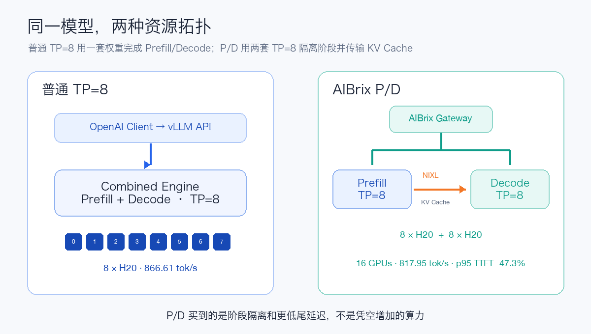
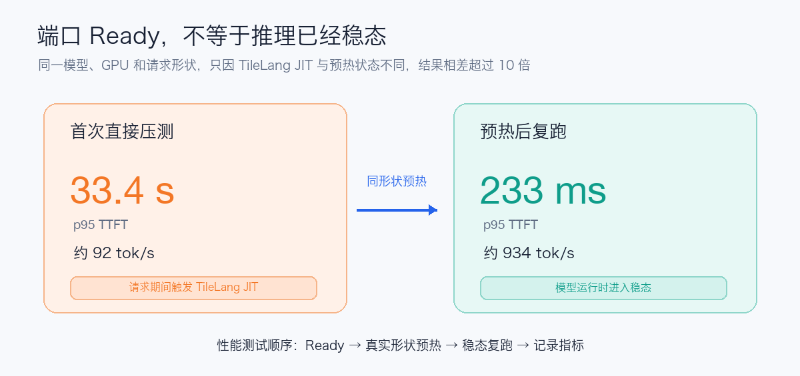
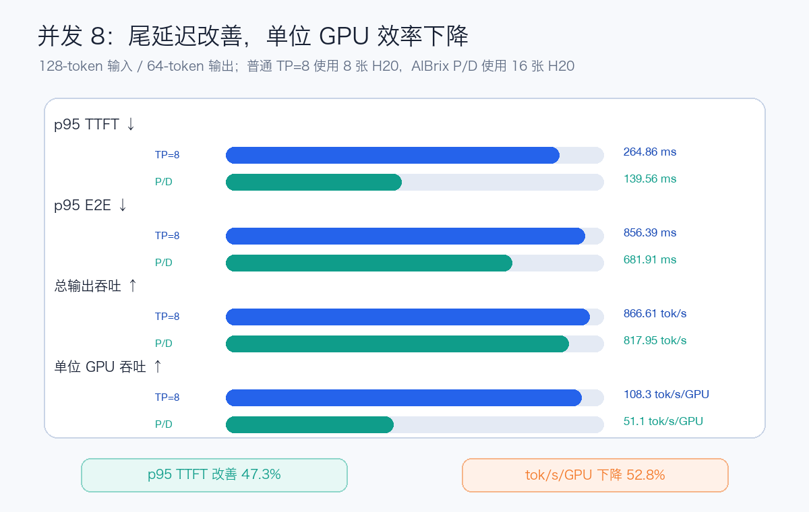

# DeepSeek-V4-Flash-0731 的 H20 部署与压测

本文整理一次脱敏后的探索性验证。所有集群名称、Namespace、节点地址、Pod 名称、镜像仓库、对象存储地址、模型路径、网关、账号和凭据均已删除或替换为占位符。文中的性能数字用于说明量级和测试方法，不是生产容量承诺。

## 1. 结论

DeepSeek-V4-Flash-0731 可以在单节点 `8 × NVIDIA H20 96 GB` 上使用 vLLM 启动。已经验证的拓扑是：

```text
OpenAI-compatible client
          │
          ▼
     vLLM API Server
          │
          ▼
  单 Pod、单节点、TP=8
  8 × H20 96 GB
```

原始基线是普通的 Prefill/Decode 共置部署，不是 PD 分离。模型权重、KV Cache 和 CUDA Graph 可以放入 8 张卡，但显存水位约 93 GiB/卡，余量不大。验证期间所有压测请求均成功；完成目标并发形状的运行时预热后，128-token 输入、64-token 输出、并发 8 的总输出吞吐约为 934 tok/s。



随后在同一个手工 Pod 内把八张卡静态分为 `Prefill TP=4 + Decode TP=4`，使用 NIXL/UCX 和本地 Proxy 完成了真实 KV Cache 交接。该拓扑功能正确，但 eager、无 DSpark 的 4P+4D 只达到原 TP=8 输出吞吐的约 3.7%–12.1%，因此目前只适合 P/D 功能验证，不适合作为原部署的性能替代方案。

部署可行不等于已经生产就绪。正式上线前仍需完成：真实请求回放、长时间阶梯压测、工具调用和 reasoning 正确性、DSpark A/B、故障恢复、鉴权、稳定入口和监控告警。

## 2. 资源与软件条件

### 2.1 硬件起点

建议从以下边界开始验证：

```yaml
resources:
  requests:
    cpu: "64"
    memory: 320Gi
    nvidia.com/gpu: "8"
  limits:
    cpu: "128"
    memory: 512Gi
    nvidia.com/gpu: "8"
```

同时提供至少 64–128 GiB 的 `/dev/shm`。实际 CPU 和内存应根据 tokenizer、并发下载、缓存策略和节点限制调整。模型目录约 155 GiB，实验 Pod 如果使用 `emptyDir`，还要确认节点临时盘容量；删除 Pod 后模型和缓存也会丢失。

单节点 TP=8 不依赖跨节点 RDMA。若改为多节点 TP/PP，才需要单独验证 RDMA、NCCL 拓扑、故障域和 Gang 调度。

### 2.2 已验证的软件组合

本次记录的软件量级如下：

```text
vLLM: 0.26.0 开发版本
PyTorch: 2.11
CUDA runtime: 12.9
GPU: 8 × NVIDIA H20 96 GB
```

DeepSeek V4 需要引擎原生支持 `deepseek_v4` tokenizer、reasoning parser 和 tool-call parser。DSpark 还要求相应的 draft model 实现与修复。不要只根据镜像标签判断兼容性，应在容器内核对 vLLM、PyTorch、CUDA、FlashInfer、DeepGEMM 和模型实现的实际版本。

## 3. 模型准备

### 3.1 模型体积

一次完整检查得到：

```text
总大小：约 155.43 GiB
文件数：55
Safetensors 分片：48
```

部署前应至少检查 `config.json`、tokenizer、generation config、权重索引和全部 Safetensors 分片是否完整。模型目录不要与可写的 Hugging Face、Torch、Triton 编译缓存混用。

### 3.2 S3-compatible 对象存储下载

凭据应从 Secret、工作负载身份或受控凭据系统注入，不要写进命令历史、YAML、镜像或 Git：

```bash
export AWS_ACCESS_KEY_ID='<READ_ONLY_ACCESS_KEY>'
export AWS_SECRET_ACCESS_KEY='<READ_ONLY_SECRET_KEY>'
export AWS_DEFAULT_REGION='<REGION>'
export AWS_EC2_METADATA_DISABLED=true

mkdir -p /workspace/model/DeepSeek-V4-Flash-0731

aws \
  --endpoint-url='https://<BUCKET>.<S3_ENDPOINT>' \
  s3 sync \
  's3://<BUCKET>/<MODEL_PREFIX>/' \
  /workspace/model/DeepSeek-V4-Flash-0731
```

有些对象存储禁止 path-style 请求。如果出现 `PathStyleDomainForbidden`，应把 endpoint 改成包含 Bucket 的 virtual-hosted 地址，即：

```text
https://<BUCKET>.<S3_ENDPOINT>
```

不要通过 `--no-verify-ssl` 长期绕过证书校验。凭据只授予目标 Bucket/Prefix 的只读权限，并在误入终端输出、聊天记录或日志后立即轮换。

一次 155.43 GiB 下载的观测窗口约为 364 秒，平均约 437 MiB/s（3.67 Gbit/s）。相近环境的另一次记录约为 326 秒，二者相差约 12%，属于短期存储、网络和节点负载波动的合理范围。

优化优先级：

1. 优先避免重复下载：使用只读 CephFS/PVC，或由 CPU-only downloader 先准备持久卷。
2. 再测试 AWS CLI `max_concurrent_requests`，例如 10、20、32，观察吞吐与限流。
3. 下载与 GPU 分配解耦，减少昂贵 GPU 在模型同步阶段的空闲时间。
4. 保留校验结果，避免模型不完整时进入耗时的 GPU 初始化阶段。

### 3.3 CephFS 只读挂载

下面只展示通用结构，所有环境值必须由部署方提供：

```yaml
volumeMounts:
  - name: model-store
    mountPath: /models
    readOnly: true

volumes:
  - name: model-store
    cephfs:
      monitors:
        - <CEPH_MONITOR_1>:<PORT>
        - <CEPH_MONITOR_2>:<PORT>
        - <CEPH_MONITOR_3>:<PORT>
      path: <READ_ONLY_MODEL_ROOT>
      readOnly: true
      secretRef:
        name: <CEPH_SECRET>
      user: <CEPH_USER>
```

正式使用前需确认：目标集群可以访问 monitors、Secret 已授权、目录对容器 UID/GID 可读、多 Rank 并发读取吞吐可接受，并且 volume 与 volumeMount 都保持只读。

## 4. 手工探索 Pod

裸 Pod 适合兼容性探索，但不适合作为长期服务。下面模板没有健康探针，避免模型尚未手工启动时被误判；也不包含任何真实节点标签、污点、镜像或存储信息：

```yaml
apiVersion: v1
kind: Pod
metadata:
  name: deepseek-v4-flash-manual
spec:
  restartPolicy: Never
  containers:
    - name: workspace
      image: <VLLM_IMAGE>
      command: ["bash", "-lc", "sleep infinity"]
      stdin: true
      tty: true
      resources:
        limits:
          nvidia.com/gpu: "8"
      volumeMounts:
        - name: model
          mountPath: /workspace/model
        - name: shm
          mountPath: /dev/shm
  volumes:
    - name: model
      emptyDir: {}
    - name: shm
      emptyDir:
        medium: Memory
        sizeLimit: 128Gi
```

如果镜像确实需要 privileged 权限，应说明具体原因并缩短 Pod 生命周期；不能因为是探索环境就默认开启。探索结束后应及时回收 Pod。

## 5. vLLM 启动

已验证的命令结构如下：

```bash
vllm serve /workspace/model/DeepSeek-V4-Flash-0731 \
  --served-model-name DeepSeek-V4-Flash \
  --host 0.0.0.0 \
  --port 8000 \
  --trust-remote-code \
  --tensor-parallel-size 8 \
  --kv-cache-dtype fp8 \
  --block-size 256 \
  --gpu-memory-utilization 0.88 \
  --max-model-len 204800 \
  --tokenizer-mode deepseek_v4 \
  --tool-call-parser deepseek_v4 \
  --enable-auto-tool-choice \
  --reasoning-parser deepseek_v4 \
  --enable-prefix-caching \
  --speculative-config \
    '{"method":"dspark","num_speculative_tokens":5,"draft_sample_method":"greedy"}'
```

首次兼容性验证建议先去掉 `--speculative-config`，建立 target-only 基线，再开启 DSpark 做相同输入的 A/B。还应显式设置符合真实需求的 `--max-num-seqs`，避免为完全用不到的高并发 shape 捕获大量 CUDA Graph。

## 6. 为什么加载权重后还不能立刻接请求

加载权重只完成参数从存储到 GPU 的搬运。vLLM 在开放 API 前还会初始化 TP 通信、统计峰值显存、分配 KV Cache、预热 DeepGEMM/TileLang/FlashInfer kernel、初始化 DSpark，并捕获多种 batch shape 的 CUDA Graph。

一次冷启动记录如下：

| 阶段 | 耗时 | 说明 |
| --- | ---: | --- |
| Safetensors/模型加载 | 最慢 Rank 26.9 秒 | 权重读取和分发很快 |
| DeepGEMM kernel warmup | 159 秒 | 冷启动主要成本之一 |
| CUDA Graph capture | 229 秒 | 最大单项成本，每卡约占 3.17 GiB |
| Engine profile/KV/warmup 总计 | 605.23 秒 | 包含显存 profiling 和缓存创建 |
| `vllm serve` 到 API Ready | 约 723 秒 | 约 12 分 03 秒 |

引擎最终为每张卡分配约 58.36 GiB KV Cache，总理论容量约 176 万 Token。这个容量是引擎根据当前配置计算的池大小，不代表单请求就适合直接使用最大上下文。

可测试的冷启动优化：

- 探索配置使用 `--enforce-eager` 跳过 CUDA Graph，代价通常是稳态性能下降。
- 降低并显式设置 `--max-num-seqs`，减少需要捕获的 shape。
- A/B 测试 `fast_moe_cold_start`，但必须做正确性回归。
- 将编译缓存放在可复用卷中，验证第二次启动是否能够复用。
- target-only 与 DSpark 分别建立启动时间和吞吐基线。

## 7. 原 TP=8 基线不是 PD 分离

当前请求路径是：

```text
Client
  → 一个 vLLM API/Engine
  → TP=8 执行 Prefill
  → KV Cache 留在同一 Engine
  → 同一组 TP=8 GPU 执行 Decode
  → Response
```

`TP=8` 表示一次模型计算跨 8 张卡；DSpark 是推测解码。这两者都不等于 PD 分离。

真正的 PD 分离需要独立的 Prefill 和 Decode 实例、KV Cache 传输 connector，以及按阶段路由请求的 Router：

```text
Client → Router → Prefill 实例
                    │
                    └── KV Cache transfer ──→ Decode 实例 → Response
```

PD 的主要价值是分别控制 TTFT 与 ITL，并减少长 Prompt Prefill 对正在 Decode 的请求造成的尾延迟干扰。它不会天然提高吞吐；短 Prompt、低 QPS 或只有一套 8 GPU 预算时，Router 和 KV 传输反而可能增加延迟与成本。

适合考虑 PD 的条件：

- 流量持续较高，长 Prompt 明显抬高 p95/p99 ITL；
- TTFT 与 ITL 都有严格且不同的 SLO；
- Prefill/Decode 需要独立扩缩容；
- 有足够 GPU 和高带宽低时延的 KV 传输网络；
- 已经具备 Router、Connector、监控、重试和故障恢复能力。

公平对比必须固定总 GPU 数。例如比较两个普通 TP=8 实例与一个 Prefill TP=8 加一个 Decode TP=8，而不是拿 8 GPU 普通实例直接对比 16 GPU 的 1P+1D。

第 9 节记录的后续实验仍固定总共 8 张 GPU，但改为同 Pod 4P+4D。它与本节的原 TP=8 基线是两套不同运行状态。

## 8. 探索性压测数据

压测客户端和服务位于同一个 Pod，访问 loopback OpenAI-compatible API。使用 random dataset、固定 Token 长度、`temperature=0` 和 `--ignore-eos`，因此没有包含入口网关与跨节点网络开销。

指标含义：

- TTFT：请求到第一个 Token，主要受排队和 Prefill 影响；
- TPOT：除第一个 Token 外，平均生成一个 Token 的时间；
- ITL：流式输出相邻 Token 的间隔；
- E2EL：完整请求耗时；
- Output tok/s：整个实例的输出总吞吐，不是单请求速度。

表格中的 `C` 表示压测客户端允许的最大并发请求数（Concurrency），即同一时刻尚未完成的请求上限，而不是总用户数。`C=1` 表示完全串行，主要观察低负载下的单请求延迟；`C=8` 表示最多同时保持 8 个请求，一个请求结束后客户端立即补入下一个，直到完成整轮请求。提高 `C` 通常能让 continuous batching 更充分地利用 GPU、提升实例总吞吐，但排队与资源共享也可能增加单请求 TTFT、TPOT 和 E2EL。

### 8.1 稳态结果

| 场景 | 请求成功 | req/s | 输出 tok/s | p50/p95/p99 TTFT | p95 TPOT | p95 ITL | p95 E2EL |
| --- | ---: | ---: | ---: | ---: | ---: | ---: | ---: |
| 128 in / 64 out，C=1 | 16/16 | 3.91 | 250.19 | 49 / 49 / 49 ms | 4.84 ms | 9.07 ms | 352.88 ms |
| 128 in / 64 out，C=4 | 32/32 | 9.65 | 617.77 | 60 / 96 / 128 ms | 8.02 ms | 37.13 ms | 591.94 ms |
| 128 in / 64 out，C=8 | 64/64 | 14.59 | 933.70 | 71 / 233 / 233 ms | 11.53 ms | 43.63 ms | 810.29 ms |
| 4096 in / 128 out，C=4 | 16/16 | 2.16 | 277.00 | 760 / 1391 / 1423 ms | 16.00 ms | 75.07 ms | 2944.96 ms |

短请求从 C=1 增至 C=8，总输出吞吐约为 3.73 倍，同时 p95 TTFT 从约 49 ms 增至 233 ms。这是 continuous batching 用更多单请求延迟换取总吞吐的正常表现。4K 输入的 p95 TTFT 约 1.39 秒，说明 Prefill 已成为更明显的延迟组成。

DSpark 接受率在这些测试中约为 34%–59%。接受率不能单独证明收益，仍需与关闭 DSpark 的同请求 A/B 比较吞吐、延迟、正确性和功耗。

### 8.2 API Ready 后仍可能发生 JIT

第一次测试并发 8 时，p95 TTFT 达到约 33.4 秒。服务日志明确记录推理期间触发 TileLang JIT，其中一个 kernel 编译约 9 秒。相同参数复跑后，p95 TTFT 恢复到约 233 ms，输出吞吐从约 92 tok/s 恢复到约 934 tok/s。



这说明 `Application startup complete` 不代表所有真实输入长度和并发 shape 都已编译。上线前的业务 warmup 应至少覆盖：

1. 目标并发档位；
2. 常见输入长度；
3. 最大输入长度附近；
4. Chat、reasoning 和 tool call 等真实请求形态。

压测工具的 warmup 请求数至少应覆盖目标并发，而不是只发送一个串行请求。

### 8.3 GPU 采样

每秒一次的 `nvidia-smi` 采样得到：

| 场景 | 活跃样本中 8 卡平均利用率 | 峰值 | 活跃平均单卡功耗 | 最大单卡显存 |
| --- | ---: | ---: | ---: | ---: |
| 128/64，C=4 | 96.8% | 100% | 289.9 W | 93,127 MiB |
| 128/64，C=8 | 74.2% | 100% | 267.8 W | 93,169 MiB |
| 4096/128，C=4 | 97.4% | 100% | 308.7 W | 93,273 MiB |

测试持续时间较短，GPU 数据只能用于判断负载形态，不能作为精确能耗结论。显存已经接近卡的可见容量，扩大 Graph、提高显存利用率或增加额外组件前必须重新验证 OOM 风险。

### 8.4 压测命令

```bash
vllm bench serve \
  --backend openai \
  --base-url http://127.0.0.1:8000 \
  --endpoint /v1/completions \
  --model /workspace/model/DeepSeek-V4-Flash-0731 \
  --served-model-name DeepSeek-V4-Flash \
  --tokenizer /workspace/model/DeepSeek-V4-Flash-0731 \
  --tokenizer-mode deepseek_v4 \
  --dataset-name random \
  --num-prompts 64 \
  --num-warmups 8 \
  --random-input-len 128 \
  --random-output-len 64 \
  --ignore-eos \
  --temperature 0 \
  --request-rate inf \
  --max-concurrency 8 \
  --percentile-metrics ttft,tpot,itl,e2el \
  --metric-percentiles 50,95,99 \
  --save-result
```

正式容量测试应改用脱敏后的真实请求分布，在独立压测节点上通过实际服务入口运行 10–30 分钟的固定 request-rate 阶梯，并同时记录失败率、队列、GPU、显存、功耗和 tokens/s/GPU。

## 9. 同 Pod TP=4+TP=4 P/D 分离实测

### 9.1 实验拓扑与边界

本次没有创建第二个模型 Pod，也没有修改 Kubernetes manifest。停止原 TP=8 Engine 后，在同一个已经申请 8 张 H20 的手工 Pod 内启动两个完整模型 Engine：

```text
Client
  → Proxy / 0.0.0.0:8000
      → Prefill / 127.0.0.1:8100 / GPU 0-3 / TP=4
      → NIXL + UCX / same Pod
      → Decode  / 127.0.0.1:8200 / GPU 4-7 / TP=4
  → Response
```

| 项目 | 实测值 |
| --- | --- |
| GPU | 单节点 `8 × H20 96 GB` |
| vLLM | `0.26.0b2.dev1+g3b102b576` |
| NIXL | `1.3.1` |
| KV Connector | `NixlConnector`，`kv_producer` → `kv_consumer` |
| KV dtype / block size | FP8 / 256 |
| 上下文 / 并发上限 | 204,800 / 16 |
| 冷启动配置 | `--enforce-eager`，关闭 DSpark |

这是两份完整模型，而不是把一个 TP=8 Engine 的 Rank 标成两种角色。它能验证 TP=4 容量、Proxy 控制流和 P→D KV 数据路径，但不提供跨 Pod 网络、独立扩缩容或故障域隔离。

### 9.2 手工命令

公开命令使用占位符隐藏环境标识。进入手工 Pod：

```bash
kubectl --context <KUBE_CONTEXT> \
  -n <NAMESPACE> \
  exec -it <MANUAL_POD> -- bash
```

确认并停止原 TP=8 Engine，等待旧 Worker 释放显存：

```bash
pgrep -af '/usr/local/bin/vllm serve'

BASELINE_PID="$(pgrep -f '^/usr/bin/python3 /usr/local/bin/vllm serve' | head -n 1)"
test -n "$BASELINE_PID" && kill -TERM "$BASELINE_PID"

while [ -n "$(nvidia-smi --query-compute-apps=pid --format=csv,noheader)" ]; do
  sleep 5
done
```

定义两侧相同的模型、Attention 和 KV 参数：

```bash
mkdir -p /workspace/logs/pd-tp4

PD_COMMON_ARGS=(
  /workspace/model/DeepSeek-V4-Flash-0731
  --dtype auto
  --served-model-name DeepSeek-V4-Flash
  --kv-cache-dtype fp8
  --block-size 256
  --gpu-memory-utilization 0.88
  --max-model-len 204800
  --max-num-seqs 16
  --tokenizer-mode deepseek_v4
  --tool-call-parser deepseek_v4
  --enable-auto-tool-choice
  --reasoning-parser deepseek_v4
  --reasoning-config '{"reasoning_parser":"deepseek_v4","reasoning_start_str":"<think>","reasoning_end_str":"</think>"}'
  --default-chat-template-kwargs '{"thinking":true}'
  --enable-prompt-tokens-details
  --enable-prefix-caching
  --trust-remote-code
  --enforce-eager
)
```

启动 Prefill：

```bash
nohup env \
  CUDA_VISIBLE_DEVICES=0,1,2,3 \
  VLLM_PORT=20000 \
  VLLM_NIXL_SIDE_CHANNEL_HOST=127.0.0.1 \
  VLLM_NIXL_SIDE_CHANNEL_PORT=5559 \
  UCX_NET_DEVICES=all \
  vllm serve "${PD_COMMON_ARGS[@]}" \
    --host 127.0.0.1 \
    --port 8100 \
    --tensor-parallel-size 4 \
    --kv-transfer-config \
      '{"kv_connector":"NixlConnector","kv_role":"kv_producer","kv_buffer_device":"cuda"}' \
  > /workspace/logs/pd-tp4/prefill.log 2>&1 &

echo $! > /workspace/logs/pd-tp4/prefill.pid
```

启动 Decode：

```bash
nohup env \
  CUDA_VISIBLE_DEVICES=4,5,6,7 \
  VLLM_PORT=30000 \
  VLLM_NIXL_SIDE_CHANNEL_HOST=127.0.0.1 \
  VLLM_NIXL_SIDE_CHANNEL_PORT=5659 \
  UCX_NET_DEVICES=all \
  vllm serve "${PD_COMMON_ARGS[@]}" \
    --host 127.0.0.1 \
    --port 8200 \
    --tensor-parallel-size 4 \
    --kv-transfer-config \
      '{"kv_connector":"NixlConnector","kv_role":"kv_consumer","kv_buffer_device":"cuda"}' \
  > /workspace/logs/pd-tp4/decode.log 2>&1 &

echo $! > /workspace/logs/pd-tp4/decode.pid
```

等待两侧 Ready，再让镜像自带的 Proxy 监听原服务端口 8000：

```bash
curl -fsS http://127.0.0.1:8100/health
curl -fsS http://127.0.0.1:8200/health

nohup python3 \
  /vllm-workspace/examples/disaggregated/disaggregated_serving/disagg_proxy_multiturn.py \
  --host 0.0.0.0 \
  --port 8000 \
  --prefiller-host 127.0.0.1 \
  --prefiller-port 8100 \
  --decoder-host 127.0.0.1 \
  --decoder-port 8200 \
  > /workspace/logs/pd-tp4/proxy.log 2>&1 &

echo $! > /workspace/logs/pd-tp4/proxy.pid
curl -fsS http://127.0.0.1:8000/health
```

验证普通正文：

```bash
curl -sS http://127.0.0.1:8000/v1/chat/completions \
  -H 'Content-Type: application/json' \
  -d '{
    "model":"DeepSeek-V4-Flash",
    "messages":[{"role":"user","content":"只输出：PD_OK"}],
    "max_tokens":32,
    "temperature":0,
    "stream":false,
    "chat_template_kwargs":{"thinking":false}
  }'
```

### 9.3 启动与 KV 传输证据

两个 Engine 同时启动，均在约 3 分 55 秒后 Ready；Engine profile、KV Cache 和 warmup 分别约 170 秒。该时间不能直接与原 TP=8 的约 12 分钟比较，因为本次同时关闭了 DSpark 和 CUDA Graph。

| 指标 | 实测值 |
| --- | ---: |
| 单卡模型权重 | 38.08 GiB |
| 单卡 peak activation | 2.66 GiB |
| 单卡 KV Cache | 42.86 GiB |
| NIXL 注册的 packed KV Cache | 46,020,395,520 Bytes / Rank |
| 稳态进程显存 | 约 88.8 GiB / 卡 |

真实请求中，四个 Decode TP Rank 的 NIXL compatibility hash 全部通过，Transfer Plan 显示 `local_tp=4`、`remote_tp=4`、`tp_ratio=1`，Decode 的 External Prefix Cache hit rate 为 100%。首次请求记录 4 次成功传输，平均 7.574 ms、约 916 MB/s；后续短请求热态平均 0.321 ms、约 24,711 MB/s。`thinking=false` 请求以 HTTP 200 在约 0.461 秒返回 `PD_OK`。

这些是同主机、同 Pod、短 Prompt、每个 TP Rank 的 NIXL 记录，只证明 KV 数据路径成立，不能外推跨节点吞吐。

### 9.4 与原 TP=8 的性能对比

使用第 8 节相同的 random workload、输入/输出长度、并发、`temperature=0`、`--ignore-eos` 和无限请求速率复测 4P+4D。全部请求成功：

| 负载 | 配置 | 输出 tok/s | p95 TTFT | p95 TPOT | p95 ITL | p95 E2E |
| --- | --- | ---: | ---: | ---: | ---: | ---: |
| 128 in / 64 out，C=1 | 原 TP=8 | 250.19 | 49 ms | 4.84 ms | 9.07 ms | 353 ms |
| 128 in / 64 out，C=1 | 4P+4D | 9.17 | 253 ms | 106.95 ms | 107.28 ms | 6,990 ms |
| 128 in / 64 out，C=4 | 原 TP=8 | 617.77 | 96 ms | 8.02 ms | 37.13 ms | 592 ms |
| 128 in / 64 out，C=4 | 4P+4D | 34.42 | 841 ms | 107.41 ms | 108.04 ms | 7,600 ms |
| 128 in / 64 out，C=8 | 原 TP=8 | 933.70 | 233 ms | 11.53 ms | 43.63 ms | 810 ms |
| 128 in / 64 out，C=8 | 4P+4D | 65.85 | 2,993 ms | 107.43 ms | 108.30 ms | 9,753 ms |
| 4096 in / 128 out，C=4 | 原 TP=8 | 277.00 | 1,391 ms | 16.00 ms | 75.07 ms | 2,945 ms |
| 4096 in / 128 out，C=4 | 4P+4D | 33.63 | 1,959 ms | 107.32 ms | 108.14 ms | 15,557 ms |

4P+4D 的输出吞吐只达到原 TP=8 的 3.7%、5.6%、7.1% 和 12.1%，分别低约 27.3、17.9、14.2 和 8.2 倍。短请求 p95 TPOT 变慢约 9.3–22.1 倍；4K 请求 p95 TTFT 只变慢约 1.4 倍，但 p95 E2E 仍变为约 5.3 倍。

直接访问当前 TP=4 Decode 的小样本为 9.23 tok/s、p95 TPOT 107.51 ms，经 P/D 为 9.17 tok/s、p95 TPOT 106.95 ms，几乎一致。因此主要损失不是 NIXL，而是固定 8 GPU 后从一个 TP=8 Engine 改成两个 TP=4 Engine，同时关闭了 DSpark 和 CUDA Graph。严格 A/B 应将 4P+4D 与两个参数完全相同的普通 TP=4 实例比较，并在两侧同时恢复相同的 CUDA Graph 与 DSpark 配置后复测。

### 9.5 限制与回退

- Proxy 会原样转发流式 SSE 中的 `delta.reasoning`，但非流式聚合只收集 `content`，会丢失 reasoning；正式接入前需要修复。
- 当前只验证 `kv_producer` → `kv_consumer` 的 P→D 单向 KV，不应据此声称 D→P 多轮复用已通过。
- 同 Pod 不能独立扩缩 P/D，也没有独立故障域；同机 UCX/NIXL 结果不覆盖跨节点 RDMA。
- Pod IP:8000 与 loopback 健康，但从同一后端 Pod 访问自己的 ClusterIP:80 返回 connection refused；独立客户端的 Service/Ingress 链路尚未验证。

停止时只终止 PID 文件对应的三个进程：

```bash
kill -TERM "$(cat /workspace/logs/pd-tp4/proxy.pid)"
kill -TERM "$(cat /workspace/logs/pd-tp4/prefill.pid)"
kill -TERM "$(cat /workspace/logs/pd-tp4/decode.pid)"

while [ -n "$(nvidia-smi --query-compute-apps=pid --format=csv,noheader)" ]; do
  sleep 5
done
```

随后使用第 5 节的完整 TP=8 命令恢复原基线。P/D 两侧若增加 DSpark，speculation、模型、Attention backend 和 KV dtype 等兼容参数必须保持一致。

## 10. 对接 OpenWebUI

vLLM 提供 OpenAI-compatible API，可以被 OpenWebUI 使用。稳定链路应是：

```text
OpenWebUI
   │
   ▼
内部鉴权入口或跨集群网关
   │
   ▼
Service
   │
   ▼
vLLM Pod :8000
```

不要把 Pod IP 作为长期配置。Pod IP 会随重建变化，跨集群 Pod CIDR 即使当前可路由，也不具备服务发现、健康摘除、鉴权或稳定性保证。至少应创建选择目标 Pod 的 Service；跨集群场景再通过受控网关、服务网格或其他稳定入口暴露。

先从 OpenWebUI 所在网络验证：

```bash
curl -fsS 'http://<MODEL_ENDPOINT>/health'
curl -fsS 'http://<MODEL_ENDPOINT>/v1/models'
```

然后在 OpenWebUI 的管理员连接设置中添加 OpenAI-compatible connection：

```text
Base URL: http://<MODEL_ENDPOINT>/v1
API Key:  <API_KEY_OR_NON_EMPTY_PLACEHOLDER>
Model:    DeepSeek-V4-Flash
```

如果 vLLM 没有配置 `--api-key`，OpenWebUI 版本仍要求填写非空 Key 时可以使用不具备权限含义的占位值；正式共享服务应在 vLLM 或前置网关增加真实鉴权。若通过环境变量初始化，可使用 OpenWebUI 的 `OPENAI_API_BASE_URLS`、`OPENAI_API_KEYS` 和对应 connection config，但持久化配置开启后，数据库中的管理员设置可能覆盖后续环境变量变化。

接入后依次验证模型列表、普通对话、流式输出、reasoning 内容、长文本和 tool call。UI 能列出模型只代表 `/v1/models` 可访问，不代表 chat template 与 parser 已经正确。

本次 RayClusterFleet P/D 实验还把 `deepseek-v4-flash-ray-pd` 显式加入 OpenWebUI 的 OpenAI-compatible connection。OpenWebUI Deployment 为 Ready 后，通过 AIBrix Gateway 发送确定性中文请求，输入“你好，只回答：你好”准确返回“你好”。这同时证明模型已经可从 UI 选择，并且 Ray executor 阶段出现的错误 token 不是 OpenWebUI 渲染问题。

## 11. AIBrix 与 RayClusterFleet P/D 实测

### 11.1 StormService TP=8 对照

在已经安装 AIBrix v0.7.0 的环境中，先用一个 `StormService` 管理单节点 TP=8 Engine，验证 AIBrix 能接管原手工 Pod 的生命周期。initContainer 通过 AWS CLI 从 S3-compatible 对象存储同步 48 个权重分片到 `emptyDir`；使用腾讯云 COS 时必须启用 virtual-hosted-style：

```bash
aws configure set default.s3.addressing_style virtual
```

否则 `ListObjectsV2` 会返回 `PathStyleDomainForbidden`。凭据应通过 Secret 注入，不能写入清单。`emptyDir` 适合一次性实验，但 Pod 重建会重新下载约 156 GiB 模型，而且下载期间 GPU 已被整个 Pod 占用；长期部署应改用节点缓存或 PVC。

AIBrix v0.7.0 没有为本次 StormService 自动创建 HTTPRoute，因此额外创建了 Service、ReferenceGrant 和唯一 HTTPRoute。经 Gateway 的实测结果如下：

| 负载 | 路径 | 成功 | 输出 tok/s | p95 TTFT | p95 TPOT | p95 ITL | p95 E2E |
| --- | --- | ---: | ---: | ---: | ---: | ---: | ---: |
| 128/64，C=1 | 原手工 Pod TP=8 直连 | 16/16 | 250.19 | 49 ms | 4.84 ms | 9.07 ms | 353 ms |
| 128/64，C=1 | AIBrix → StormService TP=8 | 16/16 | 257.46 | 55.90 ms | 3.92 ms | 11.03 ms | 302.16 ms |
| 128/64，C=8 | 原手工 Pod TP=8 直连 | 64/64 | 933.70 | 233 ms | 11.53 ms | 43.63 ms | 810 ms |
| 128/64，C=8 | AIBrix → StormService TP=8 | 64/64 | 866.61 | 264.86 ms | 11.63 ms | 51.05 ms | 856.39 ms |

C=8 吞吐单轮低约 7.2%，但不能全部归因于 Gateway；严格的 Gateway 开销需要在同一个 Ready Pod、同一客户端和同一请求集下交替做多轮 A/B。

### 11.2 双 Fleet 拓扑与准备文件

一个 `RayClusterFleet` 副本表示一个完整 RayCluster，没有 Prefill/Decode Role 抽象。因此 P/D 拆成两个 Fleet，而不是在一份 Fleet 中声明两个角色：

```text
AIBrix Gateway，routingStrategy=pd
  ├─ Prefill RayClusterFleet，1 个 8-GPU Head Pod，TP=8
  └─ Decode RayClusterFleet，1 个 8-GPU Head Pod，TP=8

Prefill Head -- NIXL/UCX --> Decode Head
```

两个 Head 使用相同模型标签、`roleset-name`、模型参数、TP、KV dtype、Attention backend 和 `kv_role=kv_both`，`role-name` 分别为 `prefill` 与 `decode`。Worker 不应带 AIBrix 模型发现标签。第一阶段不创建 Worker，两套 Engine 分别占用一个完整 H20 节点，总计 16 张 H20。

AIBrix v0.7.0 根据 Fleet 顶层模型标签管理 HTTPRoute。两份 Fleet若共用相同顶层模型标签，删除任意一份都可能误删共享 Route。因此实验清单只在 Head Pod 模板写模型/P/D 标签，Service、ReferenceGrant 和唯一 HTTPRoute 独立管理。

准备文件按以下职责拆分；内部环境值使用占位符，真实 Secret 不进入版本库：

| 文件 | 内容 |
| --- | --- |
| `01-runtime-config.yaml` | 模型下载校验、Ray 启动与 vLLM 公共参数 |
| `02-prefill-rayclusterfleet.yaml` | Prefill Fleet、8×H20、initContainer、NIXL 参数 |
| `03-decode-rayclusterfleet.yaml` | Decode Fleet、8×H20、initContainer、NIXL 参数 |
| `04-head-service.yaml` | 只选择两个 Ready Head/API Pod |
| `05-aibrix-pd-route.yaml` | 唯一 HTTPRoute、ReferenceGrant 和长请求超时 |

应用顺序为 Secret → Runtime Config → Prefill Fleet → Decode Fleet → Service/Route → Smoke Test → Benchmark。删除时反向执行。更新前后都必须核对 RayCluster 和 8-GPU Pod 数量；现场曾观察到主容器短暂 NotReady 后 Fleet Controller 创建替代 RayCluster，即使配置了 `maxSurge: 0` 也一度超出目标 GPU 数量。

### 11.3 镜像与执行器兼容性

上游 `vllm/vllm-openai:v0.26.0-cu129` 固定为 `linux/amd64` 后，应先推送到隔离的暂存仓库，完成镜像扫描与 Digest 校验，再通过组织批准的镜像同步流程分发到目标环境。单平台 manifest digest 为：

```text
sha256:3c5c53248febaa72823a4b7e51aafa1cd2b65d860392e3930414da4d3864f541
```

该上游镜像包含 vLLM 和 NIXL，但不包含 Ray。验证阶段在启动脚本中安装 `ray[default]==2.47.1`，再执行 KubeRay 注入的 Ray 启动命令；生产镜像应预装锁定版本，避免重启依赖 PyPI 可用性。

NIXL（NVIDIA Inference Xfer Library）是推理数据传输软件库，不是 H20 芯片内置的独立硬件模块。在 P/D 分离中，它负责把 Prefill 产生的 KV Cache 传给 Decode，避免 Decode 重新计算整个 Prompt。H20 可以运行 NIXL；镜像是否包含 NIXL、vLLM Connector 是否启用，以及节点之间是否具备可用的 UCX/RDMA 网络，才决定数据路径能否建立及其性能。

需要区分 GPU 能力与节点网络能力：H20 支持 CUDA 并不等于所在服务器一定配置了 RDMA。跨节点有 RoCE/InfiniBand、网卡驱动和正确 UCX 配置时，NIXL 可以使用高速网络；没有 RDMA 时仍可能使用其他 UCX/TCP 路径，但延迟和吞吐需要单独验证。同节点还可以使用 CUDA IPC 等本地路径。因此“NIXL Agent 初始化成功”只表示组件启动，必须进一步看到 compatibility check、成功的 KV Transfer 和 Decode 外部 KV 命中，才能证明实际 P/D 数据路径成立。

AIBrix v0.7.0 还有两个容易造成“看起来经过了两个 Pod，实际却不是 P/D”的兼容性细节：

1. 模型配置必须使用 profiles schema，例如 `{"profiles":{"default":{"routingStrategy":"pd"}}}`；旧的顶层 `{"routingStrategy":"pd"}` 不会稳定地让无强制 Header 的普通请求进入 P/D 路径；
2. GPU vLLM 启动的是 `NixlConnector`，但 Gateway Plugin 的 `model.aibrix.ai/kv-connector-type` 应选择 `shfs`。v0.7.0 源码中的 `SHFSAgent` 才是 GPU 路径，它向 Prefill 注入 `kv_transfer_params`；名为 `NIXLAgent` 的实现面向 Neuron，使用当前 GPU vLLM 不读取的 `disagg_prefill_resp`。

另一个根因来自 NIXL side channel。其默认监听地址是 loopback，Decode 收到 Prefill Pod IP 后无法连接，8 个 TP Rank 会出现 `handshake_setup_failed` 和 ZMQ 超时。两个 Engine 都应显式设置 `VLLM_NIXL_SIDE_CHANNEL_HOST=0.0.0.0`。同时将 `kv_load_failure_policy` 设为 `recompute` 可以在传输失败时清空远端命中并本地重算，避免使用无效 KV 继续生成错误 Token；但发生 recompute 的请求不能计入 P/D 成功率，也不能混入性能数据。

这次排查也证明，HTTP 200、两个 Pod 都收到请求、External KV hit 100% 都不是充分证据。有效判定必须同时满足：AIBrix 选出 P/D pair、SHFS 注入 `kv_transfer_params`、TP Rank compatibility check 通过、`Num successful transfers` 增长、没有 handshake/recompute，并且 RDMA 硬件端口计数同步增长。

最初让 vLLM 使用 `--distributed-executor-backend=ray`。两个 Engine 都能完成权重加载、NCCL 初始化、NIXL Agent 初始化、warm-up 和 CUDA Graph capture，健康检查也返回 200，但确定性中文请求会生成随机中英文、代码和符号。同样错误能在以下路径复现：

1. 直连 Prefill Head；
2. 直连 Decode Head；
3. AIBrix P/D 路径和接入该 Gateway 的 OpenWebUI。

更换为已经通过普通 TP=8 验证的 vLLM 构建后仍能复现，因此问题收敛在当前 DeepSeek V4 与 vLLM Ray executor 的组合路径，不能归因于 OpenWebUI 或 AIBrix Router。现有证据不足以进一步断言是 Ray Compiled DAG、GPU 映射、采样回传还是特定 kernel 与 Ray Actor 的组合。

由于单侧 Engine 完全位于一个 8-GPU Pod，不需要 Ray 执行 TP，最终采用以下分层规避：

```text
RayClusterFleet / KubeRay：管理两个单节点 Engine 的生命周期
vLLM mp：管理每个 Engine 内部的 8 个本地 TP Rank
AIBrix P/D Router：选择 Prefill 与 Decode Engine
NIXL/UCX：在两个 Engine 之间传输 KV
```

这里的 `mp` 和 `ray` 是 vLLM 管理 TP Worker 的两种 distributed executor backend，不是两种 P/D 协议，也不替代 AIBrix 或 NIXL：

| 对比项 | `mp` | `ray` |
| --- | --- | --- |
| Worker 形式 | Pod 内的 Python 多进程 | Ray Worker Actor |
| 常见作用域 | 单节点多 GPU | 单节点或跨节点 |
| TP=8 的实现 | 本地启动 8 个 TP Rank | 创建 8 个 Ray Actor 执行 TP |
| 跨节点 TP/PP | 通常不使用 | 支持，由 Ray 调度 Actor |
| 额外依赖 | 本地进程管理与 NCCL | Ray、Actor 调度、GPU 映射与 NCCL |
| 适用起点 | 一个 Engine 能放入一台完整八卡节点 | 一个 Engine 必须横跨多台节点，或已有必须依赖 Ray 的执行拓扑 |

本次即使把 vLLM backend 改为 `mp`，仍然保留 RayClusterFleet/KubeRay 管理两组 Pod 的生命周期：每个 Head Pod 内由 `mp` 管理 8 个 TP Rank，AIBrix 在 Pod 之间选择 Prefill/Decode，NIXL 在两个 Engine 之间传输 KV。换句话说，“外层使用 RayClusterFleet”不要求“vLLM 内层必须使用 Ray executor”。

切换到 `--distributed-executor-backend=mp` 并干净重建后，资源稳定为两份 Fleet、两份 RayCluster、两个 8-GPU Head Pod。经 AIBrix Gateway 的确定性中文请求准确返回预期文本，之前的错误 token 消失。

这次结果不能外推为“Ray executor 普遍不正确”。目前只证明当前 DeepSeek V4、vLLM 版本、镜像与 Ray executor 的组合没有通过正确性门槛，而同配置的本地 `mp` 路径可以正确生成。若以后单个 Engine 必须跨节点使用更多 GPU，应重新验证 Ray executor；当前每侧都能完整放入一台 8 卡 H20 时，`mp` 的执行链更短、变量更少。

### 11.4 RayClusterFleet P/D 压测

客户端位于 Prefill Pod，通过 AIBrix Gateway 调用 Completions API；random dataset 固定输入/输出 Token 数、`temperature=0`、`--ignore-eos` 和无限请求速率。C=1 使用 16 个请求和 2 个 warm-up，C=8 使用 64 个请求和 8 个 warm-up，4K 输入使用 16 个请求和 4 个 warm-up。所有请求都不加旁路或强制路由 Header。

旧测试虽然看到 Prefill、Decode 两个 Pod 都处理了请求，但 Decode 实际重新计算了 Prompt。根因是 AIBrix connector 类型、配置 schema 和 NIXL side channel 监听地址不匹配，因此旧表全部作废。修正后，确定性请求准确返回预期文本，AIBrix 日志明确记录 P/D pair 与 SHFS 注入；vLLM 的 8 个 TP Rank compatibility check 全部通过，并持续报告成功 KV Transfer。

节点每侧提供 4 个 200 Gb/s RDMA 设备。压测期间四条 rail 的 Prefill 发送与 Decode 接收硬件计数都同步增长，按 InfiniBand 计数器的 4-byte 单位换算，累计约 63 GB；干净 C=8 主测试记录到 512 次成功 TP-rank 传输，未出现 handshake 失败或 recompute。由此可以确认下表是 AIBrix 调度、NIXL 拉取和 RDMA 数据面共同工作的真实 P/D 结果。

| 负载 | 成功 | req/s | 输出 tok/s | p95 TTFT | p95 TPOT | p95 ITL | p95 E2E |
| --- | ---: | ---: | ---: | ---: | ---: | ---: | ---: |
| 128/64，C=1 | 16/16 | 2.11 | 135.28 | 79.98 ms | 6.32 ms | 8.99 ms | 475.09 ms |
| 128/64，C=8 | 64/64 | 11.99 | 767.49 | 194.17 ms | 8.48 ms | 11.04 ms | 725.80 ms |
| 4096/128，C=4 | 16/16 | 2.21 | 282.92 | 1084.04 ms | 7.41 ms | 10.22 ms | 2024.97 ms |

与第 8 节单机 TP=8 Combined 稳态结果相比：

- 128/64、C=1：P/D 输出吞吐低约 45.9%，p95 TTFT 高约 63.2%，说明低负载短请求不值得承担额外路由和 KV 传输；
- 128/64、C=8：P/D 输出吞吐低约 17.8%，p95 TTFT 改善约 16.7%，p95 TPOT 改善约 26.5%，p95 ITL 改善约 74.7%；
- 4096/128、C=4：P/D 输出吞吐高约 2.1%，p95 TTFT 改善约 22.1%，p95 TPOT 改善约 53.7%，p95 E2E 改善约 31.2%。

这组结果显示 P/D 的价值主要出现在并发与长 Prompt，而不是低负载短请求。它同时使用 16 张 GPU，Combined 只使用 8 张；按输出 tokens/s/GPU 计算，P/D 在三组负载中分别低约 73.0%、58.9% 和 48.9%。因此这不是“相同资源下免费提速”，而是用第二份权重和一组 GPU 换取 Prefill/Decode 隔离、较好的长请求尾延迟与后续独立扩缩容能力。生产路由应把短请求留给 Combined，只让长 Prompt 或 Prefill-heavy 请求进入 P/D。

P/D 直传只解决本次请求从 Prefill 到 Decode 的 KV 交接；如果还要支持多用户长会话、跨 Engine Prefix 复用以及 GPU、Host Memory、NVMe 的缓存分层，需要额外的全局索引、KV-aware Routing 和分布式 Backend。相关开源路线与 DeepSeek V4 的验证边界见：[DeepSeek V4 Flash 的分布式 KV Cache](distributed-kv-cache-deepseek-v4.md)。

压测过程中还出现过一次伪长尾：前一轮客户端在终端输出中断后实际仍在运行，第二轮启动后总并发达到 16，p95 TTFT 被污染到约 19 秒。确认 Pod 内没有遗留 benchmark 进程后复跑才得到上表数据。自动化压测应给每轮增加唯一 request-id 前缀，并在下一轮前同时核对客户端进程、Gateway outstanding requests 和服务端请求清零。



### 11.5 AIBrix 如何混合 P/D 与 Combined

混合路由不是概念设计。AIBrix v0.7.0 的 Gateway Plugin 已经实现 P/D roleset、Prompt 长度分桶、Combined 回退和负载溢出：

1. `Route` 调用 Pod selector；返回 `(prefillPod, decodePod)` 时先向 Prefill 发内部请求，再把客户端流量发向 Decode；返回 `(nil, combinedPod)` 时跳过 Prefill，直接把 Combined 设为目标；
2. `collectAndBucketPods` 使用 `roleset-name` 和 `role-name=prefill|decode` 组织配对，只让 Prefill、Decode 都存在的完整 roleset 进入候选；
3. 打开 `AIBRIX_PROMPT_LENGTH_BUCKETING=true` 后，`filterPrefillDecodePods` 读取 Prompt Token 数，并按 `routingConfig.promptLenBucketMinLength/MaxLength` 过滤；
4. 没有完整且匹配的 P/D pair 时，只有覆盖该 Prompt 区间的 `combined: true` Pod 才能兜底；Combined 没覆盖该长度时会返回错误，不会盲目跨 bucket；
5. 有匹配 P/D pair、但 P/D 请求率较高而 Combined 空闲时，`shouldPickCombined` 可以把溢出请求转给请求率分数最低的 Combined Pod。

因此，要实现“短请求走 Combined、长请求走 P/D，同时 Combined 能给长请求兜底”，Combined 的区间需要覆盖短请求和希望兜底的长请求，P/D roleset 则只覆盖长请求。例如 Combined 使用默认的全长度区间，P/D 配置 `promptLenBucketMinLength: 2049`；短请求找不到 P/D bucket，只能走 Combined，长请求优先进入 P/D，P/D 过载或配对不完整时仍有 Combined 候选。

v0.7.0 的实例打分边界也需要准确描述：

- Prefill 默认 `prefix_cache`：`(100 - prefixMatchPercent) × 0.1 + runningRequests / maxRunningRequests`；也可使用 `least_request`；
- Decode 默认 `load_balancing`：综合归一化的运行请求数、生成吞吐和 KV Cache 剩余空间；也可使用 `least_request`；
- AIBrix 当前主干新增的 `conductor` 会估算排队、命中/未命中 Token 的 Prefill 时间，以及新增请求后的 TBT 与 GPU Cache 惩罚，但它不在 v0.7.0 tag 中。生产文档不能把主干能力写成 v0.7.0 默认行为。

对应源码入口：

- [v0.7.0 P/D Router 与 Combined 回退](https://github.com/vllm-project/aibrix/blob/v0.7.0/pkg/plugins/gateway/algorithms/pd_disaggregation.go)
- [v0.7.0 Prefill scorer](https://github.com/vllm-project/aibrix/blob/v0.7.0/pkg/plugins/gateway/algorithms/pd/prefill_scorer.go)
- [v0.7.0 Decode scorer](https://github.com/vllm-project/aibrix/blob/v0.7.0/pkg/plugins/gateway/algorithms/pd/decode_scorer.go)
- [v0.7.0 GPU SHFS transfer agent](https://github.com/vllm-project/aibrix/blob/v0.7.0/pkg/plugins/gateway/algorithms/pd/transfer/shfs.go)
- [v0.7.0 Neuron NIXL transfer agent](https://github.com/vllm-project/aibrix/blob/v0.7.0/pkg/plugins/gateway/algorithms/pd/transfer/nixl.go)

## 12. SGLang 与 RBG 单节点验证

在 vLLM 与 AIBrix 的验证之外，又使用 SGLang 和 RoleBasedGroup（RBG）做了一次单节点聚合部署。目标不是立即替换已经工作的 vLLM 服务，而是先回答三个更基础的问题：开源 SGLang 镜像能否在 H20 上识别 0731 checkpoint、Hopper kernel 路径是否正确，以及 RBG 能否稳定管理一个完整的 TP=8 Engine。

部署拓扑保持简单：一个 `RoleBasedGroup` 只有一个 `server` Role、一个 Pod 和 8 张 H20。RBG 管理 Pod 的生命周期与服务发现，Pod 内部由 SGLang 启动 8 个 TP Rank；第一阶段不引入 Router、跨节点 TP 或 P/D 分离，避免同时调试多个数据面。

```text
RoleBasedGroup
  └─ server Role，replicas=1
       └─ 1 Pod，8 × H20 96 GB
            ├─ Init Container：准备 48 个模型分片
            └─ SGLang：TP=8，Marlin，DSpark
```

实验使用固定的 `linux/amd64` SGLang v0.5.17 CUDA 13.0 镜像，并在推送到内部镜像仓库后再同步到测试集群。公开清单不包含对象存储地址、内部 Registry、Secret 名称和节点地址；这些值应通过 Secret、ConfigMap 和环境相关的 Overlay 注入。

### 12.1 H20 启动参数

H20 属于 Hopper SM90。0731 checkpoint 的 routed experts 会被识别为 FP4，SGLang 在该硬件上使用 MXFP4 Marlin MoE，而不是面向 Blackwell 的 FlashInfer MXFP4 路径。最小启动参数如下：

```bash
sglang serve \
  --trust-remote-code \
  --model-path /models/DeepSeek-V4-Flash-0731 \
  --served-model-name deepseek-v4-flash-sglang \
  --tp 8 \
  --moe-runner-backend marlin \
  --speculative-algorithm DSPARK \
  --mem-fraction-static 0.82 \
  --chunked-prefill-size 4096 \
  --swa-full-tokens-ratio 0.1 \
  --reasoning-parser deepseek-v4 \
  --tool-call-parser deepseekv4 \
  --host 0.0.0.0 \
  --port 30000
```

启动日志确认了以下关键路径：

- checkpoint 架构为 `DeepseekV4ForCausalLM`，48 个权重分片完整加载；
- 8 个 TP Rank 和 NCCL 2.29.7 初始化成功；
- MoE 实现为 `Mxfp4MarlinMoEMethod`；
- checkpoint 内置的 DSpark Head 被识别为 `DeepseekV4ForCausalLMDSpark`，默认提出 5 个 draft token；
- target 和 draft 都使用 DeepSeek V4 专用 attention backend。

### 12.2 冷启动不是只有“下载模型”

这次最明显的工程问题是首次 JIT。镜像能够拉取、权重能够加载，并不意味着 HTTP Server 会立即 Ready。SGLang 会为 H20 的 `sm_90a` 生成 CUDA 源码，再依次经过 `nvcc`、`cicc` 和 `ptxas` 生成 cubin；随后还要分别捕获 target verify 和 DSpark draft verify 的 CUDA Graph。

```text
SGLang / DeepGEMM 生成 kernel.cu
  → nvcc / cicc 编译为 PTX
  → ptxas 汇编为 sm_90a cubin
  → 写入 SGLang JIT cache
  → target verify CUDA Graph
  → draft verify CUDA Graph
  → HTTP Server Ready
```

本轮冷启动中，模型约 156 GiB，节点已缓存模型同步镜像；SGLang 主镜像约 14.29 GB，首次拉取耗时约 127 秒。NCCL 初始化约 19 秒，48 个 target 权重分片加载约 25 秒。SGLang 自报的 Engine 启动时间约 854 秒，其中 target verify 的 51 组 batch shape CUDA Graph capture 耗时约 394 秒，draft verify capture 又耗时约 123 秒。Pod 从创建到 Ready 约 23 分钟，包含模型准备、镜像拉取、权重加载、JIT、两轮 Graph capture 和内置 warm-up。大部分等待发生在模型下载之外，因此只缓存 checkpoint 仍然不够。

| 冷启动阶段 | 本轮观测 |
| --- | ---: |
| 模型准备 | 约 156 GiB，约 6 分钟 |
| SGLang 镜像首次拉取 | 14.29 GB，约 127 秒 |
| NCCL 初始化 | 约 19 秒 |
| target 48 个权重分片加载 | 约 25 秒 |
| target verify CUDA Graph | 约 394 秒 |
| DSpark draft verify CUDA Graph | 约 123 秒 |
| SGLang Engine 启动 | 约 854 秒 |
| Pod 创建到 Ready | 约 23 分钟 |

生产化至少应同时处理三层缓存：

1. 模型使用可复用的只读 PVC 或节点缓存，避免 Pod 重建后重复同步；
2. 将 SGLang JIT cache 挂载到持久卷，且缓存键必须包含镜像、CUDA、驱动、GPU 架构和启动参数；
3. 更稳定的做法是在同架构 H20 上完成预热，再把兼容的 kernel cache 烘焙进不可变镜像。

若业务最大并发远低于 256，还可以同时下调 `max-running-requests` 和 CUDA Graph 最大 batch，减少首次捕获的 shape 数量。该优化会改变高并发能力，必须用真实峰值并发重新压测，不能只为了缩短启动时间直接套用。

从今年上半年 DeepSeek-V4-Pro 滚动重启接近半小时，到本轮模型缓存、权重加载、JIT Cache、CUDA Graph 和快照恢复的完整优化方法，单独整理在：[从半小时到五分钟：大模型冷启动全链路优化](llm-cold-start-optimization.md)。

### 12.3 正确性门槛

启动日志还有两类不能忽略的警告：本地 checkpoint 没有被 Hugging Face tokenizer 识别出 chat template；FP8 KV cache 没有提供 scaling factors 时会退回 1.0。它们未必都会导致错误输出，但说明验收不能停在 `/health=200`。

最终至少要依次验证：

1. `/v1/models` 返回预期的 served model name；
2. 固定采样参数的短中文请求能准确返回预期文本；
3. reasoning 与 tool call parser 的结构化字段正确；
4. DSpark 与 target-only 使用相同请求集做正确性和性能 A/B；
5. 记录 acceptance、TTFT、TPOT、ITL、吞吐和峰值显存，而不是只看接受率。

本轮基础 Smoke Test 已通过：`/v1/models` 返回 `deepseek-v4-flash-sglang`，固定 `temperature=0`、关闭 thinking 后输入“只回答：你好”，服务准确返回“你好”，没有复现此前特定 vLLM Ray executor 组合中的随机中英文和符号输出。这只证明短请求与基础 Chat API 正确；FP8 KV scaling、长上下文、thinking、tool call 和 DSpark 收益仍需要分别验证。

```bash
curl http://<service>:30000/v1/chat/completions \
  -H 'Content-Type: application/json' \
  -d '{
    "model": "deepseek-v4-flash-sglang",
    "messages": [{"role": "user", "content": "只回答：你好"}],
    "temperature": 0,
    "max_tokens": 32,
    "chat_template_kwargs": {"thinking": false}
  }'
```

此外，初次 Reconcile 时曾短暂出现 `RoleInstanceSet not found`，随后 Controller 创建 RoleInstanceSet、RoleInstance 和 Pod 并恢复成功。当前版本的 RBG 仍应观察控制器事件和最终资源数量，不能把单条瞬时 Warning 直接判定为部署失败。

### 12.4 生成式健康检查会污染压测

第一次压测出现了一个容易误判成“模型吞吐很低”的问题：Pod 使用 HTTP `GET /health` 做 startup、readiness 和 liveness probe，但当前 SGLang 镜像启用了生成式健康检查。三个探针会周期性触发一个真实的一 Token 生成请求；DeepSeek V4 的 page size 为 256，因此服务日志中每 10 秒都会出现一次 256 Token 的 Prefill batch。它既占用调度队列，也会污染 TTFT、吞吐和请求数指标。

确认方式不是只看 `/health=200`，而是同时观察空载时的 Engine 日志和 metrics：没有业务请求时仍周期性出现 Prefill，就说明探针进入了生成路径。无效压测数据应全部丢弃，不能通过增加 warm-up 掩盖。

本轮采用两层修正：运行时设置 `SGLANG_ENABLE_HEALTH_ENDPOINT_GENERATION=0`，让 `/health` 只检查进程状态；部署清单改用 TCP probe，避免后续镜像默认值变化再次把健康检查变成业务流量。

```yaml
env:
  - name: SGLANG_ENABLE_HEALTH_ENDPOINT_GENERATION
    value: "0"

startupProbe:
  tcpSocket:
    port: engine
readinessProbe:
  tcpSocket:
    port: engine
livenessProbe:
  tcpSocket:
    port: engine
```

TCP probe 只能证明端口可接受连接，不能替代端到端正确性检查。生产环境还应使用低频、独立的 synthetic request 验证模型名、确定性输出和流式链路，并且把这类请求从正式压测统计中排除。

### 12.5 SGLang 稳态压测

排除生成式健康检查后，客户端从 Engine Pod 内访问 loopback OpenAI-compatible Completions API。输入由 checkpoint 自带 tokenizer 构造并再次校验，实际 Token 数与目标值一致；固定 `temperature=0`、`ignore_eos=true`，每种场景使用三个随机种子各跑一轮。表中吞吐与延迟均为三轮中位数，吞吐范围用于反映波动。

| 场景 | 每轮成功 | req/s | 输出 tok/s | 三轮输出 tok/s 范围 | p95 TTFT | p95 TPOT | p95 ITL | p95 E2EL |
| --- | ---: | ---: | ---: | ---: | ---: | ---: | ---: | ---: |
| 128 in / 64 out，C=1 | 16/16 | 3.26 | 208.52 | 206.40–210.92 | 173.99 ms | 2.33 ms | 9.01 ms | 316.91 ms |
| 128 in / 64 out，C=8 | 64/64 | 7.52 | 480.99 | 255.58–541.31 | 327.66 ms | 21.04 ms | 171.35 ms | 1500.71 ms |
| 4096 in / 128 out，C=4 | 16/16 | 4.15 | 531.47 | 354.30–537.10 | 386.57 ms | 7.82 ms | 167.74 ms | 1176.29 ms |

C=1 三轮很稳定；C=8 和 4K 场景各有一轮明显偏慢。慢轮没有新 JIT、请求失败或健康检查生成流量，Engine 日志中的 DSpark acceptance 也会随生成内容变化，因此这组结果首先说明当前组合存在工作负载相关波动，不能只摘取最好的一轮作为容量结论。正式选型还需要固定真实请求集，并补充关闭 DSpark 的 A/B。

与第 8 节同机型 vLLM TP=8 基线相比，中位数表现分成两种形态：

- 128/64、C=1 的输出吞吐低约 16.7%，p95 TTFT 从约 49 ms 增至 174 ms；
- 128/64、C=8 的输出吞吐低约 48.5%，p95 TTFT 高约 40.6%，当前短请求高并发配置不占优；
- 4096/128、C=4 的输出吞吐高约 91.9%，p95 TTFT 低约 72.2%，长 Prompt 场景显示出明显潜力。

这不是严格的 vLLM/SGLang 框架排名：两者镜像、CUDA 版本、kernel、压测客户端和随机请求集并不完全相同。它只能说明值得继续按 Prompt 长度拆分验证，而不能据此把所有流量切换到 SGLang。

流式客户端按 SSE 数据片段记录 ITL。DSpark 一次 verify 可能接受并返回多个 Token，因此一个片段可能包含多 Token；表中的 ITL 更准确地说是“客户端相邻流式片段间隔”，TPOT 才是按最终输出 Token 数折算的平均生成时间。跨引擎比较 ITL 时必须使用相同客户端与流式语义。

## 13. 生产化检查表

- 模型文件有完整性校验，并使用可复用只读存储；
- 镜像版本和 DeepSeek V4 kernel 路径已静态核验；
- target-only、DSpark、长上下文和工具调用分别验收；
- 业务 warmup 覆盖真实并发和长度，推理日志无新 JIT；
- Service、鉴权入口、超时、限流、健康检查和优雅终止已配置；
- 压测覆盖 p50/p95/p99 TTFT、ITL、E2EL、失败率和 GPU 指标；
- 若评估 PD，固定总 GPU 数并计算 tokens/s/GPU 与尾延迟收益；
- GPU 资源有明确的申请、告警、回收和回滚流程。

## 14. 参考资料

- [DeepSeek-V4-Flash-0731 模型卡](https://huggingface.co/deepseek-ai/DeepSeek-V4-Flash-0731)
- [vLLM DeepSeek-V4-Flash Recipe](https://recipes.vllm.ai/deepseek-ai/DeepSeek-V4-Flash)
- [SGLang DeepSeek V4 Cookbook](https://docs.sglang.io/cookbook/autoregressive/DeepSeek/DeepSeek-V4)
- [vLLM Disaggregated Prefilling](https://docs.vllm.ai/en/v0.8.0/features/disagg_prefill.html)
- [vLLM Parallelism and Scaling](https://docs.vllm.ai/en/v0.17.1/serving/parallelism_scaling/)
- [vLLM Compilation Configuration](https://docs.vllm.ai/en/v0.20.0/api/vllm/config/compilation/)
- [AWS CLI S3 Configuration](https://docs.aws.amazon.com/cli/latest/topic/s3-config.html)
