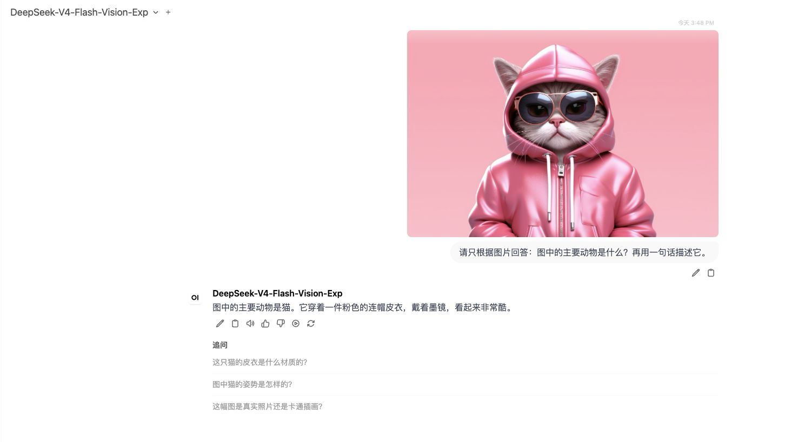

# DeepSeek-V4-Flash-Vision-Exp Day 0：4×H20 多模态部署与压测

2026 年 8 月 31 日晚，DeepSeek 在 Hugging Face 公开
`DeepSeek-V4-Flash-Vision-Exp`。它不是给文本版 DeepSeek-V4 换一个模型名，而是在
DeepSeek-V4-Flash 上加入完整视觉编码链路的实验版本：仓库页面标记为 305B，Checkpoint
由 48 个 Safetensors 分片组成，实际约 156.31 GiB；视觉侧包含 32 层 ViT、Aligner、图像
Marker 和图像可见性 Attention，单图最多展开为 384 个 Image Token，原生 Context 仍为
1,048,576。

模型发布后，我在 Kubernetes 上用 **单节点 4×141GB H20** 和 SGLang 专用
Preview Runtime 完成了部署、图片正确性、OpenWebUI 实操以及 79 轮多模态性能测试。最终
3,856 个请求全部成功，失败数为 0；测试完成后 Deployment 自动缩容到 0，4 张 GPU 已释放。

先给结论：

- **可以跑。** 原始 HF Checkpoint 直接从节点 NVMe 以 TP4 加载，SGLang OpenAI-compatible
  API、单图、双图交错和 OpenWebUI 图片上传均通过。
- **能 `Ready` 不等于启动快。** NVMe 读取 48 个分片只用了约 18 秒，但首次 MHC 编译、
  DeepGEMM/FlashInfer Autotune 和两组 CUDA Graph Capture 把完整冷启动拉到 13 分 52 秒。
- **720p 冷图在并发 16 时达到 175.06 Output tok/s，但 P99 TTFT 上升到 3.86 秒。**
  同图复用的 Warm 路径达到 332.52 Output tok/s，P99 TTFT 降到 1.10 秒。
- **图片数会明显压低请求吞吐。** 2×720p、C8 为 1.71 req/s；4×720p、C4 为
  2.11 req/s。两组并发不同，不能直接用后者反推“四图比双图快”。
- **这不是 SGLang 与 vLLM A/B。** 截至 2026-09-01，SGLang 提供了 Vision-Exp 专用
  Preview 实现；vLLM 的公开 DeepSeek Recipe 仍是文本版 V4，不能用文本服务冒充视觉支持。

参考：[模型仓库](https://huggingface.co/deepseek-ai/DeepSeek-V4-Flash-Vision-Exp)、
[SGLang DeepSeek-V4 Cookbook](https://docs.sglang.io/cookbook/autoregressive/DeepSeek/DeepSeek-V4)、
[vLLM DeepSeek Recipe 清单](https://recipes.vllm.ai/deepseek-ai)。

## 模型结构与运行时边界

| 项目 | 本次固定值 |
| --- | --- |
| 模型 | `deepseek-ai/DeepSeek-V4-Flash-Vision-Exp` |
| Revision | `e46e16bf6035c6f317eb2ac7458eb0362926d402` |
| 外层架构 | `DeepseekV4ForCausalLM` |
| 仓库参数标记 | 305B |
| Context | 1,048,576 |
| Checkpoint | 48 分片，156.31 GiB |
| 权重格式 | MoE Experts FP4，其余 Dense/Attention FP8 Mixed |
| 视觉模块 | 32-layer ViT，dim 1024，patch 14，最多 384 Image Token/图 |
| 推测解码 | DSpark，gamma=5，verify tokens=6 |

Checkpoint 的外层 `config.json` 没有使用常见的独立 `vision_config` 自动发现路径，完整视觉
参数和参考实现位于仓库 `inference/` 下。这会直接影响通用 Serving Engine 的模型注册、权重
加载和 `image_url` 处理，因此 Hugging Face 页面自动生成的一行启动命令不能代替端到端验证。

本次 SGLang Runtime 固定到 commit
`914197146f8a3407960e5c7037d0463e03c37be9`，属于专用 Preview Build，不是稳定版 Release。
运行时自动选择了 DSV4 Attention、FlashInfer MXFP4 MoE、FlashInfer AllReduce Fusion 和 FP8
KV Cache。日志同时警告 Checkpoint 没有提供 KV Scale，运行时回退到 1.0；所以图片内容正确性
Gate 不能因为吞吐测试成功而省略。

## 实验环境

| 项目 | 实测配置 |
| --- | --- |
| GPU | 单节点 4×NVIDIA H20-3e，143,771 MiB/卡，SM90 |
| Driver | 580.126.20 |
| Runtime | SGLang `0.0.0.dev1+g914197146` |
| PyTorch / CUDA | `2.13.0+cu130` / `13.0` |
| 并行 | TP4，单节点 |
| 模型热路径 | 宿主机 NVMe，只读挂载到容器 |
| API | OpenAI-compatible `/v1/chat/completions` |
| 客户端 | 同一个 `vllm bench serve --backend openai-chat` |

这是单节点 TP4，Tensor Parallel 通信没有跨节点，因此**本轮不使用 RDMA**。节点拥有 RDMA
设备不代表一次单机实验就能写成“已验证 RDMA”。H20 也不在当前 Vision-Exp 官方签字硬件矩阵
里；本文只能证明这组 H20、Driver、CUDA 和 Preview commit 的组合实测可用。

## 为什么先把权重放到 NVMe

共享文件系统只承担分发，不承担 Serving 热路径。选定节点后，将完整 HF Checkpoint 复制到
本地 NVMe，并在启动前验证：

1. 48 个 Index 引用分片全部存在且非空；
2. 源目录与目标目录的分片文件总字节数一致；
3. 目标目录的底层 Block Device 确实是 NVMe；
4. 写入完成 Marker 后，Serving 才允许启动。

本次 156.31 GiB 权重复制耗时 3 分 39 秒。公开示例只保留目录语义，不暴露内部存储地址：

```bash
findmnt -T /srv/model-cache
lsblk -o NAME,TYPE,SIZE,MOUNTPOINTS

rsync -a --partial --info=progress2 \
  /shared/models/DeepSeek-V4-Flash-Vision-Exp/v1/ \
  /srv/model-cache/DeepSeek-V4-Flash-Vision-Exp/v1/
```

## Kubernetes 启动方式

核心参数如下。镜像仓库、节点名、Namespace 和真实宿主机目录均使用公开占位符：

```yaml
apiVersion: apps/v1
kind: Deployment
metadata:
  name: deepseek-v4-vision-sglang
spec:
  replicas: 1
  strategy:
    type: Recreate
  template:
    spec:
      nodeSelector:
        accelerator.example.com/model: h20-141g
      containers:
        - name: sglang
          image: <INTERNAL_SGLANG_VISION_PREVIEW_IMAGE>
          command: ["bash", "-lc"]
          args:
            - |
              exec sglang serve \
                --model-path /models/DeepSeek-V4-Flash-Vision-Exp/v1 \
                --served-model-name DeepSeek-V4-Flash-Vision-Exp \
                --trust-remote-code \
                --tp 4 \
                --speculative-algorithm DSPARK \
                --mem-fraction-static 0.85 \
                --reasoning-parser deepseek-v4 \
                --enable-metrics \
                --host 0.0.0.0 \
                --port 30000
          resources:
            requests:
              nvidia.com/gpu: "4"
            limits:
              nvidia.com/gpu: "4"
          startupProbe:
            httpGet:
              path: /v1/models
              port: 30000
            periodSeconds: 10
            failureThreshold: 720
          volumeMounts:
            - name: model-cache
              mountPath: /models
              readOnly: true
            - name: dshm
              mountPath: /dev/shm
      volumes:
        - name: model-cache
          hostPath:
            path: <NVME_MODEL_ROOT>
            type: Directory
        - name: dshm
          emptyDir:
            medium: Memory
            sizeLimit: 64Gi
```

Preview Runtime 的首次编译时间很长，`startupProbe` 必须覆盖真实冷启动窗口。这里允许最多
120 分钟不是因为正常启动需要两小时，而是避免首次编译尚未结束就被 Kubelet 误杀并重新开始。

## 冷启动：NVMe 不是全部答案

| 阶段 | 耗时或时间点 | 观察 |
| --- | ---: | --- |
| 48 分片 NVMe 读取 | 约 18 秒 | 共享存储不在热路径 |
| MHC 首次编译 | 192.8 秒 | SM90 首次生成 Kernel |
| 主模型加载完成 | 约 247 秒 | 39.50 GB/卡 |
| DSpark 加载 | 16.4 秒 | 额外 2.71 GB/卡 |
| Target CUDA Graph | 36.7 秒 | 51 个 Batch Size |
| Draft CUDA Graph | 90.2 秒 | 51 个 Batch Size |
| 进程启动到 API Ready | **13 分 52 秒** | 包含 Autotune、JIT 与 Graph Capture |

这组数字说明：NVMe 能解决大权重读取，但不能消除 Runtime 首次编译与图捕获。若滚动发布时每个
Pod 都在空缓存环境重新编译，即使模型只有 156 GiB，也很难做到分钟级恢复。生产前应继续验证
编译缓存持久化、镜像内预编译产物和分批上线策略。

## 功能正确性与 OpenWebUI

先使用 Preview 镜像内置的猫、狗图片做四个确定性 Gate：纯文本只返回 `TEXT_OK`、猫图只返回
`CAT`、狗图只返回 `DOG`、猫到狗的双图交错只返回 `CAT,DOG`。全部通过；答案随图片替换而
变化，双图顺序也正确，因此不是“HTTP 200 但图片被忽略”。

随后把同一 OpenAI-compatible API 接入 OpenWebUI。在 Light 模式上传猫图后，模型正确识别
出猫、粉色连帽皮衣和墨镜，跨集群访问、模型发现、图片上传、Chat Template 与多模态响应完成
闭环。



## 压测方法

主测试不使用真实数据集评价质量，而是生成确定性的 360p、720p、1080p 和多图 JPEG，专门测
Serving 性能。Cold Case 每个请求使用不同图片；Warm Case 复用同一图片。所有 Case 固定输出
64 Token，`request-rate=inf`、`ignore-eos`、Seed 固定；每个有效点记录三轮，表中取每轮指标
中位数。

```bash
vllm bench serve \
  --backend openai-chat \
  --base-url http://<sglang-service>:30000 \
  --endpoint /v1/chat/completions \
  --model DeepSeek-V4-Flash-Vision-Exp \
  --dataset-name custom_image \
  --dataset-path <CASE_JSONL> \
  --custom-output-len 64 \
  --custom-ensure-client-side-data \
  --enable-multimodal-chat \
  --request-rate inf \
  --ignore-eos \
  --disable-shuffle \
  --save-result --save-detailed
```

虽然客户端命令名是 `vllm bench serve`，被测服务仍是 SGLang。它只通过 OpenAI-compatible
HTTP 接口发送请求，统一客户端有利于后续框架 A/B；SGLang 自带 Benchmark Client 可以用于
引擎内部诊断，但不能把两个不同客户端的数字直接拼成公平对比。

本轮共生成 79 个结果 JSON：112 个 Warm-up 请求和 3,744 个正式请求，合计 **3,856 成功、
0 失败**。完整矩阵耗时 46 分钟。

## 性能结果

### 单图 Cold 与 Warm

| Case | 并发 | Req/s | Output tok/s | P50 TTFT | P99 TTFT | P50 TPOT |
| --- | ---: | ---: | ---: | ---: | ---: | ---: |
| 360p Cold | 1 | 1.55 | 99.43 | 225.15 ms | 230.09 ms | 6.57 ms |
| 360p Cold | 4 | 2.71 | 173.19 | 236.48 ms | 516.07 ms | 18.94 ms |
| 360p Cold | 8 | 3.46 | 221.40 | 426.19 ms | 718.60 ms | 31.05 ms |
| 360p Cold | 16 | 4.34 | 277.66 | 463.62 ms | 1,243.54 ms | 47.91 ms |
| 360p Warm | 1 | 1.59 | 101.87 | 189.28 ms | 195.55 ms | 7.00 ms |
| 360p Warm | 4 | 3.01 | 192.90 | 201.70 ms | 371.30 ms | 17.44 ms |
| 360p Warm | 8 | 3.87 | 247.44 | 214.16 ms | 524.96 ms | 28.42 ms |
| 360p Warm | 16 | 5.30 | 339.17 | 376.11 ms | 674.81 ms | 40.92 ms |
| 720p Cold | 1 | 1.25 | 80.09 | 378.21 ms | 386.84 ms | 6.58 ms |
| 720p Cold | 4 | 1.98 | 126.96 | 401.66 ms | 1,072.97 ms | 24.14 ms |
| 720p Cold | 8 | 2.35 | 150.34 | 731.92 ms | 1,963.41 ms | 42.18 ms |
| 720p Cold | 16 | 2.74 | 175.06 | 932.64 ms | 3,861.24 ms | 69.06 ms |
| 720p Warm | 1 | 1.66 | 106.09 | 209.24 ms | 214.50 ms | 6.38 ms |
| 720p Warm | 4 | 3.10 | 198.70 | 236.05 ms | 399.69 ms | 15.38 ms |
| 720p Warm | 8 | 4.06 | 259.62 | 368.13 ms | 624.84 ms | 24.81 ms |
| 720p Warm | 16 | 5.20 | 332.52 | 426.87 ms | 1,103.43 ms | 40.17 ms |

720p、C16 的 Warm 路径相对 Cold：请求吞吐与输出吞吐均提高约 90%，P50 TTFT 降低
54.2%，P99 TTFT 降低 71.4%。这不是“模型本身突然快一倍”，而是相同图片复用减少了视觉
预处理和 Encoder 重复工作。真实业务如果图片大多唯一，应以 Cold 表为容量基线。

### 高分辨率与多图

| Case | 并发 | Req/s | Output tok/s | P50 TTFT | P99 TTFT | P50 TPOT |
| --- | ---: | ---: | ---: | ---: | ---: | ---: |
| 1080p Cold | 1 | 1.28 | 82.04 | 399.35 ms | 404.21 ms | 6.17 ms |
| 1080p Cold | 4 | 2.11 | 134.74 | 753.29 ms | 1,090.56 ms | 16.94 ms |
| 1080p Cold | 8 | 2.54 | 162.38 | 912.25 ms | 1,992.23 ms | 33.05 ms |
| 2×720p Cold | 1 | 1.03 | 66.22 | 571.68 ms | 580.31 ms | 6.45 ms |
| 2×720p Cold | 4 | 1.50 | 96.02 | 1,035.90 ms | 1,926.30 ms | 26.43 ms |
| 2×720p Cold | 8 | 1.71 | 109.42 | 1,431.42 ms | 3,678.51 ms | 51.90 ms |
| 4×720p Cold | 1 | 0.74 | 47.44 | 990.36 ms | 1,000.40 ms | 5.56 ms |
| 4×720p Cold | 4 | 2.11 | 134.75 | 800.79 ms | 1,192.45 ms | 16.07 ms |

多图场景更应该同时看 Req/s、TTFT 和图片数，不能只看 Token/s。4×720p、C4 每秒处理约
8.44 张图片，但每个请求本身包含四张图；它和 2×720p、C8 的调度压力不同，不能仅凭
Req/s 做横向排名。

### 首次新形状 JIT 要单独记录

360p、C16 的第一次正式记录 P99 TTFT 为 7.91 秒，后两轮降到约 1.22–1.24 秒。原始 JSON
全部保留，主表遵循预定规则取三轮中位数 1.24 秒，没有删除第一轮。对于 Preview Runtime，
`/v1/models` Ready 之后仍可能有新 Batch Shape 的首次编译，因此 Canary 预热需要覆盖生产
计划使用的分辨率、图片数和并发，不是只发一条文本请求。

## OpenWebUI 接入方式

OpenWebUI 只需要一个能从其所在网络访问的 OpenAI-compatible Base URL：

```text
http://<gateway-or-service>/v1
```

接入前从 OpenWebUI Pod 所在网络依次验证 `/v1/models` 和一次携带 Data URL 的
`/v1/chat/completions`。如果模型能出现在选择器但没有上传图片按钮，还要在 OpenWebUI 的模型
能力设置中显式标记 Vision；本次版本可以从返回模型直接完成图片上传，不需要前端插件。

跨集群场景不要把临时 Pod IP 写入 OpenWebUI。可以使用固定 Ingress、Gateway API，或在
OpenWebUI 集群创建 Selectorless Service + EndpointSlice 指向稳定入口。公开配置应删除真实
内网地址。

## vLLM 为什么没有数据

截至 2026-09-01，vLLM Recipe 页面列出的 DeepSeek-V4-Flash 是文本模型，Multimodal 分类下
也没有 Vision-Exp。文本 V4 能加载同家族语言权重，不等于它能够加载 ViT/Aligner、处理
`image_url`、维护图片可见性 Mask 并正确返回视觉答案。

因此本文不做以下两件事：

1. 不使用文本版 vLLM 镜像跑“图片请求”，再把报错写成 vLLM 性能差；
2. 不让图片被静默忽略后，只因为 HTTP 200 就伪造 SGLang/vLLM A/B。

等 vLLM 出现明确的模型注册、专用 Recipe 和图片 E2E 测试后，可以复用本文同一客户端、同一
JSONL、同一 H20 节点和同一 NVMe Checkpoint 做公平复测。

## 生产建议

1. **固定 Preview commit 和镜像 Digest。** 不要使用会漂移的 `latest`。
2. **CFS 只做源，NVMe 做热路径。** 启动前核对 Block Device 与完整 Marker。
3. **至少预留 15 分钟冷启动预算。** 同时持久化编译/Autotune Cache，验证是否能缩短第二次启动。
4. **按图片数和分辨率做 Admission Control。** 文本 Token 数相同不代表四图请求成本相同。
5. **Cold/Warm 分开建容量基线。** 业务图片唯一时不要引用 Warm 结果。
6. **保留首次新形状尾延迟。** Canary 预热覆盖真实并发，不删除“不好看”的第一轮。
7. **质量与性能分开。** 本文猫狗 Gate 证明图片链路有效，但不能替代 MMMU、MathVista、
   RealWorldQA、OCRBench 等质量评测。
8. **任务结束自动释放 GPU。** 本次由最小权限收尾 Job 在 Benchmark `Complete` 后把
   Deployment 缩到 0，并确认 Serving Pod 退出。

## 本次没有证明什么

- 没有验证模型声明的 1M Context 与图片共同输入；
- 没有运行标准视觉质量数据集，因此不能给出模型能力排名；
- 没有验证跨节点 TP/EP、RDMA 或 P/D 分离；
- 没有得到 vLLM Vision-Exp 数据，不能给出框架胜负；
- Preview Runtime、FP8 KV Scale 回退和 H20 非官方签字硬件都仍是上线风险。

但 Day 0 最关键的工程问题已经回答：**DeepSeek-V4-Flash-Vision-Exp 可以在 4×141GB H20
上通过 SGLang Preview 以 TP4 提供真实多模态服务；NVMe 权重热路径、OpenWebUI 图片链路和
3,856 请求性能矩阵均已闭环，测试结束后 GPU 也已自动释放。**

## 复现材料

- [部署与压测计划](deepseek-v4-flash-vision-exp-deployment-benchmark-plan.md)
- [`examples/deepseek-v4-flash-vision-exp/`](../../../examples/deepseek-v4-flash-vision-exp/)
- [DeepSeek-V4-Flash-Vision-Exp 模型仓库](https://huggingface.co/deepseek-ai/DeepSeek-V4-Flash-Vision-Exp)
- [SGLang DeepSeek-V4 Cookbook](https://docs.sglang.io/cookbook/autoregressive/DeepSeek/DeepSeek-V4)
- [vLLM DeepSeek Recipe 清单](https://recipes.vllm.ai/deepseek-ai)
