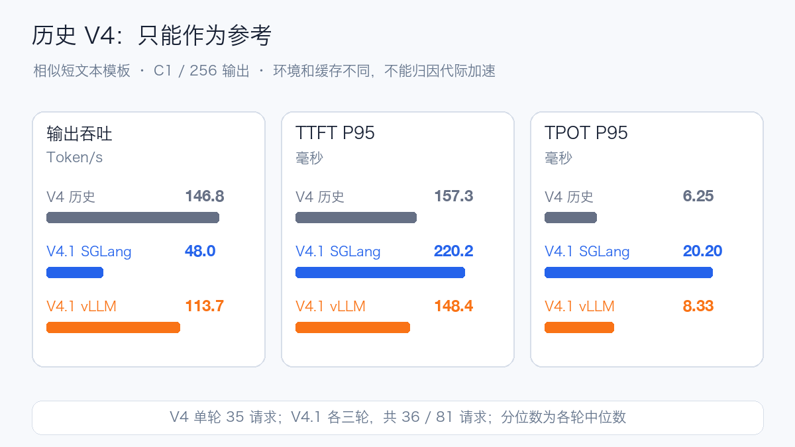

# DeepSeek-V4.1-Flash Day 0：8×H20-3e 部署与双引擎压测

## 1. 模型架构与资源特点

DeepSeek-V4.1-Flash 是支持图片和文本输入、文本输出的开放权重模型。它采用混合专家架构，并把 Engram 条件记忆引入模型：官方描述为 **552B 主干参数加 196B Engram 参数**，Prefill 与 Decode 阶段分别激活约 8B 与 16B 参数。这里的激活量主要描述一次计算涉及的参数量，不是部署时需要存放的全部权重。[官方模型卡](https://huggingface.co/deepseek-ai/DeepSeek-V4.1-Flash)

理解它，可以先把三类资源分开：主干权重负责计算，Engram 是模型自带的可学习记忆表，KV Cache 保存当前请求或可复用前缀的注意力状态。Engram 不是把以前用户对话存下来的数据库，也不是 Kubernetes 外挂的 RAG 检索库。把 Engram 放到 CPU，会改变访存路径；启用前缀缓存，则改变请求间的计算复用，两者不能混为一个优化开关。


模型的其他变化也会直接影响部署：

| 变化 | 对使用与测量的影响 |
| --- | --- |
| CED，20 层因果编码器加 20 层解码器 | Prefill 与 Decode 的工作量不同，不能只测一种输入输出长度 |
| CSA2 稀疏注意力与局部窗口 | 长上下文预算需同时考虑 global KV、局部状态及工作区 |
| FP4 专家权重、FP8 其他主要权重 | 需要相应打包格式和 CUDA kernel，不能仅凭“支持 FP8”判断兼容 |
| 原生视觉 | 要检查图片内容和顺序是否影响回答，文本通过不能替代视觉通过 |
| DSpark 推测解码 | 应另外测正确性、接受长度和延迟，不默认打开后混入普通 Decode 对比 |
| 新编码与工具调用协议 | 使用 V4.1 原生 tokenizer、reasoning parser 与 tool parser，旧 V4 配置不能直接照搬 |

以上为官方架构与配置描述，详细参数以[锁定版本的 config.json](https://huggingface.co/deepseek-ai/DeepSeek-V4.1-Flash/blob/fb2764a5cf321eaa5070ca8f9e892818f477c16d/config.json)及[编码说明](https://huggingface.co/deepseek-ai/DeepSeek-V4.1-Flash/blob/fb2764a5cf321eaa5070ca8f9e892818f477c16d/encoding/README.md)为准。

官方提供 1M 上下文能力，但这不等于任意硬件配置都能服务 1M 输入。官方关于 global KV 每 Token 字节数的说明，也不能代替整个推理进程的显存测量。本次服务上限设为 32K，最长实测输入为 24,576 Token；没有验证 1M 上下文。


## 2. 测试概况

本次在同一台八卡 H20-3e 上串行运行 SGLang 和 vLLM。两套服务都成功加载，基础文本、多轮、工具和视觉样例通过；vLLM 在多个已测场景中吞吐更高，但出现了 HTTP 200 下的空文本返回，计入失败请求。

测试采用单节点、GPU Engram、32K 服务上下文配置，覆盖基础功能和固定长度负载。vLLM 限速扫描在连续三轮出现失败请求后终止，缺少后两个负载档位的数据。

| 项目 | SGLang | vLLM |
| --- | --- | --- |
| 基础功能 | 文本、多轮、工具及流式通过；视觉修复样例包后通过 | 文本、多轮、工具、流式和视觉通过 |
| 核心压测 | 36/36 轮通过，1,056/1,056 请求成功 | 32/36 轮通过，1,051/1,056 请求成功 |
| 历史长度场景 | 12/12 轮通过，384/384 请求成功 | 8/12 轮通过，380/384 请求成功 |
| 限速扫描 | 执行 9 轮：8 轮通过，1,799/1,800 请求成功 | 执行 3 轮：均有失败，596/600 请求成功；其余 6 轮未执行 |
| 历史短文本模板 | 3 轮、36/36 请求成功 | 3 轮、81/81 请求成功 |

“轮通过”表示该轮所有请求满足客户端成功条件，不表示业务 SLO 达标。上表不包含预热与校准；校准分别为 SGLang 5/5 轮通过、vLLM 3/5 轮通过。核心、历史长度与限速三类主表共 108 轮、5,280 个请求，保留 14 个失败；历史短文本模板另有 117 个请求，不混入主表。


## 3. 八卡配置与实际启动

锁定模型快照 `fb2764a5cf321eaa5070ca8f9e892818f477c16d`，48 个 Safetensors 分片共 510,296,708,312 字节，约 **475.25 GiB**。其中两个 Engram 分片约 189.13 GiB，其余约 286.12 GiB。检查挂载目录中的文件大小、Header 和完整 SHA-256 后才启动推理；文件字节不等于运行时显存。

| 条件 | 本次配置 |
| --- | --- |
| GPU | 单节点 8×NVIDIA H20-3e；nvidia-smi 每卡报告 143,771 MiB，驱动 580.126.20 |
| 互联 | GPU 两两为 NV18；GPU 0–3 对应 NUMA 0，GPU 4–7 对应 NUMA 1 |
| 并行 | 两引擎均 TP8，并启用专家并行；串行复用同一台机器 |
| 资源请求/上限 | 64/128 CPU，512/1,024 GiB 内存；8 GPU；64 GiB 共享内存 |
| 模型加载 | 同一只读共享文件系统，Engram 放 GPU |
| 服务范围 | 最大上下文 32,768，最大运行序列 32；最长实测输入 24,576 Token |
| 优化开关 | 关闭文本前缀缓存；不启用 DSpark 或 SWA bounded replay；不做 CPU Engram 对照 |

| 引擎 | 锁定镜像 Digest | 关键软件 |
| --- | --- | --- |
| SGLang V4.1 预览构建 | `sha256:900b6e78f3e3f1725588eaa021c555ab63ad5ee7d0982cd4bca730dc7d83b9b4` | Torch 2.13.0+cu130；Transformers 5.12.1；FlashInfer 0.6.18 |
| vLLM 固定支持分支 | `sha256:11d2c94063827768882b3a9ba2deca6c6e4fd9492753b651517c87f1fea916cb` | vLLM 0.1.dev1+g79a7108d9；Torch 2.13.0+cu130；Transformers 5.17.0 |

vLLM 构建提交为 `79a7108d9aea27ddab99ce1779290d300b17fc23`，来自 [V4.1 支持工作](https://github.com/vllm-project/vllm/pull/56201)。本文数据对应上述固定构建与参数。两引擎的 kernel、调度和依赖实现不同，版本升级后需要重新测量。

启动前八个 rank 的 AllReduce 数值正确性检查均通过。实际 NCCL 版本为 SGLang 2.29.7、vLLM 2.30.7。检查范围为单节点通信正确性，不包含全矩阵带宽或跨节点 RDMA。

从发起服务启动到 Ready，SGLang 约 **531 秒**、vLLM 约 **390 秒**。SGLang 日志权重加载约 285.78 秒；vLLM rank 0 的权重读取日志为 117.93 秒，各 rank 模型加载阶段约 82.47–132.48 秒。两套服务先后访问同一共享存储，未清空文件缓存；这组启动耗时包含启动检查与模型初始化，仅作参考。日志中的权重阶段占用约为 SGLang 61.45 GB/rank（原日志单位）、vLLM 60.25 GiB/rank，不是含 KV、工作区的完整峰值显存。

### 启动参数

以下对应本次实际参数，`/model` 是容器内的已验证模型目录。镜像、GPU 能力和共享卷应由部署环境提供。

```bash
sglang serve --model-path /model --served-model-name deepseek-v41-flash --tp 8 --ep-size 8 --context-length 32768 --max-running-requests 32 --mem-fraction-static 0.85 --attention-backend dsv4 --moe-runner-backend flashinfer_mxfp4 --reasoning-parser auto --tool-call-parser auto --enable-metrics --disable-radix-cache --host 0.0.0.0 --port 30000
```

SGLang 环境变量 `SGLANG_ENABLE_DSV41_ENGRAM_HOST_TABLE=0` 固定 GPU Engram。vLLM 显式关闭 CPU offload：

```bash
vllm serve /model --served-model-name deepseek-v41-flash --tensor-parallel-size 8 --enable-expert-parallel --max-model-len 32768 --max-num-seqs 32 --max-num-batched-tokens 8192 --gpu-memory-utilization 0.85 --tokenizer-mode deepseek_v41 --reasoning-parser deepseek_v41 --tool-call-parser deepseek_v41 --enable-auto-tool-choice --engram-config '{"cpu_offload":false}' --no-enable-prefix-caching --host 0.0.0.0 --port 30000
```

## 4. 测量方法与 Prompt

核心矩阵为 1,024/128、8,192/128、1,024/512、24,576/128 Token，各测 C1、C8、C32，每组单独预热后正式重复三轮。各轮请求数分别为 8、16、64。C 是客户端并发上限，服务端最大运行序列也是 32。性能请求走 `/v1/completions`，使用相同合成随机文本、temperature=0、固定输出长度及 `ignore_eos=true`；它不代表真实问答质量。

两引擎共用 vLLM 原生 bench CLI 的调度与数据集生成，固定相同客户端镜像和请求校验代码。适配代码 SHA-256 为 `1c02882a16a8ce4db7188f418e89339502bbd5e25f2ac36028275e5527988184`。成功需 HTTP 200、非空 text、`[DONE]`、有效 usage、固定输出长度且无 SSE error。原生客户端可能把空片段计作首字，因此本次重新计时并保存原始 SSE；模拟回归只验证客户端，不计入模型成绩。

- **TTFT**：从发出请求到第一个非空 text 片段。性能接口的 text 不再拆分 reasoning/final；聊天功能测试单独检查最终答案。
- **每请求平均 TPOT**：首片段到最后生成内容的时间，除以 `completion_tokens - 1`；表中的 TPOT P95 是这些请求平均值的分位数，不是逐 Token 间隔 P95。一个 Chunk 可以含多个 Token。
- **吞吐**：成功请求计入的输出 Token 除以整轮时长；失败请求仍占用时长并留在成功率分母。
- **聚合**：表格是三轮指标的中位数；图中线段为三轮最小到最大值。延迟仅统计成功请求；完整流 E2E 另外保存在数据附件。三轮 P95 中位数不是合并所有请求后的 P95，小样本不支撑可靠 P99。

功能请求走聊天接口、允许正常结束，使用 `reasoning_effort: "low"`。部分实际 Prompt 如下：

| 能力 | 实际 Prompt / 操作 | 验证结果 |
| --- | --- | --- |
| 算术 | `计算 17 加 25，只回答数字。` | 两引擎最终答案为 42 |
| 多轮 | `Remember code 482619.` → `What was the code? Reply only with the code.` | 返回 482619 |
| 工具 | `Use get_weather to look up weather in Beijing. Do not invent the weather.` | 工具名、参数及模拟结果回灌通过；不是实时天气验证 |
| 单图 | `Name the main vegetable shown. Reply with one English noun only.` | 官方 carrots/corn 样例均正确 |
| 双图 | `Name the main vegetable in each image in order. Reply as two English nouns separated by a comma.` | 交换图片顺序后回答对应变化 |
| 流式 | 算术请求使用 SSE | 结束标记、usage 与最终答案通过 |

SGLang 最初视觉检查因执行包缺少图片失败；将已核对哈希的官方图片补入后，仅补跑视觉检查通过，首次缺图失败单独记录。两个蔬菜样例只证明有限的内容与顺序敏感性，不等于完整视觉评测。核心/历史/限速表中的“成功”也只验证传输和固定输出条件，不检验生成内容的语义质量。

## 5. 核心性能：同时看吞吐、等待和失败


短请求 C1 的输出吞吐为 SGLang **45.85 Token/s**、vLLM **104.52 Token/s**；C32 分别为 **445.03** 和 **613.56 Token/s**，但 vLLM C32 有 1/192 请求失败。1,024/512 的 C32 场景分别为 824.70 和 1,219.46 Token/s，vLLM 同样有 1/192 请求失败。吞吐更高和所有请求有效返回是两个条件。


长输入下，即使所有请求完成，交互体验也可能无法接受。24K/C32 场景 TTFT P95 达到 SGLang **154.683 秒**、vLLM **102.401 秒**。本次仅记录该并发和调度配置下的现象，没有用独立 profile 定位等待、Prefill 分块及 Decode 干扰的贡献，不能直接归因某个 kernel。

| 输入/输出 Token | 并发 | 引擎 | 成功/请求 | 输出 Token/s | TTFT P95（秒） | TPOT P95（毫秒） |
| --- | ---: | --- | ---: | ---: | ---: | ---: |
| 1,024/128 | 1 | SGLang | 24/24 | 45.85 | 0.248 | 20.202 |
| 1,024/128 | 1 | vLLM | 24/24 | 104.52 | 0.198 | 8.153 |
| 1,024/128 | 8 | SGLang | 48/48 | 254.58 | 1.462 | 20.864 |
| 1,024/128 | 8 | vLLM | 48/48 | 404.25 | 1.176 | 18.216 |
| 1,024/128 | 32 | SGLang | 192/192 | 445.03 | 5.686 | 49.658 |
| 1,024/128 | 32 | vLLM | 191/192 | 613.56 | 4.463 | 42.975 |
| 8,192/128 | 1 | SGLang | 24/24 | 31.14 | 1.567 | 20.211 |
| 8,192/128 | 1 | vLLM | 24/24 | 57.71 | 1.197 | 8.112 |
| 8,192/128 | 8 | SGLang | 48/48 | 63.64 | 13.650 | 95.146 |
| 8,192/128 | 8 | vLLM | 48/48 | 97.63 | 9.194 | 72.579 |
| 8,192/128 | 32 | SGLang | 192/192 | 76.79 | 48.045 | 370.468 |
| 8,192/128 | 32 | vLLM | 190/192 | 106.39 | 34.190 | 265.312 |
| 1,024/512 | 1 | SGLang | 24/24 | 48.52 | 0.247 | 20.219 |
| 1,024/512 | 1 | vLLM | 24/24 | 115.17 | 0.197 | 8.335 |
| 1,024/512 | 8 | SGLang | 48/48 | 350.16 | 1.466 | 20.328 |
| 1,024/512 | 8 | vLLM | 48/48 | 613.74 | 1.177 | 12.597 |
| 1,024/512 | 32 | SGLang | 192/192 | 824.70 | 5.679 | 33.474 |
| 1,024/512 | 32 | vLLM | 191/192 | 1219.46 | 4.458 | 23.859 |
| 24,576/128 | 1 | SGLang | 24/24 | 16.85 | 5.064 | 20.241 |
| 24,576/128 | 1 | vLLM | 23/24 | 27.73 | 3.604 | 8.072 |
| 24,576/128 | 8 | SGLang | 48/48 | 19.59 | 49.718 | 312.160 |
| 24,576/128 | 8 | vLLM | 48/48 | 35.09 | 26.228 | 187.417 |
| 24,576/128 | 32 | SGLang | 192/192 | 22.79 | 154.683 | 1330.067 |
| 24,576/128 | 32 | vLLM | 192/192 | 36.30 | 102.401 | 814.965 |

以上每格都是三轮统计；成功数是三轮合计。全部轮次、范围、完整流 E2E 及失败摘要见 [JSON 汇总](../../assets/practices/deepseek-v41-flash-h20-day0/benchmark-summary.json) 和 [逐轮 CSV](../../assets/practices/deepseek-v41-flash-h20-day0/benchmark-rounds.csv)。附件包含原始结果文件的 SHA-256，便于核对来源。

## 6. 限速扫描：请求成功与 SLO 达标分别看

使用共同的绝对请求速率，来自 SGLang 8K/128、C32 校准参考约 0.60 请求/秒的 0.5、0.8、1.1 倍，即 0.300、0.480、0.660 请求/秒。每轮 200 个请求、每档三轮，客户端不再设并发上限，服务端仍限 32。它是本次扫描轴，**不是各引擎生产容量的百分比**。

| 请求/秒 | SGLang 成功/请求 | vLLM 成功/请求 | TTFT P95 秒：S / V | TPOT P95 毫秒：S / V |
| ---: | ---: | ---: | ---: | ---: |
| 0.300 | 600/600 | 596/600 | 6.074 / 3.249 | 89.428 / 38.643 |
| 0.480 | 599/600 | 未执行 | 8.746 / — | 236.511 / — |
| 0.660 | 600/600 | 未执行 | 26.138 / — | 371.230 / — |

在实验阈值 **TTFT ≤3 秒且每请求平均 TPOT ≤50 ms** 下，0.300 请求/秒档位的达标比例为 SGLang 45.5%、vLLM 88.5%（各轮比例的中位数，失败请求计为不达标）；这不是任何业务约定的正式 SLO。客户端到达调度偏差和 CPU 饱和度未完成独立复核，不能从该扫描推导精确的最大可持续请求率。

vLLM 三轮分别为 199/200、198/200、199/200 成功，触发执行器“连续三轮失败，停止当前阶段”的保护。其余六轮未执行，因此没有高负载档位的双引擎对照。停止条件按整轮是否存在失败请求判定。

## 7. HTTP 200 为什么仍算失败

核心、历史长度和限速三类正式测试中，vLLM 共 13 个异常请求。离线解码原始 SSE 后，它们都具有 HTTP 200、`[DONE]` 和 completion usage，但拼接后的 `choices[].text` 长度为零。校准和预热还存在同类失败，未混入这 13 个正式请求的分母。

```json
{
  "http_status": 200,
  "done": true,
  "completion_tokens": 128,
  "visible_text_length": 0,
  "accepted_as_success": false
}
```

这是其中一个样本的脱敏字段摘要，并非全部请求。样例来自固定长度合成输入与 `ignore_eos=true` 的 `/v1/completions` 路径，不能直接外推成真实聊天的空回答率。特殊 Token、解码过滤、模型生成与引擎实现都有待进一步定位；当前证据只能确认空文本现象，根因尚未确定。

SGLang 的一个正式失败出现在 0.480 请求/秒第二轮，错误为 `ServerDisconnectedError: Server disconnected`，该轮 199/200 完成。该断连的原因尚未确定。

## 8. 历史 V4 Flash：没有证明普遍提速

历史参考取自此前 AIBrix 的 V4 实验，共 14 个正式阶段、4,329 条请求记录。最接近的 `direct-c1` 是单个 TP8 引擎直连，输入 533–544 Token、输出 256 Token，35/35 成功。



| 部署记录 | 样本 / 轮数 | 输出 Token/s | TTFT P95 毫秒 | TPOT P95 毫秒 |
| --- | --- | ---: | ---: | ---: |
| 历史 V4 / vLLM | 35 / 1 | 146.779 | 157.260 | 6.249 |
| V4.1 / SGLang | 36 / 3 | 48.027 | 220.198 | 20.203 |
| V4.1 / vLLM | 81 / 3 | 113.724 | 148.442 | 8.328 |

本轮重用短文本模板、C1 闭环和 256 输出，SGLang 输入范围 535–542 Token、vLLM 534–544 Token；旧请求带随机 UUID，不是逐字回放。历史表使用保留旧计时方式的客户端，与核心矩阵的严格客户端分开。新数据仍为各轮指标的中位数，旧数据只有一轮，不能补出历史方差。

旧部署为 vLLM `0.26.0b2.dev1+g3b102b576`、CUDA 12.9、FP8 KV、开启前缀缓存；当前使用不同的模型、引擎构建、CUDA 13 和原生 KV 路径，并关闭文本前缀缓存。旧场景八卡引擎处理请求，但整个实验预留了十六卡。早期 96 GB H20 加 DSpark 的历史长度数据也不构成同硬件对照。

本轮 vLLM 的 TTFT 比这个历史点略低，但吞吐和 TPOT 没有同步变好；不能据此证明 V4.1 普遍更快，也不能反向断言模型架构退步。官方 global KV 压缩比例描述状态大小，不是本机吞吐加速倍数。历史来源：[AIBrix 与 V4 Flash 实战](aibrix-dsv4-observability.md)。

## 9. Grafana 监控与数据来源

下面两张看板分别对应 SGLang 和 vLLM 的核心压测时段，依次运行短请求、8K 输入、长输出和 24K 输入。时间窗不同，横轴长度也不同；蓝色表示 SGLang，橙色表示 vLLM。


左上是 TTFT，右上是每请求平均 TPOT，左下是成功输出吞吐，右下是完整流 E2E。长输出阶段吞吐较高，切换到长输入后，首字和完整请求耗时明显增加。不同负载阶段应结合输入输出长度解读，不能只截取吞吐峰值作为服务容量。

看板的 P95 来自 **1 分钟滑动窗口的直方图估计**，分桶精度和样本数量都会影响曲线；正文表格则是逐请求结果计算出的整轮统计。客户端指标在请求结束后写入，因此曲线表示该时段完成请求的表现，空档也可能来自阶段切换或尚无请求完成。


八卡资源图对应 vLLM 的 24K 输入阶段。按 15 秒间隔查询的样本，各卡显存占用约 **123.65–124.67 GiB**，SM 频率为 **1.98 GHz**；高负载区间 GPU 利用率接近 100%，阶段切换时出现回落。这里的显存包含权重、KV 和运行时分配，不能当作模型权重大小，也不是逐毫秒捕获的峰值。

看板截图来自原压测时段保留的 Prometheus 数据；查询、绝对时间窗及数据点检查见 [监控证据说明](../../assets/practices/deepseek-v41-flash-h20-day0/grafana-evidence.json)。截图采用浅色布局，指标查询保持原口径。

功能结论来自 API 响应和原始 SSE，本文未提供 OpenWebUI 对话截图。监控曲线可以定位阶段变化，但无法独立区分算子执行、通信和排队的贡献；这些归因仍需要 profile。测试范围限于单节点 GPU Engram 和最长 24K 输入，不覆盖 CPU offload、1M 上下文、DSpark、bounded replay、多机扩展或长期稳定性。

## 10. 镜像构建与依赖检查

| 问题 | 已确认原因 | 处理与验证 |
| --- | --- | --- |
| 只读检查 Pod 一直 ContainerCreating，事件为 `node has not turbo kernel mod` | 被调度到未安装 CFS Turbo 内核模块的 CPU 节点 | 改到具备该挂载能力的节点，保持 GPU 请求为 0；Pod 启动后实际读取共享目录成功。生产中应维护存储能力标签，不能只按 CPU/GPU 分类选择节点 |
| 源码准备报 `--filter can only be used when extensions.partialClone is set` | 中转环境的旧版 Git 对部分克隆配置有额外要求 | 补充相应 remote 与 partialClone 配置后，获取并确认固定 Commit，进入镜像构建。长期做法是固定构建工具链版本 |
| vLLM 构建等待 FlashInfer distribution cache lock 超时 | 两个构建阶段共享 uv 缓存，大包下载持锁超过另一个阶段的 300 秒等待上限 | 构建专用 Dockerfile 给共享 uv cache mount 增加 `sharing=locked`，让 BuildKit 串行使用该缓存；不改模型或运行时源码，构建已继续完成 |
| CUDA 编译完成后，wheel 大小检查失败 | 生成的 wheel 为 567.79 MB，超过上游打包检查的 500 MB 门槛；并非 CUDA 编译失败 | 内部容器构建使用上游 `RUN_WHEEL_CHECK=false` 参数，保留完整内核和失败日志，复用构建缓存完成镜像。依赖、GPU 内核、模型功能的检查仍需分别执行 |
| 同步接口显示完成，但模型仍不能加载 | 实际目标 CFS 尚缺权重分片；接口状态与挂载目录不是同一个就绪证据 | 使用零 GPU 容器检查实际文件大小、Safetensors Header 和完整 SHA-256，通过后才申请八卡 |
| 零 GPU 客户端运行 `vllm --version` 失败 | 此候选的全局入口构造服务参数时触发设备类型推断；不代表 CPU 压测入口不可用 | 从包元数据记录版本，实际执行 `vllm bench serve` 对接本地模拟 SSE 服务；两次模拟请求完成，只证明客户端 CLI 与传输路径，不计入模型成绩 |


依赖检查也保留了不通过项：SGLang 镜像存在 NCCL、protobuf 和部分可选多模态依赖冲突；vLLM 的 Torch 元数据要求 NCCL 2.29.7，而实际安装并加载 2.30.7。依赖冲突尚未消除，需与已通过的 GPU 数值检查和功能结果分别评估。

## 11. 给部署者的建议

**并发应由业务的延迟目标决定。** 本次 24K/C32 的 TTFT P95 超过百秒，在线服务需要为长文本请求设置更低的并发和明确的排队上限。长短请求分别评估容量，配合超时与准入控制，避免长 Prefill 拖慢交互请求。

GPU 通信、CPU 调度和内存位置分别检查。本机 NV18 的 GPU 互联与两个 NUMA 域同时存在；进程允许的 CPU 集合不等于实际物理页位置。生产中结合设备拓扑、CPU Manager、Topology Manager 和实际绑核策略验证；单个八卡 Pod 横跨两个 NUMA 域时，不应未经核查就启用要求所有资源落在单一 NUMA 域的策略。CPU Engram 尤其需要独立测量本地/远端内存与 PCIe 访问成本。

部署准入同时要求有效内容、结束标记和 Token 使用信息，不只检查 HTTP 200。固定版本保存启动参数与依赖差异；对本次存在空文本异常的 vLLM 构建，在真实业务验证之前不按图中吞吐承诺生产容量。SGLang 也有断连样本和明显长输入尾延迟，不能仅凭核心矩阵全通过就宣布稳定性合格。

容量评估时同时观察有效请求吞吐、TTFT、TPOT 和失败率，并使用实际业务的输入输出分布进行回放。
