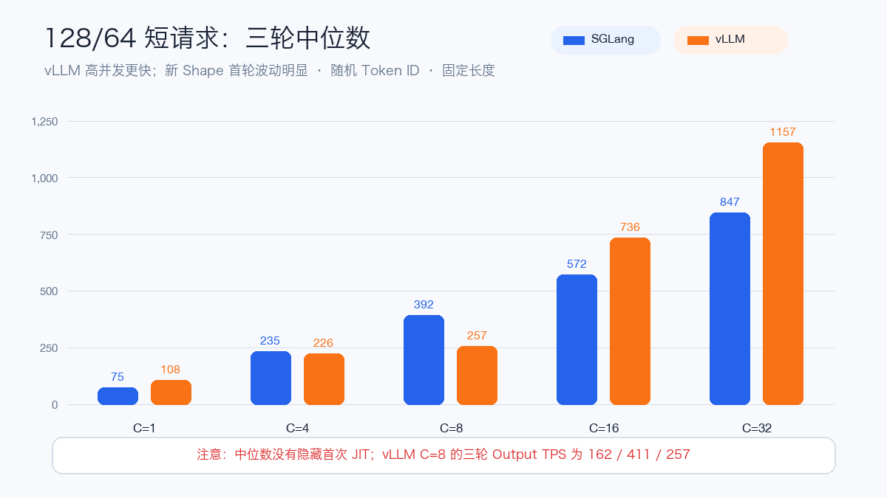
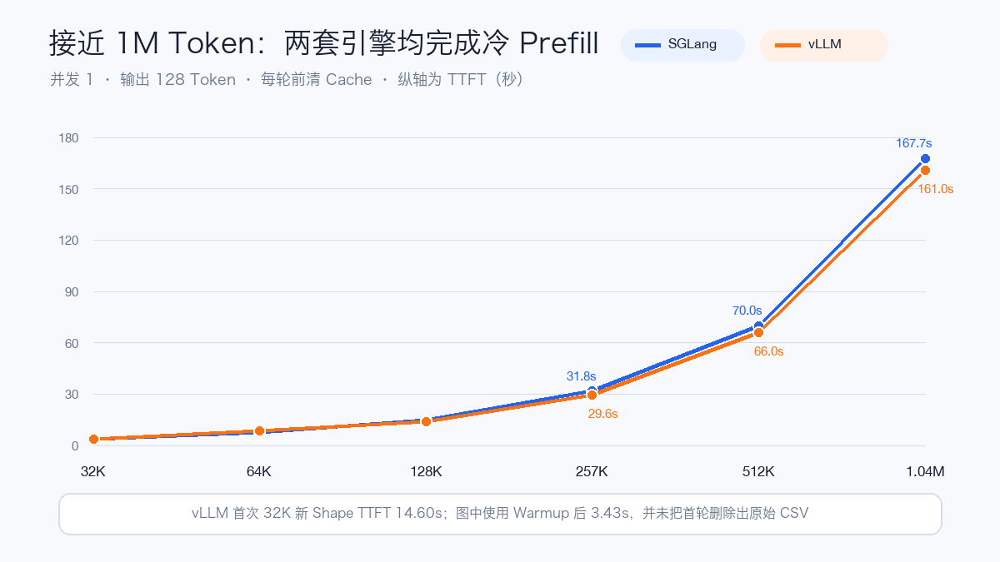
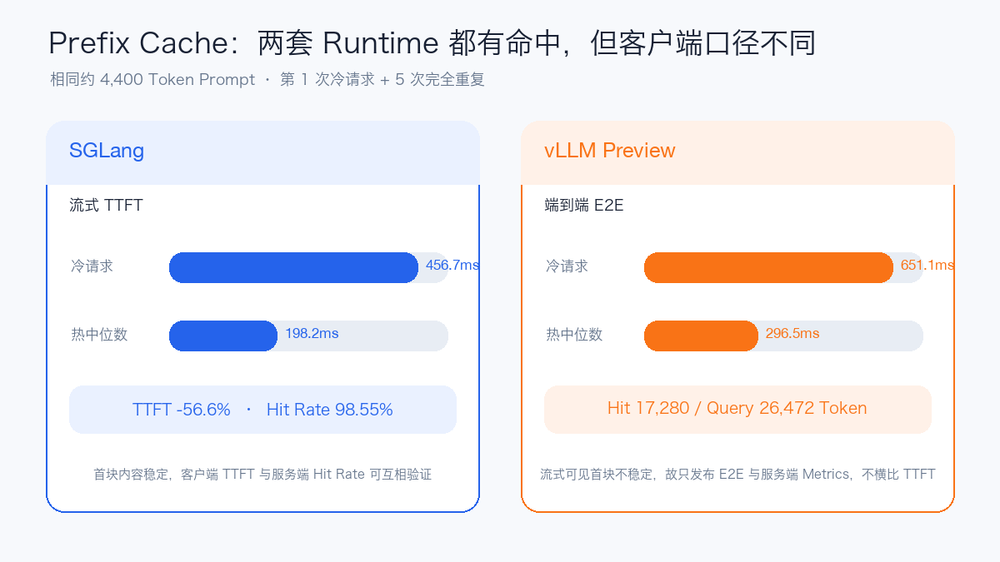

# GLM-5.3-Flash Day 1 实测：4×H20 部署、1M 上下文与 SGLang/vLLM 对照

GLM-5.3-Flash 发布后的第二天，我用官方 Native FP8 权重在 4 张 141 GB H20 上分别
跑通了 SGLang 和 vLLM 专用预览镜像。测试不止停在“Pod Running”：我实际验证了
Reasoning、Tool Call、图片输入、OpenAI 兼容接口、OpenWebUI、短请求吞吐、1K Decode、
Prefix Cache，以及接近 1M Token 的冷 Prefill 和 Needle 检索。

先给结论：

- **4×H20 可以部署官方 FP8 Checkpoint。** 两套引擎的权重显存约为每卡 75 GiB，
  使用 BF16 KV Cache 后仍有足够空间覆盖 1,048,576 Token。
- **SGLang 是当前更完整的首日支持落地路径。** 功能 Smoke 全部通过，能返回独立的
  `reasoning_content`，Prefix Cache 证据完整，并已经接入 OpenWebUI 完成真实对话。
- **vLLM 专用预览镜像确实能跑，而且高并发 Decode 更快。** 但主仓集成在测试当天仍
  未完成，启动日志还提示 Sparse MLA Prefill 与 H20 MoE 调优配置缺口；预览 API 的
  Reasoning 字段和 Cache 流式输出也有边界行为。
- **两套引擎都完成了接近 1M Token 的请求和 Needle 检索。** SGLang 在 261K、263K、
  289K 冷请求上均成功，本次没有复现社区报告的约 262K 边界崩溃。
- **首次遇到新形状的 JIT 尾延迟不能忽略。** 如果只取最快一轮，结论会明显失真。

这不是一篇官方文档转述。下面的数字来自同一套模型和实际 H20 服务；逐轮 CSV 与脱敏
JSON 已放在文末的复现材料中。

## 为什么这个模型难在“部署链路”

GLM-5.3-Flash 是原生多模态 MoE，约 320B 总参数、每 Token 激活 18B。45 层文本网络
混合 MLA、DSA 和 KDA，包含 288 个路由专家、每 Token 激活 8 个专家，还带一层原生
MTP Draft。官方上下文上限是 1,048,576 Token，输入支持文本、图片和视频。

这意味着 Transformers 能识别 `glm5_next`，并不等于推理服务已经完整可用。Sparse
MLA、KDA State、MoE Kernel、MTP、CUDA Graph、多模态 Encoder 和 Cache Manager
都可能成为独立故障点。对这样的首发模型，最低限度要分开回答三个问题：

1. 权重和镜像能否正常启动；
2. API 功能是否正确；
3. 在短请求、长上下文和缓存场景下是否稳定。

## 测试环境与公平性边界

| 项目 | 本次配置 |
| --- | --- |
| 模型 | GLM-5.3-Flash Native FP8 |
| 模型架构 | `Glm5NextForConditionalGeneration` |
| 权重 | 62 个分片，Index 记录 328,326,771,576 Byte |
| GPU | 4×NVIDIA H20 141 GB / 每套引擎 |
| 并行 | TP=4；SGLang 额外 EP=4 |
| KV Cache | BF16 |
| Context | 1,048,576 |
| MTP | 关闭，先测 Target-only 基线 |
| 驱动 | 580.126.20 |
| 重复 | 短压、4K Prefill 和 1K Decode 各 3 轮 |

需要特别说明：两套引擎使用同一台 8 卡主机中**互不重叠的两组 4 卡切片**，vLLM 压测
期间 SGLang 保持空闲。这能减少机型和宿主环境差异，适合做 Day-1 横向观察，但宿主机
CPU、内存和存储路径仍然共享。它不是“同一组 GPU UUID 上串行复测”的金标准 A/B，
因此本文不把小幅差距解释成引擎的普遍定论。

测试时固定了官方镜像的 `linux/amd64` Digest，避免上游覆盖 Tag 后把不同实现混算：

| 引擎 | 实际版本 | 镜像 Digest |
| --- | --- | --- |
| SGLang | `0.0.0.dev1+gf609d677b` | `sha256:0836f016...9188aaf` |
| vLLM | `0.1.dev20051+g487ecf187` | `sha256:2e771fa61...ab703` |

## 4×H20 是怎么部署起来的

### SGLang：TP4 + EP4，先关 MTP

本次 SGLang 采用 DSA Attention，Prefill/Decode 都使用 TileLang，KDA Linear Attention
使用 Triton，MoE 使用 DeepGEMM。关键配置如下：

```text
TP=4, EP=4
FP8 Weight + BF16 KV Cache
DSA Prefill/Decode = TileLang
Linear Attention = Triton
MoE Runner = DeepGEMM
Max Running Requests = 32
Chunked/Max Prefill Tokens = 8192
MTP = Off
Reasoning Parser = glm45
Tool Parser = glm47
```

为什么第一轮关闭 MTP？因为 MTP 会同时改变延迟、Decode 吞吐、显存和 CUDA Graph
形状。先拿到 Target-only 基线，后面再做单变量开关，才知道性能变化来自模型 Kernel，
还是 Draft/Verify。

SGLang 实际启动过程：

| 阶段 | 实测 |
| --- | ---: |
| 权重加载 | 130.59 s |
| 权重显存 / GPU | 75.27 GiB |
| BF16 KV Cache / GPU | 19.93 GiB |
| KV Token Pool | 1,683,136 Token |
| 容器创建到服务 Ready | 约 9 分 51 秒 |

模型还会占用 KDA/Mamba State Pool，所以不能只按权重加 KV Cache 估算显存。服务启动后
我保留了 `/health`、Readiness Probe 和较长的 Startup Probe；对这种首发大模型，
默认几十秒探针只会制造无意义重启。

### vLLM：TP4 可以跑，但启动阶段更重

vLLM 同样使用 TP4、FP8 Weight、BF16 KV Cache、1M Max Model Length 和 MTP Off。
它最终成功 Ready，但启动日志给出了几条必须保留在报告里的信息：

| 阶段 | 实测 |
| --- | ---: |
| 最慢 Rank 权重加载 | 365.69 s |
| 权重显存 / GPU | 75.65 GiB |
| KV Cache / GPU | 29.94 GiB |
| KV Token Pool | 2,735,415 Token |
| DeepGEMM Warmup | 1,102 个 Kernel，约 92 s |
| CUDA Graph Capture | 15 s / 0.95 GiB 每卡 |
| 容器创建到服务 Ready | 约 12 分钟 |

默认 10 分钟的 Deployment Progress Deadline 会先报超时，但 Pod 没有崩溃，完成
DeepGEMM 与 FlashInfer Autotune 后正常 Ready。生产 YAML 应把 Progress Deadline 和
Startup Probe 放宽到 20～30 分钟，并用 Readiness 控制流量，而不是看到 10 分钟未
Ready 就循环重建 Pod。

另外两条警告也很关键：当前没有适配此模型的 MLA Prefill Backend，Sparse MLA
退回 Top-k MQA Path；镜像中也没有 H20 专用的 FP8 MoE 调优配置，使用的是默认配置。
这不影响“能跑”的结论，却意味着本文性能不是 vLLM 在 H20 上的最终上限。

公开的 Kubernetes Deployment、Service、探针与测试脚本在
[`examples/glm53-flash-day1`](https://github.com/runzhliu/aik8s/tree/main/examples/glm53-flash-day1)。
示例只保留通用接口，实际环境中的存储、镜像同步和入口实现不属于本文范围。

## 功能正确性：不能只问一句“你好”

| 能力 | SGLang | vLLM 预览镜像 |
| --- | --- | --- |
| `/v1/models` | 通过 | 通过 |
| `reasoning_effort=low/high/max` | 通过 | 通过 |
| 独立 `reasoning_content` | 有 | 未拆分，内容仍在普通字段 |
| 结构化 Tool Call | 通过 | 通过 |
| 真实图片输入 | 通过 | 通过 |
| 视频输入 | 未测 | 未测 |
| OpenWebUI 真实对话 | 通过 | 未注册，临时服务已释放 |

SGLang 的 OpenAI 兼容服务已经接入 OpenWebUI，模型列表和真实 Chat 都返回成功。这项
验证的意义不是证明 UI 好看，而是确认跨服务访问、模型名、Chat Template、Parser 和
流式响应能一起工作。

vLLM 能正确完成 Reasoning 请求，但没有把思考过程拆到独立 `reasoning_content`。
因此“请求返回 200”与“前端能按预期展示 Reasoning”仍是两件事。

## 短请求吞吐：三轮中位数之外，还要看波动

短压固定输入 128、输出 64，使用随机 Token ID、固定长度、无请求速率上限。每个并发
跑三轮，图中使用三轮中位数，不摘最好的一轮。



| 并发 | SGLang Output TPS | vLLM Output TPS | SGLang P95 TTFT | vLLM P95 TTFT |
| ---: | ---: | ---: | ---: | ---: |
| 1 | 74.7 | 107.7 | 188 ms | 183 ms |
| 4 | 234.6 | 225.9 | 340 ms | 559 ms |
| 8 | 392.4 | 257.2 | 414 ms | 11.76 s |
| 16 | 572.2 | 735.8 | 428 ms | 565 ms |
| 32 | 847.1 | 1,156.9 | 1.10 s | 695 ms |

vLLM 在并发 16/32 的稳定吞吐更高，并发 32 的三轮 Output TPS 为 1,145.4、1,156.9、
1,166.4。SGLang 并发 32 为 847.1、842.4、853.5。

但并发 4/8 不能只看 vLLM 的最快轮。vLLM 并发 8 的三轮 Output TPS 是 162.2、
410.8、257.2；其中第一轮 P99 TTFT 达 23.43 秒，第三轮 P95 TTFT 仍有 11.76 秒。
SGLang 第一次遇到并发 4/8/16 也分别出现约 10.9、12.5、13.6 秒 P95 TTFT，随后两轮
恢复稳定。这与两套 Runtime 日志中的 JIT 编译吻合。

正确的工程结论不是“谁绝对更快”，而是：vLLM 预览镜像展示了更高的并发吞吐潜力；
SGLang 在完成第一次 Shape Warmup 后更稳定。上线前必须把业务实际并发和长度组合纳入
Warmup，且监控 P99，不能只盯平均 TPS。

### 4K Prefill 与 1K Decode

4K 输入、128 输出、并发 4 的三轮结果：

| 引擎 | Output TPS | P95 TTFT |
| --- | --- | --- |
| SGLang | 143.8 / 143.3 / 143.6 | 1.797 / 1.796 / 1.779 s |
| vLLM | 116.9 / 172.1 / 172.8 | 7.209 / 1.798 / 1.799 s |

第一轮再次说明 Warmup 的影响。去掉首次新 Shape 后，vLLM 吞吐更高，两边 P95 TTFT
基本相同。

128 输入、1,024 输出的 Decode 测试更清晰：

| 并发 | SGLang Output TPS | vLLM Output TPS | SGLang P95 TPOT | vLLM P95 TPOT |
| ---: | ---: | ---: | ---: | ---: |
| 1 | 92.3 | 148.5 | 10.71 ms | 6.56 ms |
| 8 | 461.0 | 685.0 | 17.19 ms | 11.47 ms |

在本次 MTP Off 基线中，vLLM 的 Decode 路径优势明显。它是否能抵消前面看到的
Warmup 波动，要由真实流量分布决定。

## 1M 上下文：成功返回不等于检索正确

长上下文测试每次先清理 Prefix Cache，固定输出 128 Token、并发 1。32K 两套 Runtime
都额外跑了一次：vLLM 首次新 Shape TTFT 为 14.60 秒，Warmup 后是 3.43 秒；图中使用
后者，并显式保留排除说明。



| 输入 Token | SGLang TTFT | vLLM TTFT |
| ---: | ---: | ---: |
| 32,768 | 3.61 s | 3.43 s |
| 65,536 | 7.30 s | 8.29 s |
| 131,072 | 14.98 s | 13.99 s |
| 263,168 | 31.80 s | 29.57 s |
| 524,288 | 70.02 s | 65.95 s |
| 1,044,480 | 167.69 s | 160.96 s |

两套引擎都完成了接近原生上限的请求。更重要的是，我把唯一标识分别埋在上下文的
10%、50%、90% 位置，并要求模型精确返回：

- SGLang：11/11 通过；32K、128K、257K 各三个位置，512K 与近 1M 测中间位置；
- vLLM：8/8 通过；32K、257K 各三个位置，512K 与近 1M 测中间位置。

因此本次结论是“冷请求成功且指定 Needle 可检索”，而不只是 HTTP 200。它仍不代表
模型能对任意 1M 长文完成复杂推理；Needle 只是最低正确性门槛。

### 262K 风险边界复测

| 输入 Token | SGLang TTFT | 结果 |
| ---: | ---: | --- |
| 261,120 | 31.47 s | 成功 |
| 263,168 | 31.80 s | 成功 |
| 288,768 | 35.16 s | 成功 |

测试后 SGLang Pod 仍为 0 Restart。本次未复现社区曾报告的约 262K 冷 Prefill 后
首 Token 崩溃，但单一 H20 配置的成功不能宣布问题对所有硬件、Backend 和镜像都消失。

## Prefix Cache：一定要同时看时间和服务端 Metrics

固定约 4,400 Token Prompt，第一次冷请求后完全重复五次。



SGLang 的证据链完整：冷 TTFT 456.7 ms，热请求中位数 198.2 ms，下降 56.6%；服务端
Cache Hit Rate 从 0 上升到 98.55%。这可以明确写成 Prefix Cache 生效。

vLLM 预览镜像的服务端 Metrics 也显示命中：该轮 Query Token 增量 26,472，Hit Token
增量 17,280，增量命中率约 65.28%；冷 E2E 651.1 ms，热 E2E 中位数 296.5 ms。
但它的 Preview Completions API 忽略了 `echo=false`，Chat 流式测试又有部分请求没有
可见首块内容，导致 TTFT 口径不可靠。因此本文只发布 vLLM 的 E2E 与服务端 Metrics，
不把那个不稳定的 TTFT 和 SGLang 放在同一张柱状图里。

这也是公开压测常见的口径错误：参数写了 `enable_prefix_caching`，不等于缓存真的命中；
客户端看起来更快，也可能只是接口返回语义变了。两类证据必须互相印证。

## 我会怎样选择

如果今天就要在 H20 上提供一个能让团队使用的 OpenAI 兼容服务，我会先选择 SGLang：

- 官方 Cookbook 的硬件与 Backend 说明更完整；
- Reasoning、Tool Call、图片、Cache 和 OpenWebUI 已在本次环境闭环；
- 新 Shape 的首次尾延迟可以通过覆盖业务矩阵的 Warmup 缓解；
- 本次 1M 与 262K 边界测试没有引发重启。

如果目标是研究高并发吞吐，我会保留 vLLM 预览镜像继续跟进。并发 32 和 1K Decode
数据很有吸引力，但在主仓支持合入、H20 MoE 配置补齐、Sparse MLA Prefill 与 API
边界稳定之前，不应把这次“能运行”直接等价为正式版本生产就绪。

无论选哪一个，Kubernetes 侧都建议：

1. Startup Probe 和 Progress Deadline 至少覆盖 20～30 分钟冷启动；
2. Readiness 成功后才接流量，Liveness 不要在权重加载阶段杀进程；
3. 固定镜像 Digest、模型 Revision 与完整启动参数；
4. 用真实的长度×并发矩阵做 Warmup，并单独看首轮 P95/P99；
5. Prefix Cache 同时采集客户端时间和服务端 Query/Hit Metrics。

## 这轮没有证明什么

本轮没有测试视频、MTP、P/D 分离、RDMA、BF16 权重，也没有做多节点。随机 Token
吞吐测试只衡量 Serving Path，不评价答案质量。H20 上的 TP4 数据也不能外推到 L20、
Blackwell、ROCm 或不同 Runtime Commit。

下一轮最有价值的是做 MTP Off/On 单变量 A/B，记录 Acceptance Length、TTFT、TPOT、
吞吐和显存；再根据真实业务形态决定是否继续测试 P/D，而不是为了“架构更复杂”直接
叠加 P/D 与 RDMA。

## 复现材料

- [示例与测试脚本](https://github.com/runzhliu/aik8s/tree/main/examples/glm53-flash-day1)
- [脱敏聚合结果 JSON](https://github.com/runzhliu/aik8s/blob/main/examples/glm53-flash-day1/results/h20-fp8-summary-20260828.json)
- [逐轮 Benchmark CSV](https://github.com/runzhliu/aik8s/blob/main/examples/glm53-flash-day1/results/h20-fp8-benchmark-runs-20260828.csv)

## 参考资料

- [GLM-5.3-Flash 模型卡](https://huggingface.co/zai-org/GLM-5.3-Flash)
- [SGLang GLM-5.3-Flash Cookbook](https://docs.sglang.io/cookbook/autoregressive/GLM/GLM-5.3-Flash)
- [vLLM GLM-5.3-Flash Recipe](https://recipes.vllm.ai/zai-org/GLM-5.3-Flash)
- [vLLM GLM-5.3-Flash 支持 PR #53906](https://github.com/vllm-project/vllm/pull/53906)
- [SGLang 262K 冷 Prefill 问题 #36550](https://github.com/sgl-project/sglang/issues/36550)
