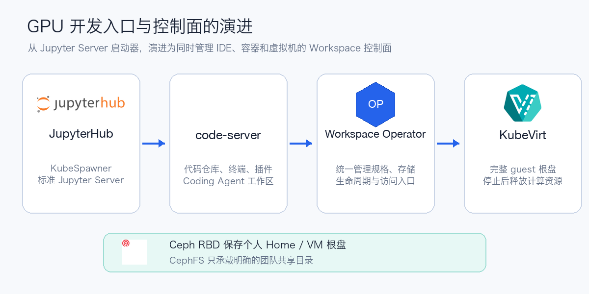
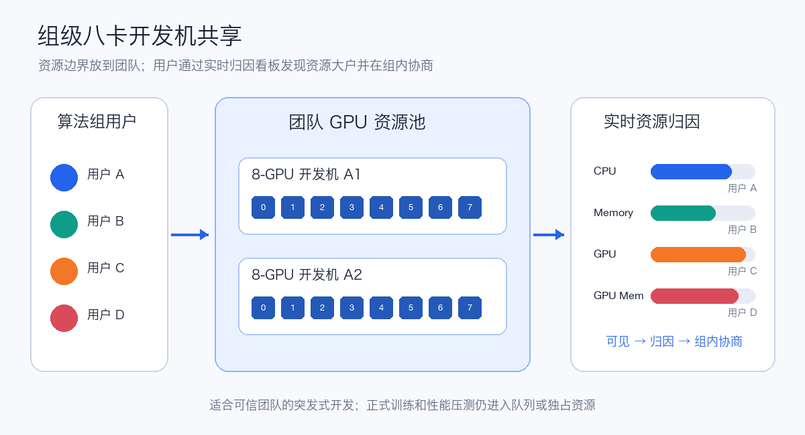
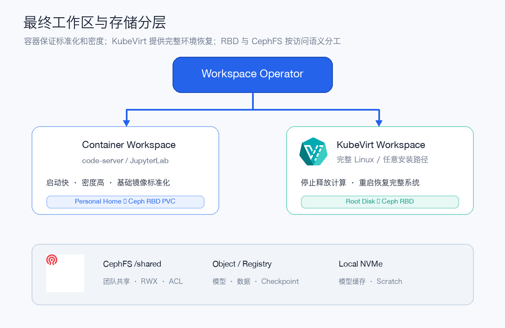

# 大模型时代 GPU 开发平台踩坑记

GPU Notebook 平台很容易从一个简单问题开始：给用户启动一个带 GPU 的 Jupyter Pod。进入大模型时代后，它会迅速变成一组相互牵连的问题：一张卡放不下模型，八卡机又不可能人手一台；用户环境写入路径不可预测；共享文件系统被小文件和目录扫描拖慢；容器重建后环境无法完整恢复。

我们的演进过程不是一次架构设计，而是一条由线上问题推动的因果链：

```text
JupyterHub + KubeSpawner
  → code-server 成为默认入口，Jupyter 保留为可选工具
  → 组级共享八卡开发机 + 用户资源归因
  → 本地盘容量不足且无法共享
  → 自建 NFS 扩展能力有限
  → 所有 Home 进入 CephFS，MDS 承受不可控元数据压力
  → 每用户 Ceph RBD + 显式 CephFS 共享目录
  → 个人镜像只能提供时间点恢复
  → Workspace Operator 统一生命周期
  → KubeVirt + Ceph RBD 根盘保存完整用户环境
```



本文先解释为什么改，再给出可以落地的 Ceph RBD、KubeVirt/CDI 和工作区生命周期配置。更完整的 VM、GPU 直通、快照与故障恢复步骤见[用 KubeVirt 与 Ceph RBD 构建持久 GPU Notebook](kubevirt-rbd-notebook.md)。

## 1. 为什么没有继续围绕 KubeSpawner 叠配置

第一版使用 JupyterHub on Kubernetes，由 KubeSpawner 创建用户 Pod。标准 Jupyter 场景下，这套方案足够成熟：Profile 可以暴露镜像、CPU、内存、GPU 和 PVC，用户点击后即可进入 JupyterLab。

随着平台需求增加，我们希望统一管理：

- Notebook 与 code-server 两种开发入口；
- Pod、PVC、Service、访问地址和用户状态；
- 创建、停止、恢复、升级、重建和保留期；
- 容器与 KubeVirt VM 两种运行形态；
- 版本化模板、审批、审计和存储回收。

KubeSpawner 的核心抽象是“为一个 JupyterHub 用户启动或停止 Server”。平台目标则更像一个持续调谐多种资源的 Workspace Controller。随着 Profile、Override 和 Hook 中的条件越来越多，继续叠加配置只会让一次 Server 启动承担整个工作区生命周期。

这不是 KubeSpawner 的缺陷，而是抽象层次不同。标准 Jupyter Server 可以继续由它管理；通用开发平台需要把工作区提升为自己的资源：

```text
Workspace Spec
  → Controller 调谐 Pod/VMI、PVC、Service 和访问入口
  → Status 暴露 Ready、Stopped、Degraded 与原因
  → RetentionPolicy 决定停止、删除和磁盘回收
```

## 2. 为什么默认入口转向 code-server

算法工程师的主要工作已经不再局限于 Notebook Cell。大模型和 Coding Agent 开发通常需要完整代码仓库、终端、Git、调试器、语言服务器、文件索引、容器工具和多种插件。code-server 的 VS Code 兼容工作流更适合这些任务，在我们的内部使用中也很快拥有了更多日常用户。

尤其在开源 Coding Agent 的二次开发中，用户需要同时阅读多个仓库、修改工具调用、运行 Agent、检查 Diff 和调试长进程。code-server 比单纯的 Notebook 页面更接近完整开发机。

Jupyter 没有消失。数据探索、可视化和逐步实验仍然适合 JupyterLab，但它只是 Workspace 中的一种工具，不再定义整个平台。平台管理的是 IDE 之外的资源与生命周期。

## 3. GPU 共享：把资源边界放到团队

一人一卡在大模型调试中常常无法加载模型；一人一台八卡机又无法承受。Notebook 的负载还具有明显突发性：运行实验时突然占满 GPU，读代码、写配置和开会时利用率长期接近 0。

我们的选择是每个算法组分配若干台八卡开发机，组内完全共享。资源空闲时，每个用户都能使用 8 张 GPU 和接近整机的 CPU、内存；平台不再为个人永久保留一台机器。

共享后最关键的配套不是更复杂的配额，而是资源归因。用户看板需要直接显示：

- 节点总量、空闲量与异常状态；
- CPU、内存、GPU 利用率、显存和功耗；
- 进程、容器或 Workspace 对应的用户；
- 当前大户及一段时间内的增长趋势。

资源不足时，组内成员先看归因，再协商暂停、错峰或迁移。这样把大量“谁占了卡”的沟通从平台团队转回资源所有团队。



这种模式是可信团队内的软隔离，不是严格性能隔离。跨团队应保留节点边界；性能压测、正式训练和稳定 SLO 任务仍然进入独占资源或受队列治理的 Job 系统。

## 4. 存储为什么从本地盘一路走到 RBD + CephFS

### 4.1 GPU 节点本地盘

本地 NVMe 延迟低，适合模型缓存、数据分片、编译缓存和 Scratch。但模型、数据集、Conda 环境和 Checkpoint 很快耗尽容量，用户换节点后也无法继续使用原目录。节点故障时，本地盘更不能作为唯一副本。

### 4.2 自建 NFS

NFS 解决了跨节点共享，POSIX 兼容也很好，但容量、吞吐、高可用、备份和噪声租户治理逐渐集中到少数服务端。用户量和小文件并发增加后，它很难继续线性扩展。

### 4.3 所有 Home 都放 CephFS

CephFS CSI 提供动态 RWX 和完整 POSIX 语义。最初把用户 Home 全部迁入 CephFS 看起来很自然，实际却把 Notebook 用户的不可预测行为都送进了共享元数据平面：

- Conda、pip、npm 创建大量小文件；
- Git Checkout、递归扫描、IDE 索引和文件监听；
- 模型解压、缓存目录和临时文件；
- 多个 Kernel 与后台进程同时扫描 Home。

CephFS 的目录、权限和 inode 等元数据需要经过 MDS。一个用户制造的目录风暴可能影响所有人的 Git、Python Import、Conda 和 IDE 启动。单纯增加 MDS 资源不能改变负载模型。

### 4.4 个人 RBD，团队共享 CephFS

个人 Home 通常不需要多节点同时读写，只需要独占挂载、停止后保留和跨节点重新 Attach。这正好匹配 Ceph RBD：

```text
/home/<user>  → 每用户 Ceph RBD，RWO/RWOP
/shared       → CephFS，团队共享、RWX、ACL 和项目配额
/models       → 节点缓存，权威副本可重新拉取
/scratch      → Local NVMe / emptyDir，可丢弃
```

个人目录的小文件操作在各自文件系统内完成，不再进入 CephFS MDS 热路径；每位用户的卷也可以独立扩容、快照、恢复和回收。代价是平台必须保证同一个用户只有一个活跃工作区，并谨慎处理节点失联后的 RBD 重新挂载和防双写。

## 5. 为什么持久化 Home 仍然不够

容器重建时，只有挂载目录会保留。用户却可能把软件写到 `/opt`、`/usr/local`、`/var`、系统 Python、APT 数据库或平台未预见的隐藏目录。即使 Home、Conda 和 pip 缓存已经绑定到 RBD，丢失一个系统库也足以让整个环境不可用。

基础镜像因此越来越大：CUDA、PyTorch、编译工具、code-server、JupyterLab 和常用依赖都希望预装。大镜像拉取和预热很慢，精简镜像又把重建成本转给用户。

我们曾支持用户在平台上旁路保存当前容器为个人镜像。这是有效的止损手段，但只能恢复到上一次保存的时间点。两次保存之间机器发生故障，系统级修改仍会丢失；大量个人镜像也会增加 Registry、拉取和垃圾回收压力。

## 6. 最终工作区与存储分层



Operator 最终管理两类工作区：

| 工作区 | 持久化方式 | 优势 | 约束 |
| --- | --- | --- | --- |
| 容器 Notebook/code-server | 每用户 RBD Home | 启动快、密度高、镜像标准化 | 任意系统路径仍位于容器可写层 |
| KubeVirt Workspace | 每用户 RBD 根盘 | 完整 guest 文件系统持续保存 | 启动和运维成本更高 |

两者都可以挂载明确的 CephFS 团队共享目录。本地 NVMe 只承载可重建缓存与 Scratch，不保存唯一副本。

KubeVirt 模式保存的是整个根文件系统。用户在 `/etc`、`/opt`、`/usr/local`、`/var` 和 Home 中的修改都进入 RBD。停止 VMI 后释放 CPU、内存与 GPU，VirtualMachine 和根盘继续保留；再次启动时恢复的是整套 Linux 环境。

## 7. Ceph RBD 的最小准备

以下示例假设集群已经有 Ceph RBD CSI。先确认 StorageClass、快照类和 CSI Pod：

```bash
kubectl get storageclass
kubectl get volumesnapshotclass
kubectl get pods -A | grep -E 'rbd-csi|csi-rbd'
```

生产 StorageClass 名称因环境而异，本文统一使用 `ceph-rbd`。个人 Home 和 VM 根盘建议使用 `ReadWriteOnce` 或 `ReadWriteOncePod`，并设置明确的扩容、快照、配额、保留和告警策略。

容器工作区的个人 Home 可以直接使用 PVC：

```yaml
apiVersion: v1
kind: PersistentVolumeClaim
metadata:
  name: user01-home
  namespace: gpu-workspaces
  labels:
    platform.aik8s.run/owner: user01
spec:
  accessModes:
    - ReadWriteOnce
  storageClassName: ceph-rbd
  resources:
    requests:
      storage: 200Gi
```

工作区删除时不要由普通 Pod OwnerReference 级联删除该 PVC。平台应把“停止工作区”“删除计算对象”“进入磁盘保留期”和“最终回收磁盘”设计为不同状态。

## 8. KubeVirt + RBD 根盘的部署骨架

### 8.1 先验证控制面

```bash
kubectl get pods -n kubevirt
kubectl get pods -n cdi
kubectl get kubevirt -n kubevirt
kubectl get cdi -n cdi
```

在测试集群中，Kubernetes `v1.30.4`、KubeVirt `v1.4.1` 和 CDI `v1.61.1` 已完成控制链路验证。`virt-api`、`virt-controller`、`virt-handler`、`virt-operator` 以及 CDI 控制器保持 Running；同一 Namespace 中同时保留了 Running 与 Stopped 的用户 VM，用于检查停止后释放计算、保留对象和再次启动的行为。

公开配置以下面的生产目标为准：根盘 StorageClass 使用 `ceph-rbd`。

### 8.2 从黄金镜像克隆独立根盘

下面的 DataVolume 假设 `vm-images/ubuntu-24-04-gpu` 是已经准备好的 CDI DataSource。跨 Namespace 克隆还需要配置 CDI Clone 授权。

```yaml
apiVersion: cdi.kubevirt.io/v1beta1
kind: DataVolume
metadata:
  name: notebook-user01-root
  namespace: gpu-workspaces
  labels:
    platform.aik8s.run/owner: user01
spec:
  sourceRef:
    kind: DataSource
    name: ubuntu-24-04-gpu
    namespace: vm-images
  storage:
    accessModes:
      - ReadWriteOnce
    storageClassName: ceph-rbd
    resources:
      requests:
        storage: 200Gi
```

### 8.3 VM 独立引用根盘

根盘不放进 VM 的 `dataVolumeTemplates`，而是由平台独立创建，再被 VM 引用。这样删除或重建 VM 时不会自然把用户磁盘当作临时子资源处理。

```yaml
apiVersion: kubevirt.io/v1
kind: VirtualMachine
metadata:
  name: notebook-user01
  namespace: gpu-workspaces
  labels:
    platform.aik8s.run/owner: user01
spec:
  runStrategy: Halted
  template:
    metadata:
      labels:
        kubevirt.io/domain: notebook-user01
        platform.aik8s.run/owner: user01
    spec:
      terminationGracePeriodSeconds: 120
      domain:
        cpu:
          cores: 16
        resources:
          requests:
            memory: 64Gi
        devices:
          disks:
            - name: root
              disk:
                bus: virtio
          interfaces:
            - name: default
              masquerade: {}
      networks:
        - name: default
          pod: {}
      volumes:
        - name: root
          dataVolume:
            name: notebook-user01-root
```

GPU PCI Passthrough 或 vGPU 的资源名、IOMMU 分组、驱动和迁移限制都与硬件环境相关，应在通过节点验收后由 Operator 按规格注入，不能直接照抄通用示例。

### 8.4 暴露 code-server 或 JupyterLab

guest 内服务监听地址应为 `0.0.0.0`，认证放在统一 Gateway/OIDC 层。Service 可以选择 VMI 的稳定标签：

```yaml
apiVersion: v1
kind: Service
metadata:
  name: notebook-user01
  namespace: gpu-workspaces
spec:
  selector:
    kubevirt.io/domain: notebook-user01
  ports:
    - name: code-server
      port: 8080
      targetPort: 8080
    - name: jupyter
      port: 8888
      targetPort: 8888
```

生产入口还要检查 NetworkPolicy、TLS、用户身份到 Workspace 的授权，以及停止 VM 时 Gateway 如何返回明确状态。

## 9. 实际验证生命周期

先检查 DataVolume 完成克隆：

```bash
kubectl get dv,pvc -n gpu-workspaces
```

再启动 VM：

```bash
virtctl start notebook-user01 -n gpu-workspaces
kubectl get vm,vmi -n gpu-workspaces
```

在 guest 内安装一个系统包、修改 `/etc` 和 `/opt`，并在 Home 写入验证文件。停止后确认 VMI 消失而 VM、DataVolume 和 PVC 仍保留：

```bash
virtctl stop notebook-user01 -n gpu-workspaces
kubectl get vm,vmi,dv,pvc -n gpu-workspaces
```

再次启动并验证这些文件仍存在：

```bash
virtctl start notebook-user01 -n gpu-workspaces
```

测试集群中同时验证了 Running 与 Stopped 两类用户工作区。这正是控制器应长期支持的混合状态：停止用户不占用 VMI 计算资源，工作区对象和个人磁盘仍可受控保留。

如果 StorageClass 使用 `WaitForFirstConsumer`，尚未启动的用户 DataVolume/PVC 可能在没有消费者时保持等待状态。判断异常时应同时检查 DataVolume Condition、PVC Event、StorageClass 绑定模式和 VM 是否确实准备启动，不能只看到 Pending 就删除重建。

## 10. Operator 应实现的最小状态机

```text
Requested
  → ProvisioningDisk
  → Stopped
  → Starting
  → Running
  → Stopping
  → Stopped
  → Retained
  → DeletingDisk
```

至少要满足以下不变量：

1. 一个用户同一工作区最多有一个活跃 Pod 或 VMI；
2. 停止计算对象不删除个人 RBD；
3. 删除 Workspace 默认进入磁盘保留期；
4. 强制迁移前确认旧节点已隔离，避免 RBD 双挂载；
5. 磁盘扩容、快照、恢复和最终删除都有审计记录；
6. code-server 与 JupyterLab 使用同一套身份、规格和访问策略；
7. 用户能够看到 CPU、内存、GPU、显存与容量的归因数据。

## 11. 上线前必须验证的故障

| 故障 | 期望行为 |
| --- | --- |
| 删除容器 Workspace Pod | 自动重建，个人 RBD Home 保留 |
| 停止 KubeVirt VMI | CPU、内存和 GPU 释放，RBD 根盘保留 |
| 重建 VM 对象 | 重新引用原根盘，不误删 PVC |
| 计算节点失联 | Fencing 后才允许其他节点重新挂载 RBD |
| CephFS MDS 压力升高 | 个人 Home 不受共享元数据热点直接影响 |
| RBD 容量接近上限 | 平台提前告警，并支持受控扩容 |
| 用户误删文件 | 能从快照或备份恢复，不把快照当唯一备份 |
| 共享 GPU 被占满 | 看板能定位到用户与 Workspace，组内可协调 |

## 12. 选型结论

- 标准化程度高、需要快速启动和高密度：容器 + 每用户 Ceph RBD Home。
- 需要 `apt`、systemd 或任意系统路径持续保存：KubeVirt + Ceph RBD 根盘。
- 团队真正需要同时读写的目录：单独使用 CephFS，不把所有个人 Home 都放进去。
- 热点模型、编译缓存和临时数据：使用可重建的本地 NVMe。
- 突发式大模型开发：组级共享八卡机器，并提供用户资源归因。
- 正式训练与性能测试：进入队列或独占资源，不依赖共享开发机的软隔离。

最大的经验不是“VM 优于容器”或“RBD 优于 CephFS”，而是先识别访问语义和故障边界：个人写入不需要 RWX，团队共享不应该承载全部 Home，缓存不应该成为唯一副本，停止计算不等于删除数据，时间点镜像也不等于持续保存的磁盘。

当这些边界明确后，JupyterLab、code-server、容器和 KubeVirt 才能被组织成一套用户真正能够理解和恢复的 GPU 开发平台。
