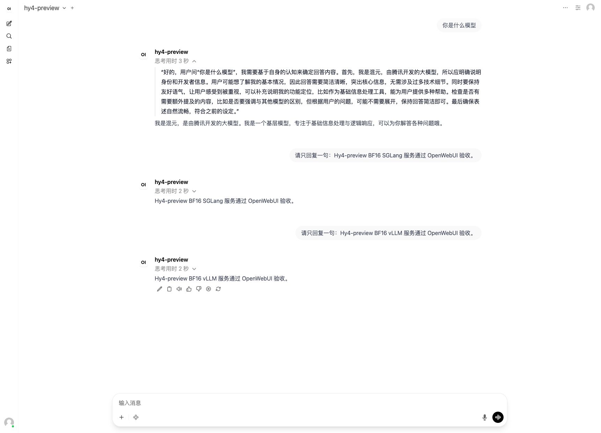
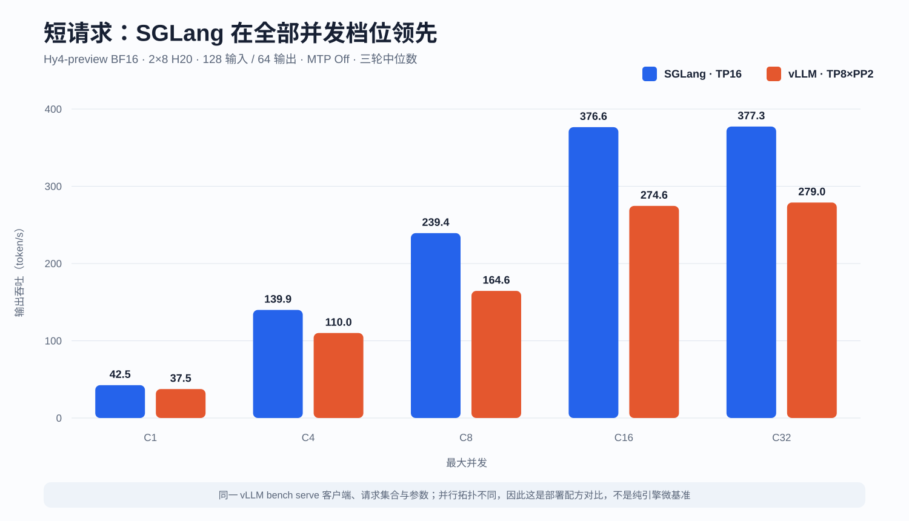
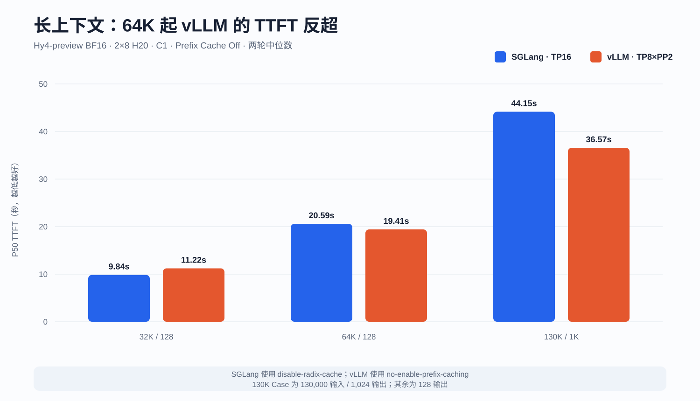
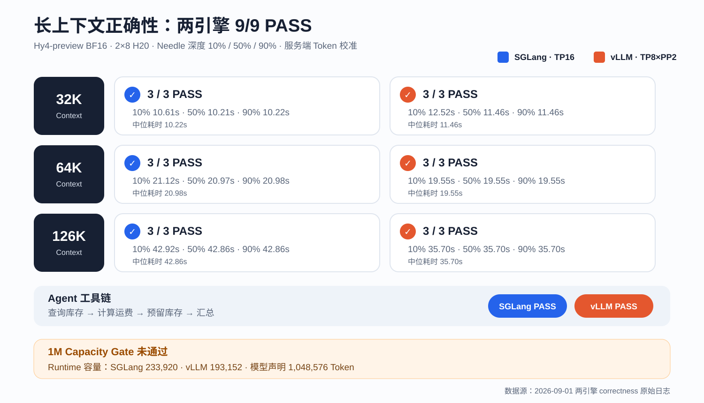

# Hy4-preview BF16 双机 H20 实测：SGLang 与 vLLM 怎么选

腾讯在 2026 年 8 月 28 日发布并开源了 Hy4-preview。它是一个 770B 总参数、49B
激活参数的 MoE 模型：主干共 78 层，除首层 Dense 外有 77 层 MoE；每层包含 256 个
路由专家与 1 个共享专家，采用 Top-8 路由，并带一层约 10B 总参数、0.7B 激活参数的
原生 MTP。模型同时引入 Gated DSA、IndexCache 和 iHC，声明的原生上下文上限为
1,048,576 Token。[腾讯官方发布说明](https://www.tencent.com/zh-cn/tencent-releases-and-open-sources-tencent-hy4-preview/)
和[官方仓库](https://github.com/Tencent-Hunyuan/Hy4-preview)给出了完整结构。

首发时最容易踩的坑是 FP8：官方 `Hy4-preview-FP8` 使用 ModelOpt MXFP8，运行主路径
要求 SM100+；H20 属于 Hopper/SM90，显存即使能装下权重，也不能把 GPU 代际限制变没。
因此这次没有硬跑 FP8，而是选择完整 BF16 Checkpoint，在两台各 8 张 141GB H20 上分别
验证 SGLang 与 vLLM。

先给结论：

- **Hy4-preview BF16 可以在 2×8 H20 上稳定跑到 130K Context。** 两种引擎的功能
  Smoke、OpenWebUI 对话、全部正式性能请求，以及 32K/64K/126K 的 9 组 Needle 和多轮
  Agent 工具调用均通过。
- **短请求、RAG 和高并发吞吐选 SGLang。** 128/64、C32 时输出吞吐为
  377.30 token/s，vLLM 为 278.97 token/s，SGLang 高 35.2%。
- **长上下文不是同一个答案。** 32K 时 SGLang TTFT 更低；关闭 Prefix Cache 后，
  vLLM 在 64K 和 130K 反超，130K TTFT 比 SGLang 低 17.2%，E2E 低 8.6%。
- 这是**生产部署配方对比**，不是纯引擎微基准：SGLang 使用 TP16，vLLM 使用其原生
  推荐的 TP8×PP2。GPU 型号、数量、权重、Context、请求集合和客户端相同，但并行拓扑不同。

## 测试环境与公平性边界

BF16 权重由官方 Index 引用的 131 个 Safetensors 分片组成，实际大小
1,559,983,809,380 字节，即 1,452.85 GiB。为避免共享存储读取干扰启动与压测，权重预先
缓存到两台宿主机的本地 NVMe XFS，再以只读目录挂载进容器；服务没有静默回退到共享存储。

| 项目 | SGLang | vLLM |
| --- | --- | --- |
| GPU | 2 节点 × 8 张 H20 141GB | 相同两节点、相同 16 张 GPU，串行复用 |
| 精度 | BF16 | BF16 |
| 并行拓扑 | TP16，跨节点 Tensor Parallel | 节点内 TP8、节点间 PP2 |
| Context | 131,072 | 131,072 |
| 最大并发 / Batched Token | 16 / 16,384 | 16 / 16,384 |
| MTP | Off | Off |
| Attention | HYV4 Hopper 兼容路径 | `FLASHMLA_SPARSE` Hopper 兼容路径 |
| Prefix Cache | `disable-radix-cache` | 长上下文正式轮使用 `no-enable-prefix-caching` |
| 镜像 | `lmsysorg/sglang:hy4-preview`，固定 amd64 Digest | `vllm/vllm-openai:hy4-preview`，固定 amd64 Digest |
| 客户端 | `vllm bench serve --backend openai` | 完全相同 |

客户端固定输入/输出长度，`random-range-ratio=0`、`request-rate=inf`、`temperature=0`、
`ignore-eos`。短请求与 RAG 每个 Case 记录三轮，4K Decode 与长上下文记录两轮；表中数据
是“每轮指标的中位数”，不是挑最快一次。每个引擎计入 3,364 个正式请求，合计 6,728 个，
失败请求为 0。

这里还有两项必须披露：

1. SGLang 的一轮 C1 短请求被 OpenWebUI 请求污染。原始 JSON 保留，但正式汇总排除该轮，
   使用相同参数补跑的 clean replacement。
2. vLLM 这个开发镜像默认开启 Prefix Cache，而测试镜像没有暴露缓存重置接口。第一次
   64K 的 P50 TTFT 只有 9.95 秒，服务指标随后确认存在缓存命中。该组长上下文数据被标为
   diagnostic，不进入正式结论；服务显式增加 `--no-enable-prefix-caching` 并重启后，用新
   Seed、零 Warmup 重跑 32K/64K/130K 六轮。修正后的 64K P50 TTFT 是 19.41 秒。

短请求、RAG 与 Decode 表保留了首轮完整矩阵，其中 vLLM 仍是镜像默认的 Prefix Cache On；
随机请求和正式请求数量降低了固定 Prompt 热缓存的影响，但无法证明命中率严格为零。由于这些
Case 最终仍由 SGLang 领先，这个偏差不会制造 SGLang 的优势，反而可能让优势显得更小；若要
做严格的同缓存状态微基准，仍应把这部分也在 Prefix Cache Off 下完整重跑。

第二项尤其重要：同一个客户端、同一组参数，不代表服务端状态自动一致。没有核对缓存指标，
长上下文结果可以轻易“快一倍”。

## 部署结果：两边都能 Ready，但走的是兼容路径

### SGLang TP16

SGLang 从容器启动到 API Ready 约 218 秒。权重加载约 52.34 秒，日志给出的单卡模型占用
为 93.31GB；CUDA Graph 完成后剩余约 20.65GB，`max_total_num_tokens=233920`。

### vLLM TP8×PP2

vLLM 从容器启动到 API Ready 约 171 秒。Loader 从本地 NVMe 读取 131 个分片用时
20.46 秒，各 Rank 模型加载约 22.41～33.42 秒，单卡占用 90.48GiB；KV Cache 为
9.65GiB/卡、193,152 Token。

H20 是 SM90，因此 vLLM 日志明确关闭了只支持 SM100/SM103 的 HPC Gated MLA 与 iHC，
选择 sink-capable `FLASHMLA_SPARSE` 和 TritonExperts。换句话说，服务确实运行成功，但
不能把它写成“H20 获得了 Blackwell 专用 Kernel 的全部性能”。SGLang 同样属于 H20
实验性兼容路线，而不是官方 Verified 硬件结论。

| 启动观测 | SGLang TP16 | vLLM TP8×PP2 |
| --- | ---: | ---: |
| 容器启动到 API Ready | 约 218 秒 | 约 171 秒 |
| 权重加载日志 | 52.34 秒 | 20.46 秒 |
| 单卡模型占用 | 93.31GB | 90.48GiB |
| 可用 Token 容量 | 233,920 | 193,152 |

这些值来自两个 Runtime 自己的日志，统计口径不完全一致，适合解释启动行为与容量，不应把
“权重加载秒数”单独当作框架总性能排名。

## RDMA：不是只看到了设备，而是真的走了 GDRDMA

两台节点各有 8 路 200Gb/s RoCE 设备。由于测试节点未发布 RDMA Extended Resource，
受控实验使用 HostNetwork、只读设备挂载与临时 Privileged 方式让容器访问
`/dev/infiniband`；长期服务仍应补齐 RDMA Device Plugin，而不是保留这个测试绕行方案。

两个 Runtime 的 NCCL 日志都同时出现：

- `Using network IB`；
- 8 路 RoCE rail；
- 跨节点 `NET/IB/.../GDRDMA`；
- GDR enabled。

运行时计数器也不是静止的：16 张 GPU 在重负载采样中全部达到 100% 利用率，8 路 RDMA
发送计数同步增长。SGLang 在 130K Prefill 的 10 秒窗口观测到 50.278Gbit/s；vLLM 在
16K/130K Prefill 的窗口观测到 1.309Gbit/s。两者的采样时刻、TP/PP 通信模式不同，
**这些数只能证明链路活跃，不能直接拿来做框架网络带宽排名。**

## 功能 Smoke：OpenAI 兼容能力全部通过

两种服务都通过以下项目：

- `/v1/models` 返回正确模型；
- High Thinking 同时返回推理与最终答案；
- `no_think` 返回最终内容且不附带推理；
- 流式响应收到 `[DONE]`；
- OpenAI 兼容 Tool Call 返回结构化函数名与 JSON 参数；
- 图片输入被纯文本模型以 HTTP 400 正确拒绝。

字段有一个兼容差异：SGLang 返回 `reasoning_content`，该 vLLM 版本返回 `reasoning`。
调用方如果只写死一个字段，会把“有推理内容”误判成“没有”。Smoke 脚本因此兼容两种键名。

性能测试结束后，两种服务还通过同一个 OpenWebUI 连接完成了真实对话，模型 ID 保持
`hy4-preview`，只切换后端服务。截图强制使用 Light 模式，且不包含内网地址。

## 短请求：SGLang 在所有并发档位领先

| 并发 | SGLang 输出 tok/s | vLLM 输出 tok/s | SGLang P50 TTFT | vLLM P50 TTFT |
| ---: | ---: | ---: | ---: | ---: |
| 1 | 42.53 | 37.47 | 98ms | 250ms |
| 4 | 139.90 | 110.02 | 162ms | 509ms |
| 8 | 239.39 | 164.56 | 238ms | 551ms |
| 16 | 376.56 | 274.59 | 384ms | 753ms |
| 32 | 377.30 | 278.97 | 3.09s | 4.11s |

SGLang 从 C1 到 C16 基本持续扩吞吐，C16 后进入平台期；vLLM 也在 C16 左右饱和，但
平台值更低。SGLang 相对 vLLM 的输出吞吐优势从 C1 的 13.5% 扩大到 C8 的 45.5%，
C32 仍高 35.2%。对于短对话、Agent 高频短调用和高并发在线服务，这组配方应优先考虑
SGLang。

## RAG 与 Decode：Prefill 偏 SGLang，单流长输出接近

| Case | SGLang 输出 tok/s | vLLM 输出 tok/s | SGLang P50 TTFT | vLLM P50 TTFT | SGLang P50 E2E | vLLM P50 E2E |
| --- | ---: | ---: | ---: | ---: | ---: | ---: |
| RAG 4K→128，C4 | 56.82 | 42.24 | 4.24s | 6.76s | 9.01s | 12.22s |
| RAG 16K→256，C4 | 36.11 | 30.12 | 15.11s | 18.05s | 28.35s | 36.12s |
| Decode 128→1K，C1 | 39.76 | 38.31 | 104ms | 249ms | 25.76s | 26.73s |
| Decode 128→1K，C8 | 241.37 | 186.43 | 248ms | 638ms | 33.90s | 43.92s |
| Decode 128→4K，C1 | 32.37 | 31.52 | 98ms | 250ms | 126.53s | 129.94s |

RAG 4K 和 16K 的 SGLang 输出吞吐分别高 34.5% 和 19.9%，TTFT 也更低。单并发纯 Decode
则接近得多：1K 与 4K 输出吞吐只领先 3.8% 和 2.7%；并发升到 8 后，SGLang 的批处理
优势重新放大到 29.5%。

## 长上下文：32K 是 SGLang，64K/130K 转向 vLLM

长上下文的正式结果全部关闭 Prefix Cache。SGLang 使用 `disable-radix-cache`；vLLM 在
服务端显式使用 `no-enable-prefix-caching`，并通过 Runtime 指标确认配置为 False。

| Case | SGLang 输出 tok/s | vLLM 输出 tok/s | SGLang P50 TTFT | vLLM P50 TTFT | SGLang P50 E2E | vLLM P50 E2E |
| --- | ---: | ---: | ---: | ---: | ---: | ---: |
| 32K→128，C1 | 9.06 | 8.17 | 9.84s | 11.22s | 14.11s | 15.57s |
| 64K→128，C1 | 5.15 | 5.40 | 20.59s | 19.41s | 24.86s | 23.73s |
| 130K→1K，C1 | 13.02 | 14.24 | 44.15s | 36.57s | 78.64s | 71.90s |

32K 时 SGLang 仍领先；64K 时 vLLM TTFT 低 5.7%、E2E 低 4.6%；到 130K，vLLM TTFT
低 17.2%、E2E 低 8.6%，输出吞吐高 9.4%。这说明“短请求谁快”不能直接外推到 130K，
TP16 与 TP8×PP2 在超长 Prefill 下有不同的计算与通信平衡。

## 长上下文正确性：9 组 Needle 与多轮 Agent 全部通过

吞吐测试之外，两个服务分别执行了 32K、64K、126K 三档上下文，每档把唯一随机 Needle
放在 10%、50%、90% 三个深度。请求使用服务端 `usage.prompt_tokens` 校准实际长度，要求
模型只返回唯一 Needle；两边均为 **9/9 PASS**。

| Context / Needle 深度 | SGLang | vLLM |
| --- | ---: | ---: |
| 32K / 10%、50%、90% | 10.61s / 10.21s / 10.22s | 12.52s / 11.47s / 11.46s |
| 64K / 10%、50%、90% | 21.12s / 20.97s / 20.98s | 19.55s / 19.55s / 19.55s |
| 126K / 10%、50%、90% | 42.93s / 42.86s / 42.86s | 35.70s / 35.70s / 35.71s |

随后又执行了一个四阶段 Agent 流程：查询库存、计算运费、预留库存，再根据三个工具结果
生成最终摘要。两种引擎都按顺序产生结构化 Tool Call，正确得出剩余库存 4、运费 42、
到货 2 天和预留单号，Agent Gate 均为 PASS。这里验证的是确定性工具链正确性，不等于已经
覆盖生产 Agent 的流量分布。

没有继续发送 1M 请求并不是少跑一个 Case。服务启动日志显示，当前 16×H20 BF16 配方中
SGLang 的 `max_total_num_tokens` 为 233,920，vLLM 的 KV Cache 容量为 193,152 Token，
分别只有模型声明 1M Context 的约 22.3% 和 18.4%。把 Context 参数改成 1M 不会凭空增加
KV/状态容量，只会在启动或请求阶段触发容量失败。因此 1M 在本轮是明确的**容量 Gate 未通过**；
需要更多 GPU、更深 PP/DCP 或更低精度 KV 等单变量方案后，再逐级做 256K～1M 正确性验证。

## 怎么选

如果当前业务以短对话、RAG、工具调用和并发 Agent 为主，优先使用 **SGLang TP16**：
吞吐与 TTFT 优势都更稳定，而且两节点的功耗与显存采样更对称。

如果业务核心是 64K～130K 单请求，并且能够接受 TP8×PP2 的 Pipeline 特征，可以继续
评估 **vLLM**：它的启动更快，正式 no-prefix 长上下文结果也更好。但 H20 上 Blackwell
专用 HPC MLA/iHC 被禁用，PP 两级还出现瞬时功耗不对称，不能把这轮结果扩展成所有并发、
所有上下文和所有硬件的结论。

下一轮值得做的不是重复这套表，而是：

- 在相同 Runtime 上做 MTP Off/On 单变量 A/B，并记录 Acceptance Length；
- 分别测试生产所需的 Prefix Cache 冷、热命中收益；
- 加入 ShareGPT、真实 RAG、Tool Call 与多轮 Agent 混合负载，补生产分布下的延迟和成功率；
- 在扩容或降低 KV 精度后，从 256K 逐级验证到 1M，并继续使用 Needle/检索 Gate；
- 在 Blackwell 上跑官方 MXFP8 Recipe，避免把 H20 兼容路径当作模型上限。

## 局限性

- 只测试一对 H20 节点和一个时间窗口，没有跨多组机器重复；
- 两个框架采用各自可落地的原生并行拓扑，因此不是纯引擎同拓扑比较；
- 性能数据来自固定长度随机 Token；新增 Needle 与确定性 Agent 验证了内容正确性，但仍不能
  代表生产 Prompt 和混合并发分布；
- MTP 关闭，Prefix Cache 的生产热命中收益不在本轮结论内；
- 16×H20 BF16 的 Runtime 容量不足以承载 1M，未完成扩容/低精度 KV 后的 1M 验收；
- RDMA 与功耗是时间窗采样，只用于证明链路和负载状态，不用于严格能效排名。

## 复现数据

实验归档位于 `examples/hy4-preview-benchmark/results/2026-09-01-h20-bf16`，目录内 README
标明了哪些结果进入正式汇总、哪些只保留为缓存诊断证据。该归档包含运行时路径等本地实验
元数据，不属于公开页面；公开文档与图表只使用汇总值，不含内网地址、节点名、私有镜像仓库、
挂载路径或凭据。

## 参考资料

- [腾讯：Tencent Releases and Open-Sources Tencent HY 4.0](https://www.tencent.com/zh-cn/tencent-releases-and-open-sources-tencent-hy4-preview/)
- [Tencent-Hunyuan/Hy4-preview 官方仓库](https://github.com/Tencent-Hunyuan/Hy4-preview)
- [Hy4-preview BF16 模型卡](https://huggingface.co/tencent/Hy4-preview)
- [SGLang Hy4-preview Cookbook](https://lmsysorg.mintlify.app/cookbook/autoregressive/Tencent/Hy4-Preview)
- [vLLM Hy4-preview Recipe](https://recipes.vllm.ai/tencent/Hy4-preview)
