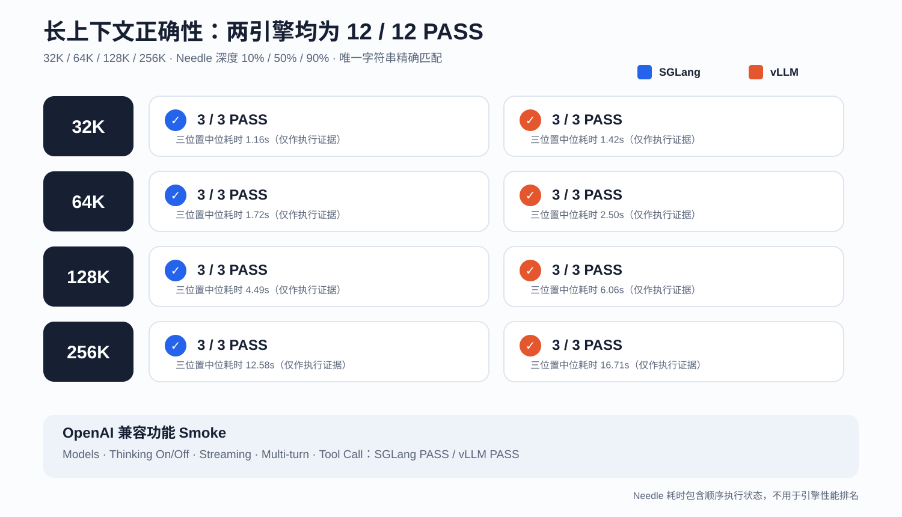
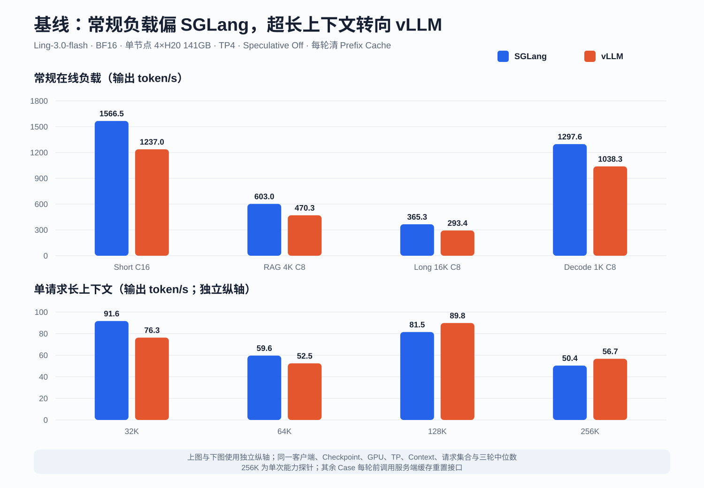
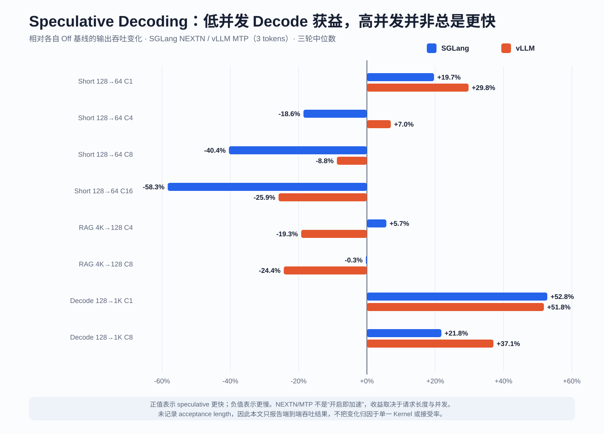

# Ling-3.0-flash BF16 单机 4×H20 实测：SGLang、vLLM 与 MTP 怎么选

Ling-3.0-flash 是 inclusionAI 发布的稀疏 MoE 模型。官方模型卡给出的规模是 124B 总参数、
约 5.1B 激活参数，采用 512 个路由专家、每 Token 激活 8 个专家，并在 256K Context 上训练。
vLLM 的官方 Recipe 将其描述为约 5.5B 激活参数并额外包含 3.1B MTP 参数；两个上游页面的
激活参数口径略有不同，因此本文统一写作“约 5B 激活参数”。模型结构与权重以
[官方模型卡](https://huggingface.co/inclusionAI/Ling-3.0-flash)为准。

这次在单台 4×141GB H20 上部署完整 BF16 权重，分别测试 SGLang TP4 和 vLLM TP4，完成
功能 Smoke、固定长度压力测试、32K～256K Needle 正确性验证，并对 SGLang NEXTN 与
vLLM MTP 做相同工作负载的单变量 A/B。

先给结论：

- **常规在线负载优先 SGLang。** 在短请求 C1～C16、4K RAG C4/C8、16K 输入 C4/C8
  和 1K Decode C1/C8 的十组对比中，SGLang 输出吞吐全部领先，幅度为 13.7%～36.5%。
- **超长上下文不能沿用短请求结论。** SGLang 在 32K、64K 输出吞吐领先 20.1%、13.7%；
  到 128K、256K，vLLM 反超 10.2%、12.6%。vLLM 的低并发 TTFT 也通常更低。
- **两个引擎都通过 256K 正确性 Gate。** 32K、64K、128K、256K 各三个 Needle 深度，
  两边均为 12/12 PASS；thinking、关闭 thinking、流式、多轮和 Tool Call 也全部通过。
- **Speculative decoding 不应全局默认开启。** NEXTN/MTP 在长输出、低并发 Decode 上带来
  约 52% 提升，但在高并发短请求和部分 RAG Case 中会明显回退，应按流量类型拆分路由。

## 测试环境与公平性边界

| 项目 | SGLang | vLLM |
| --- | --- | --- |
| GPU | 单节点 4×H20 141GB | 相同规格的单节点 4×H20 141GB |
| 权重 / 精度 | Ling-3.0-flash / BF16 | 相同 |
| 并行拓扑 | TP4 | TP4 |
| 最大 Context | 262,144 | 262,144 |
| Runtime | `0.0.0.dev1+g0e5e40d8f` | `0.28.1rc1.dev278+g73029d424` |
| 镜像 | `lmsysorg/sglang@sha256:687b721a…a4891f2` | `vllm/vllm-openai@sha256:38226e33…558183b` |
| 基线 Speculative | Off | Off |
| A/B 模式 | NEXTN，3 steps / 4 draft tokens | MTP，3 speculative tokens |
| Prefix Cache | 开启；每轮正式测试前清空 | 开启；每轮正式测试前清空 |
| 客户端 | `vllm bench serve --backend openai` | 完全相同 |

权重从共享只读存储直接加载，结果写到节点本地临时盘后回收，不把压测输出写回共享存储。
两个引擎使用相同 Case、输入输出长度、随机种子、客户端和重复次数；固定
`request-rate=inf`、`random-range-ratio=0`、`temperature=0` 和 `ignore-eos`。除 256K
能力探针为一轮外，其余正式性能 Case 均记录三轮，表中报告“每轮指标的中位数”，不是挑最快
一次。四组配置共计 9,022 个成功请求，失败请求为 0。

这仍然是**可落地部署配方对比**，不是把框架差异完全隔离的纯 Kernel 微基准。两个 Runtime
使用各自的调度器、Attention/通信实现和开发版本；结论只适用于本文明确给出的硬件、版本与参数。

## 部署兼容性：vLLM 需要 nightly，并关闭 Custom All-Reduce

SGLang 使用针对 Ling 的开发镜像即可原生识别模型。vLLM 稳定镜像在预检阶段无法原生识别
`BailingMoeV3ForCausalLM`，正式测试改用固定 Digest 的 nightly；这与
[vLLM 官方 Ling-3.0-flash Recipe](https://github.com/vllm-project/recipes/pull/743/files)
要求 nightly 的说明一致。

在本轮 H20 环境中，vLLM 默认 Custom All-Reduce 初始化触发 CUDA `invalid argument`，
增加 `--disable-custom-all-reduce` 后稳定启动。为了让两边都能在正式轮次前清理 Prefix Cache，
vLLM 还开启了开发模式并验证缓存重置接口返回成功。早期不兼容或未完成缓存重置的诊断轮次均未
计入正式性能结果。

## 功能与长上下文正确性：两个引擎全部通过

两个服务均通过以下 OpenAI 兼容能力：

- `/v1/models` 返回正确模型；
- 默认 thinking 和显式关闭 thinking；
- 流式响应及结束标记；
- 多轮对话；
- 结构化 Tool Call。

随后分别执行 32K、64K、128K、256K 四档上下文，每档把唯一 Needle 放在 10%、50%、
90% 三个位置，要求模型只返回目标字符串。两个引擎均为 **12/12 PASS**。

| Context / Needle 深度 | SGLang | vLLM |
| --- | ---: | ---: |
| 32K / 10%、50%、90% | 3/3 | 3/3 |
| 64K / 10%、50%、90% | 3/3 | 3/3 |
| 128K / 10%、50%、90% | 3/3 | 3/3 |
| 256K / 10%、50%、90% | 3/3 | 3/3 |
| 功能 Smoke | PASS | PASS |

Needle 的耗时只用于证明请求真实执行，不用于框架性能排名：Case 是串行运行，服务状态和缓存
历史无法达到严格对齐。性能结论只使用下文受控的 benchmark 数据。

## 基线性能：常规负载 SGLang 全部领先

| Case | SGLang 输出 tok/s | vLLM 输出 tok/s | SGLang P50 TTFT | vLLM P50 TTFT | SGLang 相对吞吐 |
| --- | ---: | ---: | ---: | ---: | ---: |
| Short 128→64，C1 | 205.31 | 180.61 | 102ms | 60ms | +13.7% |
| Short 128→64，C4 | 541.27 | 447.70 | 193ms | 138ms | +20.9% |
| Short 128→64，C8 | 908.74 | 743.59 | 201ms | 224ms | +22.2% |
| Short 128→64，C16 | 1,566.51 | 1,237.04 | 204ms | 241ms | +26.6% |
| RAG 4K→128，C4 | 470.41 | 345.08 | 485ms | 500ms | +36.3% |
| RAG 4K→128，C8 | 602.98 | 470.27 | 724ms | 829ms | +28.2% |
| Long 16K→256，C4 | 316.47 | 243.32 | 1.21s | 1.54s | +30.1% |
| Long 16K→256，C8 | 365.32 | 293.45 | 2.41s | 2.63s | +24.5% |
| Decode 128→1K，C1 | 290.03 | 212.48 | 101ms | 59ms | +36.5% |
| Decode 128→1K，C8 | 1,297.60 | 1,038.30 | 199ms | 222ms | +25.0% |

SGLang 的优势主要体现在持续吞吐和批处理效率。vLLM 在 C1 Short 与 Decode 的首 Token
更快，但完成 1K Decode 的速度仍落后；延迟敏感业务需要同时看 TTFT、TPOT 与 E2E，不能只
用一个指标选型。

## 32K～256K：128K 后 vLLM 吞吐反超

| Context，128 输出，C1 | SGLang 输出 tok/s | vLLM 输出 tok/s | SGLang P50 TTFT | vLLM P50 TTFT |
| --- | ---: | ---: | ---: | ---: |
| 32K | 91.65 | 76.32 | 1.19s | 1.46s |
| 64K | 59.63 | 52.46 | 1.65s | 1.76s |
| 128K | 81.49 | 89.81 | 1.00s | 664ms |
| 256K | 50.37 | 56.70 | 1.81s | 1.26s |

32K、64K 每轮分别包含多个不同 Needle 位置的请求，所以绝对值不能与 128K/256K 的单请求
Case 直接连成缩放曲线；它们适合在同一行内比较两个引擎。128K 和 256K 的结果表明，超长
Prefill 下 vLLM 的配方开始占优。不过 256K 只有一轮，应该视为能力探针和方向性结果，而不是
稳定容量规划值。

## NEXTN / MTP：Decode 收益明确，高并发短请求可能倒退

| Case | SGLang NEXTN 相对 Off | vLLM MTP 相对 Off |
| --- | ---: | ---: |
| Decode 128→1K，C1 | +52.8% | +51.8% |
| Decode 128→1K，C8 | +21.8% | +37.1% |
| RAG 4K→128，C4 | +5.7% | -19.3% |
| RAG 4K→128，C8 | -0.3% | -24.4% |
| Short 128→64，C1 | +19.7% | +29.8% |
| Short 128→64，C4 | -18.6% | +7.0% |
| Short 128→64，C8 | -40.4% | -8.8% |
| Short 128→64，C16 | -58.3% | -25.9% |

两种实现的共同规律很清楚：输出越长、并发越低，Speculative 越容易摊薄验证成本；输出很短
且并发很高时，额外 Draft/Verify 调度反而成为负担。推荐至少拆成两类服务：长输出 Agent 或
生成任务启用 NEXTN/MTP，短对话与高并发 RAG 保持 Off，再由网关按请求特征路由。生产启用前
还应补采 Acceptance Length、GPU 利用率、显存与功耗，避免只优化 token/s。

## 怎么选

- **短对话、RAG、高并发 Agent：** 先选 SGLang 基线配方，吞吐优势最稳定。
- **低并发且极度重视首 Token：** vLLM 值得优先验证，C1 Short/Decode TTFT 更低。
- **128K～256K 单请求：** 本轮 vLLM 更强，但 256K 需要扩大重复次数后再做容量承诺。
- **长输出生成：** 两边都可开启 Speculative；本轮 SGLang NEXTN 的绝对吞吐更高。
- **混合流量：** 不要用一个全局开关，至少按“短输出高并发”和“长输出低并发”分池。

## 局限性

- 每个引擎只测试一台 4×H20 和一个时间窗口，没有跨多组机器重复；
- 数据来自固定长度随机 Token，不代表 ShareGPT、真实 RAG 或生产 Agent 的请求分布；
- 只测试 BF16 TP4，没有覆盖 FP8、不同 TP、量化 KV Cache 或更大并发；
- SGLang 和 vLLM 都是开发/nightly 版本，复现时必须固定镜像 Digest；
- 256K 性能 Case 只执行一轮，结论应视为方向性；
- 未记录 Speculative Acceptance Length、GPU 功耗和完整显存时序，不能做严格能效排名；
- 权重从共享存储直接加载，启动时间没有进入引擎排名。

## 复现数据

公开汇总与正确性证据位于
`examples/ling3-flash-h20/results/2026-09-03-h20-bf16`。目录保留每个正式 Case 的中位数
汇总、功能 Smoke 和 Needle JSONL；逐请求原始响应及运行时日志不进入公开仓库，避免发布生成
内容、内部路径和大量重复数据。图表可由 `examples/ling3-flash-h20/make_report_charts.py`
从这些公开汇总确定性重建。

## 参考资料

- [inclusionAI/Ling-3.0-flash 模型卡](https://huggingface.co/inclusionAI/Ling-3.0-flash)
- [Ling 官方 Cookbook](https://github.com/inclusionAI/ling-cookbook)
- [vLLM Ling-3.0-flash Recipe](https://github.com/vllm-project/recipes/pull/743/files)
