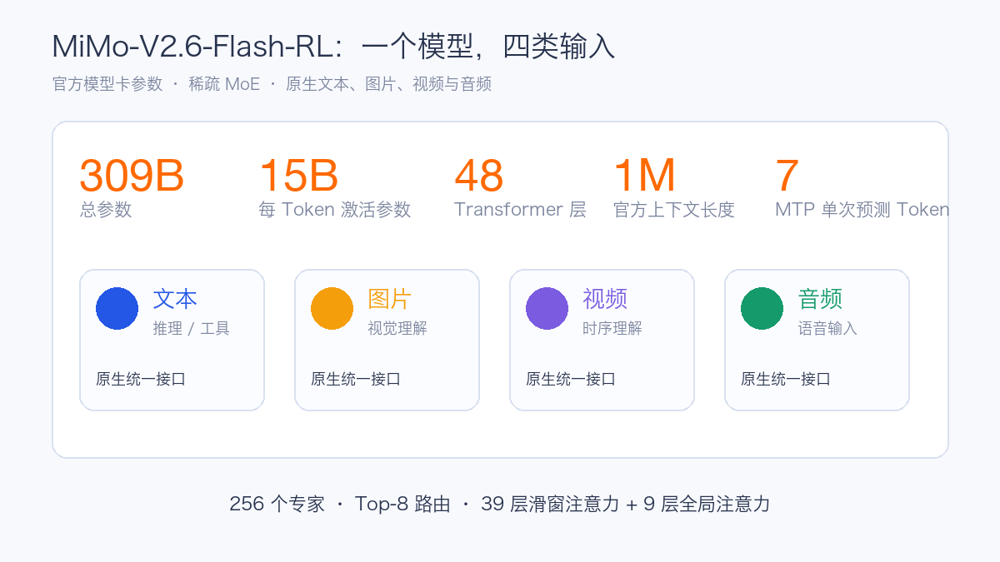
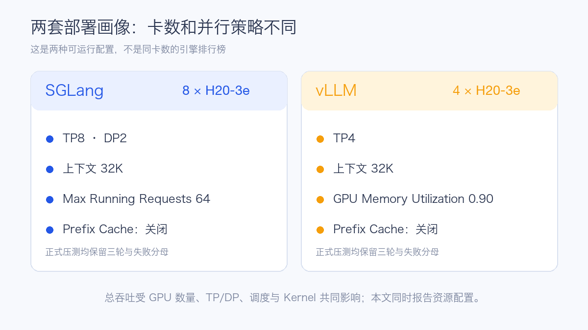
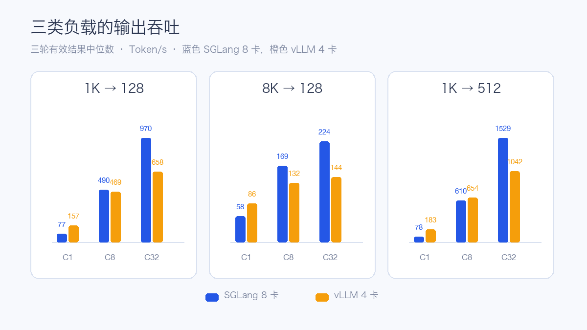
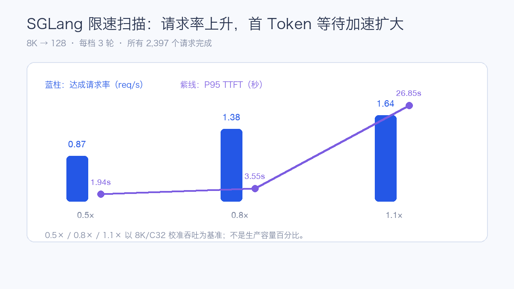
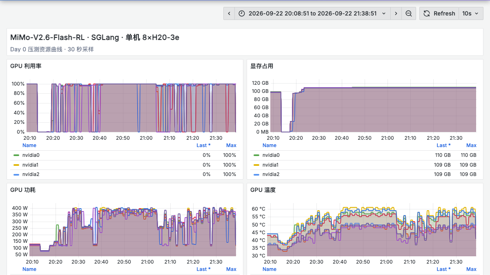
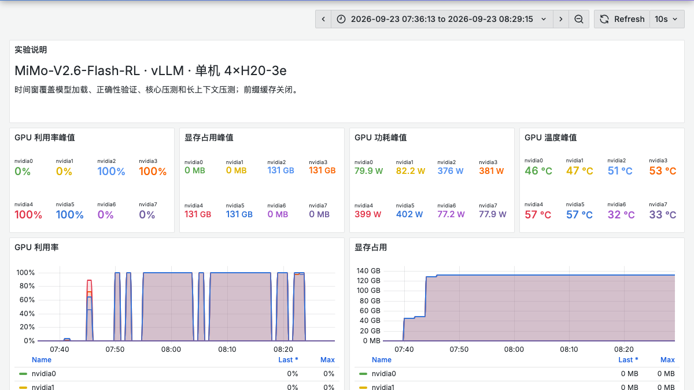
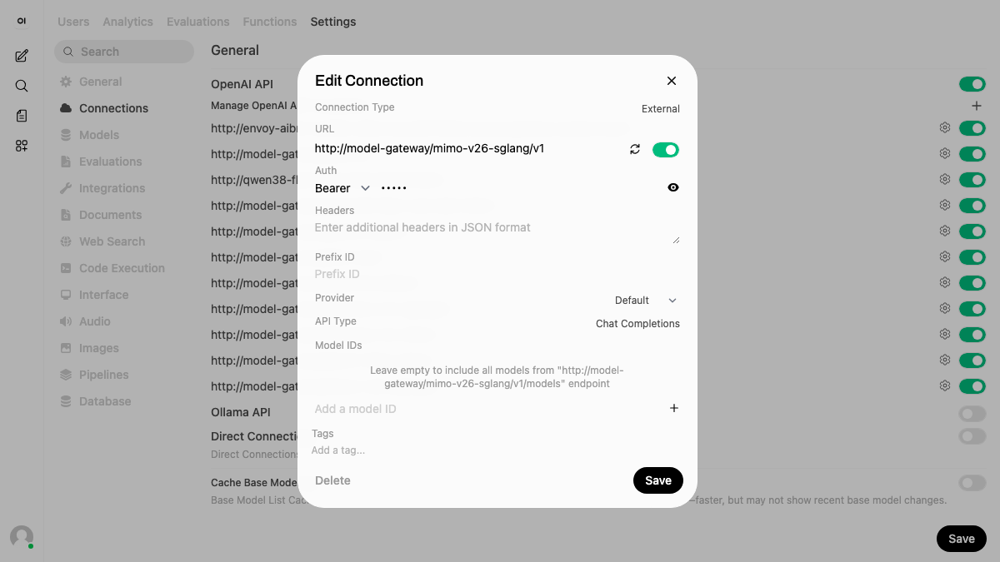

# MiMo-V2.6-Flash-RL Day 0：4 卡与 8 卡 H20-3e 部署实测

## 1. 先认识 MiMo-V2.6-Flash-RL

MiMo-V2.6-Flash-RL 是 XiaomiMiMo 发布的开放权重稀疏混合专家（Mixture of Experts，MoE）模型。官方把它称为兼顾效率的检查点：总参数 **309B**，每个 Token 激活约 **15B** 参数，原生接受文本、图片、视频和音频输入，提供 **1M Token** 上下文窗口，采用 MIT 许可证。[官方模型卡](https://huggingface.co/XiaomiMiMo/MiMo-V2.6-Flash-RL)

对部署影响较大的结构如下：

| 结构 | 官方配置 | 对推理服务的影响 |
| --- | --- | --- |
| 稀疏 MoE | 309B 总参数、15B 激活参数 | 计算量比总参数小，但全部权重仍要存储并参与专家路由 |
| 注意力 | 48 层，其中 39 层滑动窗口注意力、9 层全局注意力 | 短请求、长 Prefill 和长时间 Decode 的瓶颈不同 |
| 专家路由 | 256 个专家、Top-8 | 并行方案、专家调度和通信会改变卡数与吞吐 |
| 多 Token 预测 | 5 层滑动窗口 MTP Drafter，一次预测 7 Token | 引擎需要匹配相应推测解码实现，不能仅凭模型格式判断支持 |
| 视觉与音频 | 681M 视觉编码器；音频 Tokenizer 和 Patch Encoder | 文本服务启动成功以后，仍需分别验证媒体解码、模板和输出语义 |
| 上下文 | 官方 1M Token | 服务上下文由显存、KV Cache、运行时实现和并发共同决定 |

本次服务窗口设为 32,768 Token，最长正式输入为 24,576 Token。官方 1M 能力没有在这轮硬件配置上验证。

## 2. 两套实际跑通的部署画像

本次得到两套可运行配置：SGLang 使用单机 8 张 H20-3e，vLLM 使用单机 4 张 H20-3e。两套配置的卡数、并行策略和运行时实现不同，因此文章报告各自的部署表现和资源密度，不把结果解释成同条件引擎排名。

| 项目 | SGLang | vLLM |
| --- | --- | --- |
| GPU | 1 节点 × 8×H20-3e | 1 节点 × 4×H20-3e |
| 并行 | TP8、DP2、DP Attention、DP LM Head | TP4 |
| 服务上下文 | 32,768 Token | 32,768 Token |
| 最大运行请求 | 64 | 运行时按 32K 和显存预算调度 |
| 显存配置 | `mem-fraction-static=0.65` | `gpu-memory-utilization=0.90` |
| Prefill | Chunked Prefill 16,384 | 引擎默认分块路径 |
| Prefix Cache | 关闭 | 关闭 |
| 工具协议 | MiMo reasoning/tool parser | MiMo reasoning/tool parser |
| MoE Kernel | FlashInfer MXFP4 | 固定支持分支的 MiMo 路径 |

两套容器均申请 64 CPU、512 GiB 内存，GPU 上限分别为 8 卡和 4 卡。模型直接从共享只读存储加载。压测时没有启用前缀缓存，避免重复合成输入因缓存命中改变结果。

## 3. 测量方法

核心矩阵覆盖四类固定长度请求：

| 场景 | 输入 / 输出 Token | 观察重点 |
| --- | ---: | --- |
| 短请求 | 1,024 / 128 | 在线对话的吞吐和排队 |
| 长 Prefill | 8,192 / 128 | 长输入对 TTFT 的影响 |
| 长 Decode | 1,024 / 512 | 连续生成吞吐和 TPOT |
| 长上下文 | 24,576 / 128 | 32K 服务窗口内的边界表现 |

每种长度分别测 C1、C8、C32。C 表示客户端并发上限；C1 每轮 8 个请求，C8 每轮 16 个请求，C32 每轮 64 个请求。每档先预热，再执行三轮正式测试。请求使用固定长度随机合成 Token、`temperature=0` 和 `ignore_eos=true`，性能接口为 OpenAI 兼容 `/v1/completions`。

成功请求必须同时满足 HTTP 成功、非空输出、完整结束标记、有效 usage 和目标输出长度。失败请求保留在原分母；表中吞吐、TTFT、TPOT 是全部有效轮次指标的中位数。若一轮存在失败，它不会进入性能中位数，但完成数仍进入成功率统计。

- **输出吞吐**：成功请求产生的输出 Token ÷ 整轮耗时。
- **TTFT**（Time to First Token）：请求发出到第一个非空输出片段。
- **TPOT**（Time per Output Token）：首个输出片段以后，每个输出 Token 的平均生成时间；表格报告请求级 TPOT 的 P95。
- **E2E**（End-to-End Latency）：从请求开始到完整流结束。

## 4. 文本、工具和视觉先过硬门槛

两套引擎均通过模型 ID、算术、多轮记忆、流式完整性、工具调用、单图和双图顺序验证。性能矩阵开始前还分别执行了长度校准。

部分实际 Prompt 如下：

| 能力 | Prompt / 操作 | 验证点 |
| --- | --- | --- |
| 算术 | `计算 17 加 25，只回答数字。` | 最终答案为 42 |
| 多轮 | `Remember code 482619.` → `What was the code? Reply only with the code.` | 第二轮准确返回 482619 |
| 工具 | `Use get_weather to look up weather in Beijing. Do not invent the weather.` | 工具名、参数及模拟结果回灌正确 |
| 单图 | `Name the main vegetable shown. Reply with one English noun only.` | 官方胡萝卜、玉米样例分别识别正确 |
| 双图 | `Name the main vegetable in each image in order. Reply as two English nouns separated by a comma.` | 交换图片顺序后回答随之变化 |
| 视频 | `List the three background colors in the order they appear.` | vLLM 推理识别蓝、绿、红，256 Token 上限内未生成最终字段 |
| 音频 | `What verification code is spoken? Reply with digits only.` | 当前 vLLM 请求返回不支持的音频文件错误 |

视频样例说明视觉时序信息进入了模型推理，但最终响应因达到输出上限而不满足成功条件；音频接口返回 HTTP 400。图片通过不能替代视频和音频通过，因此本轮公开结论限定为文本、工具和图片能力已验证。

## 5. 核心性能结果

### 5.1 短请求：8 卡总吞吐更高，4 卡资源密度更高

1K/128 的 C32 场景中，SGLang 总输出吞吐为 **970.41 Token/s**，vLLM 为 **657.72 Token/s**。按已分配卡数做简单除法，分别约为 **121.30** 和 **164.43 Token/s/GPU**。这个每卡值描述当前部署画像的资源密度，包含 TP/DP、调度和 Kernel 差异，不等于单卡独立推理性能。

| 输入/输出 | 并发 | SGLang 8 卡 Token/s | vLLM 4 卡 Token/s | TTFT P95 秒：S / V | TPOT P95 毫秒：S / V |
| --- | ---: | ---: | ---: | ---: | ---: |
| 1K/128 | C1 | 76.93 | 156.83 | 0.120 / 0.170 | 12.34 / 5.13 |
| 1K/128 | C8 | 490.27 | 469.43 | 0.588 / 0.872 | 12.05 / 15.66 |
| 1K/128 | C32 | 970.41 | 657.72 | 2.141 / 3.227 | 21.67 / 41.89 |
| 8K/128 | C1 | 57.59 | 85.49 | 0.651 / 0.842 | 12.62 / 5.18 |
| 8K/128 | C8 | 169.39 | 132.02 | 4.477 / 6.405 | 33.65 / 49.37 |
| 8K/128 | C32 | 223.99 | 144.38 | 15.037 / 23.752 | 126.43 / 198.48 |
| 1K/512 | C1 | 78.35 | 183.30 | 0.118 / 0.169 | 12.66 / 5.14 |
| 1K/512 | C8 | 609.87 | 653.82 | 0.539 / 0.874 | 12.29 / 12.00 |
| 1K/512 | C32 | 1,528.83 | 1,042.44 | 1.915 / 3.221 | 18.60 / 28.93 |

vLLM 的 8K/C32 第一轮完成 63/64，后两轮均为 64/64，三轮合计 **191/192**；表中性能中位数只采用两轮完整结果。其余上表各档正式请求全部完成。

核心矩阵记录到的 SGLang 正式请求为 **824/848** 完成，24 个失败都来自 24K/C8；vLLM 为 **1,055/1,056** 完成，唯一失败来自 8K/C32。

### 5.2 长上下文：延迟会在并发下快速放大

| 引擎 | 并发 | 完成/请求 | 输出 Token/s | TTFT P95 | TPOT P95 | E2E P95 |
| --- | ---: | ---: | ---: | ---: | ---: | ---: |
| SGLang 8 卡 | C1 | 24/24 | 36.92 | 1.883 s | 12.70 ms | 3.484 s |
| SGLang 8 卡 | C8 | 8/32 | — | — | — | — |
| SGLang 8 卡 | C32 | 未执行 | — | — | — | — |
| vLLM 4 卡 | C1 | 24/24 | 38.83 | 2.638 s | 5.33 ms | 3.309 s |
| vLLM 4 卡 | C8 | 48/48 | 47.46 | 19.543 s | 137.63 ms | 28.876 s |
| vLLM 4 卡 | C32 | 192/192 | 49.32 | 74.423 s | 592.72 ms | 148.263 s |

SGLang 的 24K/C8 执行了两轮，每轮都只有 4/16 请求完成，随后按阶段保护条件停止，C32 没有执行。vLLM 的 24K/C32 全部完成，但 P95 首 Token 等待约 74.4 秒、完整流约 148.3 秒，已经超出常见交互式应用的等待范围。生产容量应按业务延迟目标限制长输入并发，而不能只看请求最终是否完成。

## 6. SGLang 固定到达率扫描

限速扫描使用 SGLang 8K/128、C32 的 1.7499 req/s 校准点，按 0.5、0.8、1.1 倍形成三档到达率。每档三轮，分别执行 600、756、1,041 个请求，共 **2,397/2,397** 完成。

| 档位 | 达成请求率中位数 | P95 TTFT | P95 TPOT | P95 E2E |
| ---: | ---: | ---: | ---: | ---: |
| 0.5× | 0.866 req/s | 1.939 s | 54.49 ms | 7.821 s |
| 0.8× | 1.379 req/s | 3.554 s | 194.77 ms | 27.141 s |
| 1.1× | 1.644 req/s | 26.851 s | 287.67 ms | 53.107 s |

请求率从 0.8× 增加到 1.1× 时，实际完成速率只增加约 19%，P95 TTFT 从 3.55 秒扩大到 26.85 秒。这个拐点适合用于制定准入和排队上限。三档是相对于本次校准点的实验轴，不代表生产容量百分比。

vLLM 的这轮执行包没有携带共享限速参考，因此该阶段按规则跳过，没有补造与 SGLang 对称的数据。

## 7. GPU 资源曲线

下面是对应正式测试时间窗的真实浅色看板。SGLang 图覆盖 8 卡服务，vLLM 图覆盖 4 卡服务；图中的空档和利用率回落对应阶段切换与服务收尾。

SGLang 的八卡显存稳定在约 109–110 GB，核心阶段各卡利用率均达到 100%，功耗高负载区间约 300–400 W，温度峰值约 60℃。这是 30 秒采样的资源曲线，不能替代更细粒度 Kernel Profile。

vLLM 四卡服务的 GPU 利用率峰值为 100%，显存占用峰值约 131 GB，单卡功耗峰值约 402 W、温度峰值 57℃。截图使用保留的绝对时间窗；标题和说明已移除内部节点地址。

## 8. OpenWebUI 接入

服务按 OpenAI 兼容连接注册到既有 OpenWebUI。下图是连接管理页的真实截图，内部网关地址已在浏览器截图阶段脱敏，线上配置没有被改写。

OpenWebUI 注册只证明入口配置存在。模型 ID、流式结束、最终答案、多模态内容和工具调用仍由 API 自动验收分别检查，不能用界面出现一个模型名代替接口验证。

## 9. 部署建议

1. **先按资源目标选画像。** 4 卡 vLLM 提供了更小的单实例占用和较高的每卡吞吐密度；8 卡 SGLang 在 C32 的短请求和长输出场景取得更高总吞吐。在线业务还应把副本数、排队、故障域和卡价一起纳入容量模型。
2. **4 卡和 8 卡都要检查 GPU 拓扑。** 4 卡应尽量落在同一高速互联域；8 卡 TP8/DP2 还要检查专家通信、GPU Direct 路径和 NCCL 正确性。Kubernetes 只保证分配到指定数量的 GPU，不自动保证最优连接关系。
3. **把 NUMA 本地性纳入验收。** CPU Tokenize、媒体预处理、Pinned Memory 和 Host-to-Device 拷贝会访问主机内存。GPU 互联良好时，跨 NUMA 的 CPU 和内存访问仍可能拖慢 Prefill 与多模态路径。
4. **为长输入建立独立队列。** 24K/C32 的完成不意味着适合交互。按输入长度分层限流，设置最大排队时间和取消机制，避免长 Prefill 占满运行序列。
5. **缓存配置单独建基线。** 本轮关闭 Prefix Cache。若生产流量存在大量相同系统提示词，应另建“缓存开启”画像，报告命中率、显存占用和未命中性能，不与无缓存结果混合。
6. **多模态逐种媒体验收。** 图片、视频和音频具有不同的解码器、模板与输出上限。视频中间推理正确仍可能因输出被截断而失败；音频格式错误应作为客户端或媒体处理问题单独统计。
7. **扩展到 1M 前先做容量阶梯。** 从 32K、64K、128K 逐级验证显存、TTFT、取消请求和并发下降曲线，再决定是否开放更长窗口。
8. **用 SLO 控制入场，而不是追最高 tok/s。** 至少同时监控成功率、TTFT、TPOT、E2E、排队长度、KV Cache 使用率、GPU 利用率和功耗。吞吐进入平台期而 TTFT 快速扩大时，应先限流或扩容。

## 10. 结论

MiMo-V2.6-Flash-RL 已在 H20-3e 上跑通两种有代表性的服务画像。4 卡 vLLM 在较小 GPU 占用下完成了完整核心矩阵，短请求 C32 达到 657.72 Token/s；8 卡 SGLang 在短请求和长输出 C32 分别达到 970.41 和 1,528.83 Token/s，并完成三档固定到达率扫描。

真正影响生产选型的是资源占用、延迟拐点和请求完整性。当前最明确的边界来自 24K 输入：vLLM 能完成 C32，但等待已不适合多数交互应用；SGLang 在 C8 出现稳定失败，后续需要单独定位运行时超时、调度和长 Prefill 路径。文本、工具和图片已经通过，视频和音频仍需针对接口与输出预算继续收敛。

## 参考资料

- [MiMo-V2.6-Flash-RL 模型卡](https://huggingface.co/XiaomiMiMo/MiMo-V2.6-Flash-RL)
- [XiaomiMiMo MiMo-V2-Flash 代码仓库](https://github.com/XiaomiMiMo/MiMo-V2-Flash)
- [SGLang 文档](https://docs.sglang.ai/)
- [vLLM 文档](https://docs.vllm.ai/)

