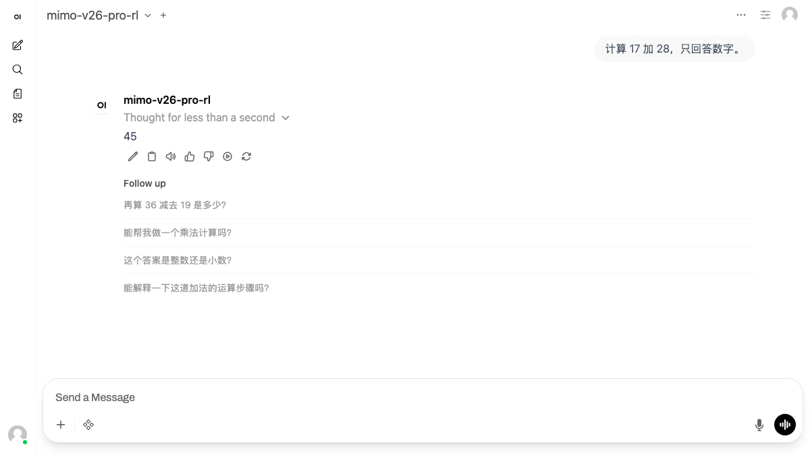
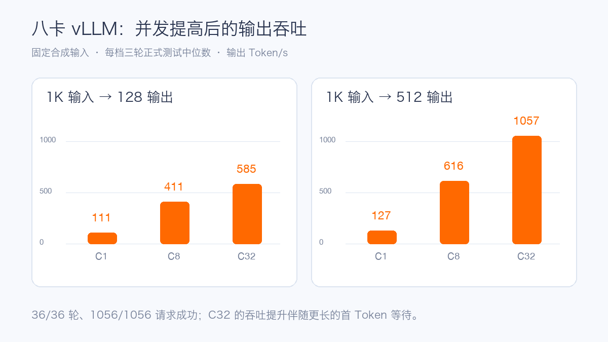

# MiMo-V2.6-Pro-RL 首测：八张 H20-3e 的 vLLM 部署与性能实测

## 先认识 Pro 模型

[MiMo-V2.6-Pro-RL](https://huggingface.co/XiaomiMiMo/MiMo-V2.6-Pro-RL) 是小米 MiMo-V2.6 系列的旗舰开放权重模型，采用稀疏混合专家架构，总参数约 **1.02T**，每个 Token 激活约 **42B** 参数。官方模型卡列出文本、图片、视频、音频输入和 1M Token 上下文能力，采用 MIT 许可证。与 Flash 版本相比，Pro 的权重与每 Token 计算量都显著增加，部署时首先面对的是权重装载、专家路由和大显存通信。

本轮使用的配置有 70 层、384 个路由专家、Top-8 专家选择；主权重含 FP8 与 MXFP4 专家布局。官方还提供多 Token 预测相关权重，但本轮基线没有开启推测解码。模型卡所列 1M 上下文是模型能力，本轮服务窗口固定为 **32,768 Token**，不能把两者等同。

模型副本有 129 个主权重分片，合计约 563.58 GB，另有 MTP 权重。实验沿用已经完成同步与校验的模型副本；启动前按主分片数量、总字节数、配置和临时文件状态复核，没有重复做整套权重哈希。

## 硬件与测试方法

实验选择单节点 **8×H20-3e**、vLLM 张量并行 TP8，模型从共享只读存储加载。正式压测前先完成 8 rank 通信检查、模型 ID、简单算术、多轮记忆、流式结束和 usage 验证。模型服务使用 OpenAI 兼容接口，关闭 Prefix Cache，设置 `gpu-memory-utilization=0.90` 和 32K 服务窗口。压测输入由一段固定英文技术文本重复构造，裁成目标 Token 长度，设置 `temperature=0`、`min_tokens=max_tokens` 和 `ignore_eos=true`；这测量该合成负载下推理系统的容量，不测模型回答质量。

| 配置项 | 实际值 |
| --- | --- |
| GPU | 单节点 8×H20-3e |
| 服务镜像 | `vllm/vllm-openai:mimo-v26`，固定 amd64 镜像 digest `sha256:5d8a6c57…10780c42b` |
| 并行 | Tensor Parallel 8 |
| 模型与上下文 | MiMo-V2.6-Pro-RL；服务窗口 32,768 Token |
| 缓存与显存预算 | Prefix Cache 关闭；`gpu-memory-utilization=0.90` |
| 解析器 | MiMo reasoning parser、MiMo tool-call parser |
| 容器资源 | 请求 64 CPU、512 GiB 主机内存、8 GPU |

| 场景 | 输入 / 输出 Token | 用途 |
| --- | ---: | --- |
| 短请求 | 1,024 / 128 | 交互吞吐与排队 |
| 长输入 | 8,192 / 128 | Prefill 负担 |
| 长输出 | 1,024 / 512 | Decode 能力 |
| 长上下文 | 24,576 / 128 | 32K 窗口内的容量边界 |

每种场景运行 C1、C8、C32 三档并发，每档预热后正式重复三轮。C1 每轮 8 个请求，C8 每轮 16 个请求，C32 每轮 64 个请求。有效请求必须有成功响应、非空输出、完整结束标记、有效 usage 和目标输出长度；失败保留在原分母。表中结果是三轮正式数据的中位数，TTFT 为首个非空 Token 等待时间，TPOT 为首 Token 之后每个输出 Token 的平均时间，E2E 为完整请求耗时。

## vLLM 八卡基线

vLLM 完成 **36/36 轮正式测试，1056/1056 个请求成功**。模型 ID、算术、多轮、流式完整性、工具调用与工具结果回灌均通过；图片验证覆盖两张不同图片及交换顺序后的回答变化。图片通过不等于视频或音频通过：本地模型副本尚无完整的音频 Tokenizer 与 DFlash 文件，本轮没有据此报告音频或推测解码成绩。

现有 OpenWebUI 中也注册了这条 vLLM 服务，从界面发送“计算 17 加 28，只回答数字”，模型返回 45。这个检查覆盖了浏览器、OpenWebUI、跨集群入口到推理服务的完整文本请求链路。

功能验收中的实际 Prompt 例子如下。图片测试分别使用胡萝卜和玉米素材，要求模型只回答主要蔬菜的英文名，再交换两图顺序核对回答顺序。

| 项目 | Prompt 摘录 | 验收点 |
| --- | --- | --- |
| 算术 | `计算 17 加 25，只回答数字。` | 最终答案为 42 |
| 多轮 | `Remember code 482619.`，之后问 `What was the code? Reply only with the code.` | 跨轮返回 482619 |
| 工具 | `Use get_weather to look up weather in Beijing. Do not invent the weather.` | 调用 `get_weather`，收到模拟工具结果后正确回答 |
| 单图 | `Name the main vegetable shown. Reply with one English noun only.` | 对不同图片给出不同主体 |
| 双图 | `Name the main vegetable in each image in order. Reply as two English nouns separated by a comma.` | 交换图片后顺序同步改变 |

| 输入 / 输出 | 并发 | 输出吞吐 Token/s | P95 TTFT | P95 TPOT | P95 E2E |
| --- | ---: | ---: | ---: | ---: | ---: |
| 1K / 128 | C1 | 111.08 | 0.200 s | 7.50 ms | 1.152 s |
| 1K / 128 | C8 | 410.80 | 1.127 s | 17.93 ms | 2.499 s |
| 1K / 128 | C32 | 584.54 | 4.201 s | 46.50 ms | 8.023 s |
| 8K / 128 | C1 | 62.59 | 1.085 s | 7.56 ms | 2.045 s |
| 8K / 128 | C8 | 100.39 | 8.469 s | 71.21 ms | 13.628 s |
| 8K / 128 | C32 | 110.41 | 31.493 s | 264.59 ms | 64.046 s |
| 1K / 512 | C1 | 126.80 | 0.199 s | 7.51 ms | 4.038 s |
| 1K / 512 | C8 | 616.05 | 1.124 s | 12.59 ms | 6.658 s |
| 1K / 512 | C32 | 1,056.94 | 4.194 s | 28.40 ms | 16.417 s |
| 24K / 128 | C1 | 29.46 | 3.351 s | 7.85 ms | 4.346 s |
| 24K / 128 | C8 | 36.35 | 24.772 s | 188.12 ms | 44.268 s |
| 24K / 128 | C32 | 37.94 | 95.952 s | 789.48 ms | 196.213 s |

短请求从 C1 提高到 C32，总输出吞吐约增加 5.3 倍，但 P95 TTFT 从 0.20 秒增长到 4.20 秒。24K 输入达到 C32 时，虽然请求全部完成，P95 首 Token 等待已接近 **96 秒**；在线业务应按延迟目标而非仅按最终成功率决定准入并发。

正式压测时间窗内，八张卡的利用率峰值均为 100%，显存占用峰值约 131 GB/卡，功耗峰值约 364–396 W，温度峰值约 52–65℃。这些是离散采样的曲线和峰值，并非连续采样下的精确能耗。

## 部署建议

八卡是本轮已验证的 vLLM 起点。上线前应检查容器实际获得的 GPU 拓扑与 NCCL 通信，尤其是八卡张量并行下跨 GPU 的激活与专家通信。CPU 侧 Tokenize、视觉预处理和主机到显存的数据拷贝也受 NUMA 本地性影响，建议把 CPU、内存与 GPU 的亲和关系纳入验收。

容量规划要按请求长度分层：1K 对话、8K 检索增强和 24K 长文档的延迟曲线差别明显。生产流量应分别设并发与排队上限，并同时看成功率、TTFT、TPOT、E2E、GPU 利用率与显存。Prefix Cache、推测解码和长于 32K 的上下文需要各自建立新基线，不应直接套用上表。

## 参考资料

- [小米 MiMo-V2.6-Pro-RL 官方模型卡](https://huggingface.co/XiaomiMiMo/MiMo-V2.6-Pro-RL)
