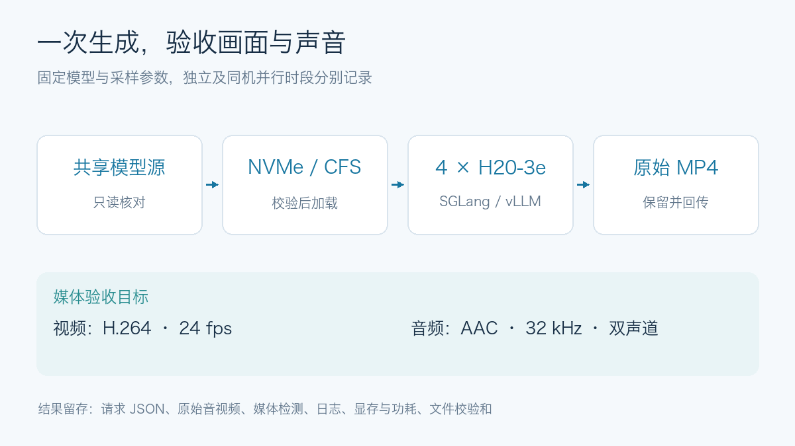
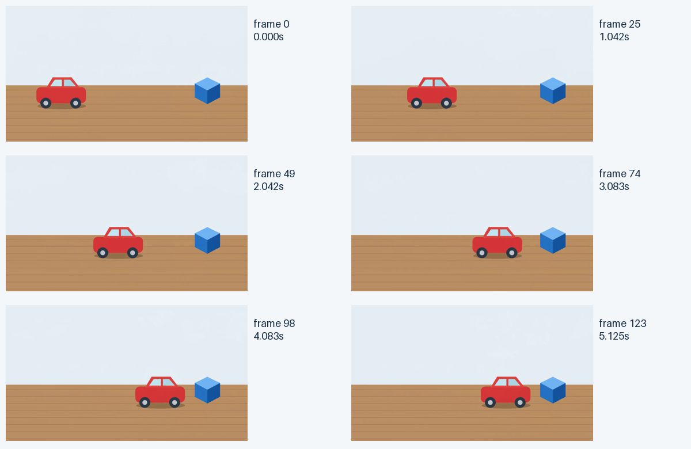
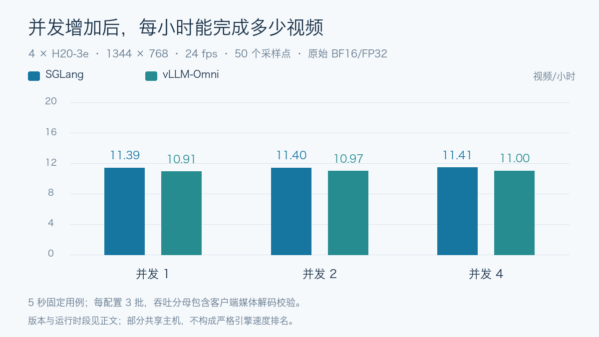
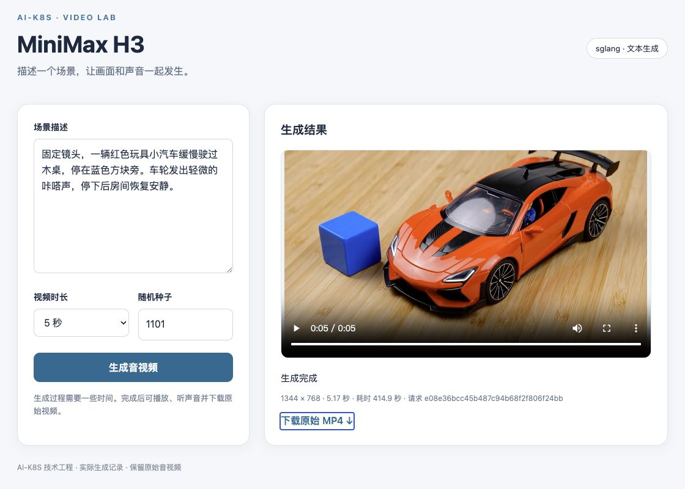

# MiniMax H3 H20-3e 实测：完整音视频生成、双引擎与持久化验收

## 模型介绍：定位、架构与输入输出

MiniMax H3 是 MiniMax 面向多模态内容创作的音视频生成系统，支持文字、图片、视频和音频条件，能够联合生成画面与原生立体声。其生成主干 H3-Omni-Transformer 是 **33B 参数的稠密、单流 Transformer**，H3-Encoder 使用 **Qwen3-VL-32B** 的预训练权重。33B 是生成主干的参数口径，条件编码器、Visual VAE 和 Audio VAE 是独立组件，不能用这一数字直接估计整个系统的显存需求。[官方模型架构](https://huggingface.co/MiniMaxAI/MiniMax-H3#model-architecture)

### 为什么要同时测试画面与声音

H3-Base 将各模态编码后组织为统一序列，由同一个 Omni Transformer 联合预测视频与音频的潜在表示，再交给各自的 VAE 解码。文字和视觉条件会经过 H3-Encoder，视觉内容还通过 Visual VAE 表示，音频则由 Audio VAE 编码。这使参考素材的类型和长度都可能改变工作量；只验证文本生成，不能覆盖有声视频或混合参考的编码路径。

生成主干中约 13B 参数位于 AdaLN 调制分支，官方说明相关调制结果可预计算，因此推理部署不必常驻这部分权重。它是结构层面的优化空间，不代表整套模型只剩约 20B 参数需要加载；是否采用、如何实现还取决于所用运行时。[官方主干说明](https://huggingface.co/MiniMaxAI/MiniMax-H3#h3-omni-transformer)

### 两套任务权重分别解决什么问题

| 分区 | 条件输入与控制目标 | 本文对应实验 |
| --- | --- | --- |
| H3-Base-FL2VA | 零、一或两张图片作为首帧或尾帧；无图时由文字驱动，生成端点之间的过程 | 文本、中文场景、并发、首帧、尾帧、首尾帧 |
| H3-Base-Ref2VA | 图片、视频和音频的组合，引用外观、动作与声音等条件，允许重组场景 | 单图、多图、无声/有声视频、图片加音频、混合参考 |

两个分区使用不同任务 checkpoint，均包含所需编码与解码组件。首帧约束与参考图不是同一种控制：前者规定开头画面，后者提供条件线索，不能据此承诺逐像素复制或任意人物身份保真。[官方任务规格](https://huggingface.co/MiniMaxAI/MiniMax-H3#model-variants-and-input-specifications)

官方输出范围为 4–15 秒、24 fps、32 kHz 双声道音频，支持横屏、竖屏等画幅；Base 默认以短边 768 像素生成。本文固定 1344 × 768，覆盖 5/10/15 秒，不将其写成全部画幅、语言和分辨率的验收结果。

### 本地 Base 与完整 H3 系统的边界

官方完整流程由 **H3-Context-IR → H3-Base → H3-Regenerate-2K** 组成。Context-IR 负责理解并整理多模态输入关系，Base 联合生成 768p 音视频，Regenerate-2K 再利用已有结果与原始上下文重新生成 2K 输出。开源本地链路以 Base 为核心，加载其权重并不会自动获得两端托管模块。[官方系统说明](https://huggingface.co/MiniMaxAI/MiniMax-H3#system-overview)

测试直接提交固定提示词，未调用托管上下文处理和 2K 再生成；下面衡量的是本地 Base 的功能、生成耗时、吞吐与媒体结构。条件编码、扩散、音视频解码需要分别经过实际请求，主体一致性、对白和音画同步则采用另外的质量标准。

## 本轮实测概况

**两套引擎分别完成 15 类配置测试，均有通过记录**：文本时长、中文提示词、并发 1/2/4、首尾帧，以及六类参考素材。每个引擎最终汇总选取 55 个有效正式样本，共 110 个；预热、替换掉的样本、旧版重复测试和失败诊断不计入这个数。

这里的“通过”指请求成功、媒体完整解码及约定的尺寸、帧数、音轨校验通过。真人身份保真、对白准确性、口型和声音语义没有完成专项评分。
SGLang 的音频参考编码与 vLLM-Omni 的错误状态码问题已修复并通过相应 GPU 复测；原失败证据单独保留。
vLLM 五类参考输入的补充测试包含 15 次正式生成和 5 次预热，均通过验收。该续跑的 20 个 MP4 和全部 95 个归档文件已回传，逐文件大小与 SHA-256 一致；GPU 已释放，远端原件保留。

**这是一组有运行条件说明的工程验收结果，不能据此给两套引擎做无干扰的速度排名。** 早期部分测试同机共享 CPU、内存和存储；vLLM 后五类参考任务还换到另一台 H20-3e 节点，并改为直接读取 CFS。各配置的运行版本、存储方式和逐样本记录见[最终数据 CSV](../../assets/practices/minimax-h3-h20/final-results.csv)与[JSON](../../assets/practices/minimax-h3-h20/final-results.json)。

## 实验范围

### 本轮修复的边界

SGLang 的音频编码阶段缺少注意力层要求的前向上下文。无声参考视频通过，但带音轨的参考视频触发
`Forward context is not set`；[上游同类问题](https://github.com/sgl-project/sglang/issues/35447)记录了相同调用链。
本次补丁在该阶段设置并恢复上下文，同时保留原有异常传播和输入清理。

vLLM-Omni 的模型校验已抛出带 400 状态码的 `OmniClientError`，但异步 RPC 信封仅保留错误文字，
结果泵和执行器将其降为普通 `RuntimeError`，最终使超长时长请求返回 500。
本次补丁传递并还原客户端错误元数据；真正的内部错误仍保持服务器错误，非法请求验收标准没有放宽。

两项修复在固定镜像内通过 CPU 回归测试。GPU 复测覆盖 SGLang 的剩余音频参考配置，以及 vLLM 的
异常请求、正常生成恢复、2/4 并发、首尾帧和完整参考输入矩阵。原失败运行与修复运行分别保留。
模型权重、种子与采样参数不变，但运行时已增加本地补丁，对应结果标为修复版本，不能冒充未修改的上游结果。
补丁完整标识、文件 SHA-256、补丁内容和原文件随启动记录归档，正文统一称为音频上下文与错误传递修复版本。
修复后的 SGLang 有声视频、图片加音频、混合参考三类配置各完成 3 次正式生成；vLLM 的四类非法请求均返回 HTTP 400，之后正常生成恢复通过。
vLLM 另重跑并发 2/4、首帧、尾帧、首尾帧五类配置，共 27 个正式样本通过。5/10/15 秒单并发与中文基线保留原版本结果，没有将它们冒充修复后重测值。

### 基线与资源使用

使用 MiniMax H3 完整权重，保留原始 BF16/FP32 混合精度；不加载 Turbo、FastH3、量化权重或缓存加速。
每套运行时使用四张 H20-3e，先加载 FL2VA 分区完成文本生成和首尾帧控制，再验证 Ref2VA。
SGLang 的 FL2VA 矩阵先独立完成；早期一次短暂的第二引擎启动所重叠的样本已排除并补测。
部分配置在同一八卡节点上以每引擎四卡并行执行。两组 GPU 独立分配，CPU、内存、存储和交换互联仍共享，不能将这类数据与独立运行窗口直接解释为无干扰的引擎对照。
另有部分 vLLM 测量窗口与同机独立视频创作任务重叠；创作生成及后期配音不进入正式统计，但其同机负载是比较时需要保留的条件。
被创作任务中断的 SGLang 多图配置已经在独立结果目录完整重跑；未完成的旧配置保留为诊断，不进入正式统计。
正式压测输入包括文本、首尾两张图片、三张参考图、两个 5 秒参考视频和一段 5 秒双声道 WAV。
这些压测参考素材由仓库脚本确定性生成，不包含外部人物、账号或生产信息。

评测对象是开源 **H3-Base 的 768p 本地生成链路**：FL2VA 分区服务文本和首尾帧任务，
Ref2VA 分区用于多模态引用。提示词直接进入本地模型。官方完整系统另包含托管的 H3-Context-IR
预处理和 H3-Regenerate-2K；本轮结果的适用范围限于上述本地配置。
[官方模型卡](https://huggingface.co/MiniMaxAI/MiniMax-H3)、
[SGLang H3 Cookbook](https://docs.sglang.io/cookbook/diffusion/MiniMax/MiniMax-H3)、
[vLLM H3 Recipe](https://recipes.vllm.ai/MiniMaxAI/MiniMax-H3)提供了能力与接口参考。



## 科普：从文字生成视频，到让真人照片动起来

“AI 视频”包含几种不同的输入方式。先确定想保留什么，再选择任务，比单纯增加提示词更容易定位问题。

| 想做什么 | 输入 | H3 对应任务 | 重点检查 |
| --- | --- | --- | --- |
| 根据文字创造一个人物和场景 | 文字 | T2VA，使用 FL2VA 权重分区 | 动作、场景和声音是否符合描述 |
| 让自己的照片延续成一段动作 | 照片作为首帧，加动作描述 | FL2VA，首帧条件 | 开头构图、人脸与后续动作的连续性 |
| 指定一个开头和一个结尾 | 首尾两张图片，加过渡描述 | FL2VA，首尾帧条件 | 两个端点之间的动作是否合理 |
| 让参考照片中的人物出现在新场景 | 人物参考图，加新场景描述 | Ref2VA | 人物外观是否保持、场景是否按要求重组 |

SGLang 的 H3 接口将首尾图片标为 `keyframe`，参考图片标为 `reference`。前者约束视频端点，
后者提供外观、风格或构图线索，可能重新取景和裁切。对应关系见
[官方 H3 接口说明](https://docs.sglang.io/cookbook/diffusion/MiniMax/MiniMax-H3)。

**本轮压测素材是玩具、几何体和自然场景，下面的人像流程是使用示例，尚未进行真人身份保真或口型专项实测。**
照片在这里作为本次推理的条件；提交一次参考图，并不会训练出一个永久记住该人物的专属模型。

### 一张本人照片，怎样做成 5 秒视频

以下是便于逐步排查的实践建议，不是人脸保真率承诺。使用本人或明确获授权的照片；公开作品时注明 AI 生成，
使用人物声音则另外确认声音素材的授权范围。

1. **准备照片。** 从一张单人、脸部清晰、光线均匀、遮挡较少的半身照片开始，保留完整头部和动作空间。
   本例沿用横版测试配置，先准备合适的横版构图，不把竖版人脸直接拉宽。
2. **先做小动作。** 选择首帧模式，生成 5 秒、单镜头视频；先尝试自然眨眼、轻微微笑或小幅转头，逐项观察变化。
3. **写清楚保持项和变化项。** 保持人物、服装、背景与镜头，变化只写一个动作。照片已有的信息不必用互相矛盾的文字重新指定。
4. **逐帧检查再加难度。** 查看开头、中间、结尾的脸型、眼睛、牙齿、发际线，以及转头和遮挡时的变化；看完整段视频确认有没有突然变脸或跳动。
5. **保存可复现记录。** 留下输入照片、提示词、种子、参数和原始视频；调整时一次只改一个主要条件。固定种子便于比较，但不保证不同引擎生成同一张脸。

一个适合初次尝试的提示词是：

> 照片中的人物保持原有服装和发型，面向镜头，自然眨眼一次，随后轻微微笑。固定半身镜头，保持背景和光照稳定，
> 连续单镜头，无切换。人物不说话，仅有轻微室内环境声，无背景音乐。

可以把提示词拆成“主体与画面 → 动作过程 → 镜头 → 声音”四部分。复杂镜头再参考
[官方基础任务提示词指南](https://huggingface.co/MiniMaxAI/MiniMax-H3/blob/main/docs/VIDEO_PROMPT_WRITING_GUIDE_base_en.md)
细化时间线、说话者和声音层次；本例短提示词没有调用托管的 H3-Context-IR。

### 怎样接到本仓库的测试客户端

在另一个人像验收时段，使用已经启动的 **FL2VA 服务**。先把照片放入素材挂载目录，确认测试客户端所在容器
能读取 `/fixtures/portrait.png`，然后把下面内容保存为 `/outputs/portrait-cases.json`。
这是待使用者提供图片的请求模板，不是已经生成的人脸案例。

```json
[
  {
    "id": "portrait-first-frame",
    "task": "fl2va",
    "prompt": "照片中的人物保持原有服装和发型，面向镜头，自然眨眼一次，随后轻微微笑。固定半身镜头，保持背景和光照稳定，连续单镜头，无切换。人物不说话，仅有轻微室内环境声，无背景音乐。",
    "seconds": 5,
    "width": 1344,
    "height": 768,
    "seed": 4101,
    "steps": 50,
    "conditions": [
      {
        "type": "image",
        "uri": "file:///fixtures/portrait.png",
        "role": "keyframe",
        "frame_index": 0
      }
    ]
  }
]
```

在带有仓库测试脚本和 FFmpeg 的容器中执行：

```bash
python3 /h3-launch/benchmark.py \
  --engine sglang --base-url http://127.0.0.1:8000 \
  --cases /outputs/portrait-cases.json --case portrait-first-frame \
  --concurrency 1 --repeats 1 --output /outputs/portrait-demo --execute
```

客户端会把本地照片编码后上传，先生成一条预热视频，再生成一条正式视频，分别保存 MP4、请求和媒体检查结果。
`/outputs/portrait-demo` 应继续挂载到持久化目录。该人像演示使用独立目录和时段，不混入本文原有压测数据。
`frame_index: 0` 表示首帧，`-1` 表示尾帧；只有需要首尾约束时才同时传入两张图片。

### 想保留这个人，但换一个场景怎么办

可以尝试 Ref2VA：图片作为人物外观参考，文字描述新的场景和动作。必须使用已经加载 **Ref2VA 权重分区**的服务，
同时将请求 `task` 改为 `ref2va`、图片 `role` 改为 `reference`，移除 `frame_index`。
提示词可以写为：

> 以 &lt;Picture 1&gt; 中的人物作为外观参考，保持脸部特征、发型与服装。人物站在明亮的书房里，看向镜头并轻轻点头。
> 半身固定镜头，单一连续镜头，柔和自然光；人物不说话，只有安静的室内环境声。

先用一张清晰照片建立基线，再尝试加入同一个人的其他角度，明确每张图对应同一人物；比较新增素材是否改善结果。
多图并不自动等于更准确的身份控制，也会增加计算工作量。H3 官方允许 Ref2VA 输入多张图片，具体上限见
[官方输入规格](https://huggingface.co/MiniMaxAI/MiniMax-H3#model-variants-and-input-specifications)；
引用编号和素材关系的表达可参考
[官方参考任务提示词指南](https://huggingface.co/MiniMaxAI/MiniMax-H3/blob/main/docs/VIDEO_PROMPT_WRITING_GUIDE_ref_en.md)。

### 为什么“长得像”“声音像”“口型对”要分开看

人脸照片只提供视觉信息，无法提供这个人的真实声音。人物外观一致、准确说出台词、声线相似和嘴唇与声音同步，
是不同的验收目标。H3 的参考分区可以接收音频，但不能据此保证任意人物的声线复刻或逐字口型对齐；
本轮音轨存在、可解码的检查也不代表这些目标已经通过。

做人物口播时，先验证不说话的短片，再增加一句简短台词，分别核对文字、发音、嘴型和音画时序。
若项目要求使用确定的配音，可把“已确认的配音 + 经过单独验收的口型同步步骤”作为另一条工作流评估，
不要把它的效果归到本轮 H3 基线。输出含有真实人脸时，仍应逐段复核后再用于公开作品。

| 常见现象 | 排查和调整方向 |
| --- | --- |
| 开头像本人，转头后变化明显 | 检查原图清晰度和遮挡，先缩小转头幅度，再比较其他角度的参考图 |
| 人物相似，但背景也被保留下来 | 检查是否选择了首帧模式；新场景需求可另测 Ref2VA，并明确人物与场景各自的参考来源 |
| 张嘴、露齿或手遮脸时出现变形 | 把表情、手部动作和遮挡拆开测试，检查整个过程而不只看首尾截图 |
| 视频有声音，但内容或嘴型不对 | 单独核对台词、说话者、声音与嘴部动作；MP4 媒体验证无法替代这一检查 |

### 怎样把短镜头组成一部 AI 短剧

长剧通常由多个短镜头剪辑组成。先把剧本拆成“人物、地点、动作、台词、声音、时长”六项，再把每个镜头的
长度控制在所用模型接口支持的范围内。一个便于验收的样片结构是：6 个 8 秒动态镜头，加 6 秒片头和 6 秒片尾，共 60 秒。

1. **统一角色参考。** 为每个原创或已获授权的人物确定参考图，记录发型、服装、光照与取景；换场景后继续复核外观。
2. **每个镜头只安排少量动作。** 对话可拆为固定机位的单人镜头，双人远景负责交代空间，手部特写和环境镜头负责转场。
3. **明确配音方式。** H3 原生音轨、后期合成旁白和额外口型同步应分别记录。采用心声或旁白的镜头，可以保留人物不说话的画面。
4. **剪辑后再验收一次。** 统一画幅、帧率、字幕安全区和音量，检查接缝、字幕时序及整片解码；同时保留原始 MP4 与所有后期版本。

总制作时间还包括参考图准备、镜头重试、配音、剪辑与检查。估算时应使用实际单镜头耗时和可用资源，
并留出返工时间；多镜头里的人物一致性仍需逐段检查。这是独立创作流程，不能代替前述固定素材的性能测试。

## 硬件、模型和版本

| 项目 | 本轮配置 |
| --- | --- |
| GPU | 单节点，每引擎 4 × NVIDIA H20-3e；并行时共用 8 卡，每卡 143771 MiB |
| 驱动 | 580.126.20 |
| GPU 互联 | 已分配的四卡两两显示 `NV18` |
| GPU 功耗上限 | `nvidia-smi` 报告每卡 500 W；不等于实际运行功耗 |
| 运行时钟快照 | 采样时四卡 SM 1980 MHz、显存 3201 MHz；仅为该时刻观测 |
| SGLang 源码 | `71de97b264b04dcd514cf904003028aefe9775c8` |
| vLLM-Omni 源码 | `48298030d4b3c320b858dd98934c01babdd320ce`，core-vLLM 0.26.0 |
| SGLang 实际运行依赖 | Python 3.12.3、PyTorch 2.13.0+cu130、Diffusers 0.37.0、Transformers 5.12.1 |
| vLLM-Omni 实际运行依赖 | Python 3.12.13、PyTorch 2.11.0+cu130、Diffusers 0.38.0、Transformers 5.14.1 |
| SGLang 拓扑 | Ulysses 4，encoder-parallel auto，原始精度常驻 |
| vLLM-Omni 实际拓扑 | USP 4 / Ring 1，文本编码器 TP 4，VAE tile 并行 4 |
| 编译设置 | SGLang speed 模式关闭 torch.compile；vLLM-Omni 默认对 52 个 DiT block 模块启用延迟 regional torch.compile（dynamic=True） |
| 模型加载 | 早期共享源 → NVMe；vLLM 后五类 Ref2VA 直接读取只读 CFS |
| 输出 | 独立持久化 hostPath；每批回传本地并核对 SHA-256 |

### 模型同步完成后，还检查了什么

共享源有 296 个文件，共 **498,573,081,306 字节**。复制到 NVMe 用时 **593.13 秒**，
约 840.6 MB/s。这是一次顺序任务中双线程复制的墙钟结果，包含全部目录文件，不是独立存储带宽基准。
目标目录底层经设备映射确认由两块 NVMe 支撑。

源目录和目标目录逐文件名称、大小一致；safetensors 的头部、张量数据范围和分片索引引用检查通过。
同时比较了小文件与权重头部的 SHA-256。按照原计划，没有为约 499 GB 权重做全量内容哈希。

CFS 未保留原始 Git Revision，说明文件也与当前 Hub 主分支存在差异。因此本轮使用
`metadata-sha256:de4928038b821d696663188738950370313900904da5dd69cb03c62d385b36e0`
标识已保留的源快照。`42ed227ee7df40d41602854ae760620d6eb651fe` 是用于核对组件清单的
上游参考 Revision，**不代表已经证明 CFS 就来自这个提交**。两套引擎早期复用经校验的 NVMe 文件；vLLM 续跑按相同快照标识核对 CFS 源后直接加载，没有再次预热 NVMe。

### CFS 直接加载与启动期资源

单个四卡 Pod 可以直接加载只读 CFS，模型目录无需另做 NVMe 副本。仍需先核对模型快照、分片引用和文件完整性，并将输出放到独立可写 hostPath。
本轮 vLLM 续跑使用以下环境和启动参数：

```bash
MODEL_STORAGE=cfs
MODEL_PATH=/models-cfs/MiniMax-H3/v1
MODEL_IDENTITY_FILE=/outputs/model-identity.json
# launch.sh 对 CFS 模式默认补充：
# --init-timeout 3600 --stage-init-timeout 3600
```

`model-identity.json` 是源校验产生的报告，不是手写一个 PASS 标记。报告的校验范围须明确：本轮比较文件大小、权重头部与小文件哈希，没有做全部权重内容哈希。只读 PVC 挂到 `/models-cfs`，测试产物写入另一块可写挂载。

实际遇到三类启动/资源问题：

| 现象 | 定位与处理 | 统计处理 |
| --- | --- | --- |
| Ref2VA 加载时 `OOMKilled` | 主机内存 limit 从 384 GiB 调整至 768 GiB；重试观测加载峰值约 470.91 GiB | 加载失败不计入生成耗时 |
| 调度到 96 GB H20 后首个多图预热显存不足 | 重新核对实际分配 GPU 型号与显存，换回 H20-3e | 错误硬件运行全部排除，保留诊断 |
| CFS 加载超过默认 600 秒被终止 | 初始化与阶段初始化超时均设为 3600 秒；成功启动约 16 分钟 | 启动与稳态请求分开记录 |

这次 CFS 加载成功不构成 CFS 比 NVMe 更快或更慢的存储对照实验。避免因监控连接超时误判模型失败：客户端监控与 Pod 内独立执行的测试要分别记录状态，恢复连接后核对最终产物。

### 本地路径自动识别问题

预案最初把容器目录命名为 `/models-nvme/MiniMax-H3/v1`。实际启动发现：SGLang CLI
先误选语言模型入口；显式设置 diffusion 后，又因为根目录没有 `model_index.json` 而无法自动解析。

固定版本源码的 H3 原生注册规则会识别 `MiniMaxAI/MiniMax-H3`，然后进入 `FL2VA` 或 `Ref2VA`
分区读取真实组件。因此最终把同一 hostPath 挂载为 `/models-nvme/MiniMaxAI/MiniMax-H3`，
并显式指定 `--model-type diffusion --backend sglang --model-id MiniMax-H3`。
此修正不移动、重写或转换权重，也不以软链接替代模型格式转换。

## 请求与计时方法

三个主请求均为 768p 短边、1344 × 768、24 fps、50 个采样点，video/audio flow shift 分别为 12/3。
固定 Prompt 和 Seed；同一 Seed 不等于两个引擎逐像素输出相同。
5、10、15 秒用例分别使用小车、雨中池塘、纸帆船的固定提示词和种子。
跨引擎比较复用完全相同的对应请求；跨时长表是不同工作负载的观测，不是仅改变时长的消融实验。

H3 的时序长度按 `17n+5` 对齐。请求 5、10、15 秒对应的预期帧数分别为 124、243、362。
主比较以解码后的实际帧数为准；50 个采样点与实际 DiT 执行次数分别记录。

每个配置先预热一次，单并发正式样本为 3 个；并发 2 和 4 分别运行 3 批、每批 2 或 4 个请求。
任何超时、生成失败、OOM 或媒体验收失败都会停止扩大并发，留下失败记录。

客户端端到端时间从构造和提交请求开始，到完整 MP4 下载结束；ffprobe/ffmpeg 校验在计时结束后执行。
SGLang 使用异步提交、1 秒轮询和下载；vLLM-Omni 使用同步视频响应。条件素材在两边都使用相同字节的
Data URI，上传成本计入端到端时间。协议差异保留，不把客户端耗时直接叫作模型内核耗时。

批次吞吐包含客户端媒体验收时间，指标名称明确写为“含校验的视频/小时”。单请求 RTF 使用
`端到端秒数 / 实际视频秒数`，越低越好。小样本仅报告原值、中位数和范围，不据此报告可靠 P99。

## 测试实际使用了哪些 prompt

下面四条是实际提交的原始提示词，已与两套引擎的正式请求记录核对。它们均请求 5 秒、1344 × 768、50 个采样点；种子与参考素材另列，英文原文保留，不用翻译后的文字替代实际输入。

### 英文文本生成（`t2va-5s`）

无参考素材；种子 `1101`。对应 5 秒英文基线，并发 1/2/4 复用同一提示词。

> A small red toy car rolls across a wooden table and stops beside a blue cube. The wheels rattle softly, then the room becomes quiet.

### 中文文本生成（`t2va-zh-5s`）

无参考素材；种子 `1104`。对应中文场景测试，不是逐字对白或口型测试。

> 固定镜头，一辆红色玩具小汽车缓慢驶过木桌，停在蓝色方块旁。车轮发出轻微的咔嗒声，停下后房间恢复安静。保持小汽车外形一致，不切换镜头。

### 首尾帧控制（`fl2va-both`）

种子 `2103`；传入小车插画的首帧与尾帧，角色均为 `keyframe`，帧位置分别为 `0` 和 `-1`。对应首尾帧对照图。

> A red toy car rolls slowly to the right across the wooden table and stops beside the blue cube. Keep the camera fixed and the simple illustrated style. Soft wheel rattling, then silence.

### 图片、视频与音频混合参考（`ref2va-mixed`）

种子 `3106`；三份输入分别为红车参考图、5 秒无声动作视频、5 秒双声道 WAV，角色均为 `reference`。对应混合参考对照图。

> Use &lt;Picture 1&gt; as the subject, &lt;Video 1&gt; as the motion reference, and &lt;Audio 1&gt; as the sound reference. The red toy car rolls to the right across the wooden table with soft rhythmic tones.

混合参考里的 `<Picture 1>`、`<Video 1>`、`<Audio 1>` 分别指向请求中对应类型的第一份素材，不是本地文件路径；复现时需要同时提交图片、视频与音频，不能只复制这段文字。首尾帧同样需要配套图片。固定种子便于比较，但不保证跨引擎生成相同像素。

这些 prompt 同时包含主体、动作和声音要求；中文样例还明确了固定镜头。它们是测试输入，不是“所有要求都已满足”的声明，实际表现结合后面的抽帧与验收结果查看。

[下载完整测试用例 JSON](../../assets/practices/minimax-h3-h20/test-cases.json)，包含全部 13 类输入及对应种子、时长和参考素材关系；5 秒英文输入分别测试并发 1/2/4，形成每引擎 15 类配置。JSON 中的 `/fixtures` 是容器内素材挂载路径，复现时需要提供对应素材。

<!-- MEASURED_RESULTS_START -->
## 实测结果

SGLang 文本生成与首尾帧矩阵已完成。以下“成功”表示请求与媒体验收通过，视觉和声音语义质量须另行检查。参考素材和 vLLM 修复复测结果见后文，各版本分开列示。

| 配置 | 正式成功数 | 中位数（秒） | 范围（秒） | 含校验视频/小时 |
| --- | ---: | ---: | --- | ---: |
| 文本生成，5 秒，并发 1 | 3/3 | 315.631 | 315.628–315.634 | 11.394 |
| 中文文本生成，5 秒，并发 1 | 1/1 | 315.632 | 315.632–315.632 | 11.393 |
| 文本生成，10 秒，并发 1 | 3/3 | 938.854 | 938.798–938.905 | 3.832 |
| 文本生成，15 秒，并发 1 | 3/3 | 1866.757 | 1866.725–1866.766 | 1.927 |
| 文本生成，5 秒，并发 2 | 6/6 | 473.624 | 315.799–631.454 | 11.397 |
| 文本生成，5 秒，并发 4 | 12/12 | 788.422 | 315.844–1261.569 | 11.413 |
| 首帧控制，5 秒 | 3/3 | 342.766 | 342.762–342.771 | 10.494 |
| 尾帧控制，5 秒 | 3/3 | 342.764 | 342.762–342.852 | 10.493 |
| 首尾帧控制，5 秒 | 3/3 | 371.847 | 371.842–372.845 | 9.666 |

[下载逐样本原值与文件摘要 CSV](../../assets/practices/minimax-h3-h20/sglang-fl2va-results.csv)。10 秒配置已排除受其他请求/短暂模型加载影响的原样本，使用独立补测替代，合计 3 个有效正式样本。

并发 2/4 全部成功，但吞吐仍约 11.4 个视频/小时，端到端中位数随排队增加。这组结果不能解释为并发请求带来了对应倍数的推理吞吐提升。

5 秒英文、并发 1 配置的预热为 316.670 秒，不计入表格。四个文件均完整解码：1344 × 768、124 帧、24 fps，
视频实际时长 5.166667 秒，AAC 双声道 32 kHz 音轨。MP4 容器时长为 5.175 秒；RTF 按视频时长计算约 **61.09**。
50 个采样点对应日志中的 49 次 DiT 执行。固定种子的四个 MP4 字节一致，SHA-256 为
`35aa8dee4653c77ddbb6255f2b35c9758918379b5f97faa70ae9d6ca9b3434b8`。

这三个正式样本的请求时间窗内，四卡 NVML 采样峰值为 **94.51–96.07 GiB/卡**，
单卡功耗样本均值为 **329.17–338.22 W**。这里排除了启动与预热；服务端另报的
`peak_memory_mb` 不是同一个测量口径。每个时间窗覆盖约 313.58–313.92 秒，
最大采样间隙约 1.52 秒，因此显存数字是离散采样峰值，不代表捕获了全部瞬时尖峰。

<video controls preload="metadata" style="width:100%;max-width:960px" poster="../../../assets/practices/minimax-h3-h20/sglang-t2va-5s-poster.png">
  <source src="../../../assets/practices/minimax-h3-h20/sglang-t2va-5s.mp4" type="video/mp4">
</video>

[下载未转码的原始 MP4](../../assets/practices/minimax-h3-h20/sglang-t2va-5s.mp4)，可同时复查画面与音轨。


分帧可见红色小车靠近蓝色方块后停下，主体外观保持一致。这是对实际输出的视觉检查，不是独立人工评分。
解码音轨的 RMS 为约 −45.88 dBFS，峰值约 0.307，证明存在有限、非全零信号；
这些数值不能证明声音语义正确或音画同步，尚不能据此把听感质量写为通过。

中文用例同样完成预热和 1 次正式生成（315.632 秒、124 帧）。分帧中小车靠近方块后停下，
但蓝色方块在画面中的位置也明显移动，与“固定镜头”的要求并不完全一致。
因此这里记为接口与媒体结构通过、固定镜头指令部分未满足；不把成功返回文件等同于所有指令都被遵循。
这些中英文用例测试的是场景提示词与环境声音，不能据此评价多语种对白、口型或托管完整系统的效果。

首帧、尾帧、首尾帧各抽查首个正式样本的六个帧：红色小车向右移动并停在蓝色方块旁，插画外观保持一致，
受约束的端点与输入的物体位置一致。四个受约束端点与原图的 RGB 像素平均绝对误差为 3.16–3.55（0–255 标度）；
这仅是文件级对照，不是通用感知质量分数，也不意味着逐像素无损还原。




对照图选取各引擎首个正式样本，种子 2103、提示词及输入图片相同。端点构图接近输入，时间中点的小车位置有所不同；图内耗时是单个样本，不是三次中位数。[抽帧来源与原视频哈希](../../assets/practices/minimax-h3-h20/keyframe-output-comparison.json)

15 秒样本实际解码为 362 帧。抽帧中的帆船与日落水面场景保持连贯，但不能从这些帧确认提示词中的“纸质”材质。
上述抽查是 AI 视觉复核；完整音轨已保留，未完成独立听感语义与音画同步评分。
<!-- VLLM_ORIGINAL_RESULTS_START -->
### vLLM-Omni 原始版本生成结果（接口验收未通过）

以下九组生成配置共 37 个正式样本通过请求与媒体结构校验。之后的异常请求校验失败，故整阶段仍为 FAIL；这些性能数据不代表服务已通过完整验收。

| 配置 | 正式成功数 | 中位数（秒） | 范围（秒） | 含校验视频/小时 |
| --- | ---: | ---: | --- | ---: |
| 文本生成，5 秒，并发 1 | 3/3 | 329.892 | 329.592–329.932 | 10.905 |
| 中文文本生成，5 秒，并发 1 | 1/1 | 329.992 | 329.992–329.992 | 10.898 |
| 文本生成，10 秒，并发 1 | 3/3 | 965.606 | 965.264–965.692 | 3.725 |
| 文本生成，15 秒，并发 1 | 3/3 | 1907.032 | 1906.861–1908.529 | 1.886 |
| 文本生成，5 秒，并发 2 | 6/6 | 494.771 | 332.914–656.845 | 10.961 |
| 文本生成，5 秒，并发 4 | 12/12 | 821.909 | 332.064–1309.943 | 11.001 |
| 首帧控制，5 秒 | 3/3 | 358.773 | 358.328–359.248 | 10.027 |
| 尾帧控制，5 秒 | 3/3 | 359.438 | 358.496–359.596 | 10.016 |
| 首尾帧控制，5 秒 | 3/3 | 389.580 | 389.225–389.713 | 9.236 |

[下载原始版本逐样本数据 CSV](../../assets/practices/minimax-h3-h20/vllm-fl2va-original-results.csv)。预热排除，修复后的重跑不混入本表。

原始版本的并发 1/2/4 吞吐约为 10.9–11.0 个视频/小时，排队使请求延迟增加。这个运行窗口跨越 SGLang 压测、样片创作及另一引擎停止等不同同机负载，不能据此给出无干扰的双引擎性能排名。

<!-- VLLM_ORIGINAL_RESULTS_END -->

### vLLM-Omni 修复后的复测

原始版本的 37 次生成记录保留在上表。修复后重测的五类配置如下，四类非法输入返回 400、随后的有效生成也通过；最终汇总对这些配置采用修复结果，不把新旧两轮混成一个分布。

| 配置 | 正式成功数 | 中位数（秒） | 范围（秒） | 含校验视频/小时 |
| --- | ---: | ---: | --- | ---: |
| 5 秒，并发 2 | 6/6 | 494.276 | 332.243–656.079 | 10.972 |
| 5 秒，并发 4 | 12/12 | 822.192 | 332.307–1309.161 | 11.000 |
| 首帧控制 | 3/3 | 359.106 | 357.793–360.091 | 10.021 |
| 尾帧控制 | 3/3 | 359.061 | 357.826–359.363 | 10.028 |
| 首尾帧控制 | 3/3 | 389.115 | 389.006–391.270 | 9.230 |

### 六类参考输入的最终结果

以下每格均为 3 次有效正式生成的端到端中位数，输出 5 秒、1344 × 768、24 fps、50 个采样点，并发 1；预热不计。两套引擎共 36 次正式生成通过请求与媒体结构检查。

| 参考输入 | SGLang（秒） | vLLM-Omni（秒） |
| --- | ---: | ---: |
| 单张图片 | 532.166 | 553.630 |
| 三张图片 | 1114.354 | 1164.995 |
| 无声视频 | 980.119 | 1009.945 |
| 有声视频 | 995.101 | 1016.897 |
| 图片 + 音频 | 542.437 | 562.071 |
| 图片 + 视频 + 音频 | 1340.278 | 1371.531 |

SGLang 前三类为原版本，含音频的后三类使用上下文修复补丁；vLLM 六类均使用错误传递修复版本。vLLM 单图仍在原节点从 NVMe 加载，另外五类在新 H20-3e 节点直接加载 CFS。表中数字用于容量与等待时间参考，不能把差值全部归因于引擎。

多图和视频参考明显增加本组工作负载的生成时间：vLLM 三图约 19 分 25 秒，混合参考约 22 分 52 秒，都是生成一段约 5 秒的视频。
这些固定素材尚未构成人物一致性或参考音色保真评测集；完整解码通过不意味着参考关系和所有语义指令都得到遵循。


对照图使用相同图片、动作视频、音频与种子 3106，各取首个正式样本。抽帧中均出现向右移动的红车，以及重新生成的窗影和桌面；构图、车体比例与同一时刻的位置有差异。仅作画面观察，不评价参考声音复现或完整运动质量。[抽帧来源与原视频哈希](../../assets/practices/minimax-h3-h20/mixed-output-comparison.json)



图中 SGLang 为原始版本；vLLM 并发 1 为原始版本，2/4 为修复复测值。共享主机负载存在差异，图的重点是各自吞吐未随并发翻倍，不能用于严格引擎排名。

<!-- MEASURED_RESULTS_END -->

## 音视频产物如何保留

### 页面与异常恢复

SGLang 对 99 秒时长、空提示词、损坏的图片字节、缺少参考素材四类请求均返回 HTTP 400 和明确原因。
之后通过浅色页面实际提交有效请求，完成生成、浏览器播放到结尾和点击下载。
下载的 MP4 与服务端留存文件 SHA-256 一致。播放器未静音且音轨存在，但这不替代听感语义评价。



页面中的约 415 秒包含前一个中文功能请求的排队等待，页面验收样本不进入性能主表。

### 原始产物留存

服务日志、逐秒 GPU 显存/功耗、请求 JSON、原始 MP4、媒体检查结果均写到持久化 hostPath。
不同引擎和模型分区使用独立子目录。每批通过本地回传工具比较文件字节数和 SHA-256；缩容只释放计算资源。

SGLang 固定版本会删除未通过最终媒体校验的输出。本次使用有原始源码 SHA-256 保护的小补丁，
将这一删除动作改为记录保留路径；验证失败状态和推理逻辑保持原语义。补丁与运行脚本随实验归档。
vLLM 同步响应由运行在测试 Pod 内的共用客户端直接写入持久化目录。

成功标准包括：MP4 实际完整解码，H.264 视频流、24 fps、AAC 双声道 32 kHz 音轨、预期尺寸与时长。
文件能够解码只证明媒体结构有效；主体一致性、运动、指令遵循、音画同步和首尾帧控制另行记录。

## 复现材料

仓库 [`examples/minimax-h3-h20`](https://github.com/runzhliu/aik8s/tree/main/examples/minimax-h3-h20)
保存启动器、部署清单生成器、测试素材生成器、共用客户端、矩阵执行器和回传校验工具。
镜像使用固定 Digest，依赖在构建期安装，离线运行时不下载模型或评估器。

```bash
python3 render_deployment.py \
  --engine sglang \
  --image '<REGISTRY>/vip/llm-serving-sglang-diffusion@sha256:<DIGEST>' \
  --namespace aik8s-ms --node '<H20_NODE>' \
  --nvme-path /srv/models/MiniMax-H3/v1 \
  --output-host-path /srv/h3-results/sglang-fl2va \
  --fixtures-host-path /srv/h3-results/fixtures > deployment.json
```

生成器默认零副本。源目标一致性检查完成、模型快照标识与完成标记写入后，再在选定节点启动。
四卡资源必须由 Kubernetes 正式分配；不能在未申请 GPU 的预检容器里直接进行推理。

## 四卡部署建议：先看连接，再看利用率

H3 的四卡配置需要多卡协同处理编码、扩散和解码。申请到四张 GPU 之后，还应确认它们如何互联，以及 CPU、内存与 GPU 的距离。GPU 利用率高，并不说明通信和数据搬运没有瓶颈。

**先核对真正分配给容器的四张卡。** 本轮初始节点的已分配四卡两两显示 `NV18`，表示存在由 18 条 NVLink 构成的连接；这是拓扑信息，不是实测通信带宽。部署时用 GPU UUID 对照容器与宿主机分配结果，检查 NVLink/P2P 路径，不能仅凭“同一台机器”或编号相邻推断连接相同。[NVIDIA 文档](https://docs.nvidia.com/deploy/nvidia-smi/index.html)

**再看 NUMA 亲和性。** CPU 线程、主机内存页和 GPU 分布在不同 NUMA 域时，部分内存访问或 CPU–GPU 数据搬运可能跨插槽，带来额外延迟和带宽竞争。需要对照 GPU 的 CPU/NUMA affinity、容器允许使用的 CPU 和内存节点，检查编码、数据准备与通信线程的放置。

可以先在实际推理容器中检查：

```bash
# GPU 连接，以及 CPU/NUMA affinity
nvidia-smi topo -m

# 对照实际 GPU UUID 与型号
nvidia-smi --query-gpu=uuid,name --format=csv

# 容器实际允许使用的 CPU 与内存节点
cat /proc/self/status
# 重点查看 Cpus_allowed_list、Mems_allowed_list
```

不要把整个四卡进程直接绑到 NUMA 0。若四卡本身跨 NUMA，单边绑核、绑内存可能让另一侧 GPU 更远。应结合每个 rank 的 GPU、CPU 线程和内存分配做亲和性安排；GPU 之间走 NVLink，也不意味着主机侧 NUMA 的影响自动消失。

在 Kubernetes 中，`nvidia.com/gpu: 4` 只表达资源数量，不能单独保证四卡与 CPU、内存的亲和性。需要设备插件提供拓扑信息，并结合 Topology Manager、CPU Manager 和相应内存策略配置。`single-numa-node` 要求资源能在单一 NUMA 节点内对齐；硬件无法满足时可能拒绝接纳，不能为了四卡 Pod 不加判断地开启。[官方说明](https://kubernetes.io/docs/tasks/administer-cluster/topology-manager/)

上线前建议分两步验收：

1. **检查通信路径。** 在相同四卡、相同容器限制下运行 NCCL 测试，覆盖推理拓扑实际使用的通信类型和代表性数据量；查看 NVLink/P2P 是否可用、是否存在意外回退，并记录带宽与耗时。只跑一次小数据量 all-reduce 不足以说明所有生成阶段的通信表现。
2. **复测真实生成。** 固定模型、提示词、精度、种子、并发与 GPU 分配，再比较调整前后的端到端耗时和吞吐。NUMA 亲和性、CPU 线程数等一次只调整一项，避免将编译预热或同机负载变化误认为优化收益。

容器共享内存、P2P 和系统设置的排查方法见 [NCCL Troubleshooting](https://docs.nvidia.com/deeplearning/nccl/user-guide/docs/troubleshooting.html)。

本轮没有完成“同 NUMA 对跨 NUMA”的控制变量实验，因此不报告跨 NUMA 会慢多少或绑核能快多少。上面是四卡服务部署时的检查方法，性能收益要由目标节点上的同条件复测确认。
