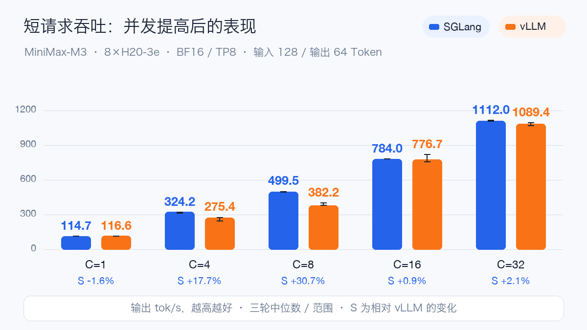
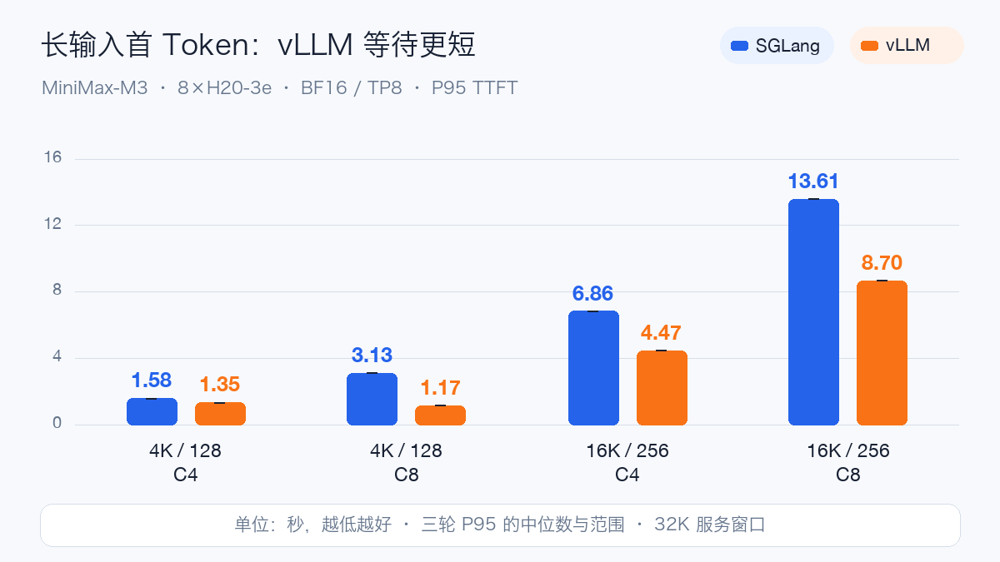
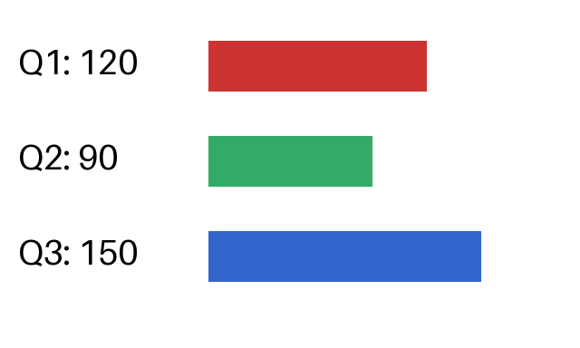

# MiniMax-M3 八卡 H20 实测：SGLang 与 vLLM

MiniMax-M3 是 MiniMax 的原生多模态 MoE 模型，面向代码、工具调用和长流程 Agent。官方模型卡给出约 **428B 总参数、23B 激活参数**，支持文本、图像、视频输入与文本输出，声明 1M Token 上下文；开放权重采用 MiniMax Community License。模型规格依据[官方模型卡](https://huggingface.co/MiniMaxAI/MiniMax-M3)。

MoE 在每个 Token 的计算中激活部分专家，但完整部署仍要容纳全部权重。本次固定版本有 59 个 Safetensors 文件，共 854.18 GB，完整 SHA256 校验通过。部署预算还须覆盖视觉编码器、KV 与稀疏索引缓存、工作区和 CUDA Graph。

M3 在训练中联合处理文字、图片与视频。部署到对话服务后，可以读取截图和图表、理解视频内容，再输出文字或工具调用。本次分别验证图片数值读取、视频颜色顺序、函数调用与代码执行，避免只凭普通聊天成功就推断多模态与 Agent 链路可用。

M3 使用 MiniMax Sparse Attention（MSA）改善长上下文效率。稀疏注意力减少参与注意力计算的范围，但服务仍须管理长请求的缓存、索引和调度。模型声明的 1M 能力、引擎允许的参数与实际通过测试的长度分别记录；本文以 32K 服务窗口进行同机对照。

三种推理模式则决定一次真实对话的生成过程：`enabled` 始终启用推理，`adaptive` 由模型决定何时增加推理，`disabled` 关闭推理。这些模式会改变生成 Token 数和等待时间，因此固定输出长度压测与真实对话验收分别统计。规格及模式定义见[官方说明](https://huggingface.co/MiniMaxAI/MiniMax-M3)。

## 硬件与运行配置

两套引擎串行复用同一台 8×H20-3e，单卡报告 143771 MiB。固定模型 Revision 为 `f0e1c1e04d40177e4673a22097036854f536e9c0`，BF16 TP8，32K 上下文，最大运行请求 32，内存比例 0.85，Prefix Cache 关闭，未启用 MTP/投机解码。两套模型容器均申请 64 CPU、768Gi 主机内存，上限为 128 CPU、1536Gi；同一 CPU 压测客户端申请 4 CPU、8Gi，上限为 8 CPU、16Gi。

SGLang 为 `0.0.0.dev1+g56e290315`，关闭 prefill 分段 CUDA Graph，保留普通解码图；vLLM 为 `0.1.dev17492+g454b47db8`，实际使用该版本的 breakable CUDA Graph 路径。两者均为 Torch 2.11.0+cu130、NCCL 2.28.9；Transformers 分别为 5.8.1 和 5.11.0。这是具体配置的对照，未声称默认配置完全相同。

主矩阵通过同一 CPU 客户端向 `/v1/completions` 提交固定输入/输出长度，使用一致 Tokenizer、Case、随机种子。每引擎 11 个 Case×3 轮，共 **66 轮、7908 个正式请求**；逐轮检查完成数、错误数、输入 Token 和强制输出 Token 数。预热、功能检查、早期 8K Smoke 与失败尝试均不计入主矩阵。

## 主压测结果

下面每项为三轮对应指标的中位数；完整逐轮值及范围见[脱敏数据](../../assets/practices/minimax-m3-h20/benchmark-summary.json)。P95 的三轮中位数不是把所有请求合并后的总体 P95。长输出 C1 每轮只有 6 请求，尾延迟仅描述本轮，不能据此推断生产 P99。输入/输出 Token 用斜线表示。

| 工作负载 | 并发 | SGLang 输出 tok/s | vLLM 输出 tok/s | SGLang P95 TTFT ms | vLLM P95 TTFT ms |
| --- | ---: | ---: | ---: | ---: | ---: |
| 128/64 | 1 | 114.7 | 116.6 | 128.5 | 107.7 |
| 128/64 | 4 | 324.2 | 275.4 | 246.5 | 220.6 |
| 128/64 | 8 | 499.5 | 382.2 | 253.7 | 328.5 |
| 128/64 | 16 | 784.0 | 776.7 | 290.4 | 359.4 |
| 128/64 | 32 | 1112.0 | 1089.4 | 398.4 | 352.3 |
| 4096/128 | 4 | 185.4 | 171.1 | 1582.6 | 1349.2 |
| 4096/128 | 8 | 216.9 | 200.2 | 3134.7 | 1168.1 |
| 16384/256 | 4 | 110.1 | 107.8 | 6855.0 | 4473.8 |
| 16384/256 | 8 | 120.7 | 121.0 | 13614.3 | 8696.4 |
| 128/1024 | 1 | 143.3 | 140.9 | 128.7 | 108.0 |
| 128/1024 | 8 | 624.0 | 488.9 | 245.9 | 328.3 |

短请求从 C1 提高到 C32，SGLang 的吞吐提高到单并发的 9.69 倍，vLLM 的吞吐提高到单并发的 9.35 倍。这是相同短请求形状的并发扩展结果，不能替代长上下文容量测量。

16K 输入、256 输出从 C4 提高到 C8 时，SGLang 吞吐变化 +9.6%，P95 首 Token 等待变为 1.99 倍；vLLM 吞吐变化 +12.2%，P95 首 Token 等待变为 1.94 倍。因此，交互式 RAG 应先确定首 Token 等待目标，再选择并发，吞吐增加并不自动意味着用户体验改善。

## 功能与多模态

主矩阵阶段的 30 秒遥测采样中，SGLang / vLLM 单卡最大显存分别为 121.05 / 117.78 GiB。采样区间包含 Case 预热与客户端启动，离散采样值不等于连续峰值或精确能耗。

| 阶段 | SGLang | vLLM |
| --- | --- | --- |
| 12 项基础功能 | 12/12 PASS | 12/12 PASS |
| 原始纯色图像与视频 | 6/6 正式轮通过；6 配置预热失败 | 6/6 正式轮通过；6 配置预热失败 |
| 带边框图像与视频并发 | 24/24 PASS | 24/24 PASS |
| 原始工具、代码、检索及错误恢复 | 14/28 PASS | 16/28 PASS |
| 显式字段提取 Prompt 检索复测 | 10/10 PASS | 10/10 PASS |

失败项集中在原始纯色图片、关闭推理且只输出整数的数学题、原始长文本检索，以及 SGLang 的损坏媒体错误码；逐项状态保留在功能数据中。主矩阵的零失败仅指固定长度正式请求，不包含这些语义与异常输入检查。

两套引擎的原始测试中，纯红/纯蓝图片均出现颜色误判，各有六个静态图像配置在预热阶段停止；图表 OCR 与视频颜色顺序可以通过。vLLM 排查期间检查 PNG 像素和图像预处理张量，没有发现输入变成黑图的证据。加入边框与标记、改问主体颜色后另开测试，两套引擎各完成 24 轮、384 请求且回答通过；不把它称为修复了模型，也不据此认定根因位于模型或引擎。

两套引擎均未找出原始长文本检索的九个密钥；vLLM 诊断中，该 Prompt 的失败在短文本中也能复现。复测保留正文、密钥和插入位置，只把指令改为 `<document>…</document>` 中的显式字段提取，两套各通过九个含答案样例与一个无答案对照。两组结果分别列出，说明任务对提示词敏感；不能把原始失败直接归结为不支持 32K，也不能用复测覆盖失败记录。

损坏图片和损坏视频的错误处理存在差异：vLLM 返回预期的 HTTP 400；SGLang 返回 HTTP 500，两项判为失败。日志显示 PIL 图片识别错误和 TorchCodec 无效输入错误被包装为 RuntimeError，最终进入服务端内部错误响应。随后正常请求恢复检查通过，未观察到进程退出；这不等于错误码正确。该固定版本的问题尚未修复，接入时应校验媒体输入并区分客户端数据错误与服务端故障，不能把所有 500 简单改写为 400。

以下保留指定样例的实际正文回复；它们说明具体现象，不是独立抽样的准确率评测。相应 Token 用量与原始文件 SHA256 见公开语义样例数据。

| 实际输入 | SGLang 正文回复 | vLLM 正文回复 |
| --- | --- | --- |
| 纯色红图预热 | 1. 黑色 | 1. 黑色 |
| 带边框红图预热 | 红色 | 红色 |
| 只输出整数 / disabled | 264 | 264 |
| 原始长文本检索 | NOT_FOUND | NOT_FOUND |
| 显式字段提取复测 | jade-50-1-259920 | jade-50-1-259920 |

[查看语义样例数据](../../assets/practices/minimax-m3-h20/semantic-examples.json)。

以下使用带白边和黑色标记的图片，询问面积最大的颜色；视频仍是相同红绿蓝素材。每项为三轮对应指标的中位数，单轮 16 请求。图像素材与原始纯色测试不同，两组结果分别保留。

| 输入 | 并发 | SGLang req/s | vLLM req/s | SGLang 中位 E2E ms | vLLM 中位 E2E ms |
| --- | ---: | ---: | ---: | ---: | ---: |
| image-512 | 1 | 6.44 | 8.52 | 155.4 | 117.2 |
| image-512 | 4 | 12.29 | 11.75 | 324.1 | 338.7 |
| image-1024 | 1 | 5.75 | 7.97 | 173.8 | 125.5 |
| image-1024 | 4 | 7.72 | 10.90 | 519.1 | 294.8 |
| two-images-512 | 1 | 4.14 | 5.16 | 241.5 | 193.6 |
| two-images-512 | 4 | 6.79 | 7.84 | 587.6 | 503.1 |
| video-16frames | 1 | 3.11 | 3.27 | 318.7 | 301.7 |
| video-16frames | 2 | 4.39 | 4.51 | 456.3 | 441.3 |

图像并发覆盖 512/1024 单图、两张 512 图片，视频使用 16 帧源素材；每配置 16 请求×3 轮。重复素材可能命中 Processor 缓存，实际视觉 Token 与默认抽帧路径可能不同，因此这些端到端数据不解释为纯视觉 Kernel 性能。

vLLM 另保留了一段已提前结束的低负载观察：实际请求观察跨度 30.07 分钟，共 903 请求、0 失败；单请求 E2E 中位数 120.8 ms。负载约 0.5 req/s，80% 文本、20% 重复图片，最多四个客户端 Worker。这是该时段的观察记录，不是一小时稳定性通过证明，不与 SGLang 做横向对比，也不代表峰值容量。 该时段另有 60 次 GPU 采样，八张卡的首尾显存读数分别保持一致；这只描述观察窗口，不推断长期无泄漏。

32K 检索使用约 31K 正文 Token、三个插入位置各三个密钥及一个无答案对照。正文长度与 Chat Template 开销分开记录。更长上下文、跨节点、固定到达率 SLO 扫描及单变量优化未纳入本轮结论。

## 同一问题的推理模式对照

同一道问题、每模式重复三个实际请求，正确答案为 240。时间是该模式全部请求 E2E 的中位数，错误答案也计入时间，包含首用影响。这不是三个独立题目的准确率测试，也不属于固定长度主压测；不能用它推断一般准确率或生产尾延迟。逐项 completion_tokens 采用 API 返回口径，见功能数据。实际提示词：`一个仓库有240件货物，先发走15%，又入库36件，现在有多少件？只输出最终整数，不要解释。`

| 推理模式 | SGLang 正确次数 | vLLM 正确次数 | SGLang E2E 秒 | vLLM E2E 秒 |
| --- | ---: | ---: | ---: | ---: |
| disabled | 0/3 | 0/3 | 0.132 | 0.117 |
| adaptive | 3/3 | 3/3 | 0.373 | 0.361 |
| enabled | 3/3 | 3/3 | 0.587 | 0.578 |

## 实际 Prompt 与素材

实际提交的部分 Prompt 如下；验收使用温度 0，以减少重复测试的随机性，真实对话使用 `chat_template_kwargs.thinking_mode` 指定模式。官方模型卡推荐通用采样 temperature=1.0、top_p=0.95，本次验收没有采用该采样设置，结果不外推为官方推荐采样下的准确率。

- 数学：`一个仓库有 240 件货物，先发走 15%，又入库 36 件，现在有多少件？只给结论并简要说明。`
- 图表：`读出图中 Q1、Q2、Q3 的数值，指出哪个季度比上季度下降。`
- 视频：`按出现顺序列出视频中背景的三种颜色。`
- 并行工具：`请在本轮同时调用 get_weather 查询广州和北京的天气，不要猜测结果。`
- 代码：`编写Python函数unique_sorted(values)，输入整数列表，返回升序去重后的新列表，不修改原列表。只给一个函数的代码，不要导入模块，不要解释。`

图表标准答案为 Q1=120、Q2=90、Q3=150，Q2 下降；视频颜色顺序为红、绿、蓝。工具使用本地模拟返回值，不执行真实业务操作。代码先经过 AST 限制，再在无凭据、限制 CPU/内存的独立解释器中验收。

[查看颜色顺序视频测试素材](../../assets/practices/minimax-m3-h20/color-order.mp4)。这些是可控测试输入；M3 返回文本理解结果。

## 从镜像到可用服务的修复

镜像依赖检查发现的问题包括 SGLang NIXL 前端及后端依赖、Pillow 版本冲突，以及 vLLM 的 PyGObject 依赖和缺少 PyAV。修复后分别检查依赖闭合、模块入口、CLI 和视频编解码，保留失败尝试，重新记录镜像 digest。

SGLang 首次启动的权重加载耗时约 24 分 42 秒，普通解码图捕获成功，但后续仍要完成 42 档 prefill 分段图初始化，原先 30 分钟整体启动预算所剩时间不足。本次主动结束该尝试，保留日志，把启动探针预算调整为 60 分钟，并关闭 prefill 分段图。第二次功能验收成功。两次缓存条件不同，不能据此计算冷启动加速比。用于正式矩阵的第三次 32K/C32 启动中，各 Rank 权重加载为 488.35–506.34 秒，解码图捕获约 101.7 秒；此时已复用既有缓存，仍不能与 vLLM 的一次加载耗时直接比较。

vLLM 的权重加载耗时 1006.92 秒，图捕获约 12 秒，但首个真实数学请求又触发 Triton Top-K 与稀疏注意力 Kernel 编译，总耗时约 18.7 秒。它属于首请求初始化，未混入主矩阵统计；每个主 Case 另做预热。

无人值守客户端还修复过 ConfigMap 路径问题：解析符号链接后固定到了已经被回收的旧版本目录。保留稳定挂载入口后，在新 attempt 重跑客户端，并通过版本切换回归检查；模型服务不需要重载。

更完整的错误信息、失败尝试、CFS 挂载与优先级准入排查，以及最终参数见[部署测试计划与修复记录](minimax-m3-h20-sglang-vllm-test-plan.md)。

## 复现与边界

模型与镜像清单、启动脚本、验收和压测脚本见[示例目录](https://github.com/runzhliu/aik8s/tree/main/examples/minimax-m3-h20)。能力样本有限，不替代标准准确率评测；首次加载与热缓存重启分别记录。

两套服务均通过 gmanctl 注册到现有 OpenWebUI，并从 OpenWebUI 容器发起真实跨集群请求，验收通过。浏览器连接不可用，未取得前端操作截图；这里的验收范围是配置注册与跨集群 API 调用，不把示意图当作界面证据。 SGLang 另通过 OpenWebUI 应用自身的模型发现与聊天代理接口，真实返回 17+28=45；这项检查也不替代浏览器交互验收。

## 部署建议

1. **按完整八卡互联域分配 TP8。** 本机 GPU 两两显示 NV18，不能仅检查“分到了八张卡”。驱动、链路、拓扑和 NCCL 正确性要在实际容器里验证。
2. **把 GPU 互联与 NUMA 本地性分开检查。** 本机 GPU 0–3 与 4–7 对应不同 NUMA 域。实际快照中，SGLang 四个 Worker 允许 CPU `0-191`，另四个允许 `192-383`；vLLM 八个 TP Worker 均允许 `0-383`，两边允许内存节点均为 `0-1`。本次没有手动统一两套引擎的 CPU 绑定，这也是配置差异。允许集合不等于实际内存驻留位置，但说明 GPU 的 NV18 互联不能替代 CPU 与主机内存本地性检查。CPU 预处理、主机内存和 Host-to-Device 拷贝应单独检查，再做单变量绑定实验，不直接宣称绑核一定加速。
3. **先确定上下文，再测并发。** 这里是 BF16 TP8、32K、最大运行请求 32。SGLang 初始化报告可管理 410,862 Token，vLLM 报告 KV 容量 328,576 Token；两者缓存实现不同，不能只靠容量数字预测速度。vLLM 对每条完整 32K 请求的理论并发估算约 10，这不等于保证十条任意多模态请求都通过。最大运行请求设为 32，也不代表 32 条请求都能同时占满 32K。权重加载成功不代表任意长输入都能同时处理；更长窗口、不同 KV 精度和多机部署需要独立验收。
4. **启动探针覆盖加载与图初始化。** 本次把启动预算设为 60 分钟，并保留运行总期限。SGLang 关闭 prefill 分段图而保留解码图；vLLM 按该固定版本的 breakable graph 路径运行。不要把不同图配置的结果解释为所有版本的引擎差异。
5. **按业务 SLO 选择配置。** 固定长度吞吐、真实 Agent 推理和多模态预处理的瓶颈不同。结合首 Token 延迟、后续 Token 延迟、错误率和显存余量判断，不能只挑最高 tok/s。
