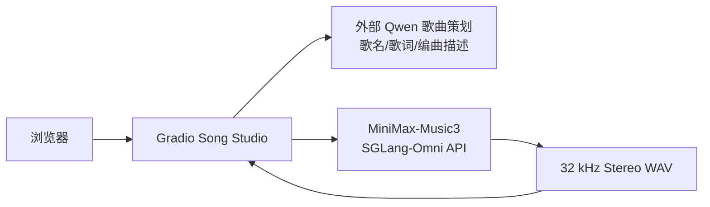
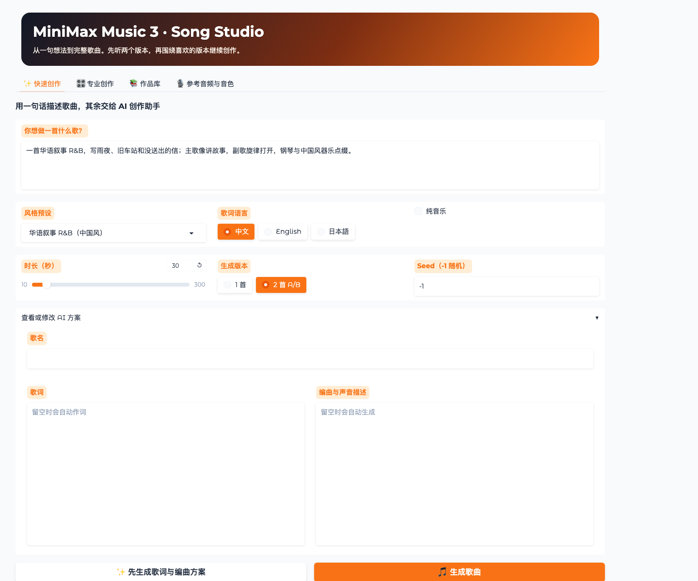

# 用 SGLang-Omni 部署 MiniMax-Music3：从一句创意到完整歌曲

生成式音乐应用通常包含两类完全不同的模型：一类负责理解创作意图、写歌词和整理编曲描述，另一类负责把歌词与编曲条件真正渲染成音频。本文记录一套已经跑通的实现：在 GPU 集群中用 SGLang-Omni 部署 MiniMax-Music3，再接入一个 OpenAI 兼容的大语言模型作为“歌曲策划”，最后用 Gradio 提供接近 Suno 的简化创作界面。

## 发布背景：从在线音乐产品到可部署模型

MiniMax 对生成式音乐的投入并不是从 Music 3 才开始。其公开产品线可以追溯到 2024 年 8 月 31 日发布的 [Music-01](https://www.minimax.io/news/music-01)：当时已经能够同时生成人声与伴奏，但单次时长上限约为 60 秒。此后，[Music 1.5](https://www.minimax.io/news/minimax-music-15) 在 2025 年 9 月把歌曲时长扩展到 4 分钟，[Music 2.0](https://www.minimax.io/news/minimax-music-20) 在同年 10 月继续强化人声、配器和段落结构；到 2026 年初，[Music 2.5](https://www.minimax.io/news/minimax-music-25) 与 [Music 2.6](https://www.minimax.io/news/music-26) 又把段落级控制、乐器表现和翻唱等能力推向更完整的歌曲生产流程。

2026 年 8 月 7 日，[MiniMaxAI/MiniMax-Music3](https://huggingface.co/MiniMaxAI/MiniMax-Music3) 模型仓库在 Hugging Face 上线，公开了可下载的模型资产。六天后的 8 月 13 日，SGLang-Omni 主线通过 [PR #1521](https://github.com/sgl-project/sglang-omni/pull/1521) 加入 Music 3 推理支持，并给出了官方的 [部署与调用示例](https://github.com/sgl-project/sglang-omni/blob/main/docs/cookbook/minimax_music3.md)。从模型公开到主流推理框架接入只相隔不到一周，说明社区对“可自行部署的文本生成音乐”有很强的工程需求。

截至本文验证日 2026 年 8 月 17 日，该模型仓库在约十天内已记录 8,639 次下载和 864 个点赞。这个数字不能直接代表音质排名或市场份额，但足以说明开发者关注度很高。Music 3 更重要的影响在于：生成音乐不再只能停留在厂商网页产品中，团队可以把公开模型资产、可编程推理服务、大模型歌词策划和自己的 UI 串成一条私有工作流，并对提示词、Seed、时长与 A/B 版本进行可复现控制。

这套方案已经在一张 45 GiB NVIDIA L20 上完成验证。20 秒歌曲方案的生成约耗时 27 秒；两段 10 秒音乐采用相邻 Seed 顺序生成，分别耗时 26.6 秒和 18.6 秒。这里的数字只是一次功能验证结果，不应当视为严格性能基准。

## 1. 最终架构

应用由三个部分组成：面向用户的 Gradio UI、负责歌曲策划的大语言模型，以及负责音频渲染的 MiniMax-Music3 服务。



用户只需要输入一句类似下面的描述：

> 一首华语叙事 R&B，写雨夜、旧车站和没送出的信；主歌像讲故事，副歌旋律打开，钢琴与中国风器乐点缀。

外部 Qwen 先把它扩展成结构化歌词和英文制作说明，MiniMax-Music3 再完成整首音乐的演唱与伴奏生成。



*图 1：实际运行的 Gradio 快速创作页。用户输入一句创意后，可以选择风格、语言、时长和 A/B 版本；歌词与编曲描述既可以自动生成，也可以在提交 Music3 前手动修改。*

## 2. 先理解 MiniMax-Music3 是什么

MiniMax-Music3 不是“带背景音乐的 TTS”。它接收两项核心内容：

- `input`：带有 `[Verse]`、`[Chorus]` 等段落标签的歌词。
- `instructions`：曲风、BPM、调性、情绪、声线、配器和混音描述。

随后模型生成 32 kHz 双声道 WAV，其中已经包含人声和伴奏。SGLang-Omni 的官方说明指出，模型内部包含 Qwen3 自回归骨干、RVQ 深度解码器、Flow-Matching DIT、VAE 与 DAC 风格的波形解码器。音频按每秒 25 帧生成，因此：

```text
max_new_tokens = 目标秒数 × 25
```

例如，10 秒试听版使用 `250`，30 秒使用 `750`。该参数是时长上限；模型也可能提前生成结束标记。

当前 MiniMax-Music3 不接受 `ref_audio`、`ref_text` 或指定 `voice`。声线只能通过文字描述，例如“温暖克制的男声”“轻微气声的女声”，不能上传参考录音并要求复刻特定人物。

## 3. 为什么 Hugging Face 权重不能直接交给普通 SGLang

从 Hugging Face 下载的内容只是模型资产，不等于一个可以直接启动的通用 `transformers` 模型。完整目录至少包含类似结构：

```text
MiniMax-Music3/
├── config.json
├── qwen_7B/
│   ├── qwen_7B/
│   │   ├── config.json
│   │   └── model-*.safetensors
│   └── qwen3-8B-tokenizer-music/
├── flowmatching_vae.pth
└── dav.pth
```

其中 Qwen3 只负责预测离散音频帧，后面还有 RVQ、DIT/VAE 和波形解码阶段。普通 SGLang Server 或 `AutoModelForCausalLM` 只认识语言模型部分，不知道如何组织这些音频阶段，也不会返回 WAV。

因此正确关系是：

```text
Hugging Face 权重 + SGLang-Omni 的 MiniMaxMusic3PipelineConfig = 可调用的音乐 API
```

这也解释了“哪里会用到 Qwen”：

1. **Music3 内部 Qwen**：模型权重的一部分，把歌词与编曲描述预测成音频 token；用户不会直接和它聊天。
2. **外部 Qwen 策划服务**：独立的大语言模型，把一句创意扩展成歌名、歌词和制作说明；它不生成音频。

两个 Qwen 处在不同层，不能互相替代。

## 4. 构建可离线启动的 SGLang-Omni 镜像

部署时，上游基础镜像中的 SGLang-Omni 源码与依赖可能落后于 Music3 支持代码。为了避免生产 Pod 启动时再访问 GitHub 或 PyPI，我们采用固定基础镜像摘要、固定 SGLang-Omni commit 的构建方式。

核心 Dockerfile 主要做四件事：

1. 以固定摘要的 CUDA/SGLang 镜像为基础。
2. 固定 SGLang-Omni revision，避免构建结果随 `main` 漂移。
3. 安装 Music3 完整依赖以及匹配的 FlashInfer。
4. 在构建期导入 `MiniMaxMusic3PipelineConfig` 并编译 UI 脚本，尽早发现依赖错误。

```bash
docker buildx build \
  --builder <BUILDX_BUILDER> \
  --platform linux/amd64 \
  --file Dockerfile \
  --provenance=false \
  --sbom=false \
  --output type=image,name=REGISTRY/PROJECT/sglang-omni:minimax-music3-c737bb2-cu13,push=true,oci-mediatypes=false \
  .
```

模型权重不复制进运行时镜像，而是在启动时通过 `--model-path` 指向已经准备好的模型目录。模型资产如何进入运行环境不在本文讨论范围内。

如果将来官方发布了与目标 commit、CUDA 和 FlashInfer 完全匹配的镜像，可以直接替换；否则固定源码和依赖比在 Pod 启动时临时安装更稳定。

## 5. 部署单卡 Music3

模型容器的关键启动参数如下：

```yaml
command: ["sgl-omni"]
args:
  - serve
  - --model-path
  - /model-runtime
  - --host
  - 0.0.0.0
  - --port
  - "8000"
  - --max-running-requests
  - "1"
  - --mem-fraction-static
  - "0.65"
```

在一张 L20 上，AR 和 DIT/DAV 阶段可以共置。`--max-running-requests=1` 优先保证单卡显存稳定；`--mem-fraction-static=0.65` 为 Qwen KV Cache 与声学阶段共同留下足够空间。

UI 脚本可以通过 ConfigMap 单独管理，修改界面时不必重建大体积运行时镜像。下面使用标准 `kubectl`，并用占位符表示 kubeconfig context、命名空间和资源清单：

```bash
kubectl --context <GPU_CONTEXT> --namespace <NAMESPACE> apply \
  -f <DEPLOYMENT_MANIFEST>

kubectl --context <GPU_CONTEXT> --namespace <NAMESPACE> rollout status \
  deployment/sglang-minimax-music3 --timeout=12m

kubectl --context <GPU_CONTEXT> --namespace <NAMESPACE> get pods \
  -l app.kubernetes.io/name=sglang-minimax-music3 -o wide
```

Music3 首次启动会加载 Qwen 权重、DIT/DAV，并捕获 CUDA Graph。只有 Pod 显示 `2/2 Running` 后，UI 与 API 才都已就绪。

## 6. 直接调用音乐 API

调试时可以先做端口转发：

```bash
kubectl --context <GPU_CONTEXT> --namespace <NAMESPACE> port-forward \
  service/<MUSIC3_SERVICE> 17860:7860 18000:8000 \
  --address 127.0.0.1
```

先检查健康状态：

```bash
curl http://127.0.0.1:18000/health
```

再生成一段 10 秒试听：

```bash
curl -X POST http://127.0.0.1:18000/v1/audio/speech \
  -H 'Content-Type: application/json' \
  -d '{
    "model": "MiniMaxAI/MiniMax-Music3",
    "input": "[Verse]\n雨打旧车站\n信折在口袋\n[Chorus]\n风停了 心却乱",
    "instructions": "Mandarin narrative R&B at 88 BPM in a minor key: felt piano, dry hip-hop drums, round bass, subtle guzheng and bamboo flute, warm intimate male vocal, restrained cinematic nostalgia",
    "seed": 260817,
    "max_new_tokens": 250,
    "response_format": "wav",
    "stream": false
  }' \
  --output music3-test.wav
```

歌词段落标签必须单独占一行。不要写成 `[Verse] 雨打旧车站`，否则标签后的同一行歌词可能在规范化时丢失。

## 7. 用大语言模型自动写歌词和编曲描述

UI 连接一个独立的 OpenAI 兼容 Qwen 服务。地址与模型名称通过环境变量配置，不应硬编码进公开文章：

```text
SONG_PLANNER_API_BASE=http://<LLM_SERVICE>:8000/v1
SONG_PLANNER_MODEL=<LYRIC_MODEL>
```

它的任务不是“凭空写一篇诗”，而是输出可以直接交给 Music3 的结构化 JSON：

```json
{
  "title": "雨夜旧站",
  "lyrics": "[Intro]\n...\n[Verse]\n...\n[Chorus]\n...",
  "caption": "Global Metadata: ...\n\nVocal Details: ...\n\nArrangement: ..."
}
```

请求中的关键设置如下：

```python
payload = {
    "model": os.environ["SONG_PLANNER_MODEL"],
    "messages": [
        {
            "role": "system",
            "content": (
                "You are a professional songwriter and music producer. "
                "Return one JSON object with title, lyrics and caption. "
                "Use section tags on their own lines. Caption paragraphs must "
                "start with Global Metadata, Vocal Details and Arrangement. "
                "Describe musical attributes rather than imitating a real artist."
            ),
        },
        {
            "role": "user",
            "content": (
                "Creative brief: 雨夜、旧车站和没送出的信\n"
                "Style: Mandarin narrative R&B, piano, Chinese instruments\n"
                "Target duration: 30 seconds\nLanguage: 中文"
            ),
        },
    ],
    "temperature": 0.75,
    "max_tokens": 1800,
    "response_format": {"type": "json_object"},
    "chat_template_kwargs": {"enable_thinking": False},
}
```

这里最关键的是 `enable_thinking=False`。我们第一次测试时保留了 Qwen 的长思考模式，推理过程消耗了输出预算，最后正文 JSON 被截断。关闭思考模式后，模型直接返回完整方案，延迟也明显下降。

拿到结果后还应做三层校验：

1. HTTP 状态码必须成功。
2. `message.content` 必须是非空字符串，并能解析成 JSON 对象。
3. `lyrics` 与 `caption` 都不能为空，歌词标签格式必须正确。

然后把 Qwen 的结果映射到 Music3：

```text
Qwen.title   -> UI 歌名和历史记录
Qwen.lyrics  -> Music3 input
Qwen.caption -> Music3 instructions
```

需要强调的是，大模型应当把用户提到的歌手偏好转译成高层音乐属性，例如“华语叙事 R&B、切分鼓点、钢琴、中国器乐、主歌口语化、副歌旋律展开”，而不是要求复制某位真实歌手的声线、旋律或具体作品。

## 8. 为什么要做 A/B Seed 工作流

Music3 在歌词、caption、Seed 和时长完全相同时具有可复现性。修改 Seed 则会得到同一创意下的另一种编曲和演唱结果。因此 UI 默认提供：

- 版本 A：随机或用户指定的 Seed。
- 版本 B：`Seed + 1`。
- 保留相同歌词、caption 和时长，便于公平比较。
- 从作品库复用时再次执行 `Seed + 1`，继续探索变体。

单卡部署设置了单并发，A/B 会顺序生成。这比让两个请求同时争抢显存更稳。实践中建议先生成 10 秒试听，确认声线与编曲方向，再提交 30 秒或完整歌曲。

## 9. 验证清单

部署完成后，可以按下面的顺序检查：

```bash
# GPU Pod 与两个容器
kubectl --context <GPU_CONTEXT> --namespace <NAMESPACE> get pods \
  -l app.kubernetes.io/name=sglang-minimax-music3

# API 日志中应出现 reference_audio: false 和服务启动完成
kubectl --context <GPU_CONTEXT> --namespace <NAMESPACE> logs \
  deployment/sglang-minimax-music3 -c api --tail=100

# UI 日志
kubectl --context <GPU_CONTEXT> --namespace <NAMESPACE> logs \
  deployment/sglang-minimax-music3 -c ui --tail=100
```

应用层至少完成四项真实验证：

1. `/health` 返回 `200`，并显示 preprocessing、AR、DIT/DAV 阶段健康。
2. Qwen 能返回完整的 `title/lyrics/caption` JSON。
3. Music3 能生成 RIFF/WAV，并且实际时长符合 `max_new_tokens / 25`。
4. UI 可以试听和下载生成结果，A/B 两个版本使用相邻但不同的 Seed。

## 10. 常见问题总结

### Hugging Face 权重已经下载，为什么仍然不能启动？

因为 Music3 不是一个单阶段语言模型。需要 SGLang-Omni 的专用 pipeline 连接 Qwen、RVQ、DIT/VAE 和波形解码器。

### 一定要重新构建镜像吗？

如果现成镜像的 SGLang-Omni revision、CUDA 和 FlashInfer 已经包含并兼容 Music3，可以直接拉取。本文环境中的公开基础镜像与所需源码存在版本差，因此构建了一次固定版本的运行时镜像。后续仅改 Gradio UI 时使用 ConfigMap，不再重建大镜像。

### 为什么不直接让 Music3 自己写歌词？

Music3 内部的 Qwen 是音频 token 骨干，不是对外的通用对话模型。独立的 Qwen 规划服务更适合处理主题、叙事、段落长度、语言和编曲结构。

### 能否上传一段声音作为歌手音色？

当前 Music3 接口不支持。如果需要参考音频控制全局音色和制作风格，可以独立部署 ACE-Step 1.5；如果要在已授权的前提下转换演唱音色，可以采用“Music3 生成 → 人声分离 → Seed-VC 歌声转换 → 重新混音”的后处理链路。

## 11. 结语

这套方案的核心不是简单地把两个模型串起来，而是明确分工：大语言模型负责把模糊创意变成结构化歌曲方案，MiniMax-Music3 专注于音频生成，Gradio 负责把复杂参数收敛成一句话创作、专业编辑、A/B 对比和作品回放。

当运行时版本、模型目录和 Qwen 输出约束都处理正确后，MiniMax-Music3 可以作为一个普通的 OpenAI 风格音频服务使用，而最终用户不需要接触 ComfyUI 节点图或底层音频 token。

## 参考资料

- [SGLang-Omni：MiniMax Music 3 Cookbook](https://github.com/sgl-project/sglang-omni/blob/main/docs/cookbook/minimax_music3.md)
- [MiniMaxAI/MiniMax-Music3](https://huggingface.co/MiniMaxAI/MiniMax-Music3)
- [ACE-Step 1.5 Tutorial](https://github.com/ace-step/ACE-Step-1.5/blob/main/docs/en/Tutorial.md)
- [Seed-VC](https://github.com/Plachtaa/seed-vc)
