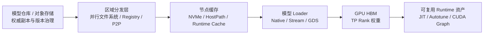

# 大模型权重分发与加载加速：社区与商业方案选型

大模型扩容慢，通常被概括成“模型下载慢”。这个说法太粗了。

同一份权重可能先从模型仓库进入对象存储，再经过共享文件系统或 P2P 网络到达节点 NVMe，随后由推理引擎完成反序列化、CPU 到 GPU 搬运、量化后处理和 Kernel 编译。只优化其中一段，瓶颈很容易移动到下一段。

当前测试材料也说明了问题的规模：一份 GLM-5.2 FP8 权重包含 141 个 Safetensors 分片；此前约 156 GiB、48 分片的 DeepSeek V4 Flash，在节点本地盘已经命中时，加载和 Runtime 初始化仍然需要数分钟。共享存储“能够挂载并读到文件”，不等于发布风暴时仍能稳定支撑所有实例并发启动。

这篇专题不把社区项目和商业产品简单排成一张排行榜，而是先回答三个问题：

1. 每个方案优化的是哪一段，是否真的覆盖当前瓶颈；
2. 它要求改变模型格式、推理引擎、节点存储或网络吗；
3. 节省的 GPU 等待时间，是否值得新增基础设施和运维复杂度。

## 1. 先把权重交付拆成五层



五层分别解决不同问题：

| 层次 | 核心问题 | 典型手段 | 常见误判 |
| --- | --- | --- | --- |
| 权威副本 | 模型版本、Digest、权限和回滚 | 对象存储、模型仓库、OCI Registry | 把每个 Pod 的临时下载目录当成模型仓库 |
| 区域分发 | 多节点同时取同一模型时，如何避免压垮源站 | Lustre 类并行文件系统、Dragonfly P2P、区域副本 | 共享挂载成功就等于可承受启动风暴 |
| 节点缓存 | 同一节点重启或复用时，能否避免再次回源 | NVMe、KServe LocalModelCache、Fluid Runtime | 用无锁 HostPath 脚本处理并发下载和 GC |
| Loader | 文件怎样高并发读入并进入各个 TP Rank | vLLM Native、Run:ai Model Streamer、Tensorizer、GDS | 磁盘读完就等于模型 Ready |
| Runtime 资产 | JIT、Autotune、Kernel 和 Graph 能否复用 | 预编译缓存、ModelExpress、固定兼容性指纹 | 只保存权重，忽略数分钟现场编译 |

可以把业务可用时间近似写成：

```text
T_ready = T_schedule + T_image + T_distribute + T_load + T_runtime + T_warmup
```

流式加载可以让部分阶段重叠，因此最终不是机械相加；但至少要分别打点，才能知道优化是否击中了关键路径。

## 2. 社区方案：它们不是同一种产品

### 2.1 最小基线：对象存储或共享文件系统直接读取

最简单的方案是让 Init Container 从对象存储下载，或让 Engine 直接读取 CFS Turbo、Lustre、CephFS 一类共享文件系统。

它适合副本少、发布频率低的场景，也是所有复杂方案的对照组。并行文件系统能提供统一路径和较高聚合带宽，但仍要测元数据并发、单目录大量分片、客户端缓存、首读回源以及多节点同时加载。它解决“每个节点都要保存完整权威副本”的问题，却不天然等于节点热缓存，也不能消除 CPU 到 GPU 搬运和 Runtime 初始化。

当前环境可以先保留并行文件系统作为共享交付层，再把热点模型预热到节点 NVMe。这样不需要立刻引入新的控制平面，也能把“共享存储读取”和“本地加载”两个变量分开。

### 2.2 KServe LocalModelCache：把节点缓存变成可管理对象

[KServe Local Model Cache](https://kserve.github.io/website/docs/model-serving/generative-inference/modelcache/localmodel/) 用 `LocalModelCache`、`LocalModelNodeGroup` 等资源描述模型、目标节点和本地路径，由控制器跟踪节点缓存状态，再让模型服务复用本地副本。

它比手写 Init Container 多解决了几件事：

- 缓存状态进入 Kubernetes API，不必靠人工登录节点判断；
- 可以按节点组预热，并与模型服务调度配合；
- 模型版本、缓存路径和 Pod 生命周期不再完全耦合。

它最适合已经使用 KServe，或者希望用 Kubernetes CRD 管理 NVMe 缓存的团队。代价是新增控制器、节点权限、磁盘配额和 GC 规则；它也不会自动加速 GPU Loader。

### 2.3 Fluid、Alluxio 与 JuiceFS：用数据编排层做缓存

[Fluid](https://fluid-cloudnative.github.io/) 把数据集、Runtime、预热和数据感知调度抽象成 Kubernetes 资源，可接入 Alluxio 等缓存运行时。[Alluxio](https://docs.alluxio.io/os/user/edge/en/overview/Architecture.html) 提供多层缓存和底层存储抽象；[JuiceFS CSI](https://juicefs.com/docs/csi/guide/cache/) 也支持客户端本地缓存，并可通过 Warmup Job 提前把数据拉到节点。

这类方案的优势是模型之外的数据集、Checkpoint 和特征数据也能复用同一数据平面。它们更像通用数据基础设施，而不是专用模型 Loader。对只有少量固定模型的推理池，控制面、缓存一致性和容量治理可能重于收益；对训练、Notebook、推理共同消费大量数据的集群，复用价值会更高。

### 2.4 Dragonfly：解决大规模扇出和源站惊群

[Dragonfly](https://d7y.io/docs/) 用 P2P 网络让已经下载数据的节点成为 Peer，降低 Registry、对象存储或文件服务器承受的重复流量。它适合几十到数百节点同时拉取相同权重或镜像的场景。

社区还在推进 [Harbor、ModelPack 与 Dragonfly 的模型制品和分发组合](https://d7y.io/blog/2026/03/11/cloud-native-ai-model-management-and-distribution-for-inference-workloads/)：模型以 OCI 制品治理，再通过 P2P 分发到节点。项目公开的百节点、TB 级数字可以用来理解上限方向，但属于项目环境结果，不能替代目标网络、磁盘和模型分片下的实测。

Dragonfly 优化的是“远端到节点”，不是“节点到 GPU”。如果只有两个节点，或源站从未成为瓶颈，引入 Scheduler、Seed Peer、Peer GC 和拓扑策略往往得不偿失。

### 2.5 OCI Model Artifact 与 Kubernetes Image Volume：先统一治理

把模型封装成 OCI Artifact，可以复用 Registry 的 Digest、签名、权限、跨区域复制和审计能力。Harbor、ModelPack 等项目都在推动这条路径。[Kubernetes Image Volume](https://kubernetes.io/docs/concepts/storage/volumes/#image) 还能把 OCI 对象以只读 Volume 暴露给容器，但其功能阶段和 CRI 支持需要按集群版本验证。

OCI 主要解决供应链和交付一致性。超大 Manifest、数百 GiB Layer、Registry GC、解压临时空间和运行时并发拉取仍需压测，不能因为“模型也成为镜像”就假设速度一定更快。

### 2.6 Run:ai Model Streamer：让读取和 GPU 搬运并行

[vLLM 的 Run:ai Model Streamer 扩展](https://docs.vllm.ai/en/latest/models/extensions/runai_model_streamer/) 可以从本地文件系统和对象存储并发读取 Safetensors，并以流式方式向 GPU 搬运。分布式模式还能让各 TP Rank 读取自己需要的权重，减少串行加载和 CPU 内存压力。

这里要区分两件事：Model Streamer 是可集成到 vLLM 镜像中的公开组件；NVIDIA Run:ai 的完整调度平台、企业能力和支持是商业产品。评估时还要固定并发线程、对象存储连接数、TP、CPU/NUMA 和网络，否则“Streamer 更快”很容易只是增加了源端并发。

### 2.7 Tensorizer、FastSafetensors 与 ServerlessLLM：为加载路径换格式或换实现

- [Tensorizer](https://docs.vllm.ai/en/latest/models/extensions/tensorizer/) 把模型预先序列化成适合流式读取的格式，可从磁盘、HTTP 或对象存储加载；收益要与额外转换、版本兼容和双份制品成本一起计算。
- [FastSafetensors](https://docs.vllm.ai/en/latest/models/extensions/fastsafetensor/) 尝试通过并行读取和 GPUDirect Storage 缩短路径，但依赖特定硬件、驱动和版本组合，应按实验性能力验收。
- [ServerlessLLM](https://github.com/ServerlessLLM/ServerlessLLM) 采用面向加载优化的 Checkpoint 布局、`O_DIRECT`、Pinned Memory、多层存储和存储感知调度。论文和项目数字展示了较大加速空间，但格式转换和 Runtime 集成意味着它不是无侵入替换。

这些方案的共同点是：为了加载速度改变制品布局或 Loader。上线前必须比较输出正确性、稳态吞吐、转换流水线和回滚路径，而不只看一次启动秒数。

### 2.8 ModelExpress：从已就绪 GPU 副本复制权重和编译资产

[ModelExpress](https://github.com/ai-dynamo/modelexpress) 把来源按优先级组织成一条加载级联：优先从兼容的在线 Peer 通过 NIXL/RDMA 复制 GPU 权重，其次尝试 Model Streamer、GDS，最后回退到原生加载；它还可以传递匹配的 JIT/Kernel 资产。

这条路径的价值在于：滚动发布时，集群里通常已经存在同模型、同 Runtime 的健康副本，不必再次从冷存储开始。项目公开 Benchmark 中，特定 B200、ConnectX-7 和 DeepSeek-V4-Pro 环境的 Peer 权重复制达到十几秒量级，并明显缩短 API Ready；这是项目结果，不是 H20 环境的承诺。

实际约束也更强：

- 来源和目标的 GPU 架构、TP、量化方式、Runtime Image 与模型 Digest 必须兼容；
- RDMA、NIXL 和 GPU Direct 的数据路径要用指标证明，不能只看设备存在；
- TP 场景必须确认每个 Rank 只读取所需张量。项目文档也提示，某些 GDS 路径可能让每个 Rank 读取完整 Tensor，反而放大 I/O；
- 没有健康 Peer 时必须可靠回退到对象存储或本地缓存；
- 这是快速演进的项目，适合探索和严格 A/B，暂不应成为唯一恢复路径。

## 3. 商业方案：购买的是集成、SLA 和运维边界

付费方案并不一定拥有完全不同的传输算法。它们通常把硬件拓扑、驱动、缓存、监控、升级和支持打包起来，减少团队自行集成的边界。

| 方案类别 | 代表方案 | 主要价值 | 主要成本与约束 |
| --- | --- | --- | --- |
| 云对象存储 + 托管并行文件系统 | 腾讯云 COS/CFS Turbo、[Amazon FSx for Lustre](https://docs.aws.amazon.com/fsx/latest/LustreGuide/fsx-data-repositories.html)、[Azure Managed Lustre](https://learn.microsoft.com/en-us/azure/azure-managed-lustre/blob-integration) | 托管容量、聚合吞吐、对象存储联动和 SLA | 容量与吞吐计费、首读回源、可用区流量、厂商绑定 |
| 企业推理制品 | [NVIDIA NIM 与 NIM Operator Model Cache](https://docs.nvidia.com/nim-operator/latest/cache-llm.html) | 经过验证的模型 Profile、容器、缓存 CRD 和企业支持 | 订阅与许可、支持矩阵、对 NIM 运行方式的约束 |
| 企业 AI 调度平台 | NVIDIA Run:ai | 调度、配额、拓扑、可观测性和企业支持；可与 Model Streamer 组合 | 平台费用和集成边界；不能把平台能力等同于 Loader 本身 |
| 商业数据平台 | Alluxio Enterprise、JuiceFS Enterprise/Cloud 等 | 跨存储缓存、数据治理、多集群和商业支持 | 额外数据控制面、节点资源开销、按容量或节点付费 |
| 高性能存储设备或服务 | NVMe-oF、并行文件系统、商业 Data Fabric | 高聚合带宽、低时延和成熟运维工具 | 网络与存储硬件成本、拓扑设计、容量利用率 |

选商业方案前应要求供应商在自己的模型、节点和并发规模上完成验收。只给顺序读带宽或单节点最佳值，不足以证明发布风暴、缓存未命中和故障回退满足 SLO。

## 4. 横向选型表

| 方案 | 主要优化层 | 改模型格式 | 依赖 RDMA/GDS | 适用规模 | 首要风险 |
| --- | --- | --- | --- | --- | --- |
| Init Container + 对象存储 | 权威副本 → 节点 | 否 | 否 | 少量副本、基线 | 重复流量、锁与失败残留 |
| 并行文件系统直读 | 区域分发 | 否 | 否 | 中等规模共享读取 | 元数据、并发首读和成本 |
| NVMe + DaemonSet/LocalModelCache | 节点缓存 | 否 | 否 | 节点反复重启 | 容量、GC、调度一致性 |
| Fluid/Alluxio/JuiceFS | 数据缓存与编排 | 否 | 否 | 训练、开发、推理共用数据 | 控制面和一致性复杂度 |
| Dragonfly | 大规模 P2P 分发 | 否 | 否 | 数十至数百节点扇出 | Peer 拓扑、回源和 GC |
| OCI Model Artifact | 制品治理与复制 | 需要重新打包 | 否 | 多环境发布 | 超大 Layer 和 CRI/Registry 兼容 |
| Run:ai Model Streamer | 并行读取与 H2D | 通常否 | 可选 | vLLM、对象存储或本地盘 | 版本、TP 和源站并发 |
| Tensorizer/ServerlessLLM | 制品布局与 Loader | 是 | 可选 | 冷启动敏感、可维护转换链路 | 生态兼容和双份制品 |
| ModelExpress | GPU Peer、Loader、JIT 资产 | 通常否 | Peer 快路径需要 | 有兼容在线副本的滚动发布 | 成熟度、兼容指纹和回退 |
| NIM/托管存储/企业数据平台 | 多层集成 | 视产品而定 | 视产品而定 | 希望缩小自运维边界 | 费用、锁定和黑盒调优 |

“社区”与“收费”不是互斥关系。更常见的组合是：开源控制器和 Loader，加上收费的对象存储、并行文件系统、NVMe 与网络；或者先用社区版验证，再购买企业支持和托管服务。

## 5. 当前 H20 环境怎么选

现有环境已经具备四块拼图：对象存储、CFS Turbo/Lustre 类共享路径、节点本地 NVMe 和 H20 节点。优先级不应该是立刻再部署一个平台，而是按同一模型、同一 Runtime 做分层 A/B。

### P0：建立无争议的基线

使用同一份 GLM-5.2 FP8 权重、同一镜像、TP=8 和同型号 H20，分别测试：

1. 共享并行文件系统冷缓存直读；
2. 共享并行文件系统热缓存直读；
3. 预复制到节点 NVMe 后原生加载；
4. 节点 NVMe 热缓存重启。

这一步只改变存储入口。此前 DeepSeek V4 Flash 的 NVMe 与普通跟盘实测中，权重阶段只缩短约 29 秒，说明当 JIT 和 CUDA Graph 占据更多时间时，更快的盘不会按带宽比例缩短 Ready 时间。

### P1：把 NVMe 缓存产品化

如果 NVMe 命中稳定带来收益，再选择 KServe LocalModelCache、Fluid，或者一个职责收敛的 DaemonSet 管理预热、Digest、锁、原子完成标记、配额和 GC。不要先做复杂 P2P，再补最基本的缓存正确性。

### P2：比较原生 Loader 与流式 Loader

在 vLLM 兼容版本中加入 Run:ai Model Streamer，分别从共享路径、NVMe 和对象存储读取。固定 TP Rank 的读取范围，记录 CPU、Host Memory、对象存储 QPS、H2D 带宽和加载时间。只有 Loader 阶段显著下降且输出、吞吐无回归，才值得固化镜像。

### P3：源站真正饱和后再引入 Dragonfly

把副本数按 1、2、4、8 逐步放大。若源站吞吐达到上限、单节点完成时间随规模显著恶化，再用 Dragonfly 对比源站出流、总重复字节、P95 完成时间和失败重试。两节点实验不足以证明 P2P 的规模收益。

### P4：用 ModelExpress 验证滚动发布快路径

在两台硬件、Runtime 和模型指纹完全一致的节点上，保留一个 Ready 源实例，验证目标实例能否依次完成：发现 Peer、建立 NIXL/RDMA 通道、按 TP Rank 复制、复用兼容 JIT 资产、通过确定性请求校验；随后主动破坏 Peer，确认能够回退到 NVMe 或共享存储。

ModelExpress 优先针对“已有健康副本的滚动发布”，而不是替代对象存储中的权威副本。

## 6. 一套可复现的测试矩阵

### 6.1 固定变量

- 模型名称、Revision、Digest、分片数和总字节数；
- Runtime Image Digest、vLLM/SGLang、CUDA、驱动和 Loader 版本；
- GPU 型号、TP、节点数、CPU/NUMA、内存和网络拓扑；
- 上下文长度、量化参数、CUDA Graph 和编译开关；
- 冷页缓存、热页缓存、节点缓存命中、Peer 命中四种状态。

### 6.2 时间点

```text
t0  Pod 创建
t1  镜像与存储可用
t2  模型版本与缓存状态确认
t3  权重读取开始
t4  权重读取完成
t5  GPU 权重加载完成
t6  JIT / Autotune 完成
t7  CUDA Graph / Warm-up 完成
t8  健康检查通过
t9  第一条确定性请求正确返回
```

至少报告 `t4-t3`、`t5-t3`、`t8-t0` 和 `t9-t0` 的 p50/p95。只报告进程日志中的 `model loaded`，会漏掉调度、挂载、JIT、Graph 和业务请求验证。

### 6.3 成本和正确性指标

| 维度 | 指标 |
| --- | --- |
| 分发 | 源站出流、重复字节、每节点吞吐、对象存储 QPS、失败与重试 |
| 节点 | NVMe 使用量、缓存命中率、GC 时长、CPU、内存和 Page Cache |
| GPU | H2D/RDMA 有效带宽、GPU 空等时间、加载期间功耗 |
| 服务 | Ready p50/p95、首请求 TTFT、稳态吞吐和延迟 |
| 正确性 | 固定 Prompt/Seed 输出、Logprob 或校验集、异常 Token、权重版本 |
| 成本 | GPU 等待分钟、存储容量、网络流量、常驻 Peer 和平台订阅费用 |

## 7. 必须提前设计的失败路径

无论采用社区还是商业方案，都要验证：

- 下载中断后不会把半成品标记为缓存命中；
- 同一节点并发启动只产生一次有效下载；
- Digest 或签名不匹配时拒绝加载并留下可定位事件；
- 节点磁盘不足时有明确的保留版本和 GC 顺序；
- P2P Peer 消失、数据损坏或网络降级时可以回到权威副本；
- Loader、TP、量化和 GPU 架构不兼容时不会错误复用权重或编译缓存；
- 凭据只通过 Secret 和工作负载身份注入，日志与公开文档不出现密钥、桶地址、内部 IP 和集群标识。

## 8. 结论

对当前环境，推荐的组合不是单一产品，而是一条逐层演进的路径：

```text
对象存储保留不可变权威副本
  → 并行文件系统承担共享交付
  → 节点 NVMe 缓存热点模型
  → 用流式 Loader 优化读取与 H2D
  → 达到规模阈值后引入 Dragonfly P2P
  → 有兼容在线副本和 RDMA 时探索 ModelExpress
```

副本少、模型稳定时，共享存储加 NVMe 预热通常性价比最高；几十个节点同时扩容时，P2P 才开始解决真实的源站扇出；要求滚动发布极快、且能长期维护硬件和 Runtime 兼容指纹时，GPU Peer 与编译资产复用才值得投入。

最终验收目标应该是“在指定缓存状态和副本规模下，P95 业务 Ready 时间、源站流量和单次扩容成本达到多少”，而不是“部署了多少个加速组件”。

延伸阅读：

- [从半小时到五分钟：大模型冷启动全链路优化](llm-cold-start-optimization.md)：权重加载之后的 JIT、CUDA Graph 与恢复路径；
- [70B 模型向百节点分发](model-distribution-100-nodes.md)：分批预热、P2P 和源站惊群实验；
- [大模型与数据制品](../data/model-artifacts.md)：模型版本、Digest、OCI 与供应链治理。
